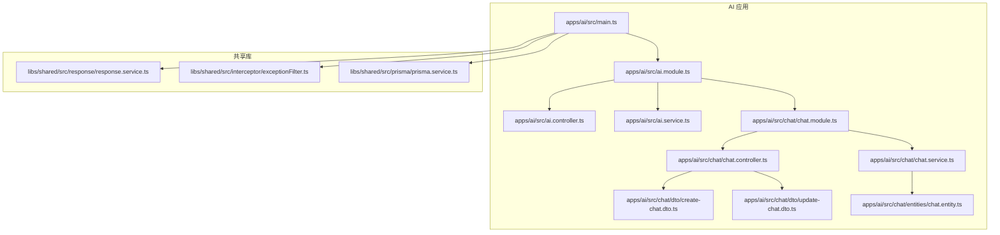
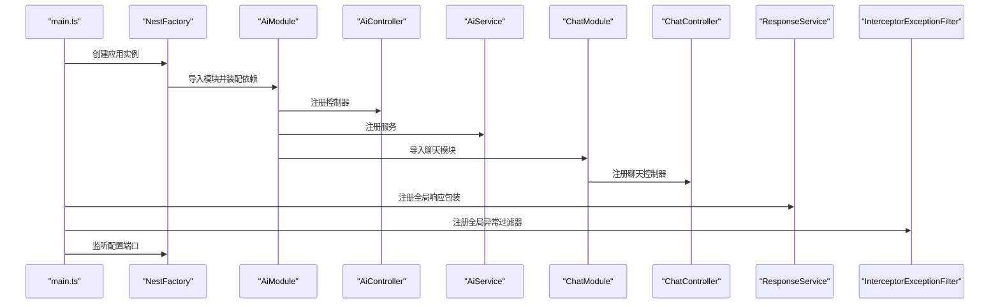
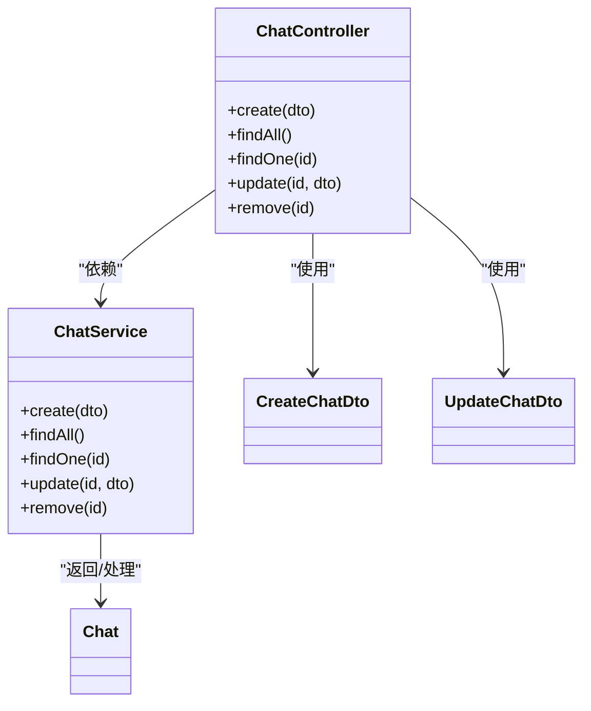
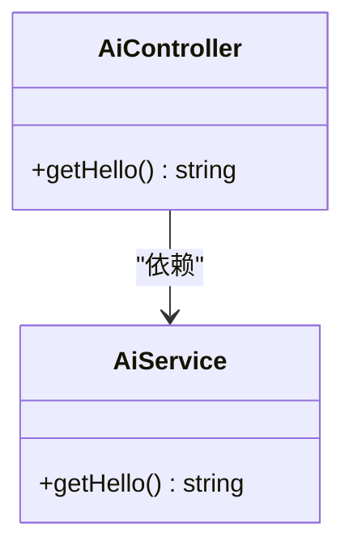
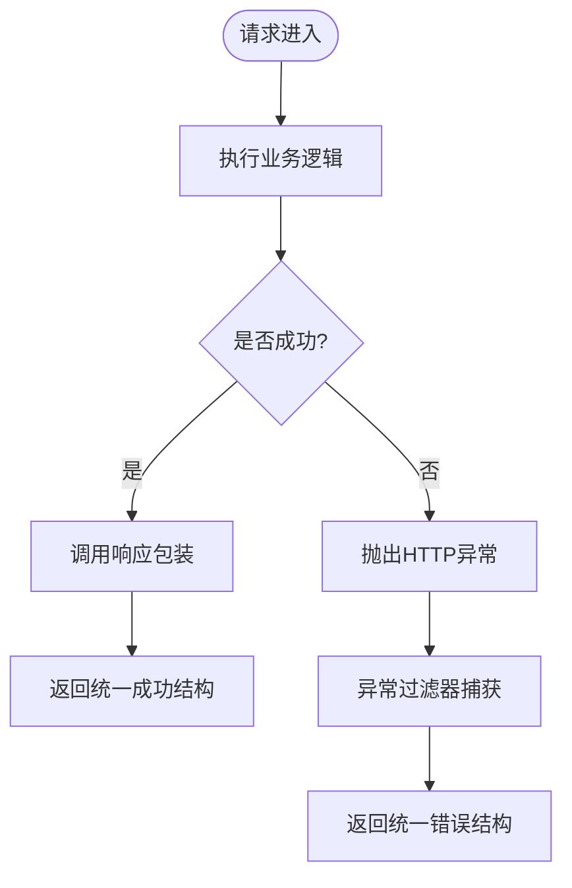
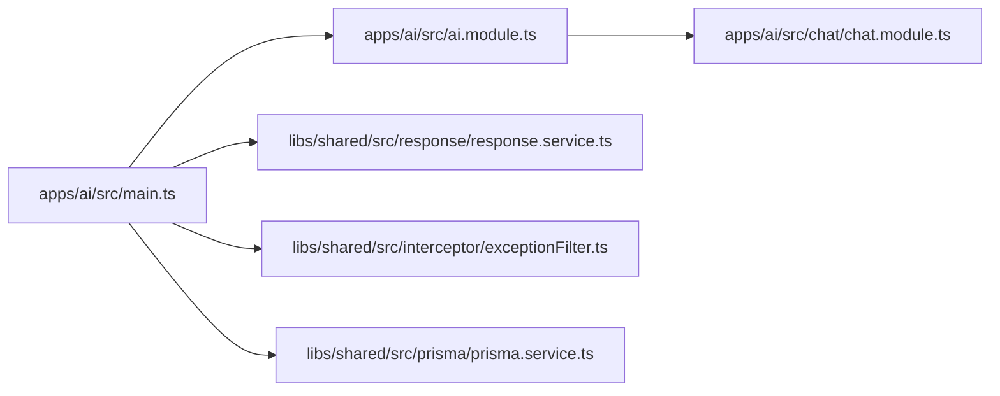

# AI服务API

<cite>
**本文引用的文件**
- [server/apps/ai/src/ai.controller.ts](file://server/apps/ai/src/ai.controller.ts)
- [server/apps/ai/src/ai.service.ts](file://server/apps/ai/src/ai.service.ts)
- [server/apps/ai/src/ai.module.ts](file://server/apps/ai/src/ai.module.ts)
- [server/apps/ai/src/main.ts](file://server/apps/ai/src/main.ts)
- [server/apps/ai/src/chat/chat.controller.ts](file://server/apps/ai/src/chat/chat.controller.ts)
- [server/apps/ai/src/chat/chat.service.ts](file://server/apps/ai/src/chat/chat.service.ts)
- [server/apps/ai/src/chat/chat.module.ts](file://server/apps/ai/src/chat/chat.module.ts)
- [server/apps/ai/src/chat/dto/create-chat.dto.ts](file://server/apps/ai/src/chat/dto/create-chat.dto.ts)
- [server/apps/ai/src/chat/dto/update-chat.dto.ts](file://server/apps/ai/src/chat/dto/update-chat.dto.ts)
- [server/apps/ai/src/chat/entities/chat.entity.ts](file://server/apps/ai/src/chat/entities/chat.entity.ts)
- [server/libs/shared/src/response/response.service.ts](file://server/libs/shared/src/response/response.service.ts)
- [server/libs/shared/src/interceptor/exceptionFilter.ts](file://server/libs/shared/src/interceptor/exceptionFilter.ts)
- [server/libs/shared/src/prisma/prisma.service.ts](file://server/libs/shared/src/prisma/prisma.service.ts)
- [server/package.json](file://server/package.json)
</cite>

## 目录
1. [简介](#简介)
2. [项目结构](#项目结构)
3. [核心组件](#核心组件)
4. [架构总览](#架构总览)
5. [详细组件分析](#详细组件分析)
6. [依赖关系分析](#依赖关系分析)
7. [性能考虑](#性能考虑)
8. [故障排查指南](#故障排查指南)
9. [结论](#结论)
10. [附录](#附录)

## 简介
本文件为“AI智能问答服务”的API文档，聚焦于后端服务在当前代码库中的实现现状与可扩展方向。根据现有源码，AI服务模块已具备基础控制器、服务层与聊天相关DTO/实体/模块化结构；但尚未实现对外部AI服务的具体调用逻辑。本文将基于现有代码，给出清晰的接口规范说明、数据模型定义、错误处理机制与最佳实践建议，帮助开发者在此基础上快速接入外部AI能力（如大模型API），并完成英语学习场景下的典型功能（如对话、文本生成、翻译）。

## 项目结构
AI服务位于NestJS应用中，采用模块化组织，主模块导入聊天子模块，全局注册拦截器与异常过滤器，监听配置端口启动。

**图表来源**
- [server/apps/ai/src/main.ts:1-14](file://server/apps/ai/src/main.ts#L1-L14)
- [server/apps/ai/src/ai.module.ts:1-12](file://server/apps/ai/src/ai.module.ts#L1-L12)
- [server/apps/ai/src/ai.controller.ts:1-13](file://server/apps/ai/src/ai.controller.ts#L1-L13)
- [server/apps/ai/src/ai.service.ts:1-9](file://server/apps/ai/src/ai.service.ts#L1-L9)
- [server/apps/ai/src/chat/chat.module.ts:1-10](file://server/apps/ai/src/chat/chat.module.ts#L1-L10)
- [server/apps/ai/src/chat/chat.controller.ts:1-35](file://server/apps/ai/src/chat/chat.controller.ts#L1-L35)
- [server/apps/ai/src/chat/chat.service.ts:1-27](file://server/apps/ai/src/chat/chat.service.ts#L1-L27)
- [server/apps/ai/src/chat/dto/create-chat.dto.ts:1-2](file://server/apps/ai/src/chat/dto/create-chat.dto.ts#L1-L2)
- [server/apps/ai/src/chat/dto/update-chat.dto.ts:1-5](file://server/apps/ai/src/chat/dto/update-chat.dto.ts#L1-L5)
- [server/apps/ai/src/chat/entities/chat.entity.ts:1-2](file://server/apps/ai/src/chat/entities/chat.entity.ts#L1-L2)
- [server/libs/shared/src/response/response.service.ts:1-29](file://server/libs/shared/src/response/response.service.ts#L1-L29)
- [server/libs/shared/src/interceptor/exceptionFilter.ts:1-23](file://server/libs/shared/src/interceptor/exceptionFilter.ts#L1-L23)
- [server/libs/shared/src/prisma/prisma.service.ts:1-18](file://server/libs/shared/src/prisma/prisma.service.ts#L1-L18)

**章节来源**
- [server/apps/ai/src/main.ts:1-14](file://server/apps/ai/src/main.ts#L1-L14)
- [server/apps/ai/src/ai.module.ts:1-12](file://server/apps/ai/src/ai.module.ts#L1-L12)
- [server/apps/ai/src/chat/chat.module.ts:1-10](file://server/apps/ai/src/chat/chat.module.ts#L1-L10)

## 核心组件
- AI 控制器与服务：提供基础问候接口与占位方法，便于后续扩展AI能力。
- 聊天模块：包含聊天控制器、服务、DTO与实体，支持增删改查等REST操作，为对话场景提供基础数据结构。
- 全局拦截器与异常过滤器：统一响应结构与错误返回格式。
- 数据访问：通过Prisma连接数据库，支持后续持久化对话与用户数据。

**章节来源**
- [server/apps/ai/src/ai.controller.ts:1-13](file://server/apps/ai/src/ai.controller.ts#L1-L13)
- [server/apps/ai/src/ai.service.ts:1-9](file://server/apps/ai/src/ai.service.ts#L1-L9)
- [server/apps/ai/src/chat/chat.controller.ts:1-35](file://server/apps/ai/src/chat/chat.controller.ts#L1-L35)
- [server/apps/ai/src/chat/chat.service.ts:1-27](file://server/apps/ai/src/chat/chat.service.ts#L1-L27)
- [server/libs/shared/src/response/response.service.ts:1-29](file://server/libs/shared/src/response/response.service.ts#L1-L29)
- [server/libs/shared/src/interceptor/exceptionFilter.ts:1-23](file://server/libs/shared/src/interceptor/exceptionFilter.ts#L1-L23)
- [server/libs/shared/src/prisma/prisma.service.ts:1-18](file://server/libs/shared/src/prisma/prisma.service.ts#L1-L18)

## 架构总览
下图展示了AI服务的启动流程、模块装配与中间件配置：

**图表来源**
- [server/apps/ai/src/main.ts:1-14](file://server/apps/ai/src/main.ts#L1-L14)
- [server/apps/ai/src/ai.module.ts:1-12](file://server/apps/ai/src/ai.module.ts#L1-L12)
- [server/apps/ai/src/chat/chat.module.ts:1-10](file://server/apps/ai/src/chat/chat.module.ts#L1-L10)
- [server/libs/shared/src/response/response.service.ts:1-29](file://server/libs/shared/src/response/response.service.ts#L1-L29)
- [server/libs/shared/src/interceptor/exceptionFilter.ts:1-23](file://server/libs/shared/src/interceptor/exceptionFilter.ts#L1-L23)

## 详细组件分析

### 聊天模块（Chat）
聊天模块提供REST接口以管理对话资源，当前实现为占位返回值，后续可替换为真实业务逻辑或外部AI调用。

**图表来源**
- [server/apps/ai/src/chat/chat.controller.ts:1-35](file://server/apps/ai/src/chat/chat.controller.ts#L1-L35)
- [server/apps/ai/src/chat/chat.service.ts:1-27](file://server/apps/ai/src/chat/chat.service.ts#L1-L27)
- [server/apps/ai/src/chat/dto/create-chat.dto.ts:1-2](file://server/apps/ai/src/chat/dto/create-chat.dto.ts#L1-L2)
- [server/apps/ai/src/chat/dto/update-chat.dto.ts:1-5](file://server/apps/ai/src/chat/dto/update-chat.dto.ts#L1-L5)
- [server/apps/ai/src/chat/entities/chat.entity.ts:1-2](file://server/apps/ai/src/chat/entities/chat.entity.ts#L1-L2)

**章节来源**
- [server/apps/ai/src/chat/chat.controller.ts:1-35](file://server/apps/ai/src/chat/chat.controller.ts#L1-L35)
- [server/apps/ai/src/chat/chat.service.ts:1-27](file://server/apps/ai/src/chat/chat.service.ts#L1-L27)
- [server/apps/ai/src/chat/dto/create-chat.dto.ts:1-2](file://server/apps/ai/src/chat/dto/create-chat.dto.ts#L1-L2)
- [server/apps/ai/src/chat/dto/update-chat.dto.ts:1-5](file://server/apps/ai/src/chat/dto/update-chat.dto.ts#L1-L5)
- [server/apps/ai/src/chat/entities/chat.entity.ts:1-2](file://server/apps/ai/src/chat/entities/chat.entity.ts#L1-L2)

### AI 控制器与服务
AI控制器与服务当前仅提供基础问候方法，可用于占位或扩展AI能力入口。

**图表来源**
- [server/apps/ai/src/ai.controller.ts:1-13](file://server/apps/ai/src/ai.controller.ts#L1-L13)
- [server/apps/ai/src/ai.service.ts:1-9](file://server/apps/ai/src/ai.service.ts#L1-L9)

**章节来源**
- [server/apps/ai/src/ai.controller.ts:1-13](file://server/apps/ai/src/ai.controller.ts#L1-L13)
- [server/apps/ai/src/ai.service.ts:1-9](file://server/apps/ai/src/ai.service.ts#L1-L9)

### 响应与异常处理
- 统一响应包装：通过响应服务封装成功/失败结构，便于前端一致处理。
- 异常过滤器：捕获HTTP异常，统一返回包含时间戳、路径、消息与状态码的错误结构。

**图表来源**
- [server/libs/shared/src/response/response.service.ts:1-29](file://server/libs/shared/src/response/response.service.ts#L1-L29)
- [server/libs/shared/src/interceptor/exceptionFilter.ts:1-23](file://server/libs/shared/src/interceptor/exceptionFilter.ts#L1-L23)

**章节来源**
- [server/libs/shared/src/response/response.service.ts:1-29](file://server/libs/shared/src/response/response.service.ts#L1-L29)
- [server/libs/shared/src/interceptor/exceptionFilter.ts:1-23](file://server/libs/shared/src/interceptor/exceptionFilter.ts#L1-L23)

## 依赖关系分析
- 模块依赖：AI模块导入聊天模块；聊天模块独立注册控制器与服务。
- 全局中间件：响应包装拦截器与异常过滤器在应用启动时注册。
- 数据库：通过Prisma服务连接数据库，支持后续持久化AI对话与用户数据。

**图表来源**
- [server/apps/ai/src/main.ts:1-14](file://server/apps/ai/src/main.ts#L1-L14)
- [server/apps/ai/src/ai.module.ts:1-12](file://server/apps/ai/src/ai.module.ts#L1-L12)
- [server/apps/ai/src/chat/chat.module.ts:1-10](file://server/apps/ai/src/chat/chat.module.ts#L1-L10)
- [server/libs/shared/src/response/response.service.ts:1-29](file://server/libs/shared/src/response/response.service.ts#L1-L29)
- [server/libs/shared/src/interceptor/exceptionFilter.ts:1-23](file://server/libs/shared/src/interceptor/exceptionFilter.ts#L1-L23)
- [server/libs/shared/src/prisma/prisma.service.ts:1-18](file://server/libs/shared/src/prisma/prisma.service.ts#L1-L18)

**章节来源**
- [server/apps/ai/src/main.ts:1-14](file://server/apps/ai/src/main.ts#L1-L14)
- [server/apps/ai/src/ai.module.ts:1-12](file://server/apps/ai/src/ai.module.ts#L1-L12)
- [server/apps/ai/src/chat/chat.module.ts:1-10](file://server/apps/ai/src/chat/chat.module.ts#L1-L10)
- [server/libs/shared/src/prisma/prisma.service.ts:1-18](file://server/libs/shared/src/prisma/prisma.service.ts#L1-L18)

## 性能考虑
- 启动与中间件：全局拦截器与异常过滤器在应用启动阶段注册，避免运行期重复初始化开销。
- 数据库连接：Prisma适配器按需创建连接，建议结合连接池与超时策略优化长连接稳定性。
- 接口幂等性：聊天模块当前为占位实现，建议在接入外部AI服务时，为相同请求提供幂等保障与去重缓存。
- 错误快速失败：异常过滤器统一返回，有助于减少重复错误处理逻辑，提升可观测性。

[本节为通用性能建议，不直接分析具体文件]

## 故障排查指南
- 统一错误结构：所有HTTP异常将被过滤器捕获并返回包含时间戳、路径、消息与状态码的结构，便于定位问题。
- 响应一致性：成功/失败均通过响应服务包装，确保前后端交互的一致性。
- 数据库连接：若出现数据库相关错误，请检查环境变量与连接字符串配置。

**章节来源**
- [server/libs/shared/src/interceptor/exceptionFilter.ts:1-23](file://server/libs/shared/src/interceptor/exceptionFilter.ts#L1-L23)
- [server/libs/shared/src/response/response.service.ts:1-29](file://server/libs/shared/src/response/response.service.ts#L1-L29)
- [server/libs/shared/src/prisma/prisma.service.ts:1-18](file://server/libs/shared/src/prisma/prisma.service.ts#L1-L18)

## 结论
当前代码库已搭建起AI服务的基础骨架：模块化结构、统一响应与异常处理、数据库连接。针对英语学习场景的AI助手功能（对话、文本生成、翻译），可在现有控制器与服务层之上扩展外部AI能力调用，并利用DTO与实体完善数据模型。建议尽快补齐外部服务集成与密钥管理方案，以满足生产环境的安全与性能要求。

[本节为总结性内容，不直接分析具体文件]

## 附录

### 接口规范与示例（基于现有结构的扩展建议）

- 基础信息
  - 服务器地址：由配置决定（启动时监听配置端口）
  - 协议：HTTP/HTTPS
  - 编码：UTF-8
  - 默认返回：统一响应结构（成功/失败）

- 统一响应结构
  - 成功：包含数据、状态码与消息
  - 失败：包含状态码、消息、时间戳与请求路径

- 错误响应结构
  - 包含时间戳、请求路径、消息与状态码

- 聊天接口（占位）
  - POST /chat：创建对话
  - GET /chat：查询所有对话
  - GET /chat/:id：按ID查询对话
  - PATCH /chat/:id：更新对话
  - DELETE /chat/:id：删除对话

- 英语学习场景建议接口（待实现）
  - POST /ai/chat：发起AI对话（输入：用户消息、上下文；输出：AI回复）
  - POST /ai/generate：文本生成（输入：提示词、风格；输出：生成文本）
  - POST /ai/translate：翻译服务（输入：原文、目标语言；输出：译文）

- 配置与密钥管理
  - 外部AI服务密钥建议通过环境变量注入，避免硬编码
  - 建议为不同服务设置独立密钥与限额策略

- 开发者测试示例（概念性）
  - 使用HTTP客户端发送请求至占位接口，验证统一响应与异常过滤器行为
  - 在接入外部AI服务后，编写端到端测试覆盖典型英语学习任务

**章节来源**
- [server/apps/ai/src/chat/chat.controller.ts:1-35](file://server/apps/ai/src/chat/chat.controller.ts#L1-L35)
- [server/libs/shared/src/response/response.service.ts:1-29](file://server/libs/shared/src/response/response.service.ts#L1-L29)
- [server/libs/shared/src/interceptor/exceptionFilter.ts:1-23](file://server/libs/shared/src/interceptor/exceptionFilter.ts#L1-L23)
- [server/apps/ai/src/main.ts:1-14](file://server/apps/ai/src/main.ts#L1-L14)