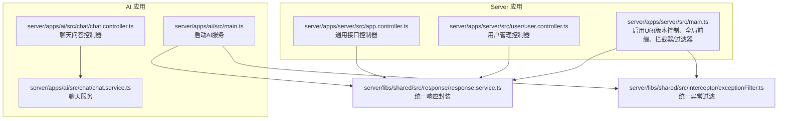
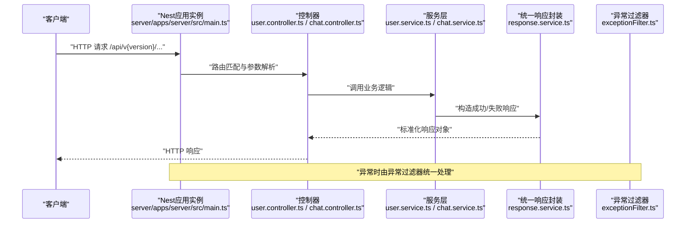
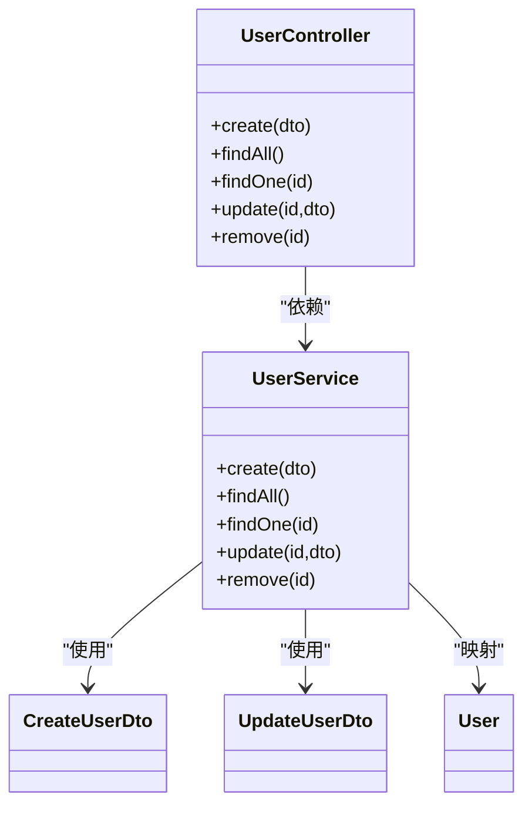
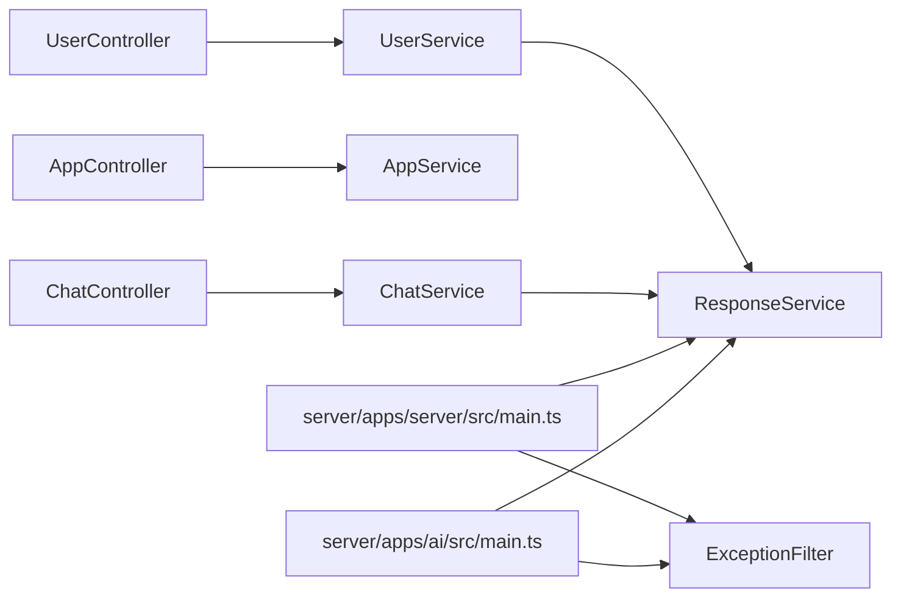

# API接口文档

<cite>
**本文档引用的文件**
- [server/apps/server/src/app.controller.ts](file://server/apps/server/src/app.controller.ts)
- [server/apps/server/src/main.ts](file://server/apps/server/src/main.ts)
- [server/apps/server/src/user/user.controller.ts](file://server/apps/server/src/user/user.controller.ts)
- [server/apps/server/src/user/user.service.ts](file://server/apps/server/src/user/user.service.ts)
- [server/apps/server/src/user/dto/create-user.dto.ts](file://server/apps/server/src/user/dto/create-user.dto.ts)
- [server/apps/server/src/user/dto/update-user.dto.ts](file://server/apps/server/src/user/dto/update-user.dto.ts)
- [server/apps/server/src/user/entities/user.entity.ts](file://server/apps/server/src/user/entities/user.entity.ts)
- [server/apps/ai/src/ai.controller.ts](file://server/apps/ai/src/ai.controller.ts)
- [server/apps/ai/src/main.ts](file://server/apps/ai/src/main.ts)
- [server/apps/ai/src/chat/chat.controller.ts](file://server/apps/ai/src/chat/chat.controller.ts)
- [server/apps/ai/src/chat/chat.service.ts](file://server/apps/ai/src/chat/chat.service.ts)
- [server/apps/ai/src/chat/dto/create-chat.dto.ts](file://server/apps/ai/src/chat/dto/create-chat.dto.ts)
- [server/apps/ai/src/chat/dto/update-chat.dto.ts](file://server/apps/ai/src/chat/dto/update-chat.dto.ts)
- [server/apps/ai/src/chat/entities/chat.entity.ts](file://server/apps/ai/src/chat/entities/chat.entity.ts)
- [server/libs/shared/src/response/response.service.ts](file://server/libs/shared/src/response/response.service.ts)
- [server/libs/shared/src/interceptor/exceptionFilter.ts](file://server/libs/shared/src/interceptor/exceptionFilter.ts)
</cite>

## 目录
1. [简介](#简介)
2. [项目结构](#项目结构)
3. [核心组件](#核心组件)
4. [架构总览](#架构总览)
5. [详细组件分析](#详细组件分析)
6. [依赖关系分析](#依赖关系分析)
7. [性能与扩展性考虑](#性能与扩展性考虑)
8. [故障排查指南](#故障排查指南)
9. [结论](#结论)
10. [附录：API端点清单与示例](#附录api端点清单与示例)

## 简介
本文件为英语学习平台的后端API接口文档，覆盖用户管理、聊天问答等核心模块的RESTful接口规范。文档包含端点定义、请求参数、响应格式、状态码说明、错误处理机制、版本控制策略、认证授权建议与限流规则，并提供Postman集合与curl命令示例，便于开发者快速测试与集成。

## 项目结构
后端采用NestJS多应用架构，分为两个独立服务：
- server 应用：提供用户管理、通用接口等
- ai 应用：提供AI相关接口（当前包含占位接口）

各应用均启用统一的全局拦截器与异常过滤器，返回标准化响应结构；server应用启用URI版本控制（默认v1），并设置全局前缀“api”。

图表来源
- [server/apps/server/src/main.ts:1-20](file://server/apps/server/src/main.ts#L1-L20)
- [server/apps/ai/src/main.ts:1-14](file://server/apps/ai/src/main.ts#L1-L14)
- [server/apps/server/src/user/user.controller.ts:1-35](file://server/apps/server/src/user/user.controller.ts#L1-L35)
- [server/apps/server/src/app.controller.ts:1-13](file://server/apps/server/src/app.controller.ts#L1-L13)
- [server/apps/ai/src/chat/chat.controller.ts:1-35](file://server/apps/ai/src/chat/chat.controller.ts#L1-L35)
- [server/apps/ai/src/chat/chat.service.ts:1-27](file://server/apps/ai/src/chat/chat.service.ts#L1-L27)
- [server/libs/shared/src/response/response.service.ts:1-29](file://server/libs/shared/src/response/response.service.ts#L1-L29)
- [server/libs/shared/src/interceptor/exceptionFilter.ts:1-23](file://server/libs/shared/src/interceptor/exceptionFilter.ts#L1-L23)

章节来源
- [server/apps/server/src/main.ts:1-20](file://server/apps/server/src/main.ts#L1-L20)
- [server/apps/ai/src/main.ts:1-14](file://server/apps/ai/src/main.ts#L1-L14)

## 核心组件
- 统一响应封装：通过ResponseService提供成功/失败响应模板，简化控制器返回格式一致性。
- 统一异常过滤：捕获HttpException并返回包含时间戳、路径、消息与状态码的标准化错误响应。
- 版本控制：server应用启用URI版本控制（默认v1），所有接口以“/api/v{version}/...”形式访问。
- 全局前缀：server应用设置全局前缀“api”，AI应用独立运行。

章节来源
- [server/libs/shared/src/response/response.service.ts:1-29](file://server/libs/shared/src/response/response.service.ts#L1-L29)
- [server/libs/shared/src/interceptor/exceptionFilter.ts:1-23](file://server/libs/shared/src/interceptor/exceptionFilter.ts#L1-L23)
- [server/apps/server/src/main.ts:12-16](file://server/apps/server/src/main.ts#L12-L16)

## 架构总览
下图展示请求在系统中的流转过程，从入口到控制器、服务层，再到统一响应封装与异常过滤。

图表来源
- [server/apps/server/src/main.ts:1-20](file://server/apps/server/src/main.ts#L1-L20)
- [server/apps/server/src/user/user.controller.ts:1-35](file://server/apps/server/src/user/user.controller.ts#L1-L35)
- [server/apps/server/src/user/user.service.ts:1-34](file://server/apps/server/src/user/user.service.ts#L1-L34)
- [server/apps/ai/src/chat/chat.controller.ts:1-35](file://server/apps/ai/src/chat/chat.controller.ts#L1-L35)
- [server/apps/ai/src/chat/chat.service.ts:1-27](file://server/apps/ai/src/chat/chat.service.ts#L1-L27)
- [server/libs/shared/src/response/response.service.ts:1-29](file://server/libs/shared/src/response/response.service.ts#L1-L29)
- [server/libs/shared/src/interceptor/exceptionFilter.ts:1-23](file://server/libs/shared/src/interceptor/exceptionFilter.ts#L1-L23)

## 详细组件分析

### 用户管理模块（server/user）
- 控制器暴露REST端点，支持创建、查询列表、按ID查询、更新与删除。
- DTO用于请求参数校验与类型约束，实体用于数据模型抽象。
- 服务层负责业务逻辑与数据库交互（PrismaService），并通过ResponseService统一返回格式。

图表来源
- [server/apps/server/src/user/user.controller.ts:1-35](file://server/apps/server/src/user/user.controller.ts#L1-L35)
- [server/apps/server/src/user/user.service.ts:1-34](file://server/apps/server/src/user/user.service.ts#L1-L34)
- [server/apps/server/src/user/dto/create-user.dto.ts:1-2](file://server/apps/server/src/user/dto/create-user.dto.ts#L1-L2)
- [server/apps/server/src/user/dto/update-user.dto.ts:1-5](file://server/apps/server/src/user/dto/update-user.dto.ts#L1-L5)
- [server/apps/server/src/user/entities/user.entity.ts:1-2](file://server/apps/server/src/user/entities/user.entity.ts#L1-L2)

章节来源
- [server/apps/server/src/user/user.controller.ts:1-35](file://server/apps/server/src/user/user.controller.ts#L1-L35)
- [server/apps/server/src/user/user.service.ts:1-34](file://server/apps/server/src/user/user.service.ts#L1-L34)
- [server/apps/server/src/user/dto/create-user.dto.ts:1-2](file://server/apps/server/src/user/dto/create-user.dto.ts#L1-L2)
- [server/apps/server/src/user/dto/update-user.dto.ts:1-5](file://server/apps/server/src/user/dto/update-user.dto.ts#L1-L5)
- [server/apps/server/src/user/entities/user.entity.ts:1-2](file://server/apps/server/src/user/entities/user.entity.ts#L1-L2)

### 聊天问答模块（ai/chat）
- 控制器提供与用户管理类似的CRUD端点，用于聊天会话管理。
- 服务层当前为占位实现，后续可接入AI推理与存储逻辑。

图表来源
- [server/apps/ai/src/chat/chat.controller.ts:1-35](file://server/apps/ai/src/chat/chat.controller.ts#L1-L35)
- [server/apps/ai/src/chat/chat.service.ts:1-27](file://server/apps/ai/src/chat/chat.service.ts#L1-L27)
- [server/apps/ai/src/chat/dto/create-chat.dto.ts:1-2](file://server/apps/ai/src/chat/dto/create-chat.dto.ts#L1-L2)
- [server/apps/ai/src/chat/dto/update-chat.dto.ts:1-5](file://server/apps/ai/src/chat/dto/update-chat.dto.ts#L1-L5)
- [server/apps/ai/src/chat/entities/chat.entity.ts:1-2](file://server/apps/ai/src/chat/entities/chat.entity.ts#L1-L2)

章节来源
- [server/apps/ai/src/chat/chat.controller.ts:1-35](file://server/apps/ai/src/chat/chat.controller.ts#L1-L35)
- [server/apps/ai/src/chat/chat.service.ts:1-27](file://server/apps/ai/src/chat/chat.service.ts#L1-L27)
- [server/apps/ai/src/chat/dto/create-chat.dto.ts:1-2](file://server/apps/ai/src/chat/dto/create-chat.dto.ts#L1-L2)
- [server/apps/ai/src/chat/dto/update-chat.dto.ts:1-5](file://server/apps/ai/src/chat/dto/update-chat.dto.ts#L1-L5)
- [server/apps/ai/src/chat/entities/chat.entity.ts:1-2](file://server/apps/ai/src/chat/entities/chat.entity.ts#L1-L2)

### 通用接口与AI占位接口
- server应用提供通用接口控制器，当前返回问候信息。
- ai应用提供AI相关接口控制器，当前返回占位信息。

章节来源
- [server/apps/server/src/app.controller.ts:1-13](file://server/apps/server/src/app.controller.ts#L1-L13)
- [server/apps/ai/src/ai.controller.ts:1-13](file://server/apps/ai/src/ai.controller.ts#L1-L13)

## 依赖关系分析
- 控制器依赖对应的服务层实现。
- 服务层依赖共享的ResponseService进行统一响应封装。
- 应用启动时注册全局拦截器与异常过滤器，保证所有请求/响应的一致性与可观测性。
- server应用启用URI版本控制，默认版本为v1，并设置全局前缀“api”。

图表来源
- [server/apps/server/src/user/user.controller.ts:1-35](file://server/apps/server/src/user/user.controller.ts#L1-L35)
- [server/apps/server/src/user/user.service.ts:1-34](file://server/apps/server/src/user/user.service.ts#L1-L34)
- [server/apps/server/src/app.controller.ts:1-13](file://server/apps/server/src/app.controller.ts#L1-L13)
- [server/apps/ai/src/chat/chat.controller.ts:1-35](file://server/apps/ai/src/chat/chat.controller.ts#L1-L35)
- [server/apps/ai/src/chat/chat.service.ts:1-27](file://server/apps/ai/src/chat/chat.service.ts#L1-L27)
- [server/apps/server/src/main.ts:1-20](file://server/apps/server/src/main.ts#L1-L20)
- [server/apps/ai/src/main.ts:1-14](file://server/apps/ai/src/main.ts#L1-L14)
- [server/libs/shared/src/response/response.service.ts:1-29](file://server/libs/shared/src/response/response.service.ts#L1-L29)
- [server/libs/shared/src/interceptor/exceptionFilter.ts:1-23](file://server/libs/shared/src/interceptor/exceptionFilter.ts#L1-L23)

章节来源
- [server/apps/server/src/main.ts:1-20](file://server/apps/server/src/main.ts#L1-L20)
- [server/apps/ai/src/main.ts:1-14](file://server/apps/ai/src/main.ts#L1-L14)

## 性能与扩展性考虑
- 建议在生产环境启用Gzip压缩与缓存策略，减少网络传输开销。
- 对高频查询引入分页与索引优化，避免全表扫描。
- 使用连接池与异步I/O提升数据库吞吐量。
- 在服务层增加幂等性设计与重试机制，增强可靠性。
- 对外暴露的接口建议增加速率限制（Rate Limiting）与熔断降级策略，防止雪崩效应。

## 故障排查指南
- 统一异常过滤器会捕获HttpException并返回包含时间戳、路径、消息与状态码的标准化错误响应，便于前端定位问题。
- 若出现未捕获异常，需检查服务层是否抛出符合规范的异常，或在控制器中显式转换为HttpException。
- 检查全局前缀与版本控制是否正确配置，确保请求URL符合“/api/v{version}/...”。

章节来源
- [server/libs/shared/src/interceptor/exceptionFilter.ts:1-23](file://server/libs/shared/src/interceptor/exceptionFilter.ts#L1-L23)

## 结论
本API文档基于现有代码实现了用户管理与聊天问答模块的端点规范，明确了版本控制、统一响应与异常处理机制。建议后续补充：
- 完善DTO字段定义与校验规则
- 实现服务层数据库操作与AI推理逻辑
- 增加认证授权中间件与限流策略
- 提供Postman集合与curl示例

## 附录：API端点清单与示例

### 通用
- 基础URL
  - server应用：/api/v1
  - ai应用：独立端口运行（具体端口由配置决定）
- 版本控制
  - URI版本控制，如：/api/v1/user
- 认证授权
  - 当前未实现鉴权中间件，建议在全局拦截器中加入鉴权逻辑
- 限流规则
  - 当前未实现限流，建议在全局拦截器中加入限流策略

### 用户管理（server/user）
- 创建用户
  - 方法：POST
  - 路径：/api/v1/user
  - 请求体：CreateUserDto（字段待完善）
  - 成功响应：使用ResponseService封装的标准成功结构
  - 失败响应：统一异常过滤器返回标准错误结构
- 查询用户列表
  - 方法：GET
  - 路径：/api/v1/user
  - 成功响应：使用ResponseService封装的标准成功结构
- 按ID查询用户
  - 方法：GET
  - 路径：/api/v1/user/{id}
  - 成功响应：使用ResponseService封装的标准成功结构
- 更新用户
  - 方法：PATCH
  - 路径：/api/v1/user/{id}
  - 请求体：UpdateUserDto（字段待完善）
  - 成功响应：使用ResponseService封装的标准成功结构
- 删除用户
  - 方法：DELETE
  - 路径：/api/v1/user/{id}
  - 成功响应：使用ResponseService封装的标准成功结构

章节来源
- [server/apps/server/src/user/user.controller.ts:1-35](file://server/apps/server/src/user/user.controller.ts#L1-L35)
- [server/apps/server/src/user/dto/create-user.dto.ts:1-2](file://server/apps/server/src/user/dto/create-user.dto.ts#L1-L2)
- [server/apps/server/src/user/dto/update-user.dto.ts:1-5](file://server/apps/server/src/user/dto/update-user.dto.ts#L1-L5)
- [server/libs/shared/src/response/response.service.ts:1-29](file://server/libs/shared/src/response/response.service.ts#L1-L29)

### 聊天问答（ai/chat）
- 创建聊天
  - 方法：POST
  - 路径：/api/v1/chat
  - 请求体：CreateChatDto（字段待完善）
  - 成功响应：使用ResponseService封装的标准成功结构
  - 失败响应：统一异常过滤器返回标准错误结构
- 查询聊天列表
  - 方法：GET
  - 路径：/api/v1/chat
  - 成功响应：使用ResponseService封装的标准成功结构
- 按ID查询聊天
  - 方法：GET
  - 路径：/api/v1/chat/{id}
  - 成功响应：使用ResponseService封装的标准成功结构
- 更新聊天
  - 方法：PATCH
  - 路径：/api/v1/chat/{id}
  - 请求体：UpdateChatDto（字段待完善）
  - 成功响应：使用ResponseService封装的标准成功结构
- 删除聊天
  - 方法：DELETE
  - 路径：/api/v1/chat/{id}
  - 成功响应：使用ResponseService封装的标准成功结构

章节来源
- [server/apps/ai/src/chat/chat.controller.ts:1-35](file://server/apps/ai/src/chat/chat.controller.ts#L1-L35)
- [server/apps/ai/src/chat/dto/create-chat.dto.ts:1-2](file://server/apps/ai/src/chat/dto/create-chat.dto.ts#L1-L2)
- [server/apps/ai/src/chat/dto/update-chat.dto.ts:1-5](file://server/apps/ai/src/chat/dto/update-chat.dto.ts#L1-L5)
- [server/libs/shared/src/response/response.service.ts:1-29](file://server/libs/shared/src/response/response.service.ts#L1-L29)

### 响应与错误格式
- 成功响应
  - 字段：data、code、message
  - 示例参考：[响应封装:14-20](file://server/libs/shared/src/response/response.service.ts#L14-L20)
- 错误响应
  - 字段：timestamp、path、message、code、success=false
  - 示例参考：[异常过滤器:14-21](file://server/libs/shared/src/interceptor/exceptionFilter.ts#L14-L21)

章节来源
- [server/libs/shared/src/response/response.service.ts:1-29](file://server/libs/shared/src/response/response.service.ts#L1-L29)
- [server/libs/shared/src/interceptor/exceptionFilter.ts:1-23](file://server/libs/shared/src/interceptor/exceptionFilter.ts#L1-L23)

### Postman集合与curl示例
- Postman集合
  - 建议在Postman中创建名为“English-Platform”的集合，包含以下环境变量：
    - server_base_url：例如 http://localhost:3000
    - ai_base_url：例如 http://localhost:3001
    - api_version：例如 v1
  - 将上述端点导入为请求，设置全局前缀与版本控制
- curl示例
  - 获取用户列表
    - curl -X GET "{{server_base_url}}/api/{{api_version}}/user"
  - 创建用户
    - curl -X POST "{{server_base_url}}/api/{{api_version}}/user" -H "Content-Type: application/json" -d '{}'
  - 更新用户
    - curl -X PATCH "{{server_base_url}}/api/{{api_version}}/user/1" -H "Content-Type: application/json" -d '{}'
  - 删除用户
    - curl -X DELETE "{{server_base_url}}/api/{{api_version}}/user/1"
  - 获取聊天列表
    - curl -X GET "{{ai_base_url}}/api/{{api_version}}/chat"
  - 创建聊天
    - curl -X POST "{{ai_base_url}}/api/{{api_version}}/chat" -H "Content-Type: application/json" -d '{}'