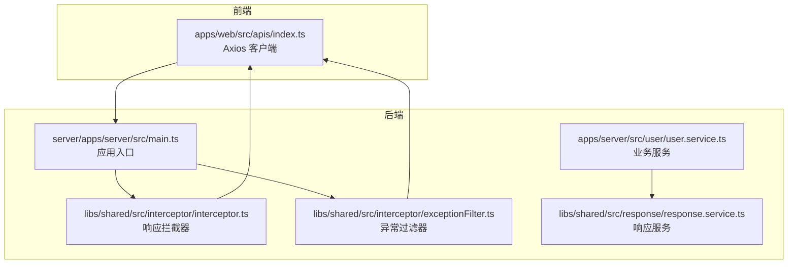
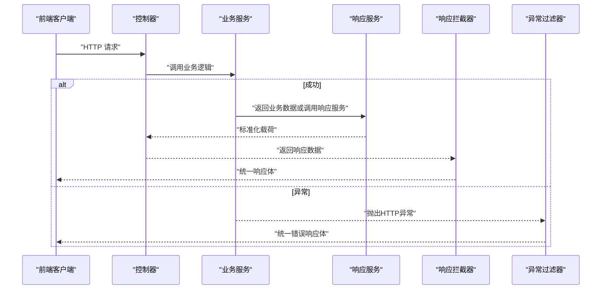
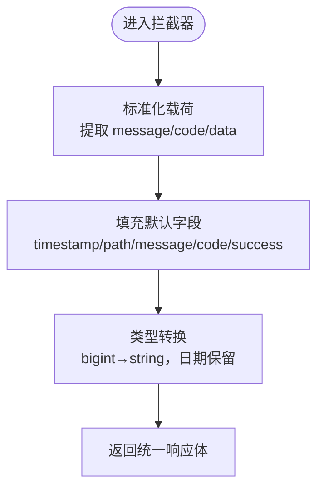
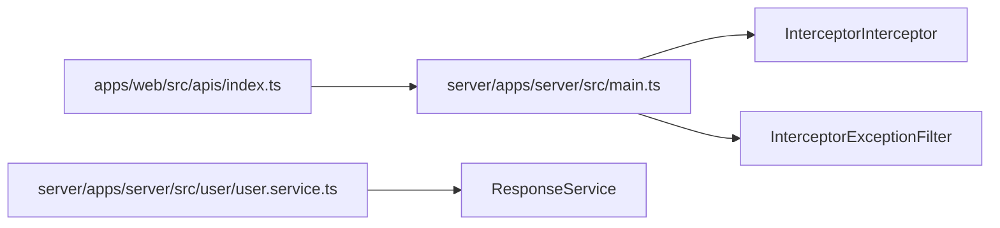

# 响应格式规范

<cite>
**本文引用的文件**
- [server\libs\shared\src\response\response.service.ts](file://server/libs/shared/src/response/response.service.ts)
- [server\libs\shared\src\response\response.module.ts](file://server/libs/shared/src/response/response.module.ts)
- [server\libs\shared\src\interceptor\interceptor.ts](file://server/libs/shared/src/interceptor/interceptor.ts)
- [server\libs\shared\src\interceptor\exceptionFilter.ts](file://server/libs/shared/src/interceptor/exceptionFilter.ts)
- [server\apps\server\src\main.ts](file://server/apps/server/src/main.ts)
- [apps\web\src\apis\index.ts](file://apps/web/src/apis/index.ts)
- [server\apps\server\src\user\user.service.ts](file://server/apps/server/src/user/user.service.ts)
</cite>

## 目录
1. [简介](#简介)
2. [项目结构](#项目结构)
3. [核心组件](#核心组件)
4. [架构总览](#架构总览)
5. [详细组件分析](#详细组件分析)
6. [依赖关系分析](#依赖关系分析)
7. [性能考虑](#性能考虑)
8. [故障排查指南](#故障排查指南)
9. [结论](#结论)
10. [附录](#附录)

## 简介
本规范旨在为系统API统一定义响应格式，确保前后端对响应结构有一致理解与正确处理。规范涵盖标准响应结构字段（timestamp、path、message、code、success、data）、成功与错误响应示例、HTTP状态码与业务状态码映射、分页数据与文件下载等特殊场景的格式约定，以及响应拦截器与异常过滤器的实现原理与自定义方法。

## 项目结构
后端采用NestJS框架，通过全局拦截器与异常过滤器统一封装响应；共享模块提供响应服务与拦截器/异常过滤器；前端基于Axios封装基础请求客户端。

**图表来源**
- [server\apps\server\src\main.ts:1-20](file://server/apps/server/src/main.ts#L1-L20)
- [server\libs\shared\src\interceptor\interceptor.ts:1-86](file://server/libs/shared/src/interceptor/interceptor.ts#L1-L86)
- [server\libs\shared\src\interceptor\exceptionFilter.ts:1-23](file://server/libs/shared/src/interceptor/exceptionFilter.ts#L1-L23)
- [server\libs\shared\src\response\response.service.ts:1-29](file://server/libs/shared/src/response/response.service.ts#L1-L29)
- [apps\web\src\apis\index.ts:1-6](file://apps/web/src/apis/index.ts#L1-L6)
- [server\apps\server\src\user\user.service.ts:1-34](file://server/apps/server/src/user/user.service.ts#L1-L34)

**章节来源**
- [server\apps\server\src\main.ts:1-20](file://server/apps/server/src/main.ts#L1-L20)
- [apps\web\src\apis\index.ts:1-6](file://apps/web/src/apis/index.ts#L1-L6)

## 核心组件
- 统一响应服务：提供成功与错误两类便捷方法，返回标准化的响应载荷（data、code、message）。
- 全局响应拦截器：将控制器返回值标准化为统一响应体（timestamp、path、message、code、success、data），并对大数据整型进行字符串化处理。
- 全局异常过滤器：捕获HTTP异常，按统一响应体返回错误信息，HTTP状态码与业务code一致。
- 前端Axios客户端：统一配置基础URL与超时时间，便于后续在拦截器中扩展统一错误处理。

**章节来源**
- [server\libs\shared\src\response\response.service.ts:1-29](file://server/libs/shared/src/response/response.service.ts#L1-L29)
- [server\libs\shared\src\interceptor\interceptor.ts:1-86](file://server/libs/shared/src/interceptor/interceptor.ts#L1-L86)
- [server\libs\shared\src\interceptor\exceptionFilter.ts:1-23](file://server/libs/shared/src/interceptor/exceptionFilter.ts#L1-L23)
- [apps\web\src\apis\index.ts:1-6](file://apps/web/src/apis/index.ts#L1-L6)

## 架构总览
下图展示从控制器到前端的完整响应流转过程，包括成功路径与异常路径。

**图表来源**
- [server\libs\shared\src\response\response.service.ts:1-29](file://server/libs/shared/src/response/response.service.ts#L1-L29)
- [server\libs\shared\src\interceptor\interceptor.ts:1-86](file://server/libs/shared/src/interceptor/interceptor.ts#L1-L86)
- [server\libs\shared\src\interceptor\exceptionFilter.ts:1-23](file://server/libs/shared/src/interceptor/exceptionFilter.ts#L1-L23)
- [server\apps\server\src\user\user.service.ts:1-34](file://server/apps/server/src/user/user.service.ts#L1-L34)

## 详细组件分析

### 统一响应结构字段定义
- timestamp: ISO 8601时间戳，表示响应生成时刻。
- path: 请求路径，便于定位问题。
- message: 业务提示信息，默认“请求成功”，异常时为异常消息。
- code: 业务状态码，默认200，异常时与HTTP状态码一致。
- success: 布尔值，true表示成功，false表示失败。
- data: 实际业务数据，若无则为null；大整型自动转为字符串，日期保持原样。

上述字段由拦截器统一注入，异常过滤器在HTTP异常时直接返回该结构。

**章节来源**
- [server\libs\shared\src\interceptor\interceptor.ts:16-23](file://server/libs/shared/src/interceptor/interceptor.ts#L16-L23)
- [server\libs\shared\src\interceptor\exceptionFilter.ts:14-21](file://server/libs/shared/src/interceptor/exceptionFilter.ts#L14-L21)

### 成功响应与错误响应示例
- 成功响应
  - 结构：包含统一字段，success为true，code默认200，message默认“请求成功”。
  - 数据：data承载业务结果；若为空则为null；大整型自动字符串化。
- 错误响应
  - 结构：包含统一字段，success为false，code与HTTP状态码一致，message为异常消息。
  - 触发：当业务抛出HTTP异常或显式返回错误载荷时。

以上行为由拦截器与异常过滤器共同保证。

**章节来源**
- [server\libs\shared\src\interceptor\interceptor.ts:74-81](file://server/libs/shared/src/interceptor/interceptor.ts#L74-L81)
- [server\libs\shared\src\interceptor\exceptionFilter.ts:14-21](file://server/libs/shared/src/interceptor/exceptionFilter.ts#L14-L21)

### HTTP状态码与业务状态码映射
- 成功场景：HTTP 200，业务code=200。
- 异常场景：HTTP状态码与业务code一致，message为异常描述。
- 自定义错误：可通过响应服务传入自定义code与message，拦截器会将其写入响应体。

注意：拦截器默认code为200，异常过滤器使用exception.getStatus()作为code与HTTP状态码。

**章节来源**
- [server\libs\shared\src\interceptor\interceptor.ts:78](file://server/libs/shared/src/interceptor/interceptor.ts#L78)
- [server\libs\shared\src\interceptor\exceptionFilter.ts:14](file://server/libs/shared/src/interceptor/exceptionFilter.ts#L14)

### 分页数据格式规范
- data结构：包含列表与分页元信息，如total、page、size等。
- 字段建议：data.list（数组）、data.total（总数）、data.page（当前页）、data.size（每页条数）。
- 大整型处理：分页中的数值型ID等大整型需保持字符串化，确保前端不丢失精度。
- 示例参考：拦截器transformBigInt会将bigint转为字符串，日期保持原样。

**章节来源**
- [server\libs\shared\src\interceptor\interceptor.ts:40-57](file://server/libs/shared/src/interceptor/interceptor.ts#L40-L57)

### 文件下载响应格式
- 成功下载：返回二进制流或文件链接，同时携带统一响应体，data可为文件标识或URL。
- 错误下载：返回统一错误响应体，message描述具体原因。
- 注意：文件下载通常由后端直接输出流，前端接收二进制数据；若需要携带元信息，可在data中附加必要字段。

（本节为通用规范说明，未直接分析具体文件）

### 特殊响应类型：批量操作与异步任务
- 批量操作：返回data.ids（受影响记录ID集合）与data.summary（统计摘要）。
- 异步任务：返回task.id与status，前端轮询或订阅更新。
- 统一性：无论何种类型，均遵循统一响应体字段。

（本节为通用规范说明，未直接分析具体文件）

### 响应拦截器实现原理
- 类型与职责
  - 拦截器：统一包装响应体，注入timestamp、path、message、code、success、data。
  - 异常过滤器：捕获HTTP异常，按统一结构返回错误响应。
- 关键流程
  - 控制器返回原始数据或载荷。
  - 拦截器解析载荷，填充缺失字段，对data执行类型转换（bigint→string，日期保留）。
  - 异常过滤器根据HTTP状态码设置code与success=false。
- 可扩展点
  - 在拦截器中增加自定义字段或日志。
  - 在异常过滤器中加入审计日志或错误追踪ID。

**图表来源**
- [server\libs\shared\src\interceptor\interceptor.ts:28-57](file://server/libs/shared/src/interceptor/interceptor.ts#L28-L57)
- [server\libs\shared\src\interceptor\interceptor.ts:74-81](file://server/libs/shared/src/interceptor/interceptor.ts#L74-L81)

**章节来源**
- [server\libs\shared\src\interceptor\interceptor.ts:1-86](file://server/libs/shared/src/interceptor/interceptor.ts#L1-L86)
- [server\libs\shared\src\interceptor\exceptionFilter.ts:1-23](file://server/libs/shared/src/interceptor/exceptionFilter.ts#L1-L23)

### 自定义响应格式的方法
- 使用响应服务
  - 成功：调用响应服务的success(data)，返回标准化载荷。
  - 错误：调用响应服务的error(data, message, code)，传入自定义code与message。
- 直接返回载荷
  - 控制器可直接返回包含message、code、data的对象，拦截器会将其标准化。
- 修改拦截器
  - 如需新增字段或调整默认值，可在拦截器中扩展normalizeResponsePayload与返回体构造逻辑。
- 修改异常过滤器
  - 如需扩展错误响应字段或日志，可在异常过滤器中追加。

**章节来源**
- [server\libs\shared\src\response\response.service.ts:14-27](file://server/libs/shared/src/response/response.service.ts#L14-L27)
- [server\libs\shared\src\interceptor\interceptor.ts:28-38](file://server/libs/shared/src/interceptor/interceptor.ts#L28-L38)
- [server\libs\shared\src\interceptor\exceptionFilter.ts:14-21](file://server/libs/shared/src/interceptor/exceptionFilter.ts#L14-L21)

## 依赖关系分析
- 应用入口注册全局拦截器与异常过滤器，确保所有路由生效。
- 业务服务通过响应服务提供标准化载荷，减少重复逻辑。
- 前端Axios客户端统一配置基础URL，便于后续扩展拦截器。

**图表来源**
- [server\apps\server\src\main.ts:8-11](file://server/apps/server/src/main.ts#L8-L11)
- [server\apps\server\src\user\user.service.ts:19](file://server/apps/server/src/user/user.service.ts#L19)
- [apps\web\src\apis\index.ts:3-6](file://apps/web/src/apis/index.ts#L3-L6)

**章节来源**
- [server\apps\server\src\main.ts:1-20](file://server/apps/server/src/main.ts#L1-L20)
- [server\apps\server\src\user\user.service.ts:1-34](file://server/apps/server/src/user/user.service.ts#L1-L34)

## 性能考虑
- 大整型字符串化：拦截器对bigint进行字符串化，避免JSON序列化精度丢失。
- 日期类型保留：拦截器不对Date类型做转换，减少不必要的处理开销。
- 前端请求：Axios已设置超时时间，建议在拦截器中增加重试与降级策略（扩展点）。

（本节为通用指导，未直接分析具体文件）

## 故障排查指南
- 响应字段缺失
  - 检查是否使用了响应服务或返回了含message/code/data的对象。
  - 确认拦截器是否被全局注册。
- HTTP状态码与业务code不一致
  - 异常场景下，业务code与HTTP状态码一致；若不一致，请检查异常抛出处。
- 前端无法解析大整型
  - 确认后端拦截器已将bigint转换为字符串。
- 文件下载异常
  - 检查后端是否正确输出流；前端是否按二进制方式接收。

**章节来源**
- [server\libs\shared\src\interceptor\interceptor.ts:40-57](file://server/libs/shared/src/interceptor/interceptor.ts#L40-L57)
- [server\libs\shared\src\interceptor\exceptionFilter.ts:14-21](file://server/libs/shared/src/interceptor/exceptionFilter.ts#L14-L21)

## 结论
通过统一的响应服务、拦截器与异常过滤器，系统实现了前后端一致的响应格式。建议在现有基础上进一步完善分页与文件下载的约定，并在拦截器中增加必要的审计字段与日志，以提升可观测性与可维护性。

## 附录

### 字段定义一览
- timestamp: ISO 8601时间戳
- path: 请求路径
- message: 提示信息
- code: 业务状态码
- success: 是否成功
- data: 业务数据（默认null；大整型自动字符串化）

**章节来源**
- [server\libs\shared\src\interceptor\interceptor.ts:16-23](file://server/libs/shared/src/interceptor/interceptor.ts#L16-L23)