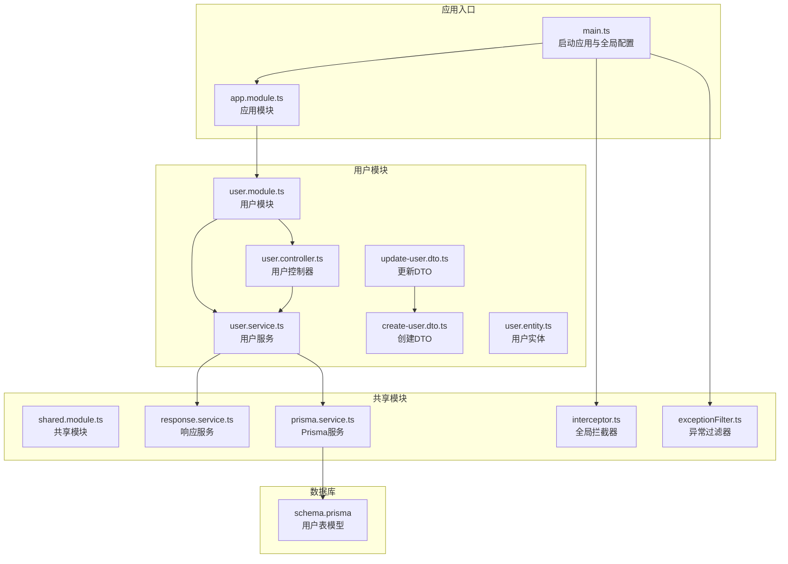
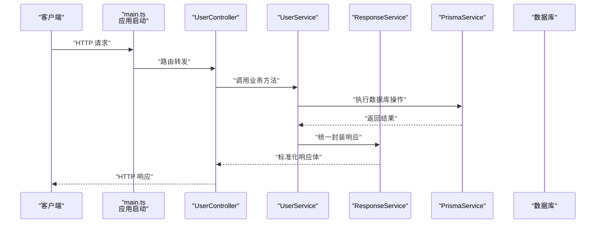
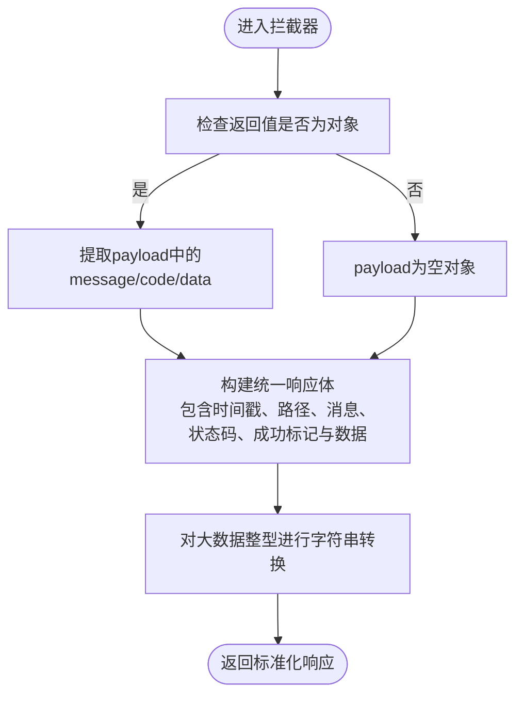
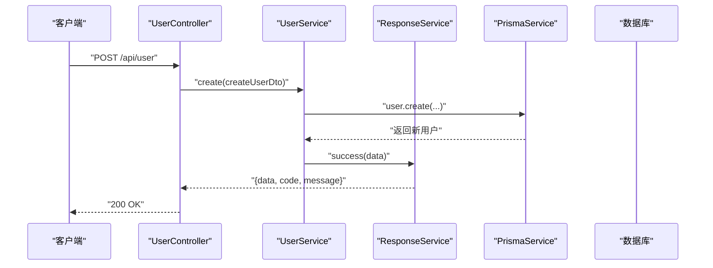
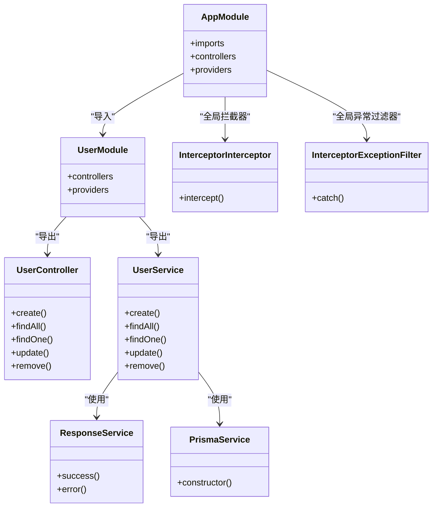

# 用户管理API

<cite>
**本文档引用的文件**
- [server/apps/server/src/main.ts](file://server/apps/server/src/main.ts)
- [server/apps/server/src/app.module.ts](file://server/apps/server/src/app.module.ts)
- [server/apps/server/src/user/user.controller.ts](file://server/apps/server/src/user/user.controller.ts)
- [server/apps/server/src/user/user.service.ts](file://server/apps/server/src/user/user.service.ts)
- [server/apps/server/src/user/user.module.ts](file://server/apps/server/src/user/user.module.ts)
- [server/apps/server/src/user/dto/create-user.dto.ts](file://server/apps/server/src/user/dto/create-user.dto.ts)
- [server/apps/server/src/user/dto/update-user.dto.ts](file://server/apps/server/src/user/dto/update-user.dto.ts)
- [server/apps/server/src/user/entities/user.entity.ts](file://server/apps/server/src/user/entities/user.entity.ts)
- [server/libs/shared/src/response/response.service.ts](file://server/libs/shared/src/response/response.service.ts)
- [server/libs/shared/src/interceptor/interceptor.ts](file://server/libs/shared/src/interceptor/interceptor.ts)
- [server/libs/shared/src/interceptor/exceptionFilter.ts](file://server/libs/shared/src/interceptor/exceptionFilter.ts)
- [server/libs/shared/src/prisma/prisma.service.ts](file://server/libs/shared/src/prisma/prisma.service.ts)
- [server/libs/shared/src/shared.module.ts](file://server/libs/shared/src/shared.module.ts)
- [server/prisma/schema.prisma](file://server/prisma/schema.prisma)
</cite>

## 目录
1. [简介](#简介)
2. [项目结构](#项目结构)
3. [核心组件](#核心组件)
4. [架构总览](#架构总览)
5. [详细组件分析](#详细组件分析)
6. [依赖关系分析](#依赖关系分析)
7. [性能考虑](#性能考虑)
8. [故障排除指南](#故障排除指南)
9. [结论](#结论)

## 简介
本文件为用户管理模块的详细API文档，覆盖用户注册、查询、更新、删除等完整RESTful接口规范。文档基于实际代码实现，包含接口定义、数据传输对象（DTO）、实体模型、响应格式与状态码约定、错误处理机制以及常见异常场景的处理方式。

## 项目结构
用户管理模块位于服务端应用中，采用NestJS标准分层结构：控制器（Controller）负责HTTP路由与参数解析；服务（Service）封装业务逻辑；DTO用于输入输出数据结构定义；共享模块提供统一的响应包装、拦截器与异常过滤器；Prisma作为ORM访问数据库。

**图表来源**
- [server/apps/server/src/main.ts:1-20](file://server/apps/server/src/main.ts#L1-L20)
- [server/apps/server/src/app.module.ts:1-13](file://server/apps/server/src/app.module.ts#L1-L13)
- [server/apps/server/src/user/user.controller.ts:1-35](file://server/apps/server/src/user/user.controller.ts#L1-L35)
- [server/apps/server/src/user/user.service.ts:1-34](file://server/apps/server/src/user/user.service.ts#L1-L34)
- [server/apps/server/src/user/user.module.ts:1-10](file://server/apps/server/src/user/user.module.ts#L1-L10)
- [server/libs/shared/src/response/response.service.ts:1-29](file://server/libs/shared/src/response/response.service.ts#L1-L29)
- [server/libs/shared/src/prisma/prisma.service.ts:1-18](file://server/libs/shared/src/prisma/prisma.service.ts#L1-L18)
- [server/libs/shared/src/interceptor/interceptor.ts:1-86](file://server/libs/shared/src/interceptor/interceptor.ts#L1-L86)
- [server/libs/shared/src/interceptor/exceptionFilter.ts:1-23](file://server/libs/shared/src/interceptor/exceptionFilter.ts#L1-L23)
- [server/prisma/schema.prisma:1-133](file://server/prisma/schema.prisma#L1-L133)

**章节来源**
- [server/apps/server/src/main.ts:1-20](file://server/apps/server/src/main.ts#L1-L20)
- [server/apps/server/src/app.module.ts:1-13](file://server/apps/server/src/app.module.ts#L1-L13)
- [server/apps/server/src/user/user.module.ts:1-10](file://server/apps/server/src/user/user.module.ts#L1-L10)

## 核心组件
- 控制器：定义REST端点，接收请求参数，调用服务层处理业务。
- 服务层：封装用户业务逻辑，使用Prisma进行数据库操作，通过响应服务统一封装返回格式。
- DTO：CreateUserDto与UpdateUserDto分别定义创建与更新时的输入结构。
- 实体：User实体对应数据库中的用户表结构。
- 全局拦截器：统一包装响应体，处理数据类型转换与标准化输出。
- 异常过滤器：捕获HTTP异常，统一返回错误响应。
- Prisma服务：连接数据库，提供ORM能力。

**章节来源**
- [server/apps/server/src/user/user.controller.ts:1-35](file://server/apps/server/src/user/user.controller.ts#L1-L35)
- [server/apps/server/src/user/user.service.ts:1-34](file://server/apps/server/src/user/user.service.ts#L1-L34)
- [server/apps/server/src/user/dto/create-user.dto.ts:1-2](file://server/apps/server/src/user/dto/create-user.dto.ts#L1-L2)
- [server/apps/server/src/user/dto/update-user.dto.ts:1-5](file://server/apps/server/src/user/dto/update-user.dto.ts#L1-L5)
- [server/apps/server/src/user/entities/user.entity.ts:1-2](file://server/apps/server/src/user/entities/user.entity.ts#L1-L2)
- [server/libs/shared/src/response/response.service.ts:1-29](file://server/libs/shared/src/response/response.service.ts#L1-L29)
- [server/libs/shared/src/interceptor/interceptor.ts:1-86](file://server/libs/shared/src/interceptor/interceptor.ts#L1-L86)
- [server/libs/shared/src/interceptor/exceptionFilter.ts:1-23](file://server/libs/shared/src/interceptor/exceptionFilter.ts#L1-L23)
- [server/libs/shared/src/prisma/prisma.service.ts:1-18](file://server/libs/shared/src/prisma/prisma.service.ts#L1-L18)

## 架构总览
用户管理API遵循RESTful设计，通过控制器暴露端点，服务层执行业务逻辑，共享模块提供统一响应与异常处理。全局前缀为api，版本控制采用URI版本化，默认v1。

**图表来源**
- [server/apps/server/src/main.ts:1-20](file://server/apps/server/src/main.ts#L1-L20)
- [server/apps/server/src/user/user.controller.ts:1-35](file://server/apps/server/src/user/user.controller.ts#L1-L35)
- [server/apps/server/src/user/user.service.ts:1-34](file://server/apps/server/src/user/user.service.ts#L1-L34)
- [server/libs/shared/src/response/response.service.ts:1-29](file://server/libs/shared/src/response/response.service.ts#L1-L29)
- [server/libs/shared/src/prisma/prisma.service.ts:1-18](file://server/libs/shared/src/prisma/prisma.service.ts#L1-L18)

## 详细组件分析

### 数据模型与验证规则
用户实体字段定义来源于Prisma Schema，包含以下关键字段：
- id：字符串主键，唯一标识用户
- name：用户名
- email：邮箱（唯一）
- phone：手机号（唯一）
- address：地址
- password：密码
- avatar：头像
- wordNumber：单词数量，默认0
- dayNumber：打卡天数，默认0
- createdAt：创建时间
- updatedAt：更新时间
- lastLoginAt：最后登录时间

验证规则（基于Schema约束）：
- email与phone字段具有唯一性约束
- password为必填项
- wordNumber与dayNumber默认值为0
- 时间戳字段自动维护

**章节来源**
- [server/prisma/schema.prisma:24-41](file://server/prisma/schema.prisma#L24-L41)

### 数据传输对象（DTO）
- CreateUserDto：定义用户创建时的输入字段集合
- UpdateUserDto：基于CreateUserDto的PartialType，允许部分字段更新

注意：当前DTO类体为空，具体字段定义需在后续完善。建议参考用户实体字段，结合业务需求添加校验装饰器或映射规则。

**章节来源**
- [server/apps/server/src/user/dto/create-user.dto.ts:1-2](file://server/apps/server/src/user/dto/create-user.dto.ts#L1-L2)
- [server/apps/server/src/user/dto/update-user.dto.ts:1-5](file://server/apps/server/src/user/dto/update-user.dto.ts#L1-L5)

### 统一响应与错误处理
- 成功响应：由ResponseService提供success(data)方法，返回包含data、code、message的标准结构
- 统一包装：InterceptorInterceptor将任意返回值标准化为包含timestamp、path、message、code、success、data的对象
- 错误处理：InterceptorExceptionFilter捕获HttpException，返回包含错误信息与状态码的统一结构

**图表来源**
- [server/libs/shared/src/interceptor/interceptor.ts:25-86](file://server/libs/shared/src/interceptor/interceptor.ts#L25-L86)
- [server/libs/shared/src/response/response.service.ts:14-28](file://server/libs/shared/src/response/response.service.ts#L14-L28)

**章节来源**
- [server/libs/shared/src/response/response.service.ts:1-29](file://server/libs/shared/src/response/response.service.ts#L1-L29)
- [server/libs/shared/src/interceptor/interceptor.ts:1-86](file://server/libs/shared/src/interceptor/interceptor.ts#L1-L86)
- [server/libs/shared/src/interceptor/exceptionFilter.ts:1-23](file://server/libs/shared/src/interceptor/exceptionFilter.ts#L1-L23)

### API端点规范

#### POST /api/user（用户注册）
- 功能：创建新用户
- 控制器方法：UserController.create
- 请求体：CreateUserDto
- 响应：通过ResponseService封装的成功响应
- 状态码：201（建议：创建资源通常返回201，当前拦截器默认200）

请求示例（字段依据实体定义）：
- name: "张三"
- email: "zhangsan@example.com"
- phone: "13800001111"
- password: "password123"
- avatar: "https://example.com/avatar.jpg"
- address: "北京市朝阳区"

响应示例：
{
  "data": { /* 用户对象 */ },
  "code": 200,
  "message": "success"
}

**章节来源**
- [server/apps/server/src/user/user.controller.ts:10-13](file://server/apps/server/src/user/user.controller.ts#L10-L13)
- [server/apps/server/src/user/user.service.ts:13-15](file://server/apps/server/src/user/user.service.ts#L13-L15)
- [server/libs/shared/src/response/response.service.ts:14-20](file://server/libs/shared/src/response/response.service.ts#L14-L20)

#### GET /api/user（获取所有用户）
- 功能：查询所有用户列表
- 控制器方法：UserController.findAll
- 请求体：无
- 响应：通过ResponseService封装的成功响应，data为用户数组
- 状态码：200

响应示例：
{
  "data": [
    { /* 用户对象1 */ },
    { /* 用户对象2 */ }
  ],
  "code": 200,
  "message": "success"
}

**章节来源**
- [server/apps/server/src/user/user.controller.ts:15-18](file://server/apps/server/src/user/user.controller.ts#L15-L18)
- [server/apps/server/src/user/user.service.ts:17-20](file://server/apps/server/src/user/user.service.ts#L17-L20)

#### GET /api/user/:id（获取单个用户）
- 功能：根据用户ID获取用户详情
- 控制器方法：UserController.findOne
- 路径参数：id（字符串，内部转换为数字）
- 响应：通过ResponseService封装的成功响应
- 状态码：200

响应示例：
{
  "data": { /* 用户对象 */ },
  "code": 200,
  "message": "success"
}

**章节来源**
- [server/apps/server/src/user/user.controller.ts:20-23](file://server/apps/server/src/user/user.controller.ts#L20-L23)
- [server/apps/server/src/user/user.service.ts:22-24](file://server/apps/server/src/user/user.service.ts#L22-L24)

#### PATCH /api/user/:id（更新用户信息）
- 功能：根据用户ID更新用户信息
- 控制器方法：UserController.update
- 路径参数：id（字符串，内部转换为数字）
- 请求体：UpdateUserDto（部分字段）
- 响应：通过ResponseService封装的成功响应
- 状态码：200

请求示例（部分字段）：
- name: "李四"
- avatar: "https://example.com/new-avatar.jpg"
- address: "上海市浦东新区"

响应示例：
{
  "data": { /* 更新后的用户对象 */ },
  "code": 200,
  "message": "success"
}

**章节来源**
- [server/apps/server/src/user/user.controller.ts:25-28](file://server/apps/server/src/user/user.controller.ts#L25-L28)
- [server/apps/server/src/user/user.service.ts:26-28](file://server/apps/server/src/user/user.service.ts#L26-L28)

#### DELETE /api/user/:id（删除用户）
- 功能：根据用户ID删除用户
- 控制器方法：UserController.remove
- 路径参数：id（字符串，内部转换为数字）
- 响应：通过ResponseService封装的成功响应
- 状态码：200

响应示例：
{
  "data": null,
  "code": 200,
  "message": "success"
}

**章节来源**
- [server/apps/server/src/user/user.controller.ts:30-33](file://server/apps/server/src/user/user.controller.ts#L30-L33)
- [server/apps/server/src/user/user.service.ts:30-32](file://server/apps/server/src/user/user.service.ts#L30-L32)

### 数据流与处理逻辑

**图表来源**
- [server/apps/server/src/user/user.controller.ts:10-13](file://server/apps/server/src/user/user.controller.ts#L10-L13)
- [server/apps/server/src/user/user.service.ts:13-15](file://server/apps/server/src/user/user.service.ts#L13-L15)
- [server/libs/shared/src/response/response.service.ts:14-20](file://server/libs/shared/src/response/response.service.ts#L14-L20)
- [server/libs/shared/src/prisma/prisma.service.ts:1-18](file://server/libs/shared/src/prisma/prisma.service.ts#L1-L18)

## 依赖关系分析

**图表来源**
- [server/apps/server/src/app.module.ts:1-13](file://server/apps/server/src/app.module.ts#L1-L13)
- [server/apps/server/src/user/user.module.ts:1-10](file://server/apps/server/src/user/user.module.ts#L1-L10)
- [server/apps/server/src/user/user.controller.ts:1-35](file://server/apps/server/src/user/user.controller.ts#L1-L35)
- [server/apps/server/src/user/user.service.ts:1-34](file://server/apps/server/src/user/user.service.ts#L1-L34)
- [server/libs/shared/src/response/response.service.ts:1-29](file://server/libs/shared/src/response/response.service.ts#L1-L29)
- [server/libs/shared/src/prisma/prisma.service.ts:1-18](file://server/libs/shared/src/prisma/prisma.service.ts#L1-L18)
- [server/libs/shared/src/interceptor/interceptor.ts:1-86](file://server/libs/shared/src/interceptor/interceptor.ts#L1-L86)
- [server/libs/shared/src/interceptor/exceptionFilter.ts:1-23](file://server/libs/shared/src/interceptor/exceptionFilter.ts#L1-L23)

**章节来源**
- [server/apps/server/src/app.module.ts:1-13](file://server/apps/server/src/app.module.ts#L1-L13)
- [server/apps/server/src/user/user.module.ts:1-10](file://server/apps/server/src/user/user.module.ts#L1-L10)

## 性能考虑
- 数据类型转换：拦截器会对大数据整型进行字符串转换，避免JSON序列化精度丢失
- 响应标准化：统一包装减少前端适配成本，提升一致性
- ORM访问：PrismaService提供连接池与适配器，建议合理配置环境变量与连接参数
- 版本控制：启用URI版本控制，便于未来演进与向后兼容

[本节为通用指导，无需列出具体文件来源]

## 故障排除指南
- HTTP异常：当抛出HttpException时，异常过滤器会捕获并返回统一错误响应，包含时间戳、路径、消息与状态码
- 参数校验：当前DTO未包含校验规则，建议在CreateUserDto与UpdateUserDto中添加校验装饰器
- 数据库连接：确保DATABASE_URL环境变量正确配置，PrismaService构造函数会据此建立连接
- 版本问题：确认请求URL包含版本号（如/api/v1/user），默认版本为v1

**章节来源**
- [server/libs/shared/src/interceptor/exceptionFilter.ts:8-22](file://server/libs/shared/src/interceptor/exceptionFilter.ts#L8-L22)
- [server/apps/server/src/main.ts:12-16](file://server/apps/server/src/main.ts#L12-L16)
- [server/libs/shared/src/prisma/prisma.service.ts:8-15](file://server/libs/shared/src/prisma/prisma.service.ts#L8-L15)

## 结论
用户管理API基于NestJS与Prisma构建，具备清晰的分层架构与统一的响应/异常处理机制。当前端点已就绪，建议尽快完善DTO字段定义与校验规则，以满足生产环境的安全性与稳定性要求。