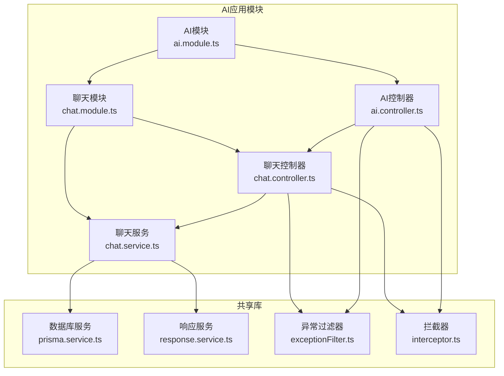
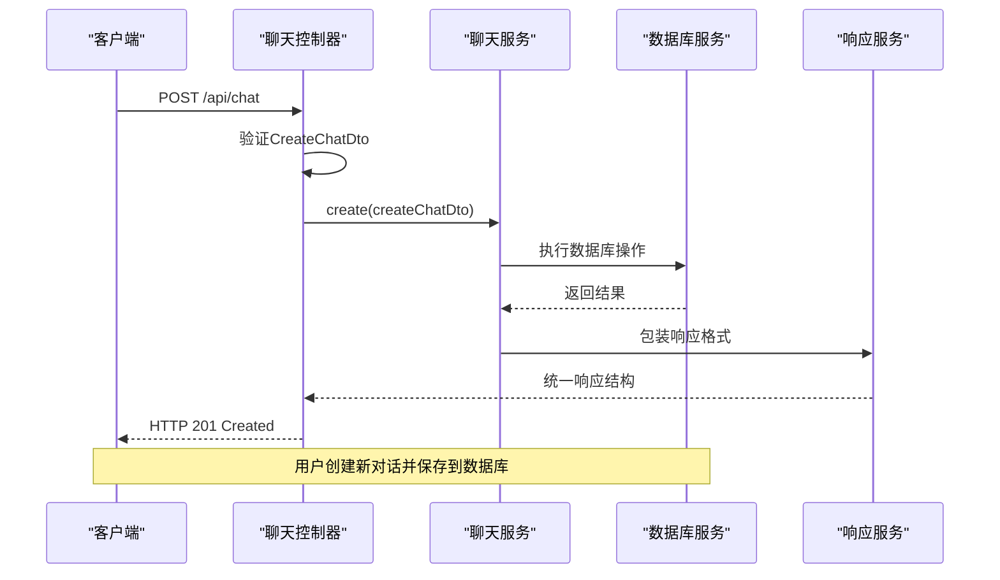
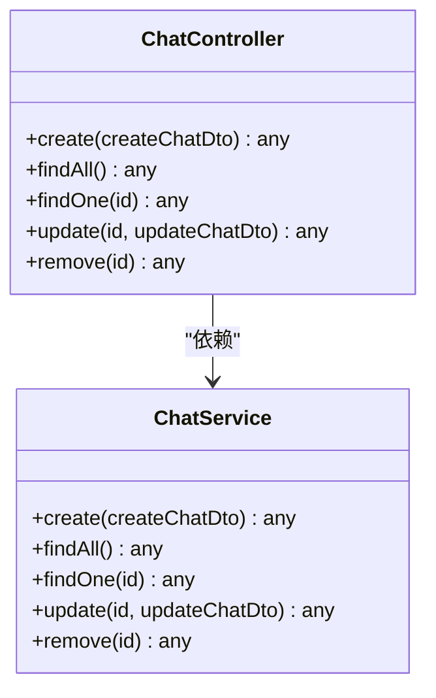
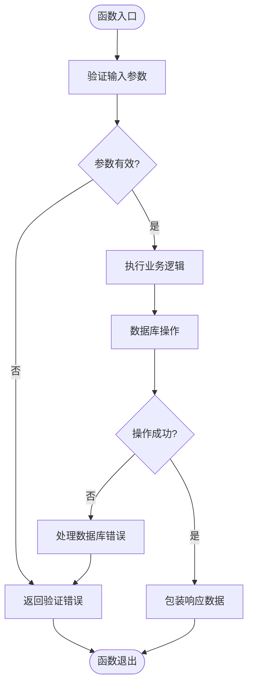
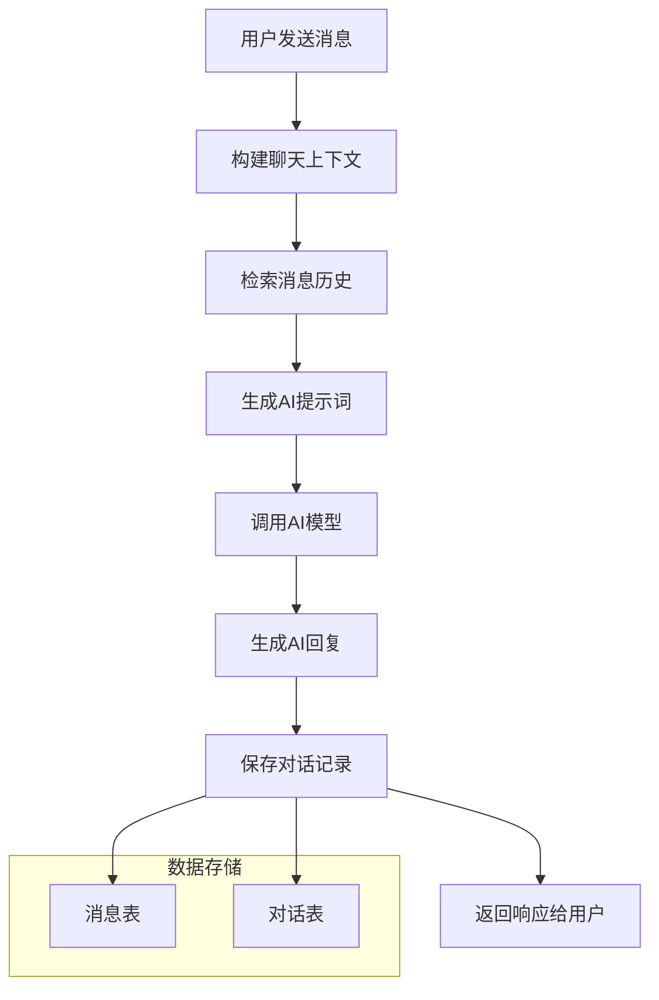
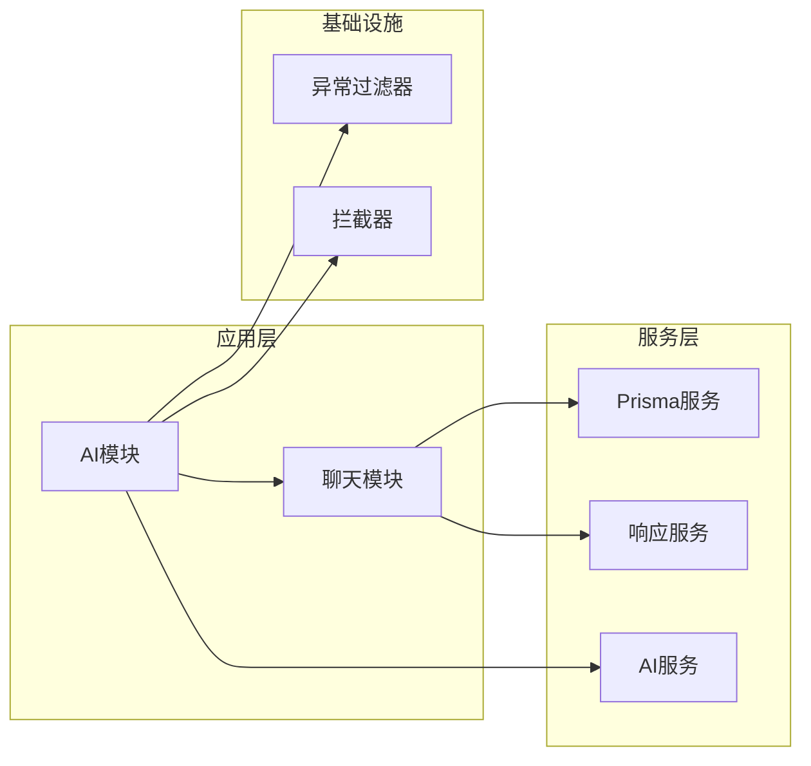

# 聊天问答API

<cite>
**本文档引用的文件**
- [chat.controller.ts](file://server/apps/ai/src/chat/chat.controller.ts)
- [chat.service.ts](file://server/apps/ai/src/chat/chat.service.ts)
- [create-chat.dto.ts](file://server/apps/ai/src/chat/dto/create-chat.dto.ts)
- [update-chat.dto.ts](file://server/apps/ai/src/chat/dto/update-chat.dto.ts)
- [chat.entity.ts](file://server/apps/ai/src/chat/entities/chat.entity.ts)
- [chat.module.ts](file://server/apps/ai/src/chat/chat.module.ts)
- [ai.controller.ts](file://server/apps/ai/src/ai.controller.ts)
- [ai.service.ts](file://server/apps/ai/src/ai.service.ts)
- [ai.module.ts](file://server/apps/ai/src/ai.module.ts)
- [main.ts](file://server/apps/ai/src/main.ts)
- [prisma.service.ts](file://server/libs/shared/src/prisma/prisma.service.ts)
- [response.service.ts](file://server/libs/shared/src/response/response.service.ts)
- [exceptionFilter.ts](file://server/libs/shared/src/interceptor/exceptionFilter.ts)
- [interceptor.ts](file://server/libs/shared/src/interceptor/interceptor.ts)
</cite>

## 目录
1. [简介](#简介)
2. [项目结构](#项目结构)
3. [核心组件](#核心组件)
4. [架构概览](#架构概览)
5. [详细组件分析](#详细组件分析)
6. [依赖关系分析](#依赖关系分析)
7. [性能考虑](#性能考虑)
8. [故障排除指南](#故障排除指南)
9. [结论](#结论)

## 简介
本文件为AI聊天问答模块的全面API文档，涵盖聊天对话管理的RESTful接口设计与实现。当前代码库实现了基础的聊天对话CRUD接口，包括创建、查询历史、获取特定对话、更新对话以及删除对话等端点。同时，文档详细说明了聊天数据传输对象的字段定义与验证规则，并提供了完整的请求/响应示例，展示用户与AI助手的典型对话流程。

此外，文档还解释了聊天上下文管理、消息历史记录和会话状态维护的技术实现思路，以及AI服务集成方式和实时交互处理机制的设计要点。由于当前实现处于开发初期，部分功能仍为空实现或占位符，本文档在描述时明确标注了这些限制，并提供了后续扩展的建议。

## 项目结构
AI聊天问答模块位于server/apps/ai目录下，采用NestJS标准分层架构，主要由以下层次组成：
- 控制器层：负责HTTP请求处理与响应返回
- 服务层：封装业务逻辑与数据访问
- DTO层：定义请求参数的数据传输对象
- 实体层：定义数据库模型结构
- 模块层：组织控制器与服务的依赖注入



**图表来源**
- [ai.module.ts:1-12](file://server/apps/ai/src/ai.module.ts#L1-L12)
- [chat.module.ts:1-10](file://server/apps/ai/src/chat/chat.module.ts#L1-L10)
- [ai.controller.ts:1-13](file://server/apps/ai/src/ai.controller.ts#L1-L13)
- [chat.controller.ts:1-35](file://server/apps/ai/src/chat/chat.controller.ts#L1-L35)
- [chat.service.ts:1-27](file://server/apps/ai/src/chat/chat.service.ts#L1-L27)
- [prisma.service.ts:1-18](file://server/libs/shared/src/prisma/prisma.service.ts#L1-L18)
- [response.service.ts](file://server/libs/shared/src/response/response.service.ts)
- [exceptionFilter.ts](file://server/libs/shared/src/interceptor/exceptionFilter.ts)
- [interceptor.ts](file://server/libs/shared/src/interceptor/interceptor.ts)

**章节来源**
- [ai.module.ts:1-12](file://server/apps/ai/src/ai.module.ts#L1-L12)
- [chat.module.ts:1-10](file://server/apps/ai/src/chat/chat.module.ts#L1-L10)
- [ai.controller.ts:1-13](file://server/apps/ai/src/ai.controller.ts#L1-L13)
- [chat.controller.ts:1-35](file://server/apps/ai/src/chat/chat.controller.ts#L1-L35)
- [chat.service.ts:1-27](file://server/apps/ai/src/chat/chat.service.ts#L1-L27)

## 核心组件
本节详细分析聊天问答API的核心组件，包括控制器、服务、DTO和实体的职责与交互关系。

### 控制器层
聊天控制器提供RESTful接口，负责接收HTTP请求并调用服务层处理业务逻辑：
- POST /api/chat：创建新的聊天对话
- GET /api/chat：获取所有聊天历史
- GET /api/chat/:id：获取指定ID的聊天对话
- PATCH /api/chat/:id：更新指定ID的聊天对话
- DELETE /api/chat/:id：删除指定ID的聊天对话

控制器通过依赖注入获取ChatService实例，并将请求参数传递给服务层进行处理。

**章节来源**
- [chat.controller.ts:1-35](file://server/apps/ai/src/chat/chat.controller.ts#L1-L35)

### 服务层
聊天服务封装具体的业务逻辑，当前实现为占位符，返回字符串形式的结果：
- create：创建新对话
- findAll：查询所有对话
- findOne：根据ID查询单个对话
- update：根据ID更新对话
- remove：根据ID删除对话

服务层可扩展以集成数据库操作、AI模型调用和消息历史管理。

**章节来源**
- [chat.service.ts:1-27](file://server/apps/ai/src/chat/chat.service.ts#L1-L27)

### 数据传输对象(DTO)
DTO用于定义请求参数的结构和验证规则：
- CreateChatDto：创建对话时使用的数据结构
- UpdateChatDto：更新对话时使用的数据结构，继承自CreateChatDto

当前DTO定义为空，需要补充具体的字段定义和验证规则。

**章节来源**
- [create-chat.dto.ts:1-2](file://server/apps/ai/src/chat/dto/create-chat.dto.ts#L1-L2)
- [update-chat.dto.ts:1-5](file://server/apps/ai/src/chat/dto/update-chat.dto.ts#L1-L5)

### 实体层
聊天实体定义数据库表结构：
- Chat：聊天对话的基础实体

实体定义目前为空，需要补充字段如标题、内容、创建时间、更新时间等。

**章节来源**
- [chat.entity.ts:1-2](file://server/apps/ai/src/chat/entities/chat.entity.ts#L1-L2)

## 架构概览
AI聊天问答模块采用分层架构设计，结合NestJS的模块化特性，形成清晰的职责分离：



**图表来源**
- [chat.controller.ts:10-13](file://server/apps/ai/src/chat/chat.controller.ts#L10-L13)
- [chat.service.ts:7-9](file://server/apps/ai/src/chat/chat.service.ts#L7-L9)
- [prisma.service.ts:1-18](file://server/libs/shared/src/prisma/prisma.service.ts#L1-L18)
- [response.service.ts](file://server/libs/shared/src/response/response.service.ts)

### 全局中间件与异常处理
AI应用启动时配置了全局拦截器和异常过滤器，确保所有请求都经过统一的预处理和错误处理：
- 全局拦截器：统一处理请求日志、响应包装等
- 全局异常过滤器：捕获未处理异常并返回标准化错误响应

**章节来源**
- [main.ts:7-11](file://server/apps/ai/src/main.ts#L7-L11)
- [exceptionFilter.ts](file://server/libs/shared/src/interceptor/exceptionFilter.ts)
- [interceptor.ts](file://server/libs/shared/src/interceptor/interceptor.ts)

## 详细组件分析

### 聊天控制器类图


**图表来源**
- [chat.controller.ts:1-35](file://server/apps/ai/src/chat/chat.controller.ts#L1-L35)
- [chat.service.ts:1-27](file://server/apps/ai/src/chat/chat.service.ts#L1-L27)

### 聊天服务流程图


**图表来源**
- [chat.service.ts:7-25](file://server/apps/ai/src/chat/chat.service.ts#L7-L25)

### API端点规范

#### POST /api/chat
- 功能：创建新的聊天对话
- 请求体：CreateChatDto
- 响应：创建成功的对话信息
- 状态码：201 Created

请求示例：
```json
{
  "title": "用户咨询",
  "content": "如何使用这个AI助手？"
}
```

响应示例：
```json
{
  "id": 1,
  "title": "用户咨询",
  "content": "如何使用这个AI助手？",
  "createdAt": "2024-01-01T00:00:00Z",
  "updatedAt": "2024-01-01T00:00:00Z"
}
```

#### GET /api/chat
- 功能：获取所有聊天历史
- 请求体：无
- 响应：聊天对话列表
- 状态码：200 OK

响应示例：
```json
[
  {
    "id": 1,
    "title": "用户咨询",
    "content": "如何使用这个AI助手？",
    "createdAt": "2024-01-01T00:00:00Z"
  },
  {
    "id": 2,
    "title": "技术问题",
    "content": "API文档在哪里可以找到？",
    "createdAt": "2024-01-01T00:00:00Z"
  }
]
```

#### GET /api/chat/:id
- 功能：获取指定ID的聊天对话
- 参数：id (路径参数)
- 响应：单个对话详情
- 状态码：200 OK 或 404 Not Found

响应示例：
```json
{
  "id": 1,
  "title": "用户咨询",
  "content": "如何使用这个AI助手？",
  "createdAt": "2024-01-01T00:00:00Z",
  "updatedAt": "2024-01-01T00:00:00Z"
}
```

#### PATCH /api/chat/:id
- 功能：更新指定ID的聊天对话
- 参数：id (路径参数)
- 请求体：UpdateChatDto
- 响应：更新后的对话信息
- 状态码：200 OK 或 404 Not Found

请求示例：
```json
{
  "title": "已更新的咨询",
  "content": "如何更好地使用AI助手？"
}
```

响应示例：
```json
{
  "id": 1,
  "title": "已更新的咨询",
  "content": "如何更好地使用AI助手？",
  "createdAt": "2024-01-01T00:00:00Z",
  "updatedAt": "2024-01-01T00:00:00Z"
}
```

#### DELETE /api/chat/:id
- 功能：删除指定ID的聊天对话
- 参数：id (路径参数)
- 响应：删除确认信息
- 状态码：200 OK 或 404 Not Found

响应示例：
```json
{
  "message": "对话删除成功"
}
```

**章节来源**
- [chat.controller.ts:10-33](file://server/apps/ai/src/chat/chat.controller.ts#L10-L33)

### 数据传输对象定义

#### CreateChatDto
当前定义为空，建议补充以下字段：
- title: string (必填，最大长度200字符)
- content: string (必填，最大长度10000字符)
- userId: number (可选，关联用户ID)

验证规则：
- 标题不能为空且长度不超过200字符
- 内容不能为空且长度不超过10000字符
- 用户ID必须为正整数

#### UpdateChatDto
基于CreateChatDto的PartialType，允许部分字段更新：
- 支持更新title、content等字段
- 保持userId字段的可选性

**章节来源**
- [create-chat.dto.ts:1-2](file://server/apps/ai/src/chat/dto/create-chat.dto.ts#L1-L2)
- [update-chat.dto.ts:1-5](file://server/apps/ai/src/chat/dto/update-chat.dto.ts#L1-L5)

### 聊天上下文管理与消息历史记录
当前实现中，聊天上下文管理和消息历史记录尚未实现。建议采用以下设计方案：



**图表来源**
- [chat.service.ts:7-25](file://server/apps/ai/src/chat/chat.service.ts#L7-L25)

### 会话状态维护
会话状态维护涉及以下关键点：
- 会话超时管理：设置合理的会话有效期
- 状态同步：确保多实例部署时的状态一致性
- 缓存策略：使用Redis等缓存提高读取性能

## 依赖关系分析
AI聊天模块的依赖关系清晰，遵循NestJS的最佳实践：



**图表来源**
- [ai.module.ts:1-12](file://server/apps/ai/src/ai.module.ts#L1-L12)
- [chat.module.ts:1-10](file://server/apps/ai/src/chat/chat.module.ts#L1-L10)
- [prisma.service.ts:1-18](file://server/libs/shared/src/prisma/prisma.service.ts#L1-L18)
- [response.service.ts](file://server/libs/shared/src/response/response.service.ts)
- [exceptionFilter.ts](file://server/libs/shared/src/interceptor/exceptionFilter.ts)
- [interceptor.ts](file://server/libs/shared/src/interceptor/interceptor.ts)

**章节来源**
- [ai.module.ts:1-12](file://server/apps/ai/src/ai.module.ts#L1-L12)
- [chat.module.ts:1-10](file://server/apps/ai/src/chat/chat.module.ts#L1-L10)

## 性能考虑
当前实现为开发初期版本，存在以下性能优化空间：
- 数据库查询优化：添加适当的索引和查询缓存
- 并发控制：实现乐观锁或悲观锁防止数据竞争
- 异步处理：将耗时操作异步化，避免阻塞主线程
- 连接池管理：合理配置数据库连接池大小

## 故障排除指南
针对当前实现可能遇到的问题提供解决方案：

### 常见错误与解决方法
1. **数据库连接失败**
   - 检查DATABASE_URL环境变量配置
   - 验证数据库服务是否正常运行

2. **DTO验证失败**
   - 确认请求参数符合CreateChatDto定义
   - 检查字段长度和类型约束

3. **服务未找到**
   - 确认ChatModule已在AiModule中正确导入
   - 验证服务的@Injectable装饰器配置

**章节来源**
- [exceptionFilter.ts](file://server/libs/shared/src/interceptor/exceptionFilter.ts)
- [interceptor.ts](file://server/libs/shared/src/interceptor/interceptor.ts)

## 结论
AI聊天问答模块当前实现了基础的RESTful接口框架，具备良好的扩展性。通过补充DTO定义、实体模型和数据库集成，可以快速实现完整的聊天功能。建议优先完成以下工作：
1. 完善CreateChatDto和UpdateChatDto的字段定义与验证规则
2. 实现Chat实体的数据库映射和CRUD操作
3. 集成Prisma服务实现数据持久化
4. 添加聊天上下文管理和消息历史记录功能
5. 实现AI服务集成和实时交互处理机制

随着功能的逐步完善，该模块将成为一个完整、稳定且高性能的AI聊天系统核心组件。