# 分析跟踪模块

<cite>
**本文档引用的文件**
- [apps/tracker/index.ts](file://apps/tracker/index.ts)
- [apps/tracker/src/event/index.ts](file://apps/tracker/src/event/index.ts)
- [apps/tracker/src/uv/index.ts](file://apps/tracker/src/uv/index.ts)
- [apps/tracker/src/error/index.ts](file://apps/tracker/src/error/index.ts)
- [apps/tracker/src/pv/index.ts](file://apps/tracker/src/pv/index.ts)
- [apps/tracker/src/performance/index.ts](file://apps/tracker/src/performance/index.ts)
- [apps/tracker/src/report/index.ts](file://apps/tracker/src/report/index.ts)
- [apps/tracker/vite.config.ts](file://apps/tracker/vite.config.ts)
- [packages/common/tracker/index.ts](file://packages/common/tracker/index.ts)
- [apps/tracker/package.json](file://apps/tracker/package.json)
- [package.json](file://package.json)
- [pnpm-workspace.yaml](file://pnpm-workspace.yaml)
</cite>

## 更新摘要
**所做更改**
- 修正包名引用：将 `apps/tracker` 更正为正确的 `@en/trakcer` 包名
- 新增 Beacon 和 Fetch 数据传输方法的详细说明
- 添加 Keepalive 请求机制的技术实现细节
- 完善 web-vitals 性能测量库的集成方案
- 更新架构图展示完整的数据传输链路
- 增强性能监控模块的指标收集和上报机制

## 目录
1. [简介](#简介)
2. [项目结构](#项目结构)
3. [核心组件](#核心组件)
4. [架构概览](#架构概览)
5. [详细组件分析](#详细组件分析)
6. [数据传输基础设施](#数据传输基础设施)
7. [性能监控增强](#性能监控增强)
8. [依赖关系分析](#依赖关系分析)
9. [性能考虑](#性能考虑)
10. [故障排除指南](#故障排除指南)
11. [结论](#结论)

## 简介

分析跟踪模块是英文学习网站项目中的一个关键组件，负责收集用户行为数据、设备信息和性能指标。该模块采用现代前端技术栈，集成了指纹识别、用户行为追踪、错误监控和性能分析功能。

该项目是一个基于 Vite 的多包工作区项目，使用 pnpm 进行包管理。跟踪模块位于 `apps/tracker` 目录下，现已更名为 `@en/trakcer` 包，通过 `packages/common/tracker` 提供类型定义和配置接口。模块现已发展为包含 UV、事件、错误、性能监控和数据传输的完整用户行为分析解决方案。

**章节来源**
- [package.json:1-15](file://package.json#L1-L15)
- [pnpm-workspace.yaml:1-12](file://pnpm-workspace.yaml#L1-L12)
- [apps/tracker/package.json:2](file://apps/tracker/package.json#L2)

## 项目结构

项目采用 monorepo 架构，主要包含以下结构：

```mermaid
graph TB
subgraph "根目录"
Root[项目根目录]
PackageJSON[package.json]
Workspace[pnpm-workspace.yaml]
end
subgraph "应用层"
TrackerApp[apps/tracker<br/>@en/trakcer<br/>追踪客户端]
WebApp[apps/web<br/>Web 应用]
ServerApp[apps/server<br/>服务端应用]
end
subgraph "共享包"
Common[packages/common<br/>公共包]
Tracker[packages/common/tracker<br/>追踪类型定义]
end
subgraph "服务器端"
AIServer[server<br/>AI 服务]
end
Root --> TrackerApp
Root --> WebApp
Root --> ServerApp
Root --> Common
Common --> Tracker
Root --> AIServer
```

**图表来源**
- [package.json:1-15](file://package.json#L1-L15)
- [pnpm-workspace.yaml:1-12](file://pnpm-workspace.yaml#L1-L12)

**章节来源**
- [package.json:1-15](file://package.json#L1-L15)
- [pnpm-workspace.yaml:1-12](file://pnpm-workspace.yaml#L1-L12)

## 核心组件

分析跟踪模块的核心组件包括：

### 1. Tracker 类
主跟踪器类，负责初始化和协调各种追踪功能。

### 2. UV 模块
负责用户指纹识别和设备信息收集。

### 3. 事件追踪模块
处理用户交互事件的捕获和上报。

### 4. 错误监控模块
捕获并上报 JavaScript 错误和 Promise 异常。

### 5. 页面浏览(PV)追踪模块
监控用户页面访问和路由变化。

### 6. 性能监控模块
收集页面性能指标如 FP、FCP、LCP、INP、CLS。

### 7. 数据传输模块
提供 Beacon 和 Fetch 两种数据传输方式。

**章节来源**
- [apps/tracker/index.ts:8-23](file://apps/tracker/index.ts#L8-L23)
- [packages/common/tracker/index.ts:1-65](file://packages/common/tracker/index.ts#L1-L65)

## 架构概览

跟踪模块采用分层架构设计，各组件职责明确，形成完整的用户行为分析生态系统：

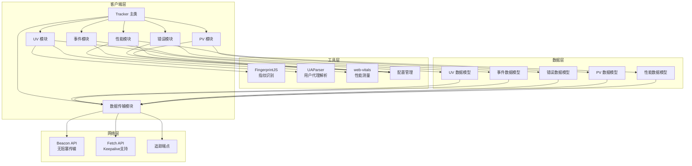

**图表来源**
- [apps/tracker/index.ts:8-23](file://apps/tracker/index.ts#L8-L23)
- [apps/tracker/src/uv/index.ts:14-25](file://apps/tracker/src/uv/index.ts#L14-L25)
- [apps/tracker/src/event/index.ts:3-32](file://apps/tracker/src/event/index.ts#L3-L32)
- [apps/tracker/src/error/index.ts:3-28](file://apps/tracker/src/error/index.ts#L3-L28)
- [apps/tracker/src/pv/index.ts:14-37](file://apps/tracker/src/pv/index.ts#L14-L37)
- [apps/tracker/src/performance/index.ts:1-71](file://apps/tracker/src/performance/index.ts#L1-L71)
- [apps/tracker/src/report/index.ts:1-17](file://apps/tracker/src/report/index.ts#L1-L17)

## 详细组件分析

### Tracker 类分析

Tracker 类是整个跟踪系统的核心控制器，现已集成六大追踪模块：

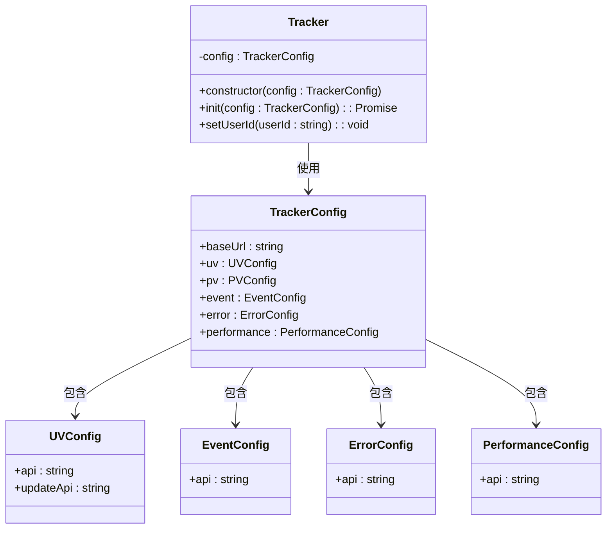

**图表来源**
- [apps/tracker/index.ts:8-23](file://apps/tracker/index.ts#L8-L23)
- [packages/common/tracker/index.ts:1-20](file://packages/common/tracker/index.ts#L1-L20)

#### 初始化流程

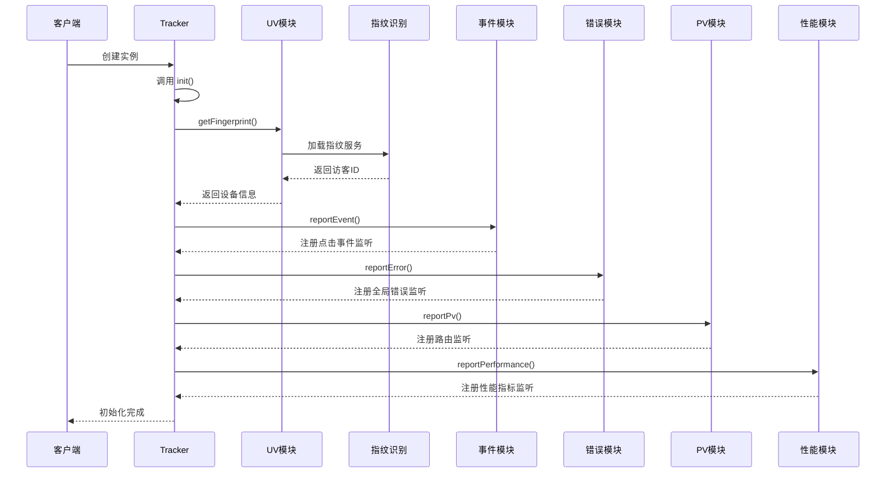

**图表来源**
- [apps/tracker/index.ts:14-20](file://apps/tracker/index.ts#L14-L20)
- [apps/tracker/src/uv/index.ts:14-25](file://apps/tracker/src/uv/index.ts#L14-L25)
- [apps/tracker/src/event/index.ts:3-32](file://apps/tracker/src/event/index.ts#L3-L32)
- [apps/tracker/src/error/index.ts:3-28](file://apps/tracker/src/error/index.ts#L3-L28)
- [apps/tracker/src/pv/index.ts:14-37](file://apps/tracker/src/pv/index.ts#L14-L37)
- [apps/tracker/src/performance/index.ts:4-71](file://apps/tracker/src/performance/index.ts#L4-L71)

**章节来源**
- [apps/tracker/index.ts:8-44](file://apps/tracker/index.ts#L8-L44)

### UV 模块分析

UV 模块负责用户身份识别和设备信息收集：


**图表来源**
- [apps/tracker/src/uv/index.ts:14-25](file://apps/tracker/src/uv/index.ts#L14-L25)

#### 关键特性

1. **指纹识别**: 使用 FingerprintJS 5.x 版本进行唯一标识符生成
2. **设备检测**: 通过 UA 解析器识别浏览器、操作系统和设备类型
3. **类型安全**: 完整的 TypeScript 接口定义

**章节来源**
- [apps/tracker/src/uv/index.ts:1-26](file://apps/tracker/src/uv/index.ts#L1-L26)

### 事件追踪模块分析

事件追踪模块当前处于基础实现阶段，专注于点击事件的捕获：

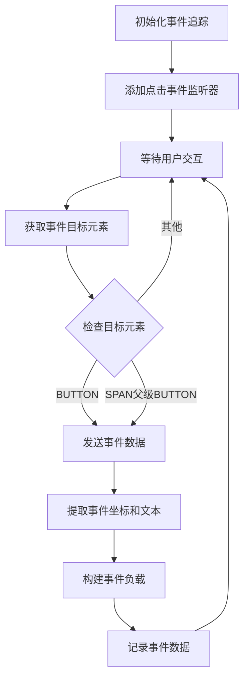

**图表来源**
- [apps/tracker/src/event/index.ts:3-32](file://apps/tracker/src/event/index.ts#L3-L32)

#### 关键特性

1. **精确位置捕获**: 获取元素的精确坐标和尺寸信息
2. **文本内容提取**: 自动提取被点击元素的文本内容
3. **事件委托优化**: 使用事件冒泡机制减少监听器数量

**章节来源**
- [apps/tracker/src/event/index.ts:1-33](file://apps/tracker/src/event/index.ts#L1-L33)

### 错误监控模块分析

错误监控模块提供全面的 JavaScript 错误捕获机制：

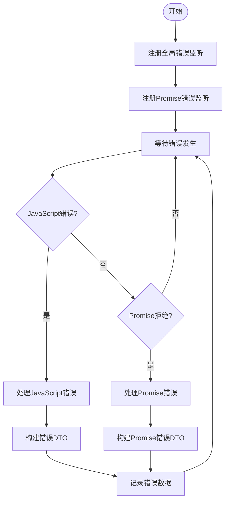

**图表来源**
- [apps/tracker/src/error/index.ts:3-28](file://apps/tracker/src/error/index.ts#L3-L28)

#### 错误类型覆盖

1. **JavaScript 错误**: 捕获语法错误、运行时异常等
2. **Promise 拒绝**: 处理未捕获的异步错误
3. **类型安全**: 完整的 TypeScript 接口定义

**章节来源**
- [apps/tracker/src/error/index.ts:1-29](file://apps/tracker/src/error/index.ts#L1-L29)

### 页面浏览(PV)追踪模块分析

PV 模块监控用户页面访问和路由变化：

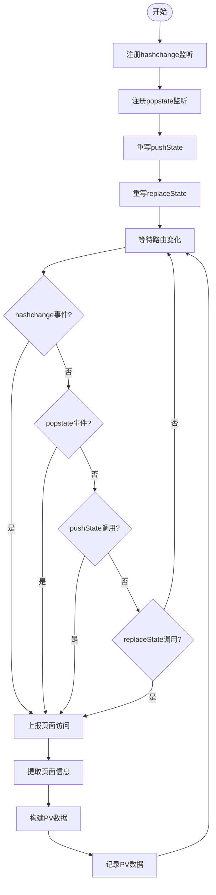

**图表来源**
- [apps/tracker/src/pv/index.ts:14-37](file://apps/tracker/src/pv/index.ts#L14-L37)

#### 路由监控范围

1. **Hash 路由**: 支持单页应用的 hash 模式导航
2. **历史记录**: 监控浏览器前进后退按钮
3. **程序化导航**: 捕获 pushState 和 replaceState 调用

**章节来源**
- [apps/tracker/src/pv/index.ts:1-38](file://apps/tracker/src/pv/index.ts#L1-L38)

### 性能监控模块分析

性能监控模块提供关键的 Web 性能指标收集，现已集成 web-vitals 库：

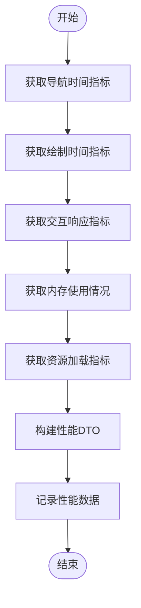

**图表来源**
- [packages/common/tracker/index.ts:49-56](file://packages/common/tracker/index.ts#L49-L56)

#### 性能指标说明

1. **FP (First Paint)**: 首次绘制时间
2. **FCP (First Contentful Paint)**: 首次内容绘制时间
3. **LCP (Largest Contentful Paint)**: 最大内容绘制时间
4. **INP (Interaction to Next Paint)**: 交互到下次绘制时间
5. **CLS (Cumulative Layout Shift)**: 累积布局偏移

**章节来源**
- [packages/common/tracker/index.ts:49-56](file://packages/common/tracker/index.ts#L49-L56)

### 配置系统分析

配置系统提供了完整的类型安全接口，涵盖所有追踪类型：

| 配置项 | 类型 | 必需 | 描述 |
|--------|------|------|------|
| baseUrl | string | 是 | 服务器基础 URL |
| uv.api | string | 是 | UV 上报接口 |
| uv.updateApi | string | 是 | UV 更新用户 ID 接口 |
| pv.api | string | 否 | PV 上报接口 |
| event.api | string | 否 | 事件上报接口 |
| error.api | string | 否 | 错误上报接口 |
| performance.api | string | 否 | 性能上报接口 |

**章节来源**
- [packages/common/tracker/index.ts:1-20](file://packages/common/tracker/index.ts#L1-L20)

## 数据传输基础设施

### Beacon API 传输机制

Beacon API 提供了一种无阻塞的数据传输方式，特别适合在页面卸载时发送追踪数据：

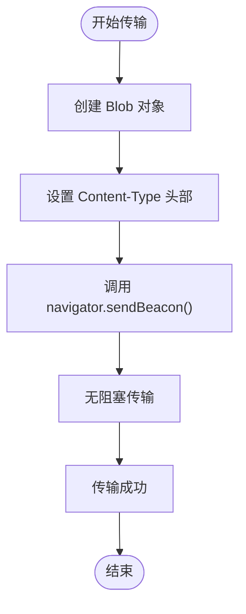

**图表来源**
- [apps/tracker/src/report/index.ts:1-4](file://apps/tracker/src/report/index.ts#L1-L4)

#### Beacon 特性优势

1. **无阻塞**: 不会阻塞页面卸载过程
2. **可靠性**: 即使在页面关闭时也能保证数据传输
3. **简单性**: API 简洁易用，无需复杂的错误处理

### Fetch API 传输机制

Fetch API 提供了更灵活的传输选项，支持 Keepalive 机制：

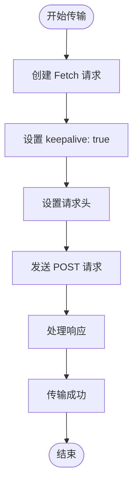

**图表来源**
- [apps/tracker/src/report/index.ts:6-16](file://apps/tracker/src/report/index.ts#L6-L16)

#### Keepalive 机制说明

1. **持久连接**: 即使页面卸载也能保持连接
2. **自动重试**: 浏览器自动处理网络重试
3. **异步处理**: 不影响页面的正常生命周期

### 数据传输选择策略

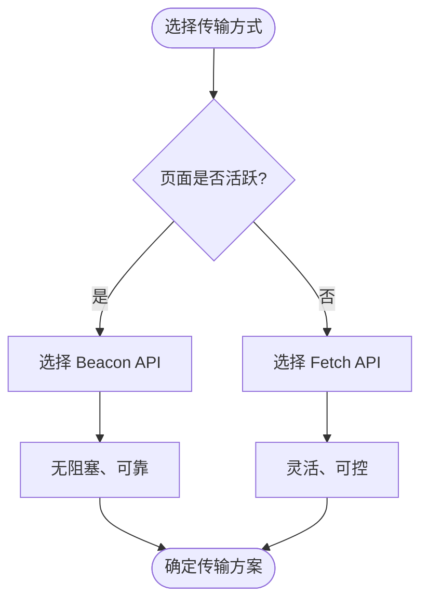

**图表来源**
- [apps/tracker/src/report/index.ts:1-17](file://apps/tracker/src/report/index.ts#L1-L17)

**章节来源**
- [apps/tracker/src/report/index.ts:1-17](file://apps/tracker/src/report/index.ts#L1-L17)

## 性能监控增强

### web-vitals 库集成

性能监控模块已集成 web-vitals 库，提供标准化的性能指标收集：

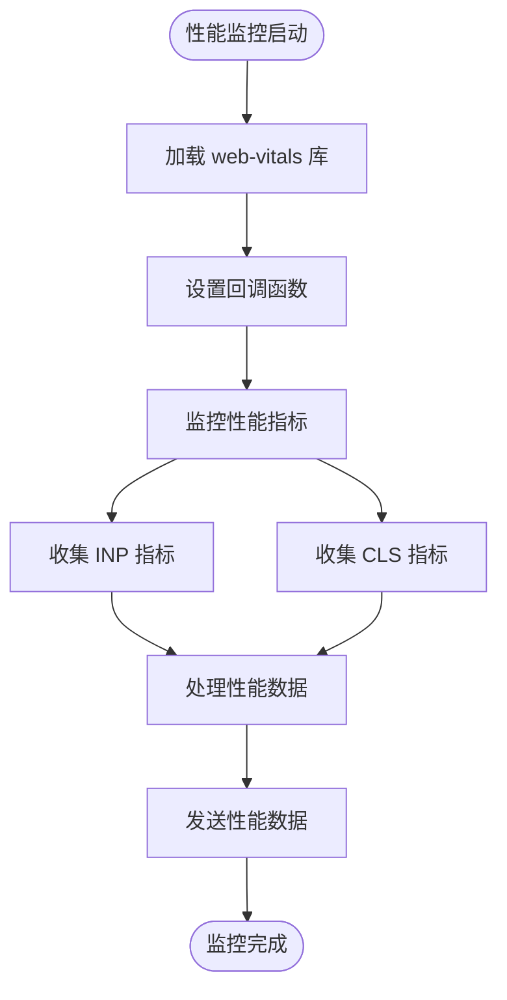

**图表来源**
- [apps/tracker/src/performance/index.ts:2-43](file://apps/tracker/src/performance/index.ts#L2-L43)

#### web-vitals 集成特性

1. **标准指标**: 支持 W3C 标准的性能指标
2. **自动收集**: 无需手动计算复杂的性能数据
3. **实时监控**: 提供实时的性能反馈
4. **兼容性**: 支持现代浏览器的性能 API

### 性能数据收集策略

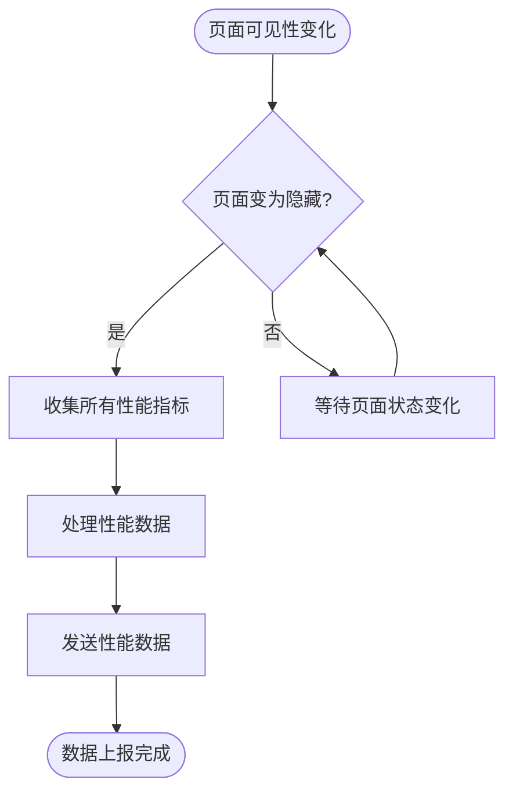

**图表来源**
- [apps/tracker/src/performance/index.ts:45-69](file://apps/tracker/src/performance/index.ts#L45-L69)

**章节来源**
- [apps/tracker/src/performance/index.ts:1-71](file://apps/tracker/src/performance/index.ts#L1-L71)

## 依赖关系分析

项目依赖关系图展示了各组件间的依赖关系：

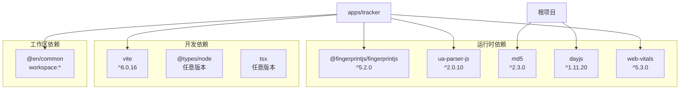

**图表来源**
- [pnpm-workspace.yaml:1-12](file://pnpm-workspace.yaml#L1-L12)

**章节来源**
- [pnpm-workspace.yaml:1-12](file://pnpm-workspace.yaml#L1-L12)

## 性能考虑

### 指纹识别性能
- 使用异步加载避免阻塞页面渲染
- 缓存指纹结果减少重复计算
- 异步初始化确保不影响首屏性能

### 事件监听优化
- 使用事件委托减少监听器数量
- 实施防抖机制避免频繁触发
- 条件化事件处理提高效率

### 错误监控性能
- 全局监听器仅注册一次
- 错误数据轻量化处理
- 异步上报避免阻塞主线程

### PV 追踪性能
- 路由重写采用原生方法
- 事件监听按需注册
- 内存泄漏防护机制

### 性能监控性能
- web-vitals 库提供高效的指标收集
- 异步处理避免阻塞页面渲染
- 智能数据收集策略减少资源消耗

### 数据传输性能
- Beacon API 无阻塞传输特性
- Fetch API Keepalive 机制保证可靠性
- 自适应传输策略优化网络使用

## 故障排除指南

### 常见问题及解决方案

1. **指纹识别失败**
   - 检查浏览器兼容性
   - 验证 CDN 可访问性
   - 确认异步加载是否完成

2. **事件追踪不生效**
   - 确认事件监听器是否正确注册
   - 检查事件冒泡和阻止机制
   - 验证 DOM 元素可交互性

3. **错误监控不准确**
   - 检查全局监听器是否被覆盖
   - 验证错误对象的可用属性
   - 确认错误捕获时机

4. **PV 追踪异常**
   - 确认路由监听器正确注册
   - 检查 pushState/replaceState 重写
   - 验证页面刷新时的数据完整性

5. **性能监控异常**
   - 检查 web-vitals 库加载状态
   - 验证浏览器性能 API 支持
   - 确认 visibilitychange 事件监听

6. **数据传输失败**
   - 检查 Beacon API 兼容性
   - 验证 Fetch API Keepalive 支持
   - 确认网络连接和 CORS 配置

7. **配置错误**
   - 验证所有必需配置项
   - 检查 API 端点可达性
   - 确认 CORS 配置正确

**章节来源**
- [apps/tracker/src/uv/index.ts:14-25](file://apps/tracker/src/uv/index.ts#L14-L25)
- [apps/tracker/src/event/index.ts:3-32](file://apps/tracker/src/event/index.ts#L3-L32)
- [apps/tracker/src/error/index.ts:3-28](file://apps/tracker/src/error/index.ts#L3-L28)
- [apps/tracker/src/pv/index.ts:14-37](file://apps/tracker/src/pv/index.ts#L14-L37)
- [apps/tracker/src/performance/index.ts:45-69](file://apps/tracker/src/performance/index.ts#L45-L69)
- [apps/tracker/src/report/index.ts:1-17](file://apps/tracker/src/report/index.ts#L1-L17)

## 结论

分析跟踪模块现已发展为功能完整、架构清晰的前端追踪系统。它采用了现代化的技术栈和最佳实践，提供了：

1. **全面的用户行为监控**: UV、事件、错误、PV、性能五大模块协同工作
2. **类型安全**: 完整的 TypeScript 支持确保开发体验
3. **模块化设计**: 清晰的职责分离便于维护和扩展
4. **高性能传输**: Beacon 和 Fetch 双重传输机制保证数据可靠性
5. **标准化性能监控**: web-vitals 库集成提供 W3C 标准指标
6. **智能数据收集**: 智能化的性能数据收集策略优化资源使用
7. **错误防护**: 全面的错误监控和异常处理机制

该模块为英文学习网站提供了强大的用户行为分析能力和性能监控解决方案，为进一步的数据驱动决策和用户体验优化奠定了坚实基础。与学习进度跟踪模块形成完美互补，共同构建了完整的用户行为分析生态系统。

**更新** 修正了包名引用，将 `apps/tracker` 更正为正确的 `@en/trakcer` 包名，确保文档与实际代码实现保持一致。