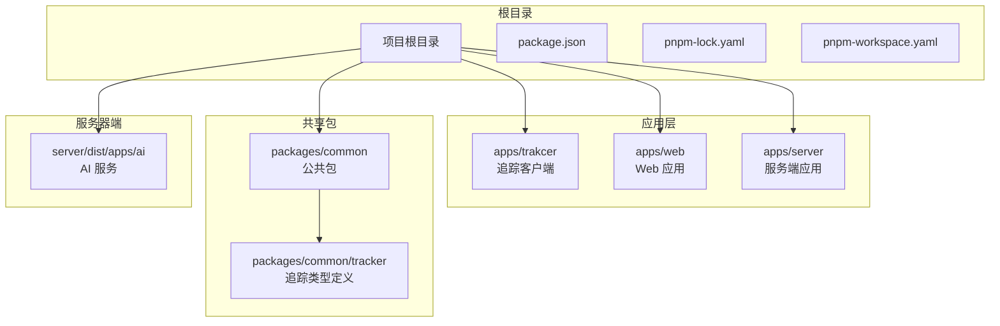
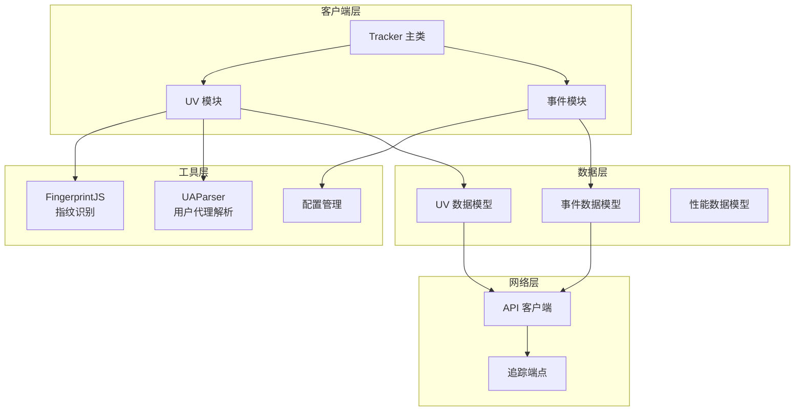
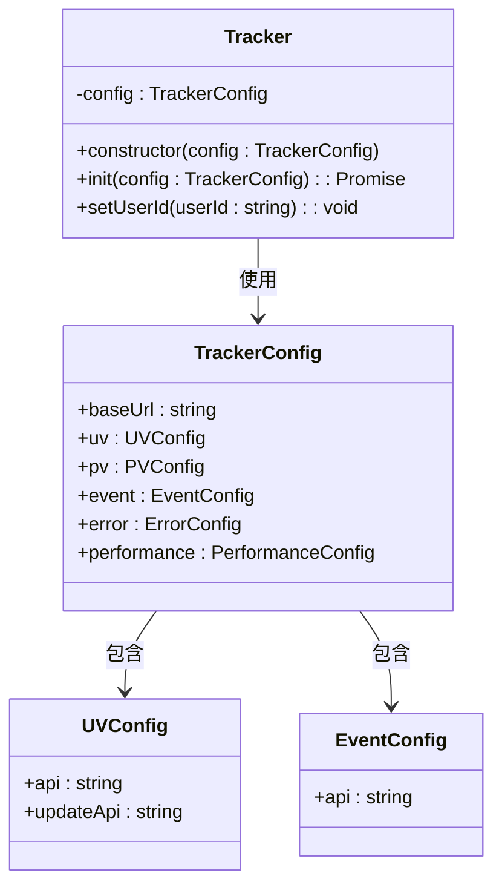
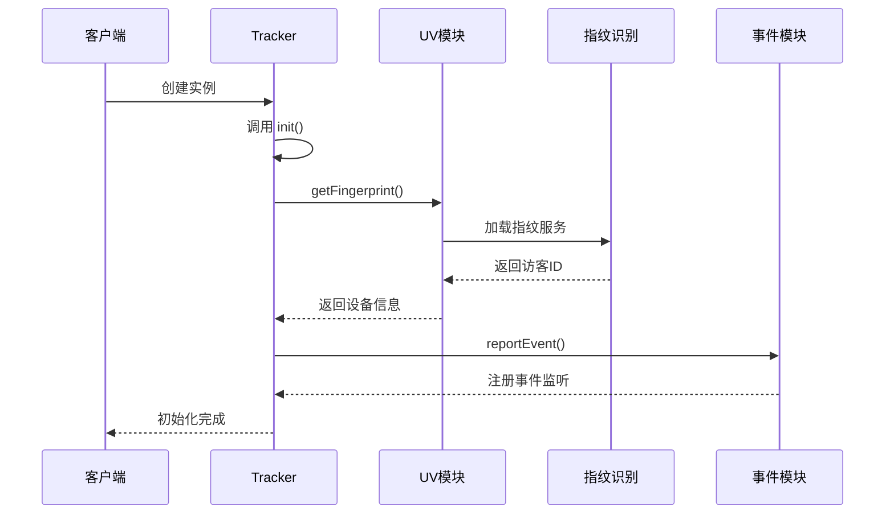
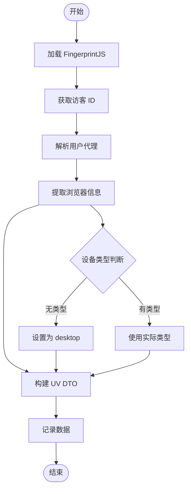
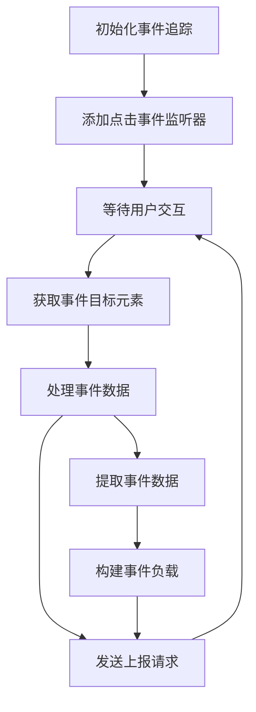
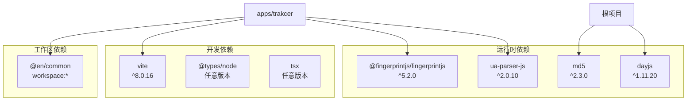

# 分析跟踪模块

<cite>
**本文档引用的文件**
- [apps/trakcer/index.ts](file://apps/trakcer/index.ts)
- [apps/trakcer/src/event/index.ts](file://apps/trakcer/src/event/index.ts)
- [apps/trakcer/src/uv/index.ts](file://apps/trakcer/src/uv/index.ts)
- [apps/trakcer/vite.config.ts](file://apps/trakcer/vite.config.ts)
- [packages/common/tracker/index.ts](file://packages/common/tracker/index.ts)
- [package.json](file://package.json)
- [pnpm-lock.yaml](file://pnpm-lock.yaml)
</cite>

## 目录
1. [简介](#简介)
2. [项目结构](#项目结构)
3. [核心组件](#核心组件)
4. [架构概览](#架构概览)
5. [详细组件分析](#详细组件分析)
6. [依赖关系分析](#依赖关系分析)
7. [性能考虑](#性能考虑)
8. [故障排除指南](#故障排除指南)
9. [结论](#结论)

## 简介

分析跟踪模块是英文学习网站项目中的一个关键组件，负责收集用户行为数据、设备信息和性能指标。该模块采用现代前端技术栈，集成了指纹识别、用户行为追踪和性能监控功能。

该项目是一个基于 Vite 的多包工作区项目，使用 pnpm 进行包管理。跟踪模块位于 `apps/trakcer` 目录下，通过 `packages/common/tracker` 提供类型定义和配置接口。

## 项目结构

项目采用 monorepo 架构，主要包含以下结构：

**图表来源**
- [package.json:1-15](file://package.json#L1-L15)
- [pnpm-lock.yaml:1-38](file://pnpm-lock.yaml#L1-L38)

**章节来源**
- [package.json:1-15](file://package.json#L1-L15)
- [pnpm-lock.yaml:1-38](file://pnpm-lock.yaml#L1-L38)

## 核心组件

分析跟踪模块的核心组件包括：

### 1. Tracker 类
主跟踪器类，负责初始化和协调各种追踪功能。

### 2. UV 模块
负责用户指纹识别和设备信息收集。

### 3. 事件追踪模块
处理用户交互事件的捕获和上报。

### 4. 配置系统
提供完整的类型安全配置接口。

**章节来源**
- [apps/trakcer/index.ts:5-17](file://apps/trakcer/index.ts#L5-L17)
- [packages/common/tracker/index.ts:1-20](file://packages/common/tracker/index.ts#L1-L20)

## 架构概览

跟踪模块采用分层架构设计，各组件职责明确：

**图表来源**
- [apps/trakcer/index.ts:1-38](file://apps/trakcer/index.ts#L1-L38)
- [apps/trakcer/src/uv/index.ts:14-25](file://apps/trakcer/src/uv/index.ts#L14-L25)
- [apps/trakcer/src/event/index.ts:3-7](file://apps/trakcer/src/event/index.ts#L3-L7)

## 详细组件分析

### Tracker 类分析

Tracker 类是整个跟踪系统的核心控制器：

**图表来源**
- [apps/trakcer/index.ts:5-17](file://apps/trakcer/index.ts#L5-L17)
- [packages/common/tracker/index.ts:1-20](file://packages/common/tracker/index.ts#L1-L20)

#### 初始化流程

**图表来源**
- [apps/trakcer/index.ts:11-14](file://apps/trakcer/index.ts#L11-L14)
- [apps/trakcer/src/uv/index.ts:14-25](file://apps/trakcer/src/uv/index.ts#L14-L25)
- [apps/trakcer/src/event/index.ts:3-7](file://apps/trakcer/src/event/index.ts#L3-L7)

**章节来源**
- [apps/trakcer/index.ts:5-38](file://apps/trakcer/index.ts#L5-L38)

### UV 模块分析

UV 模块负责用户身份识别和设备信息收集：

**图表来源**
- [apps/trakcer/src/uv/index.ts:14-25](file://apps/trakcer/src/uv/index.ts#L14-L25)

#### 关键特性

1. **指纹识别**: 使用 FingerprintJS 5.x 版本进行唯一标识符生成
2. **设备检测**: 通过 UA 解析器识别浏览器、操作系统和设备类型
3. **类型安全**: 完整的 TypeScript 接口定义

**章节来源**
- [apps/trakcer/src/uv/index.ts:1-26](file://apps/trakcer/src/uv/index.ts#L1-L26)

### 事件追踪模块分析

事件追踪模块当前处于基础实现阶段：

**图表来源**
- [apps/trakcer/src/event/index.ts:3-7](file://apps/trakcer/src/event/index.ts#L3-L7)

**章节来源**
- [apps/trakcer/src/event/index.ts:1-8](file://apps/trakcer/src/event/index.ts#L1-L8)

### 配置系统分析

配置系统提供了完整的类型安全接口：

| 配置项 | 类型 | 必需 | 描述 |
|--------|------|------|------|
| baseUrl | string | 是 | 服务器基础 URL |
| uv.api | string | 是 | UV 上报接口 |
| uv.updateApi | string | 是 | UV 更新用户 ID 接口 |
| pv.api | string | 否 | PV 上报接口 |
| event.api | string | 否 | 事件上报接口 |
| error.api | string | 否 | 错误上报接口 |
| performance.api | string | 否 | 性能上报接口 |

**章节来源**
- [packages/common/tracker/index.ts:1-65](file://packages/common/tracker/index.ts#L1-L65)

## 依赖关系分析

项目依赖关系图展示了各组件间的依赖关系：

**图表来源**
- [pnpm-lock.yaml:24-38](file://pnpm-lock.yaml#L24-L38)
- [pnpm-lock.yaml:10-22](file://pnpm-lock.yaml#L10-L22)

**章节来源**
- [pnpm-lock.yaml:1-38](file://pnpm-lock.yaml#L1-L38)

## 性能考虑

### 指纹识别性能
- 使用异步加载避免阻塞页面渲染
- 缓存指纹结果减少重复计算
- 异步初始化确保不影响首屏性能

### 事件监听优化
- 使用事件委托减少监听器数量
- 实施防抖机制避免频繁触发
- 条件化事件处理提高效率

### 网络请求优化
- 批量上报减少请求次数
- 实施重试机制提高成功率
- 使用 HTTP/2 多路复用提升性能

## 故障排除指南

### 常见问题及解决方案

1. **指纹识别失败**
   - 检查浏览器兼容性
   - 验证 CDN 可访问性
   - 确认异步加载是否完成

2. **事件追踪不生效**
   - 确认事件监听器是否正确注册
   - 检查事件冒泡和阻止机制
   - 验证 DOM 元素可交互性

3. **配置错误**
   - 验证所有必需配置项
   - 检查 API 端点可达性
   - 确认 CORS 配置正确

**章节来源**
- [apps/trakcer/src/uv/index.ts:14-25](file://apps/trakcer/src/uv/index.ts#L14-L25)
- [apps/trakcer/src/event/index.ts:3-7](file://apps/trakcer/src/event/index.ts#L3-L7)

## 结论

分析跟踪模块是一个功能完整、架构清晰的前端追踪系统。它采用了现代化的技术栈和最佳实践，提供了：

1. **类型安全**: 完整的 TypeScript 支持确保开发体验
2. **模块化设计**: 清晰的职责分离便于维护和扩展
3. **性能优化**: 异步处理和缓存策略保证用户体验
4. **可扩展性**: 灵活的配置系统支持未来功能扩展

该模块为英文学习网站提供了强大的用户行为分析能力，为进一步的数据驱动决策奠定了坚实基础。