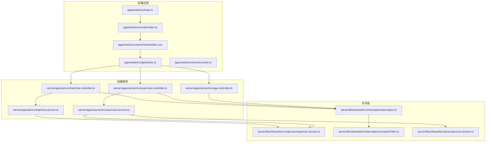
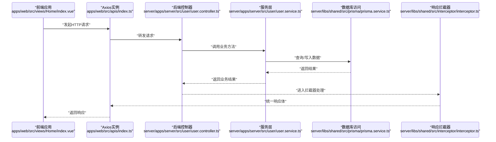
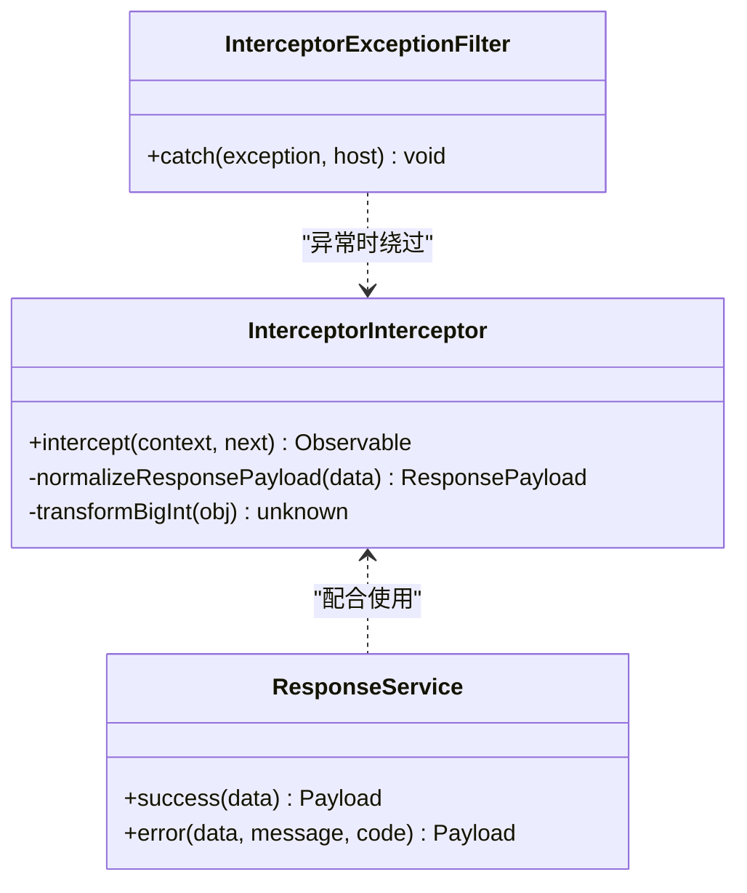
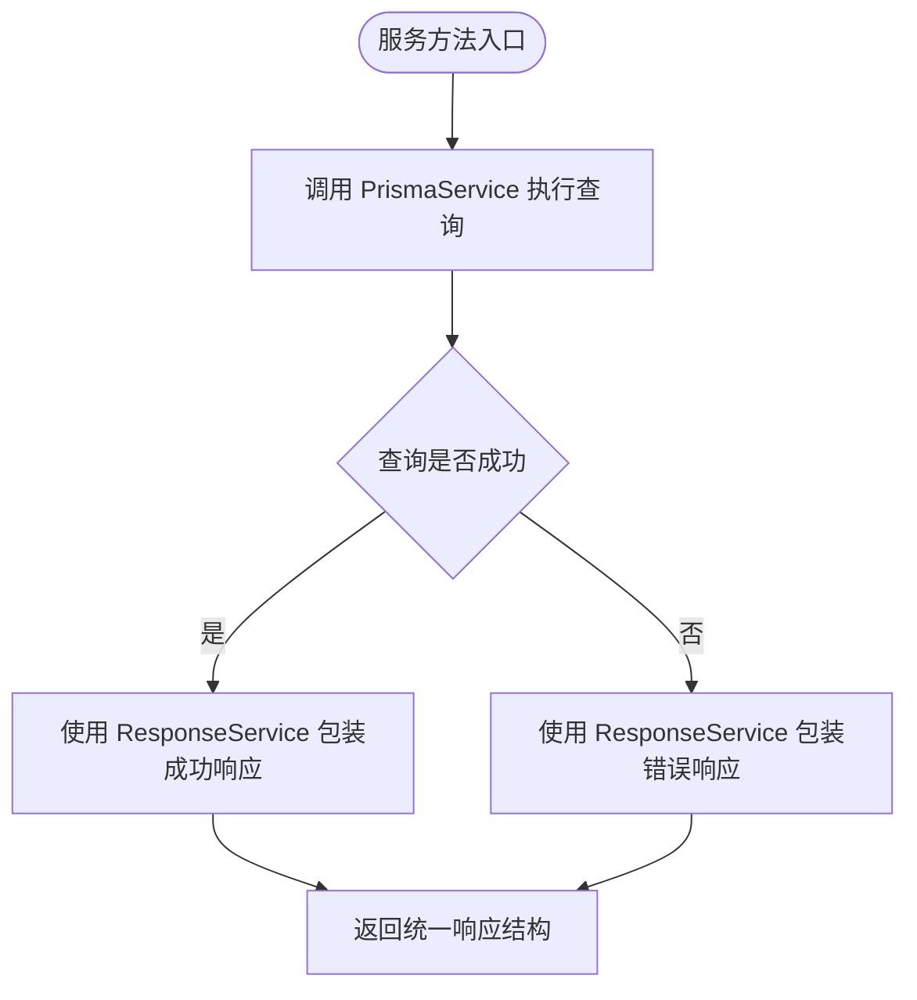
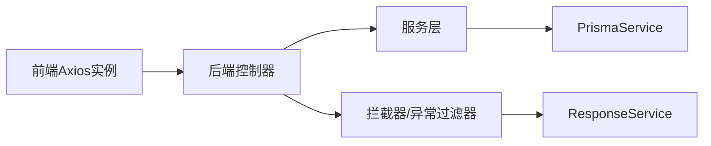

# API集成

<cite>
**本文引用的文件**
- [apps/web/src/apis/index.ts](file://apps/web/src/apis/index.ts)
- [apps/web/src/main.ts](file://apps/web/src/main.ts)
- [apps/web/package.json](file://apps/web/package.json)
- [apps/web/src/router/index.ts](file://apps/web/src/router/index.ts)
- [apps/web/src/views/Home/index.vue](file://apps/web/src/views/Home/index.vue)
- [apps/web/src/stores/counter.ts](file://apps/web/src/stores/counter.ts)
- [server/libs/shared/src/interceptor/interceptor.ts](file://server/libs/shared/src/interceptor/interceptor.ts)
- [server/libs/shared/src/interceptor/exceptionFilter.ts](file://server/libs/shared/src/interceptor/exceptionFilter.ts)
- [server/libs/shared/src/response/response.service.ts](file://server/libs/shared/src/response/response.service.ts)
- [server/libs/shared/src/prisma/prisma.service.ts](file://server/libs/shared/src/prisma/prisma.service.ts)
- [server/apps/server/src/app.controller.ts](file://server/apps/server/src/app.controller.ts)
- [server/apps/server/src/user/user.controller.ts](file://server/apps/server/src/user/user.controller.ts)
- [server/apps/server/src/user/user.service.ts](file://server/apps/server/src/user/user.service.ts)
- [server/apps/ai/src/chat/chat.controller.ts](file://server/apps/ai/src/chat/chat.controller.ts)
- [server/apps/ai/src/chat/chat.service.ts](file://server/apps/ai/src/chat/chat.service.ts)
</cite>

## 目录
1. [简介](#简介)
2. [项目结构](#项目结构)
3. [核心组件](#核心组件)
4. [架构总览](#架构总览)
5. [详细组件分析](#详细组件分析)
6. [依赖分析](#依赖分析)
7. [性能考虑](#性能考虑)
8. [故障排查指南](#故障排查指南)
9. [结论](#结论)
10. [附录](#附录)

## 简介
本文件面向API集成与前后端通信，系统性梳理前端Axios实例、后端NestJS拦截器与异常过滤器、统一响应模型、数据库访问层以及前端路由与状态管理的协作方式。文档覆盖请求处理流程、HTTP配置、错误处理策略、认证与拦截器使用建议、缓存与性能优化、异步数据处理与loading状态管理、错误恢复方案，以及常见集成场景与最佳实践。

## 项目结构
该仓库采用多包工作区布局：前端应用位于 apps/web，后端服务分为两个子应用（server、ai），共享库位于 server/libs/shared。前端通过 Axios 实例发起HTTP请求，后端通过拦截器统一包装响应体，异常过滤器统一返回错误结构，PrismaService负责数据库连接与查询。

图表来源
- [apps/web/src/main.ts:1-21](file://apps/web/src/main.ts#L1-L21)
- [apps/web/src/router/index.ts:1-13](file://apps/web/src/router/index.ts#L1-L13)
- [apps/web/src/apis/index.ts:1-6](file://apps/web/src/apis/index.ts#L1-L6)
- [apps/web/src/views/Home/index.vue:1-7](file://apps/web/src/views/Home/index.vue#L1-L7)
- [apps/web/src/stores/counter.ts:1-13](file://apps/web/src/stores/counter.ts#L1-L13)
- [server/apps/server/src/app.controller.ts:1-13](file://server/apps/server/src/app.controller.ts#L1-L13)
- [server/apps/server/src/user/user.controller.ts:1-35](file://server/apps/server/src/user/user.controller.ts#L1-L35)
- [server/apps/server/src/user/user.service.ts:1-34](file://server/apps/server/src/user/user.service.ts#L1-L34)
- [server/apps/ai/src/chat/chat.controller.ts:1-35](file://server/apps/ai/src/chat/chat.controller.ts#L1-L35)
- [server/apps/ai/src/chat/chat.service.ts:1-27](file://server/apps/ai/src/chat/chat.service.ts#L1-L27)
- [server/libs/shared/src/response/response.service.ts:1-29](file://server/libs/shared/src/response/response.service.ts#L1-L29)
- [server/libs/shared/src/interceptor/interceptor.ts:1-86](file://server/libs/shared/src/interceptor/interceptor.ts#L1-L86)
- [server/libs/shared/src/interceptor/exceptionFilter.ts:1-23](file://server/libs/shared/src/interceptor/exceptionFilter.ts#L1-L23)
- [server/libs/shared/src/prisma/prisma.service.ts:1-18](file://server/libs/shared/src/prisma/prisma.service.ts#L1-L18)

章节来源
- [apps/web/src/main.ts:1-21](file://apps/web/src/main.ts#L1-L21)
- [apps/web/src/router/index.ts:1-13](file://apps/web/src/router/index.ts#L1-L13)
- [apps/web/src/apis/index.ts:1-6](file://apps/web/src/apis/index.ts#L1-L6)
- [apps/web/src/views/Home/index.vue:1-7](file://apps/web/src/views/Home/index.vue#L1-L7)
- [apps/web/src/stores/counter.ts:1-13](file://apps/web/src/stores/counter.ts#L1-L13)
- [server/apps/server/src/app.controller.ts:1-13](file://server/apps/server/src/app.controller.ts#L1-L13)
- [server/apps/server/src/user/user.controller.ts:1-35](file://server/apps/server/src/user/user.controller.ts#L1-L35)
- [server/apps/server/src/user/user.service.ts:1-34](file://server/apps/server/src/user/user.service.ts#L1-L34)
- [server/apps/ai/src/chat/chat.controller.ts:1-35](file://server/apps/ai/src/chat/chat.controller.ts#L1-L35)
- [server/apps/ai/src/chat/chat.service.ts:1-27](file://server/apps/ai/src/chat/chat.service.ts#L1-L27)
- [server/libs/shared/src/response/response.service.ts:1-29](file://server/libs/shared/src/response/response.service.ts#L1-L29)
- [server/libs/shared/src/interceptor/interceptor.ts:1-86](file://server/libs/shared/src/interceptor/interceptor.ts#L1-L86)
- [server/libs/shared/src/interceptor/exceptionFilter.ts:1-23](file://server/libs/shared/src/interceptor/exceptionFilter.ts#L1-L23)
- [server/libs/shared/src/prisma/prisma.service.ts:1-18](file://server/libs/shared/src/prisma/prisma.service.ts#L1-L18)

## 核心组件
- 前端Axios实例
  - 在 apps/web/src/apis/index.ts 中创建了基础HTTP客户端，设置基础URL与超时时间，作为所有API调用的统一入口。
  - 参考路径：[apps/web/src/apis/index.ts:1-6](file://apps/web/src/apis/index.ts#L1-L6)
- 后端统一响应与拦截
  - InterceptorInterceptor：将控制器返回的数据标准化为统一响应体，自动注入时间戳、路径、消息、状态码与成功标志，并对大数据整型进行序列化处理。
  - InterceptorExceptionFilter：捕获HTTP异常，统一输出错误响应结构，包含时间戳、路径、消息与状态码。
  - ResponseService：提供 success/error 快捷方法，用于构造业务响应载荷。
  - 参考路径：
    - [server/libs/shared/src/interceptor/interceptor.ts:1-86](file://server/libs/shared/src/interceptor/interceptor.ts#L1-L86)
    - [server/libs/shared/src/interceptor/exceptionFilter.ts:1-23](file://server/libs/shared/src/interceptor/exceptionFilter.ts#L1-L23)
    - [server/libs/shared/src/response/response.service.ts:1-29](file://server/libs/shared/src/response/response.service.ts#L1-L29)
- 数据库访问层
  - PrismaService：基于环境变量连接数据库，向上游服务提供ORM能力。
  - 参考路径：[server/libs/shared/src/prisma/prisma.service.ts:1-18](file://server/libs/shared/src/prisma/prisma.service.ts#L1-L18)
- 控制器与服务
  - AppController、UserController、ChatController：定义REST接口，委托给对应Service处理业务。
  - UserService：演示如何使用 PrismaService 查询数据并以 ResponseService 包装响应。
  - ChatService：演示增删改查方法占位。
  - 参考路径：
    - [server/apps/server/src/app.controller.ts:1-13](file://server/apps/server/src/app.controller.ts#L1-L13)
    - [server/apps/server/src/user/user.controller.ts:1-35](file://server/apps/server/src/user/user.controller.ts#L1-L35)
    - [server/apps/server/src/user/user.service.ts:1-34](file://server/apps/server/src/user/user.service.ts#L1-L34)
    - [server/apps/ai/src/chat/chat.controller.ts:1-35](file://server/apps/ai/src/chat/chat.controller.ts#L1-L35)
    - [server/apps/ai/src/chat/chat.service.ts:1-27](file://server/apps/ai/src/chat/chat.service.ts#L1-L27)

章节来源
- [apps/web/src/apis/index.ts:1-6](file://apps/web/src/apis/index.ts#L1-L6)
- [server/libs/shared/src/interceptor/interceptor.ts:1-86](file://server/libs/shared/src/interceptor/interceptor.ts#L1-L86)
- [server/libs/shared/src/interceptor/exceptionFilter.ts:1-23](file://server/libs/shared/src/interceptor/exceptionFilter.ts#L1-L23)
- [server/libs/shared/src/response/response.service.ts:1-29](file://server/libs/shared/src/response/response.service.ts#L1-L29)
- [server/libs/shared/src/prisma/prisma.service.ts:1-18](file://server/libs/shared/src/prisma/prisma.service.ts#L1-L18)
- [server/apps/server/src/app.controller.ts:1-13](file://server/apps/server/src/app.controller.ts#L1-L13)
- [server/apps/server/src/user/user.controller.ts:1-35](file://server/apps/server/src/user/user.controller.ts#L1-L35)
- [server/apps/server/src/user/user.service.ts:1-34](file://server/apps/server/src/user/user.service.ts#L1-L34)
- [server/apps/ai/src/chat/chat.controller.ts:1-35](file://server/apps/ai/src/chat/chat.controller.ts#L1-L35)
- [server/apps/ai/src/chat/chat.service.ts:1-27](file://server/apps/ai/src/chat/chat.service.ts#L1-L27)

## 架构总览
下图展示了从前端到后端的典型请求链路：前端通过Axios实例发起请求，后端控制器接收请求，服务层执行业务逻辑并访问数据库，最终由拦截器统一包装响应返回。

图表来源
- [apps/web/src/views/Home/index.vue:1-7](file://apps/web/src/views/Home/index.vue#L1-L7)
- [apps/web/src/apis/index.ts:1-6](file://apps/web/src/apis/index.ts#L1-L6)
- [server/apps/server/src/user/user.controller.ts:1-35](file://server/apps/server/src/user/user.controller.ts#L1-L35)
- [server/apps/server/src/user/user.service.ts:1-34](file://server/apps/server/src/user/user.service.ts#L1-L34)
- [server/libs/shared/src/prisma/prisma.service.ts:1-18](file://server/libs/shared/src/prisma/prisma.service.ts#L1-L18)
- [server/libs/shared/src/interceptor/interceptor.ts:1-86](file://server/libs/shared/src/interceptor/interceptor.ts#L1-L86)

## 详细组件分析

### 前端API封装与使用
- Axios实例配置
  - 基础URL指向本地后端服务，超时时间设定为10秒，便于统一管理跨域、代理与重试策略。
  - 参考路径：[apps/web/src/apis/index.ts:1-6](file://apps/web/src/apis/index.ts#L1-L6)
- 路由与视图
  - 路由注册了首页与词库页面；视图Home为空模板，可作为API调用的入口页面。
  - 参考路径：
    - [apps/web/src/router/index.ts:1-13](file://apps/web/src/router/index.ts#L1-L13)
    - [apps/web/src/views/Home/index.vue:1-7](file://apps/web/src/views/Home/index.vue#L1-L7)
- Pinia状态管理
  - 示例store仅包含计数器逻辑，可用于承载loading状态或缓存标识，避免重复请求。
  - 参考路径：[apps/web/src/stores/counter.ts:1-13](file://apps/web/src/stores/counter.ts#L1-L13)
- 依赖声明
  - 前端依赖包含 axios、pinia、vue-router 等，满足API调用与状态管理需求。
  - 参考路径：[apps/web/package.json:13-28](file://apps/web/package.json#L13-L28)

章节来源
- [apps/web/src/apis/index.ts:1-6](file://apps/web/src/apis/index.ts#L1-L6)
- [apps/web/src/router/index.ts:1-13](file://apps/web/src/router/index.ts#L1-L13)
- [apps/web/src/views/Home/index.vue:1-7](file://apps/web/src/views/Home/index.vue#L1-L7)
- [apps/web/src/stores/counter.ts:1-13](file://apps/web/src/stores/counter.ts#L1-L13)
- [apps/web/package.json:13-28](file://apps/web/package.json#L13-L28)

### 后端统一响应与拦截器
- 统一响应结构
  - 拦截器将任意返回值标准化为包含时间戳、路径、消息、状态码、成功标志与数据字段的结构；支持将bigint转换为字符串，确保JSON序列化安全。
  - 参考路径：[server/libs/shared/src/interceptor/interceptor.ts:10-86](file://server/libs/shared/src/interceptor/interceptor.ts#L10-L86)
- 异常过滤器
  - 捕获HTTP异常，统一输出错误响应，包含时间戳、路径、消息与状态码。
  - 参考路径：[server/libs/shared/src/interceptor/exceptionFilter.ts:1-23](file://server/libs/shared/src/interceptor/exceptionFilter.ts#L1-L23)
- 业务响应工具
  - ResponseService提供 success/error 方法，简化业务层返回格式。
  - 参考路径：[server/libs/shared/src/response/response.service.ts:1-29](file://server/libs/shared/src/response/response.service.ts#L1-L29)

图表来源
- [server/libs/shared/src/interceptor/interceptor.ts:1-86](file://server/libs/shared/src/interceptor/interceptor.ts#L1-L86)
- [server/libs/shared/src/interceptor/exceptionFilter.ts:1-23](file://server/libs/shared/src/interceptor/exceptionFilter.ts#L1-L23)
- [server/libs/shared/src/response/response.service.ts:1-29](file://server/libs/shared/src/response/response.service.ts#L1-L29)

章节来源
- [server/libs/shared/src/interceptor/interceptor.ts:1-86](file://server/libs/shared/src/interceptor/interceptor.ts#L1-L86)
- [server/libs/shared/src/interceptor/exceptionFilter.ts:1-23](file://server/libs/shared/src/interceptor/exceptionFilter.ts#L1-L23)
- [server/libs/shared/src/response/response.service.ts:1-29](file://server/libs/shared/src/response/response.service.ts#L1-L29)

### 数据库访问与服务层
- PrismaService
  - 基于环境变量 DATABASE_URL 初始化连接适配器，向上游提供ORM客户端。
  - 参考路径：[server/libs/shared/src/prisma/prisma.service.ts:1-18](file://server/libs/shared/src/prisma/prisma.service.ts#L1-L18)
- UserService
  - 展示如何使用 PrismaService 查询数据，并通过 ResponseService 返回统一结构。
  - 参考路径：[server/apps/server/src/user/user.service.ts:17-20](file://server/apps/server/src/user/service.ts#L17-L20)

图表来源
- [server/apps/server/src/user/user.service.ts:17-20](file://server/apps/server/src/user/user.service.ts#L17-L20)
- [server/libs/shared/src/prisma/prisma.service.ts:1-18](file://server/libs/shared/src/prisma/prisma.service.ts#L1-L18)
- [server/libs/shared/src/response/response.service.ts:1-29](file://server/libs/shared/src/response/response.service.ts#L1-L29)

章节来源
- [server/libs/shared/src/prisma/prisma.service.ts:1-18](file://server/libs/shared/src/prisma/prisma.service.ts#L1-L18)
- [server/apps/server/src/user/user.service.ts:17-20](file://server/apps/server/src/user/user.service.ts#L17-L20)

### 控制器与路由
- AppController、UserController、ChatController
  - 定义REST接口，分别对应根路径、用户资源与聊天资源，方法包括创建、查询列表、按ID查询、更新与删除。
  - 参考路径：
    - [server/apps/server/src/app.controller.ts:1-13](file://server/apps/server/src/app.controller.ts#L1-L13)
    - [server/apps/server/src/user/user.controller.ts:1-35](file://server/apps/server/src/user/user.controller.ts#L1-L35)
    - [server/apps/ai/src/chat/chat.controller.ts:1-35](file://server/apps/ai/src/chat/chat.controller.ts#L1-L35)

章节来源
- [server/apps/server/src/app.controller.ts:1-13](file://server/apps/server/src/app.controller.ts#L1-L13)
- [server/apps/server/src/user/user.controller.ts:1-35](file://server/apps/server/src/user/user.controller.ts#L1-L35)
- [server/apps/ai/src/chat/chat.controller.ts:1-35](file://server/apps/ai/src/chat/chat.controller.ts#L1-L35)

## 依赖分析
- 前端
  - axios：HTTP客户端，统一请求与响应处理。
  - vue-router：页面路由，承载API调用触发点。
  - pinia：状态管理，可承载loading与缓存状态。
  - 参考路径：
    - [apps/web/package.json:13-28](file://apps/web/package.json#L13-L28)
    - [apps/web/src/apis/index.ts:1-6](file://apps/web/src/apis/index.ts#L1-L6)
    - [apps/web/src/router/index.ts:1-13](file://apps/web/src/router/index.ts#L1-L13)
    - [apps/web/src/stores/counter.ts:1-13](file://apps/web/src/stores/counter.ts#L1-L13)
- 后端
  - NestJS拦截器与异常过滤器：统一响应与错误处理。
  - PrismaService：数据库访问。
  - ResponseService：业务响应封装。
  - 参考路径：
    - [server/libs/shared/src/interceptor/interceptor.ts:1-86](file://server/libs/shared/src/interceptor/interceptor.ts#L1-L86)
    - [server/libs/shared/src/interceptor/exceptionFilter.ts:1-23](file://server/libs/shared/src/interceptor/exceptionFilter.ts#L1-L23)
    - [server/libs/shared/src/prisma/prisma.service.ts:1-18](file://server/libs/shared/src/prisma/prisma.service.ts#L1-L18)
    - [server/libs/shared/src/response/response.service.ts:1-29](file://server/libs/shared/src/response/response.service.ts#L1-L29)

图表来源
- [apps/web/src/apis/index.ts:1-6](file://apps/web/src/apis/index.ts#L1-L6)
- [server/apps/server/src/user/user.controller.ts:1-35](file://server/apps/server/src/user/user.controller.ts#L1-L35)
- [server/apps/server/src/user/user.service.ts:1-34](file://server/apps/server/src/user/user.service.ts#L1-L34)
- [server/libs/shared/src/prisma/prisma.service.ts:1-18](file://server/libs/shared/src/prisma/prisma.service.ts#L1-L18)
- [server/libs/shared/src/interceptor/interceptor.ts:1-86](file://server/libs/shared/src/interceptor/interceptor.ts#L1-L86)
- [server/libs/shared/src/interceptor/exceptionFilter.ts:1-23](file://server/libs/shared/src/interceptor/exceptionFilter.ts#L1-L23)
- [server/libs/shared/src/response/response.service.ts:1-29](file://server/libs/shared/src/response/response.service.ts#L1-L29)

章节来源
- [apps/web/package.json:13-28](file://apps/web/package.json#L13-L28)
- [apps/web/src/apis/index.ts:1-6](file://apps/web/src/apis/index.ts#L1-L6)
- [server/libs/shared/src/interceptor/interceptor.ts:1-86](file://server/libs/shared/src/interceptor/interceptor.ts#L1-L86)
- [server/libs/shared/src/interceptor/exceptionFilter.ts:1-23](file://server/libs/shared/src/interceptor/exceptionFilter.ts#L1-L23)
- [server/libs/shared/src/prisma/prisma.service.ts:1-18](file://server/libs/shared/src/prisma/prisma.service.ts#L1-L18)
- [server/libs/shared/src/response/response.service.ts:1-29](file://server/libs/shared/src/response/response.service.ts#L1-L29)

## 性能考虑
- 请求超时与重试
  - 前端Axios已设置超时时间，建议结合业务场景引入指数退避重试策略，避免瞬时网络波动导致失败。
  - 参考路径：[apps/web/src/apis/index.ts:5](file://apps/web/src/apis/index.ts#L5)
- 响应序列化
  - 后端拦截器对bigint进行字符串化处理，避免大整数丢失精度，提升序列化稳定性。
  - 参考路径：[server/libs/shared/src/interceptor/interceptor.ts:40-57](file://server/libs/shared/src/interceptor/interceptor.ts#L40-L57)
- 缓存策略
  - 建议在前端Pinia中缓存GET请求结果，结合路由参数与时间戳控制失效；对高频读取接口启用内存缓存与条件请求（如ETag/If-None-Match）。
  - 参考路径：[apps/web/src/stores/counter.ts:1-13](file://apps/web/src/stores/counter.ts#L1-L13)
- 并发控制
  - 对同一资源的并发请求建议去重，避免重复渲染与服务器压力；可使用请求去重队列或取消重复请求。
- 数据库查询
  - 服务层查询应限制返回字段与分页，避免一次性加载过多数据；必要时使用索引与查询计划优化。
  - 参考路径：[server/apps/server/src/user/user.service.ts:17-20](file://server/apps/server/src/user/user.service.ts#L17-L20)

## 故障排查指南
- 统一错误响应
  - 后端异常过滤器会将HTTP异常统一为包含时间戳、路径、消息与状态码的错误结构，便于前端识别与提示。
  - 参考路径：[server/libs/shared/src/interceptor/exceptionFilter.ts:10-21](file://server/libs/shared/src/interceptor/exceptionFilter.ts#L10-L21)
- 响应一致性
  - 若出现响应结构不一致，检查拦截器是否正确包裹返回值；确认业务层未直接返回原始对象而非ResponseService封装的结果。
  - 参考路径：
    - [server/libs/shared/src/interceptor/interceptor.ts:64-84](file://server/libs/shared/src/interceptor/interceptor.ts#L64-L84)
    - [server/apps/server/src/user/user.service.ts:17-20](file://server/apps/server/src/user/user.service.ts#L17-L20)
- 数据类型问题
  - bigint在JSON传输前被转换为字符串，若仍出现精度丢失，请确认拦截器transformBigInt是否生效。
  - 参考路径：[server/libs/shared/src/interceptor/interceptor.ts:40-57](file://server/libs/shared/src/interceptor/interceptor.ts#L40-L57)
- 数据库连接
  - 确认DATABASE_URL环境变量正确，PrismaService初始化是否成功；若查询失败，优先检查连接字符串与权限。
  - 参考路径：[server/libs/shared/src/prisma/prisma.service.ts:9-14](file://server/libs/shared/src/prisma/prisma.service.ts#L9-L14)

章节来源
- [server/libs/shared/src/interceptor/exceptionFilter.ts:10-21](file://server/libs/shared/src/interceptor/exceptionFilter.ts#L10-L21)
- [server/libs/shared/src/interceptor/interceptor.ts:64-84](file://server/libs/shared/src/interceptor/interceptor.ts#L64-L84)
- [server/apps/server/src/user/user.service.ts:17-20](file://server/apps/server/src/user/user.service.ts#L17-L20)
- [server/libs/shared/src/prisma/prisma.service.ts:9-14](file://server/libs/shared/src/prisma/prisma.service.ts#L9-L14)

## 结论
本项目通过前端Axios统一请求、后端拦截器与异常过滤器统一响应、PrismaService稳定访问数据库，形成了清晰的API集成架构。建议在现有基础上补充认证拦截器、缓存与重试策略、并发控制与错误恢复机制，以进一步提升系统的可靠性与用户体验。

## 附录
- 常见集成场景
  - 登录与鉴权：在前端Axios中添加认证头与刷新令牌逻辑；后端通过拦截器统一校验与返回。
  - 列表与详情：使用Pinia缓存列表，详情页命中缓存则直接渲染，未命中再发起请求。
  - 流式数据：结合服务端事件或流式响应，前端逐步渲染，同时显示loading与进度。
- 最佳实践
  - 前端：集中管理Axios实例，统一设置超时、重试与错误处理；在Pinia中维护loading与缓存状态。
  - 后端：所有业务返回必须经ResponseService或拦截器包装；异常统一由ExceptionFilter处理。
  - 数据库：合理分页与索引，避免N+1查询；对敏感字段进行脱敏处理。
- 实际调用示例（步骤说明）
  - 在视图中调用API：参考 [apps/web/src/views/Home/index.vue:1-7](file://apps/web/src/views/Home/index.vue#L1-L7)
  - 配置Axios实例：参考 [apps/web/src/apis/index.ts:1-6](file://apps/web/src/apis/index.ts#L1-L6)
  - 控制器接口：参考 [server/apps/server/src/user/user.controller.ts:10-33](file://server/apps/server/src/user/user.controller.ts#L10-L33)
  - 服务层查询：参考 [server/apps/server/src/user/user.service.ts:17-20](file://server/apps/server/src/user/user.service.ts#L17-L20)
  - 统一响应：参考 [server/libs/shared/src/response/response.service.ts:14-27](file://server/libs/shared/src/response/response.service.ts#L14-L27)
  - 错误处理：参考 [server/libs/shared/src/interceptor/exceptionFilter.ts:10-21](file://server/libs/shared/src/interceptor/exceptionFilter.ts#L10-L21)