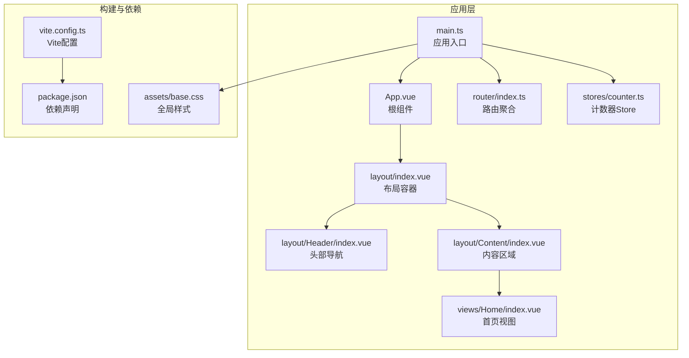
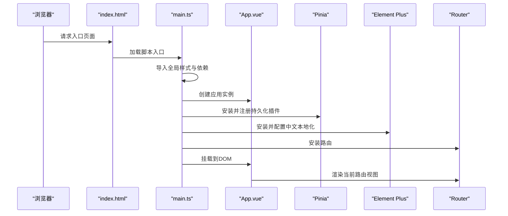
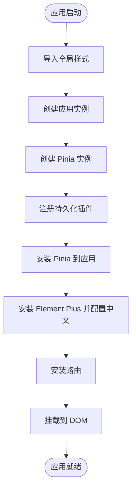
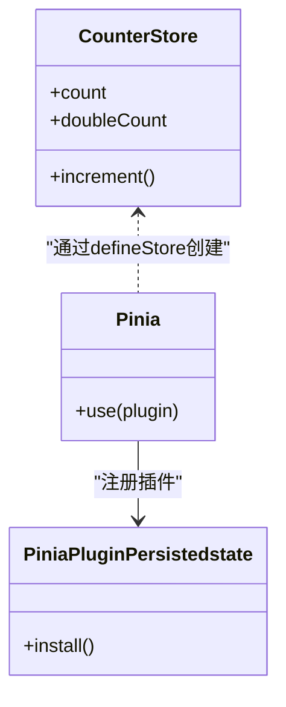
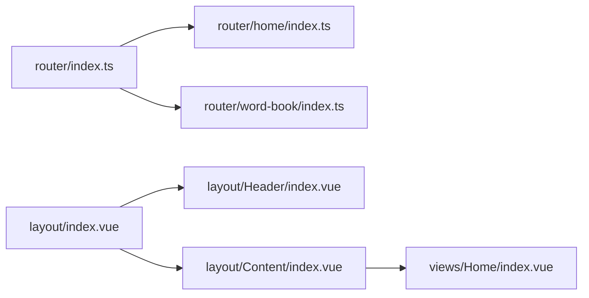
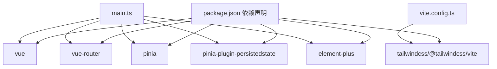

# Vue应用架构

<cite>
**本文引用的文件**
- [apps/web/src/main.ts](file://apps/web/src/main.ts)
- [apps/web/src/App.vue](file://apps/web/src/App.vue)
- [apps/web/package.json](file://apps/web/package.json)
- [apps/web/vite.config.ts](file://apps/web/vite.config.ts)
- [apps/web/src/stores/counter.ts](file://apps/web/src/stores/counter.ts)
- [apps/web/src/router/index.ts](file://apps/web/src/router/index.ts)
- [apps/web/src/router/home/index.ts](file://apps/web/src/router/home/index.ts)
- [apps/web/src/router/word-book/index.ts](file://apps/web/src/router/word-book/index.ts)
- [apps/web/src/assets/base.css](file://apps/web/src/assets/base.css)
- [apps/web/src/layout/index.vue](file://apps/web/src/layout/index.vue)
- [apps/web/src/layout/Header/index.vue](file://apps/web/src/layout/Header/index.vue)
- [apps/web/src/layout/Content/index.vue](file://apps/web/src/layout/Content/index.vue)
- [apps/web/src/views/Home/index.vue](file://apps/web/src/views/Home/index.vue)
</cite>

## 目录
1. [简介](#简介)
2. [项目结构](#项目结构)
3. [核心组件](#核心组件)
4. [架构总览](#架构总览)
5. [详细组件分析](#详细组件分析)
6. [依赖关系分析](#依赖关系分析)
7. [性能考虑](#性能考虑)
8. [故障排查指南](#故障排查指南)
9. [结论](#结论)
10. [附录](#附录)

## 简介
本文件系统性梳理该Vue 3应用的架构设计与实现要点，围绕应用入口点、依赖注入、全局插件集成、Element Plus国际化、Pinia状态管理与持久化、应用生命周期、全局样式与主题、启动流程、性能优化与错误处理进行深入解析，并提供可直接定位到源码位置的路径指引，帮助开发者快速理解并扩展该架构。

## 项目结构
该应用采用“单包多页面”组织方式，核心目录包括：
- 应用入口与根组件：apps/web/src/main.ts、apps/web/src/App.vue
- 路由模块化：apps/web/src/router 下按功能拆分 home、word-book 等子路由
- 状态管理：apps/web/src/stores 使用 Pinia（组合式 Store）
- 布局与视图：apps/web/src/layout 与 apps/web/src/views
- 样式与主题：apps/web/src/assets/base.css 引入 TailwindCSS
- 构建配置：apps/web/vite.config.ts 集成 Vue 插件、TailwindCSS、开发工具等

**图表来源**
- [apps/web/src/main.ts:1-21](file://apps/web/src/main.ts#L1-L21)
- [apps/web/src/App.vue:1-11](file://apps/web/src/App.vue#L1-L11)
- [apps/web/src/router/index.ts:1-13](file://apps/web/src/router/index.ts#L1-L13)
- [apps/web/src/stores/counter.ts:1-13](file://apps/web/src/stores/counter.ts#L1-L13)
- [apps/web/src/layout/index.vue:1-8](file://apps/web/src/layout/index.vue#L1-L8)
- [apps/web/src/layout/Header/index.vue:1-54](file://apps/web/src/layout/Header/index.vue#L1-L54)
- [apps/web/src/layout/Content/index.vue:1-7](file://apps/web/src/layout/Content/index.vue#L1-L7)
- [apps/web/src/views/Home/index.vue:1-7](file://apps/web/src/views/Home/index.vue#L1-L7)
- [apps/web/vite.config.ts:1-25](file://apps/web/vite.config.ts#L1-L25)
- [apps/web/package.json:1-45](file://apps/web/package.json#L1-L45)
- [apps/web/src/assets/base.css:1-5](file://apps/web/src/assets/base.css#L1-L5)

**章节来源**
- [apps/web/src/main.ts:1-21](file://apps/web/src/main.ts#L1-L21)
- [apps/web/src/App.vue:1-11](file://apps/web/src/App.vue#L1-L11)
- [apps/web/vite.config.ts:1-25](file://apps/web/vite.config.ts#L1-L25)
- [apps/web/package.json:1-45](file://apps/web/package.json#L1-L45)

## 核心组件
- 应用入口与依赖注入
  - 入口文件负责创建应用实例、安装插件、挂载根组件。
  - 安装顺序：Pinia → Element Plus（含中文本地化）→ 路由 → 挂载。
  - 参考路径：[apps/web/src/main.ts:1-21](file://apps/web/src/main.ts#L1-L21)
- 根组件
  - 通过 RouterView 渲染当前路由视图，作为页面内容的统一出口。
  - 参考路径：[apps/web/src/App.vue:1-11](file://apps/web/src/App.vue#L1-L11)
- 路由系统
  - 路由聚合在 router/index.ts，按功能拆分为 home、word-book 等模块。
  - 参考路径：[apps/web/src/router/index.ts:1-13](file://apps/web/src/router/index.ts#L1-L13)，[apps/web/src/router/home/index.ts:1-12](file://apps/web/src/router/home/index.ts#L1-L12)，[apps/web/src/router/word-book/index.ts:1-11](file://apps/web/src/router/word-book/index.ts#L1-L11)
- Pinia 状态管理
  - 使用组合式 Store 定义计数器示例，演示响应式数据与派生计算。
  - 参考路径：[apps/web/src/stores/counter.ts:1-13](file://apps/web/src/stores/counter.ts#L1-L13)
- 布局与视图
  - layout/index.vue 组合 Header 与 Content；Content 内部使用 RouterView 嵌套渲染子路由。
  - 参考路径：[apps/web/src/layout/index.vue:1-8](file://apps/web/src/layout/index.vue#L1-L8)，[apps/web/src/layout/Header/index.vue:1-54](file://apps/web/src/layout/Header/index.vue#L1-L54)，[apps/web/src/layout/Content/index.vue:1-7](file://apps/web/src/layout/Content/index.vue#L1-L7)，[apps/web/src/views/Home/index.vue:1-7](file://apps/web/src/views/Home/index.vue#L1-L7)

**章节来源**
- [apps/web/src/main.ts:1-21](file://apps/web/src/main.ts#L1-L21)
- [apps/web/src/App.vue:1-11](file://apps/web/src/App.vue#L1-L11)
- [apps/web/src/router/index.ts:1-13](file://apps/web/src/router/index.ts#L1-L13)
- [apps/web/src/router/home/index.ts:1-12](file://apps/web/src/router/home/index.ts#L1-L12)
- [apps/web/src/router/word-book/index.ts:1-11](file://apps/web/src/router/word-book/index.ts#L1-L11)
- [apps/web/src/stores/counter.ts:1-13](file://apps/web/src/stores/counter.ts#L1-L13)
- [apps/web/src/layout/index.vue:1-8](file://apps/web/src/layout/index.vue#L1-L8)
- [apps/web/src/layout/Header/index.vue:1-54](file://apps/web/src/layout/Header/index.vue#L1-L54)
- [apps/web/src/layout/Content/index.vue:1-7](file://apps/web/src/layout/Content/index.vue#L1-L7)
- [apps/web/src/views/Home/index.vue:1-7](file://apps/web/src/views/Home/index.vue#L1-L7)

## 架构总览
下图展示了从浏览器加载到应用运行的关键步骤与模块交互：

**图表来源**
- [apps/web/src/main.ts:1-21](file://apps/web/src/main.ts#L1-L21)
- [apps/web/src/App.vue:1-11](file://apps/web/src/App.vue#L1-L11)
- [apps/web/src/router/index.ts:1-13](file://apps/web/src/router/index.ts#L1-L13)

## 详细组件分析

### 应用入口与依赖注入
- 设计模式
  - 工厂模式：通过 createApp 创建应用实例。
  - 依赖注入：以 app.use(...) 的链式调用安装插件，遵循“先安装后使用”的约定。
- 关键点
  - 全局样式导入：在入口处集中引入 base.css，确保样式在应用启动前可用。
  - Element Plus 国际化：通过 locale 配置启用中文界面。
  - Pinia 持久化：在创建 Pinia 实例后调用 pinia.use(...) 注册持久化插件。
  - 路由安装：最后安装路由，保证路由守卫与导航在应用生命周期中生效。
- 启动序列参考路径
  - [apps/web/src/main.ts:1-21](file://apps/web/src/main.ts#L1-L21)

**图表来源**
- [apps/web/src/main.ts:1-21](file://apps/web/src/main.ts#L1-L21)

**章节来源**
- [apps/web/src/main.ts:1-21](file://apps/web/src/main.ts#L1-L21)

### Element Plus 国际化配置
- 配置方式
  - 从 element-plus/es/locale/lang/zh-cn 导入中文语言包。
  - 在 app.use(ElementPlus, { locale }) 中传入 locale 选项。
- 影响范围
  - 表单校验提示、弹窗文案、日期选择器等组件的默认语言。
- 参考路径
  - [apps/web/src/main.ts:6-17](file://apps/web/src/main.ts#L6-L17)

**章节来源**
- [apps/web/src/main.ts:6-17](file://apps/web/src/main.ts#L6-L17)

### Pinia 状态管理与持久化
- 初始化流程
  - 创建 Pinia 实例后，通过 pinia.use(piniaPluginPersistedstate) 注册持久化插件。
  - 将 Pinia 安装到应用，使所有组件可通过组合式 API 访问 Store。
- 示例 Store
  - 计数器 Store 展示了 ref、computed、函数导出的典型写法。
- 参考路径
  - [apps/web/src/main.ts:3-13](file://apps/web/src/main.ts#L3-L13)
  - [apps/web/src/stores/counter.ts:1-13](file://apps/web/src/stores/counter.ts#L1-L13)

**图表来源**
- [apps/web/src/main.ts:3-13](file://apps/web/src/main.ts#L3-L13)
- [apps/web/src/stores/counter.ts:1-13](file://apps/web/src/stores/counter.ts#L1-L13)

**章节来源**
- [apps/web/src/main.ts:3-13](file://apps/web/src/main.ts#L3-L13)
- [apps/web/src/stores/counter.ts:1-13](file://apps/web/src/stores/counter.ts#L1-L13)

### 路由系统与布局
- 路由聚合
  - router/index.ts 将 home、word-book 等模块路由展开合并为应用路由表。
- 布局与嵌套路由
  - layout/index.vue 作为父级布局，内部包含 Header 与 Content。
  - Content 使用 RouterView 嵌套渲染子路由视图。
- 参考路径
  - [apps/web/src/router/index.ts:1-13](file://apps/web/src/router/index.ts#L1-L13)
  - [apps/web/src/router/home/index.ts:1-12](file://apps/web/src/router/home/index.ts#L1-L12)
  - [apps/web/src/router/word-book/index.ts:1-11](file://apps/web/src/router/word-book/index.ts#L1-L11)
  - [apps/web/src/layout/index.vue:1-8](file://apps/web/src/layout/index.vue#L1-L8)
  - [apps/web/src/layout/Content/index.vue:1-7](file://apps/web/src/layout/Content/index.vue#L1-L7)
  - [apps/web/src/layout/Header/index.vue:1-54](file://apps/web/src/layout/Header/index.vue#L1-L54)
  - [apps/web/src/views/Home/index.vue:1-7](file://apps/web/src/views/Home/index.vue#L1-L7)

**图表来源**
- [apps/web/src/router/index.ts:1-13](file://apps/web/src/router/index.ts#L1-L13)
- [apps/web/src/router/home/index.ts:1-12](file://apps/web/src/router/home/index.ts#L1-L12)
- [apps/web/src/router/word-book/index.ts:1-11](file://apps/web/src/router/word-book/index.ts#L1-L11)
- [apps/web/src/layout/index.vue:1-8](file://apps/web/src/layout/index.vue#L1-L8)
- [apps/web/src/layout/Header/index.vue:1-54](file://apps/web/src/layout/Header/index.vue#L1-L54)
- [apps/web/src/layout/Content/index.vue:1-7](file://apps/web/src/layout/Content/index.vue#L1-L7)
- [apps/web/src/views/Home/index.vue:1-7](file://apps/web/src/views/Home/index.vue#L1-L7)

**章节来源**
- [apps/web/src/router/index.ts:1-13](file://apps/web/src/router/index.ts#L1-L13)
- [apps/web/src/router/home/index.ts:1-12](file://apps/web/src/router/home/index.ts#L1-L12)
- [apps/web/src/router/word-book/index.ts:1-11](file://apps/web/src/router/word-book/index.ts#L1-L11)
- [apps/web/src/layout/index.vue:1-8](file://apps/web/src/layout/index.vue#L1-L8)
- [apps/web/src/layout/Header/index.vue:1-54](file://apps/web/src/layout/Header/index.vue#L1-L54)
- [apps/web/src/layout/Content/index.vue:1-7](file://apps/web/src/layout/Content/index.vue#L1-L7)
- [apps/web/src/views/Home/index.vue:1-7](file://apps/web/src/views/Home/index.vue#L1-L7)

### 应用生命周期管理
- 生命周期阶段
  - 创建应用实例：在入口文件中完成。
  - 安装插件：在挂载前完成，确保插件在运行期可用。
  - 挂载应用：将根组件挂载到 DOM，进入运行时。
- 参考路径
  - [apps/web/src/main.ts:11-20](file://apps/web/src/main.ts#L11-L20)

**章节来源**
- [apps/web/src/main.ts:11-20](file://apps/web/src/main.ts#L11-L20)

### 全局样式导入与主题配置
- 样式导入
  - 在入口文件导入 base.css，确保全局样式在应用启动时生效。
- 主题配置
  - base.css 通过 @import 引入 TailwindCSS，结合 Vite 插件实现原子化样式。
- 参考路径
  - [apps/web/src/main.ts](file://apps/web/src/main.ts#L1)
  - [apps/web/src/assets/base.css:1-5](file://apps/web/src/assets/base.css#L1-L5)
  - [apps/web/vite.config.ts:14-17](file://apps/web/vite.config.ts#L14-L17)

**章节来源**
- [apps/web/src/main.ts](file://apps/web/src/main.ts#L1)
- [apps/web/src/assets/base.css:1-5](file://apps/web/src/assets/base.css#L1-L5)
- [apps/web/vite.config.ts:14-17](file://apps/web/vite.config.ts#L14-L17)

### 错误处理机制
- 建议实践
  - 在入口文件捕获应用启动异常，记录错误并引导用户刷新或重试。
  - 对路由守卫与异步组件加载失败场景进行兜底处理。
  - 对第三方插件（如 Element Plus、Pinia）初始化失败进行降级提示。
- 参考路径
  - [apps/web/src/main.ts:11-20](file://apps/web/src/main.ts#L11-L20)

**章节来源**
- [apps/web/src/main.ts:11-20](file://apps/web/src/main.ts#L11-L20)

## 依赖关系分析
- 外部依赖
  - Vue 3、Vue Router、Pinia、Element Plus、TailwindCSS、Vite 插件生态。
- 内部依赖
  - 应用入口依赖路由与状态管理；布局依赖路由视图；视图依赖图标与业务逻辑。
- 参考路径
  - [apps/web/package.json:13-29](file://apps/web/package.json#L13-L29)
  - [apps/web/src/main.ts:1-21](file://apps/web/src/main.ts#L1-L21)
  - [apps/web/vite.config.ts:1-25](file://apps/web/vite.config.ts#L1-L25)

**图表来源**
- [apps/web/package.json:13-29](file://apps/web/package.json#L13-L29)
- [apps/web/src/main.ts:1-21](file://apps/web/src/main.ts#L1-L21)
- [apps/web/vite.config.ts:1-25](file://apps/web/vite.config.ts#L1-L25)

**章节来源**
- [apps/web/package.json:13-29](file://apps/web/package.json#L13-L29)
- [apps/web/src/main.ts:1-21](file://apps/web/src/main.ts#L1-L21)
- [apps/web/vite.config.ts:1-25](file://apps/web/vite.config.ts#L1-L25)

## 性能考虑
- 代码分割与懒加载
  - 路由中的视图组件采用动态导入，减少首屏体积。
  - 参考路径：[apps/web/src/router/word-book/index.ts](file://apps/web/src/router/word-book/index.ts#L8)
- 插件与资源加载
  - 在入口集中导入样式与插件，避免重复请求与阻塞。
  - 参考路径：[apps/web/src/main.ts:1-8](file://apps/web/src/main.ts#L1-L8)
- 构建优化
  - Vite 插件链路包含 Vue 开发工具与 TailwindCSS，提升开发体验与样式生成效率。
  - 参考路径：[apps/web/vite.config.ts:14-17](file://apps/web/vite.config.ts#L14-L17)

**章节来源**
- [apps/web/src/router/word-book/index.ts](file://apps/web/src/router/word-book/index.ts#L8)
- [apps/web/src/main.ts:1-8](file://apps/web/src/main.ts#L1-L8)
- [apps/web/vite.config.ts:14-17](file://apps/web/vite.config.ts#L14-L17)

## 故障排查指南
- 启动失败
  - 检查入口文件中插件安装顺序与依赖是否正确导入。
  - 参考路径：[apps/web/src/main.ts:1-21](file://apps/web/src/main.ts#L1-L21)
- 路由不显示
  - 确认路由聚合与布局嵌套配置正确，RouterView 是否位于 Content 区域。
  - 参考路径：[apps/web/src/layout/Content/index.vue:1-7](file://apps/web/src/layout/Content/index.vue#L1-L7)，[apps/web/src/router/index.ts:1-13](file://apps/web/src/router/index.ts#L1-L13)
- 样式异常
  - 检查 base.css 是否被正确导入，TailwindCSS 插件是否启用。
  - 参考路径：[apps/web/src/assets/base.css:1-5](file://apps/web/src/assets/base.css#L1-L5)，[apps/web/vite.config.ts:14-17](file://apps/web/vite.config.ts#L14-L17)
- 国际化无效
  - 确认 Element Plus 安装时传入 locale 且语言包导入无误。
  - 参考路径：[apps/web/src/main.ts:6-17](file://apps/web/src/main.ts#L6-L17)

**章节来源**
- [apps/web/src/main.ts:1-21](file://apps/web/src/main.ts#L1-L21)
- [apps/web/src/layout/Content/index.vue:1-7](file://apps/web/src/layout/Content/index.vue#L1-L7)
- [apps/web/src/router/index.ts:1-13](file://apps/web/src/router/index.ts#L1-L13)
- [apps/web/src/assets/base.css:1-5](file://apps/web/src/assets/base.css#L1-L5)
- [apps/web/vite.config.ts:14-17](file://apps/web/vite.config.ts#L14-L17)

## 结论
该Vue 3应用采用清晰的模块化与依赖注入架构：入口文件集中初始化与装配，Pinia 提供轻量状态管理并配合持久化插件，Element Plus 通过本地化配置提升用户体验，路由与布局解耦便于扩展。结合 Vite 插件链路与 TailwindCSS 原子化样式体系，整体具备良好的可维护性与扩展性。建议在后续迭代中补充路由守卫、错误边界与性能监控，进一步完善工程化能力。

## 附录
- 快速定位清单
  - 入口与插件安装：[apps/web/src/main.ts:1-21](file://apps/web/src/main.ts#L1-L21)
  - 根组件与路由视图：[apps/web/src/App.vue:1-11](file://apps/web/src/App.vue#L1-L11)
  - 路由聚合与模块化：[apps/web/src/router/index.ts:1-13](file://apps/web/src/router/index.ts#L1-L13)
  - 布局与头部导航：[apps/web/src/layout/index.vue:1-8](file://apps/web/src/layout/index.vue#L1-L8)，[apps/web/src/layout/Header/index.vue:1-54](file://apps/web/src/layout/Header/index.vue#L1-L54)
  - 内容区域与视图：[apps/web/src/layout/Content/index.vue:1-7](file://apps/web/src/layout/Content/index.vue#L1-L7)，[apps/web/src/views/Home/index.vue:1-7](file://apps/web/src/views/Home/index.vue#L1-L7)
  - 状态管理示例：[apps/web/src/stores/counter.ts:1-13](file://apps/web/src/stores/counter.ts#L1-L13)
  - 全局样式与主题：[apps/web/src/assets/base.css:1-5](file://apps/web/src/assets/base.css#L1-L5)
  - 构建配置：[apps/web/vite.config.ts:1-25](file://apps/web/vite.config.ts#L1-L25)
  - 依赖声明：[apps/web/package.json:13-29](file://apps/web/package.json#L13-L29)