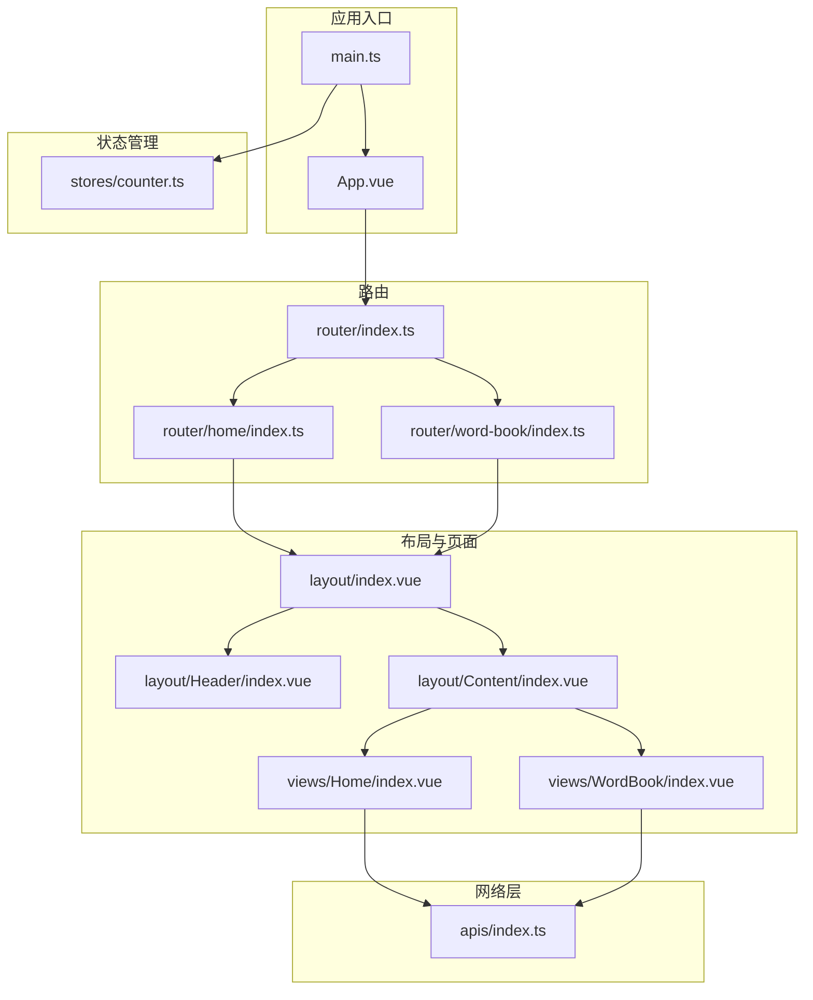
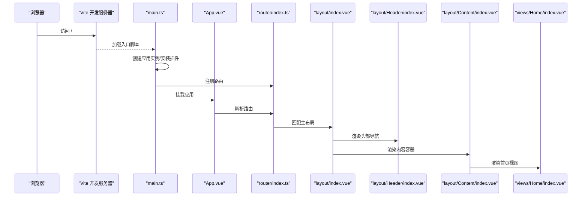
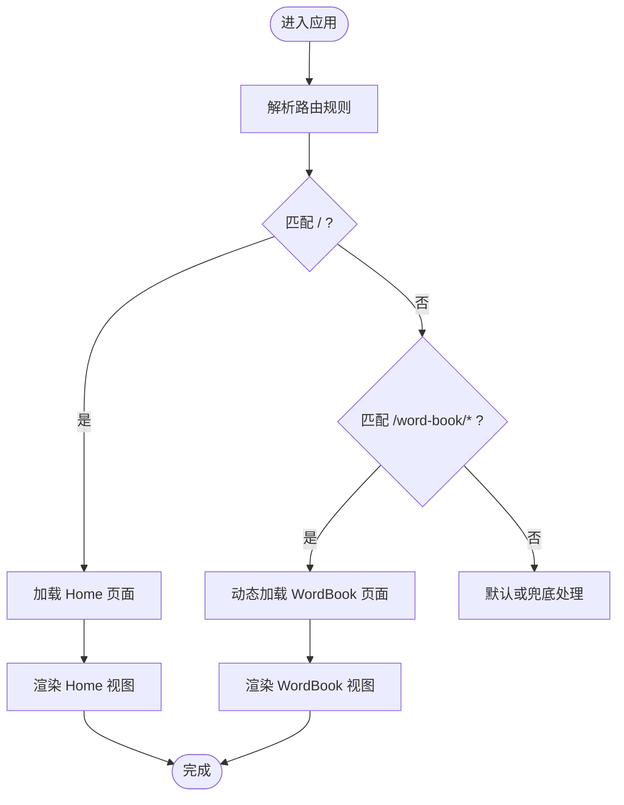
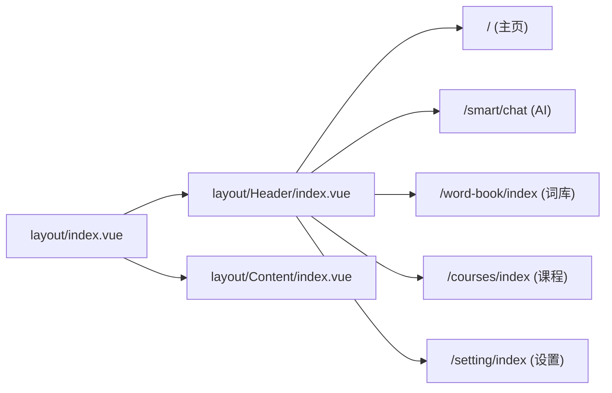
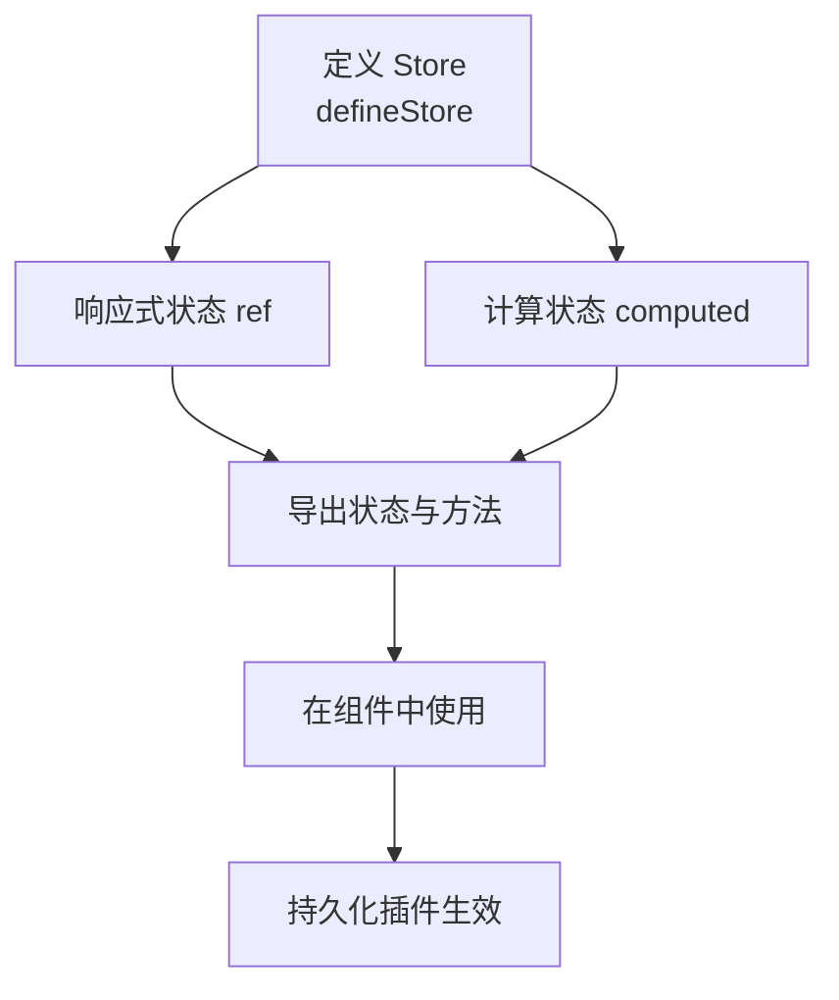
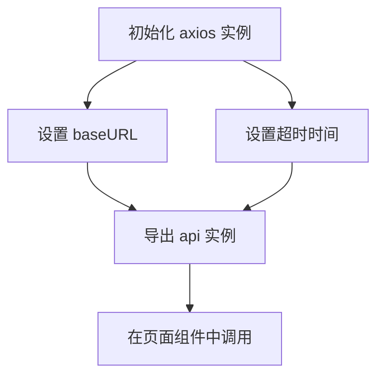
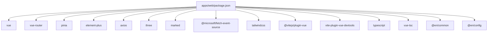

# 前端开发

<cite>
**本文引用的文件**
- [apps\web\package.json](file://apps/web/package.json)
- [apps\web\vite.config.ts](file://apps/web/vite.config.ts)
- [apps\web\src\main.ts](file://apps/web/src/main.ts)
- [apps\web\src\App.vue](file://apps/web/src/App.vue)
- [apps\web\src\router\index.ts](file://apps/web/src/router/index.ts)
- [apps\web\src\router\home\index.ts](file://apps/web/src/router/home/index.ts)
- [apps\web\src\router\word-book\index.ts](file://apps/web/src/router/word-book/index.ts)
- [apps\web\src\stores\counter.ts](file://apps/web/src/stores/counter.ts)
- [apps\web\src\layout\index.vue](file://apps/web/src/layout/index.vue)
- [apps\web\src\layout\Header\index.vue](file://apps/web/src/layout/Header/index.vue)
- [apps\web\src\layout\Content\index.vue](file://apps/web/src/layout/Content/index.vue)
- [apps\web\src\views\Home\index.vue](file://apps/web/src/views/Home/index.vue)
- [apps\web\src\views\WordBook\index.vue](file://apps/web/src/views/WordBook/index.vue)
- [apps\web\src\apis\index.ts](file://apps/web/src/apis/index.ts)
- [apps\web\src\assets\base.css](file://apps/web/src/assets/base.css)
- [apps\web\tsconfig.app.json](file://apps/web/tsconfig.app.json)
- [apps\web\env.d.ts](file://apps/web/env.d.ts)
</cite>

## 目录
1. [引言](#引言)
2. [项目结构](#项目结构)
3. [核心组件](#核心组件)
4. [架构总览](#架构总览)
5. [详细组件分析](#详细组件分析)
6. [依赖分析](#依赖分析)
7. [性能考虑](#性能考虑)
8. [故障排查指南](#故障排查指南)
9. [结论](#结论)
10. [附录](#附录)

## 引言
本文件面向英语学习平台前端开发者，系统梳理基于 Vue 3 的单页应用（SPA）架构与开发规范，覆盖 Composition API 使用模式、TypeScript 集成、状态管理策略、路由配置、页面与布局组件设计、UI 组件库集成、样式管理、开发与构建流程以及调试方法。目标是帮助从入门到进阶的开发者建立完整的知识体系与工程化实践路径。

## 项目结构
该工程采用多包工作区（workspace）组织，前端应用位于 apps/web，核心目录与职责如下：
- src：源码根目录
  - apis：统一的 API 客户端封装
  - assets：全局样式入口（Tailwind 初始化）
  - components：可复用业务组件（当前为空，建议按功能域拆分）
  - layout：布局组件（Header、Content、Profile 等）
  - router：路由模块化配置（home、word-book）
  - stores：状态管理（Pinia Store）
  - views：页面级组件（Home、WordBook）
  - App.vue、main.ts：应用入口与挂载
- vite.config.ts：Vite 构建与开发服务器配置
- package.json：依赖与脚本定义
- tsconfig.*：TypeScript 编译配置
- env.d.ts：Vite 环境类型声明

图表来源
- [apps\web\src\main.ts:1-21](file://apps/web/src/main.ts#L1-L21)
- [apps\web\src\App.vue:1-11](file://apps/web/src/App.vue#L1-L11)
- [apps\web\src\router\index.ts:1-13](file://apps/web/src/router/index.ts#L1-L13)
- [apps\web\src\router\home\index.ts:1-12](file://apps/web/src/router/home/index.ts#L1-L12)
- [apps\web\src\router\word-book\index.ts:1-11](file://apps/web/src/router/word-book/index.ts#L1-L11)
- [apps\web\src\layout\index.vue:1-8](file://apps/web/src/layout/index.vue#L1-L8)
- [apps\web\src\layout\Header\index.vue:1-54](file://apps/web/src/layout/Header/index.vue#L1-L54)
- [apps\web\src\layout\Content\index.vue:1-7](file://apps/web/src/layout/Content/index.vue#L1-L7)
- [apps\web\src\views\Home\index.vue:1-7](file://apps/web/src/views/Home/index.vue#L1-L7)
- [apps\web\src\views\WordBook\index.vue:1-7](file://apps/web/src/views/WordBook/index.vue#L1-L7)
- [apps\web\src\stores\counter.ts:1-13](file://apps/web/src/stores/counter.ts#L1-L13)
- [apps\web\src\apis\index.ts:1-6](file://apps/web/src/apis/index.ts#L1-L6)

章节来源
- [apps\web\package.json:1-45](file://apps/web/package.json#L1-L45)
- [apps\web\vite.config.ts:1-25](file://apps/web/vite.config.ts#L1-L25)
- [apps\web\src\main.ts:1-21](file://apps/web/src/main.ts#L1-L21)
- [apps\web\src\App.vue:1-11](file://apps/web/src/App.vue#L1-L11)
- [apps\web\src\router\index.ts:1-13](file://apps/web/src/router/index.ts#L1-L13)
- [apps\web\src\router\home\index.ts:1-12](file://apps/web/src/router/home/index.ts#L1-L12)
- [apps\web\src\router\word-book\index.ts:1-11](file://apps/web/src/router/word-book/index.ts#L1-L11)
- [apps\web\src\layout\index.vue:1-8](file://apps/web/src/layout/index.vue#L1-L8)
- [apps\web\src\layout\Header\index.vue:1-54](file://apps/web/src/layout/Header/index.vue#L1-L54)
- [apps\web\src\layout\Content\index.vue:1-7](file://apps/web/src/layout/Content/index.vue#L1-L7)
- [apps\web\src\views\Home\index.vue:1-7](file://apps/web/src/views/Home/index.vue#L1-L7)
- [apps\web\src\views\WordBook\index.vue:1-7](file://apps/web/src/views/WordBook/index.vue#L1-L7)
- [apps\web\src\stores\counter.ts:1-13](file://apps/web/src/stores/counter.ts#L1-L13)
- [apps\web\src\apis\index.ts:1-6](file://apps/web/src/apis/index.ts#L1-L6)
- [apps\web\src\assets\base.css:1-5](file://apps/web/src/assets/base.css#L1-L5)
- [apps\web\tsconfig.app.json:1-15](file://apps/web/tsconfig.app.json#L1-L15)
- [apps\web\env.d.ts:1-2](file://apps/web/env.d.ts#L1-L2)

## 核心组件
- 应用入口与插件注册
  - 在入口中完成 Pinia、Element Plus、路由的安装与挂载；启用持久化插件以提升用户体验。
  - 全局样式通过 assets/base.css 引入 Tailwind 并设置根元素高度。
- 路由系统
  - 主路由聚合 home 与 word-book 模块，采用 history 模式与动态导入子路由，支持懒加载。
- 布局与页面
  - layout/index.vue 统一承载 Header 与 Content；Header 提供导航与用户信息占位；Content 作为 RouterView 容器。
  - views/Home 与 views/WordBook 为占位页面，后续可替换为实际业务内容。
- 状态管理
  - 使用 Pinia 的组合式 Store（defineStore），示例包含响应式计数与计算属性，便于扩展至用户态、主题、词库等状态域。
- 网络层
  - apis/index.ts 封装 axios 实例，集中配置 baseURL 与超时，便于后续拦截器与错误处理扩展。

章节来源
- [apps\web\src\main.ts:1-21](file://apps/web/src/main.ts#L1-L21)
- [apps\web\src\assets\base.css:1-5](file://apps/web/src/assets/base.css#L1-L5)
- [apps\web\src\router\index.ts:1-13](file://apps\web\src\router\index.ts#L1-L13)
- [apps\web\src\router\home\index.ts:1-12](file://apps\web\src\router\home\index.ts#L1-L12)
- [apps\web\src\router\word-book\index.ts:1-11](file://apps\web\src\router\word-book\index.ts#L1-L11)
- [apps\web\src\layout\index.vue:1-8](file://apps\web\src\layout\index.vue#L1-L8)
- [apps\web\src\layout\Header\index.vue:1-54](file://apps\web\src\layout\Header\index.vue#L1-L54)
- [apps\web\src\layout\Content\index.vue:1-7](file://apps\web\src\layout\Content\index.vue#L1-L7)
- [apps\web\src\views\Home\index.vue:1-7](file://apps\web\src\views\Home\index.vue#L1-L7)
- [apps\web\src\views\WordBook\index.vue:1-7](file://apps\web\src\views\WordBook\index.vue#L1-L7)
- [apps\web\src\stores\counter.ts:1-13](file://apps\web\src\stores\counter.ts#L1-L13)
- [apps\web\src\apis\index.ts:1-6](file://apps\web\src\apis\index.ts#L1-L6)

## 架构总览
下图展示从前端入口到页面渲染的关键调用链路，体现路由驱动的页面切换与布局嵌套关系。

图表来源
- [apps\web\src\main.ts:1-21](file://apps/web/src/main.ts#L1-L21)
- [apps\web\src\App.vue:1-11](file://apps/web/src/App.vue#L1-L11)
- [apps\web\src\router\index.ts:1-13](file://apps/web/src/router/index.ts#L1-L13)
- [apps\web\src\router\home\index.ts:1-12](file://apps/web/src/router/home/index.ts#L1-L12)
- [apps\web\src\layout\index.vue:1-8](file://apps/web/src/layout/index.vue#L1-L8)
- [apps\web\src\layout\Header\index.vue:1-54](file://apps/web/src/layout/Header/index.vue#L1-L54)
- [apps\web\src\layout\Content\index.vue:1-7](file://apps/web/src/layout/Content/index.vue#L1-L7)
- [apps\web\src\views\Home\index.vue:1-7](file://apps/web/src/views/Home/index.vue#L1-L7)

## 详细组件分析

### 路由与页面组件
- 路由聚合
  - 主路由将 home 与 word-book 子路由合并，形成两级结构：根路径与词库子路径。
- 动态导入
  - 词库页面采用异步组件加载，有助于首屏体积控制与性能优化。
- 页面占位
  - Home 与 WordBook 当前仅包含标题占位，后续可替换为具体业务组件与数据流。

图表来源
- [apps\web\src\router\index.ts:1-13](file://apps/web/src/router/index.ts#L1-L13)
- [apps\web\src\router\home\index.ts:1-12](file://apps/web/src/router/home/index.ts#L1-L12)
- [apps\web\src\router\word-book\index.ts:1-11](file://apps/web/src/router/word-book/index.ts#L1-L11)
- [apps\web\src\views\Home\index.vue:1-7](file://apps/web/src/views/Home/index.vue#L1-L7)
- [apps\web\src\views\WordBook\index.vue:1-7](file://apps/web/src/views/WordBook/index.vue#L1-L7)

章节来源
- [apps\web\src\router\index.ts:1-13](file://apps/web/src/router/index.ts#L1-L13)
- [apps\web\src\router\home\index.ts:1-12](file://apps/web/src/router/home/index.ts#L1-L12)
- [apps\web\src\router\word-book\index.ts:1-11](file://apps/web/src/router/word-book/index.ts#L1-L11)
- [apps\web\src\views\Home\index.vue:1-7](file://apps/web/src/views/Home/index.vue#L1-L7)
- [apps\web\src\views\WordBook\index.vue:1-7](file://apps/web/src/views/WordBook/index.vue#L1-L7)

### 布局与导航
- 布局结构
  - layout/index.vue 组合 Header 与 Content，形成统一的顶部导航与内容区域。
- 导航行为
  - Header 中使用 Element Plus 图标与 RouterLink/RouterPush 实现页面跳转，具备良好的可扩展性。
- 用户信息与徽章
  - 头部预留积分、等级等徽章位，便于后续接入用户态数据。

图表来源
- [apps\web\src\layout\index.vue:1-8](file://apps/web/src/layout/index.vue#L1-L8)
- [apps\web\src\layout\Header\index.vue:1-54](file://apps/web/src/layout/Header/index.vue#L1-L54)
- [apps\web\src\layout\Content\index.vue:1-7](file://apps/web/src/layout/Content/index.vue#L1-L7)

章节来源
- [apps\web\src\layout\index.vue:1-8](file://apps/web/src/layout/index.vue#L1-L8)
- [apps\web\src\layout\Header\index.vue:1-54](file://apps/web/src/layout/Header/index.vue#L1-L54)
- [apps\web\src\layout\Content\index.vue:1-7](file://apps/web/src/layout/Content/index.vue#L1-L7)

### 状态管理（Pinia）
- Store 设计
  - 使用 defineStore 定义组合式 Store，返回响应式状态与派生状态，便于在组件中直接消费。
- 持久化策略
  - 通过 pinia-plugin-persistedstate 实现跨会话的状态保留，适合用户偏好、主题等场景。

图表来源
- [apps\web\src\stores\counter.ts:1-13](file://apps/web/src/stores/counter.ts#L1-L13)
- [apps\web\src\main.ts:1-21](file://apps/web/src/main.ts#L1-L21)

章节来源
- [apps\web\src\stores\counter.ts:1-13](file://apps/web/src/stores/counter.ts#L1-L13)
- [apps\web\src\main.ts:1-21](file://apps/web/src/main.ts#L1-L21)

### 网络请求封装
- Axios 实例
  - apis/index.ts 创建带 baseURL 与超时的 axios 实例，便于后续注入拦截器、错误处理与统一响应适配。
- 扩展建议
  - 可引入请求/响应拦截器、重试机制、并发控制与错误分类提示。

图表来源
- [apps\web\src\apis\index.ts:1-6](file://apps/web/src/apis/index.ts#L1-L6)

章节来源
- [apps\web\src\apis\index.ts:1-6](file://apps/web/src/apis/index.ts#L1-L6)

### TypeScript 与类型声明
- 类型配置
  - tsconfig.app.json 配置路径别名、复合编译、禁止输出 JS、引入 Element Plus 全局类型。
- 环境声明
  - env.d.ts 引入 Vite 环境类型，确保开发时的智能提示与类型安全。

章节来源
- [apps\web\tsconfig.app.json:1-15](file://apps/web/tsconfig.app.json#L1-L15)
- [apps\web\env.d.ts:1-2](file://apps/web/env.d.ts#L1-L2)

## 依赖分析
- 运行时依赖
  - Vue 3、Vue Router、Pinia、Element Plus、Axios、Three.js、marked、@microsoft/fetch-event-source 等。
- 开发依赖
  - Vite、@vitejs/plugin-vue、vue-tsc、vite-plugin-vue-devtools、TailwindCSS 插件等。
- 工作区依赖
  - @en/common、@en/config 通过 workspace:* 引入，便于共享工具与配置。

图表来源
- [apps\web\package.json:1-45](file://apps/web/package.json#L1-L45)

章节来源
- [apps\web\package.json:1-45](file://apps/web/package.json#L1-L45)

## 性能考虑
- 路由懒加载
  - 词库页面采用动态导入，减少首屏资源体积，提升初始加载速度。
- 样式按需
  - Tailwind 通过 @tailwindcss/vite 插件集成，建议结合 Purge 与分层配置优化产物体积。
- 状态持久化
  - Pinia 持久化插件可避免频繁重复请求，但需注意存储粒度与序列化开销。
- 图标与媒体
  - Element Plus 图标按需引入，避免全量打包；头像等静态资源建议 CDN 化。
- 构建与预览
  - 使用 npm-run-all2 并行执行类型检查与构建，缩短 CI/本地构建时间。

章节来源
- [apps\web\src\router\word-book\index.ts:1-11](file://apps/web/src/router/word-book/index.ts#L1-L11)
- [apps\web\src\main.ts:1-21](file://apps/web/src/main.ts#L1-L21)
- [apps\web\package.json:1-45](file://apps/web/package.json#L1-L45)

## 故障排查指南
- 开发服务器端口冲突
  - 检查 vite.config.ts 中 server.port 是否被占用，必要时调整为其他端口。
- 路由跳转无效
  - 确认路由配置是否正确拼接 BASE_URL，history 模式下确保服务端支持回退。
- 样式不生效
  - 确认 assets/base.css 已在 main.ts 中引入，Tailwind 插件已启用且无语法错误。
- 类型报错
  - 使用 vue-tsc --build 进行类型检查，定位 tsconfig.app.json 中的路径别名与全局类型问题。
- 状态未持久化
  - 检查 pinia-plugin-persistedstate 是否正确安装与注册，确认浏览器存储可用。

章节来源
- [apps\web\vite.config.ts:1-25](file://apps/web/vite.config.ts#L1-L25)
- [apps\web\src\router\index.ts:1-13](file://apps/web/src/router/index.ts#L1-L13)
- [apps\web\src\assets\base.css:1-5](file://apps/web/src/assets/base.css#L1-L5)
- [apps\web\package.json:1-45](file://apps/web/package.json#L1-L45)
- [apps\web\src\main.ts:1-21](file://apps/web/src/main.ts#L1-L21)

## 结论
本项目以 Vue 3 + TypeScript 为基础，结合 Pinia、Element Plus、TailwindCSS 与 Vite，形成了清晰的路由、布局与页面分层。建议后续重点完善：
- 组件库与样式规范：统一 UI 组件使用与主题变量，建立设计系统。
- 状态域划分：按领域拆分 Store，明确数据流向与副作用边界。
- 网络层健壮性：增加拦截器、错误分类与重试策略。
- 测试与可观测：补充单元测试与埋点监控。
- 文档与规范：沉淀组件开发规范、提交规范与发布流程。

## 附录
- 开发与构建
  - 启动：npm run dev
  - 构建：npm run build
  - 预览：npm run preview
- 调试
  - 使用 Vite Devtools 插件进行组件与状态调试。
- 路由与页面
  - 根路径：Home
  - 词库路径：/word-book/index（动态加载）

章节来源
- [apps\web\package.json:1-45](file://apps/web/package.json#L1-L45)
- [apps\web\vite.config.ts:1-25](file://apps/web/vite.config.ts#L1-L25)
- [apps\web\src\router\index.ts:1-13](file://apps/web/src/router/index.ts#L1-L13)
- [apps\web\src\views\Home\index.vue:1-7](file://apps/web/src/views/Home/index.vue#L1-L7)
- [apps\web\src\views\WordBook\index.vue:1-7](file://apps/web/src/views/WordBook/index.vue#L1-L7)