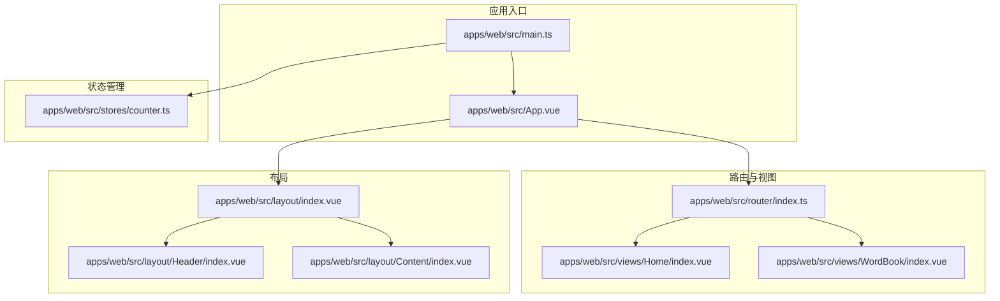
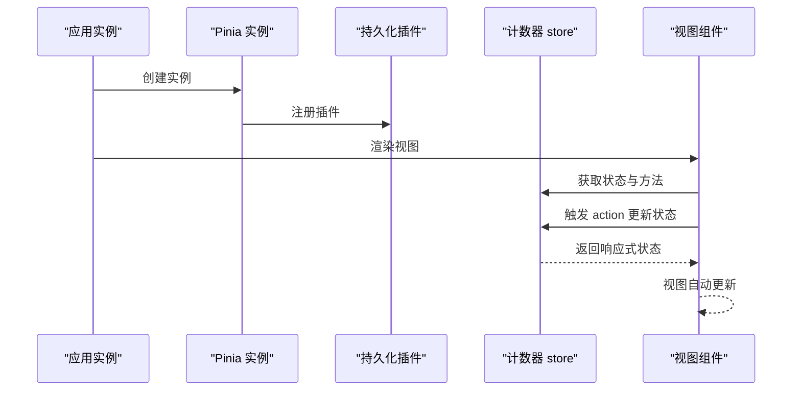
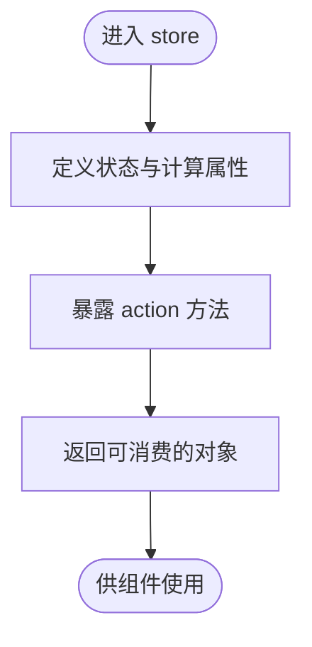
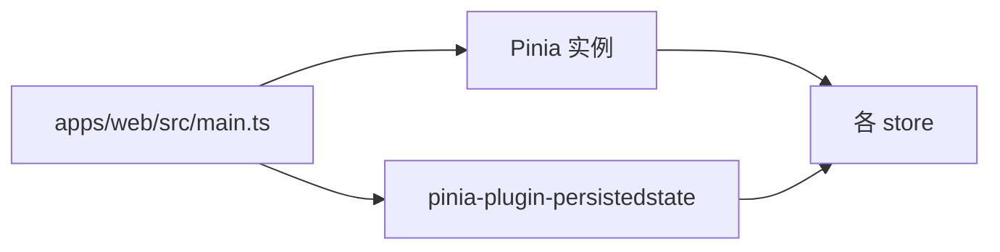
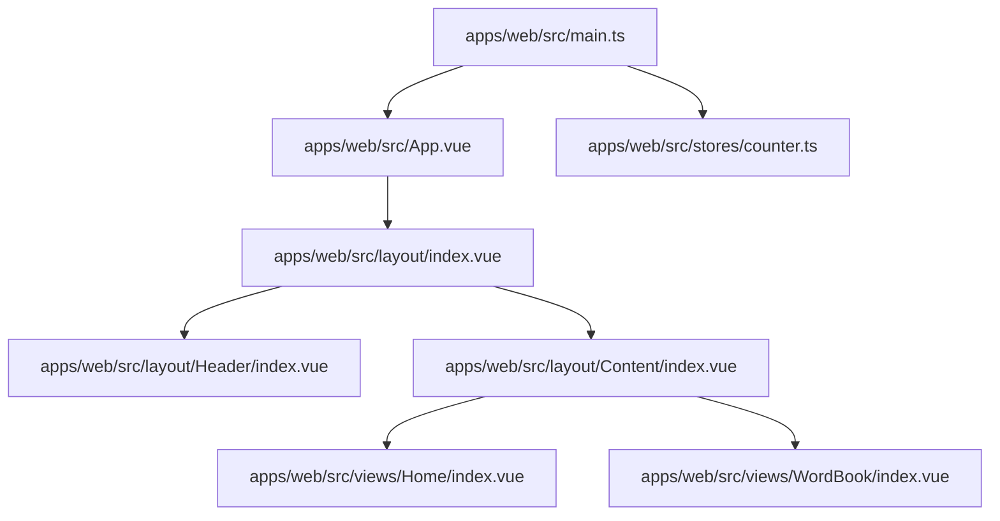
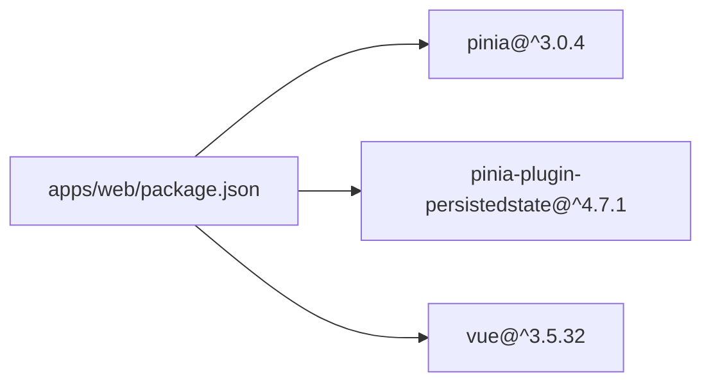

# 状态管理

<cite>
**本文引用的文件**
- [apps/web/src/stores/counter.ts](file://apps/web/src/stores/counter.ts)
- [apps/web/src/main.ts](file://apps/web/src/main.ts)
- [apps/web/package.json](file://apps/web/package.json)
- [apps/web/src/App.vue](file://apps/web/src/App.vue)
- [apps/web/src/router/index.ts](file://apps/web/src/router/index.ts)
- [apps/web/src/layout/Header/index.vue](file://apps/web/src/layout/Header/index.vue)
- [apps/web/src/layout/index.vue](file://apps/web/src/layout/index.vue)
- [apps/web/src/layout/Content/index.vue](file://apps/web/src/layout/Content/index.vue)
- [apps/web/src/views/Home/index.vue](file://apps/web/src/views/Home/index.vue)
- [apps/web/src/views/WordBook/index.vue](file://apps/web/src/views/WordBook/index.vue)
</cite>

## 目录
1. [简介](#简介)
2. [项目结构](#项目结构)
3. [核心组件](#核心组件)
4. [架构总览](#架构总览)
5. [详细组件分析](#详细组件分析)
6. [依赖分析](#依赖分析)
7. [性能考虑](#性能考虑)
8. [故障排查指南](#故障排查指南)
9. [结论](#结论)
10. [附录](#附录)

## 简介
本文件围绕 Pinia 状态管理在前端应用中的使用进行系统化说明，重点覆盖以下方面：
- 计数器 store 的实现原理、状态定义与 action 操作
- 状态持久化配置与启用方式
- 模块化 store 组织与跨组件状态共享
- 状态订阅、响应式更新与异步状态处理
- 最佳实践、性能优化与调试技巧
- 实际 store 使用案例与常见应用场景

当前仓库中已实现最小可用的状态管理示例：通过组合式 API 定义计数器 store，并在入口处启用 Pinia 与持久化插件。页面布局与路由已就绪，便于演示跨组件共享状态。

## 项目结构
应用采用基于功能的模块化组织，状态管理位于 stores 目录，入口文件负责初始化 Pinia 并挂载到应用实例上。

**图表来源**
- [apps/web/src/main.ts:1-21](file://apps/web/src/main.ts#L1-L21)
- [apps/web/src/App.vue:1-11](file://apps/web/src/App.vue#L1-L11)
- [apps/web/src/router/index.ts:1-13](file://apps/web/src/router/index.ts#L1-L13)
- [apps/web/src/stores/counter.ts:1-13](file://apps/web/src/stores/counter.ts#L1-L13)
- [apps/web/src/layout/index.vue:1-8](file://apps/web/src/layout/index.vue#L1-L8)
- [apps/web/src/layout/Header/index.vue:1-54](file://apps/web/src/layout/Header/index.vue#L1-L54)
- [apps/web/src/layout/Content/index.vue:1-7](file://apps/web/src/layout/Content/index.vue#L1-L7)
- [apps/web/src/views/Home/index.vue:1-7](file://apps/web/src/views/Home/index.vue#L1-L7)
- [apps/web/src/views/WordBook/index.vue:1-7](file://apps/web/src/views/WordBook/index.vue#L1-L7)

**章节来源**
- [apps/web/src/main.ts:1-21](file://apps/web/src/main.ts#L1-L21)
- [apps/web/src/App.vue:1-11](file://apps/web/src/App.vue#L1-L11)
- [apps/web/src/router/index.ts:1-13](file://apps/web/src/router/index.ts#L1-L13)

## 核心组件
- Pinia 初始化与持久化插件
  - 在入口文件中创建 Pinia 实例并注册持久化插件，随后挂载到应用实例，确保全局可访问。
  - 参考路径：[apps/web/src/main.ts:12-14](file://apps/web/src/main.ts#L12-L14)
- 计数器 store（组合式写法）
  - 使用组合式 API 定义状态与派生状态，导出可复用的 store 函数，供组件按需使用。
  - 参考路径：[apps/web/src/stores/counter.ts:4-12](file://apps/web/src/stores/counter.ts#L4-L12)
- 路由与视图
  - 路由集中配置，视图组件用于承载页面内容；布局组件负责导航与内容区域渲染。
  - 参考路径：[apps/web/src/router/index.ts:1-13](file://apps/web/src/router/index.ts#L1-L13)，[apps/web/src/layout/index.vue:1-8](file://apps/web/src/layout/index.vue#L1-L8)

**章节来源**
- [apps/web/src/main.ts:12-14](file://apps/web/src/main.ts#L12-L14)
- [apps/web/src/stores/counter.ts:4-12](file://apps/web/src/stores/counter.ts#L4-L12)
- [apps/web/src/router/index.ts:1-13](file://apps/web/src/router/index.ts#L1-L13)
- [apps/web/src/layout/index.vue:1-8](file://apps/web/src/layout/index.vue#L1-L8)

## 架构总览
下图展示了从应用启动到状态消费的关键流程：入口初始化 Pinia 与插件，store 在需要时被组件消费，状态变更通过 Vue 响应式系统传播至视图。

**图表来源**
- [apps/web/src/main.ts:12-14](file://apps/web/src/main.ts#L12-L14)
- [apps/web/src/stores/counter.ts:4-12](file://apps/web/src/stores/counter.ts#L4-L12)

## 详细组件分析

### 计数器 store 分析
- 状态定义
  - 使用 ref 定义可变状态，使用 computed 定义派生状态，体现“单一事实来源”原则。
  - 参考路径：[apps/web/src/stores/counter.ts:5-6](file://apps/web/src/stores/counter.ts#L5-L6)
- Action 操作
  - 提供增量操作，直接修改状态值，保持简单易用。
  - 参考路径：[apps/web/src/stores/counter.ts:7-9](file://apps/web/src/stores/counter.ts#L7-L9)
- 导出与返回
  - 将状态与计算属性以对象形式返回，便于在组件中解构使用。
  - 参考路径：[apps/web/src/stores/counter.ts:11](file://apps/web/src/stores/counter.ts#L11)

**图表来源**
- [apps/web/src/stores/counter.ts:4-12](file://apps/web/src/stores/counter.ts#L4-L12)

**章节来源**
- [apps/web/src/stores/counter.ts:4-12](file://apps/web/src/stores/counter.ts#L4-L12)

### 状态持久化配置
- 插件安装
  - 在入口文件中注册持久化插件，使 store 状态在刷新后仍可保留。
  - 参考路径：[apps/web/src/main.ts:9](file://apps/web/src/main.ts#L9)，[apps/web/src/main.ts:13](file://apps/web/src/main.ts#L13)
- 依赖声明
  - 通过包管理文件声明 Pinia 与持久化插件版本，确保兼容性。
  - 参考路径：[apps/web/package.json:23-24](file://apps/web/package.json#L23-L24)

**图表来源**
- [apps/web/src/main.ts:9-14](file://apps/web/src/main.ts#L9-L14)
- [apps/web/package.json:23-24](file://apps/web/package.json#L23-L24)

**章节来源**
- [apps/web/src/main.ts:9-14](file://apps/web/src/main.ts#L9-L14)
- [apps/web/package.json:23-24](file://apps/web/package.json#L23-L24)

### 跨组件状态共享
- 入口挂载
  - 应用启动时注入 Pinia，保证全局可用。
  - 参考路径：[apps/web/src/main.ts:14](file://apps/web/src/main.ts#L14)
- 布局与视图
  - 布局组件与视图组件通过路由与组件树结构共享同一应用上下文，从而共享 store。
  - 参考路径：[apps/web/src/layout/index.vue:1-8](file://apps/web/src/layout/index.vue#L1-L8)，[apps/web/src/views/Home/index.vue:1-7](file://apps/web/src/views/Home/index.vue#L1-L7)，[apps/web/src/views/WordBook/index.vue:1-7](file://apps/web/src/views/WordBook/index.vue#L1-L7)

**图表来源**
- [apps/web/src/main.ts:14](file://apps/web/src/main.ts#L14)
- [apps/web/src/layout/index.vue:1-8](file://apps/web/src/layout/index.vue#L1-L8)
- [apps/web/src/layout/Header/index.vue:1-54](file://apps/web/src/layout/Header/index.vue#L1-L54)
- [apps/web/src/layout/Content/index.vue:1-7](file://apps/web/src/layout/Content/index.vue#L1-L7)
- [apps/web/src/views/Home/index.vue:1-7](file://apps/web/src/views/Home/index.vue#L1-L7)
- [apps/web/src/views/WordBook/index.vue:1-7](file://apps/web/src/views/WordBook/index.vue#L1-L7)
- [apps/web/src/stores/counter.ts:4-12](file://apps/web/src/stores/counter.ts#L4-L12)

**章节来源**
- [apps/web/src/main.ts:14](file://apps/web/src/main.ts#L14)
- [apps/web/src/layout/index.vue:1-8](file://apps/web/src/layout/index.vue#L1-L8)
- [apps/web/src/layout/Header/index.vue:1-54](file://apps/web/src/layout/Header/index.vue#L1-L54)
- [apps/web/src/layout/Content/index.vue:1-7](file://apps/web/src/layout/Content/index.vue#L1-L7)
- [apps/web/src/views/Home/index.vue:1-7](file://apps/web/src/views/Home/index.vue#L1-L7)
- [apps/web/src/views/WordBook/index.vue:1-7](file://apps/web/src/views/WordBook/index.vue#L1-L7)
- [apps/web/src/stores/counter.ts:4-12](file://apps/web/src/stores/counter.ts#L4-L12)

### 异步状态处理与订阅
- 异步状态建议
  - 对于异步场景，可在 store 中引入异步逻辑（如网络请求），并将结果写入状态；组件通过 watch 或计算属性订阅状态变化。
  - 该部分为通用实践说明，不直接对应具体源码文件。
- 状态订阅
  - 使用 Vue 的响应式系统监听状态变化，或在组件中通过生命周期钩子订阅 store 变更。
  - 该部分为通用实践说明，不直接对应具体源码文件。

[本节为概念性说明，无需列出章节来源]

## 依赖分析
- 外部依赖
  - Pinia 与持久化插件：提供状态容器与持久化能力。
  - Vue：提供响应式系统与组合式 API。
  - 参考路径：[apps/web/package.json:23-24](file://apps/web/package.json#L23-L24)，[apps/web/package.json:27](file://apps/web/package.json#L27)

**图表来源**
- [apps/web/package.json:23-24](file://apps/web/package.json#L23-L24)
- [apps/web/package.json:27](file://apps/web/package.json#L27)

**章节来源**
- [apps/web/package.json:23-24](file://apps/web/package.json#L23-L24)
- [apps/web/package.json:27](file://apps/web/package.json#L27)

## 性能考虑
- 避免不必要的响应式开销
  - 将只读数据置于普通对象中，仅对需要响应式的字段使用 ref/computed。
- 合理拆分 store
  - 将业务域拆分为多个小 store，避免单个 store 过大导致订阅范围扩大。
- 控制持久化粒度
  - 仅对必要状态启用持久化，减少存储体积与序列化成本。
- 组件层面
  - 使用浅层订阅与细粒度更新，避免整棵树重渲染。

[本节为通用指导，无需列出章节来源]

## 故障排查指南
- 插件未生效
  - 确认已在入口文件中调用插件注册，并正确挂载到 Pinia 实例。
  - 参考路径：[apps/web/src/main.ts:13](file://apps/web/src/main.ts#L13)
- 状态未持久化
  - 检查插件是否安装成功以及浏览器本地存储权限。
  - 参考路径：[apps/web/package.json:24](file://apps/web/package.json#L24)，[apps/web/src/main.ts:9](file://apps/web/src/main.ts#L9)
- 组件无法获取状态
  - 确保在组件中正确导入并使用 store 函数，且应用已挂载 Pinia。
  - 参考路径：[apps/web/src/stores/counter.ts:4](file://apps/web/src/stores/counter.ts#L4)，[apps/web/src/main.ts:14](file://apps/web/src/main.ts#L14)

**章节来源**
- [apps/web/src/main.ts:9-14](file://apps/web/src/main.ts#L9-L14)
- [apps/web/src/stores/counter.ts:4](file://apps/web/src/stores/counter.ts#L4)
- [apps/web/package.json:24](file://apps/web/package.json#L24)

## 结论
本项目以最小可行方案展示了 Pinia 在 Vue 3 应用中的集成与使用：入口初始化 Pinia 与持久化插件，组合式 store 定义状态与 action，配合路由与布局完成跨组件状态共享。后续可在现有基础上扩展更多领域 store、异步状态处理与订阅机制，以满足复杂业务需求。

[本节为总结性内容，无需列出章节来源]

## 附录
- 实际使用案例建议
  - 在布局组件中展示全局计数或用户信息，通过计数器 store 提供状态与方法，验证跨组件共享效果。
  - 在视图组件中引入 store，结合路由切换观察状态持久化行为。
- 常见应用场景
  - 全局主题/语言偏好、用户会话、购物车、筛选条件等适合持久化的状态。
  - 实时数据（如 WebSocket 推送）适合在 store 中处理并驱动 UI 更新。

[本节为概念性说明，无需列出章节来源]