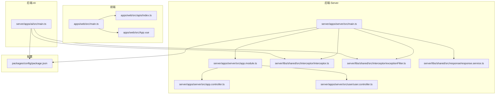
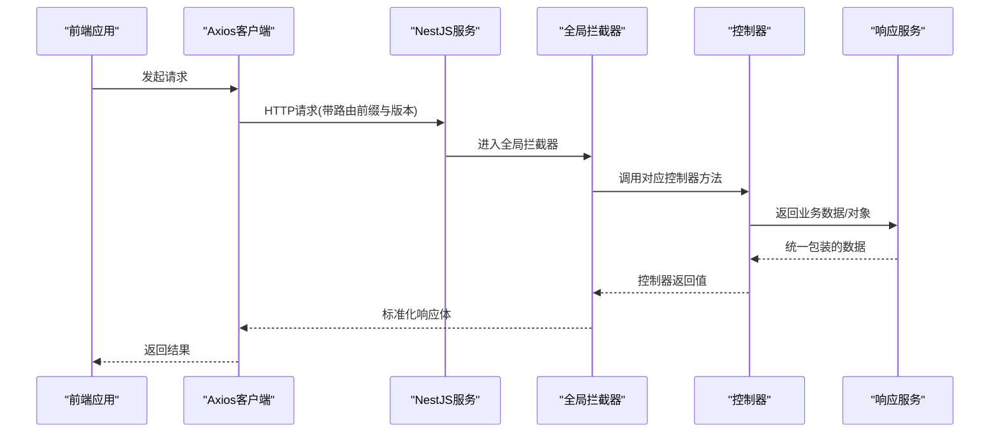
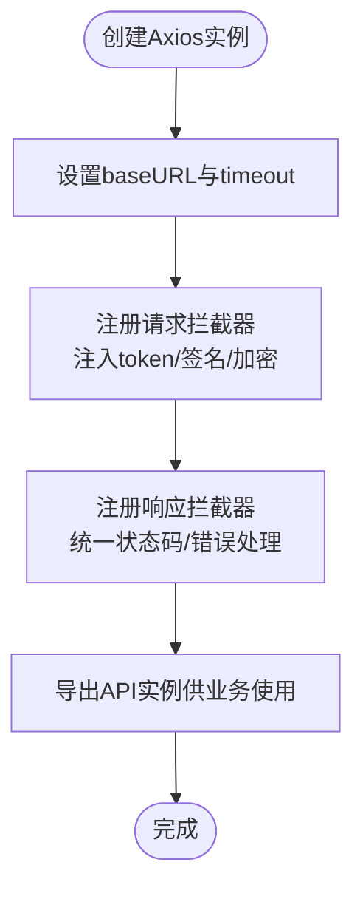
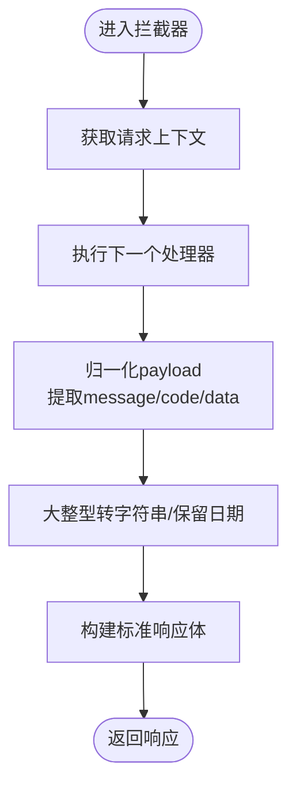
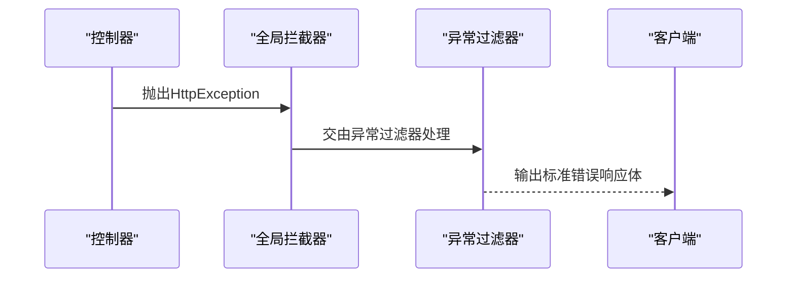
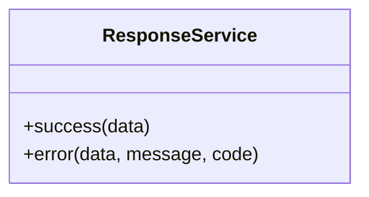
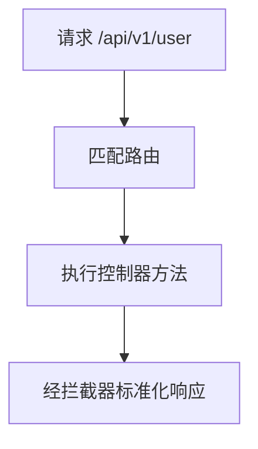
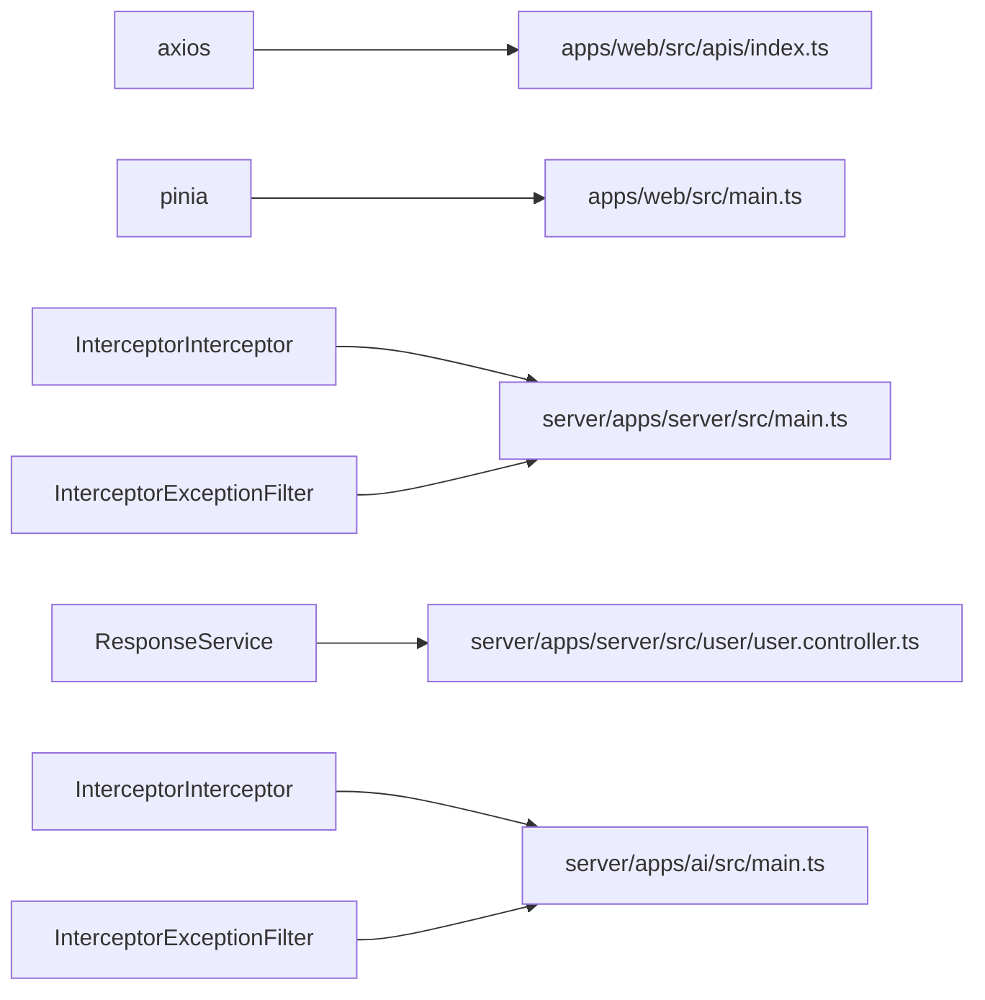

# API集成

<cite>
**本文引用的文件**
- [apps/web/src/apis/index.ts](file://apps/web/src/apis/index.ts)
- [apps/web/src/main.ts](file://apps/web/src/main.ts)
- [apps/web/src/App.vue](file://apps/web/src/App.vue)
- [apps/web/src/stores/counter.ts](file://apps/web/src/stores/counter.ts)
- [server/apps/server/src/main.ts](file://server/apps/server/src/main.ts)
- [server/apps/server/src/app.module.ts](file://server/apps/server/src/app.module.ts)
- [server/apps/server/src/app.controller.ts](file://server/apps/server/src/app.controller.ts)
- [server/apps/server/src/user/user.controller.ts](file://server/apps/server/src/user/user.controller.ts)
- [server/libs/shared/src/interceptor/interceptor.ts](file://server/libs/shared/src/interceptor/interceptor.ts)
- [server/libs/shared/src/interceptor/exceptionFilter.ts](file://server/libs/shared/src/interceptor/exceptionFilter.ts)
- [server/libs/shared/src/response/response.service.ts](file://server/libs/shared/src/response/response.service.ts)
- [server/libs/shared/src/response/response.module.ts](file://server/libs/shared/src/response/response.module.ts)
- [server/apps/ai/src/main.ts](file://server/apps/ai/src/main.ts)
- [packages/config/package.json](file://packages/config/package.json)
</cite>

## 目录
1. [引言](#引言)
2. [项目结构](#项目结构)
3. [核心组件](#核心组件)
4. [架构总览](#架构总览)
5. [详细组件分析](#详细组件分析)
6. [依赖分析](#依赖分析)
7. [性能考虑](#性能考虑)
8. [故障排查指南](#故障排查指南)
9. [结论](#结论)
10. [附录](#附录)

## 引言
本文件面向API集成与前端请求封装，系统性梳理前端Axios客户端、后端NestJS拦截器与异常过滤器、统一响应模型、版本化路由与全局前缀等关键设计点。文档覆盖请求封装策略、HTTP客户端配置、请求/响应处理、错误与重试、认证与请求头、跨域、最佳实践、缓存与性能优化、测试与Mock、联调技巧以及复杂场景与版本兼容方案。

## 项目结构
该仓库采用多包/多应用结构：前端Web应用位于apps/web，后端由NestJS应用apps/server与共享库libs/shared组成；另有packages/config作为配置包。API集成的关键位置包括：
- 前端API客户端：apps/web/src/apis/index.ts
- 后端主入口与全局配置：server/apps/server/src/main.ts
- 全局响应拦截器与异常过滤器：server/libs/shared/src/interceptor/*
- 统一响应服务：server/libs/shared/src/response/*
- AI子应用示例：server/apps/ai/src/main.ts
- 配置包：packages/config/package.json

图表来源
- [apps/web/src/main.ts:1-21](file://apps/web/src/main.ts#L1-L21)
- [apps/web/src/apis/index.ts:1-6](file://apps/web/src/apis/index.ts#L1-L6)
- [apps/web/src/App.vue:1-11](file://apps/web/src/App.vue#L1-L11)
- [server/apps/server/src/main.ts:1-20](file://server/apps/server/src/main.ts#L1-L20)
- [server/apps/server/src/app.module.ts:1-13](file://server/apps/server/src/app.module.ts#L1-L13)
- [server/apps/server/src/app.controller.ts:1-13](file://server/apps/server/src/app.controller.ts#L1-L13)
- [server/apps/server/src/user/user.controller.ts:1-35](file://server/apps/server/src/user/user.controller.ts#L1-L35)
- [server/libs/shared/src/interceptor/interceptor.ts:1-86](file://server/libs/shared/src/interceptor/interceptor.ts#L1-L86)
- [server/libs/shared/src/interceptor/exceptionFilter.ts:1-23](file://server/libs/shared/src/interceptor/exceptionFilter.ts#L1-L23)
- [server/libs/shared/src/response/response.service.ts:1-29](file://server/libs/shared/src/response/response.service.ts#L1-L29)
- [server/apps/ai/src/main.ts:1-13](file://server/apps/ai/src/main.ts#L1-L13)
- [packages/config/package.json:1-24](file://packages/config/package.json#L1-L24)

章节来源
- [apps/web/src/main.ts:1-21](file://apps/web/src/main.ts#L1-L21)
- [apps/web/src/apis/index.ts:1-6](file://apps/web/src/apis/index.ts#L1-L6)
- [server/apps/server/src/main.ts:1-20](file://server/apps/server/src/main.ts#L1-L20)

## 核心组件
- 前端Axios客户端
  - 在apps/web/src/apis/index.ts中创建基础实例，设置baseURL与超时时间，作为所有API调用的统一出口。
- 后端全局拦截器
  - 拦截器将任意控制器返回值标准化为统一响应体（含时间戳、路径、消息、状态码、成功标记与数据），并对大整型进行安全序列化。
- 后端异常过滤器
  - 捕获HttpException，统一输出标准错误响应体（包含时间戳、路径、消息、状态码、失败标记）。
- 统一响应服务
  - 提供success/error辅助方法，简化业务层返回格式的一致性。
- 版本化与全局前缀
  - 后端启用URI版本化与全局前缀，便于演进与路由组织。
- 配置包
  - 通过packages/config暴露端口等配置，供各应用读取。

章节来源
- [apps/web/src/apis/index.ts:1-6](file://apps/web/src/apis/index.ts#L1-L6)
- [server/libs/shared/src/interceptor/interceptor.ts:1-86](file://server/libs/shared/src/interceptor/interceptor.ts#L1-L86)
- [server/libs/shared/src/interceptor/exceptionFilter.ts:1-23](file://server/libs/shared/src/interceptor/exceptionFilter.ts#L1-L23)
- [server/libs/shared/src/response/response.service.ts:1-29](file://server/libs/shared/src/response/response.service.ts#L1-L29)
- [server/apps/server/src/main.ts:12-16](file://server/apps/server/src/main.ts#L12-L16)
- [packages/config/package.json:1-24](file://packages/config/package.json#L1-L24)

## 架构总览
前后端通过统一的HTTP协议交互，后端以拦截器与异常过滤器保证响应一致性，前端以Axios客户端集中管理请求参数与行为。版本化路由与全局前缀提升可维护性与兼容性。

图表来源
- [apps/web/src/apis/index.ts:1-6](file://apps/web/src/apis/index.ts#L1-L6)
- [server/apps/server/src/main.ts:12-16](file://server/apps/server/src/main.ts#L12-L16)
- [server/libs/shared/src/interceptor/interceptor.ts:64-84](file://server/libs/shared/src/interceptor/interceptor.ts#L64-L84)
- [server/libs/shared/src/response/response.service.ts:14-27](file://server/libs/shared/src/response/response.service.ts#L14-L27)
- [server/apps/server/src/user/user.controller.ts:10-33](file://server/apps/server/src/user/user.controller.ts#L10-L33)

## 详细组件分析

### 前端API客户端与请求封装策略
- 客户端创建
  - 使用axios.create在apps/web/src/apis/index.ts中创建实例，集中设置baseURL与timeout，便于后续扩展拦截器与默认头。
- 请求封装建议
  - 建议在此文件内添加请求拦截器，统一注入token、签名或加密参数；添加响应拦截器，统一处理状态码、错误提示与自动登出逻辑。
  - 对于上传/下载等特殊场景，可按需拆分专用实例或方法。
- 与应用集成
  - 在apps/web/src/main.ts中初始化Pinia、路由与ElementPlus，可在store中引入API实例，实现状态与请求的解耦。

图表来源
- [apps/web/src/apis/index.ts:1-6](file://apps/web/src/apis/index.ts#L1-L6)
- [apps/web/src/main.ts:1-21](file://apps/web/src/main.ts#L1-L21)

章节来源
- [apps/web/src/apis/index.ts:1-6](file://apps/web/src/apis/index.ts#L1-L6)
- [apps/web/src/main.ts:1-21](file://apps/web/src/main.ts#L1-L21)

### 后端全局拦截器与响应处理
- 功能职责
  - 将控制器返回值标准化为统一响应体，自动填充时间戳、路径、消息、状态码与成功标记；对大整型进行字符串化，避免JSON精度丢失。
- 数据流
  - 拦截器在next.handle()之后映射响应，先归一化payload，再组装标准响应体，最后返回给客户端。
- 适用范围
  - 通过app.useGlobalInterceptors挂载到全局，无需在每个控制器重复包装。

图表来源
- [server/apps/server/src/main.ts:10-10](file://server/apps/server/src/main.ts#L10-L10)
- [server/libs/shared/src/interceptor/interceptor.ts:64-84](file://server/libs/shared/src/interceptor/interceptor.ts#L64-L84)

章节来源
- [server/libs/shared/src/interceptor/interceptor.ts:1-86](file://server/libs/shared/src/interceptor/interceptor.ts#L1-L86)
- [server/apps/server/src/main.ts:10-10](file://server/apps/server/src/main.ts#L10-L10)

### 后端异常过滤器与错误处理
- 功能职责
  - 捕获HttpException，统一输出标准错误响应体，包含时间戳、路径、消息、状态码与失败标记。
- 应用方式
  - 通过app.useGlobalFilters挂载到全局，确保未捕获的HTTP异常也能被标准化输出。

图表来源
- [server/apps/server/src/main.ts:11-11](file://server/apps/server/src/main.ts#L11-L11)
- [server/libs/shared/src/interceptor/exceptionFilter.ts:8-22](file://server/libs/shared/src/interceptor/exceptionFilter.ts#L8-L22)

章节来源
- [server/libs/shared/src/interceptor/exceptionFilter.ts:1-23](file://server/libs/shared/src/interceptor/exceptionFilter.ts#L1-L23)
- [server/apps/server/src/main.ts:11-11](file://server/apps/server/src/main.ts#L11-L11)

### 统一响应服务与业务返回
- 功能职责
  - 提供success与error两个辅助方法，快速返回符合统一响应体规范的对象，减少样板代码。
- 使用建议
  - 控制器直接return ResponseService.success(data)或ResponseService.error(data, message, code)，由拦截器进一步标准化。

图表来源
- [server/libs/shared/src/response/response.service.ts:14-27](file://server/libs/shared/src/response/response.service.ts#L14-L27)

章节来源
- [server/libs/shared/src/response/response.service.ts:1-29](file://server/libs/shared/src/response/response.service.ts#L1-L29)
- [server/libs/shared/src/response/response.module.ts:1-9](file://server/libs/shared/src/response/response.module.ts#L1-L9)

### 版本化路由与全局前缀
- 版本化
  - 启用URI版本化，将版本号纳入路由路径，默认版本为“1”，便于未来升级与兼容。
- 全局前缀
  - 设置全局路由前缀为“api”，统一所有路由前缀，降低冲突风险并提升可读性。

图表来源
- [server/apps/server/src/main.ts:12-16](file://server/apps/server/src/main.ts#L12-L16)

章节来源
- [server/apps/server/src/main.ts:12-16](file://server/apps/server/src/main.ts#L12-L16)

### 认证、请求头与跨域处理
- 认证与Token
  - 建议在前端请求拦截器中从存储（如localStorage或Pinia）读取token，统一注入到Authorization头。
- 请求头配置
  - 可在Axios实例中设置Content-Type、Accept-Language等默认头；针对特定接口可动态覆盖。
- 跨域处理
  - 后端已启用版本化与全局前缀，前端应确保baseURL与后端一致；如需跨域，请在后端通过中间件或Nest平台配置CORS策略（当前仓库未见显式CORS配置，建议在main.ts中补充）。

章节来源
- [apps/web/src/apis/index.ts:1-6](file://apps/web/src/apis/index.ts#L1-L6)
- [server/apps/server/src/main.ts:12-16](file://server/apps/server/src/main.ts#L12-L16)

### 错误处理与重试机制
- 错误处理
  - 后端通过异常过滤器统一输出错误；前端响应拦截器中可识别非2xx状态码并触发统一错误提示或登出流程。
- 重试机制
  - 建议在前端请求拦截器中对网络错误或5xx类错误进行指数退避重试，限制最大重试次数与抖动，避免雪崩效应。

章节来源
- [server/libs/shared/src/interceptor/exceptionFilter.ts:8-22](file://server/libs/shared/src/interceptor/exceptionFilter.ts#L8-L22)
- [apps/web/src/apis/index.ts:1-6](file://apps/web/src/apis/index.ts#L1-L6)

### API调用最佳实践、缓存与性能优化
- 最佳实践
  - 统一在apis/index.ts中管理请求；对幂等GET请求可启用浏览器/CDN缓存；对写操作禁用缓存。
- 缓存策略
  - 前端可结合HTTP缓存头与内存缓存（如LRU）；后端可通过Redis等实现接口级缓存。
- 性能优化
  - 合理设置timeout与重试；对长列表分页加载；压缩传输（后端开启Gzip）；并发请求合并与去重。

章节来源
- [apps/web/src/apis/index.ts:1-6](file://apps/web/src/apis/index.ts#L1-L6)

### 测试方法、Mock数据与联调技巧
- 单元测试
  - 前端：对API封装函数与拦截器逻辑进行单元测试；使用MockAdapter模拟Axios请求。
  - 后端：使用Nest的Test工具构造测试模块，替换服务依赖，验证拦截器与异常过滤器行为。
- Mock数据
  - 前端：在开发环境使用静态JSON或Mock服务；后端：使用Prisma种子或测试数据库。
- 联调技巧
  - 使用Swagger/OpenAPI生成接口文档；前后端约定统一的响应体字段；通过日志追踪请求链路。

章节来源
- [apps/web/src/apis/index.ts:1-6](file://apps/web/src/apis/index.ts#L1-L6)
- [server/libs/shared/src/interceptor/interceptor.ts:1-86](file://server/libs/shared/src/interceptor/interceptor.ts#L1-L86)
- [server/libs/shared/src/interceptor/exceptionFilter.ts:1-23](file://server/libs/shared/src/interceptor/exceptionFilter.ts#L1-L23)

### 复杂API场景与版本兼容
- 复杂场景
  - 文件上传/下载：分离专用实例或方法，设置合适的Content-Type与进度回调。
  - 实时推送：结合WebSocket或Server-Sent Events，HTTP部分仍遵循统一响应。
- 版本兼容
  - 新增v2接口时保持v1不变，逐步迁移；通过版本化路由与默认版本控制平滑过渡。

章节来源
- [server/apps/server/src/main.ts:13-16](file://server/apps/server/src/main.ts#L13-L16)

## 依赖分析
- 前端
  - apps/web/src/apis/index.ts依赖axios；apps/web/src/main.ts负责应用初始化与Pinia集成。
- 后端
  - server/apps/server/src/main.ts依赖全局拦截器与异常过滤器；app.module.ts组织模块；app.controller.ts与user.controller.ts定义路由与业务。
- 共享库
  - libs/shared提供拦截器、异常过滤器与统一响应服务；AI应用同样使用相同拦截器与过滤器。

图表来源
- [apps/web/src/apis/index.ts:1-6](file://apps/web/src/apis/index.ts#L1-L6)
- [apps/web/src/main.ts:1-21](file://apps/web/src/main.ts#L1-L21)
- [server/apps/server/src/main.ts:1-20](file://server/apps/server/src/main.ts#L1-L20)
- [server/apps/server/src/user/user.controller.ts:1-35](file://server/apps/server/src/user/user.controller.ts#L1-L35)
- [server/apps/ai/src/main.ts:1-13](file://server/apps/ai/src/main.ts#L1-L13)

章节来源
- [apps/web/src/apis/index.ts:1-6](file://apps/web/src/apis/index.ts#L1-L6)
- [apps/web/src/main.ts:1-21](file://apps/web/src/main.ts#L1-L21)
- [server/apps/server/src/main.ts:1-20](file://server/apps/server/src/main.ts#L1-L20)
- [server/apps/server/src/user/user.controller.ts:1-35](file://server/apps/server/src/user/user.controller.ts#L1-L35)
- [server/apps/ai/src/main.ts:1-13](file://server/apps/ai/src/main.ts#L1-L13)

## 性能考虑
- 网络层
  - 设置合理timeout；对高频请求启用缓存；避免不必要的重试。
- 应用层
  - 控制器返回数据尽量轻量化；拦截器仅做必要转换；避免在拦截器中执行耗时操作。
- 传输层
  - 后端开启Gzip压缩；前端按需加载资源；图片与静态资源走CDN。

## 故障排查指南
- 响应不一致
  - 检查是否正确使用ResponseService或拦截器；确认控制器返回值是否为对象。
- 异常未被捕获
  - 确认全局异常过滤器已注册；检查是否抛出了非HttpException。
- 路由404
  - 确认已设置全局前缀“api”且版本化路由正确；核对baseURL与后端一致。
- Token失效
  - 在前端请求拦截器中刷新token并重试；后端拦截器中识别未授权状态并引导登出。

章节来源
- [server/libs/shared/src/interceptor/exceptionFilter.ts:8-22](file://server/libs/shared/src/interceptor/exceptionFilter.ts#L8-L22)
- [server/apps/server/src/main.ts:12-16](file://server/apps/server/src/main.ts#L12-L16)
- [apps/web/src/apis/index.ts:1-6](file://apps/web/src/apis/index.ts#L1-L6)

## 结论
本项目通过前端Axios客户端与后端全局拦截器/异常过滤器实现了API请求的统一封装与标准化响应。配合版本化路由与全局前缀，提升了系统的可维护性与演进能力。建议在现有基础上补充认证拦截、跨域配置、缓存与重试策略，并完善测试与Mock方案，以支撑更复杂的业务场景。

## 附录
- 配置包说明
  - packages/config/package.json提供包元信息与导出配置，实际端口等配置应由具体应用读取。

章节来源
- [packages/config/package.json:1-24](file://packages/config/package.json#L1-L24)