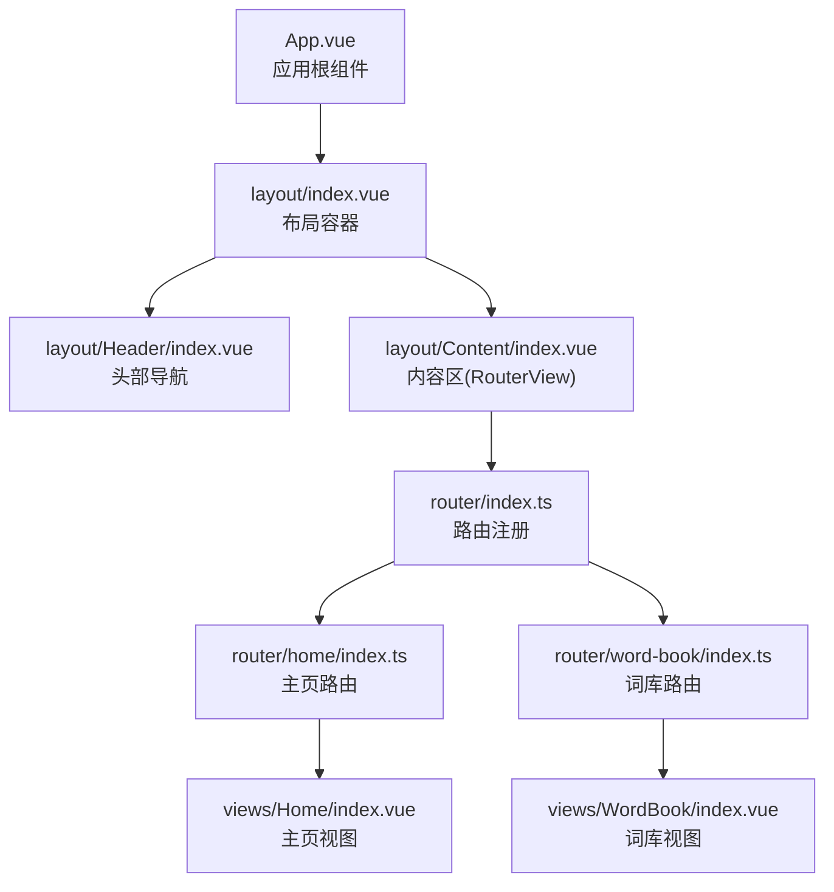
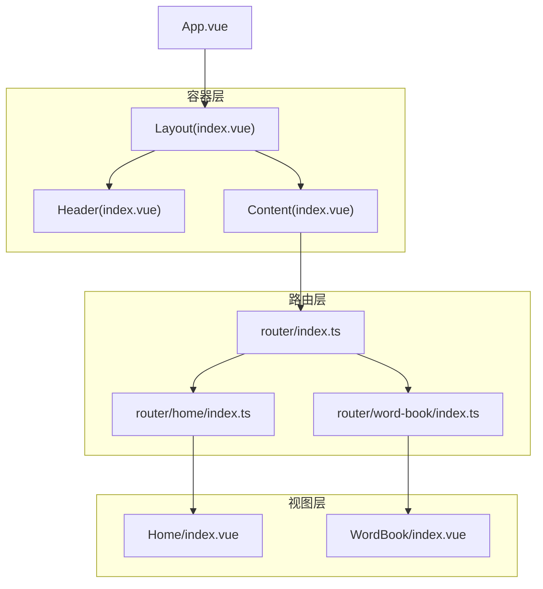
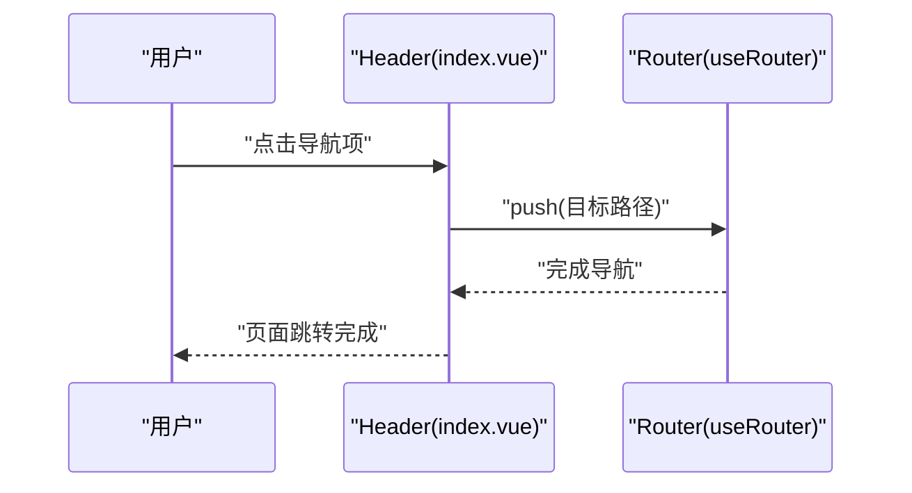
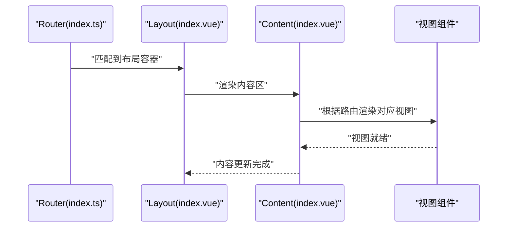
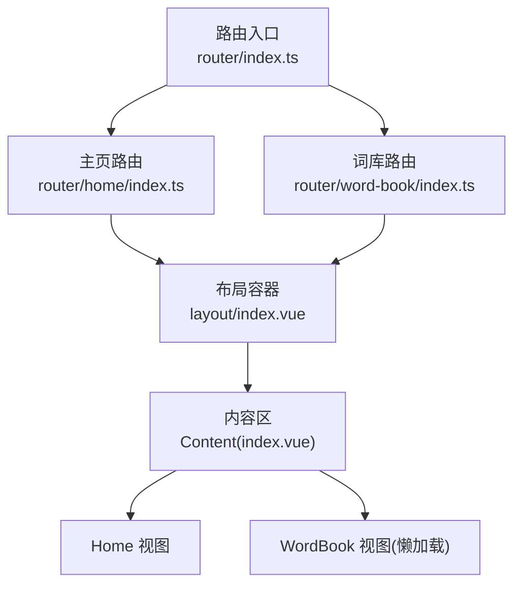
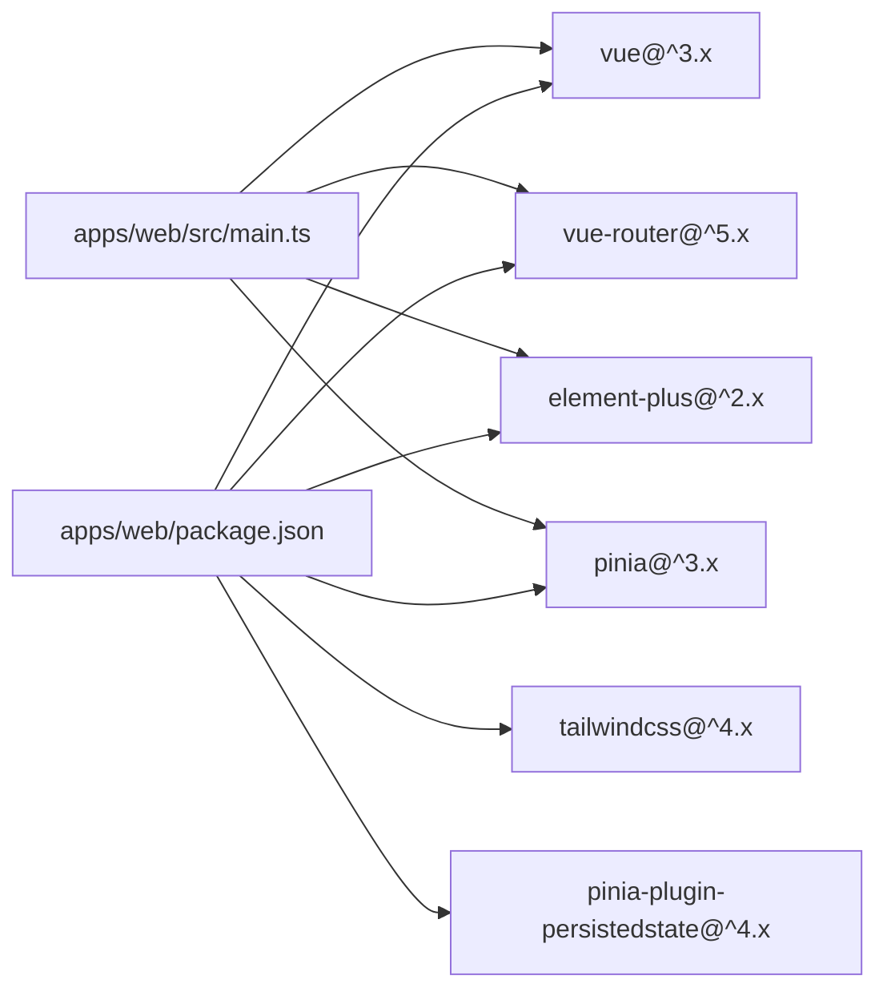

# 布局组件

<cite>
**本文引用的文件**
- [apps/web/src/layout/index.vue](file://apps/web/src/layout/index.vue)
- [apps/web/src/layout/Header/index.vue](file://apps/web/src/layout/Header/index.vue)
- [apps/web/src/layout/Content/index.vue](file://apps/web/src/layout/Content/index.vue)
- [apps/web/src/App.vue](file://apps/web/src/App.vue)
- [apps/web/src/main.ts](file://apps/web/src/main.ts)
- [apps/web/src/router/index.ts](file://apps/web/src/router/index.ts)
- [apps/web/src/router/home/index.ts](file://apps/web/src/router/home/index.ts)
- [apps/web/src/router/word-book/index.ts](file://apps/web/src/router/word-book/index.ts)
- [apps/web/src/views/Home/index.vue](file://apps/web/src/views/Home/index.vue)
- [apps/web/src/views/WordBook/index.vue](file://apps/web/src/views/WordBook/index.vue)
- [apps/web/src/assets/base.css](file://apps/web/src/assets/base.css)
- [apps/web/package.json](file://apps/web/package.json)
</cite>

## 目录
1. [简介](#简介)
2. [项目结构](#项目结构)
3. [核心组件](#核心组件)
4. [架构总览](#架构总览)
5. [详细组件分析](#详细组件分析)
6. [依赖分析](#依赖分析)
7. [性能考虑](#性能考虑)
8. [故障排查指南](#故障排查指南)
9. [结论](#结论)
10. [附录](#附录)

## 简介
本文件系统性梳理 Web 应用中的布局组件体系，围绕整体布局架构的设计理念与组件层次展开，重点阐释：
- Header 头部组件的功能职责、导航逻辑与响应式设计
- Content 内容区域的布局策略、路由视图渲染与页面切换机制
- 布局组件间的通信模式、插槽使用与主题定制
- 扩展方法、样式覆盖与移动端适配方案
- 实际使用案例与最佳实践

## 项目结构
布局系统采用“顶层容器 + 子组件分层”的组织方式：应用根组件负责全局挂载与路由入口；布局容器承载 Header 与 Content；Content 使用 RouterView 渲染当前路由对应的视图；路由配置通过嵌套路由将视图绑定到布局容器。

图表来源
- [apps/web/src/App.vue:1-11](file://apps/web/src/App.vue#L1-L11)
- [apps/web/src/layout/index.vue:1-8](file://apps/web/src/layout/index.vue#L1-L8)
- [apps/web/src/layout/Header/index.vue:1-54](file://apps/web/src/layout/Header/index.vue#L1-L54)
- [apps/web/src/layout/Content/index.vue:1-7](file://apps/web/src/layout/Content/index.vue#L1-L7)
- [apps/web/src/router/index.ts:1-13](file://apps/web/src/router/index.ts#L1-L13)
- [apps/web/src/router/home/index.ts:1-12](file://apps/web/src/router/home/index.ts#L1-L12)
- [apps/web/src/router/word-book/index.ts:1-11](file://apps/web/src/router/word-book/index.ts#L1-L11)
- [apps/web/src/views/Home/index.vue:1-7](file://apps/web/src/views/Home/index.vue#L1-L7)
- [apps/web/src/views/WordBook/index.vue:1-7](file://apps/web/src/views/WordBook/index.vue#L1-L7)

章节来源
- [apps/web/src/App.vue:1-11](file://apps/web/src/App.vue#L1-L11)
- [apps/web/src/layout/index.vue:1-8](file://apps/web/src/layout/index.vue#L1-L8)
- [apps/web/src/router/index.ts:1-13](file://apps/web/src/router/index.ts#L1-L13)

## 核心组件
- 布局容器（Layout）：聚合 Header 与 Content，作为路由嵌套的父级视图，统一承载页面骨架。
- 头部导航（Header）：提供站点标识、主导航入口、用户入口与状态徽标等。
- 内容区（Content）：以 RouterView 作为占位，动态渲染当前路由匹配的子视图。
- 应用根组件（App）：全局挂载点，承载顶层 RouterView（在当前路由结构中，实际由布局容器接管）。
- 路由系统：集中注册主页与词库路由，并通过嵌套路由将视图绑定至布局容器。

章节来源
- [apps/web/src/layout/index.vue:1-8](file://apps/web/src/layout/index.vue#L1-L8)
- [apps/web/src/layout/Header/index.vue:1-54](file://apps/web/src/layout/Header/index.vue#L1-L54)
- [apps/web/src/layout/Content/index.vue:1-7](file://apps/web/src/layout/Content/index.vue#L1-L7)
- [apps/web/src/App.vue:1-11](file://apps/web/src/App.vue#L1-L11)
- [apps/web/src/router/index.ts:1-13](file://apps/web/src/router/index.ts#L1-L13)

## 架构总览
布局架构遵循“容器-视图”分离与“路由嵌套”的设计原则：
- 容器层（Layout）：负责页面骨架与通用 UI 结构
- 视图层（Views）：按路由独立管理业务内容
- 导航层（Header）：提供跨视图一致的导航体验
- 路由层（Router）：定义路径、父子关系与懒加载策略

图表来源
- [apps/web/src/layout/index.vue:1-8](file://apps/web/src/layout/index.vue#L1-L8)
- [apps/web/src/layout/Header/index.vue:1-54](file://apps/web/src/layout/Header/index.vue#L1-L54)
- [apps/web/src/layout/Content/index.vue:1-7](file://apps/web/src/layout/Content/index.vue#L1-L7)
- [apps/web/src/router/index.ts:1-13](file://apps/web/src/router/index.ts#L1-L13)
- [apps/web/src/router/home/index.ts:1-12](file://apps/web/src/router/home/index.ts#L1-L12)
- [apps/web/src/router/word-book/index.ts:1-11](file://apps/web/src/router/word-book/index.ts#L1-L11)
- [apps/web/src/views/Home/index.vue:1-7](file://apps/web/src/views/Home/index.vue#L1-L7)
- [apps/web/src/views/WordBook/index.vue:1-7](file://apps/web/src/views/WordBook/index.vue#L1-L7)

## 详细组件分析

### Header 头部组件
- 功能职责
  - 展示站点标识与品牌元素
  - 提供主导航入口（主页、AI、词库、课程、设置）
  - 展示用户入口与状态徽标（如积分、等级等）
  - 支持粘性定位与水平居中布局
- 导航逻辑
  - 通过路由实例触发导航跳转，点击对应菜单项即切换到目标路径
  - 菜单项与路由路径一一对应，确保导航一致性
- 响应式设计
  - 采用固定高度与水平居中容器，配合弹性布局实现自适应
  - 在小屏设备上建议结合断点与折叠菜单进一步优化
- 可扩展点
  - 添加下拉菜单或侧边抽屉
  - 集成用户登录态与头像显示
  - 引入主题切换与语言切换入口

图表来源
- [apps/web/src/layout/Header/index.vue:8-33](file://apps/web/src/layout/Header/index.vue#L8-L33)
- [apps/web/src/layout/Header/index.vue:52-54](file://apps/web/src/layout/Header/index.vue#L52-L54)

章节来源
- [apps/web/src/layout/Header/index.vue:1-54](file://apps/web/src/layout/Header/index.vue#L1-L54)

### Content 内容区域
- 布局策略
  - 以 RouterView 作为唯一占位，承载当前路由匹配的视图组件
  - 与布局容器形成“容器-视图”关系，便于统一风格与过渡动画
- 路由视图渲染
  - 通过路由嵌套将视图注册为布局的子视图，实现按路径渲染
  - 支持异步组件懒加载（在词库路由中体现）
- 页面切换机制
  - 切换路由时，RouterView 自动卸载旧视图并渲染新视图
  - 可结合路由元信息与过渡动画增强用户体验

图表来源
- [apps/web/src/router/index.ts:1-13](file://apps/web/src/router/index.ts#L1-L13)
- [apps/web/src/router/home/index.ts:1-12](file://apps/web/src/router/home/index.ts#L1-L12)
- [apps/web/src/router/word-book/index.ts:1-11](file://apps/web/src/router/word-book/index.ts#L1-L11)
- [apps/web/src/layout/Content/index.vue:1-7](file://apps/web/src/layout/Content/index.vue#L1-L7)

章节来源
- [apps/web/src/layout/Content/index.vue:1-7](file://apps/web/src/layout/Content/index.vue#L1-L7)
- [apps/web/src/router/index.ts:1-13](file://apps/web/src/router/index.ts#L1-L13)

### Profile 用户信息组件
- 当前状态
  - 仓库中未发现 Profile 组件的实现文件
  - Header 中存在用户入口占位（头像与“未登录”文本），可作为后续集成点
- 建议实现方向
  - 独立组件：登录态判断、头像、昵称、登出流程
  - 下拉菜单：快捷入口、个人中心、设置入口
  - 状态管理：结合 Pinia 或路由守卫维护用户会话
- 集成建议
  - 将 Profile 组件挂载于 Header 的用户入口区域
  - 通过事件或状态共享实现 Header 与 Profile 的解耦通信

章节来源
- [apps/web/src/layout/Header/index.vue:40-44](file://apps/web/src/layout/Header/index.vue#L40-L44)

### 布局容器与通信模式
- 组件间关系
  - Layout 聚合 Header 与 Content，形成父子关系
  - Header 通过路由实例与外部导航系统协作
  - Content 仅负责渲染，不直接处理导航逻辑
- 插槽使用
  - 当前实现未使用具名插槽；可在布局容器中引入默认插槽以支持内容区的灵活扩展
- 主题定制
  - 通过全局样式与 Tailwind 类名控制外观
  - 可在布局容器中引入主题变量或 CSS 自定义属性以支持动态主题

章节来源
- [apps/web/src/layout/index.vue:1-8](file://apps/web/src/layout/index.vue#L1-L8)
- [apps/web/src/layout/Header/index.vue:1-54](file://apps/web/src/layout/Header/index.vue#L1-L54)
- [apps/web/src/layout/Content/index.vue:1-7](file://apps/web/src/layout/Content/index.vue#L1-L7)

### 路由与视图映射
- 路由注册
  - 主页路由：根路径，绑定 Home 视图
  - 词库路由：路径前缀为 /word-book，子路径 index 对应异步加载的 WordBook 视图
- 嵌套路由
  - 所有视图均作为布局容器的子视图，确保统一的页面骨架

图表来源
- [apps/web/src/router/index.ts:1-13](file://apps/web/src/router/index.ts#L1-L13)
- [apps/web/src/router/home/index.ts:1-12](file://apps/web/src/router/home/index.ts#L1-L12)
- [apps/web/src/router/word-book/index.ts:1-11](file://apps/web/src/router/word-book/index.ts#L1-L11)
- [apps/web/src/layout/index.vue:1-8](file://apps/web/src/layout/index.vue#L1-L8)
- [apps/web/src/layout/Content/index.vue:1-7](file://apps/web/src/layout/Content/index.vue#L1-L7)

章节来源
- [apps/web/src/router/index.ts:1-13](file://apps/web/src/router/index.ts#L1-L13)
- [apps/web/src/router/home/index.ts:1-12](file://apps/web/src/router/home/index.ts#L1-L12)
- [apps/web/src/router/word-book/index.ts:1-11](file://apps/web/src/router/word-book/index.ts#L1-L11)

## 依赖分析
- 运行时依赖
  - Vue 3、Vue Router、Element Plus、TailwindCSS、Pinia、pinia-plugin-persistedstate
- 构建与开发工具
  - Vite、TypeScript、vue-tsc、@vitejs/plugin-vue
- 全局样式
  - TailwindCSS 与基础尺寸约束，保证根节点高度与宽度铺满

图表来源
- [apps/web/package.json:13-29](file://apps/web/package.json#L13-L29)
- [apps/web/src/main.ts:11-20](file://apps/web/src/main.ts#L11-L20)

章节来源
- [apps/web/package.json:1-45](file://apps/web/package.json#L1-L45)
- [apps/web/src/main.ts:1-21](file://apps/web/src/main.ts#L1-L21)
- [apps/web/src/assets/base.css:1-5](file://apps/web/src/assets/base.css#L1-L5)

## 性能考虑
- 路由懒加载
  - 词库视图采用异步组件加载，减少首屏包体与初次渲染时间
- 组件拆分
  - Header 与 Content 解耦，避免不必要的重渲染
- 样式体积
  - TailwindCSS 按需引入，建议在生产环境启用摇树优化
- 状态持久化
  - Pinia 持久化插件可用于关键状态的本地缓存，提升回退体验

## 故障排查指南
- 路由无法渲染
  - 检查路由配置是否正确注册到布局容器
  - 确认视图组件路径与懒加载函数有效
- 导航无效
  - 核对 Header 中的导航路径与路由表是否一致
  - 确保路由实例可用且未被意外覆盖
- 样式异常
  - 检查 TailwindCSS 是否正确引入
  - 确认全局基础样式未被局部作用域覆盖

章节来源
- [apps/web/src/router/index.ts:1-13](file://apps/web/src/router/index.ts#L1-L13)
- [apps/web/src/layout/Header/index.vue:8-33](file://apps/web/src/layout/Header/index.vue#L8-L33)
- [apps/web/src/assets/base.css:1-5](file://apps/web/src/assets/base.css#L1-L5)

## 结论
该布局组件体系以简洁清晰的容器-视图分层实现了页面骨架与内容的解耦，配合路由嵌套与懒加载策略，兼顾了可维护性与性能。Header 提供统一导航入口，Content 专注视图渲染，整体具备良好的扩展性与可定制性。后续可在 Profile 组件、主题系统与移动端适配上继续深化。

## 附录
- 实际使用案例
  - 新增页面：在路由模块中注册新路径，并在布局容器下添加对应视图
  - 修改导航：在 Header 中新增或调整导航项，并同步更新路由表
  - 主题定制：通过 CSS 变量或 Tailwind 自定义类名实现主题切换
- 最佳实践
  - 保持 Header 无副作用，导航逻辑集中在路由层
  - 使用路由元信息管理面包屑、标题与权限
  - 对大视图采用懒加载，优化首屏性能
  - 在布局容器中预留插槽，支持内容区的灵活扩展