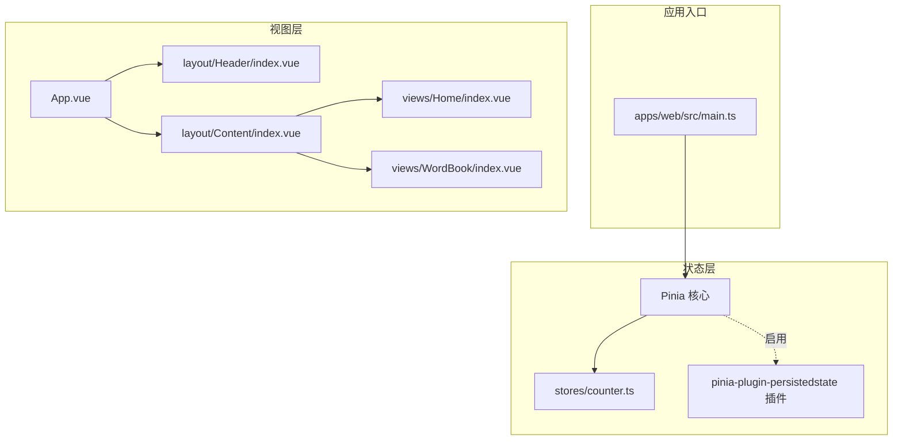
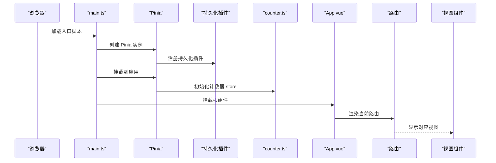
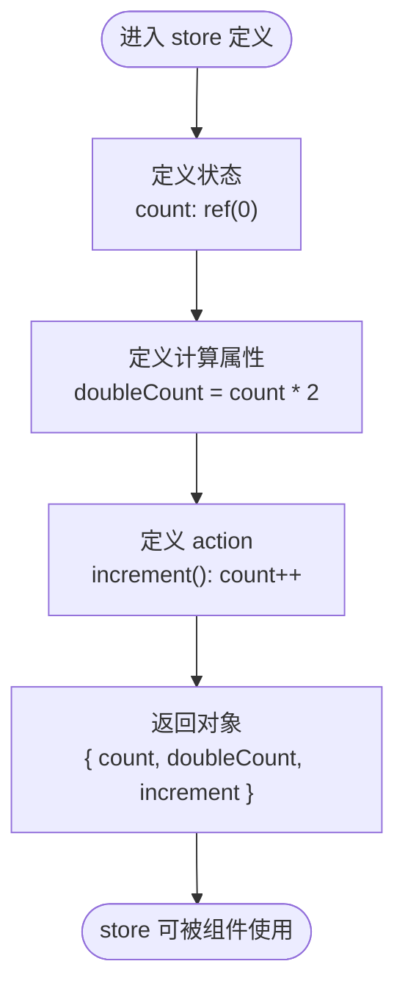
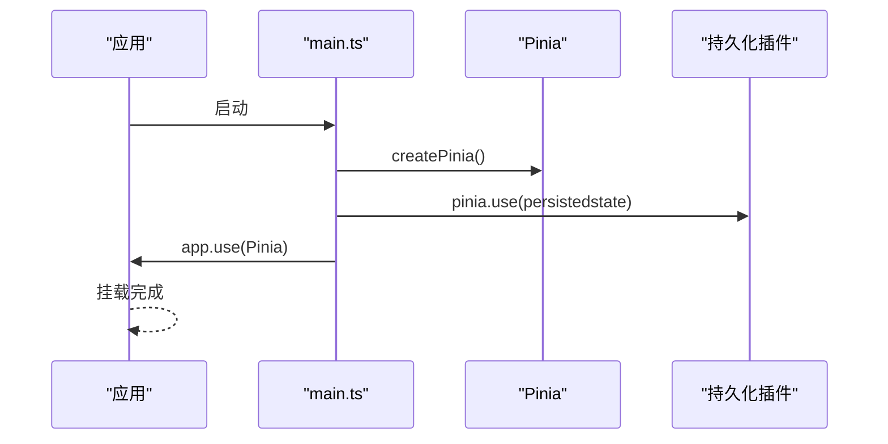
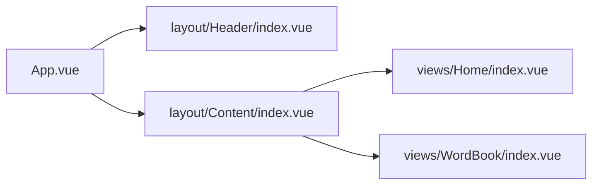
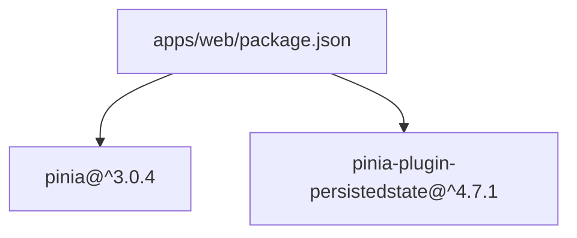

# 状态管理

<cite>
**本文引用的文件**
- [apps/web/src/stores/counter.ts](file://apps/web/src/stores/counter.ts)
- [apps/web/src/main.ts](file://apps/web/src/main.ts)
- [apps/web/package.json](file://apps/web/package.json)
- [apps/web/src/layout/Header/index.vue](file://apps/web/src/layout/Header/index.vue)
- [apps/web/src/views/Home/index.vue](file://apps/web/src/views/Home/index.vue)
- [apps/web/src/views/WordBook/index.vue](file://apps/web/src/views/WordBook/index.vue)
- [apps/web/src/App.vue](file://apps/web/src/App.vue)
- [apps/web/src/layout/Content/index.vue](file://apps/web/src/layout/Content/index.vue)
</cite>

## 目录
1. [引言](#引言)
2. [项目结构](#项目结构)
3. [核心组件](#核心组件)
4. [架构总览](#架构总览)
5. [详细组件分析](#详细组件分析)
6. [依赖分析](#依赖分析)
7. [性能考虑](#性能考虑)
8. [故障排查指南](#故障排查指南)
9. [结论](#结论)
10. [附录](#附录)

## 引言
本文件围绕前端应用中的状态管理进行系统性说明，重点基于仓库中已有的 Pinia 计数器 store 实现，结合应用入口与路由视图，解释 Pinia 的架构设计、核心概念与最佳实践。内容涵盖：
- 计数器 store 的实现原理、状态定义与 action 操作
- 响应式更新机制、计算属性与持久化存储
- 多 store 管理、模块化设计与状态共享策略
- 性能优化、调试方法、异步操作与错误处理思路
- 复杂状态场景的解决方案与状态迁移策略

## 项目结构
该 Web 应用采用 Vue 3 + Pinia 架构，状态管理集中在 stores 目录；应用入口在 main.ts 中初始化 Pinia，并通过插件启用持久化；页面由路由驱动，视图组件位于 views 目录。

图表来源
- [apps/web/src/main.ts:1-21](file://apps/web/src/main.ts#L1-L21)
- [apps/web/src/stores/counter.ts:1-13](file://apps/web/src/stores/counter.ts#L1-L13)
- [apps/web/src/App.vue:1-11](file://apps/web/src/App.vue#L1-L11)
- [apps/web/src/layout/Header/index.vue:1-54](file://apps/web/src/layout/Header/index.vue#L1-L54)
- [apps/web/src/layout/Content/index.vue:1-7](file://apps/web/src/layout/Content/index.vue#L1-L7)
- [apps/web/src/views/Home/index.vue:1-7](file://apps/web/src/views/Home/index.vue#L1-L7)
- [apps/web/src/views/WordBook/index.vue:1-7](file://apps/web/src/views/WordBook/index.vue#L1-L7)

章节来源
- [apps/web/src/main.ts:1-21](file://apps/web/src/main.ts#L1-L21)
- [apps/web/src/App.vue:1-11](file://apps/web/src/App.vue#L1-L11)

## 核心组件
- 计数器 store：使用组合式 API 定义状态、计算属性与 action，导出可被组件使用的 store 实例。
- 应用入口：创建并挂载 Pinia，注册持久化插件，使状态在刷新后仍可恢复。
- 视图组件：通过路由渲染不同页面，为后续接入 store 提供场景。

章节来源
- [apps/web/src/stores/counter.ts:1-13](file://apps/web/src/stores/counter.ts#L1-L13)
- [apps/web/src/main.ts:1-21](file://apps/web/src/main.ts#L1-L21)

## 架构总览
下图展示了从应用启动到 store 初始化、再到视图渲染的整体流程。

图表来源
- [apps/web/src/main.ts:1-21](file://apps/web/src/main.ts#L1-L21)
- [apps/web/src/stores/counter.ts:1-13](file://apps/web/src/stores/counter.ts#L1-L13)
- [apps/web/src/App.vue:1-11](file://apps/web/src/App.vue#L1-L11)

## 详细组件分析

### 计数器 store（counter.ts）
- 设计模式：采用组合式 store（setup store），以函数形式返回状态与方法，便于 TypeScript 推断与 Tree-shaking。
- 状态定义：使用 ref 定义可变状态，computed 定义派生状态，确保响应式更新与最小化重渲染。
- Action 操作：提供增量方法，直接修改状态值，保持简单直观。
- 返回结构：将状态与计算属性、action 统一返回，供组件按需解构使用。

图表来源
- [apps/web/src/stores/counter.ts:4-12](file://apps/web/src/stores/counter.ts#L4-L12)

章节来源
- [apps/web/src/stores/counter.ts:1-13](file://apps/web/src/stores/counter.ts#L1-L13)

### 应用入口与 Pinia 初始化（main.ts）
- 创建应用实例与 Pinia 实例。
- 注册持久化插件，使 store 状态在页面刷新后可恢复。
- 将 Pinia 挂载到应用，使全局组件可用。

图表来源
- [apps/web/src/main.ts:11-14](file://apps/web/src/main.ts#L11-L14)

章节来源
- [apps/web/src/main.ts:1-21](file://apps/web/src/main.ts#L1-L21)

### 视图与路由（App.vue、layout、views）
- App.vue 作为根组件，内部仅包含路由视图容器，便于按路由切换页面。
- Header 与 Content 布局组件提供导航与内容区域，配合路由实现页面跳转。
- Home 与 WordBook 视图组件目前为空模板，未来可在其中接入 store 以展示状态。

图表来源
- [apps/web/src/App.vue:1-11](file://apps/web/src/App.vue#L1-L11)
- [apps/web/src/layout/Header/index.vue:1-54](file://apps/web/src/layout/Header/index.vue#L1-L54)
- [apps/web/src/layout/Content/index.vue:1-7](file://apps/web/src/layout/Content/index.vue#L1-L7)
- [apps/web/src/views/Home/index.vue:1-7](file://apps/web/src/views/Home/index.vue#L1-L7)
- [apps/web/src/views/WordBook/index.vue:1-7](file://apps/web/src/views/WordBook/index.vue#L1-L7)

章节来源
- [apps/web/src/App.vue:1-11](file://apps/web/src/App.vue#L1-L11)
- [apps/web/src/layout/Header/index.vue:1-54](file://apps/web/src/layout/Header/index.vue#L1-L54)
- [apps/web/src/layout/Content/index.vue:1-7](file://apps/web/src/layout/Content/index.vue#L1-L7)
- [apps/web/src/views/Home/index.vue:1-7](file://apps/web/src/views/Home/index.vue#L1-L7)
- [apps/web/src/views/WordBook/index.vue:1-7](file://apps/web/src/views/WordBook/index.vue#L1-L7)

## 依赖分析
- Pinia 版本与插件：应用依赖 Pinia 与持久化插件，用于状态管理与本地持久化。
- Vue 生态：Vue 3 与 vue-router 驱动视图与路由，Element Plus 提供 UI 组件库。

图表来源
- [apps/web/package.json:23-24](file://apps/web/package.json#L23-L24)

章节来源
- [apps/web/package.json:1-45](file://apps/web/package.json#L1-L45)

## 性能考虑
- 使用组合式 store：减少样板代码，利于 Tree-shaking，降低包体积。
- 计算属性与浅层状态：优先使用 computed 进行派生状态，避免不必要的响应式开销。
- 按需访问：组件仅解构使用所需的状态与 action，避免跨组件过度耦合。
- 持久化策略：对大体量或频繁变更的状态谨慎启用持久化，避免本地存储膨胀与读写阻塞。
- 调试与可观测：利用浏览器开发工具与 Pinia Devtools 追踪状态变化路径与时间线。

## 故障排查指南
- store 未生效：确认已在入口中创建并挂载 Pinia，且已注册持久化插件。
- 状态未持久化：检查插件是否正确注册，以及目标 store 是否声明了持久化配置。
- 组件无法访问 store：确保在组件 setup 中正确引入并调用 store 函数，且 store 已在入口初始化。
- 路由切换后状态异常：确认 store 返回的对象结构与组件解构一致，避免命名不匹配导致的空值。

## 结论
本项目以最小可行的方式实现了 Pinia 状态管理：通过组合式 store 定义计数器状态与 action，借助入口初始化与持久化插件保障状态可用与可恢复。后续可在现有基础上扩展多 store、模块化拆分与复杂异步场景，同时遵循性能与可维护性最佳实践。

## 附录
- 状态共享策略建议
  - 单页应用内共享：将公共状态放入独立 store，组件通过组合式 API 访问。
  - 跨页面共享：利用路由参数与查询参数传递轻量数据，重数据仍由 store 管理。
- 模块化设计建议
  - 按功能域拆分 store，如用户、主题、国际化等，便于维护与测试。
  - 对外暴露统一的 store 导出入口，隐藏实现细节。
- 异步操作与中间件
  - 异步 action：在 store 内封装异步逻辑，集中处理 loading、成功与失败状态。
  - 中间件：通过拦截器或插件对请求/响应进行统一处理，保持业务代码简洁。
- 错误处理
  - 在 store 内捕获并记录错误，向组件抛出可消费的错误对象或布尔标志。
  - 对网络异常与服务端错误进行分类处理，避免影响整体 UI。
- 复杂状态场景
  - 列表与分页：使用分页参数与列表数据分离，配合缓存与去重策略。
  - 表单校验：将校验规则与状态分离，使用计算属性驱动 UI 状态。
- 状态迁移策略
  - 版本升级时，提供迁移函数将旧格式状态转换为新格式，保证向后兼容。
  - 对持久化数据进行版本标记，避免跨版本冲突。