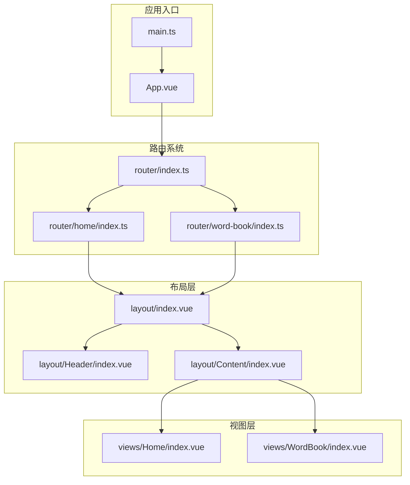
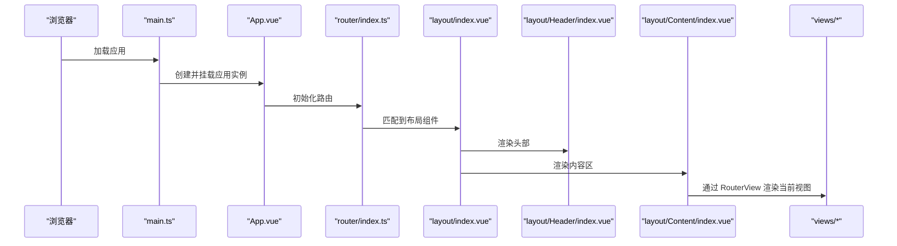
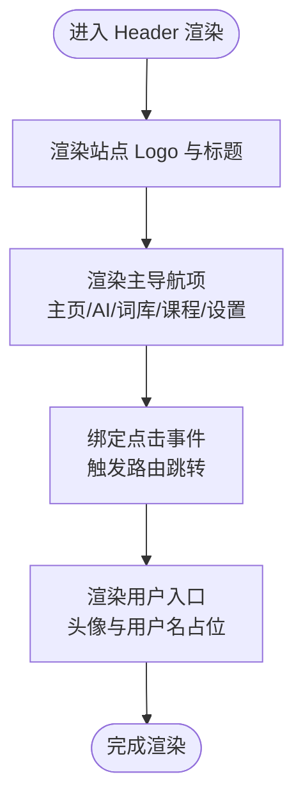
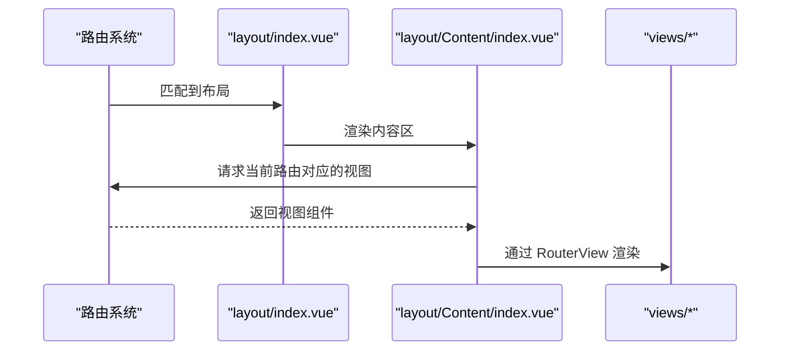
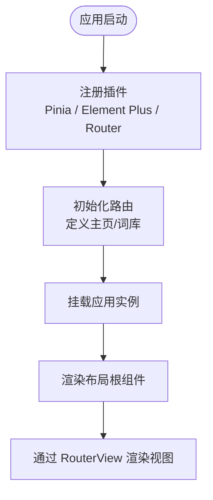
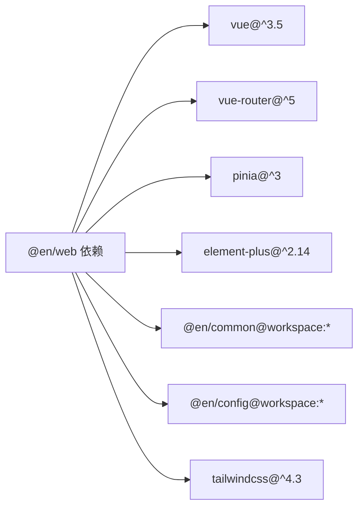

# 组件系统

<cite>
**本文引用的文件**
- [apps/web/src/layout/Header/index.vue](file://apps/web/src/layout/Header/index.vue)
- [apps/web/src/layout/Content/index.vue](file://apps/web/src/layout/Content/index.vue)
- [apps/web/src/layout/index.vue](file://apps/web/src/layout/index.vue)
- [apps/web/src/App.vue](file://apps/web/src/App.vue)
- [apps/web/src/router/index.ts](file://apps/web/src/router/index.ts)
- [apps/web/src/router/home/index.ts](file://apps/web/src/router/home/index.ts)
- [apps/web/src/router/word-book/index.ts](file://apps/web/src/router/word-book/index.ts)
- [apps/web/src/views/Home/index.vue](file://apps/web/src/views/Home/index.vue)
- [apps/web/src/views/WordBook/index.vue](file://apps/web/src/views/WordBook/index.vue)
- [apps/web/src/main.ts](file://apps/web/src/main.ts)
- [apps/web/src/assets/base.css](file://apps/web/src/assets/base.css)
- [apps/web/src/stores/counter.ts](file://apps/web/src/stores/counter.ts)
- [apps/web/package.json](file://apps/web/package.json)
</cite>

## 目录
1. [简介](#简介)
2. [项目结构](#项目结构)
3. [核心组件](#核心组件)
4. [架构总览](#架构总览)
5. [详细组件分析](#详细组件分析)
6. [依赖分析](#依赖分析)
7. [性能考虑](#性能考虑)
8. [故障排查指南](#故障排查指南)
9. [结论](#结论)
10. [附录](#附录)

## 简介
本文件面向“组件系统”的综合文档，聚焦于布局组件的设计模式、层次结构与复用策略。重点解析 Header、Content、Profile（在当前仓库中以占位形式存在）等布局组件的功能职责与交互逻辑；阐述组件间通信机制、props 传递与事件处理方式；总结组件开发最佳实践、命名规范与代码组织原则；并提供测试方法、性能优化技巧与可维护性设计建议。文档同时结合仓库中的实际组件与路由配置，给出可操作的使用场景与参考路径。

## 项目结构
应用采用前端单页应用（SPA）架构，基于 Vue 3 + vue-router + Pinia + Element Plus 构建。布局层通过一个顶层布局容器组合 Header 与 Content，并由路由系统决定具体页面视图的渲染。整体结构清晰、分层明确：应用入口负责全局插件注册与挂载；路由系统定义页面级路径与嵌套关系；布局层负责页面骨架；视图层承载业务页面内容。



图表来源
- [apps/web/src/main.ts:1-21](file://apps/web/src/main.ts#L1-L21)
- [apps/web/src/App.vue:1-11](file://apps/web/src/App.vue#L1-L11)
- [apps/web/src/router/index.ts:1-13](file://apps/web/src/router/index.ts#L1-L13)
- [apps/web/src/router/home/index.ts:1-12](file://apps/web/src/router/home/index.ts#L1-L12)
- [apps/web/src/router/word-book/index.ts:1-11](file://apps/web/src/router/word-book/index.ts#L1-L11)
- [apps/web/src/layout/index.vue:1-8](file://apps/web/src/layout/index.vue#L1-L8)
- [apps/web/src/layout/Header/index.vue:1-54](file://apps/web/src/layout/Header/index.vue#L1-L54)
- [apps/web/src/layout/Content/index.vue:1-7](file://apps/web/src/layout/Content/index.vue#L1-L7)
- [apps/web/src/views/Home/index.vue:1-7](file://apps/web/src/views/Home/index.vue#L1-L7)
- [apps/web/src/views/WordBook/index.vue:1-7](file://apps/web/src/views/WordBook/index.vue#L1-L7)

章节来源
- [apps/web/src/main.ts:1-21](file://apps/web/src/main.ts#L1-L21)
- [apps/web/src/App.vue:1-11](file://apps/web/src/App.vue#L1-L11)
- [apps/web/src/router/index.ts:1-13](file://apps/web/src/router/index.ts#L1-L13)
- [apps/web/src/layout/index.vue:1-8](file://apps/web/src/layout/index.vue#L1-L8)

## 核心组件
- 布局根组件（layout/index.vue）
  - 职责：作为页面骨架容器，组合 Header 与 Content，形成统一的页面结构。
  - 复用策略：所有需要统一头部导航与内容区的页面均可复用该布局。
- 头部组件（layout/Header/index.vue）
  - 职责：提供站点标识、主导航菜单与用户入口区域；绑定路由跳转行为。
  - 交互：点击导航项触发路由跳转；用户头像区域预留登录状态展示位置。
- 内容组件（layout/Content/index.vue）
  - 职责：承载 RouterView，用于渲染当前路由对应的视图组件。
  - 复用策略：与布局根组件配合，实现页面内容的动态切换。
- 视图组件（views/Home/index.vue、views/WordBook/index.vue）
  - 职责：承载具体业务页面内容；通过路由系统被 Content 动态加载。
- 应用入口（App.vue、main.ts）
  - 职责：注册路由、状态管理与 UI 框架；挂载应用。

章节来源
- [apps/web/src/layout/index.vue:1-8](file://apps/web/src/layout/index.vue#L1-L8)
- [apps/web/src/layout/Header/index.vue:1-54](file://apps/web/src/layout/Header/index.vue#L1-L54)
- [apps/web/src/layout/Content/index.vue:1-7](file://apps/web/src/layout/Content/index.vue#L1-L7)
- [apps/web/src/views/Home/index.vue:1-7](file://apps/web/src/views/Home/index.vue#L1-L7)
- [apps/web/src/views/WordBook/index.vue:1-7](file://apps/web/src/views/WordBook/index.vue#L1-L7)
- [apps/web/src/App.vue:1-11](file://apps/web/src/App.vue#L1-L11)
- [apps/web/src/main.ts:1-21](file://apps/web/src/main.ts#L1-L21)

## 架构总览
下图展示了从应用启动到页面渲染的关键流程：入口初始化插件与路由；路由根据路径匹配布局；布局装载头部与内容区；内容区通过 RouterView 渲染对应视图。



图表来源
- [apps/web/src/main.ts:1-21](file://apps/web/src/main.ts#L1-L21)
- [apps/web/src/App.vue:1-11](file://apps/web/src/App.vue#L1-L11)
- [apps/web/src/router/index.ts:1-13](file://apps/web/src/router/index.ts#L1-L13)
- [apps/web/src/layout/index.vue:1-8](file://apps/web/src/layout/index.vue#L1-L8)
- [apps/web/src/layout/Header/index.vue:1-54](file://apps/web/src/layout/Header/index.vue#L1-L54)
- [apps/web/src/layout/Content/index.vue:1-7](file://apps/web/src/layout/Content/index.vue#L1-L7)

## 详细组件分析

### Header 组件分析
- 设计模式
  - 结构化布局：头部采用固定高度与居中容器，保证在滚动时保持导航可见。
  - 导航驱动：通过路由跳转实现无刷新页面切换，提升用户体验。
  - 图标与文案：使用图标库增强可读性，文案采用中文化本地化。
- 数据与状态
  - 当前实现为静态展示，未引入外部状态或 props；未来可扩展为接收用户信息、徽章数量等。
- 交互逻辑
  - 点击各导航项触发路由跳转至指定路径。
  - 用户入口区域预留登录状态展示与头像显示。
- 可复用性
  - 作为布局的一部分，Header 在多个路由下复用；若需差异化展示，可通过路由元信息或全局状态控制显示内容。



图表来源
- [apps/web/src/layout/Header/index.vue:1-54](file://apps/web/src/layout/Header/index.vue#L1-L54)

章节来源
- [apps/web/src/layout/Header/index.vue:1-54](file://apps/web/src/layout/Header/index.vue#L1-L54)

### Content 组件分析
- 设计模式
  - 占位式内容区：通过 RouterView 承载当前路由对应的视图组件，实现页面内容的动态替换。
  - 与布局解耦：不关心具体视图内容，仅负责渲染，便于扩展与维护。
- 交互逻辑
  - 由路由系统决定渲染哪个视图；无需手动处理事件或状态变更。
- 可复用性
  - 与布局根组件配合，适用于所有需要统一头部的页面。



图表来源
- [apps/web/src/layout/Content/index.vue:1-7](file://apps/web/src/layout/Content/index.vue#L1-L7)
- [apps/web/src/layout/index.vue:1-8](file://apps/web/src/layout/index.vue#L1-L8)
- [apps/web/src/router/index.ts:1-13](file://apps/web/src/router/index.ts#L1-L13)

章节来源
- [apps/web/src/layout/Content/index.vue:1-7](file://apps/web/src/layout/Content/index.vue#L1-L7)
- [apps/web/src/layout/index.vue:1-8](file://apps/web/src/layout/index.vue#L1-L8)
- [apps/web/src/router/index.ts:1-13](file://apps/web/src/router/index.ts#L1-L13)

### 布局根组件（layout/index.vue）分析
- 设计模式
  - 组合式布局：通过导入 Header 与 Content 并在模板中组合，形成稳定的页面骨架。
  - 与路由协作：作为路由的父级组件，承载子路由视图。
- 复用策略
  - 将通用头部与内容区抽象为独立组件，降低重复代码，提高一致性。
- 可扩展性
  - 若需加入侧边栏或底部区域，可在该根组件中继续组合其他子组件。

```mermaid
classDiagram
class LayoutRoot {
"+模板 : 引入 Header + Content"
"+职责 : 组合页面骨架"
}
class Header {
"+职责 : 导航与用户入口"
"+交互 : 路由跳转"
}
class Content {
"+职责 : 承载 RouterView"
"+交互 : 动态渲染视图"
}
LayoutRoot --> Header : "组合"
LayoutRoot --> Content : "组合"
```

图表来源
- [apps/web/src/layout/index.vue:1-8](file://apps/web/src/layout/index.vue#L1-L8)
- [apps/web/src/layout/Header/index.vue:1-54](file://apps/web/src/layout/Header/index.vue#L1-L54)
- [apps/web/src/layout/Content/index.vue:1-7](file://apps/web/src/layout/Content/index.vue#L1-L7)

章节来源
- [apps/web/src/layout/index.vue:1-8](file://apps/web/src/layout/index.vue#L1-L8)

### 视图组件（Home、WordBook）分析
- 设计模式
  - 轻量视图：仅包含页面标题与基础结构，便于快速迭代与扩展。
- 与路由的关系
  - 通过路由配置与布局根组件配合，实现按路径渲染不同视图。
- 可扩展性
  - 可引入 Pinia 状态管理、Element Plus 组件库等，丰富页面功能。

章节来源
- [apps/web/src/views/Home/index.vue:1-7](file://apps/web/src/views/Home/index.vue#L1-L7)
- [apps/web/src/views/WordBook/index.vue:1-7](file://apps/web/src/views/WordBook/index.vue#L1-L7)
- [apps/web/src/router/home/index.ts:1-12](file://apps/web/src/router/home/index.ts#L1-L12)
- [apps/web/src/router/word-book/index.ts:1-11](file://apps/web/src/router/word-book/index.ts#L1-L11)

### 路由与应用入口分析
- 路由系统
  - 使用 vue-router 定义主页与词库路由，并将布局组件作为父级容器。
  - 主页直接渲染 Home 视图；词库通过懒加载渲染 WordBook 视图。
- 应用入口
  - 注册 Pinia、Element Plus、路由等插件；全局引入 TailwindCSS 基础样式。



图表来源
- [apps/web/src/main.ts:1-21](file://apps/web/src/main.ts#L1-L21)
- [apps/web/src/router/index.ts:1-13](file://apps/web/src/router/index.ts#L1-L13)
- [apps/web/src/layout/index.vue:1-8](file://apps/web/src/layout/index.vue#L1-L8)

章节来源
- [apps/web/src/router/index.ts:1-13](file://apps/web/src/router/index.ts#L1-L13)
- [apps/web/src/router/home/index.ts:1-12](file://apps/web/src/router/home/index.ts#L1-L12)
- [apps/web/src/router/word-book/index.ts:1-11](file://apps/web/src/router/word-book/index.ts#L1-L11)
- [apps/web/src/main.ts:1-21](file://apps/web/src/main.ts#L1-L21)

## 依赖分析
- 外部依赖
  - Vue 3、vue-router、Pinia、Element Plus、TailwindCSS 等。
- 工作空间依赖
  - @en/common、@en/config 作为工作区包，供应用使用。
- 插件与配置
  - Pinia 持久化插件、Element Plus 国际化配置、TailwindCSS 基础样式引入。



图表来源
- [apps/web/package.json:13-29](file://apps/web/package.json#L13-L29)

章节来源
- [apps/web/package.json:1-45](file://apps/web/package.json#L1-L45)

## 性能考虑
- 路由懒加载
  - 对于大型视图组件，采用动态导入减少首屏体积，提升初始加载速度。
- 组件拆分与复用
  - 将头部与内容区拆分为独立组件，避免重复渲染，提升可维护性。
- 样式与资源
  - 全局引入 TailwindCSS 基础样式，确保一致的排版与尺寸体系；图片资源建议按需加载与缓存。
- 状态管理
  - 使用 Pinia 管理轻量状态；对大对象或高频更新的状态进行拆分与节流。

## 故障排查指南
- 页面空白或路由不生效
  - 检查路由配置是否正确引入布局与视图；确认路径与组件导出是否匹配。
- 头部导航无法跳转
  - 检查路由实例是否已注册；确认点击事件绑定与路由路径是否正确。
- 样式异常
  - 确认 TailwindCSS 已正确引入；检查全局样式优先级与组件作用域样式冲突。
- 状态未持久化
  - 确认 Pinia 持久化插件已安装并启用；检查存储键名与序列化配置。

章节来源
- [apps/web/src/router/index.ts:1-13](file://apps/web/src/router/index.ts#L1-L13)
- [apps/web/src/layout/Header/index.vue:1-54](file://apps/web/src/layout/Header/index.vue#L1-L54)
- [apps/web/src/assets/base.css:1-5](file://apps/web/src/assets/base.css#L1-L5)
- [apps/web/src/main.ts:1-21](file://apps/web/src/main.ts#L1-L21)

## 结论
本组件系统以布局根组件为核心，通过 Header 与 Content 的组合实现统一页面骨架；配合路由系统与视图组件，形成清晰的页面渲染链路。当前实现简洁、可复用性强，适合快速迭代与扩展。后续可在 Header 中引入用户状态与徽章数据、在 Content 中增加骨架屏与错误边界、在路由中引入权限控制与守卫，进一步提升可用性与安全性。

## 附录
- 组件开发最佳实践
  - 命名规范：组件文件夹采用 PascalCase，如 Header、Content；模板中使用语义化标签与类名。
  - 代码组织：将样式、脚本与模板分离；公共样式集中于全局样式文件。
  - Props 与事件：对外暴露稳定接口；通过 emits 明确事件契约；避免在布局组件中注入过多业务状态。
  - 测试方法：为交互逻辑编写单元测试；对路由跳转与组件渲染进行端到端测试；使用快照测试验证结构稳定性。
  - 性能优化：启用路由懒加载；拆分大组件；合理使用计算属性与响应式数据；避免不必要的重渲染。
  - 可维护性设计：保持布局组件的纯净性；通过插槽或属性扩展能力；统一错误处理与日志记录。