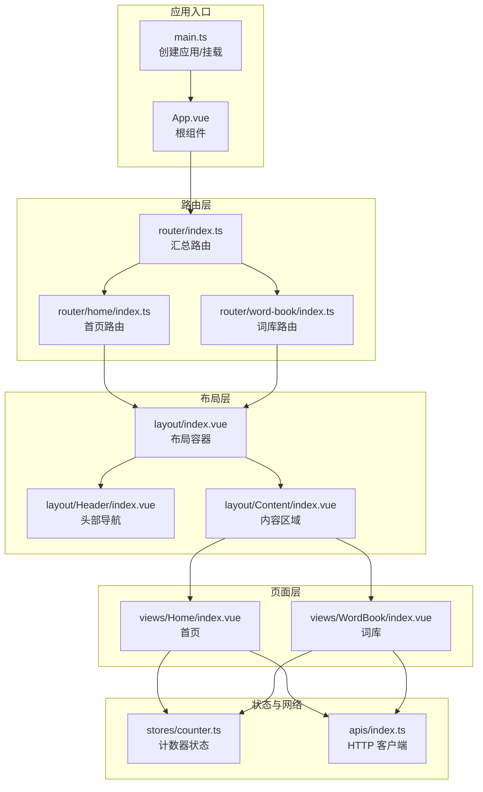
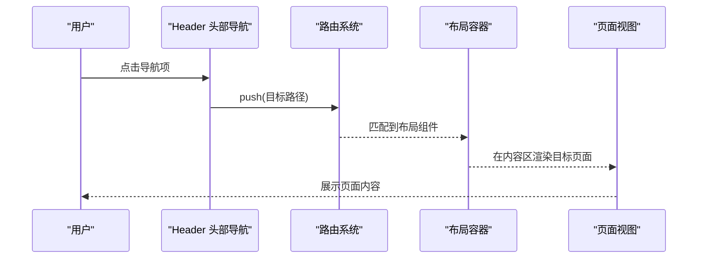
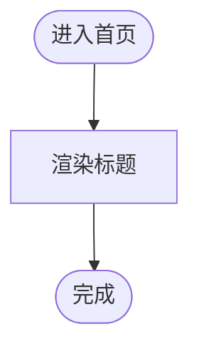
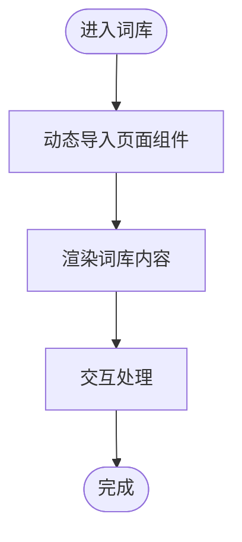
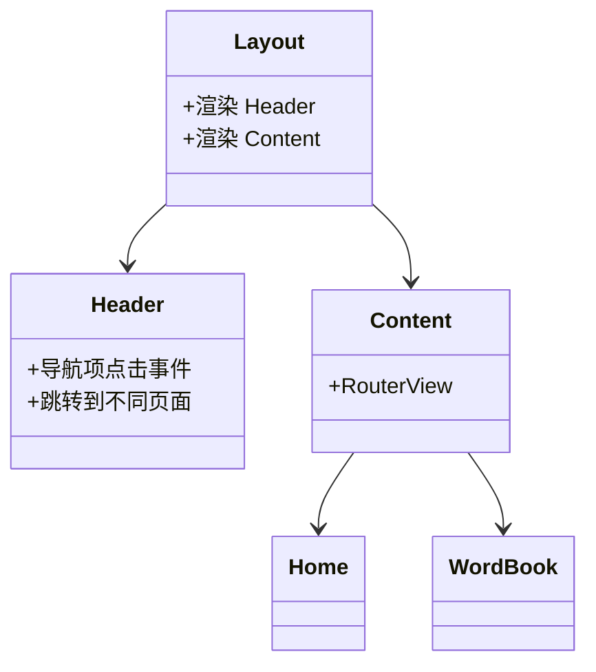
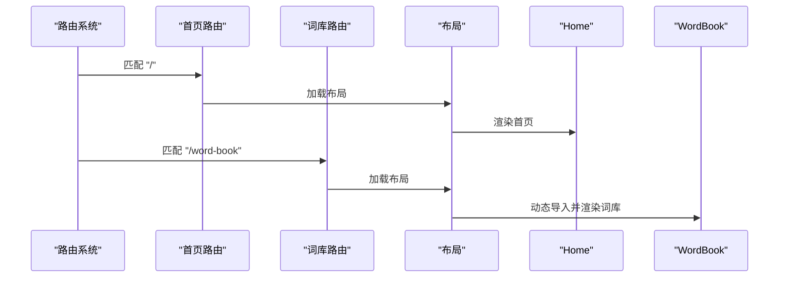
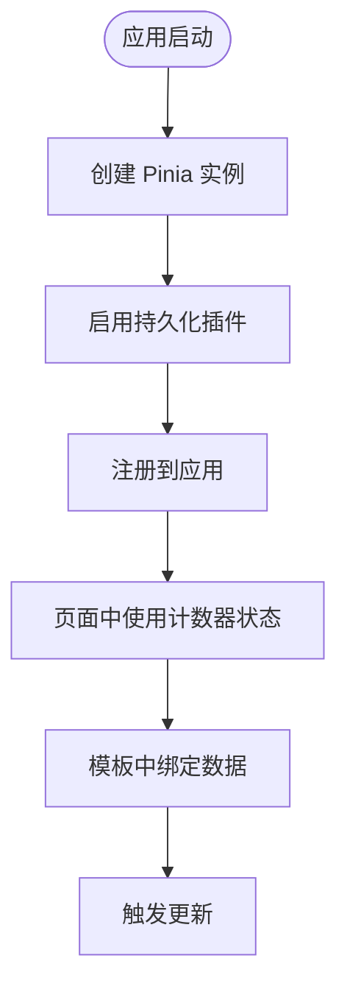
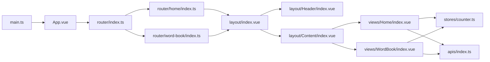

# 页面组件

<cite>
**本文引用的文件**
- [apps/web/src/views/Home/index.vue](file://apps/web/src/views/Home/index.vue)
- [apps/web/src/views/WordBook/index.vue](file://apps/web/src/views/WordBook/index.vue)
- [apps/web/src/layout/index.vue](file://apps/web/src/layout/index.vue)
- [apps/web/src/layout/Header/index.vue](file://apps/web/src/layout/Header/index.vue)
- [apps/web/src/layout/Content/index.vue](file://apps/web/src/layout/Content/index.vue)
- [apps/web/src/router/index.ts](file://apps/web/src/router/index.ts)
- [apps/web/src/router/home/index.ts](file://apps/web/src/router/home/index.ts)
- [apps/web/src/router/word-book/index.ts](file://apps/web/src/router/word-book/index.ts)
- [apps/web/src/stores/counter.ts](file://apps/web/src/stores/counter.ts)
- [apps/web/src/apis/index.ts](file://apps/web/src/apis/index.ts)
- [apps/web/src/main.ts](file://apps/web/src/main.ts)
- [apps/web/src/App.vue](file://apps/web/src/App.vue)
</cite>

## 目录
1. [简介](#简介)
2. [项目结构](#项目结构)
3. [核心组件](#核心组件)
4. [架构总览](#架构总览)
5. [详细组件分析](#详细组件分析)
6. [依赖分析](#依赖分析)
7. [性能考虑](#性能考虑)
8. [故障排查指南](#故障排查指南)
9. [结论](#结论)
10. [附录](#附录)

## 简介
本文件围绕页面组件展开，系统性梳理首页与词库页面的功能实现、内容展示与用户引导流程；深入解析路由配置、页面间导航跳转与参数传递；总结生命周期管理、状态初始化与数据绑定实践；给出性能优化策略（懒加载、缓存）、测试与调试方法以及扩展开发建议。由于当前仓库中的页面组件为最小可用实现，本文在“功能实现”部分以现有代码为基础进行解读，并在“扩展开发”部分提供可落地的改进建议。

## 项目结构
应用采用前端单页应用架构，页面组件位于 views 目录，路由由 router 组织，布局由 layout 提供，全局状态使用 Pinia，UI 框架为 Element Plus，网络请求通过 axios 封装的 api 实例完成。

图表来源
- [apps/web/src/main.ts:1-21](file://apps/web/src/main.ts#L1-L21)
- [apps/web/src/App.vue:1-11](file://apps/web/src/App.vue#L1-L11)
- [apps/web/src/router/index.ts:1-13](file://apps/web/src/router/index.ts#L1-L13)
- [apps/web/src/router/home/index.ts:1-12](file://apps/web/src/router/home/index.ts#L1-L12)
- [apps/web/src/router/word-book/index.ts:1-11](file://apps/web/src/router/word-book/index.ts#L1-L11)
- [apps/web/src/layout/index.vue:1-8](file://apps/web/src/layout/index.vue#L1-L8)
- [apps/web/src/layout/Header/index.vue:1-54](file://apps/web/src/layout/Header/index.vue#L1-L54)
- [apps/web/src/layout/Content/index.vue:1-7](file://apps/web/src/layout/Content/index.vue#L1-L7)
- [apps/web/src/views/Home/index.vue:1-7](file://apps/web/src/views/Home/index.vue#L1-L7)
- [apps/web/src/views/WordBook/index.vue:1-7](file://apps/web/src/views/WordBook/index.vue#L1-L7)
- [apps/web/src/stores/counter.ts:1-13](file://apps/web/src/stores/counter.ts#L1-L13)
- [apps/web/src/apis/index.ts:1-6](file://apps/web/src/apis/index.ts#L1-L6)

章节来源
- [apps/web/src/main.ts:1-21](file://apps/web/src/main.ts#L1-L21)
- [apps/web/src/App.vue:1-11](file://apps/web/src/App.vue#L1-L11)
- [apps/web/src/router/index.ts:1-13](file://apps/web/src/router/index.ts#L1-L13)

## 核心组件
- 首页组件：负责展示“首页”标题，作为用户进入后的默认页面。
- 词库页面组件：负责展示“词库”标题，承载后续词库数据加载与交互。
- 布局组件：统一头部导航与内容区域，提供页面级导航跳转能力。
- 路由配置：集中注册首页与词库路由，支持嵌套路由与懒加载。
- 全局状态：提供计数器示例，演示 Pinia 的状态管理与持久化。
- 网络封装：基于 axios 的 api 实例，统一基础地址与超时配置。

章节来源
- [apps/web/src/views/Home/index.vue:1-7](file://apps/web/src/views/Home/index.vue#L1-L7)
- [apps/web/src/views/WordBook/index.vue:1-7](file://apps/web/src/views/WordBook/index.vue#L1-L7)
- [apps/web/src/layout/index.vue:1-8](file://apps/web/src/layout/index.vue#L1-L8)
- [apps/web/src/layout/Header/index.vue:1-54](file://apps/web/src/layout/Header/index.vue#L1-L54)
- [apps/web/src/layout/Content/index.vue:1-7](file://apps/web/src/layout/Content/index.vue#L1-L7)
- [apps/web/src/router/index.ts:1-13](file://apps/web/src/router/index.ts#L1-L13)
- [apps/web/src/router/home/index.ts:1-12](file://apps/web/src/router/home/index.ts#L1-L12)
- [apps/web/src/router/word-book/index.ts:1-11](file://apps/web/src/router/word-book/index.ts#L1-L11)
- [apps/web/src/stores/counter.ts:1-13](file://apps/web/src/stores/counter.ts#L1-L13)
- [apps/web/src/apis/index.ts:1-6](file://apps/web/src/apis/index.ts#L1-L6)

## 架构总览
页面组件通过路由驱动，统一由布局容器承载。头部导航提供页面级跳转入口，内容区域通过 RouterView 渲染当前路由对应的视图。全局状态与网络实例在页面中按需引入与使用。

图表来源
- [apps/web/src/layout/Header/index.vue:8-23](file://apps/web/src/layout/Header/index.vue#L8-L23)
- [apps/web/src/router/index.ts:4-10](file://apps/web/src/router/index.ts#L4-L10)
- [apps/web/src/layout/Content/index.vue:1-7](file://apps/web/src/layout/Content/index.vue#L1-L7)

## 详细组件分析

### 首页组件（Home）
- 功能定位：作为默认入口页面，展示“首页”标题。
- 生命周期：当前实现为空脚本，未声明生命周期钩子。
- 数据绑定：无状态绑定，仅模板渲染。
- 用户引导：配合布局头部导航，用户可通过顶部导航快速回到首页。

图表来源
- [apps/web/src/views/Home/index.vue:1-7](file://apps/web/src/views/Home/index.vue#L1-L7)

章节来源
- [apps/web/src/views/Home/index.vue:1-7](file://apps/web/src/views/Home/index.vue#L1-L7)

### 词库页面组件（WordBook）
- 功能定位：承载词库相关展示与交互，当前为占位实现。
- 路由特性：采用动态导入实现懒加载，减少初始包体积。
- 生命周期：当前实现为空脚本，未声明生命周期钩子。
- 数据绑定：预留位置，后续可接入状态与 API。

图表来源
- [apps/web/src/router/word-book/index.ts:8](file://apps/web/src/router/word-book/index.ts#L8)
- [apps/web/src/views/WordBook/index.vue:1-7](file://apps/web/src/views/WordBook/index.vue#L1-L7)

章节来源
- [apps/web/src/views/WordBook/index.vue:1-7](file://apps/web/src/views/WordBook/index.vue#L1-L7)
- [apps/web/src/router/word-book/index.ts:1-11](file://apps/web/src/router/word-book/index.ts#L1-L11)

### 布局与导航（Layout & Header）
- 布局容器：组合 Header 与 Content，作为所有页面的外层容器。
- 头部导航：提供首页、AI、词库、课程、设置等导航入口，点击后通过路由跳转。
- 内容区域：通过 RouterView 渲染当前路由对应页面。

图表来源
- [apps/web/src/layout/index.vue:1-8](file://apps/web/src/layout/index.vue#L1-L8)
- [apps/web/src/layout/Header/index.vue:1-54](file://apps/web/src/layout/Header/index.vue#L1-L54)
- [apps/web/src/layout/Content/index.vue:1-7](file://apps/web/src/layout/Content/index.vue#L1-L7)
- [apps/web/src/views/Home/index.vue:1-7](file://apps/web/src/views/Home/index.vue#L1-L7)
- [apps/web/src/views/WordBook/index.vue:1-7](file://apps/web/src/views/WordBook/index.vue#L1-L7)

章节来源
- [apps/web/src/layout/index.vue:1-8](file://apps/web/src/layout/index.vue#L1-L8)
- [apps/web/src/layout/Header/index.vue:1-54](file://apps/web/src/layout/Header/index.vue#L1-L54)
- [apps/web/src/layout/Content/index.vue:1-7](file://apps/web/src/layout/Content/index.vue#L1-L7)

### 路由与导航跳转
- 路由汇总：在主路由中引入首页与词库路由配置。
- 首页路由：根路径映射到布局容器，子路由渲染 Home。
- 词库路由：路径为 /word-book，子路由采用动态导入渲染 WordBook。
- 导航守卫：当前未配置全局或局部守卫，如需鉴权可在相应路由节点添加前置守卫。

图表来源
- [apps/web/src/router/index.ts:1-13](file://apps/web/src/router/index.ts#L1-L13)
- [apps/web/src/router/home/index.ts:1-12](file://apps/web/src/router/home/index.ts#L1-L12)
- [apps/web/src/router/word-book/index.ts:1-11](file://apps/web/src/router/word-book/index.ts#L1-L11)

章节来源
- [apps/web/src/router/index.ts:1-13](file://apps/web/src/router/index.ts#L1-L13)
- [apps/web/src/router/home/index.ts:1-12](file://apps/web/src/router/home/index.ts#L1-L12)
- [apps/web/src/router/word-book/index.ts:1-11](file://apps/web/src/router/word-book/index.ts#L1-L11)

### 状态初始化与数据绑定
- 计数器状态：提供 count、doubleCount 与 increment，演示响应式状态与计算属性。
- Pinia 初始化：在 main.ts 中创建并注册 Pinia，启用持久化插件。
- 页面使用：可在页面中引入并使用计数器状态，实现数据绑定与交互。

图表来源
- [apps/web/src/main.ts:9-18](file://apps/web/src/main.ts#L9-L18)
- [apps/web/src/stores/counter.ts:1-13](file://apps/web/src/stores/counter.ts#L1-L13)

章节来源
- [apps/web/src/stores/counter.ts:1-13](file://apps/web/src/stores/counter.ts#L1-L13)
- [apps/web/src/main.ts:9-18](file://apps/web/src/main.ts#L9-L18)

### 错误处理与调试
- Axios 配置：提供基础地址与超时时间，便于统一错误处理与重试策略。
- 调试建议：结合浏览器开发者工具检查网络请求、路由切换与状态变化；在页面中增加日志输出定位问题。

章节来源
- [apps/web/src/apis/index.ts:1-6](file://apps/web/src/apis/index.ts#L1-L6)

## 依赖分析
- 应用入口依赖：main.ts 依赖 App.vue、路由与 Pinia；App.vue 依赖 RouterView。
- 路由依赖：router/index.ts 依赖 home 与 word-book 子路由；子路由依赖布局与页面组件。
- 布局依赖：layout/index.vue 依赖 Header 与 Content；Content 依赖 RouterView。
- 页面依赖：Home 与 WordBook 依赖布局与状态/API（按需引入）。

图表来源
- [apps/web/src/main.ts:1-21](file://apps/web/src/main.ts#L1-L21)
- [apps/web/src/App.vue:1-11](file://apps/web/src/App.vue#L1-L11)
- [apps/web/src/router/index.ts:1-13](file://apps/web/src/router/index.ts#L1-L13)
- [apps/web/src/router/home/index.ts:1-12](file://apps/web/src/router/home/index.ts#L1-L12)
- [apps/web/src/router/word-book/index.ts:1-11](file://apps/web/src/router/word-book/index.ts#L1-L11)
- [apps/web/src/layout/index.vue:1-8](file://apps/web/src/layout/index.vue#L1-L8)
- [apps/web/src/layout/Header/index.vue:1-54](file://apps/web/src/layout/Header/index.vue#L1-L54)
- [apps/web/src/layout/Content/index.vue:1-7](file://apps/web/src/layout/Content/index.vue#L1-L7)
- [apps/web/src/views/Home/index.vue:1-7](file://apps/web/src/views/Home/index.vue#L1-L7)
- [apps/web/src/views/WordBook/index.vue:1-7](file://apps/web/src/views/WordBook/index.vue#L1-L7)
- [apps/web/src/stores/counter.ts:1-13](file://apps/web/src/stores/counter.ts#L1-L13)
- [apps/web/src/apis/index.ts:1-6](file://apps/web/src/apis/index.ts#L1-L6)

章节来源
- [apps/web/src/main.ts:1-21](file://apps/web/src/main.ts#L1-L21)
- [apps/web/src/router/index.ts:1-13](file://apps/web/src/router/index.ts#L1-L13)

## 性能考虑
- 懒加载：词库页面已采用动态导入实现懒加载，降低首屏资源压力。
- 路由级别：可进一步在路由层对需要权限的页面增加前置守卫，避免无效渲染。
- 状态持久化：Pinia 已启用持久化插件，适合保存用户偏好与轻量状态。
- 缓存策略：可在 API 层引入缓存（如内存缓存或浏览器缓存），减少重复请求。
- 图片与静态资源：头部头像等静态资源建议使用 CDN 或本地优化，提升加载速度。

章节来源
- [apps/web/src/router/word-book/index.ts:8](file://apps/web/src/router/word-book/index.ts#L8)
- [apps/web/src/main.ts:9-13](file://apps/web/src/main.ts#L9-L13)

## 故障排查指南
- 路由不生效：检查路由路径是否正确、是否被正确引入到主路由配置中。
- 页面空白：确认布局容器是否正确渲染，RouterView 是否存在。
- 导航失效：检查头部导航的路由跳转路径与路由配置是否一致。
- 状态异常：确认 Pinia 实例已注册且持久化插件已启用。
- 网络请求失败：检查 api 实例的基础地址与超时配置，结合浏览器网络面板定位问题。

章节来源
- [apps/web/src/layout/Header/index.vue:8-23](file://apps/web/src/layout/Header/index.vue#L8-L23)
- [apps/web/src/router/index.ts:4-10](file://apps/web/src/router/index.ts#L4-L10)
- [apps/web/src/main.ts:9-18](file://apps/web/src/main.ts#L9-L18)
- [apps/web/src/apis/index.ts:1-6](file://apps/web/src/apis/index.ts#L1-L6)

## 结论
当前页面组件以最小实现为主，具备清晰的路由与布局结构。建议在后续迭代中完善页面业务逻辑（如词库的数据加载与交互）、增强状态管理与缓存策略、补充路由守卫与权限控制，并逐步引入测试与调试工具链，以提升用户体验与工程化水平。

## 附录
- 扩展开发建议
  - 词库页面：引入分页、搜索、收藏等交互；对接后端 API 获取词库数据；使用状态管理维护筛选条件与缓存。
  - 首页页面：增加学习进度、推荐内容等引导信息；与用户状态联动。
  - 路由守卫：在需要鉴权的页面添加前置守卫，未登录用户跳转至登录页。
  - 测试：为页面组件编写单元测试与集成测试，覆盖路由跳转、状态变更与错误场景。
  - 调试：在开发环境开启严格模式与日志输出，结合浏览器调试工具定位问题。
  - 自定义配置：通过环境变量与配置中心管理 API 地址、功能开关与主题样式。