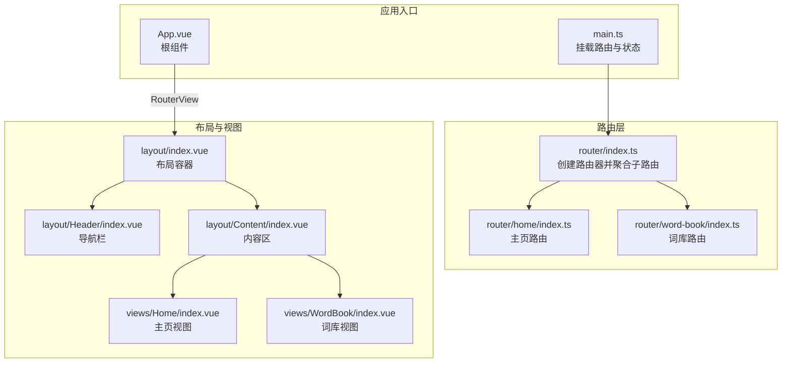
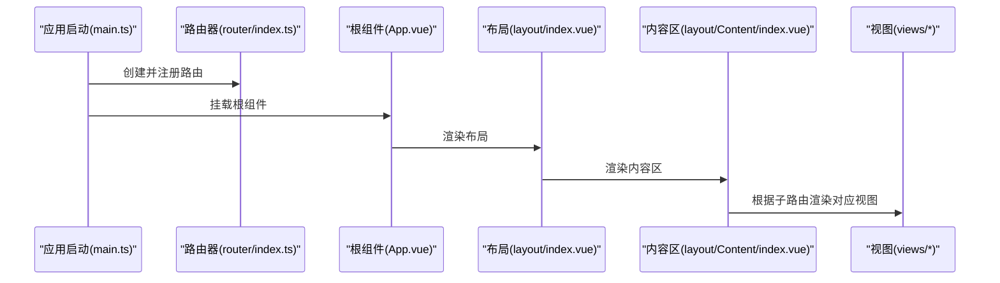
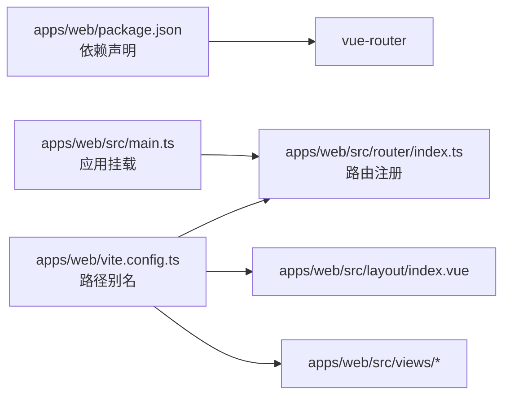

# 路由系统

<cite>
**本文引用的文件**
- [apps/web/src/router/index.ts](file://apps/web/src/router/index.ts)
- [apps/web/src/router/home/index.ts](file://apps/web/src/router/home/index.ts)
- [apps/web/src/router/word-book/index.ts](file://apps/web/src/router/word-book/index.ts)
- [apps/web/src/main.ts](file://apps/web/src/main.ts)
- [apps/web/src/App.vue](file://apps/web/src/App.vue)
- [apps/web/src/layout/index.vue](file://apps/web/src/layout/index.vue)
- [apps/web/src/layout/Header/index.vue](file://apps/web/src/layout/Header/index.vue)
- [apps/web/src/layout/Content/index.vue](file://apps/web/src/layout/Content/index.vue)
- [apps/web/src/views/Home/index.vue](file://apps/web/src/views/Home/index.vue)
- [apps/web/src/views/WordBook/index.vue](file://apps/web/src/views/WordBook/index.vue)
- [apps/web/package.json](file://apps/web/package.json)
- [apps/web/vite.config.ts](file://apps/web/vite.config.ts)
</cite>

## 目录
1. [简介](#简介)
2. [项目结构](#项目结构)
3. [核心组件](#核心组件)
4. [架构总览](#架构总览)
5. [详细组件分析](#详细组件分析)
6. [依赖分析](#依赖分析)
7. [性能考虑](#性能考虑)
8. [故障排查指南](#故障排查指南)
9. [结论](#结论)
10. [附录](#附录)

## 简介
本文件系统性梳理并说明前端 Web 应用的路由体系，覆盖 Vue Router 的配置策略、嵌套路由与布局、动态导入（懒加载）与代码分割、导航机制与跳转技巧、历史记录管理、错误处理策略，以及在当前仓库中的实际实现与可扩展的最佳实践。重点围绕主页与词库页面的路由定义、参数传递与动态匹配、路由元信息与权限控制的落地方式展开。

## 项目结构
应用采用按功能域拆分的路由组织方式：主应用通过根路由聚合各模块路由；每个模块（如主页、词库）独立维护自身路由表，并在根路由中统一注入。布局层通过嵌套路由承载公共头部与内容区域，视图层负责具体页面渲染。

图表来源
- [apps/web/src/main.ts:1-21](file://apps/web/src/main.ts#L1-L21)
- [apps/web/src/router/index.ts:1-13](file://apps/web/src/router/index.ts#L1-L13)
- [apps/web/src/router/home/index.ts:1-12](file://apps/web/src/router/home/index.ts#L1-L12)
- [apps/web/src/router/word-book/index.ts:1-11](file://apps/web/src/router/word-book/index.ts#L1-L11)
- [apps/web/src/layout/index.vue:1-8](file://apps/web/src/layout/index.vue#L1-L8)
- [apps/web/src/layout/Header/index.vue](file://apps/web/src/layout/Header/index.vue)
- [apps/web/src/layout/Content/index.vue](file://apps/web/src/layout/Content/index.vue)
- [apps/web/src/views/Home/index.vue:1-7](file://apps/web/src/views/Home/index.vue#L1-L7)
- [apps/web/src/views/WordBook/index.vue:1-7](file://apps/web/src/views/WordBook/index.vue#L1-L7)

章节来源
- [apps/web/src/main.ts:1-21](file://apps/web/src/main.ts#L1-L21)
- [apps/web/src/router/index.ts:1-13](file://apps/web/src/router/index.ts#L1-L13)
- [apps/web/src/router/home/index.ts:1-12](file://apps/web/src/router/home/index.ts#L1-L12)
- [apps/web/src/router/word-book/index.ts:1-11](file://apps/web/src/router/word-book/index.ts#L1-L11)
- [apps/web/src/layout/index.vue:1-8](file://apps/web/src/layout/index.vue#L1-L8)
- [apps/web/src/App.vue:1-11](file://apps/web/src/App.vue#L1-L11)

## 核心组件
- 路由器创建与历史模式
  - 使用基于浏览器历史的路由模式，并通过环境变量设置基础路径，确保生产部署时的正确解析。
  - 路由聚合：根路由将主页与词库模块路由表展开注入，形成统一的路由注册。
- 嵌套路由与布局
  - 主页与词库均采用嵌套路由：父级为布局组件，子级为具体视图。布局组件内含头部与内容区，内容区通过 RouterView 渲染子路由视图。
- 动态导入与懒加载
  - 词库视图采用函数式动态导入，实现按需加载与代码分割，降低首屏体积。
- 导航与跳转
  - 头部导航通过编程式导航进行页面跳转，支持相对路径与绝对路径的组合使用。

章节来源
- [apps/web/src/router/index.ts:1-13](file://apps/web/src/router/index.ts#L1-L13)
- [apps/web/src/router/home/index.ts:1-12](file://apps/web/src/router/home/index.ts#L1-L12)
- [apps/web/src/router/word-book/index.ts:1-11](file://apps/web/src/router/word-book/index.ts#L1-L11)
- [apps/web/src/layout/index.vue:1-8](file://apps/web/src/layout/index.vue#L1-L8)
- [apps/web/src/layout/Header/index.vue](file://apps/web/src/layout/Header/index.vue)
- [apps/web/src/layout/Content/index.vue](file://apps/web/src/layout/Content/index.vue)

## 架构总览
下图展示了从应用启动到页面渲染的关键流程：入口挂载路由，根组件通过 RouterView 渲染当前路由对应视图；布局组件承载头部与内容区，内容区根据子路由决定渲染哪个视图。

图表来源
- [apps/web/src/main.ts:1-21](file://apps/web/src/main.ts#L1-L21)
- [apps/web/src/router/index.ts:1-13](file://apps/web/src/router/index.ts#L1-L13)
- [apps/web/src/App.vue:1-11](file://apps/web/src/App.vue#L1-L11)
- [apps/web/src/layout/index.vue:1-8](file://apps/web/src/layout/index.vue#L1-L8)
- [apps/web/src/layout/Content/index.vue](file://apps/web/src/layout/Content/index.vue)

## 详细组件分析

### 路由器与根路由
- 路由器创建
  - 基于浏览器历史模式创建路由器，并传入基础路径。
  - 将主页与词库模块路由表展开注入，形成统一的路由集合。
- 历史模式与基础路径
  - 基于环境变量设置基础路径，便于多环境部署与静态资源路径解析。

章节来源
- [apps/web/src/router/index.ts:1-13](file://apps/web/src/router/index.ts#L1-L13)

### 主页路由
- 路由定义
  - 根路径映射至布局组件，子路由为空路径映射至主页视图，形成默认首页。
- 嵌套路由
  - 布局组件作为父级容器，内容区通过 RouterView 渲染子路由视图。
- 视图渲染
  - 主页视图负责展示首页内容。

章节来源
- [apps/web/src/router/home/index.ts:1-12](file://apps/web/src/router/home/index.ts#L1-L12)
- [apps/web/src/layout/index.vue:1-8](file://apps/web/src/layout/index.vue#L1-L8)
- [apps/web/src/layout/Content/index.vue](file://apps/web/src/layout/Content/index.vue)
- [apps/web/src/views/Home/index.vue:1-7](file://apps/web/src/views/Home/index.vue#L1-L7)

### 词库路由
- 路由定义
  - 词库父路由指向布局组件，子路由使用动态导入加载词库视图，实现懒加载与代码分割。
- 动态导入
  - 子路由组件通过函数式导入，仅在访问该子路由时才加载对应模块。
- 视图渲染
  - 内容区根据子路由匹配渲染词库视图。

章节来源
- [apps/web/src/router/word-book/index.ts:1-11](file://apps/web/src/router/word-book/index.ts#L1-L11)
- [apps/web/src/layout/index.vue:1-8](file://apps/web/src/layout/index.vue#L1-L8)
- [apps/web/src/layout/Content/index.vue](file://apps/web/src/layout/Content/index.vue)
- [apps/web/src/views/WordBook/index.vue:1-7](file://apps/web/src/views/WordBook/index.vue#L1-L7)

### 导航与跳转
- 编程式导航
  - 头部导航通过编程式导航进行页面跳转，支持不同路径的跳转操作。
- 路由跳转技巧
  - 支持绝对路径与相对路径的组合使用，便于在嵌套路由场景下进行精准跳转。
- 历史记录管理
  - 使用浏览器历史 API 进行前进/后退等操作，保持良好的用户体验。

章节来源
- [apps/web/src/layout/Header/index.vue](file://apps/web/src/layout/Header/index.vue)
- [apps/web/src/layout/Content/index.vue](file://apps/web/src/layout/Content/index.vue)

### 路由懒加载与代码分割
- 实现方式
  - 词库视图采用动态导入，配合打包工具自动进行代码分割，减少首屏加载体积。
- 性能收益
  - 首屏仅加载必要模块，其他页面按需加载，提升初始渲染速度与内存占用表现。

章节来源
- [apps/web/src/router/word-book/index.ts:8](file://apps/web/src/router/word-book/index.ts#L8)
- [apps/web/package.json:28](file://apps/web/package.json#L28)

### 路由元信息与权限控制
- 元信息使用
  - 可在路由配置中添加元信息字段，用于标识页面类型、标题、权限要求等。
- 权限控制策略
  - 在导航守卫中读取元信息，结合用户状态进行权限判断，未授权则重定向或拒绝访问。
- 建议实现位置
  - 在根路由或模块路由中统一声明元信息，在全局前置守卫中集中处理权限逻辑。

[本节为概念性指导，不直接分析具体文件，故无“章节来源”]

### 参数传递与动态路由匹配
- 动态路由
  - 通过路径参数或查询参数向目标页面传递数据，适合详情页、筛选页等场景。
- 参数校验
  - 在目标视图或路由守卫中对参数进行校验，确保数据有效性与安全性。
- 嵌套路由中的参数
  - 在嵌套路由中，父级与子级可共享或隔离参数，需明确参数作用域与传递路径。

[本节为概念性指导，不直接分析具体文件，故无“章节来源”]

### 错误处理策略
- 路由级别错误
  - 通过全局异常捕获与错误边界组件，统一处理路由加载失败、参数错误等情况。
- 用户体验
  - 提供友好的错误提示与返回上一页的按钮，避免用户陷入空白页。
- 日志与监控
  - 记录路由错误日志，结合监控系统定位问题根因。

[本节为概念性指导，不直接分析具体文件，故无“章节来源”]

## 依赖分析
- 路由相关依赖
  - Vue Router 版本与项目版本兼容，确保路由功能稳定。
- 打包与别名
  - Vite 配置了路径别名，便于在路由与组件中使用统一的模块路径前缀。
- 应用挂载
  - 应用在入口处统一注册路由与状态管理，保证运行时上下文一致。

图表来源
- [apps/web/package.json:28](file://apps/web/package.json#L28)
- [apps/web/src/main.ts:1-21](file://apps/web/src/main.ts#L1-L21)
- [apps/web/src/router/index.ts:1-13](file://apps/web/src/router/index.ts#L1-L13)
- [apps/web/vite.config.ts:19-23](file://apps/web/vite.config.ts#L19-L23)

章节来源
- [apps/web/package.json:1-45](file://apps/web/package.json#L1-L45)
- [apps/web/src/main.ts:1-21](file://apps/web/src/main.ts#L1-L21)
- [apps/web/vite.config.ts:1-25](file://apps/web/vite.config.ts#L1-L25)

## 性能考虑
- 懒加载与代码分割
  - 对非首屏页面采用动态导入，减少初始包体大小，提升首屏渲染速度。
- 路由预加载
  - 对关键页面或用户可能回退的页面进行预加载，平衡首屏与后续交互性能。
- 路由缓存
  - 结合 keep-alive 或路由缓存策略，避免重复渲染带来的性能损耗。
- 路由层级优化
  - 合理设计嵌套路由层级，避免过深的层级导致渲染链路冗长。

[本节提供通用建议，不直接分析具体文件，故无“章节来源”]

## 故障排查指南
- 路由无法匹配
  - 检查路径是否与路由定义一致，注意大小写与末尾斜杠差异。
- 嵌套路由不显示
  - 确认父级布局组件中存在 RouterView，且子路由路径与布局匹配。
- 动态导入失败
  - 检查模块路径是否正确，确认打包工具已启用动态导入支持。
- 导航跳转异常
  - 核对编程式导航的目标路径，确保与路由定义一致。
- 历史记录异常
  - 检查浏览器历史栈状态，避免重复 push 导致的历史混乱。

[本节提供通用建议，不直接分析具体文件，故无“章节来源”]

## 结论
当前路由系统以模块化方式组织主页与词库路由，采用嵌套路由与布局容器实现清晰的页面结构；词库视图通过动态导入实现懒加载与代码分割，有助于优化首屏性能。建议在此基础上引入路由元信息与导航守卫，完善权限控制与错误处理机制，并结合预加载与缓存策略进一步提升性能与稳定性。

## 附录
- 实际配置示例与最佳实践
  - 在根路由中统一聚合模块路由，保持路由表简洁可维护。
  - 对非首屏页面使用动态导入，结合路由元信息实现权限控制。
  - 在布局容器中统一处理导航与面包屑，减少重复逻辑。
  - 使用编程式导航与命名路由，提升跳转的可读性与可维护性。

[本节为总结性内容，不直接分析具体文件，故无“章节来源”]