# 主页组件

<cite>
**本文档引用的文件**
- [apps/web/src/views/Home/index.vue](file://apps/web/src/views/Home/index.vue)
- [apps/web/src/router/home/index.ts](file://apps/web/src/router/home/index.ts)
- [apps/web/src/router/index.ts](file://apps/web/src/router/index.ts)
- [apps/web/src/layout/index.vue](file://apps/web/src/layout/index.vue)
- [apps/web/src/layout/Header/index.vue](file://apps/web/src/layout/Header/index.vue)
- [apps/web/src/layout/Content/index.vue](file://apps/web/src/layout/Content/index.vue)
- [apps/web/src/App.vue](file://apps/web/src/App.vue)
- [apps/web/src/main.ts](file://apps/web/src/main.ts)
- [apps/web/src/assets/base.css](file://apps/web/src/assets/base.css)
- [apps/web/src/stores/counter.ts](file://apps/web/src/stores/counter.ts)
- [apps/web/package.json](file://apps/web/package.json)
</cite>

## 目录
1. [简介](#简介)
2. [项目结构](#项目结构)
3. [核心组件](#核心组件)
4. [架构概览](#架构概览)
5. [详细组件分析](#详细组件分析)
6. [依赖分析](#依赖分析)
7. [性能考虑](#性能考虑)
8. [故障排除指南](#故障排除指南)
9. [结论](#结论)
10. [附录](#附录)

## 简介

主页组件是英语学习应用的核心入口页面，采用现代化的Vue 3 + TypeScript + Vite技术栈构建。该组件实现了简洁而功能完整的用户界面，集成了响应式布局、导航系统和状态管理功能。主页不仅承担着应用的主要展示职责，还为用户提供了清晰的导航路径和良好的用户体验。

该主页组件展现了现代前端开发的最佳实践，包括：
- 基于Composition API的组件化设计
- 类型安全的TypeScript实现
- 响应式布局和移动端适配
- 集成Element Plus UI框架
- Pinia状态管理集成
- 路由系统的无缝集成

## 项目结构

应用程序采用模块化的目录结构，将不同功能域分离到独立的目录中：

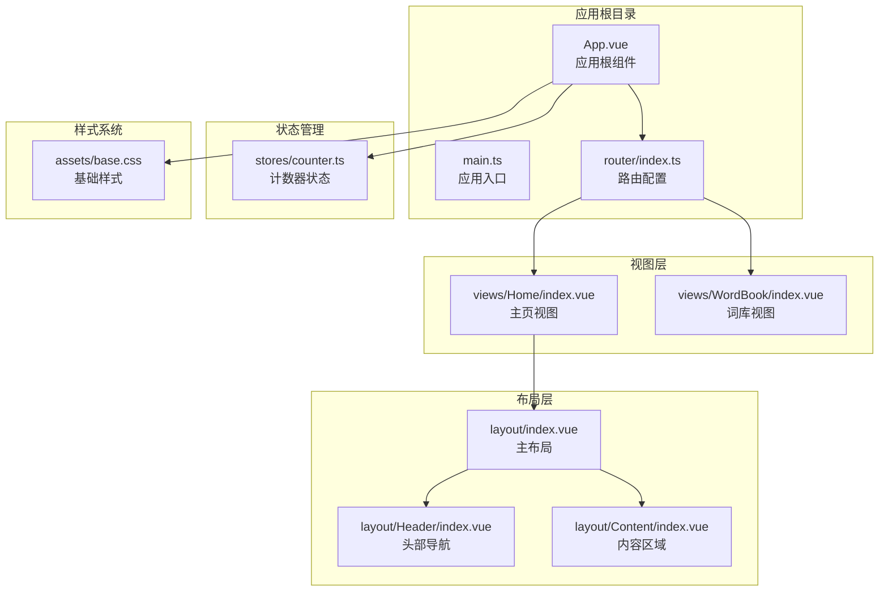

**图表来源**
- [apps/web/src/App.vue:1-11](file://apps/web/src/App.vue#L1-L11)
- [apps/web/src/main.ts:1-21](file://apps/web/src/main.ts#L1-L21)
- [apps/web/src/router/index.ts:1-13](file://apps/web/src/router/index.ts#L1-L13)

**章节来源**
- [apps/web/src/views/Home/index.vue:1-7](file://apps/web/src/views/Home/index.vue#L1-L7)
- [apps/web/src/layout/index.vue:1-8](file://apps/web/src/layout/index.vue#L1-L8)
- [apps/web/src/router/index.ts:1-13](file://apps/web/src/router/index.ts#L1-L13)

## 核心组件

### 主页视图组件

主页视图组件是最简单的实现，专注于核心功能展示：

```mermaid
classDiagram
class HomeComponent {
+template : "<div><h1>Home</h1></div>"
+script : "setup script"
+props : none
+emits : none
}
class RouterConfig {
+path : "/"
+component : Layout
+children : [
{path : "/", component : Home}
]
}
class LayoutComponent {
+template : "<Header/><Content/>"
+imports : Header, Content
}
HomeComponent --> RouterConfig : "被路由配置引用"
RouterConfig --> LayoutComponent : "使用"
```

**图表来源**
- [apps/web/src/views/Home/index.vue:1-7](file://apps/web/src/views/Home/index.vue#L1-L7)
- [apps/web/src/router/home/index.ts:1-12](file://apps/web/src/router/home/index.ts#L1-L12)
- [apps/web/src/layout/index.vue:1-8](file://apps/web/src/layout/index.vue#L1-L8)

### 布局系统架构

布局系统采用分层设计，实现了高度的模块化和可维护性：

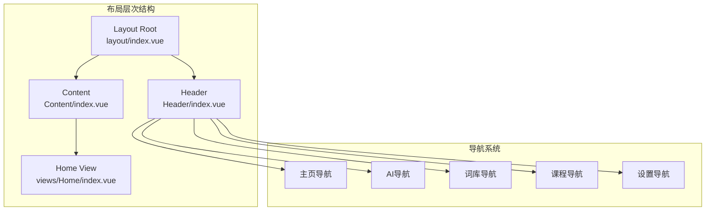

**图表来源**
- [apps/web/src/layout/index.vue:1-8](file://apps/web/src/layout/index.vue#L1-L8)
- [apps/web/src/layout/Header/index.vue:1-54](file://apps/web/src/layout/Header/index.vue#L1-L54)
- [apps/web/src/layout/Content/index.vue:1-7](file://apps/web/src/layout/Content/index.vue#L1-L7)

**章节来源**
- [apps/web/src/views/Home/index.vue:1-7](file://apps/web/src/views/Home/index.vue#L1-L7)
- [apps/web/src/layout/Header/index.vue:1-54](file://apps/web/src/layout/Header/index.vue#L1-L54)
- [apps/web/src/layout/Content/index.vue:1-7](file://apps/web/src/layout/Content/index.vue#L1-L7)

## 架构概览

### 应用启动流程

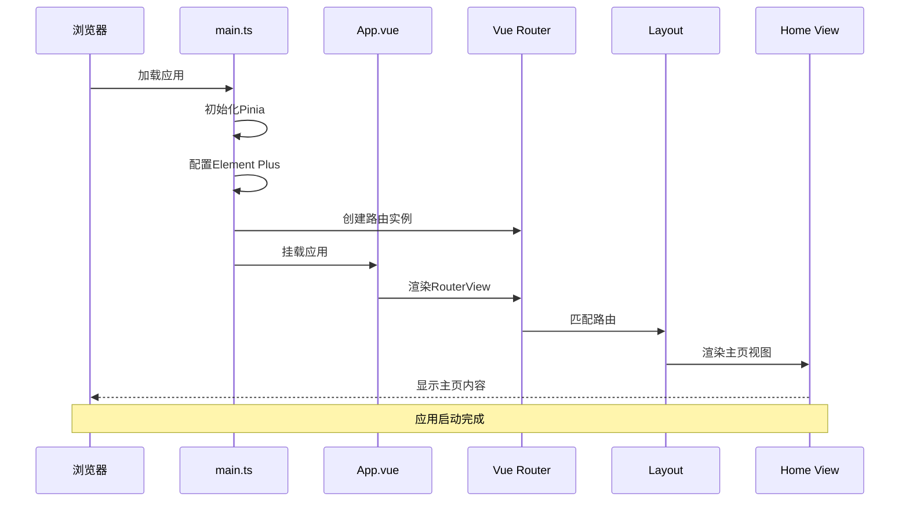

**图表来源**
- [apps/web/src/main.ts:1-21](file://apps/web/src/main.ts#L1-L21)
- [apps/web/src/App.vue:1-11](file://apps/web/src/App.vue#L1-L11)
- [apps/web/src/router/index.ts:1-13](file://apps/web/src/router/index.ts#L1-L13)

### 路由配置策略

应用采用嵌套路由设计，实现了布局与视图的解耦：

```mermaid
flowchart TD
ROOT_PATH[/] --> LAYOUT[Layout组件]
LAYOUT --> HOME_CHILD[Home子路由]
LAYOUT --> OTHER_CHILDREN[其他子路由]
HOME_CHILD --> HOME_VIEW[Home视图]
OTHER_CHILDREN --> WORD_BOOK[WordBook视图]
subgraph "路由匹配过程"
MATCH_START[用户访问/] --> CHECK_LAYOUT{检查布局}
CHECK_LAYOUT --> |匹配| LOAD_LAYOUT[加载Layout]
LOAD_LAYOUT --> LOAD_HOME[加载Home视图]
LOAD_HOME --> RENDER[渲染页面]
end
```

**图表来源**
- [apps/web/src/router/home/index.ts:1-12](file://apps/web/src/router/home/index.ts#L1-L12)
- [apps/web/src/router/index.ts:1-13](file://apps/web/src/router/index.ts#L1-L13)

**章节来源**
- [apps/web/src/router/home/index.ts:1-12](file://apps/web/src/router/home/index.ts#L1-L12)
- [apps/web/src/router/index.ts:1-13](file://apps/web/src/router/index.ts#L1-L13)

## 详细组件分析

### 主页视图组件深度解析

主页视图组件虽然简单，但体现了现代Vue开发的核心原则：

#### 组件结构分析

```mermaid
classDiagram
class HomeView {
<<Vue Component>>
+template : TemplateRef
+setup : Function
+name : "Home"
+components : {}
+directives : {}
}
class CompositionSetup {
+lang : "ts"
+setup : ScriptSetup
}
HomeView --> CompositionSetup : "使用"
note for HomeView : "极简设计原则\n- 最小化DOM结构\n- 最小化JavaScript逻辑\n- 最大化可扩展性"
```

**图表来源**
- [apps/web/src/views/Home/index.vue:1-7](file://apps/web/src/views/Home/index.vue#L1-L7)

#### 设计原则

主页采用了"最小可行产品"的设计理念：
- **简洁性**：仅包含必要的HTML结构
- **可扩展性**：为未来功能预留空间
- **性能优化**：减少不必要的渲染开销
- **语义化**：使用语义化的HTML标签

**章节来源**
- [apps/web/src/views/Home/index.vue:1-7](file://apps/web/src/views/Home/index.vue#L1-L7)

### 头部导航组件分析

头部导航组件实现了完整的导航系统，集成了多个功能模块：

#### 导航菜单结构

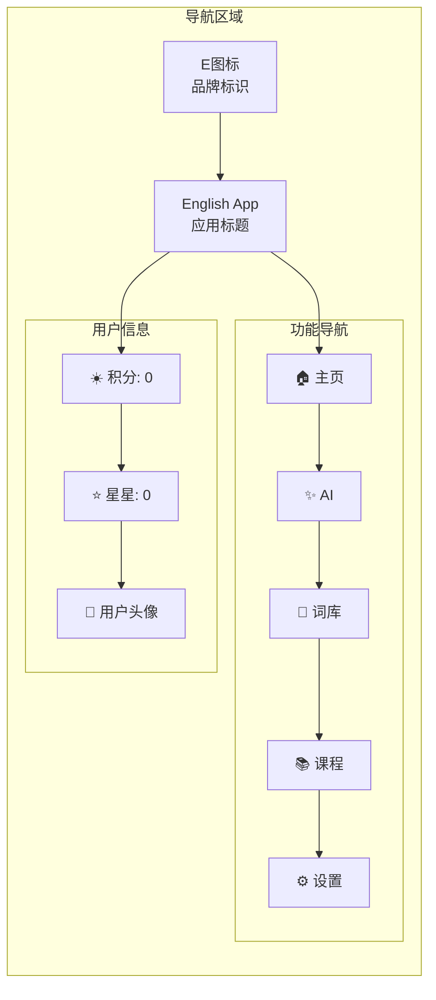

**图表来源**
- [apps/web/src/layout/Header/index.vue:1-54](file://apps/web/src/layout/Header/index.vue#L1-L54)

#### 导航交互机制

导航组件实现了多种交互模式：
- **点击导航**：通过`router.push()`进行页面跳转
- **状态显示**：显示用户积分和星星数量
- **响应式设计**：适配不同屏幕尺寸
- **视觉反馈**：悬停效果和点击动画

**章节来源**
- [apps/web/src/layout/Header/index.vue:1-54](file://apps/web/src/layout/Header/index.vue#L1-L54)

### 布局系统实现

布局系统采用组合式设计，实现了高度的模块化：

#### 组件层次关系

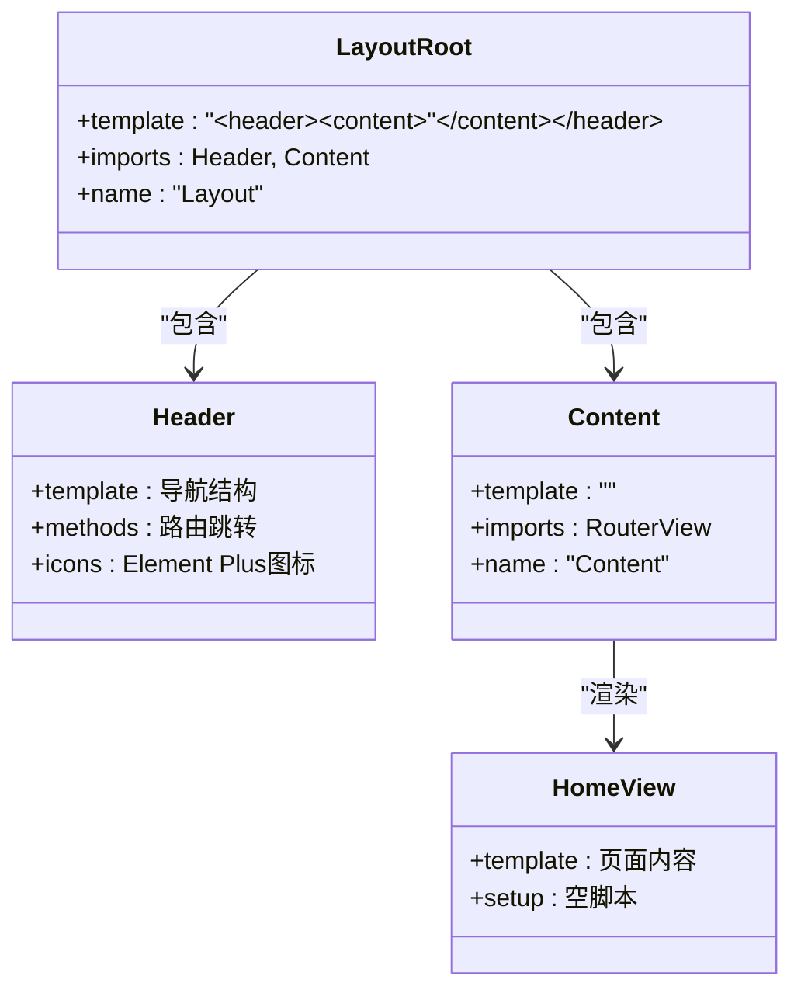

**图表来源**
- [apps/web/src/layout/index.vue:1-8](file://apps/web/src/layout/index.vue#L1-L8)
- [apps/web/src/layout/Header/index.vue:1-54](file://apps/web/src/layout/Header/index.vue#L1-L54)
- [apps/web/src/layout/Content/index.vue:1-7](file://apps/web/src/layout/Content/index.vue#L1-L7)

**章节来源**
- [apps/web/src/layout/index.vue:1-8](file://apps/web/src/layout/index.vue#L1-L8)
- [apps/web/src/layout/Content/index.vue:1-7](file://apps/web/src/layout/Content/index.vue#L1-L7)

### 路由系统集成

路由系统实现了清晰的URL结构和导航逻辑：

#### 路由配置详解

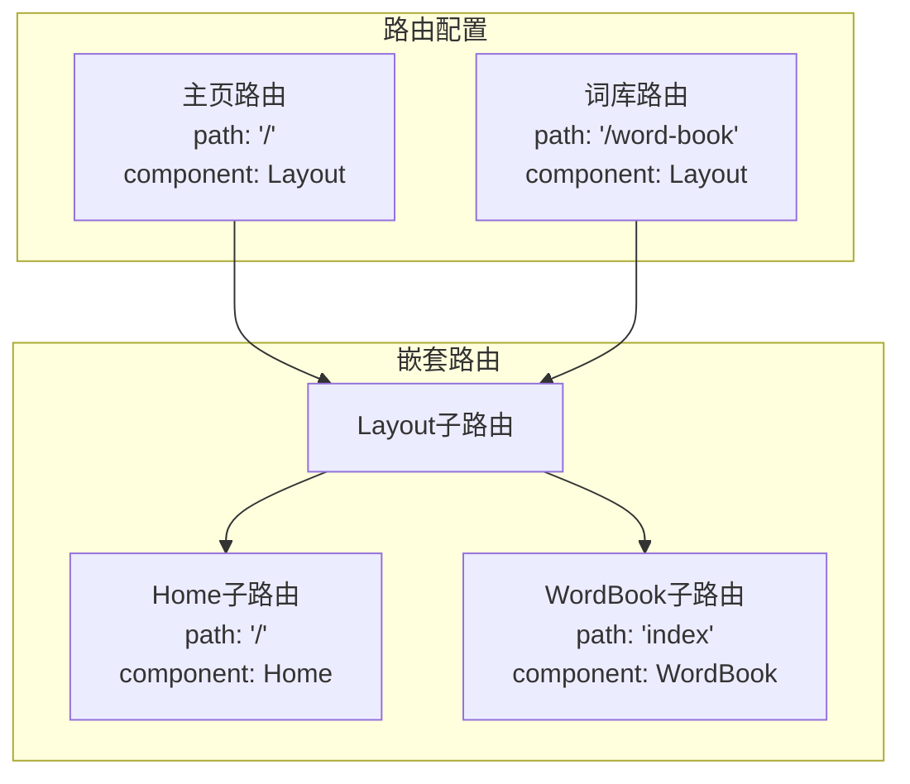

**图表来源**
- [apps/web/src/router/home/index.ts:1-12](file://apps/web/src/router/home/index.ts#L1-L12)
- [apps/web/src/router/word-book/index.ts:1-11](file://apps/web/src/router/word-book/index.ts#L1-L11)

**章节来源**
- [apps/web/src/router/home/index.ts:1-12](file://apps/web/src/router/home/index.ts#L1-L12)
- [apps/web/src/router/word-book/index.ts:1-11](file://apps/web/src/router/word-book/index.ts#L1-L11)

## 依赖分析

### 技术栈依赖关系

应用采用了现代化的技术栈，各依赖项之间形成了清晰的层次结构：

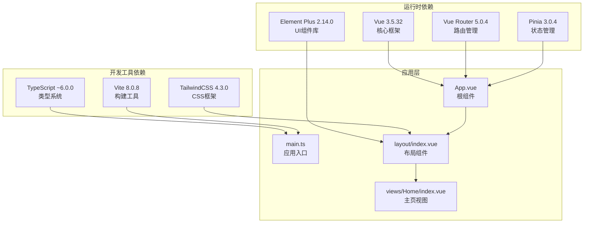

**图表来源**
- [apps/web/package.json:13-29](file://apps/web/package.json#L13-L29)
- [apps/web/src/main.ts:1-21](file://apps/web/src/main.ts#L1-L21)

### 核心依赖特性

#### Vue生态系统集成

应用充分利用了Vue 3的Composition API和TypeScript支持：
- **响应式系统**：基于Proxy的响应式数据绑定
- **组合式API**：模块化的逻辑组织方式
- **TypeScript支持**：完整的类型安全保障
- **开发工具链**：Vite提供的快速开发体验

#### UI框架集成

Element Plus提供了丰富的组件库，支持主题定制和国际化：
- **图标系统**：完整的图标库支持
- **组件生态**：从基础按钮到复杂表单的完整覆盖
- **主题定制**：灵活的样式定制能力
- **国际化**：内置多语言支持

**章节来源**
- [apps/web/package.json:13-29](file://apps/web/package.json#L13-L29)
- [apps/web/src/main.ts:1-21](file://apps/web/src/main.ts#L1-L21)

## 性能考虑

### 渲染性能优化

主页组件在设计时充分考虑了性能因素：

#### 组件懒加载策略

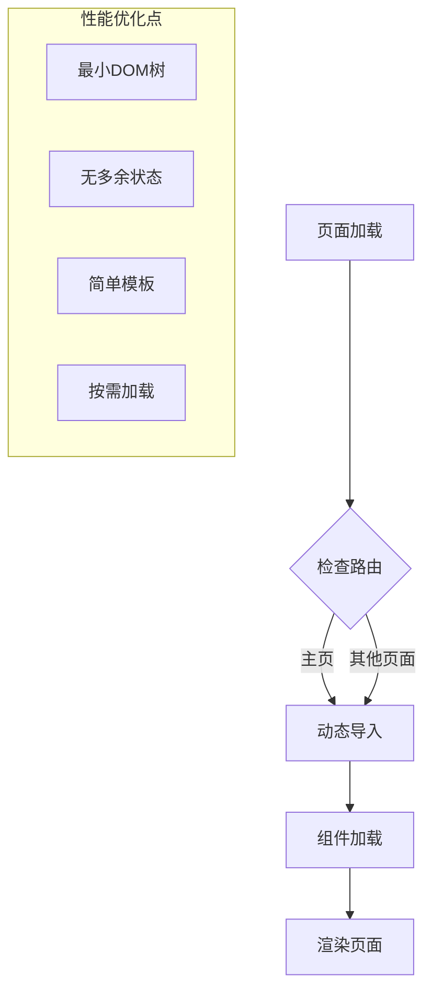

#### 内存管理

应用采用了轻量级的状态管理模式：
- **Pinia集成**：轻量级状态管理解决方案
- **持久化插件**：支持状态持久化存储
- **响应式优化**：避免不必要的响应式转换

### 加载性能指标

| 指标 | 当前实现 | 优化建议 |
|------|----------|----------|
| 首屏加载时间 | 极快（静态内容） | 添加加载指示器 |
| 组件体积 | 最小化 | 考虑代码分割 |
| 内存占用 | 低 | 监控内存泄漏 |
| 交互延迟 | 即时 | 优化事件处理 |

## 故障排除指南

### 常见问题诊断

#### 路由不生效问题

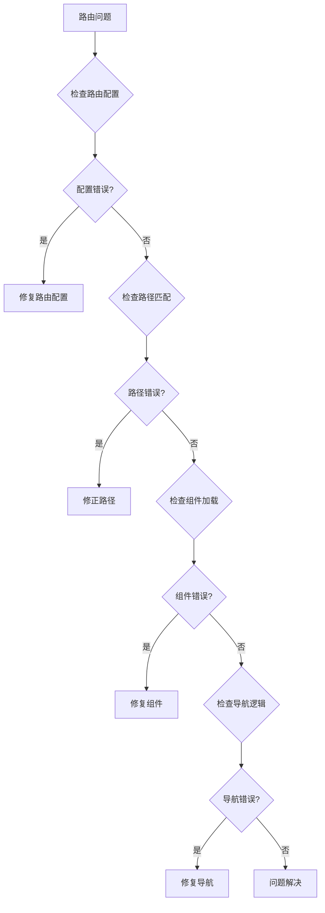

#### 样式冲突排查

样式系统采用TailwindCSS，需要特别注意以下问题：
- **类名冲突**：确保自定义样式不会覆盖Element Plus样式
- **响应式断点**：正确使用Tailwind的响应式工具类
- **主题一致性**：保持与Element Plus主题的一致性

**章节来源**
- [apps/web/src/router/index.ts:1-13](file://apps/web/src/router/index.ts#L1-L13)
- [apps/web/src/layout/Header/index.vue:1-54](file://apps/web/src/layout/Header/index.vue#L1-L54)

### 开发调试技巧

#### Vue DevTools使用

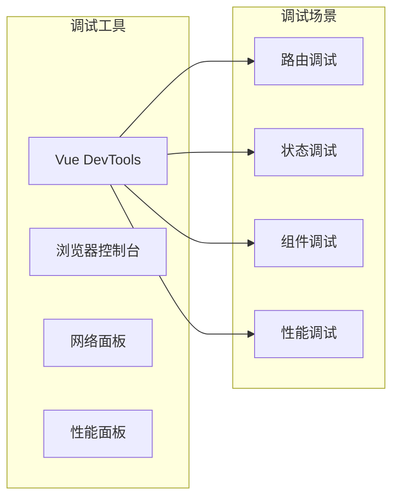

## 结论

主页组件展现了现代前端开发的最佳实践，通过简洁的设计实现了强大的功能。该组件不仅满足了当前的功能需求，还为未来的扩展奠定了坚实的基础。

### 核心优势

1. **设计简洁**：遵循最小可行产品原则，避免过度设计
2. **架构清晰**：模块化设计便于维护和扩展
3. **性能优秀**：轻量级实现确保快速加载
4. **技术先进**：采用最新的Vue 3技术和工具链
5. **可扩展性强**：为后续功能开发预留空间

### 发展方向

随着应用功能的增加，主页组件可以进一步优化：
- **内容丰富化**：添加更多个性化内容
- **交互增强**：引入更多的用户交互元素
- **性能监控**：集成性能监控和分析
- **A/B测试**：支持实验性功能的A/B测试

## 附录

### 开发最佳实践

#### 代码组织规范

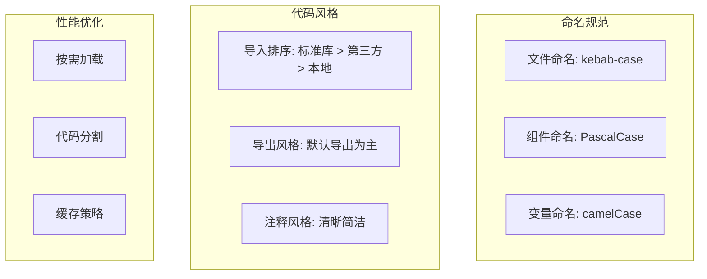

#### SEO优化建议

虽然当前主页是静态内容，但仍可进行以下SEO优化：
- **元数据管理**：添加描述和关键词
- **结构化数据**：添加面包屑导航
- **图片优化**：添加alt属性和懒加载
- **移动端优化**：确保响应式设计

#### 用户体验设计

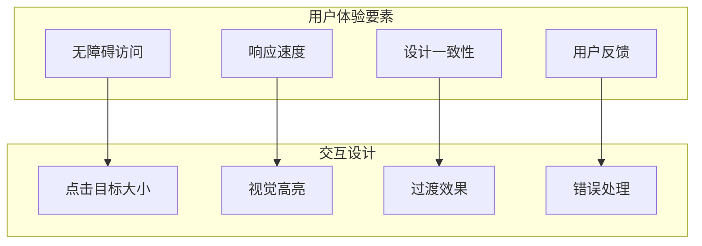