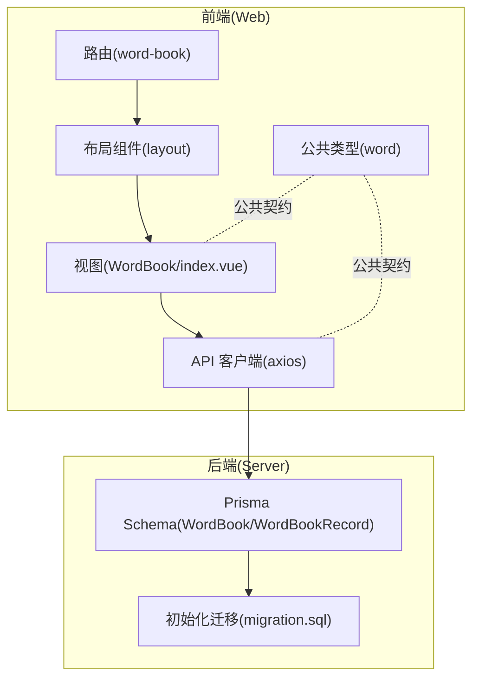
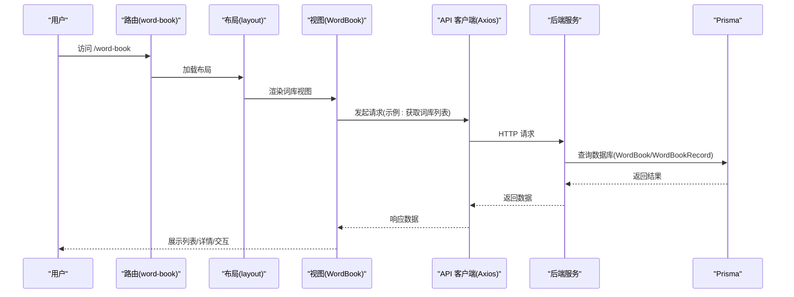
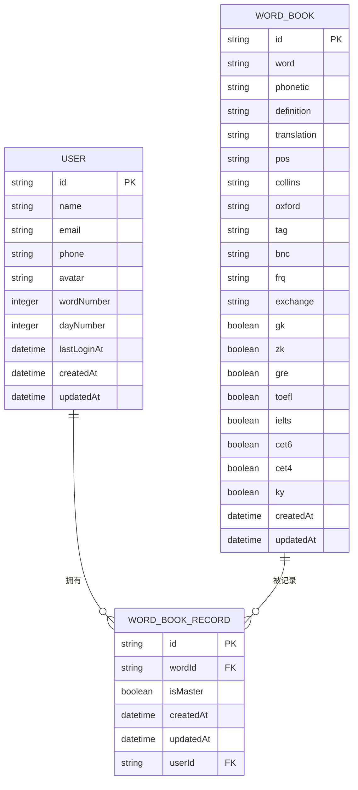
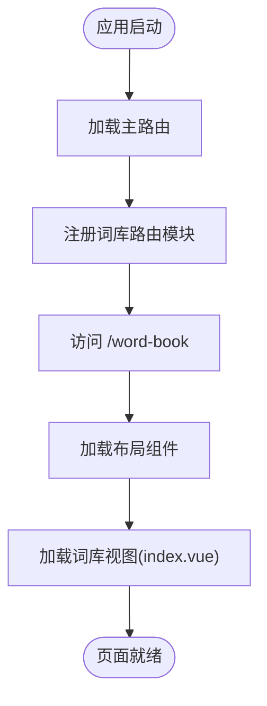
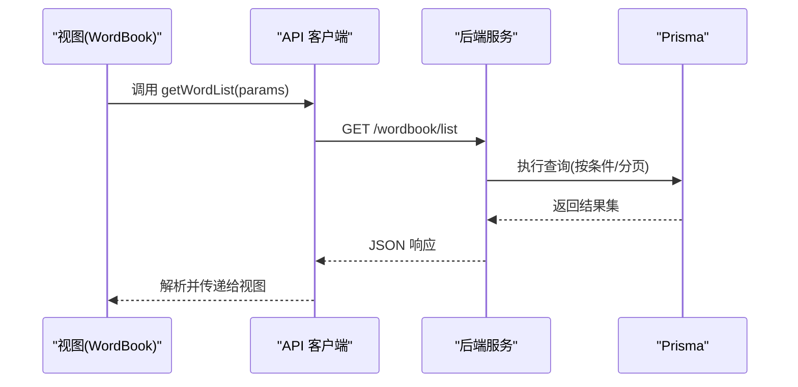
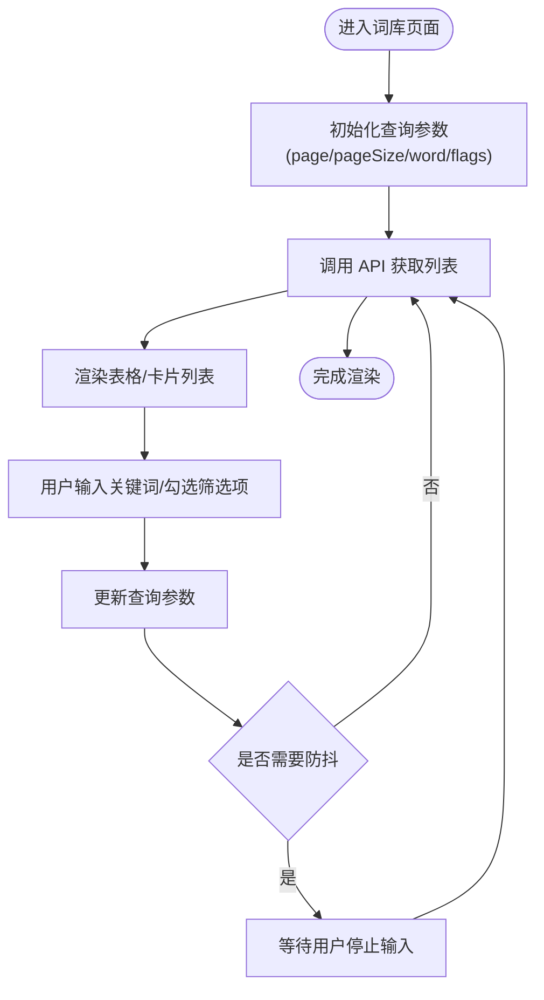
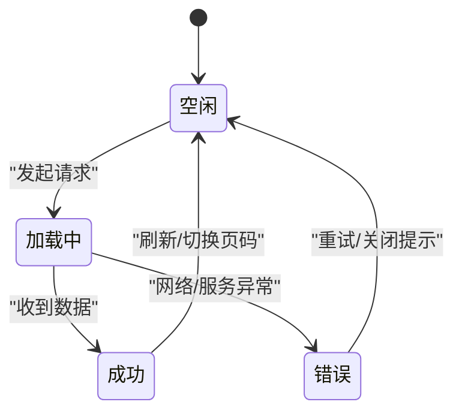
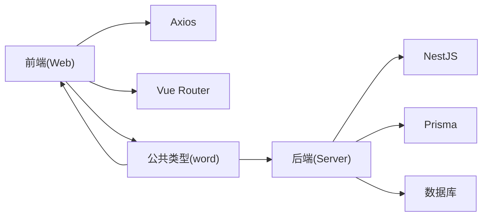

# 词库页面

<cite>
**本文引用的文件**
- [apps/web/src/views/WordBook/index.vue](file://apps/web/src/views/WordBook/index.vue)
- [apps/web/src/router/word-book/index.ts](file://apps/web/src/router/word-book/index.ts)
- [apps/web/src/router/index.ts](file://apps/web/src/router/index.ts)
- [apps/web/src/apis/index.ts](file://apps/web/src/apis/index.ts)
- [packages/common/word/index.ts](file://packages/common/word/index.ts)
- [server/prisma/schema.prisma](file://server/prisma/schema.prisma)
- [server/prisma/migrations/20260513053954_init/migration.sql](file://server/prisma/migrations/20260513053954_init/migration.sql)
</cite>

## 目录
1. [简介](#简介)
2. [项目结构](#项目结构)
3. [核心组件](#核心组件)
4. [架构总览](#架构总览)
5. [详细组件分析](#详细组件分析)
6. [依赖关系分析](#依赖关系分析)
7. [性能考虑](#性能考虑)
8. [故障排查指南](#故障排查指南)
9. [结论](#结论)
10. [附录](#附录)

## 简介
本文件围绕“词库页面”的功能实现、数据结构、列表渲染与搜索过滤、状态管理、API 集成与数据同步、组件设计与响应式布局、用户体验优化、扩展开发与性能优化、错误处理以及实际实现案例与开发规范进行系统化说明。当前前端页面为占位模板，后端数据库模型已定义，API 基础配置已完成，但具体业务接口尚未在前端实现。

## 项目结构
词库页面位于 Web 前端应用中，采用 Vue 3 + TypeScript + Vite 技术栈；路由通过嵌套路由挂载到布局组件下；API 使用 Axios 进行统一配置；公共类型定义位于 packages/common 下；后端使用 Prisma 管理数据库，包含词库与用户关联记录。

**图表来源**
- [apps/web/src/router/word-book/index.ts:1-11](file://apps/web/src/router/word-book/index.ts#L1-L11)
- [apps/web/src/router/index.ts:1-12](file://apps/web/src/router/index.ts#L1-L12)
- [apps/web/src/views/WordBook/index.vue:1-7](file://apps/web/src/views/WordBook/index.vue#L1-L7)
- [apps/web/src/apis/index.ts:1-6](file://apps/web/src/apis/index.ts#L1-L6)
- [packages/common/word/index.ts:1-44](file://packages/common/word/index.ts#L1-L44)
- [server/prisma/schema.prisma:43-86](file://server/prisma/schema.prisma#L43-L86)
- [server/prisma/migrations/20260513053954_init/migration.sql:1-141](file://server/prisma/migrations/20260513053954_init/migration.sql#L1-L141)

**章节来源**
- [apps/web/src/router/word-book/index.ts:1-11](file://apps/web/src/router/word-book/index.ts#L1-L11)
- [apps/web/src/router/index.ts:1-12](file://apps/web/src/router/index.ts#L1-L12)
- [apps/web/src/views/WordBook/index.vue:1-7](file://apps/web/src/views/WordBook/index.vue#L1-L7)
- [apps/web/src/apis/index.ts:1-6](file://apps/web/src/apis/index.ts#L1-L6)
- [packages/common/word/index.ts:1-44](file://packages/common/word/index.ts#L1-L44)
- [server/prisma/schema.prisma:43-86](file://server/prisma/schema.prisma#L43-L86)
- [server/prisma/migrations/20260513053954_init/migration.sql:1-141](file://server/prisma/migrations/20260513053954_init/migration.sql#L1-L141)

## 核心组件
- 视图组件：词库页面视图文件负责承载页面内容与交互逻辑（当前为占位模板）。
- 路由模块：定义词库页面的嵌套路由并挂载到布局组件。
- API 客户端：基于 Axios 的统一实例，配置基础地址与超时等参数。
- 类型定义：公共的单词与查询参数类型，确保前后端契约一致。

**章节来源**
- [apps/web/src/views/WordBook/index.vue:1-7](file://apps/web/src/views/WordBook/index.vue#L1-L7)
- [apps/web/src/router/word-book/index.ts:1-11](file://apps/web/src/router/word-book/index.ts#L1-L11)
- [apps/web/src/apis/index.ts:1-6](file://apps/web/src/apis/index.ts#L1-L6)
- [packages/common/word/index.ts:1-44](file://packages/common/word/index.ts#L1-L44)

## 架构总览
词库页面采用“前端单页应用 + 后端 API + 数据库”的分层架构。前端通过路由进入布局组件，再加载词库视图；视图通过 API 客户端调用后端接口；后端使用 Prisma 管理数据库，包含词库表与用户记录表，二者通过外键关联。

**图表来源**
- [apps/web/src/router/word-book/index.ts:1-11](file://apps/web/src/router/word-book/index.ts#L1-L11)
- [apps/web/src/views/WordBook/index.vue:1-7](file://apps/web/src/views/WordBook/index.vue#L1-L7)
- [apps/web/src/apis/index.ts:1-6](file://apps/web/src/apis/index.ts#L1-L6)
- [server/prisma/schema.prisma:43-86](file://server/prisma/schema.prisma#L43-L86)

## 详细组件分析

### 数据模型与类型定义
- 单词实体：包含单词、音标、释义、翻译、词性、标签、频率、各类考试标记、创建/更新时间等字段。
- 列表返回：包含列表与总数，便于分页与统计。
- 查询参数：支持分页、关键词与多类考试标记筛选。

**图表来源**
- [server/prisma/schema.prisma:43-86](file://server/prisma/schema.prisma#L43-L86)
- [server/prisma/migrations/20260513053954_init/migration.sql:22-141](file://server/prisma/migrations/20260513053954_init/migration.sql#L22-L141)
- [packages/common/word/index.ts:1-44](file://packages/common/word/index.ts#L1-L44)

**章节来源**
- [packages/common/word/index.ts:1-44](file://packages/common/word/index.ts#L1-L44)
- [server/prisma/schema.prisma:43-86](file://server/prisma/schema.prisma#L43-L86)
- [server/prisma/migrations/20260513053954_init/migration.sql:22-141](file://server/prisma/migrations/20260513053954_init/migration.sql#L22-L141)

### 路由与页面入口
- 路由注册：在主路由中引入词库路由模块，设置嵌套路由并指向词库视图组件。
- 页面挂载：词库视图作为子路由组件被布局组件加载。

**图表来源**
- [apps/web/src/router/index.ts:1-12](file://apps/web/src/router/index.ts#L1-L12)
- [apps/web/src/router/word-book/index.ts:1-11](file://apps/web/src/router/word-book/index.ts#L1-L11)

**章节来源**
- [apps/web/src/router/index.ts:1-12](file://apps/web/src/router/index.ts#L1-L12)
- [apps/web/src/router/word-book/index.ts:1-11](file://apps/web/src/router/word-book/index.ts#L1-L11)

### API 客户端与集成
- Axios 实例：统一配置基础地址与超时，便于后续扩展拦截器与错误处理。
- 集成点：前端视图通过该客户端发起请求，后端提供相应接口（当前前端尚未实现具体调用）。

**图表来源**
- [apps/web/src/apis/index.ts:1-6](file://apps/web/src/apis/index.ts#L1-L6)
- [server/prisma/schema.prisma:43-86](file://server/prisma/schema.prisma#L43-L86)

**章节来源**
- [apps/web/src/apis/index.ts:1-6](file://apps/web/src/apis/index.ts#L1-L6)

### 列表渲染与搜索过滤
- 列表渲染：根据后端返回的列表与总数进行分页渲染。
- 搜索过滤：支持关键词与多维度筛选（如 gk/zk/gre/toefl 等），前端可将查询参数封装为对象传入 API。

**图表来源**
- [packages/common/word/index.ts:32-44](file://packages/common/word/index.ts#L32-L44)

**章节来源**
- [packages/common/word/index.ts:26-44](file://packages/common/word/index.ts#L26-L44)

### 状态管理与数据同步
- 前端状态：建议使用组合式 API 或状态库管理查询参数、列表数据、加载状态与错误状态。
- 后端同步：通过 Prisma 的关系查询与唯一索引保证用户与单词记录的一致性与去重。

**图表来源**
- [apps/web/src/views/WordBook/index.vue:1-7](file://apps/web/src/views/WordBook/index.vue#L1-L7)
- [apps/web/src/apis/index.ts:1-6](file://apps/web/src/apis/index.ts#L1-L6)
- [server/prisma/schema.prisma:43-86](file://server/prisma/schema.prisma#L43-L86)

**章节来源**
- [apps/web/src/views/WordBook/index.vue:1-7](file://apps/web/src/views/WordBook/index.vue#L1-L7)
- [apps/web/src/apis/index.ts:1-6](file://apps/web/src/apis/index.ts#L1-L6)
- [server/prisma/schema.prisma:43-86](file://server/prisma/schema.prisma#L43-L86)

### 组件设计与响应式布局
- 结构设计：采用卡片或表格形式展示单词信息，支持折叠/展开详情。
- 响应式：在视图层结合 CSS 媒体查询与弹性布局，适配移动端与桌面端。
- 可访问性：为关键元素提供语义化标签与键盘导航支持。

（本节为概念性指导，不直接分析具体文件）

### 用户体验优化
- 首屏加载：骨架屏或占位符提升感知速度。
- 交互反馈：加载态、空态、错误态明确提示。
- 搜索体验：自动补全、高亮匹配、历史记录与清空按钮。

（本节为概念性指导，不直接分析具体文件）

### 扩展开发与开发规范
- 接口扩展：新增字段或筛选维度时，同步更新类型定义与查询参数。
- 前后端契约：统一命名与数据格式，避免重复映射。
- 日志与监控：在 API 层添加请求日志与错误上报。

（本节为概念性指导，不直接分析具体文件）

## 依赖关系分析
- 前端依赖：Vue 路由、Axios、TypeScript 类型。
- 后端依赖：NestJS、Prisma、数据库驱动。
- 公共依赖：类型定义包，确保前后端一致性。

**图表来源**
- [apps/web/src/router/index.ts:1-12](file://apps/web/src/router/index.ts#L1-L12)
- [apps/web/src/apis/index.ts:1-6](file://apps/web/src/apis/index.ts#L1-L6)
- [packages/common/word/index.ts:1-44](file://packages/common/word/index.ts#L1-L44)
- [server/prisma/schema.prisma:43-86](file://server/prisma/schema.prisma#L43-L86)

**章节来源**
- [apps/web/src/router/index.ts:1-12](file://apps/web/src/router/index.ts#L1-L12)
- [apps/web/src/apis/index.ts:1-6](file://apps/web/src/apis/index.ts#L1-L6)
- [packages/common/word/index.ts:1-44](file://packages/common/word/index.ts#L1-L44)
- [server/prisma/schema.prisma:43-86](file://server/prisma/schema.prisma#L43-L86)

## 性能考虑
- 列表渲染：虚拟滚动或分页加载，避免一次性渲染大量节点。
- 网络请求：请求合并、缓存策略、防抖与节流。
- 数据库：合理使用索引（如单词与标签索引），避免 N+1 查询。
- 资源优化：图片懒加载、字体预加载、CSS/JS 分割与压缩。

（本节为通用指导，不直接分析具体文件）

## 故障排查指南
- 网络错误：检查 API 基础地址与跨域配置，确认后端服务运行状态。
- 数据不一致：核对 Prisma 关系与唯一约束，确保用户与单词记录的唯一性。
- 类型不匹配：前后端类型定义需保持一致，避免字段缺失或类型转换异常。
- 路由无法访问：确认路由注册顺序与路径拼写，检查嵌套路由是否正确挂载。

**章节来源**
- [apps/web/src/apis/index.ts:1-6](file://apps/web/src/apis/index.ts#L1-L6)
- [server/prisma/schema.prisma:43-86](file://server/prisma/schema.prisma#L43-L86)
- [server/prisma/migrations/20260513053954_init/migration.sql:113-141](file://server/prisma/migrations/20260513053954_init/migration.sql#L113-L141)

## 结论
词库页面当前处于基础占位阶段，路由与 API 客户端已就绪，数据库模型完备。下一步应在视图中实现列表渲染、搜索过滤与状态管理，并完善 API 接口与错误处理，最终达成稳定、高效且易维护的词库功能。

## 附录
- 开发步骤建议
  - 补充视图组件的模板与交互逻辑
  - 实现查询参数与分页状态管理
  - 编写 API 调用与数据解析
  - 添加加载态、空态与错误态
  - 优化性能与用户体验
  - 编写单元测试与集成测试

（本节为概念性指导，不直接分析具体文件）