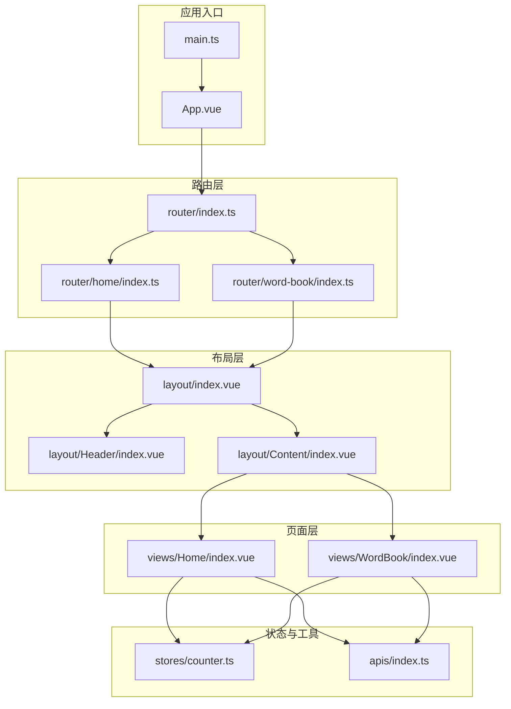
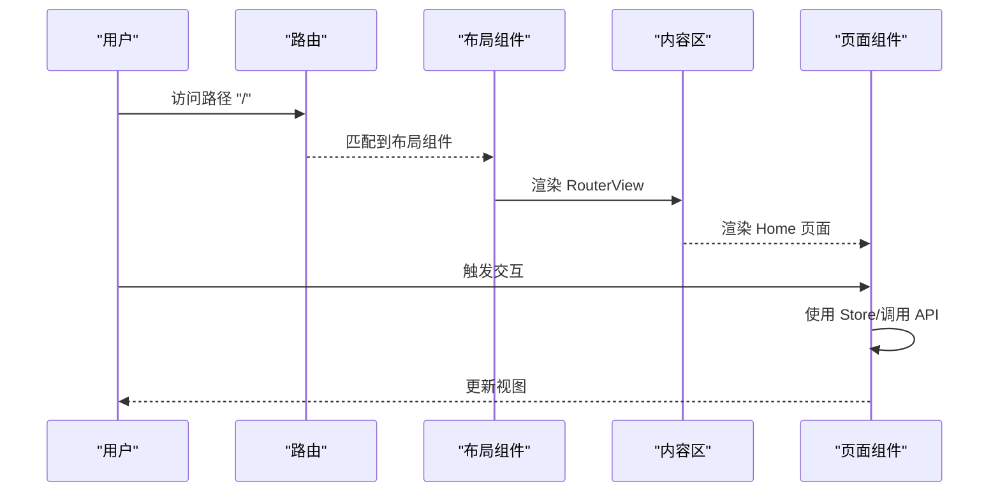
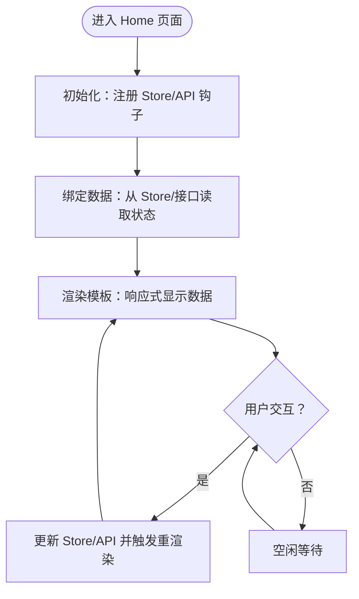
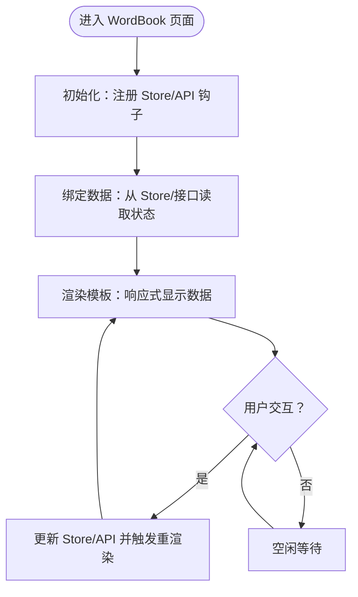
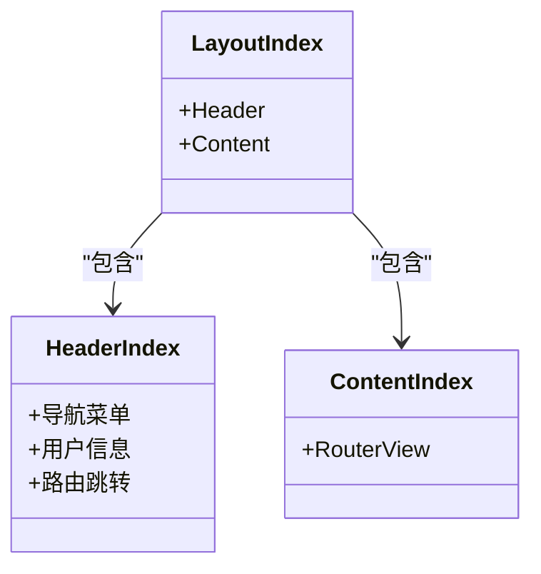
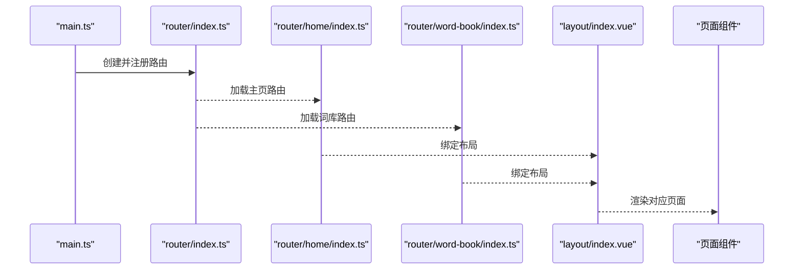
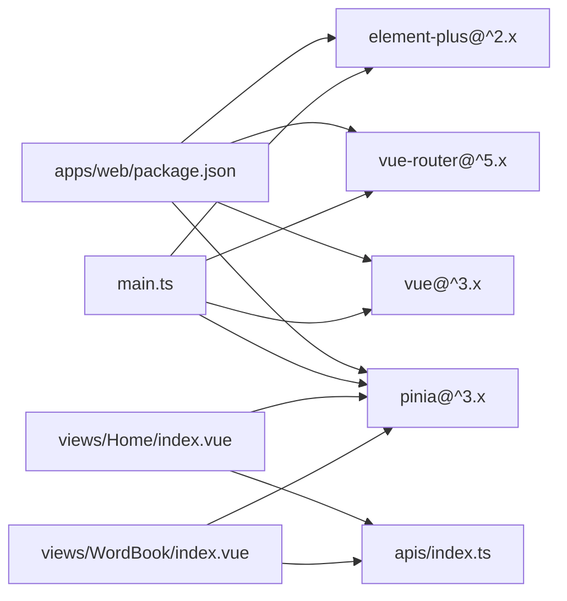

# 页面组件

<cite>
**本文引用的文件**
- [apps/web/src/views/Home/index.vue](file://apps/web/src/views/Home/index.vue)
- [apps/web/src/views/WordBook/index.vue](file://apps/web/src/views/WordBook/index.vue)
- [apps/web/src/layout/index.vue](file://apps/web/src/layout/index.vue)
- [apps/web/src/layout/Header/index.vue](file://apps/web/src/layout/Header/index.vue)
- [apps/web/src/layout/Content/index.vue](file://apps/web/src/layout/Content/index.vue)
- [apps/web/src/router/home/index.ts](file://apps/web/src/router/home/index.ts)
- [apps/web/src/router/word-book/index.ts](file://apps/web/src/router/word-book/index.ts)
- [apps/web/src/router/index.ts](file://apps/web/src/router/index.ts)
- [apps/web/src/App.vue](file://apps/web/src/App.vue)
- [apps/web/src/main.ts](file://apps/web/src/main.ts)
- [apps/web/src/stores/counter.ts](file://apps/web/src/stores/counter.ts)
- [apps/web/src/apis/index.ts](file://apps/web/src/apis/index.ts)
- [apps/web/package.json](file://apps/web/package.json)
</cite>

## 目录
1. [引言](#引言)
2. [项目结构](#项目结构)
3. [核心组件](#核心组件)
4. [架构总览](#架构总览)
5. [详细组件分析](#详细组件分析)
6. [依赖分析](#依赖分析)
7. [性能考虑](#性能考虑)
8. [故障排查指南](#故障排查指南)
9. [结论](#结论)
10. [附录](#附录)

## 引言
本文件聚焦于页面组件的设计与实现，围绕主页与词库页面展开，系统梳理页面布局、数据绑定、用户交互、状态管理、生命周期与性能优化等主题，并给出页面级开发规范、可复用性设计建议、路由集成与SEO优化思路以及实际实现案例与开发技巧。

## 项目结构
应用采用前端单页应用（SPA）架构，使用 Vue 3 + vue-router + Pinia + Element Plus 技术栈。页面通过路由进行组织，公共布局由布局组件统一承载，页面组件位于 views 目录，路由配置位于 router 目录，状态管理位于 stores 目录，通用 API 客户端位于 apis 目录。

**图表来源**
- [apps/web/src/App.vue:1-11](file://apps/web/src/App.vue#L1-L11)
- [apps/web/src/main.ts:1-21](file://apps/web/src/main.ts#L1-L21)
- [apps/web/src/router/index.ts:1-13](file://apps/web/src/router/index.ts#L1-L13)
- [apps/web/src/router/home/index.ts:1-12](file://apps/web/src/router/home/index.ts#L1-L12)
- [apps/web/src/router/word-book/index.ts:1-11](file://apps/web/src/router/word-book/index.ts#L1-L11)
- [apps/web/src/layout/index.vue:1-8](file://apps/web/src/layout/index.vue#L1-L8)
- [apps/web/src/layout/Header/index.vue:1-54](file://apps/web/src/layout/Header/index.vue#L1-L54)
- [apps/web/src/layout/Content/index.vue:1-7](file://apps/web/src/layout/Content/index.vue#L1-L7)
- [apps/web/src/views/Home/index.vue:1-7](file://apps/web/src/views/Home/index.vue#L1-L7)
- [apps/web/src/views/WordBook/index.vue:1-7](file://apps/web/src/views/WordBook/index.vue#L1-L7)
- [apps/web/src/stores/counter.ts:1-13](file://apps/web/src/stores/counter.ts#L1-L13)
- [apps/web/src/apis/index.ts:1-6](file://apps/web/src/apis/index.ts#L1-L6)

**章节来源**
- [apps/web/src/App.vue:1-11](file://apps/web/src/App.vue#L1-L11)
- [apps/web/src/main.ts:1-21](file://apps/web/src/main.ts#L1-L21)
- [apps/web/src/router/index.ts:1-13](file://apps/web/src/router/index.ts#L1-L13)

## 核心组件
- 布局组件：统一承载头部导航与内容区域，内容区通过 RouterView 渲染当前路由对应的页面组件。
- 页面组件：主页与词库页面目前为最小可用模板，后续可扩展数据绑定、交互与状态。
- 路由配置：分别定义主页与词库页面的路由路径、父级布局与懒加载策略。
- 状态管理：示例 Store 提供计数器状态与派生计算值，演示 Pinia 在页面中的使用方式。
- 全局注入：在应用入口完成路由、状态与 UI 组件库的安装。

**章节来源**
- [apps/web/src/layout/index.vue:1-8](file://apps/web/src/layout/index.vue#L1-L8)
- [apps/web/src/layout/Header/index.vue:1-54](file://apps/web/src/layout/Header/index.vue#L1-L54)
- [apps/web/src/layout/Content/index.vue:1-7](file://apps/web/src/layout/Content/index.vue#L1-L7)
- [apps/web/src/views/Home/index.vue:1-7](file://apps/web/src/views/Home/index.vue#L1-L7)
- [apps/web/src/views/WordBook/index.vue:1-7](file://apps/web/src/views/WordBook/index.vue#L1-L7)
- [apps/web/src/router/home/index.ts:1-12](file://apps/web/src/router/home/index.ts#L1-L12)
- [apps/web/src/router/word-book/index.ts:1-11](file://apps/web/src/router/word-book/index.ts#L1-L11)
- [apps/web/src/stores/counter.ts:1-13](file://apps/web/src/stores/counter.ts#L1-L13)
- [apps/web/src/main.ts:1-21](file://apps/web/src/main.ts#L1-L21)

## 架构总览
页面组件的运行时流程如下：应用启动后，main.ts 安装路由与状态；App.vue 作为根组件渲染 RouterView；路由根据配置匹配到布局组件，布局组件渲染 Header 与 Content；Content 再次通过 RouterView 渲染具体页面组件（如 Home 或 WordBook）。页面可按需引入 Store 与 API 客户端以实现数据绑定与交互。

**图表来源**
- [apps/web/src/router/index.ts:1-13](file://apps/web/src/router/index.ts#L1-L13)
- [apps/web/src/layout/index.vue:1-8](file://apps/web/src/layout/index.vue#L1-L8)
- [apps/web/src/layout/Content/index.vue:1-7](file://apps/web/src/layout/Content/index.vue#L1-L7)
- [apps/web/src/views/Home/index.vue:1-7](file://apps/web/src/views/Home/index.vue#L1-L7)

## 详细组件分析

### 主页组件（Home）
- 模板结构：最小化模板，仅包含一个标题占位元素。
- 脚本逻辑：当前为空脚本块，可用于引入 Store、API 或生命周期钩子。
- 数据绑定：可在此处绑定来自 Store 的状态或 API 返回的数据。
- 用户交互：可在模板中绑定点击事件，触发 Store 方法或发起 API 请求。
- 生命周期：可在脚本中使用 onMounted/onUnmounted 等钩子进行初始化与清理。
- 性能优化：避免在模板中执行复杂计算，优先使用计算属性；对长列表使用虚拟滚动或分页。

**图表来源**
- [apps/web/src/views/Home/index.vue:1-7](file://apps/web/src/views/Home/index.vue#L1-L7)
- [apps/web/src/stores/counter.ts:1-13](file://apps/web/src/stores/counter.ts#L1-L13)
- [apps/web/src/apis/index.ts:1-6](file://apps/web/src/apis/index.ts#L1-L6)

**章节来源**
- [apps/web/src/views/Home/index.vue:1-7](file://apps/web/src/views/Home/index.vue#L1-L7)
- [apps/web/src/stores/counter.ts:1-13](file://apps/web/src/stores/counter.ts#L1-L13)
- [apps/web/src/apis/index.ts:1-6](file://apps/web/src/apis/index.ts#L1-L6)

### 词库页面组件（WordBook）
- 模板结构：最小化模板，仅包含一个标题占位元素。
- 脚本逻辑：当前为空脚本块，可用于引入 Store、API 或生命周期钩子。
- 数据绑定：可在此处绑定来自 Store 的状态或 API 返回的数据。
- 用户交互：可在模板中绑定点击事件，触发 Store 方法或发起 API 请求。
- 生命周期：可在脚本中使用 onMounted/onUnmounted 等钩子进行初始化与清理。
- 性能优化：对词库列表进行分页或懒加载；对搜索输入使用防抖；对图片资源使用懒加载。

**图表来源**
- [apps/web/src/views/WordBook/index.vue:1-7](file://apps/web/src/views/WordBook/index.vue#L1-L7)
- [apps/web/src/stores/counter.ts:1-13](file://apps/web/src/stores/counter.ts#L1-L13)
- [apps/web/src/apis/index.ts:1-6](file://apps/web/src/apis/index.ts#L1-L6)

**章节来源**
- [apps/web/src/views/WordBook/index.vue:1-7](file://apps/web/src/views/WordBook/index.vue#L1-L7)
- [apps/web/src/stores/counter.ts:1-13](file://apps/web/src/stores/counter.ts#L1-L13)
- [apps/web/src/apis/index.ts:1-6](file://apps/web/src/apis/index.ts#L1-L6)

### 布局组件与导航
- 布局结构：Header 负责顶部导航与用户信息，Content 作为路由出口承载页面组件。
- 导航交互：Header 中的多个菜单项通过路由跳转到不同页面；当前实现为硬编码点击事件。
- 可复用性：Header 可抽取为独立组件并在多布局场景复用；Content 保持单一职责。

**图表来源**
- [apps/web/src/layout/index.vue:1-8](file://apps/web/src/layout/index.vue#L1-L8)
- [apps/web/src/layout/Header/index.vue:1-54](file://apps/web/src/layout/Header/index.vue#L1-L54)
- [apps/web/src/layout/Content/index.vue:1-7](file://apps/web/src/layout/Content/index.vue#L1-L7)

**章节来源**
- [apps/web/src/layout/index.vue:1-8](file://apps/web/src/layout/index.vue#L1-L8)
- [apps/web/src/layout/Header/index.vue:1-54](file://apps/web/src/layout/Header/index.vue#L1-L54)
- [apps/web/src/layout/Content/index.vue:1-7](file://apps/web/src/layout/Content/index.vue#L1-L7)

### 路由集成与页面级状态
- 路由配置：主页与词库分别在路由模块中定义，主页直接渲染页面组件，词库采用动态导入实现懒加载。
- 页面级状态：页面可通过 Pinia Store 管理本地状态；结合持久化插件可实现刷新后状态恢复。
- 生命周期：页面挂载时可进行数据预取；卸载时释放资源与订阅。

**图表来源**
- [apps/web/src/main.ts:1-21](file://apps/web/src/main.ts#L1-L21)
- [apps/web/src/router/index.ts:1-13](file://apps/web/src/router/index.ts#L1-L13)
- [apps/web/src/router/home/index.ts:1-12](file://apps/web/src/router/home/index.ts#L1-L12)
- [apps/web/src/router/word-book/index.ts:1-11](file://apps/web/src/router/word-book/index.ts#L1-L11)
- [apps/web/src/layout/index.vue:1-8](file://apps/web/src/layout/index.vue#L1-L8)

**章节来源**
- [apps/web/src/router/index.ts:1-13](file://apps/web/src/router/index.ts#L1-L13)
- [apps/web/src/router/home/index.ts:1-12](file://apps/web/src/router/home/index.ts#L1-L12)
- [apps/web/src/router/word-book/index.ts:1-11](file://apps/web/src/router/word-book/index.ts#L1-L11)
- [apps/web/src/stores/counter.ts:1-13](file://apps/web/src/stores/counter.ts#L1-L13)

## 依赖分析
- 应用依赖：Vue 3、vue-router、Pinia、Element Plus 等核心依赖在包管理文件中声明。
- 运行时依赖：main.ts 中安装路由、状态与 UI 组件库，确保全局可用。
- 页面依赖：页面组件可按需引入 Store 与 API 客户端，形成页面级依赖闭环。

**图表来源**
- [apps/web/package.json:1-45](file://apps/web/package.json#L1-L45)
- [apps/web/src/main.ts:1-21](file://apps/web/src/main.ts#L1-L21)
- [apps/web/src/views/Home/index.vue:1-7](file://apps/web/src/views/Home/index.vue#L1-L7)
- [apps/web/src/views/WordBook/index.vue:1-7](file://apps/web/src/views/WordBook/index.vue#L1-L7)
- [apps/web/src/apis/index.ts:1-6](file://apps/web/src/apis/index.ts#L1-L6)

**章节来源**
- [apps/web/package.json:1-45](file://apps/web/package.json#L1-L45)
- [apps/web/src/main.ts:1-21](file://apps/web/src/main.ts#L1-L21)

## 性能考虑
- 路由懒加载：词库页面采用动态导入，减少首屏体积与加载时间。
- 组件拆分：布局与页面解耦，便于缓存与按需加载。
- 状态持久化：启用 Pinia 持久化插件，避免频繁重复请求。
- 列表优化：对长列表使用虚拟滚动或分页；对搜索输入使用防抖。
- 图片与资源：对图片使用懒加载与合适的尺寸；对静态资源启用压缩与缓存。
- 事件节流：高频交互（如滚动、窗口大小变化）使用节流/防抖。

## 故障排查指南
- 路由不生效：检查路由配置是否正确导出与合并；确认路径与组件映射无误。
- 页面空白：确认布局组件已正确渲染 RouterView；检查页面组件是否被正确导入。
- 状态异常：检查 Store 是否在页面中正确使用；确认持久化插件已安装。
- API 调用失败：检查 baseURL 与超时配置；确认网络与跨域设置。
- UI 不显示：确认 Element Plus 已在 main.ts 中安装并设置语言。

**章节来源**
- [apps/web/src/router/index.ts:1-13](file://apps/web/src/router/index.ts#L1-L13)
- [apps/web/src/layout/Content/index.vue:1-7](file://apps/web/src/layout/Content/index.vue#L1-L7)
- [apps/web/src/stores/counter.ts:1-13](file://apps/web/src/stores/counter.ts#L1-L13)
- [apps/web/src/apis/index.ts:1-6](file://apps/web/src/apis/index.ts#L1-L6)
- [apps/web/src/main.ts:1-21](file://apps/web/src/main.ts#L1-L21)

## 结论
本项目页面组件采用清晰的分层架构：路由负责导航与懒加载，布局统一承载头部与内容，页面组件专注于业务视图。通过 Pinia 实现页面级状态管理，配合 Element Plus 提升交互体验。后续可在页面中完善数据绑定、交互逻辑与性能优化，同时遵循可复用性与开发规范，持续提升用户体验与可维护性。

## 附录
- 开发规范建议
  - 页面命名：views 下以功能命名，如 Home、WordBook。
  - 组件拆分：将可复用 UI 抽象为独立组件，避免在页面内写过多样式与逻辑。
  - 状态管理：页面级状态尽量局部化，共享状态放入 Pinia Store。
  - 路由配置：统一在 router 目录下维护，避免在页面中硬编码路由。
  - SEO 优化：在页面中添加 meta 标签与描述；服务端渲染或预渲染可进一步优化 SEO。
  - 用户体验：提供加载状态、错误提示与空态；对移动端进行适配与手势支持。
- 实际实现案例
  - 在 Home 页面引入计数器 Store，绑定计数值与按钮点击事件，实现自增与双倍值展示。
  - 在 WordBook 页面引入 API 客户端，发起请求获取词库数据，分页渲染并支持搜索与收藏。
- 开发技巧
  - 使用 Composition API 的响应式能力与组合函数，提升代码复用与可测试性。
  - 对异步数据进行缓存与去重，避免重复请求。
  - 使用 TypeScript 提升类型安全与开发效率。