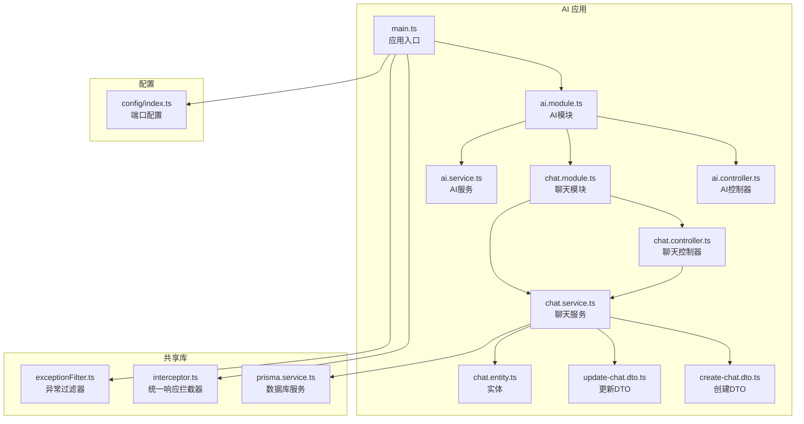
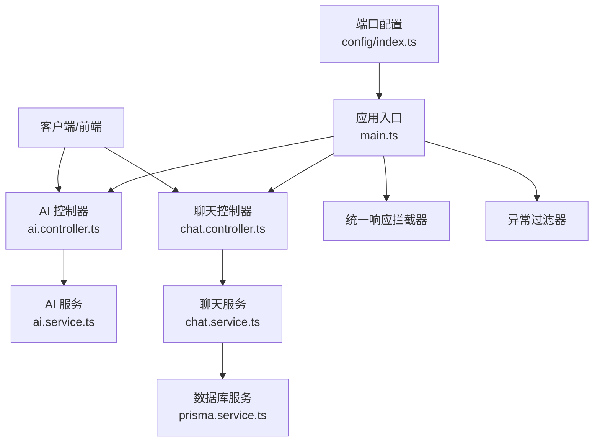
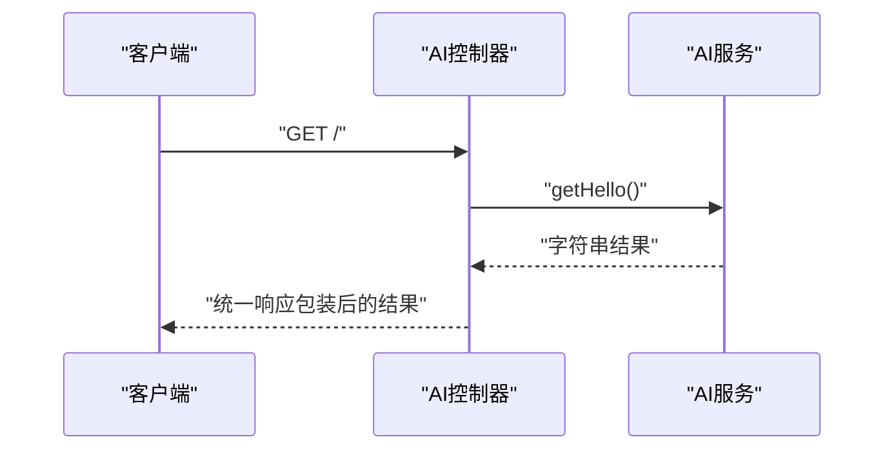
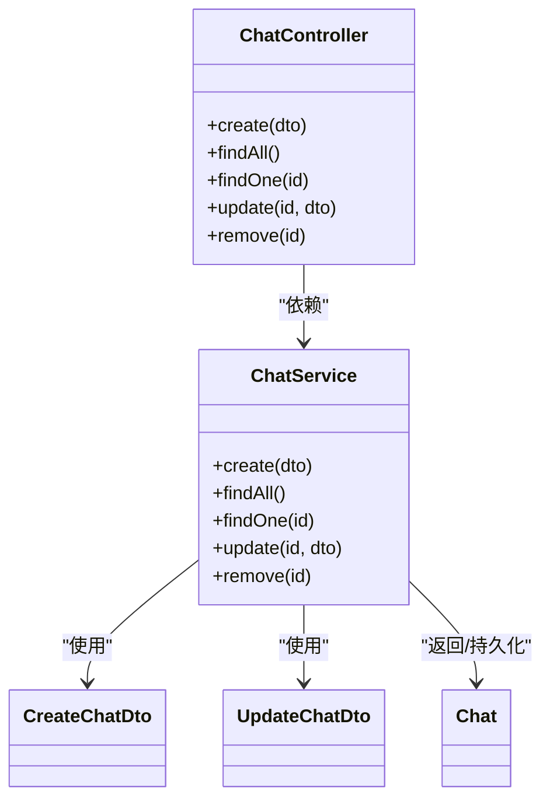
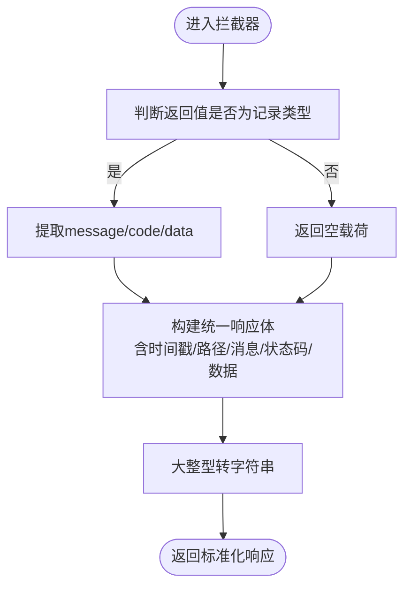
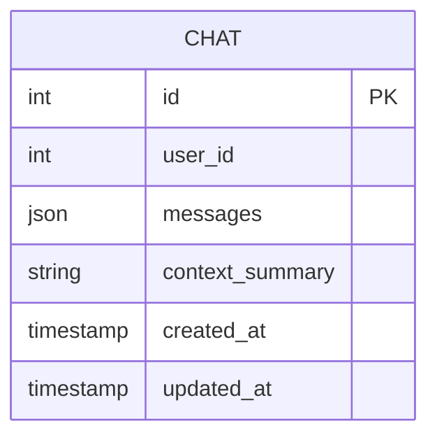
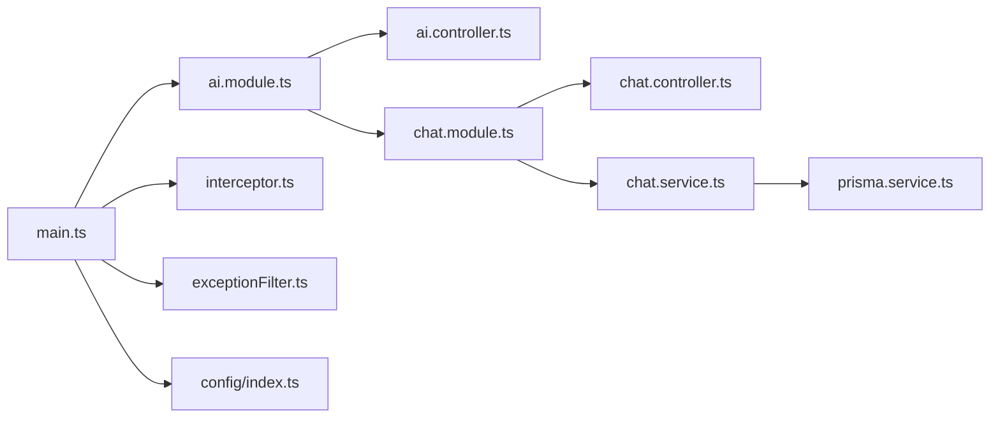

# AI智能问答服务

<cite>
**本文引用的文件**
- [server/apps/ai/src/main.ts](file://server/apps/ai/src/main.ts)
- [server/apps/ai/src/ai.module.ts](file://server/apps/ai/src/ai.module.ts)
- [server/apps/ai/src/ai.controller.ts](file://server/apps/ai/src/ai.controller.ts)
- [server/apps/ai/src/ai.service.ts](file://server/apps/ai/src/ai.service.ts)
- [server/apps/ai/src/chat/chat.module.ts](file://server/apps/ai/src/chat/chat.module.ts)
- [server/apps/ai/src/chat/chat.controller.ts](file://server/apps/ai/src/chat/chat.controller.ts)
- [server/apps/ai/src/chat/chat.service.ts](file://server/apps/ai/src/chat/chat.service.ts)
- [server/apps/ai/src/chat/dto/create-chat.dto.ts](file://server/apps/ai/src/chat/dto/create-chat.dto.ts)
- [server/apps/ai/src/chat/dto/update-chat.dto.ts](file://server/apps/ai/src/chat/dto/update-chat.dto.ts)
- [server/apps/ai/src/chat/entities/chat.entity.ts](file://server/apps/ai/src/chat/entities/chat.entity.ts)
- [server/libs/shared/src/interceptor/interceptor.ts](file://server/libs/shared/src/interceptor/interceptor.ts)
- [server/libs/shared/src/interceptor/exceptionFilter.ts](file://server/libs/shared/src/interceptor/exceptionFilter.ts)
- [server/libs/shared/src/prisma/prisma.service.ts](file://server/libs/shared/src/prisma/prisma.service.ts)
- [packages/config/index.ts](file://packages/config/index.ts)
- [server/apps/server/src/app.module.ts](file://server/apps/server/src/app.module.ts)
</cite>

## 目录
1. [简介](#简介)
2. [项目结构](#项目结构)
3. [核心组件](#核心组件)
4. [架构总览](#架构总览)
5. [详细组件分析](#详细组件分析)
6. [依赖关系分析](#依赖关系分析)
7. [性能考虑](#性能考虑)
8. [故障排查指南](#故障排查指南)
9. [结论](#结论)
10. [附录](#附录)

## 简介
本文件面向英语学习平台的AI智能问答服务，系统性阐述后端AI子系统的整体架构、模块化组织与业务流程。重点覆盖聊天对话功能的实现路径（对话创建、消息处理与上下文管理）、AI控制器的API设计与请求处理、聊天服务的数据模型与状态管理、AI集成策略、外部API调用与错误处理机制，并提供开发实践与性能优化建议。由于当前仓库中AI服务仍处于骨架阶段，本文在描述现有实现的同时，给出可扩展的设计建议与最佳实践。

## 项目结构
AI服务采用NestJS应用结构，主入口负责启动应用、注册全局拦截器与异常过滤器；AI模块聚合聊天模块并导出AI控制器；聊天模块提供完整的REST接口用于对话的增删改查；共享库提供统一响应体封装、异常过滤与数据库适配层。

**图表来源**
- [server/apps/ai/src/main.ts:1-14](file://server/apps/ai/src/main.ts#L1-L14)
- [server/apps/ai/src/ai.module.ts:1-12](file://server/apps/ai/src/ai.module.ts#L1-L12)
- [server/apps/ai/src/chat/chat.module.ts:1-10](file://server/apps/ai/src/chat/chat.module.ts#L1-L10)
- [server/apps/ai/src/chat/chat.controller.ts:1-35](file://server/apps/ai/src/chat/chat.controller.ts#L1-L35)
- [server/apps/ai/src/chat/chat.service.ts:1-27](file://server/apps/ai/src/chat/chat.service.ts#L1-L27)
- [server/apps/ai/src/chat/dto/create-chat.dto.ts:1-2](file://server/apps/ai/src/chat/dto/create-chat.dto.ts#L1-L2)
- [server/apps/ai/src/chat/dto/update-chat.dto.ts:1-5](file://server/apps/ai/src/chat/dto/update-chat.dto.ts#L1-L5)
- [server/apps/ai/src/chat/entities/chat.entity.ts:1-2](file://server/apps/ai/src/chat/entities/chat.entity.ts#L1-L2)
- [server/libs/shared/src/interceptor/interceptor.ts:1-86](file://server/libs/shared/src/interceptor/interceptor.ts#L1-L86)
- [server/libs/shared/src/interceptor/exceptionFilter.ts:1-23](file://server/libs/shared/src/interceptor/exceptionFilter.ts#L1-L23)
- [server/libs/shared/src/prisma/prisma.service.ts:1-18](file://server/libs/shared/src/prisma/prisma.service.ts#L1-L18)
- [packages/config/index.ts:1-8](file://packages/config/index.ts#L1-L8)

**章节来源**
- [server/apps/ai/src/main.ts:1-14](file://server/apps/ai/src/main.ts#L1-L14)
- [server/apps/ai/src/ai.module.ts:1-12](file://server/apps/ai/src/ai.module.ts#L1-L12)
- [server/apps/ai/src/chat/chat.module.ts:1-10](file://server/apps/ai/src/chat/chat.module.ts#L1-L10)
- [packages/config/index.ts:1-8](file://packages/config/index.ts#L1-L8)

## 核心组件
- 应用入口与启动：负责创建Nest应用实例、注册全局拦截器与异常过滤器，并按配置端口启动服务。
- AI模块：聚合聊天模块，导出AI控制器，作为对外API的入口之一。
- 聊天模块：提供完整的REST接口，支持对话的创建、查询、更新与删除。
- 共享拦截器：统一输出响应体结构，自动注入时间戳、路径、消息、状态码与数据字段，并对大整型进行字符串化处理。
- 异常过滤器：捕获HTTP异常，返回标准化错误响应。
- 数据库适配：基于Prisma与PostgreSQL适配器，提供类型安全的数据库访问能力。

**章节来源**
- [server/apps/ai/src/main.ts:1-14](file://server/apps/ai/src/main.ts#L1-L14)
- [server/apps/ai/src/ai.module.ts:1-12](file://server/apps/ai/src/ai.module.ts#L1-L12)
- [server/apps/ai/src/chat/chat.module.ts:1-10](file://server/apps/ai/src/chat/chat.module.ts#L1-L10)
- [server/libs/shared/src/interceptor/interceptor.ts:1-86](file://server/libs/shared/src/interceptor/interceptor.ts#L1-L86)
- [server/libs/shared/src/interceptor/exceptionFilter.ts:1-23](file://server/libs/shared/src/interceptor/exceptionFilter.ts#L1-L23)
- [server/libs/shared/src/prisma/prisma.service.ts:1-18](file://server/libs/shared/src/prisma/prisma.service.ts#L1-L18)

## 架构总览
AI服务采用分层架构：入口层负责应用生命周期与中间件装配；控制层承接HTTP请求并委派给服务层；服务层承载业务逻辑与数据访问；共享库提供横切关注点（响应标准化、异常处理、数据库）。

**图表来源**
- [server/apps/ai/src/ai.controller.ts:1-13](file://server/apps/ai/src/ai.controller.ts#L1-L13)
- [server/apps/ai/src/ai.service.ts:1-9](file://server/apps/ai/src/ai.service.ts#L1-L9)
- [server/apps/ai/src/chat/chat.controller.ts:1-35](file://server/apps/ai/src/chat/chat.controller.ts#L1-L35)
- [server/apps/ai/src/chat/chat.service.ts:1-27](file://server/apps/ai/src/chat/chat.service.ts#L1-L27)
- [server/libs/shared/src/prisma/prisma.service.ts:1-18](file://server/libs/shared/src/prisma/prisma.service.ts#L1-L18)
- [server/apps/ai/src/main.ts:1-14](file://server/apps/ai/src/main.ts#L1-L14)
- [server/libs/shared/src/interceptor/interceptor.ts:1-86](file://server/libs/shared/src/interceptor/interceptor.ts#L1-L86)
- [server/libs/shared/src/interceptor/exceptionFilter.ts:1-23](file://server/libs/shared/src/interceptor/exceptionFilter.ts#L1-L23)
- [packages/config/index.ts:1-8](file://packages/config/index.ts#L1-L8)

## 详细组件分析

### AI控制器与服务
- AI控制器提供根路径GET接口，委托AI服务返回问候信息，便于健康检查与快速验证。
- AI服务当前仅返回固定字符串，后续可扩展为对接外部AI模型或本地推理引擎。

**图表来源**
- [server/apps/ai/src/ai.controller.ts:1-13](file://server/apps/ai/src/ai.controller.ts#L1-L13)
- [server/apps/ai/src/ai.service.ts:1-9](file://server/apps/ai/src/ai.service.ts#L1-L9)
- [server/libs/shared/src/interceptor/interceptor.ts:1-86](file://server/libs/shared/src/interceptor/interceptor.ts#L1-L86)

**章节来源**
- [server/apps/ai/src/ai.controller.ts:1-13](file://server/apps/ai/src/ai.controller.ts#L1-L13)
- [server/apps/ai/src/ai.service.ts:1-9](file://server/apps/ai/src/ai.service.ts#L1-L9)

### 聊天控制器与服务
- 聊天控制器提供REST接口：POST创建、GET列表、GET单条、PATCH更新、DELETE删除。
- DTO层定义了创建与更新的数据传输对象，后者基于映射类型继承前者。
- 实体层目前为空占位，后续可扩展为包含对话ID、消息历史、上下文元数据等字段。

**图表来源**
- [server/apps/ai/src/chat/chat.controller.ts:1-35](file://server/apps/ai/src/chat/chat.controller.ts#L1-L35)
- [server/apps/ai/src/chat/chat.service.ts:1-27](file://server/apps/ai/src/chat/chat.service.ts#L1-L27)
- [server/apps/ai/src/chat/dto/create-chat.dto.ts:1-2](file://server/apps/ai/src/chat/dto/create-chat.dto.ts#L1-L2)
- [server/apps/ai/src/chat/dto/update-chat.dto.ts:1-5](file://server/apps/ai/src/chat/dto/update-chat.dto.ts#L1-L5)
- [server/apps/ai/src/chat/entities/chat.entity.ts:1-2](file://server/apps/ai/src/chat/entities/chat.entity.ts#L1-L2)

**章节来源**
- [server/apps/ai/src/chat/chat.controller.ts:1-35](file://server/apps/ai/src/chat/chat.controller.ts#L1-L35)
- [server/apps/ai/src/chat/chat.service.ts:1-27](file://server/apps/ai/src/chat/chat.service.ts#L1-L27)
- [server/apps/ai/src/chat/dto/create-chat.dto.ts:1-2](file://server/apps/ai/src/chat/dto/create-chat.dto.ts#L1-L2)
- [server/apps/ai/src/chat/dto/update-chat.dto.ts:1-5](file://server/apps/ai/src/chat/dto/update-chat.dto.ts#L1-L5)
- [server/apps/ai/src/chat/entities/chat.entity.ts:1-2](file://server/apps/ai/src/chat/entities/chat.entity.ts#L1-L2)

### 统一响应与异常处理
- 统一响应拦截器：将任意返回值标准化为统一响应体，自动注入时间戳、路径、消息、状态码与数据字段；对大整型进行字符串化，避免JSON序列化精度丢失。
- 异常过滤器：捕获HTTP异常，返回标准化错误响应，包含时间戳、路径、消息与状态码。

**图表来源**
- [server/libs/shared/src/interceptor/interceptor.ts:1-86](file://server/libs/shared/src/interceptor/interceptor.ts#L1-L86)

**章节来源**
- [server/libs/shared/src/interceptor/interceptor.ts:1-86](file://server/libs/shared/src/interceptor/interceptor.ts#L1-L86)
- [server/libs/shared/src/interceptor/exceptionFilter.ts:1-23](file://server/libs/shared/src/interceptor/exceptionFilter.ts#L1-L23)

### 数据模型与状态管理
- 当前实体与DTO均为最小化占位，尚未定义具体字段与约束。
- 建议在实体中增加字段如：对话ID、用户ID、消息数组（含发送者、内容、时间戳）、上下文摘要、创建/更新时间等。
- 状态管理可采用“会话-消息”两级结构：会话作为容器，消息作为有序序列，便于上下文截断与重算。

[此图为概念性模型示意，不直接对应具体源文件]

### 外部API集成策略
- 推荐通过AI服务的AI控制器/服务层对接第三方LLM或本地推理引擎，统一抽象请求参数与响应格式。
- 使用拦截器统一输出，异常过滤器兜底，确保对外接口一致性与可观测性。
- 对于长耗时请求，建议引入异步任务队列与轮询/回调机制，避免阻塞主线程。

[本节为通用实践建议，不直接分析具体文件]

### 请求处理与响应格式
- 控制器接收请求后，交由服务层处理；服务层可调用数据库服务或其他外部服务。
- 统一响应体包含：时间戳、请求路径、消息、状态码、成功标志与数据体；数据体中的大整型将被转换为字符串。
- 异常场景由异常过滤器接管，返回标准化错误响应。

**章节来源**
- [server/apps/ai/src/chat/chat.controller.ts:1-35](file://server/apps/ai/src/chat/chat.controller.ts#L1-L35)
- [server/apps/ai/src/chat/chat.service.ts:1-27](file://server/apps/ai/src/chat/chat.service.ts#L1-L27)
- [server/libs/shared/src/interceptor/interceptor.ts:1-86](file://server/libs/shared/src/interceptor/interceptor.ts#L1-L86)
- [server/libs/shared/src/interceptor/exceptionFilter.ts:1-23](file://server/libs/shared/src/interceptor/exceptionFilter.ts#L1-L23)

## 依赖关系分析
- 模块耦合：AI模块导入聊天模块，形成清晰的边界；控制器与服务通过依赖注入解耦。
- 共享库：统一拦截器与异常过滤器在应用入口全局启用，保证所有路由的一致性。
- 数据访问：聊天服务通过Prisma服务访问数据库，遵循类型安全与连接池管理的最佳实践。

**图表来源**
- [server/apps/ai/src/main.ts:1-14](file://server/apps/ai/src/main.ts#L1-L14)
- [server/apps/ai/src/ai.module.ts:1-12](file://server/apps/ai/src/ai.module.ts#L1-L12)
- [server/apps/ai/src/chat/chat.module.ts:1-10](file://server/apps/ai/src/chat/chat.module.ts#L1-L10)
- [server/apps/ai/src/chat/chat.controller.ts:1-35](file://server/apps/ai/src/chat/chat.controller.ts#L1-L35)
- [server/apps/ai/src/chat/chat.service.ts:1-27](file://server/apps/ai/src/chat/chat.service.ts#L1-L27)
- [server/libs/shared/src/prisma/prisma.service.ts:1-18](file://server/libs/shared/src/prisma/prisma.service.ts#L1-L18)
- [server/libs/shared/src/interceptor/interceptor.ts:1-86](file://server/libs/shared/src/interceptor/interceptor.ts#L1-L86)
- [server/libs/shared/src/interceptor/exceptionFilter.ts:1-23](file://server/libs/shared/src/interceptor/exceptionFilter.ts#L1-L23)
- [packages/config/index.ts:1-8](file://packages/config/index.ts#L1-L8)

**章节来源**
- [server/apps/ai/src/main.ts:1-14](file://server/apps/ai/src/main.ts#L1-L14)
- [server/apps/ai/src/ai.module.ts:1-12](file://server/apps/ai/src/ai.module.ts#L1-L12)
- [server/apps/ai/src/chat/chat.module.ts:1-10](file://server/apps/ai/src/chat/chat.module.ts#L1-L10)
- [server/libs/shared/src/prisma/prisma.service.ts:1-18](file://server/libs/shared/src/prisma/prisma.service.ts#L1-L18)
- [packages/config/index.ts:1-8](file://packages/config/index.ts#L1-L8)

## 性能考虑
- 响应标准化：拦截器对大整型进行字符串化，避免前端解析误差；同时减少重复字段构造成本。
- 异常快速失败：异常过滤器集中处理，避免业务分支散落导致的性能损耗。
- 数据库访问：Prisma适配PG，具备连接池与类型安全优势；建议在聊天服务中合理使用事务与索引。
- 可选优化：对热点接口引入缓存、限流与超时控制；对外部AI服务调用采用连接池与熔断策略。

[本节提供通用指导，不直接分析具体文件]

## 故障排查指南
- 健康检查：通过AI控制器根路径GET接口确认服务可用性。
- 日志与追踪：统一响应体包含时间戳与路径，便于定位问题；异常过滤器返回标准化错误信息。
- 数据库连通性：检查环境变量与连接串，确认Prisma适配器初始化成功。
- 端口与进程：确认AI服务监听端口与配置一致，避免端口冲突。

**章节来源**
- [server/apps/ai/src/ai.controller.ts:1-13](file://server/apps/ai/src/ai.controller.ts#L1-L13)
- [server/libs/shared/src/interceptor/exceptionFilter.ts:1-23](file://server/libs/shared/src/interceptor/exceptionFilter.ts#L1-L23)
- [server/libs/shared/src/prisma/prisma.service.ts:1-18](file://server/libs/shared/src/prisma/prisma.service.ts#L1-L18)
- [packages/config/index.ts:1-8](file://packages/config/index.ts#L1-L8)

## 结论
当前AI智能问答服务已建立清晰的模块边界与统一的响应/异常处理机制，聊天模块提供了完整的REST接口骨架。建议下一步完善聊天实体与DTO、接入数据库与外部AI服务、补充上下文管理与消息处理逻辑，并结合性能与可靠性最佳实践持续演进。

## 附录
- 配置项：AI服务端口由配置模块集中管理，便于多环境切换。
- 关联模块：服务器主模块导入共享模块，体现跨应用的共享能力复用。

**章节来源**
- [packages/config/index.ts:1-8](file://packages/config/index.ts#L1-L8)
- [server/apps/server/src/app.module.ts:1-13](file://server/apps/server/src/app.module.ts#L1-L13)