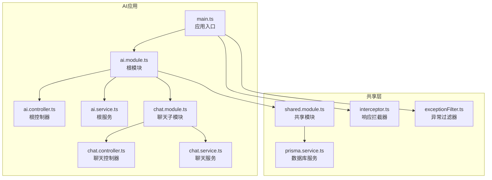
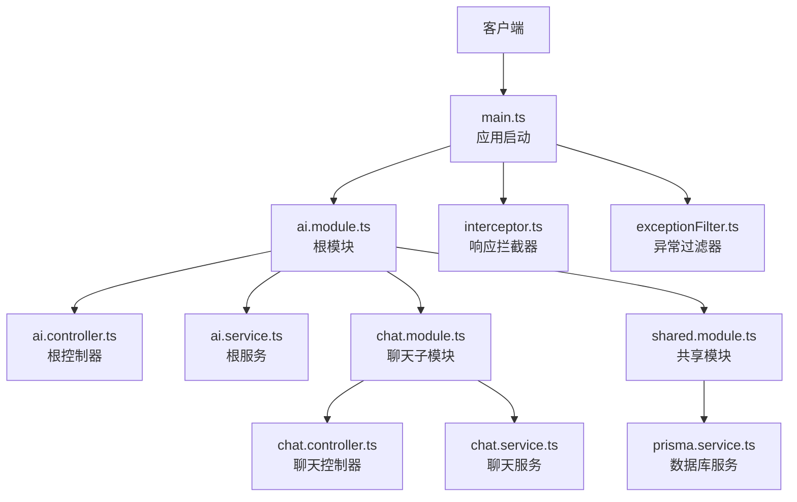
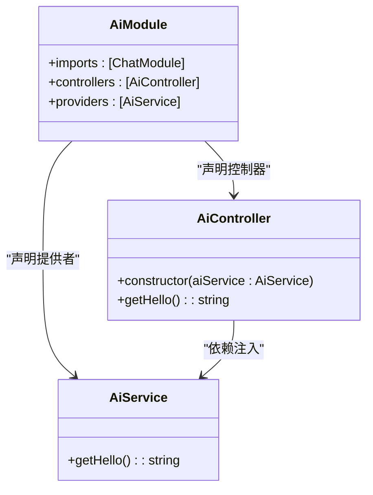
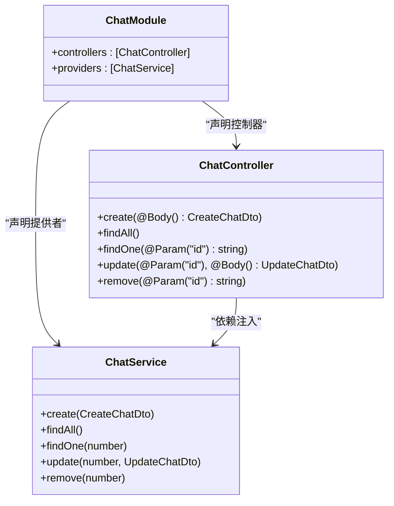
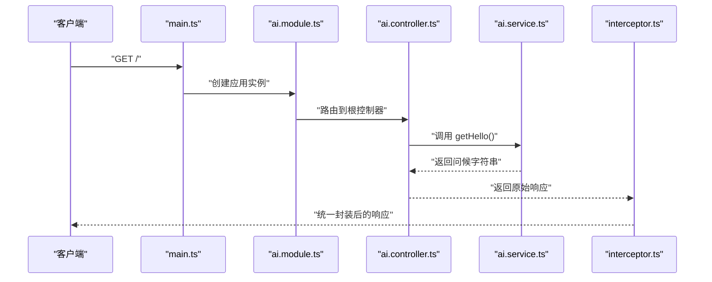
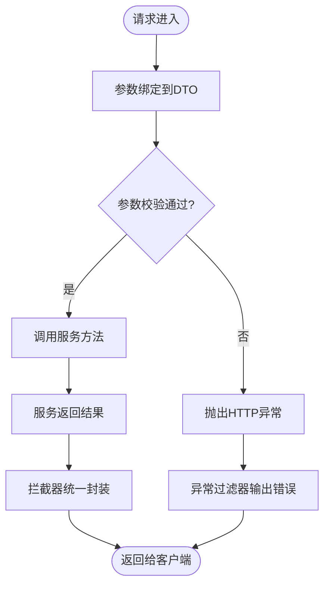
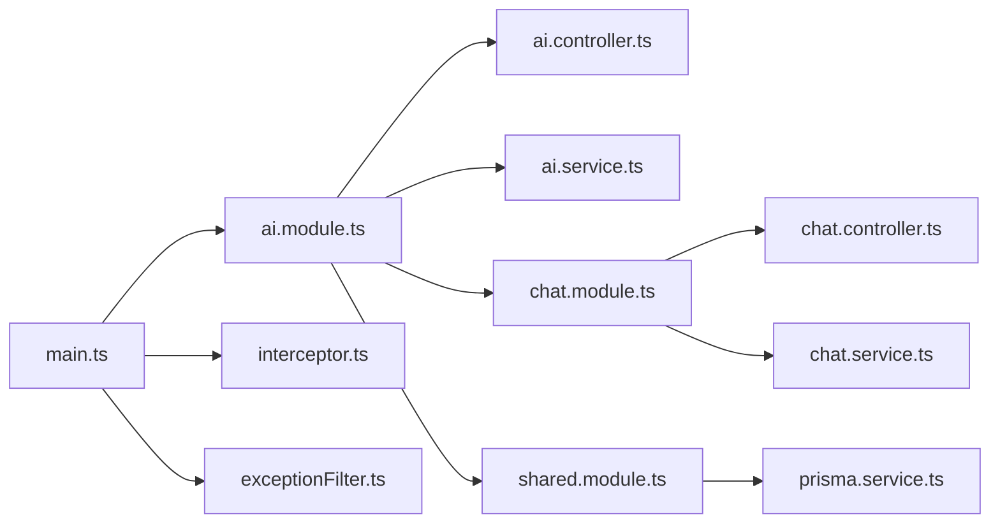

# AI核心模块

<cite>
**本文档引用的文件**
- [server/apps/ai/src/main.ts](file://server/apps/ai/src/main.ts)
- [server/apps/ai/src/ai.module.ts](file://server/apps/ai/src/ai.module.ts)
- [server/apps/ai/src/ai.controller.ts](file://server/apps/ai/src/ai.controller.ts)
- [server/apps/ai/src/ai.service.ts](file://server/apps/ai/src/ai.service.ts)
- [server/apps/ai/src/chat/chat.controller.ts](file://server/apps/ai/src/chat/chat.controller.ts)
- [server/apps/ai/src/chat/chat.service.ts](file://server/apps/ai/src/chat/chat.service.ts)
- [server/apps/ai/src/chat/chat.module.ts](file://server/apps/ai/src/chat/chat.module.ts)
- [server/apps/ai/src/chat/dto/create-chat.dto.ts](file://server/apps/ai/src/chat/dto/create-chat.dto.ts)
- [server/apps/ai/src/chat/dto/update-chat.dto.ts](file://server/apps/ai/src/chat/dto/update-chat.dto.ts)
- [server/apps/ai/src/chat/entities/chat.entity.ts](file://server/apps/ai/src/chat/entities/chat.entity.ts)
- [libs/shared/src/interceptor/interceptor.ts](file://libs/shared/src/interceptor/interceptor.ts)
- [libs/shared/src/interceptor/exceptionFilter.ts](file://libs/shared/src/interceptor/exceptionFilter.ts)
- [libs/shared/src/shared.module.ts](file://libs/shared/src/shared.module.ts)
- [libs/shared/src/prisma/prisma.service.ts](file://libs/shared/src/prisma/prisma.service.ts)
- [apps/server/src/app.module.ts](file://apps/server/src/app.module.ts)
</cite>

## 目录
1. [简介](#简介)
2. [项目结构](#项目结构)
3. [核心组件](#核心组件)
4. [架构总览](#架构总览)
5. [详细组件分析](#详细组件分析)
6. [依赖关系分析](#依赖关系分析)
7. [性能考虑](#性能考虑)
8. [故障排查指南](#故障排查指南)
9. [结论](#结论)
10. [附录](#附录)

## 简介
本文件面向AI智能问答服务的核心模块，系统性阐述其整体架构设计、模块导入关系、控制器与提供者配置、API接口设计、业务逻辑实现、模块间依赖与数据流转，并提供开发最佳实践与调试技巧。当前代码库呈现一个基于NestJS的微服务化架构：AI应用作为独立子应用运行，内部包含基础问候接口与聊天管理子模块；全局拦截器与异常过滤器统一处理响应格式与错误；共享模块提供数据库连接与通用响应封装能力。

## 项目结构
AI核心模块位于 server/apps/ai 下，采用按功能分层的目录组织方式：
- 应用入口与模块装配：main.ts、ai.module.ts
- 根控制器与服务：ai.controller.ts、ai.service.ts
- 聊天子模块：chat.controller.ts、chat.service.ts、chat.module.ts 及 DTO/Entity 定义
- 全局拦截器与异常过滤器：libs/shared/src/interceptor/*
- 共享模块与数据库服务：libs/shared/src/shared.module.ts、libs/shared/src/prisma/prisma.service.ts
- 对比参考：apps/server/src/app.module.ts 展示了另一个应用的模块组织方式

图表来源
- [server/apps/ai/src/main.ts:1-14](file://server/apps/ai/src/main.ts#L1-L14)
- [server/apps/ai/src/ai.module.ts:1-12](file://server/apps/ai/src/ai.module.ts#L1-L12)
- [server/apps/ai/src/ai.controller.ts:1-13](file://server/apps/ai/src/ai.controller.ts#L1-L13)
- [server/apps/ai/src/ai.service.ts:1-9](file://server/apps/ai/src/ai.service.ts#L1-L9)
- [server/apps/ai/src/chat/chat.module.ts:1-10](file://server/apps/ai/src/chat/chat.module.ts#L1-L10)
- [server/apps/ai/src/chat/chat.controller.ts:1-35](file://server/apps/ai/src/chat/chat.controller.ts#L1-L35)
- [server/apps/ai/src/chat/chat.service.ts:1-27](file://server/apps/ai/src/chat/chat.service.ts#L1-L27)
- [libs/shared/src/shared.module.ts:1-13](file://libs/shared/src/shared.module.ts#L1-L13)
- [libs/shared/src/prisma/prisma.service.ts:1-18](file://libs/shared/src/prisma/prisma.service.ts#L1-L18)
- [libs/shared/src/interceptor/interceptor.ts:1-86](file://libs/shared/src/interceptor/interceptor.ts#L1-L86)
- [libs/shared/src/interceptor/exceptionFilter.ts:1-23](file://libs/shared/src/interceptor/exceptionFilter.ts#L1-L23)

章节来源
- [server/apps/ai/src/main.ts:1-14](file://server/apps/ai/src/main.ts#L1-L14)
- [server/apps/ai/src/ai.module.ts:1-12](file://server/apps/ai/src/ai.module.ts#L1-L12)
- [server/apps/ai/src/chat/chat.module.ts:1-10](file://server/apps/ai/src/chat/chat.module.ts#L1-L10)
- [libs/shared/src/shared.module.ts:1-13](file://libs/shared/src/shared.module.ts#L1-L13)

## 核心组件
- 应用入口与启动
  - main.ts 负责创建应用实例、注册全局拦截器与异常过滤器，并监听指定端口。
- 模块装配
  - ai.module.ts 声明根控制器与服务，并引入聊天子模块。
  - chat.module.ts 声明聊天控制器与服务，形成独立子域。
- 控制器与服务
  - ai.controller.ts 提供根路径 GET 接口，委托 ai.service.ts 返回问候信息。
  - chat.controller.ts 提供完整的REST接口（POST/GET/PATCH/DELETE），委托 chat.service.ts 处理业务。
- 共享能力
  - shared.module.ts 导出共享服务与模块，prisma.service.ts 提供数据库客户端。
  - interceptor.ts 统一响应包装，exceptionFilter.ts 统一异常输出。

章节来源
- [server/apps/ai/src/main.ts:1-14](file://server/apps/ai/src/main.ts#L1-L14)
- [server/apps/ai/src/ai.module.ts:1-12](file://server/apps/ai/src/ai.module.ts#L1-L12)
- [server/apps/ai/src/ai.controller.ts:1-13](file://server/apps/ai/src/ai.controller.ts#L1-L13)
- [server/apps/ai/src/ai.service.ts:1-9](file://server/apps/ai/src/ai.service.ts#L1-L9)
- [server/apps/ai/src/chat/chat.controller.ts:1-35](file://server/apps/ai/src/chat/chat.controller.ts#L1-L35)
- [server/apps/ai/src/chat/chat.service.ts:1-27](file://server/apps/ai/src/chat/chat.service.ts#L1-L27)
- [libs/shared/src/shared.module.ts:1-13](file://libs/shared/src/shared.module.ts#L1-L13)
- [libs/shared/src/prisma/prisma.service.ts:1-18](file://libs/shared/src/prisma/prisma.service.ts#L1-L18)
- [libs/shared/src/interceptor/interceptor.ts:1-86](file://libs/shared/src/interceptor/interceptor.ts#L1-L86)
- [libs/shared/src/interceptor/exceptionFilter.ts:1-23](file://libs/shared/src/interceptor/exceptionFilter.ts#L1-L23)

## 架构总览
AI应用采用“根模块 + 子模块”的分层架构。根模块负责对外暴露基础接口与协调子模块；子模块封装具体业务域（如聊天管理）。全局拦截器将所有控制器返回值标准化为统一响应体；异常过滤器捕获HTTP异常并统一输出错误响应。共享模块提供数据库连接等横切能力。

图表来源
- [server/apps/ai/src/main.ts:1-14](file://server/apps/ai/src/main.ts#L1-L14)
- [server/apps/ai/src/ai.module.ts:1-12](file://server/apps/ai/src/ai.module.ts#L1-L12)
- [server/apps/ai/src/ai.controller.ts:1-13](file://server/apps/ai/src/ai.controller.ts#L1-L13)
- [server/apps/ai/src/ai.service.ts:1-9](file://server/apps/ai/src/ai.service.ts#L1-L9)
- [server/apps/ai/src/chat/chat.module.ts:1-10](file://server/apps/ai/src/chat/chat.module.ts#L1-L10)
- [server/apps/ai/src/chat/chat.controller.ts:1-35](file://server/apps/ai/src/chat/chat.controller.ts#L1-L35)
- [server/apps/ai/src/chat/chat.service.ts:1-27](file://server/apps/ai/src/chat/chat.service.ts#L1-L27)
- [libs/shared/src/shared.module.ts:1-13](file://libs/shared/src/shared.module.ts#L1-L13)
- [libs/shared/src/prisma/prisma.service.ts:1-18](file://libs/shared/src/prisma/prisma.service.ts#L1-L18)
- [libs/shared/src/interceptor/interceptor.ts:1-86](file://libs/shared/src/interceptor/interceptor.ts#L1-L86)
- [libs/shared/src/interceptor/exceptionFilter.ts:1-23](file://libs/shared/src/interceptor/exceptionFilter.ts#L1-L23)

## 详细组件分析

### 根模块与应用入口
- 职责
  - main.ts：创建应用实例、注册全局拦截器与异常过滤器、启动HTTP服务器。
  - ai.module.ts：声明根控制器与服务，引入聊天子模块，完成模块装配。
- 关键点
  - 全局拦截器确保所有响应被统一封装。
  - 异常过滤器仅捕获HTTP异常，保证非HTTP异常由默认机制处理。
  - 根模块不直接导出共享模块，但通过依赖链在运行时可用。

图表来源
- [server/apps/ai/src/ai.module.ts:1-12](file://server/apps/ai/src/ai.module.ts#L1-L12)
- [server/apps/ai/src/ai.controller.ts:1-13](file://server/apps/ai/src/ai.controller.ts#L1-L13)
- [server/apps/ai/src/ai.service.ts:1-9](file://server/apps/ai/src/ai.service.ts#L1-L9)

章节来源
- [server/apps/ai/src/main.ts:1-14](file://server/apps/ai/src/main.ts#L1-L14)
- [server/apps/ai/src/ai.module.ts:1-12](file://server/apps/ai/src/ai.module.ts#L1-L12)
- [server/apps/ai/src/ai.controller.ts:1-13](file://server/apps/ai/src/ai.controller.ts#L1-L13)
- [server/apps/ai/src/ai.service.ts:1-9](file://server/apps/ai/src/ai.service.ts#L1-L9)

### 聊天子模块
- 职责
  - chat.controller.ts：提供聊天记录的增删改查接口，使用DTO进行参数校验与映射。
  - chat.service.ts：实现业务逻辑（当前为占位返回值）。
  - chat.module.ts：声明控制器与服务，形成独立子域。
- DTO与实体
  - CreateChatDto/UpdateChatDto：定义输入结构，支持部分更新。
  - Chat 实体：当前为空定义，便于后续扩展。

图表来源
- [server/apps/ai/src/chat/chat.module.ts:1-10](file://server/apps/ai/src/chat/chat.module.ts#L1-L10)
- [server/apps/ai/src/chat/chat.controller.ts:1-35](file://server/apps/ai/src/chat/chat.controller.ts#L1-L35)
- [server/apps/ai/src/chat/chat.service.ts:1-27](file://server/apps/ai/src/chat/chat.service.ts#L1-L27)
- [server/apps/ai/src/chat/dto/create-chat.dto.ts:1-2](file://server/apps/ai/src/chat/dto/create-chat.dto.ts#L1-L2)
- [server/apps/ai/src/chat/dto/update-chat.dto.ts:1-5](file://server/apps/ai/src/chat/dto/update-chat.dto.ts#L1-L5)
- [server/apps/ai/src/chat/entities/chat.entity.ts:1-2](file://server/apps/ai/src/chat/entities/chat.entity.ts#L1-L2)

章节来源
- [server/apps/ai/src/chat/chat.controller.ts:1-35](file://server/apps/ai/src/chat/chat.controller.ts#L1-L35)
- [server/apps/ai/src/chat/chat.service.ts:1-27](file://server/apps/ai/src/chat/chat.service.ts#L1-L27)
- [server/apps/ai/src/chat/chat.module.ts:1-10](file://server/apps/ai/src/chat/chat.module.ts#L1-L10)
- [server/apps/ai/src/chat/dto/create-chat.dto.ts:1-2](file://server/apps/ai/src/chat/dto/create-chat.dto.ts#L1-L2)
- [server/apps/ai/src/chat/dto/update-chat.dto.ts:1-5](file://server/apps/ai/src/chat/dto/update-chat.dto.ts#L1-L5)
- [server/apps/ai/src/chat/entities/chat.entity.ts:1-2](file://server/apps/ai/src/chat/entities/chat.entity.ts#L1-L2)

### API接口设计
- 根控制器接口
  - GET /：返回问候信息，委托 ai.service.getHello()。
- 聊天控制器接口
  - POST /chat：创建新聊天记录，请求体为 CreateChatDto。
  - GET /chat：查询所有聊天记录。
  - GET /chat/:id：按ID查询单条聊天记录。
  - PATCH /chat/:id：按ID更新聊天记录，请求体为 UpdateChatDto。
  - DELETE /chat/:id：按ID删除聊天记录。
- 请求/响应处理
  - 所有控制器返回值经拦截器统一包装为 {timestamp, path, message, code, success, data}。
  - HTTP异常由异常过滤器统一输出相同结构的错误响应。

图表来源
- [server/apps/ai/src/main.ts:1-14](file://server/apps/ai/src/main.ts#L1-L14)
- [server/apps/ai/src/ai.module.ts:1-12](file://server/apps/ai/src/ai.module.ts#L1-L12)
- [server/apps/ai/src/ai.controller.ts:1-13](file://server/apps/ai/src/ai.controller.ts#L1-L13)
- [server/apps/ai/src/ai.service.ts:1-9](file://server/apps/ai/src/ai.service.ts#L1-L9)
- [libs/shared/src/interceptor/interceptor.ts:1-86](file://libs/shared/src/interceptor/interceptor.ts#L1-L86)

章节来源
- [server/apps/ai/src/ai.controller.ts:1-13](file://server/apps/ai/src/ai.controller.ts#L1-L13)
- [server/apps/ai/src/ai.service.ts:1-9](file://server/apps/ai/src/ai.service.ts#L1-L9)
- [server/apps/ai/src/chat/chat.controller.ts:1-35](file://server/apps/ai/src/chat/chat.controller.ts#L1-L35)
- [libs/shared/src/interceptor/interceptor.ts:1-86](file://libs/shared/src/interceptor/interceptor.ts#L1-L86)
- [libs/shared/src/interceptor/exceptionFilter.ts:1-23](file://libs/shared/src/interceptor/exceptionFilter.ts#L1-L23)

### 业务逻辑实现与数据流
- 调用流程
  - 客户端请求到达控制器后，控制器将参数绑定到DTO对象，随后调用对应服务方法。
  - 服务方法执行业务逻辑（当前为占位返回值），最终返回结果。
  - 全局拦截器将返回值标准化为统一响应结构。
- 参数处理
  - DTO用于约束请求体字段，支持部分更新（UpdateChatDto 继承自 CreateChatDto）。
  - 路径参数通过装饰器解析为数字或字符串。
- 结果返回
  - 成功响应：包含时间戳、路径、消息、状态码、成功标记与数据体。
  - 错误响应：HTTP异常被捕获并统一输出错误结构。

图表来源
- [server/apps/ai/src/chat/chat.controller.ts:1-35](file://server/apps/ai/src/chat/chat.controller.ts#L1-L35)
- [server/apps/ai/src/chat/chat.service.ts:1-27](file://server/apps/ai/src/chat/chat.service.ts#L1-L27)
- [libs/shared/src/interceptor/interceptor.ts:1-86](file://libs/shared/src/interceptor/interceptor.ts#L1-L86)
- [libs/shared/src/interceptor/exceptionFilter.ts:1-23](file://libs/shared/src/interceptor/exceptionFilter.ts#L1-L23)

章节来源
- [server/apps/ai/src/chat/chat.controller.ts:1-35](file://server/apps/ai/src/chat/chat.controller.ts#L1-L35)
- [server/apps/ai/src/chat/chat.service.ts:1-27](file://server/apps/ai/src/chat/chat.service.ts#L1-L27)
- [libs/shared/src/interceptor/interceptor.ts:1-86](file://libs/shared/src/interceptor/interceptor.ts#L1-L86)
- [libs/shared/src/interceptor/exceptionFilter.ts:1-23](file://libs/shared/src/interceptor/exceptionFilter.ts#L1-L23)

## 依赖关系分析
- 模块耦合
  - ai.module.ts 仅引入 chat.module.ts，保持根模块简洁；聊天域独立演进。
  - 控制器与服务通过依赖注入解耦，便于单元测试与替换。
- 外部依赖
  - 全局拦截器与异常过滤器由共享库提供，避免重复实现。
  - 数据库连接通过共享模块的 PrismaService 提供，统一配置与生命周期管理。
- 循环依赖
  - 当前模块未发现循环依赖迹象；若未来引入跨模块调用，需谨慎设计接口边界。

图表来源
- [server/apps/ai/src/main.ts:1-14](file://server/apps/ai/src/main.ts#L1-L14)
- [server/apps/ai/src/ai.module.ts:1-12](file://server/apps/ai/src/ai.module.ts#L1-L12)
- [server/apps/ai/src/chat/chat.module.ts:1-10](file://server/apps/ai/src/chat/chat.module.ts#L1-L10)
- [libs/shared/src/shared.module.ts:1-13](file://libs/shared/src/shared.module.ts#L1-L13)
- [libs/shared/src/prisma/prisma.service.ts:1-18](file://libs/shared/src/prisma/prisma.service.ts#L1-L18)
- [libs/shared/src/interceptor/interceptor.ts:1-86](file://libs/shared/src/interceptor/interceptor.ts#L1-L86)
- [libs/shared/src/interceptor/exceptionFilter.ts:1-23](file://libs/shared/src/interceptor/exceptionFilter.ts#L1-L23)

章节来源
- [server/apps/ai/src/ai.module.ts:1-12](file://server/apps/ai/src/ai.module.ts#L1-L12)
- [server/apps/ai/src/chat/chat.module.ts:1-10](file://server/apps/ai/src/chat/chat.module.ts#L1-L10)
- [libs/shared/src/shared.module.ts:1-13](file://libs/shared/src/shared.module.ts#L1-L13)

## 性能考虑
- 响应标准化
  - 拦截器对响应进行统一封装与数据类型转换（如BigInt转字符串），减少前端处理负担。
- 异常处理
  - 异常过滤器集中处理HTTP异常，避免重复逻辑与分支污染。
- 数据库访问
  - 通过共享模块的 PrismaService 统一连接池与适配器配置，建议在服务层复用连接，避免频繁初始化。
- 控制器职责
  - 控制器仅做参数绑定与委派，复杂逻辑下沉至服务层，提升可测试性与可维护性。

## 故障排查指南
- 常见问题
  - 接口返回格式异常：检查拦截器是否正确包裹响应，确认控制器返回值结构。
  - HTTP异常未被捕获：确认异常是否为 HttpException 类型，否则由默认异常处理器处理。
  - 数据库连接失败：检查环境变量 DATABASE_URL 与 Prisma 配置。
- 调试技巧
  - 在控制器与服务中添加日志，定位参数绑定与业务逻辑问题。
  - 使用最小化 DTO 字段进行测试，逐步增加字段以缩小问题范围。
  - 利用拦截器的统一响应结构快速识别错误来源。

章节来源
- [libs/shared/src/interceptor/interceptor.ts:1-86](file://libs/shared/src/interceptor/interceptor.ts#L1-L86)
- [libs/shared/src/interceptor/exceptionFilter.ts:1-23](file://libs/shared/src/interceptor/exceptionFilter.ts#L1-L23)
- [libs/shared/src/prisma/prisma.service.ts:1-18](file://libs/shared/src/prisma/prisma.service.ts#L1-L18)

## 结论
AI核心模块遵循NestJS推荐的模块化与分层架构，通过根模块与子模块清晰划分职责，借助全局拦截器与异常过滤器实现统一响应与错误处理，配合共享模块提供数据库连接等横切能力。当前实现以占位逻辑为主，建议在服务层逐步填充真实业务调用与数据持久化，同时保持控制器与服务的职责分离，确保模块的可测试性与可扩展性。

## 附录
- 开发最佳实践
  - 控制器只做参数绑定与委派，复杂逻辑放入服务层。
  - 使用DTO进行输入约束与校验，必要时启用验证管道。
  - 统一使用拦截器与异常过滤器，避免分散处理。
  - 数据库操作通过共享模块提供的服务进行，集中管理连接与事务。
- 调试建议
  - 启用详细日志，定位请求进入与响应返回的关键节点。
  - 对外暴露的接口优先从根模块开始验证，再逐步深入子模块。
  - 对聊天等业务域，先验证基本CRUD流程，再扩展AI调用链路。