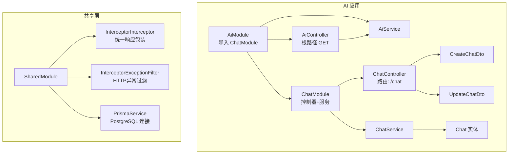
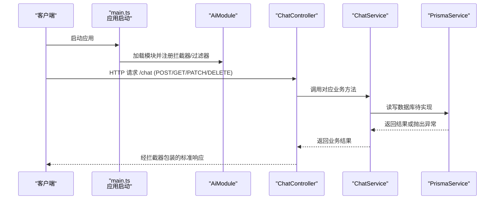
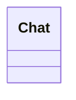
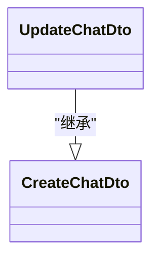
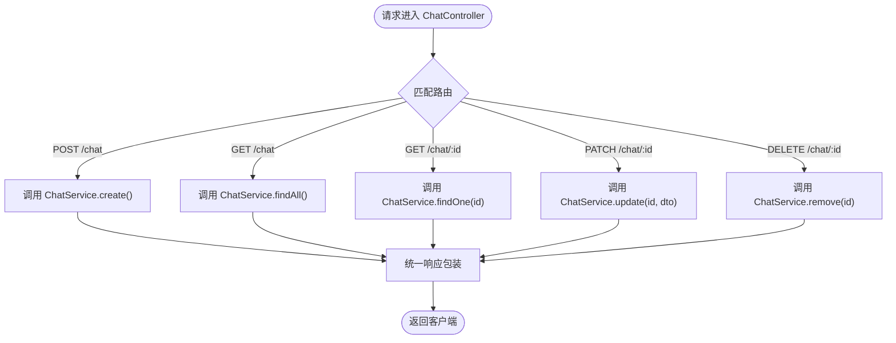
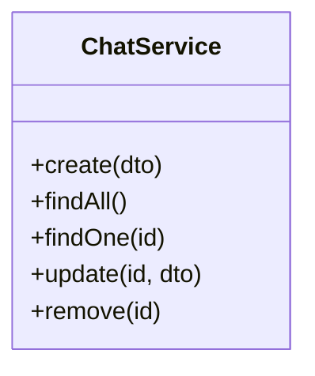
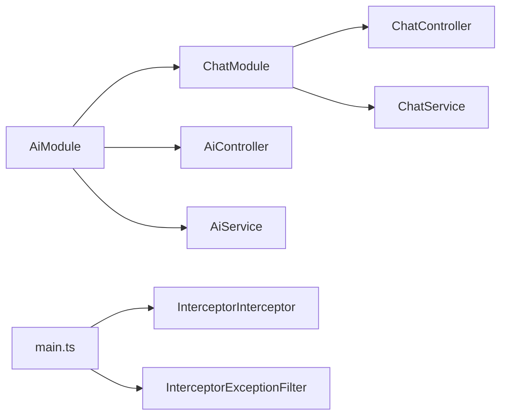
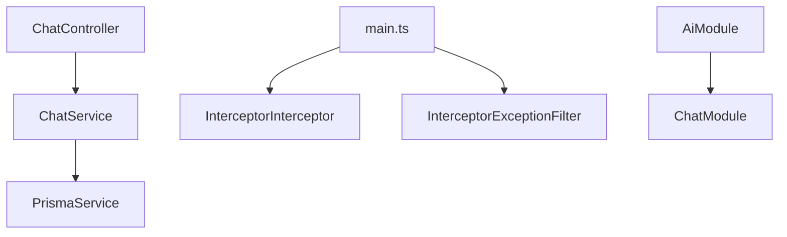

# 聊天管理模块

<cite>
**本文档引用的文件**
- [chat.controller.ts](file://server/apps/ai/src/chat/chat.controller.ts)
- [chat.service.ts](file://server/apps/ai/src/chat/chat.service.ts)
- [chat.module.ts](file://server/apps/ai/src/chat/chat.module.ts)
- [chat.entity.ts](file://server/apps/ai/src/chat/entities/chat.entity.ts)
- [create-chat.dto.ts](file://server/apps/ai/src/chat/dto/create-chat.dto.ts)
- [update-chat.dto.ts](file://server/apps/ai/src/chat/dto/update-chat.dto.ts)
- [ai.module.ts](file://server/apps/ai/src/ai.module.ts)
- [main.ts](file://server/apps/ai/src/main.ts)
- [prisma.service.ts](file://server/libs/shared/src/prisma/prisma.service.ts)
- [schema.prisma](file://server/prisma/schema.prisma)
- [shared.module.ts](file://server/libs/shared/src/shared.module.ts)
- [interceptor.ts](file://server/libs/shared/src/interceptor/interceptor.ts)
- [exceptionFilter.ts](file://server/libs/shared/src/interceptor/exceptionFilter.ts)
- [ai.controller.ts](file://server/apps/ai/src/ai.controller.ts)
- [ai.service.ts](file://server/apps/ai/src/ai.service.ts)
</cite>

## 目录
1. [简介](#简介)
2. [项目结构](#项目结构)
3. [核心组件](#核心组件)
4. [架构总览](#架构总览)
5. [详细组件分析](#详细组件分析)
6. [依赖分析](#依赖分析)
7. [性能考虑](#性能考虑)
8. [故障排除指南](#故障排除指南)
9. [结论](#结论)
10. [附录](#附录)

## 简介
本文件面向AI智能问答服务中的聊天管理模块，系统化梳理其架构设计、模块配置、控制器与业务服务实现、数据模型与DTO设计、API接口规范、以及消息存储与状态管理等关键要素。文档同时提供使用示例与最佳实践建议，帮助开发者快速理解并扩展该模块。

## 项目结构
聊天管理模块位于服务端应用的AI子域中，采用NestJS标准分层组织：控制器负责HTTP路由与请求处理，服务封装业务逻辑，DTO进行输入校验与数据传输，实体用于ORM映射（当前为空壳，后续可扩展）。模块通过依赖注入整合控制器与服务；全局拦截器与异常过滤器统一输出格式与错误处理；Prisma作为ORM连接PostgreSQL数据库。

**图表来源**
- [ai.module.ts:1-12](file://server/apps/ai/src/ai.module.ts#L1-L12)
- [chat.module.ts:1-10](file://server/apps/ai/src/chat/chat.module.ts#L1-L10)
- [chat.controller.ts:1-35](file://server/apps/ai/src/chat/chat.controller.ts#L1-L35)
- [chat.service.ts:1-27](file://server/apps/ai/src/chat/chat.service.ts#L1-L27)
- [shared.module.ts:1-13](file://server/libs/shared/src/shared.module.ts#L1-L13)
- [prisma.service.ts:1-18](file://server/libs/shared/src/prisma/prisma.service.ts#L1-L18)

**章节来源**
- [ai.module.ts:1-12](file://server/apps/ai/src/ai.module.ts#L1-L12)
- [chat.module.ts:1-10](file://server/apps/ai/src/chat/chat.module.ts#L1-L10)
- [main.ts:1-14](file://server/apps/ai/src/main.ts#L1-L14)

## 核心组件
- 控制器：定义REST接口，接收请求参数，调用服务层执行业务逻辑，并返回标准化响应。
- 服务层：封装聊天的增删改查等业务逻辑，未来可接入Prisma进行持久化。
- DTO：定义创建与更新时的输入结构与校验规则，支持部分更新。
- 实体：当前为空壳，后续可映射到数据库表结构。
- 全局拦截器与异常过滤器：统一响应体结构与错误处理。
- Prisma服务：提供PostgreSQL连接与客户端实例。

**章节来源**
- [chat.controller.ts:1-35](file://server/apps/ai/src/chat/chat.controller.ts#L1-L35)
- [chat.service.ts:1-27](file://server/apps/ai/src/chat/chat.service.ts#L1-L27)
- [create-chat.dto.ts:1-2](file://server/apps/ai/src/chat/dto/create-chat.dto.ts#L1-L2)
- [update-chat.dto.ts:1-5](file://server/apps/ai/src/chat/dto/update-chat.dto.ts#L1-L5)
- [chat.entity.ts:1-2](file://server/apps/ai/src/chat/entities/chat.entity.ts#L1-L2)
- [interceptor.ts:1-86](file://server/libs/shared/src/interceptor/interceptor.ts#L1-L86)
- [exceptionFilter.ts:1-23](file://server/libs/shared/src/interceptor/exceptionFilter.ts#L1-L23)
- [prisma.service.ts:1-18](file://server/libs/shared/src/prisma/prisma.service.ts#L1-L18)

## 架构总览
下图展示从HTTP请求到响应的完整链路，包括路由分发、控制器处理、服务执行、ORM交互以及统一响应包装与异常处理。

**图表来源**
- [main.ts:1-14](file://server/apps/ai/src/main.ts#L1-L14)
- [ai.module.ts:1-12](file://server/apps/ai/src/ai.module.ts#L1-L12)
- [chat.controller.ts:1-35](file://server/apps/ai/src/chat/chat.controller.ts#L1-L35)
- [chat.service.ts:1-27](file://server/apps/ai/src/chat/chat.service.ts#L1-L27)
- [prisma.service.ts:1-18](file://server/libs/shared/src/prisma/prisma.service.ts#L1-L18)
- [interceptor.ts:1-86](file://server/libs/shared/src/interceptor/interceptor.ts#L1-L86)
- [exceptionFilter.ts:1-23](file://server/libs/shared/src/interceptor/exceptionFilter.ts#L1-L23)

## 详细组件分析

### 数据模型与实体
- 当前实体类为空壳，尚未映射到数据库表。后续可在实体中定义字段、注解与关系，结合Prisma Schema生成客户端并完成ORM绑定。
- Prisma Schema中定义了丰富的业务模型（如用户、单词、支付等），但聊天相关模型需在Schema中新增或复用现有模型。

**图表来源**
- [chat.entity.ts:1-2](file://server/apps/ai/src/chat/entities/chat.entity.ts#L1-L2)

**章节来源**
- [chat.entity.ts:1-2](file://server/apps/ai/src/chat/entities/chat.entity.ts#L1-L2)
- [schema.prisma:1-133](file://server/prisma/schema.prisma#L1-L133)

### DTO 设计与验证规则
- CreateChatDto：定义创建聊天所需的输入字段集合（当前为空，后续应加入必填与可选字段）。
- UpdateChatDto：基于PartialType继承CreateChatDto，允许部分字段更新。
- 建议在DTO中引入NestJS内置或自定义验证装饰器，确保输入合法性与业务一致性。

**图表来源**
- [create-chat.dto.ts:1-2](file://server/apps/ai/src/chat/dto/create-chat.dto.ts#L1-L2)
- [update-chat.dto.ts:1-5](file://server/apps/ai/src/chat/dto/update-chat.dto.ts#L1-L5)

**章节来源**
- [create-chat.dto.ts:1-2](file://server/apps/ai/src/chat/dto/create-chat.dto.ts#L1-L2)
- [update-chat.dto.ts:1-5](file://server/apps/ai/src/chat/dto/update-chat.dto.ts#L1-L5)

### 控制器 API 接口
- 路由前缀：/chat
- 方法与路径：
  - POST /chat：创建聊天
  - GET /chat：查询所有聊天
  - GET /chat/:id：按ID查询单个聊天
  - PATCH /chat/:id：按ID更新聊天
  - DELETE /chat/:id：按ID删除聊天
- 参数与响应：
  - 路径参数：id（字符串，控制器内部转换为数字）
  - 请求体：CreateChatDto 或 UpdateChatDto
  - 响应：经统一拦截器包装后的标准结构（包含时间戳、路径、消息、状态码、成功标志与数据）

**图表来源**
- [chat.controller.ts:1-35](file://server/apps/ai/src/chat/chat.controller.ts#L1-L35)
- [interceptor.ts:1-86](file://server/libs/shared/src/interceptor/interceptor.ts#L1-L86)

**章节来源**
- [chat.controller.ts:1-35](file://server/apps/ai/src/chat/chat.controller.ts#L1-L35)
- [interceptor.ts:1-86](file://server/libs/shared/src/interceptor/interceptor.ts#L1-L86)

### 服务层业务逻辑
- 当前服务层仅返回占位字符串，未接入数据库或外部AI服务。
- 建议的服务职责：
  - create：接收CreateChatDto，进行必要校验与默认值填充，调用ORM保存并返回新记录。
  - findAll：查询聊天列表，支持分页、排序与筛选。
  - findOne：按ID查询并返回单条记录。
  - update：按ID更新，使用UpdateChatDto的部分字段进行PATCH式更新。
  - remove：按ID删除记录。
- 状态管理：可在实体中增加状态字段（如进行中、已完成、已取消），并在服务层维护状态流转。

**图表来源**
- [chat.service.ts:1-27](file://server/apps/ai/src/chat/chat.service.ts#L1-L27)

**章节来源**
- [chat.service.ts:1-27](file://server/apps/ai/src/chat/chat.service.ts#L1-L27)

### 模块与依赖注入
- ChatModule：声明控制器与服务，供AiModule导入。
- AiModule：导入ChatModule，注册AI相关控制器与服务。
- 全局注册：main.ts中注册拦截器与异常过滤器，统一处理所有请求。

**图表来源**
- [chat.module.ts:1-10](file://server/apps/ai/src/chat/chat.module.ts#L1-L10)
- [ai.module.ts:1-12](file://server/apps/ai/src/ai.module.ts#L1-L12)
- [main.ts:1-14](file://server/apps/ai/src/main.ts#L1-L14)

**章节来源**
- [chat.module.ts:1-10](file://server/apps/ai/src/chat/chat.module.ts#L1-L10)
- [ai.module.ts:1-12](file://server/apps/ai/src/ai.module.ts#L1-L12)
- [main.ts:1-14](file://server/apps/ai/src/main.ts#L1-L14)

## 依赖分析
- 控制器依赖服务：ChatController通过构造函数注入ChatService。
- 服务依赖ORM：ChatService未来将依赖PrismaService访问数据库。
- 全局中间件：拦截器负责统一响应包装；异常过滤器负责HTTP异常标准化输出。
- 模块依赖：AiModule导入ChatModule，形成父子模块关系。

**图表来源**
- [chat.controller.ts:1-35](file://server/apps/ai/src/chat/chat.controller.ts#L1-L35)
- [chat.service.ts:1-27](file://server/apps/ai/src/chat/chat.service.ts#L1-L27)
- [prisma.service.ts:1-18](file://server/libs/shared/src/prisma/prisma.service.ts#L1-L18)
- [main.ts:1-14](file://server/apps/ai/src/main.ts#L1-L14)
- [ai.module.ts:1-12](file://server/apps/ai/src/ai.module.ts#L1-L12)
- [chat.module.ts:1-10](file://server/apps/ai/src/chat/chat.module.ts#L1-L10)

**章节来源**
- [chat.controller.ts:1-35](file://server/apps/ai/src/chat/chat.controller.ts#L1-L35)
- [chat.service.ts:1-27](file://server/apps/ai/src/chat/chat.service.ts#L1-L27)
- [prisma.service.ts:1-18](file://server/libs/shared/src/prisma/prisma.service.ts#L1-L18)
- [main.ts:1-14](file://server/apps/ai/src/main.ts#L1-L14)
- [ai.module.ts:1-12](file://server/apps/ai/src/ai.module.ts#L1-L12)
- [chat.module.ts:1-10](file://server/apps/ai/src/chat/chat.module.ts#L1-L10)

## 性能考虑
- 响应序列化：拦截器会对响应进行标准化与大数据类型转换（如bigint转字符串），避免JSON序列化问题。
- 异常处理：统一的异常过滤器减少重复代码，提升错误处理一致性。
- ORM优化：建议在Prisma中启用查询优化、索引与事务控制，避免N+1查询与长事务。
- 缓存策略：对于高频读取的聊天元信息，可引入缓存层降低数据库压力。
- 并发控制：在高并发场景下，注意ID生成策略与唯一性约束，避免冲突。

## 故障排除指南
- 响应格式异常：确认是否被拦截器包装，检查返回对象是否包含message、code、data字段。
- HTTP异常：异常过滤器会将异常状态码与消息标准化输出，便于前端统一处理。
- 数据库连接：检查环境变量DATABASE_URL与Prisma适配器配置，确保连接可用。
- 类型转换问题：拦截器会将bigint转换为字符串，避免前端解析错误。

**章节来源**
- [interceptor.ts:1-86](file://server/libs/shared/src/interceptor/interceptor.ts#L1-L86)
- [exceptionFilter.ts:1-23](file://server/libs/shared/src/interceptor/exceptionFilter.ts#L1-L23)
- [prisma.service.ts:1-18](file://server/libs/shared/src/prisma/prisma.service.ts#L1-L18)

## 结论
聊天管理模块目前具备清晰的分层结构与标准化的响应/异常处理机制，但业务逻辑与数据持久化仍处于待实现阶段。建议尽快完善实体与DTO定义、接入Prisma并实现服务层的核心CRUD与状态管理逻辑，以满足AI问答场景下的聊天生命周期管理需求。

## 附录

### 使用示例与最佳实践
- 创建聊天
  - 方法：POST /chat
  - 请求体：CreateChatDto（建议包含用户标识、标题、初始消息等字段）
  - 响应：标准化响应体，包含新建聊天的标识与基本信息
- 查询聊天
  - 方法：GET /chat
  - 查询参数：分页、排序、筛选（建议在服务层实现）
  - 响应：标准化数组或分页对象
- 获取单个聊天
  - 方法：GET /chat/:id
  - 响应：标准化对象
- 更新聊天
  - 方法：PATCH /chat/:id
  - 请求体：UpdateChatDto（部分字段）
  - 响应：标准化对象
- 删除聊天
  - 方法：DELETE /chat/:id
  - 响应：标准化布尔或空对象
- 最佳实践
  - 在DTO中添加字段级校验与业务规则
  - 在服务层实现幂等性与事务边界
  - 对敏感字段进行脱敏与权限控制
  - 使用分页与索引优化查询性能
  - 通过拦截器与异常过滤器保持一致的用户体验