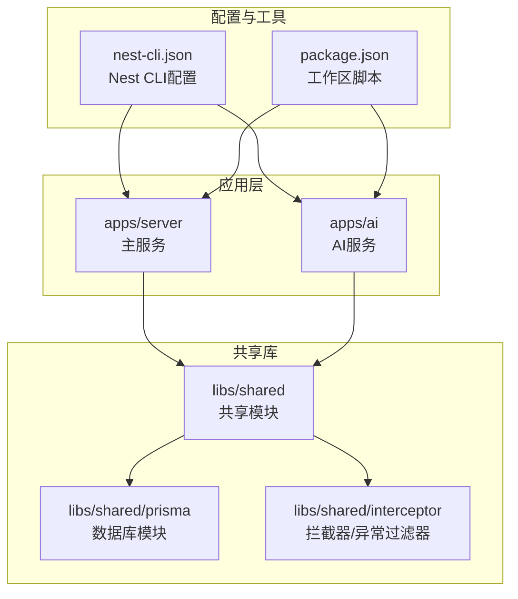
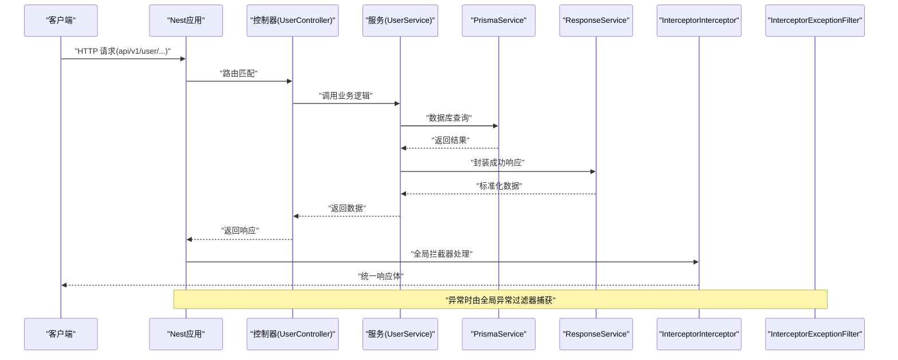
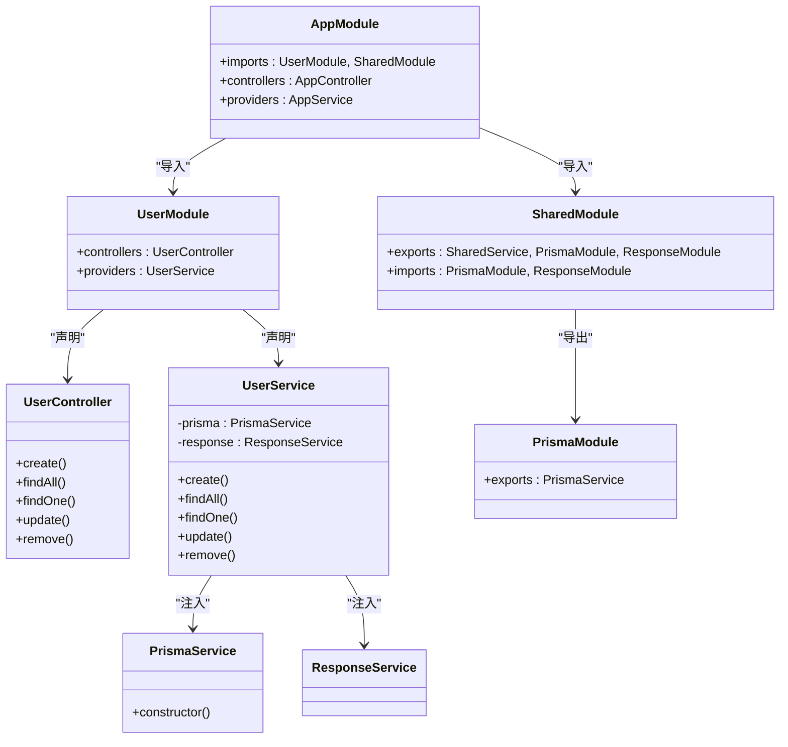
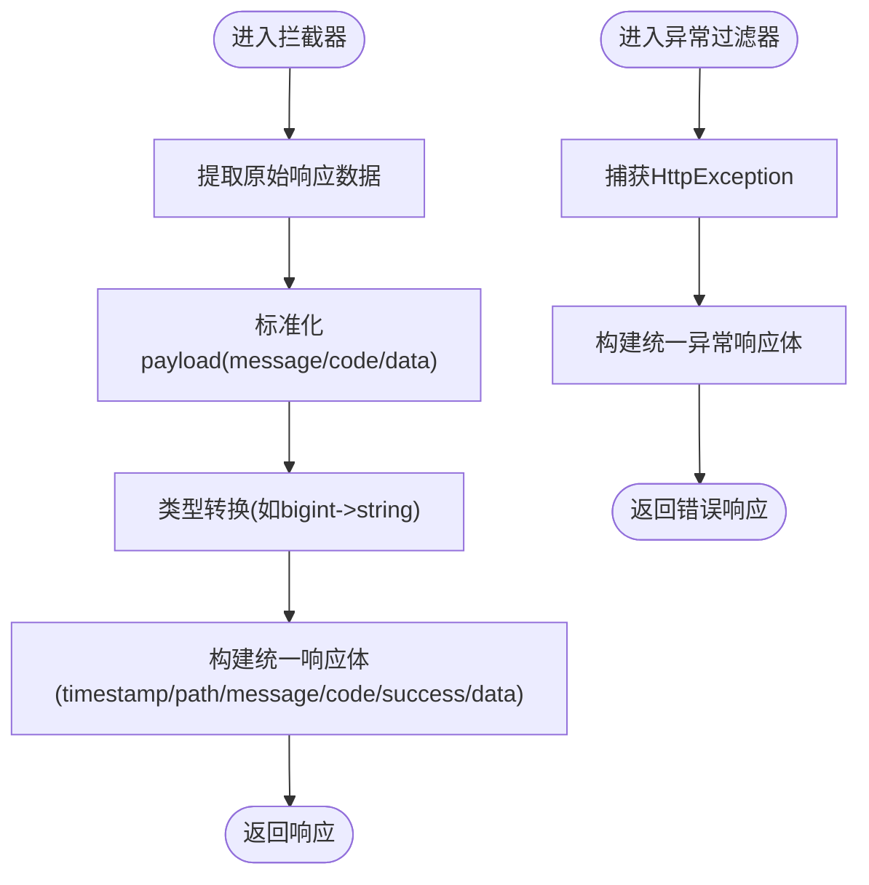
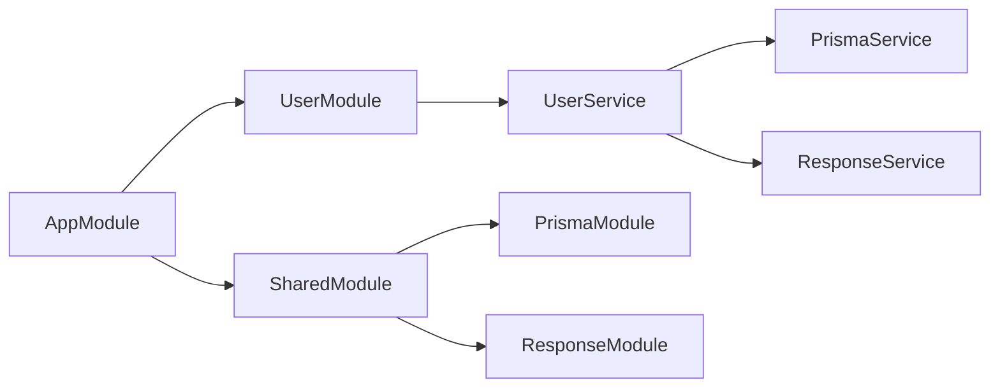

# NestJS框架架构

<cite>
**本文档引用的文件**
- [apps/server/src/main.ts](file://server/apps/server/src/main.ts)
- [apps/server/src/app.module.ts](file://server/apps/server/src/app.module.ts)
- [apps/server/src/app.controller.ts](file://server/apps/server/src/app.controller.ts)
- [apps/server/src/user/user.module.ts](file://server/apps/server/src/user/user.module.ts)
- [apps/server/src/user/user.controller.ts](file://server/apps/server/src/user/user.controller.ts)
- [apps/server/src/user/user.service.ts](file://server/apps/server/src/user/user.service.ts)
- [apps/ai/src/main.ts](file://server/apps/ai/src/main.ts)
- [libs/shared/src/shared.module.ts](file://server/libs/shared/src/shared.module.ts)
- [libs/shared/src/prisma/prisma.module.ts](file://server/libs/shared/src/prisma/prisma.module.ts)
- [libs/shared/src/prisma/prisma.service.ts](file://server/libs/shared/src/prisma/prisma.service.ts)
- [libs/shared/src/interceptor/interceptor.ts](file://server/libs/shared/src/interceptor/interceptor.ts)
- [libs/shared/src/interceptor/exceptionFilter.ts](file://server/libs/shared/src/interceptor/exceptionFilter.ts)
- [nest-cli.json](file://server/nest-cli.json)
- [package.json](file://package.json)
</cite>

## 目录
1. [引言](#引言)
2. [项目结构](#项目结构)
3. [核心组件](#核心组件)
4. [架构总览](#架构总览)
5. [详细组件分析](#详细组件分析)
6. [依赖关系分析](#依赖关系分析)
7. [性能考虑](#性能考虑)
8. [故障排除指南](#故障排除指南)
9. [结论](#结论)
10. [附录](#附录)

## 引言
本文件面向英语学习平台的NestJS后端架构，系统性阐述其模块化体系、依赖注入机制、版本控制与路由前缀策略、全局拦截器与异常过滤器、配置管理、CLI与Monorepo组织方式、以及初始化流程与生命周期管理。文档同时提供性能优化建议与常见问题排查方法，帮助开发者高效构建与维护该平台。

## 项目结构
该项目采用多包（Monorepo）结构，通过Nest CLI进行统一管理。主要目录包括：
- apps：应用层，包含server主服务与ai子服务
- libs/shared：共享库，封装通用拦截器、异常过滤器、数据库适配与响应包装等
- 根目录：工作区与脚本配置

图表来源
- [nest-cli.json:14-42](file://server/nest-cli.json#L14-L42)
- [apps/server/src/app.module.ts:4-8](file://server/apps/server/src/app.module.ts#L4-L8)
- [apps/ai/src/main.ts:1-14](file://server/apps/ai/src/main.ts#L1-L14)

章节来源
- [nest-cli.json:1-43](file://server/nest-cli.json#L1-L43)
- [package.json:1-15](file://package.json#L1-L15)

## 核心组件
- 应用入口与启动流程
  - server主服务入口负责创建应用实例、注册全局拦截器与异常过滤器、设置全局前缀与URI版本控制、监听端口。
  - ai子服务入口复用相同模式，独立监听端口。
- 模块化与依赖注入
  - AppModule导入UserModule与SharedModule；SharedModule为全局模块，导出PrismaModule与ResponseModule供其他模块使用。
  - UserModule定义控制器与服务，服务通过构造函数注入PrismaService与ResponseService。
- 共享能力
  - InterceptorInterceptor：统一响应体格式、处理数据类型转换与标准化。
  - InterceptorExceptionFilter：统一异常响应格式。
  - PrismaService：基于PostgreSQL适配器的Prisma客户端封装。

章节来源
- [apps/server/src/main.ts:8-18](file://server/apps/server/src/main.ts#L8-L18)
- [apps/ai/src/main.ts:7-12](file://server/apps/ai/src/main.ts#L7-L12)
- [apps/server/src/app.module.ts:7-12](file://server/apps/server/src/app.module.ts#L7-L12)
- [libs/shared/src/shared.module.ts:6-12](file://server/libs/shared/src/shared.module.ts#L6-L12)
- [apps/server/src/user/user.module.ts:5-9](file://server/apps/server/src/user/user.module.ts#L5-L9)
- [apps/server/src/user/user.service.ts:9-12](file://server/apps/server/src/user/user.service.ts#L9-L12)
- [libs/shared/src/interceptor/interceptor.ts:59-85](file://server/libs/shared/src/interceptor/interceptor.ts#L59-L85)
- [libs/shared/src/interceptor/exceptionFilter.ts:8-22](file://server/libs/shared/src/interceptor/exceptionFilter.ts#L8-L22)
- [libs/shared/src/prisma/prisma.service.ts:6-17](file://server/libs/shared/src/prisma/prisma.service.ts#L6-L17)

## 架构总览
下图展示了应用启动、请求处理与错误处理的关键路径，体现全局拦截器与异常过滤器的作用范围。

图表来源
- [apps/server/src/main.ts:10-11](file://server/apps/server/src/main.ts#L10-L11)
- [apps/server/src/user/user.controller.ts:6-34](file://server/apps/server/src/user/user.controller.ts#L6-L34)
- [apps/server/src/user/user.service.ts:17-19](file://server/apps/server/src/user/user.service.ts#L17-L19)
- [libs/shared/src/interceptor/interceptor.ts:64-84](file://server/libs/shared/src/interceptor/interceptor.ts#L64-L84)
- [libs/shared/src/interceptor/exceptionFilter.ts:10-21](file://server/libs/shared/src/interceptor/exceptionFilter.ts#L10-L21)

## 详细组件分析

### 应用入口与启动配置
- 启动流程
  - 使用NestFactory创建应用根模块AppModule。
  - 注册全局拦截器与异常过滤器，确保所有路由均受统一处理。
  - 设置全局前缀与URI版本控制策略，默认版本为v1。
  - 从配置模块读取端口号并启动服务。
- ai子服务
  - 复用相同的拦截器与异常过滤器注册策略，独立监听端口。

章节来源
- [apps/server/src/main.ts:8-18](file://server/apps/server/src/main.ts#L8-L18)
- [apps/ai/src/main.ts:7-12](file://server/apps/ai/src/main.ts#L7-L12)

### 模块化与依赖注入
- AppModule
  - 导入UserModule与SharedModule，声明AppController，提供AppService。
- UserModule
  - 定义UserController与UserService，控制器通过构造函数注入服务。
- SharedModule
  - 声明为@Global()，导出PrismaModule与ResponseModule，供其他模块按需使用。
- 依赖注入链路
  - UserService在构造函数中注入PrismaService与ResponseService，实现业务与数据访问解耦。

图表来源
- [apps/server/src/app.module.ts:7-12](file://server/apps/server/src/app.module.ts#L7-L12)
- [apps/server/src/user/user.module.ts:5-9](file://server/apps/server/src/user/user.module.ts#L5-L9)
- [apps/server/src/user/user.controller.ts:6-34](file://server/apps/server/src/user/user.controller.ts#L6-L34)
- [apps/server/src/user/user.service.ts:9-12](file://server/apps/server/src/user/user.service.ts#L9-L12)
- [libs/shared/src/shared.module.ts:6-12](file://server/libs/shared/src/shared.module.ts#L6-L12)
- [libs/shared/src/prisma/prisma.module.ts:4-8](file://server/libs/shared/src/prisma/prisma.module.ts#L4-L8)
- [libs/shared/src/prisma/prisma.service.ts:6-17](file://server/libs/shared/src/prisma/prisma.service.ts#L6-L17)

章节来源
- [apps/server/src/app.module.ts:7-12](file://server/apps/server/src/app.module.ts#L7-L12)
- [apps/server/src/user/user.module.ts:5-9](file://server/apps/server/src/user/user.module.ts#L5-L9)
- [apps/server/src/user/user.controller.ts:6-34](file://server/apps/server/src/user/user.controller.ts#L6-L34)
- [apps/server/src/user/user.service.ts:9-12](file://server/apps/server/src/user/user.service.ts#L9-L12)
- [libs/shared/src/shared.module.ts:6-12](file://server/libs/shared/src/shared.module.ts#L6-L12)
- [libs/shared/src/prisma/prisma.module.ts:4-8](file://server/libs/shared/src/prisma/prisma.module.ts#L4-L8)
- [libs/shared/src/prisma/prisma.service.ts:6-17](file://server/libs/shared/src/prisma/prisma.service.ts#L6-L17)

### 全局拦截器与异常过滤器
- InterceptorInterceptor
  - 统一响应体字段：时间戳、路径、消息、状态码、成功标志与数据。
  - 对响应数据进行标准化与类型转换（如bigint转字符串），保证前端一致消费。
- InterceptorExceptionFilter
  - 捕获HttpException，输出统一异常响应体，包含时间戳、路径、消息与状态码。

图表来源
- [libs/shared/src/interceptor/interceptor.ts:28-84](file://server/libs/shared/src/interceptor/interceptor.ts#L28-L84)
- [libs/shared/src/interceptor/exceptionFilter.ts:10-21](file://server/libs/shared/src/interceptor/exceptionFilter.ts#L10-L21)

章节来源
- [libs/shared/src/interceptor/interceptor.ts:59-85](file://server/libs/shared/src/interceptor/interceptor.ts#L59-L85)
- [libs/shared/src/interceptor/exceptionFilter.ts:8-22](file://server/libs/shared/src/interceptor/exceptionFilter.ts#L8-L22)
- [apps/server/src/main.ts:10-11](file://server/apps/server/src/main.ts#L10-L11)
- [apps/ai/src/main.ts:9-10](file://server/apps/ai/src/main.ts#L9-L10)

### 数据访问与配置
- PrismaService
  - 基于PostgreSQL适配器创建PrismaClient，连接字符串来自环境变量。
- 配置管理
  - 应用通过配置模块读取端口等参数，实现环境解耦。

章节来源
- [libs/shared/src/prisma/prisma.service.ts:6-17](file://server/libs/shared/src/prisma/prisma.service.ts#L6-L17)
- [apps/server/src/main.ts:17](file://server/apps/server/src/main.ts#L17)
- [apps/ai/src/main.ts:11](file://server/apps/ai/src/main.ts#L11)

### 路由前缀与版本控制
- 全局前缀
  - 在应用入口设置全局前缀为“api”，所有路由自动带上该前缀。
- URI版本控制
  - 启用URI版本控制策略，设置默认版本为“1”，便于未来演进与向后兼容。

章节来源
- [apps/server/src/main.ts:12-16](file://server/apps/server/src/main.ts#L12-L16)

### CLI与Monorepo组织
- Nest CLI配置
  - 指定sourceRoot与tsConfigPath，支持多项目（server、ai、shared）。
  - monorepo启用，根目录为apps/server。
- 工作区脚本
  - 提供web、server、ai与all脚本，便于本地并行开发。

章节来源
- [nest-cli.json:1-43](file://server/nest-cli.json#L1-L43)
- [package.json:2-7](file://package.json#L2-L7)

## 依赖关系分析
- 模块间依赖
  - AppModule依赖UserModule与SharedModule。
  - UserModule依赖SharedModule中的PrismaModule与ResponseModule。
  - SharedModule为全局模块，导出PrismaService与ResponseService。
- 运行时依赖
  - 控制器依赖服务，服务依赖PrismaService与ResponseService。
  - 全局拦截器与异常过滤器作用于所有路由。

图表来源
- [apps/server/src/app.module.ts:7-12](file://server/apps/server/src/app.module.ts#L7-L12)
- [apps/server/src/user/user.module.ts:5-9](file://server/apps/server/src/user/user.module.ts#L5-L9)
- [apps/server/src/user/user.service.ts:9-12](file://server/apps/server/src/user/user.service.ts#L9-L12)
- [libs/shared/src/shared.module.ts:6-12](file://server/libs/shared/src/shared.module.ts#L6-L12)

章节来源
- [apps/server/src/app.module.ts:7-12](file://server/apps/server/src/app.module.ts#L7-L12)
- [apps/server/src/user/user.module.ts:5-9](file://server/apps/server/src/user/user.module.ts#L5-L9)
- [apps/server/src/user/user.service.ts:9-12](file://server/apps/server/src/user/user.service.ts#L9-L12)
- [libs/shared/src/shared.module.ts:6-12](file://server/libs/shared/src/shared.module.ts#L6-L12)

## 性能考虑
- 响应体标准化与类型转换
  - 在拦截器中对响应数据进行标准化与类型转换，减少前端处理成本，提升一致性。
- 全局拦截器与异常过滤器
  - 统一处理逻辑避免重复代码，降低维护成本，同时可作为性能优化的集中点。
- 数据库访问
  - 通过PrismaService进行数据访问，建议结合查询优化与索引策略，避免N+1查询。
- 版本控制与前缀
  - URI版本控制与全局前缀有助于路由清晰与缓存策略制定，减少不必要的重定向与解析开销。

## 故障排除指南
- 端口占用或不可用
  - 检查配置模块提供的端口值是否被占用，必要时修改配置或选择其他端口。
- 数据库连接失败
  - 确认DATABASE_URL环境变量正确，检查PostgreSQL服务可用性与网络连通性。
- 路由未带前缀或版本不生效
  - 确认应用入口已设置全局前缀与URI版本控制，且客户端请求遵循相应规则。
- 全局拦截器/异常过滤器未生效
  - 确认已在应用入口注册全局拦截器与异常过滤器，且未被局部覆盖。

章节来源
- [apps/server/src/main.ts:12-17](file://server/apps/server/src/main.ts#L12-L17)
- [libs/shared/src/prisma/prisma.service.ts:9-11](file://server/libs/shared/src/prisma/prisma.service.ts#L9-L11)
- [libs/shared/src/interceptor/exceptionFilter.ts:10-21](file://server/libs/shared/src/interceptor/exceptionFilter.ts#L10-L21)

## 结论
该英语学习平台采用清晰的Monorepo与模块化架构，借助NestJS的依赖注入、全局拦截器与异常过滤器，实现了统一的响应与错误处理策略。通过URI版本控制与全局前缀，提升了API演进的可控性与可维护性。配合Prisma数据库适配器与共享模块，系统具备良好的扩展性与性能基础。建议在后续迭代中持续完善日志监控、缓存策略与安全防护，以支撑更大规模的用户增长。

## 附录
- 开发与运行
  - 使用工作区脚本并行启动前端与后端服务，便于联调与快速迭代。
- 最佳实践
  - 保持模块职责单一，服务内聚，共享能力集中在SharedModule。
  - 在拦截器中统一处理数据类型转换与序列化，减少控制器与服务的样板代码。
  - 为每个功能域预留独立模块，便于团队协作与边界划分。