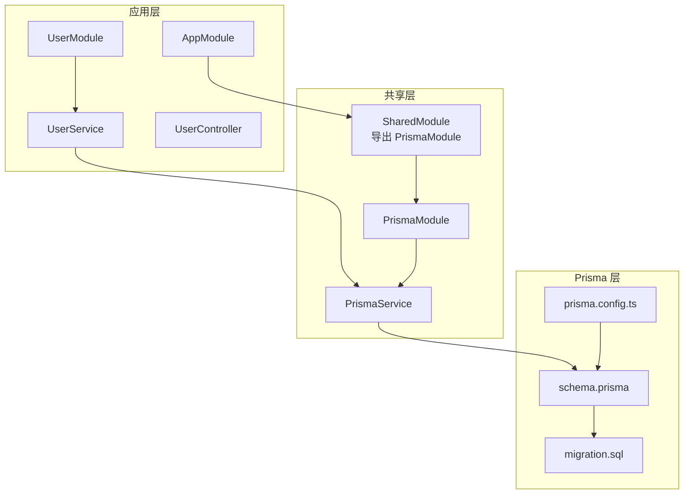
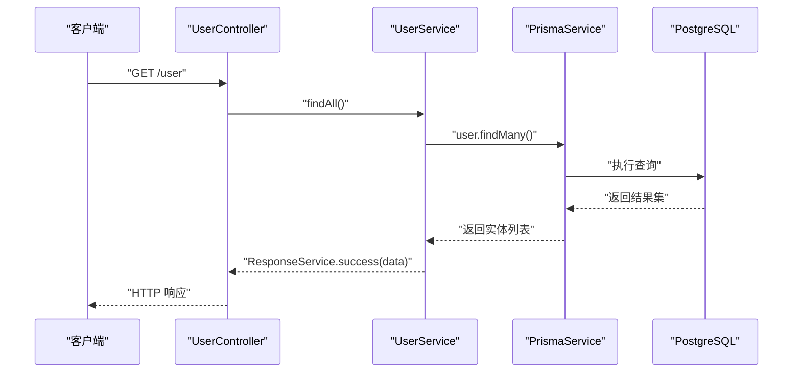
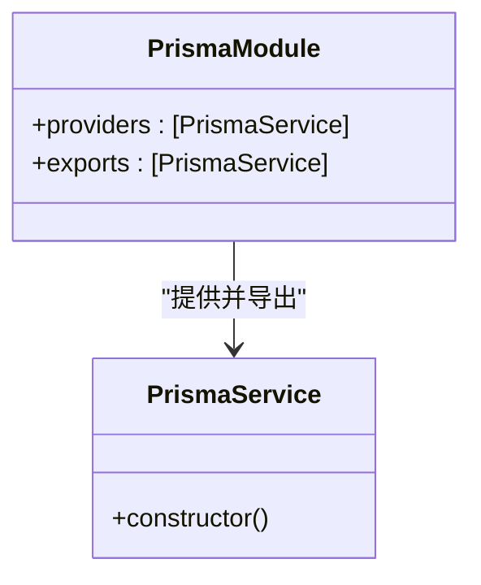
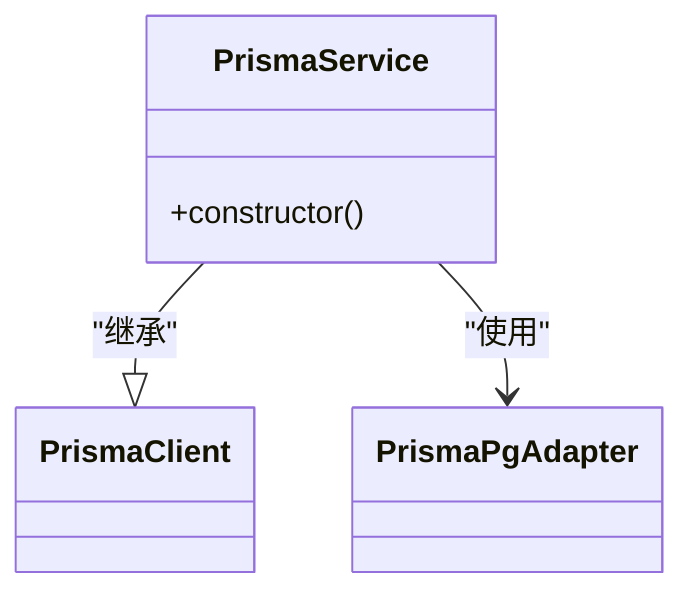
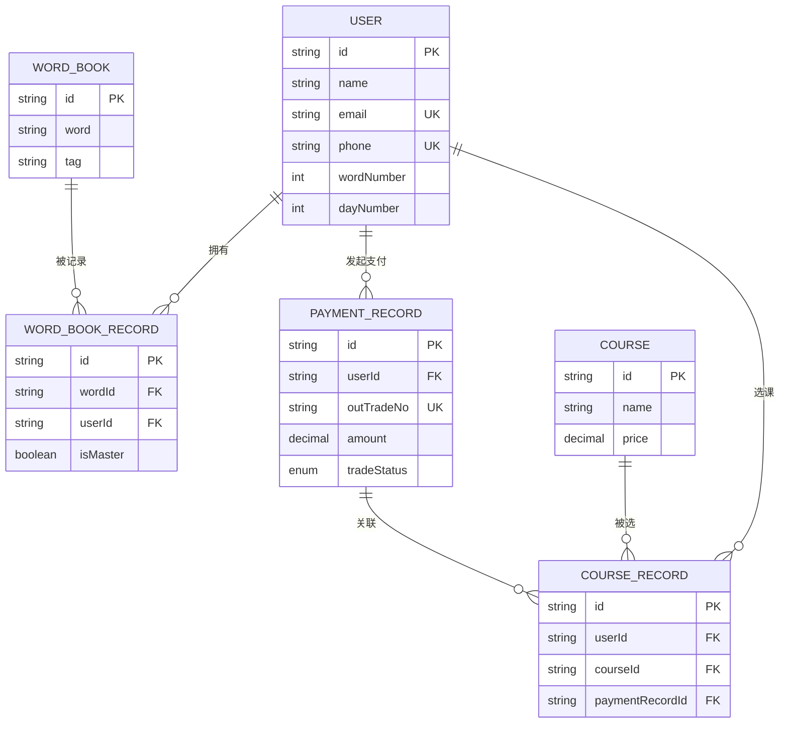
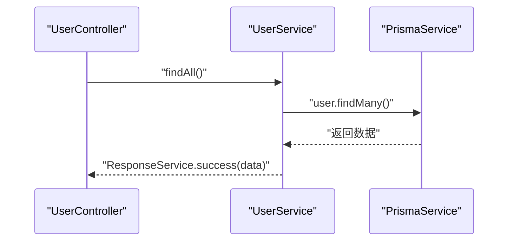
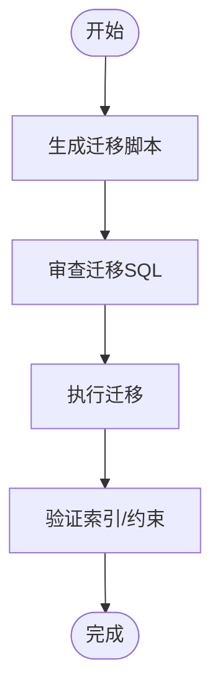
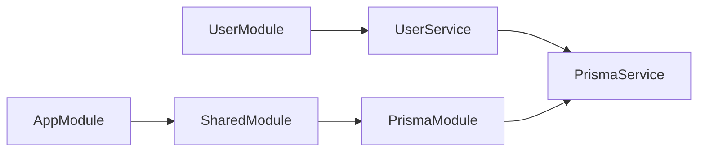

# Prisma数据库集成

<cite>
**本文引用的文件**
- [prisma.module.ts](file://server/libs/shared/src/prisma/prisma.module.ts)
- [prisma.service.ts](file://server/libs/shared/src/prisma/prisma.service.ts)
- [shared.module.ts](file://server/libs/shared/src/shared.module.ts)
- [schema.prisma](file://server/prisma/schema.prisma)
- [migration.sql](file://server/prisma/migrations/20260513053954_init/migration.sql)
- [prisma.config.ts](file://server/prisma.config.ts)
- [app.module.ts](file://server/apps/server/src/app.module.ts)
- [user.service.ts](file://server/apps/server/src/user/user.service.ts)
- [user.controller.ts](file://server/apps/server/src/user/user.controller.ts)
- [create-user.dto.ts](file://server/apps/server/src/user/dto/create-user.dto.ts)
- [update-user.dto.ts](file://server/apps/server/src/user/dto/update-user.dto.ts)
- [app.service.ts](file://server/apps/server/src/app.service.ts)
</cite>

## 目录
1. [简介](#简介)
2. [项目结构](#项目结构)
3. [核心组件](#核心组件)
4. [架构总览](#架构总览)
5. [详细组件分析](#详细组件分析)
6. [依赖分析](#依赖分析)
7. [性能考虑](#性能考虑)
8. [故障排查指南](#故障排查指南)
9. [结论](#结论)
10. [附录](#附录)

## 简介
本文件面向英语学习平台的后端服务，系统化阐述基于 NestJS 的 Prisma 数据库集成方案。重点覆盖以下方面：
- PrismaModule 的模块设计与导出机制
- PrismaService 的服务实现、查询封装与事务处理能力
- Prisma ORM 的模型映射、关系查询与索引策略
- 数据库迁移策略与连接配置
- 连接重试与性能优化建议
- 常见问题定位与解决思路

## 项目结构
该工程采用多包/多应用的组织方式，数据库访问通过共享模块统一提供。关键位置如下：
- 共享模块：在 libs/shared 下提供 PrismaModule 和 PrismaService，并向全局导出
- 应用模块：在 apps/server 下的应用（如 user）通过注入 PrismaService 使用数据库
- Prisma 配置：在 server/prisma 下维护 schema.prisma、迁移脚本与 prisma.config.ts
- 运行时环境：通过 .env 加载 DATABASE_URL 等配置

**图表来源**
- [shared.module.ts:1-13](file://server/libs/shared/src/shared.module.ts#L1-L13)
- [prisma.module.ts:1-9](file://server/libs/shared/src/prisma/prisma.module.ts#L1-L9)
- [prisma.service.ts:1-18](file://server/libs/shared/src/prisma/prisma.service.ts#L1-L18)
- [schema.prisma:1-133](file://server/prisma/schema.prisma#L1-L133)
- [migration.sql:1-151](file://server/prisma/migrations/20260513053954_init/migration.sql#L1-L151)
- [prisma.config.ts:1-15](file://server/prisma.config.ts#L1-L15)

**章节来源**
- [shared.module.ts:1-13](file://server/libs/shared/src/shared.module.ts#L1-L13)
- [prisma.module.ts:1-9](file://server/libs/shared/src/prisma/prisma.module.ts#L1-L9)
- [prisma.service.ts:1-18](file://server/libs/shared/src/prisma/prisma.service.ts#L1-L18)
- [schema.prisma:1-133](file://server/prisma/schema.prisma#L1-L133)
- [prisma.config.ts:1-15](file://server/prisma.config.ts#L1-L15)

## 核心组件
- PrismaModule：作为提供者模块，仅注册并导出 PrismaService，便于其他模块按需注入
- PrismaService：继承 PrismaClient，使用 @prisma/adapter-pg 适配器，从环境变量加载连接字符串
- SharedModule：全局模块，统一导出 PrismaModule 与其他通用模块，确保跨模块可用
- 应用层使用：在控制器或服务中注入 PrismaService，即可进行数据库读写

**章节来源**
- [prisma.module.ts:1-9](file://server/libs/shared/src/prisma/prisma.module.ts#L1-L9)
- [prisma.service.ts:1-18](file://server/libs/shared/src/prisma/prisma.service.ts#L1-L18)
- [shared.module.ts:1-13](file://server/libs/shared/src/shared.module.ts#L1-L13)

## 架构总览
下图展示从应用到数据库的调用链路与数据流：

**图表来源**
- [user.controller.ts:1-35](file://server/apps/server/src/user/user.controller.ts#L1-L35)
- [user.service.ts:1-34](file://server/apps/server/src/user/user.service.ts#L1-L34)
- [prisma.service.ts:1-18](file://server/libs/shared/src/prisma/prisma.service.ts#L1-L18)

## 详细组件分析

### PrismaModule 模块设计
- 角色与职责
  - 作为提供者模块，仅负责注册 PrismaService 并将其导出，供其他模块注入
  - 保持低耦合，避免在模块内直接处理业务逻辑
- 设计要点
  - 无 imports，仅 providers + exports，简化依赖关系
  - 与 SharedModule 组合，形成全局可用的数据访问层

**图表来源**
- [prisma.module.ts:1-9](file://server/libs/shared/src/prisma/prisma.module.ts#L1-L9)
- [prisma.service.ts:1-18](file://server/libs/shared/src/prisma/prisma.service.ts#L1-L18)

**章节来源**
- [prisma.module.ts:1-9](file://server/libs/shared/src/prisma/prisma.module.ts#L1-L9)

### PrismaService 服务实现
- 继承 PrismaClient：复用 Prisma 提供的查询构建器与类型安全能力
- 适配器选择：使用 @prisma/adapter-pg，支持 PostgreSQL
- 连接管理：从环境变量 DATABASE_URL 读取连接串，构造适配器并传入 PrismaClient
- 事务能力：PrismaClient 内置事务 API（如 $transaction），可在服务层按需使用

**图表来源**
- [prisma.service.ts:1-18](file://server/libs/shared/src/prisma/prisma.service.ts#L1-L18)

**章节来源**
- [prisma.service.ts:1-18](file://server/libs/shared/src/prisma/prisma.service.ts#L1-L18)

### 数据模型与关系查询
- 模型概览
  - User：用户信息，包含唯一邮箱与手机号、学习统计字段等
  - WordBook：单词库，包含音标、释义、翻译、词性及各类考试标签
  - WordBookRecord：用户与单词的关联记录，表示是否掌握
  - PaymentRecord：支付记录，包含订单号、金额、状态等
  - Course：课程信息
  - CourseRecord：用户与课程的购买/选课记录，可关联支付记录
- 关系与约束
  - User 与 WordBookRecord：一对多（删除级联）
  - User 与 PaymentRecord：一对多（删除级联）
  - User 与 CourseRecord：一对多（删除级联）
  - WordBookRecord 与 WordBook：多对一（删除级联）
  - CourseRecord 与 PaymentRecord：可选一对一（删除级联）
  - 唯一性与索引：如用户邮箱/手机唯一、单词表的 word/tag 组合索引等
- 查询封装建议
  - 在服务层以 findMany/findUnique 等方法封装常用查询
  - 对复杂联表查询，优先使用 Prisma 的 include/@@include 或 select/@@select 控制字段
  - 对高频查询建立合适索引，减少排序与过滤成本

**图表来源**
- [schema.prisma:24-133](file://server/prisma/schema.prisma#L24-L133)

**章节来源**
- [schema.prisma:24-133](file://server/prisma/schema.prisma#L24-L133)
- [migration.sql:107-151](file://server/prisma/migrations/20260513053954_init/migration.sql#L107-L151)

### 查询方法封装与事务处理
- 封装策略
  - 在 UserService 中注入 PrismaService，将 findMany/findUnique 等调用封装为领域方法
  - 对需要一致性保证的操作，使用 PrismaClient 的 $transaction 包裹
- 示例路径
  - 查询用户列表：[user.service.ts:17-20](file://server/apps/server/src/user/user.service.ts#L17-L20)
  - 注入 PrismaService：[user.service.ts:9-12](file://server/apps/server/src/user/user.service.ts#L9-L12)
  - 控制器路由：[user.controller.ts:15-18](file://server/apps/server/src/user/user.controller.ts#L15-L18)

**图表来源**
- [user.controller.ts:15-18](file://server/apps/server/src/user/user.controller.ts#L15-L18)
- [user.service.ts:17-20](file://server/apps/server/src/user/user.service.ts#L17-L20)
- [prisma.service.ts:1-18](file://server/libs/shared/src/prisma/prisma.service.ts#L1-L18)

**章节来源**
- [user.service.ts:1-34](file://server/apps/server/src/user/user.service.ts#L1-L34)
- [user.controller.ts:1-35](file://server/apps/server/src/user/user.controller.ts#L1-L35)

### 数据库迁移策略
- 迁移生成与执行
  - 通过 Prisma CLI 生成迁移脚本，位于 prisma/migrations
  - 迁移脚本包含枚举、表结构、索引与外键约束
- 版本控制
  - 迁移锁文件 migration_lock.toml 标识当前数据库提供商
  - 建议将迁移目录纳入版本控制，确保团队一致
- 迁移脚本要点
  - 枚举类型 TradeStatus 的创建与默认值设置
  - 表与索引的创建顺序与外键约束的添加
  - 唯一索引保护邮箱、手机号与组合键

**图表来源**
- [migration.sql:1-151](file://server/prisma/migrations/20260513053954_init/migration.sql#L1-L151)
- [prisma.config.ts:6-14](file://server/prisma.config.ts#L6-L14)

**章节来源**
- [migration.sql:1-151](file://server/prisma/migrations/20260513053954_init/migration.sql#L1-L151)
- [prisma.config.ts:1-15](file://server/prisma.config.ts#L1-L15)

### 连接池管理与配置选项
- 连接来源
  - PrismaService 通过 @prisma/adapter-pg 读取 DATABASE_URL 环境变量
- 连接池与适配器
  - 适配器负责连接生命周期与并发管理
  - 如需自定义连接池参数，可在适配器初始化时传入
- 环境变量与配置
  - DATABASE_URL 由 .env 提供，prisma.config.ts 指定 schema 与迁移路径
  - 建议在生产环境使用只读副本与连接超时配置

**章节来源**
- [prisma.service.ts:8-15](file://server/libs/shared/src/prisma/prisma.service.ts#L8-L15)
- [prisma.config.ts:11-13](file://server/prisma.config.ts#L11-L13)

## 依赖分析
- 模块耦合
  - AppModule 通过导入 SharedModule 获取 PrismaModule
  - UserModule 通过注入 PrismaService 实现数据库访问
- 外部依赖
  - @prisma/adapter-pg：PostgreSQL 适配器
  - Prisma Client：类型安全的 ORM 客户端
  - NestJS 模块系统：通过 @Global() 与 exports 实现跨模块共享

**图表来源**
- [app.module.ts:1-13](file://server/apps/server/src/app.module.ts#L1-L13)
- [shared.module.ts:1-13](file://server/libs/shared/src/shared.module.ts#L1-L13)
- [user.module.ts:1-10](file://server/apps/server/src/user/user.module.ts#L1-L10)
- [user.service.ts:9-12](file://server/apps/server/src/user/user.service.ts#L9-L12)
- [prisma.module.ts:1-9](file://server/libs/shared/src/prisma/prisma.module.ts#L1-L9)

**章节来源**
- [app.module.ts:1-13](file://server/apps/server/src/app.module.ts#L1-L13)
- [shared.module.ts:1-13](file://server/libs/shared/src/shared.module.ts#L1-L13)
- [user.module.ts:1-10](file://server/apps/server/src/user/user.module.ts#L1-L10)
- [user.service.ts:1-34](file://server/apps/server/src/user/user.service.ts#L1-L34)

## 性能考虑
- 索引与查询优化
  - 利用 schema.prisma 中的索引声明与迁移脚本中的索引创建，提升查询效率
  - 对高频过滤字段（如 email、phone、word、tag）建立单列或组合索引
- 字段选择与联表深度
  - 使用 select/include 精准选择所需字段，避免 N+1 查询
  - 对深层联表查询，评估必要性并分步加载
- 事务与批量操作
  - 将相关写操作放入 $transaction，减少中间状态与锁竞争
  - 对批量插入/更新，使用 Prisma 的批量 API 降低网络往返
- 连接与超时
  - 生产环境建议设置连接超时、空闲超时与最大连接数
  - 使用只读副本分流查询，主库专攻写入

## 故障排查指南
- 连接失败
  - 检查 DATABASE_URL 是否正确加载（.env 文件与 prisma.config.ts）
  - 确认数据库可达与凭据有效
- 迁移异常
  - 查看 migration_lock.toml 与迁移脚本是否匹配
  - 确保迁移顺序正确，先建表再加外键
- 查询性能差
  - 检查是否缺少索引；确认查询条件是否命中索引
  - 使用 select/include 控制字段与联表深度
- 类型错误或编译问题
  - 确认 Prisma Client 已重新生成（generator client 输出路径）
  - 检查 Prisma 版本与 Node 版本兼容性

**章节来源**
- [prisma.config.ts:6-14](file://server/prisma.config.ts#L6-L14)
- [migration.sql:107-151](file://server/prisma/migrations/20260513053954_init/migration.sql#L107-L151)

## 结论
本集成方案通过共享模块统一暴露 PrismaService，结合 Prisma 的强类型与关系模型，为英语学习平台提供了清晰、可扩展的数据访问层。配合合理的索引策略、事务封装与迁移流程，能够在保证开发效率的同时满足生产环境的稳定性与性能要求。

## 附录
- 配置示例（路径）
  - 连接字符串来源：[prisma.service.ts:10](file://server/libs/shared/src/prisma/prisma.service.ts#L10)
  - Prisma 配置文件：[prisma.config.ts:6-14](file://server/prisma.config.ts#L6-L14)
- 查询示例（路径）
  - 用户列表查询：[user.service.ts:17-20](file://server/apps/server/src/user/user.service.ts#L17-L20)
  - 控制器路由入口：[user.controller.ts:15-18](file://server/apps/server/src/user/user.controller.ts#L15-L18)
- DTO 定义（路径）
  - 创建用户 DTO：[create-user.dto.ts:1-2](file://server/apps/server/src/user/dto/create-user.dto.ts#L1-L2)
  - 更新用户 DTO：[update-user.dto.ts:1-5](file://server/apps/server/src/user/dto/update-user.dto.ts#L1-L5)