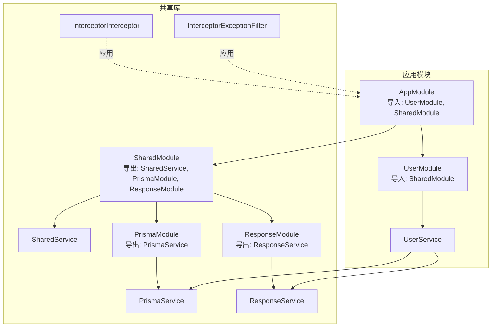
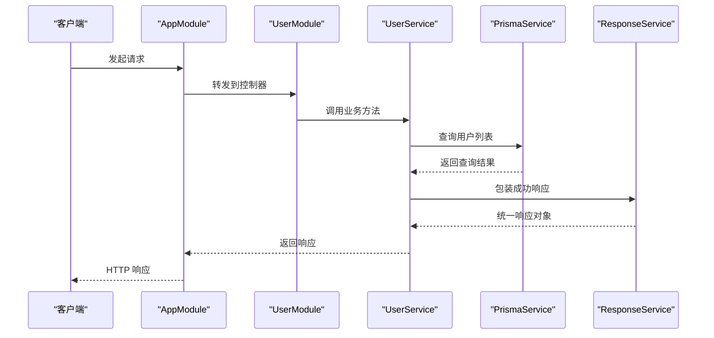
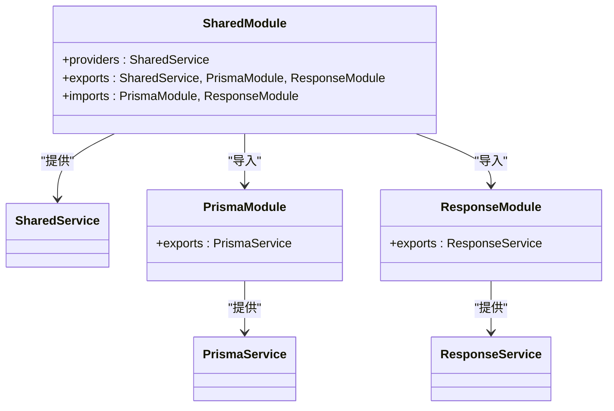
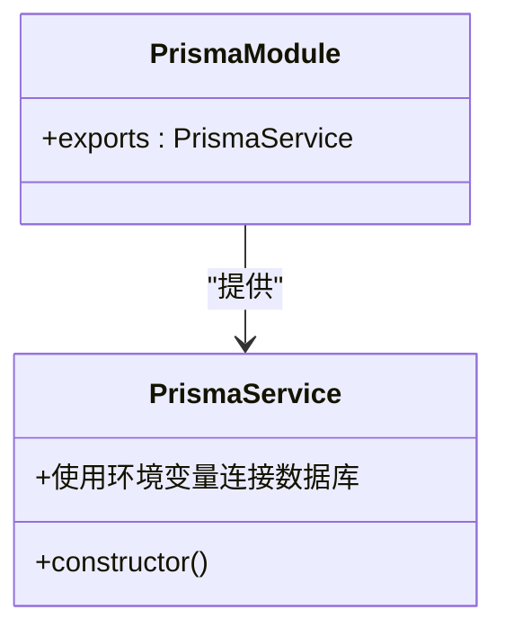
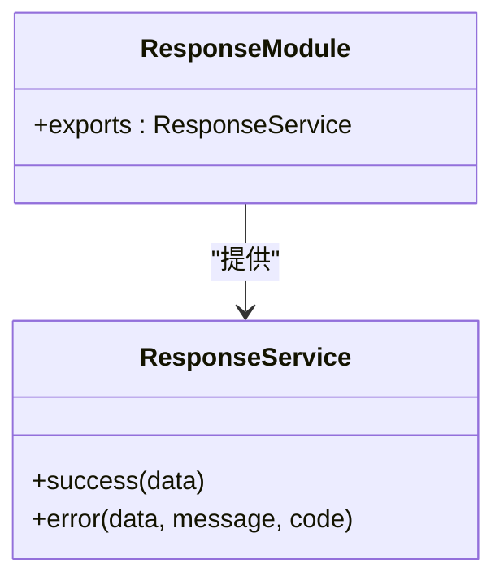
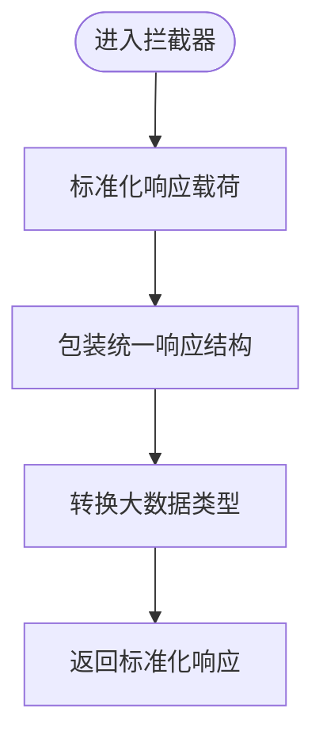
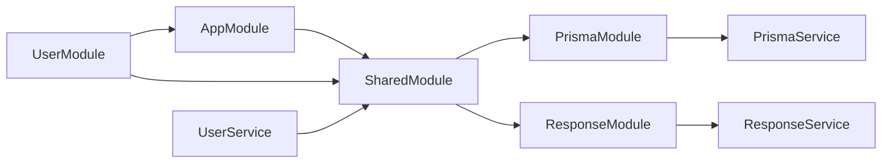

# 共享模块核心

<cite>
**本文引用的文件**
- [shared.module.ts](file://server/libs/shared/src/shared.module.ts)
- [shared.service.ts](file://server/libs/shared/src/shared.service.ts)
- [index.ts](file://server/libs/shared/src/index.ts)
- [prisma.module.ts](file://server/libs/shared/src/prisma/prisma.module.ts)
- [prisma.service.ts](file://server/libs/shared/src/prisma/prisma.service.ts)
- [response.module.ts](file://server/libs/shared/src/response/response.module.ts)
- [response.service.ts](file://server/libs/shared/src/response/response.service.ts)
- [interceptor.ts](file://server/libs/shared/src/interceptor/interceptor.ts)
- [exceptionFilter.ts](file://server/libs/shared/src/interceptor/exceptionFilter.ts)
- [app.module.ts](file://server/apps/server/src/app.module.ts)
- [user.module.ts](file://server/apps/server/src/user/user.module.ts)
- [user.service.ts](file://server/apps/server/src/user/user.service.ts)
</cite>

## 目录
1. [简介](#简介)
2. [项目结构](#项目结构)
3. [核心组件](#核心组件)
4. [架构总览](#架构总览)
5. [详细组件分析](#详细组件分析)
6. [依赖分析](#依赖分析)
7. [性能考虑](#性能考虑)
8. [故障排查指南](#故障排查指南)
9. [结论](#结论)
10. [附录](#附录)

## 简介
本文件聚焦于英语学习平台后端共享模块的核心设计与实现，系统性阐述以下主题：
- SharedModule 的整体架构设计与模块导入导出策略
- @Global() 装饰器的作用与全局可用性保障
- SharedService 的服务职责、依赖注入模式与生命周期管理
- 如何在其他模块中正确使用共享功能（含注册顺序与依赖关系）
- 使用示例与最佳实践（含拦截器与异常过滤器）

## 项目结构
共享模块位于 server/libs/shared，采用“按功能域分层”的组织方式：
- 根级导出：通过 index.ts 统一导出模块与服务，便于上层应用按需引入
- 子模块：prisma 与 response 两个子模块分别封装数据库访问与响应格式化能力
- 共享服务：SharedService 作为可注入的容器类，承载跨模块通用逻辑
- 拦截器与异常过滤器：统一处理响应体标准化与错误输出

图表来源
- [shared.module.ts:1-13](file://server/libs/shared/src/shared.module.ts#L1-L13)
- [prisma.module.ts:1-9](file://server/libs/shared/src/prisma/prisma.module.ts#L1-L9)
- [response.module.ts:1-9](file://server/libs/shared/src/response/response.module.ts#L1-L9)
- [app.module.ts:1-13](file://server/apps/server/src/app.module.ts#L1-L13)
- [user.module.ts:1-10](file://server/apps/server/src/user/user.module.ts#L1-L10)
- [user.service.ts:1-34](file://server/apps/server/src/user/user.service.ts#L1-L34)

章节来源
- [shared.module.ts:1-13](file://server/libs/shared/src/shared.module.ts#L1-L13)
- [index.ts:1-7](file://server/libs/shared/src/index.ts#L1-L7)
- [app.module.ts:1-13](file://server/apps/server/src/app.module.ts#L1-L13)

## 核心组件
- SharedModule：声明式模块，提供 SharedService，并将 PrismaModule 与 ResponseModule 导出，使其他模块无需重复导入即可使用
- SharedService：空实现占位，用于承载未来扩展的通用逻辑或作为依赖注入锚点
- PrismaModule/PrismaService：数据库访问层，基于 PrismaClient 与适配器连接 PostgreSQL
- ResponseModule/ResponseService：统一响应格式化工具，提供 success/error 两种便捷方法
- InterceptorInterceptor：NestJS 拦截器，统一包装响应体字段（时间戳、路径、消息、状态码、数据等）
- InterceptorExceptionFilter：HTTP 异常过滤器，统一错误响应结构

章节来源
- [shared.module.ts:1-13](file://server/libs/shared/src/shared.module.ts#L1-L13)
- [shared.service.ts:1-5](file://server/libs/shared/src/shared.service.ts#L1-L5)
- [prisma.module.ts:1-9](file://server/libs/shared/src/prisma/prisma.module.ts#L1-L9)
- [prisma.service.ts:1-18](file://server/libs/shared/src/prisma/prisma.service.ts#L1-L18)
- [response.module.ts:1-9](file://server/libs/shared/src/response/response.module.ts#L1-L9)
- [response.service.ts:1-29](file://server/libs/shared/src/response/response.service.ts#L1-L29)
- [interceptor.ts:1-86](file://server/libs/shared/src/interceptor/interceptor.ts#L1-L86)
- [exceptionFilter.ts:1-23](file://server/libs/shared/src/interceptor/exceptionFilter.ts#L1-L23)

## 架构总览
SharedModule 通过 @Global() 与 exports 字段，将内部服务与子模块暴露给整个应用，形成“全局可用”的基础设施层。应用模块 AppModule 在其 imports 中引入 SharedModule，即可在任意业务模块中直接注入 PrismaService 与 ResponseService。

图表来源
- [app.module.ts:1-13](file://server/apps/server/src/app.module.ts#L1-L13)
- [user.module.ts:1-10](file://server/apps/server/src/user/user.module.ts#L1-L10)
- [user.service.ts:1-34](file://server/apps/server/src/user/user.service.ts#L1-L34)
- [prisma.service.ts:1-18](file://server/libs/shared/src/prisma/prisma.service.ts#L1-L18)
- [response.service.ts:1-29](file://server/libs/shared/src/response/response.service.ts#L1-L29)

## 详细组件分析

### SharedModule：全局共享与导出机制
- @Global()：确保模块在全局范围内可用，避免各业务模块重复导入
- imports：声明对 PrismaModule 与 ResponseModule 的依赖，保证子模块内服务已注册
- providers：注册 SharedService，使其可被注入
- exports：导出 SharedService、PrismaModule、ResponseModule，供其他模块直接使用

图表来源
- [shared.module.ts:1-13](file://server/libs/shared/src/shared.module.ts#L1-L13)
- [prisma.module.ts:1-9](file://server/libs/shared/src/prisma/prisma.module.ts#L1-L9)
- [response.module.ts:1-9](file://server/libs/shared/src/response/response.module.ts#L1-L9)

章节来源
- [shared.module.ts:1-13](file://server/libs/shared/src/shared.module.ts#L1-L13)

### SharedService：职责、注入与生命周期
- 职责：当前为空实现，作为可注入容器，可用于后续扩展通用逻辑
- 注入模式：通过构造函数参数注入，遵循 NestJS 依赖注入原则
- 生命周期：由 Nest 容器管理，默认单例（Singleton），贯穿应用运行期

章节来源
- [shared.service.ts:1-5](file://server/libs/shared/src/shared.service.ts#L1-L5)
- [user.service.ts:1-34](file://server/apps/server/src/user/user.service.ts#L1-L34)

### PrismaModule/PrismaService：数据库访问层
- PrismaModule：声明式模块，导出 PrismaService
- PrismaService：继承 PrismaClient，使用环境变量配置连接 PostgreSQL，适配器负责连接池与驱动

图表来源
- [prisma.module.ts:1-9](file://server/libs/shared/src/prisma/prisma.module.ts#L1-L9)
- [prisma.service.ts:1-18](file://server/libs/shared/src/prisma/prisma.service.ts#L1-L18)

章节来源
- [prisma.module.ts:1-9](file://server/libs/shared/src/prisma/prisma.module.ts#L1-L9)
- [prisma.service.ts:1-18](file://server/libs/shared/src/prisma/prisma.service.ts#L1-L18)

### ResponseModule/ResponseService：统一响应格式
- ResponseModule：导出 ResponseService
- ResponseService：提供 success 与 error 方法，统一返回结构中的 data、code、message 字段

图表来源
- [response.module.ts:1-9](file://server/libs/shared/src/response/response.module.ts#L1-L9)
- [response.service.ts:1-29](file://server/libs/shared/src/response/response.service.ts#L1-L29)

章节来源
- [response.module.ts:1-9](file://server/libs/shared/src/response/response.module.ts#L1-L9)
- [response.service.ts:1-29](file://server/libs/shared/src/response/response.service.ts#L1-L29)

### 拦截器与异常过滤器：统一响应与错误处理
- InterceptorInterceptor：拦截控制器返回值，标准化为包含时间戳、路径、消息、状态码与数据的统一结构；支持将 bigint 转换为字符串，保留日期类型
- InterceptorExceptionFilter：捕获 HTTP 异常，统一输出错误响应结构

图表来源
- [interceptor.ts:1-86](file://server/libs/shared/src/interceptor/interceptor.ts#L1-L86)

章节来源
- [interceptor.ts:1-86](file://server/libs/shared/src/interceptor/interceptor.ts#L1-L86)
- [exceptionFilter.ts:1-23](file://server/libs/shared/src/interceptor/exceptionFilter.ts#L1-L23)

## 依赖分析
- 模块耦合与内聚：SharedModule 将 Prisma 与响应格式化能力聚合，降低业务模块重复导入成本
- 直接依赖：AppModule 直接导入 SharedModule；UserModule 间接通过 AppModule 获取共享能力
- 外部依赖：PrismaService 依赖环境变量 DATABASE_URL 连接数据库

图表来源
- [app.module.ts:1-13](file://server/apps/server/src/app.module.ts#L1-L13)
- [user.module.ts:1-10](file://server/apps/server/src/user/user.module.ts#L1-L10)
- [user.service.ts:1-34](file://server/apps/server/src/user/user.service.ts#L1-L34)
- [shared.module.ts:1-13](file://server/libs/shared/src/shared.module.ts#L1-L13)

章节来源
- [app.module.ts:1-13](file://server/apps/server/src/app.module.ts#L1-L13)
- [user.module.ts:1-10](file://server/apps/server/src/user/user.module.ts#L1-L10)
- [user.service.ts:1-34](file://server/apps/server/src/user/user.service.ts#L1-L34)
- [shared.module.ts:1-13](file://server/libs/shared/src/shared.module.ts#L1-L13)

## 性能考虑
- 单例模式：SharedService、PrismaService、ResponseService 默认单例，减少实例化开销
- 数据类型转换：拦截器对 bigint 进行字符串转换，避免序列化异常与前端解析问题
- 数据库连接：PrismaService 通过适配器连接数据库，建议在生产环境配置连接池参数与超时策略

## 故障排查指南
- 数据库连接失败：检查环境变量 DATABASE_URL 是否正确，确认数据库可达性
- 响应格式异常：确认拦截器是否启用，以及控制器返回值是否符合预期结构
- 错误未统一：确认异常过滤器是否注册到应用根守卫链路

章节来源
- [prisma.service.ts:1-18](file://server/libs/shared/src/prisma/prisma.service.ts#L1-L18)
- [interceptor.ts:1-86](file://server/libs/shared/src/interceptor/interceptor.ts#L1-L86)
- [exceptionFilter.ts:1-23](file://server/libs/shared/src/interceptor/exceptionFilter.ts#L1-L23)

## 结论
SharedModule 通过 @Global() 与 exports 实现了全局共享能力，将数据库访问与响应格式化抽象为可复用模块，显著降低了业务模块的样板代码与重复依赖。结合拦截器与异常过滤器，实现了统一的响应与错误处理策略，提升了系统的可观测性与一致性。

## 附录
- 使用示例与最佳实践
  - 在 AppModule 中导入 SharedModule，确保全局可用
  - 在业务模块中通过构造函数注入 PrismaService 与 ResponseService
  - 在控制器中调用 ResponseService 包装返回值，保持统一格式
  - 在应用根层注册拦截器与异常过滤器，确保全局限局生效

章节来源
- [app.module.ts:1-13](file://server/apps/server/src/app.module.ts#L1-L13)
- [user.service.ts:1-34](file://server/apps/server/src/user/user.service.ts#L1-L34)
- [interceptor.ts:1-86](file://server/libs/shared/src/interceptor/interceptor.ts#L1-L86)
- [exceptionFilter.ts:1-23](file://server/libs/shared/src/interceptor/exceptionFilter.ts#L1-L23)