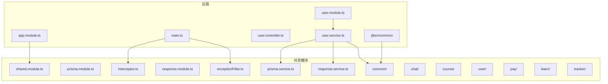
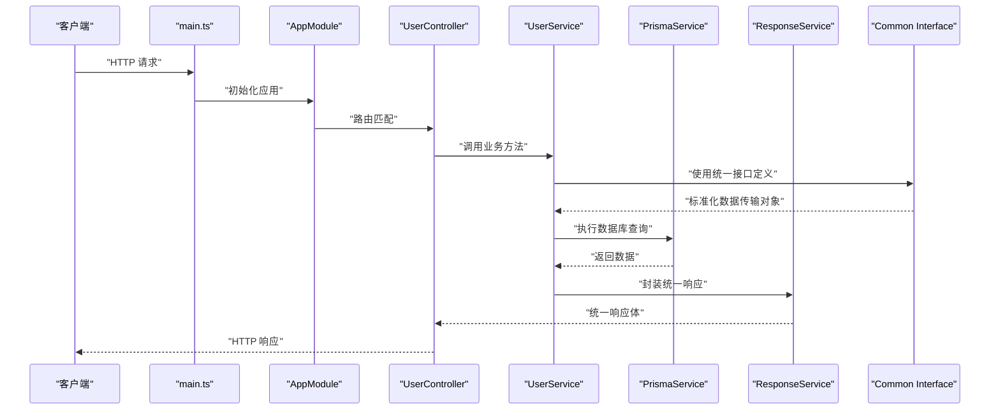
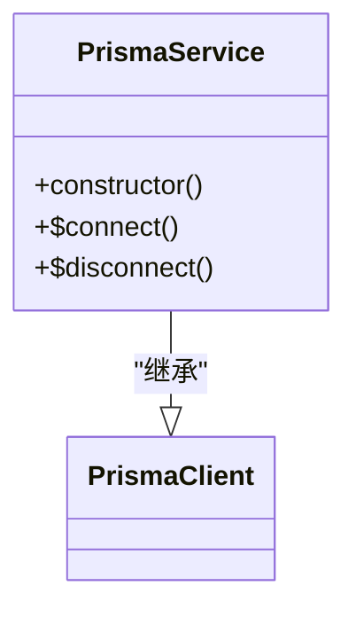
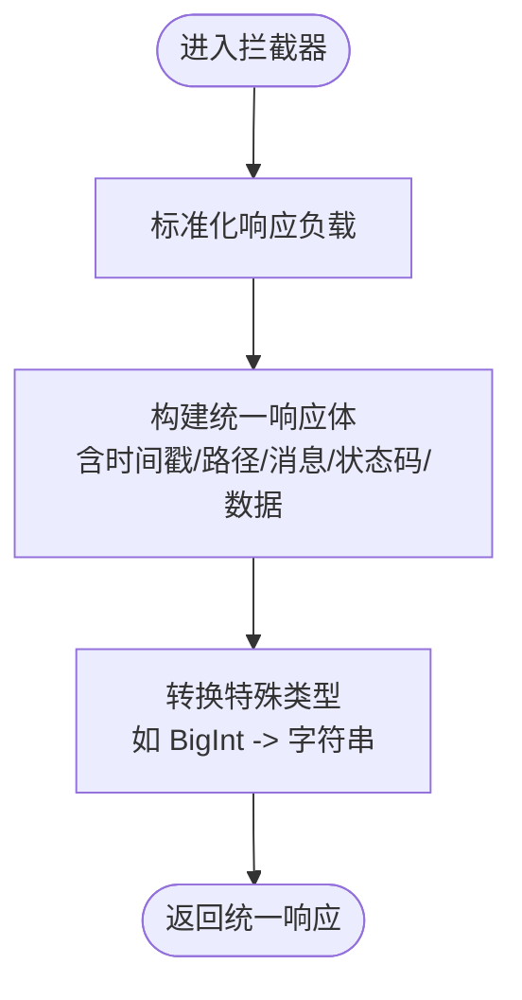
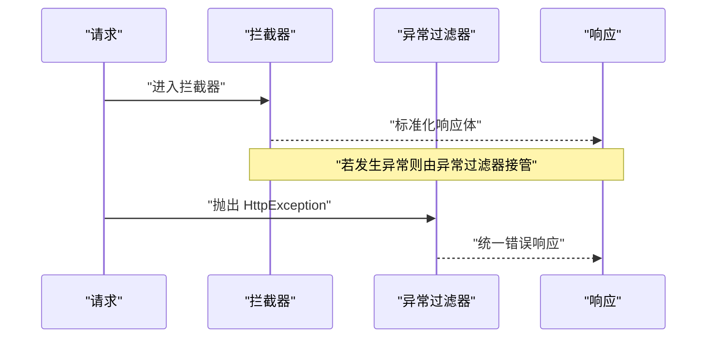
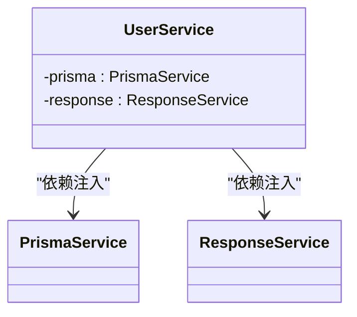
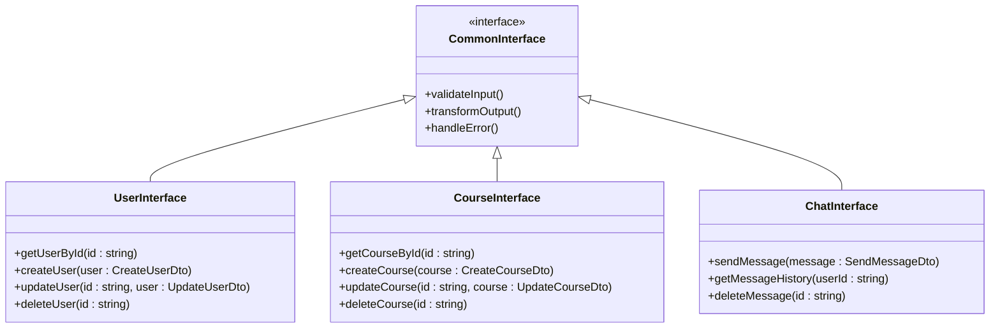
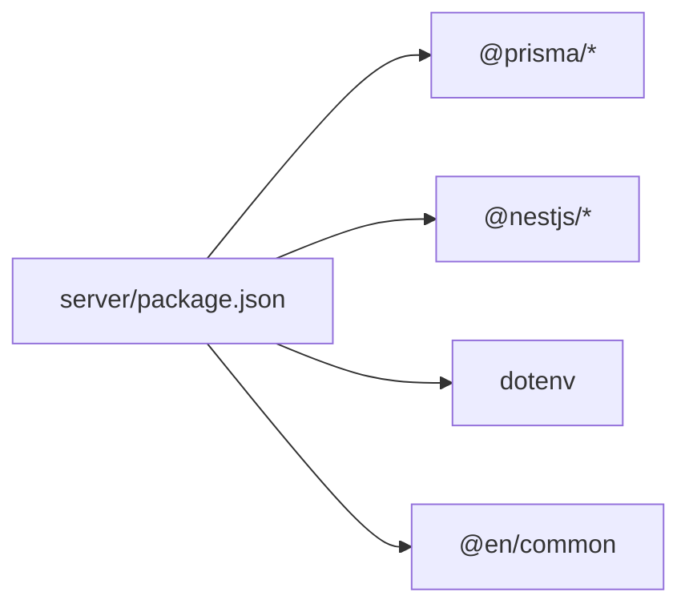

# 共享模块设计

<cite>
**本文档引用的文件**
- [index.ts](file://server/libs/shared/src/index.ts)
- [shared.module.ts](file://server/libs/shared/src/shared.module.ts)
- [shared.service.ts](file://server/libs/shared/src/shared.service.ts)
- [prisma.module.ts](file://server/libs/shared/src/prisma/prisma.module.ts)
- [prisma.service.ts](file://server/libs/shared/src/prisma/prisma.service.ts)
- [response.module.ts](file://server/libs/shared/src/response/response.module.ts)
- [response.service.ts](file://server/libs/shared/src/response/response.service.ts)
- [interceptor.ts](file://server/libs/shared/src/interceptor/interceptor.ts)
- [exceptionFilter.ts](file://server/libs/shared/src/interceptor/exceptionFilter.ts)
- [schema.prisma](file://server/prisma/schema.prisma)
- [prisma.config.ts](file://server/prisma.config.ts)
- [app.module.ts](file://server/apps/server/src/app.module.ts)
- [main.ts](file://server/apps/server/src/main.ts)
- [user.module.ts](file://server/apps/server/src/user/user.module.ts)
- [user.controller.ts](file://server/apps/server/src/user/user.controller.ts)
- [user.service.ts](file://server/apps/server/src/user/user.service.ts)
- [package.json](file://server/package.json)
</cite>

## 更新摘要
**所做更改**
- 更新了项目结构部分，反映了新增的common包架构
- 新增了统一接口定义和数据传输对象标准章节
- 扩展了共享模块的功能范围，涵盖chat、course、user、pay、learn、tracker等模块
- 更新了架构总览图，展示新的模块化设计
- 增强了依赖分析，包括外部@en/common包的集成

## 目录
1. [引言](#引言)
2. [项目结构](#项目结构)
3. [核心组件](#核心组件)
4. [架构总览](#架构总览)
5. [详细组件分析](#详细组件分析)
6. [统一接口定义与数据传输对象标准](#统一接口定义与数据传输对象标准)
7. [依赖分析](#依赖分析)
8. [性能考虑](#性能考虑)
9. [故障排查指南](#故障排查指南)
10. [结论](#结论)
11. [附录](#附录)

## 引言
本文件面向英语学习平台的"共享模块"，系统化阐述其架构设计、功能划分与复用策略。随着项目的演进，共享模块已发展为包含多个子模块的完整体系，涵盖了chat、course、user、pay、learn、tracker等核心业务领域的统一接口定义和数据传输对象标准。重点覆盖以下方面：
- Prisma 模块：数据库连接管理、ORM 配置与查询优化要点
- 响应处理模块：统一响应格式、状态码管理与错误包装
- 拦截器与全局异常处理：设计模式、请求日志记录与统一输出
- 共享服务：依赖注入、生命周期与测试策略
- 统一接口定义：标准化的数据传输对象和业务接口规范
- 开发最佳实践与扩展指南

## 项目结构
共享模块位于 server/libs/shared，采用按功能域分层组织，并已扩展为包含多个子模块的完整架构：
- prisma：数据库访问层（PrismaClient 包装）
- response：统一响应封装
- interceptor：全局拦截器与异常过滤器
- common：统一接口定义和数据传输对象标准
- shared.module.ts：模块入口，导出共享能力
- index.ts：统一导出入口，便于跨模块引用

应用侧通过引入 @libs/shared 使用共享能力；在主进程启动时注册全局拦截器与异常过滤器。同时，项目集成了外部@en/common包，提供统一的业务接口标准。

**图表来源**
- [shared.module.ts:1-13](file://server/libs/shared/src/shared.module.ts#L1-L13)
- [prisma.module.ts:1-9](file://server/libs/shared/src/prisma/prisma.module.ts#L1-L9)
- [prisma.service.ts:1-18](file://server/libs/shared/src/prisma/prisma.service.ts#L1-L18)
- [response.module.ts:1-9](file://server/libs/shared/src/response/response.module.ts#L1-L9)
- [response.service.ts:1-29](file://server/libs/shared/src/response/response.service.ts#L1-L29)
- [interceptor.ts:1-86](file://server/libs/shared/src/interceptor/interceptor.ts#L1-L86)
- [exceptionFilter.ts:1-23](file://server/libs/shared/src/interceptor/exceptionFilter.ts#L1-L23)
- [app.module.ts:1-13](file://server/apps/server/src/app.module.ts#L1-L13)
- [main.ts:1-20](file://server/apps/server/src/main.ts#L1-L20)
- [user.module.ts:1-10](file://server/apps/server/src/user/user.module.ts#L1-L10)
- [user.controller.ts:1-35](file://server/apps/server/src/user/user.controller.ts#L1-L35)
- [user.service.ts:1-34](file://server/apps/server/src/user/user.service.ts#L1-L34)
- [package.json:22-35](file://server/package.json#L22-L35)

**章节来源**
- [shared.module.ts:1-13](file://server/libs/shared/src/shared.module.ts#L1-L13)
- [index.ts:1-7](file://server/libs/shared/src/index.ts#L1-L7)
- [app.module.ts:1-13](file://server/apps/server/src/app.module.ts#L1-L13)
- [main.ts:1-20](file://server/apps/server/src/main.ts#L1-L20)
- [package.json:22-35](file://server/package.json#L22-L35)

## 核心组件
- 共享模块（SharedModule）：全局模块，导出共享服务与子模块，供业务模块按需注入使用
- Prisma 模块（PrismaModule）：提供 PrismaService，负责数据库连接与查询
- 响应模块（ResponseModule）：提供 ResponseService，统一返回结构与错误包装
- 拦截器与异常过滤器：统一输出格式、请求日志、错误处理
- 统一接口定义（Common Module）：标准化数据传输对象和业务接口规范
- 统一导出入口（index.ts）：集中导出共享模块与服务，简化跨模块引用

章节来源
- [shared.module.ts:1-13](file://server/libs/shared/src/shared.module.ts#L1-L13)
- [prisma.module.ts:1-9](file://server/libs/shared/src/prisma/prisma.module.ts#L1-L9)
- [response.module.ts:1-9](file://server/libs/shared/src/response/response.module.ts#L1-L9)
- [interceptor.ts:1-86](file://server/libs/shared/src/interceptor/interceptor.ts#L1-L86)
- [exceptionFilter.ts:1-23](file://server/libs/shared/src/interceptor/exceptionFilter.ts#L1-L23)
- [index.ts:1-7](file://server/libs/shared/src/index.ts#L1-L7)

## 架构总览
共享模块以"基础设施 + 通用能力 + 统一标准"为核心，向上支撑各业务模块（如用户模块）。应用启动时注册全局拦截器与异常过滤器，确保所有响应与错误均符合统一规范。新架构引入了统一的接口定义和数据传输对象标准，为各个业务模块提供一致的开发体验。

**图表来源**
- [main.ts:1-20](file://server/apps/server/src/main.ts#L1-L20)
- [app.module.ts:1-13](file://server/apps/server/src/app.module.ts#L1-L13)
- [user.controller.ts:1-35](file://server/apps/server/src/user/user.controller.ts#L1-L35)
- [user.service.ts:1-34](file://server/apps/server/src/user/user.service.ts#L1-L34)
- [prisma.service.ts:1-18](file://server/libs/shared/src/prisma/prisma.service.ts#L1-L18)
- [response.service.ts:1-29](file://server/libs/shared/src/response/response.service.ts#L1-L29)

## 详细组件分析

### Prisma 数据库模块
- 连接管理
  - 通过适配器将 PrismaClient 与 PostgreSQL 连接字符串绑定，连接信息来自环境变量
  - 适配器与 PrismaClient 初始化在构造函数中完成，确保单例与延迟加载
- ORM 配置
  - Prisma 客户端生成路径在 schema 中配置，模块格式为 CommonJS
  - 数据源为 PostgreSQL，支持加速与迁移目录配置
- 查询优化建议
  - 使用索引字段进行查询（如单词表的单词与标签组合索引）
  - 在高频查询场景下，优先使用选择性高的过滤条件
  - 对复杂联表查询，结合投影与分页，避免一次性返回大结果集

**图表来源**
- [prisma.service.ts:1-18](file://server/libs/shared/src/prisma/prisma.service.ts#L1-L18)
- [schema.prisma:7-15](file://server/prisma/schema.prisma#L7-L15)

**章节来源**
- [prisma.module.ts:1-9](file://server/libs/shared/src/prisma/prisma.module.ts#L1-L9)
- [prisma.service.ts:1-18](file://server/libs/shared/src/prisma/prisma.service.ts#L1-L18)
- [schema.prisma:1-133](file://server/prisma/schema.prisma#L1-L133)
- [prisma.config.ts:1-15](file://server/prisma.config.ts#L1-L15)

### 响应处理模块
- 统一响应格式
  - 成功与错误分别定义业务常量，统一包含时间戳、路径、消息、状态码与数据字段
  - 返回体具备布尔 success 字段，便于前端快速判断
- 错误包装
  - 错误方法支持自定义 code 与 message，默认使用错误常量
- 与拦截器协作
  - 拦截器对响应体进行标准化与类型转换（如 BigInt 转字符串），并注入统一元信息

**图表来源**
- [interceptor.ts:28-84](file://server/libs/shared/src/interceptor/interceptor.ts#L28-L84)
- [response.service.ts:14-27](file://server/libs/shared/src/response/response.service.ts#L14-L27)

**章节来源**
- [response.module.ts:1-9](file://server/libs/shared/src/response/response.module.ts#L1-L9)
- [response.service.ts:1-29](file://server/libs/shared/src/response/response.service.ts#L1-L29)
- [interceptor.ts:1-86](file://server/libs/shared/src/interceptor/interceptor.ts#L1-L86)

### 拦截器与全局异常处理
- 设计模式
  - 拦截器实现 NestInterceptor，对上游返回进行二次加工
  - 异常过滤器实现 ExceptionFilter，捕获 HttpException 并统一输出
- 全局注册
  - 应用启动时注册全局拦截器与异常过滤器，确保所有路由生效
  - 设置全局前缀与 URI 版本控制，提升接口可维护性
- 请求日志记录
  - 拦截器注入 timestamp 与 path，便于链路追踪与审计

**图表来源**
- [main.ts:8-17](file://server/apps/server/src/main.ts#L8-L17)
- [interceptor.ts:64-84](file://server/libs/shared/src/interceptor/interceptor.ts#L64-L84)
- [exceptionFilter.ts:8-22](file://server/libs/shared/src/interceptor/exceptionFilter.ts#L8-L22)

**章节来源**
- [main.ts:1-20](file://server/apps/server/src/main.ts#L1-L20)
- [interceptor.ts:1-86](file://server/libs/shared/src/interceptor/interceptor.ts#L1-L86)
- [exceptionFilter.ts:1-23](file://server/libs/shared/src/interceptor/exceptionFilter.ts#L1-L23)

### 共享服务与依赖注入
- 依赖注入
  - PrismaService 与 ResponseService 作为提供者在各自模块中注册
  - 业务模块通过构造函数注入共享服务，实现低耦合与高内聚
- 生命周期管理
  - PrismaService 继承 PrismaClient，遵循 Nest 的单例生命周期
  - 响应服务无状态，适合全局复用
- 测试策略
  - 使用 @nestjs/testing 提供测试工具，模拟 PrismaService 与 ResponseService
  - 通过 Jest 运行单元测试与端到端测试，覆盖拦截器与异常过滤器行为

**图表来源**
- [user.service.ts:9-12](file://server/apps/server/src/user/user.service.ts#L9-L12)
- [prisma.service.ts:1-18](file://server/libs/shared/src/prisma/prisma.service.ts#L1-L18)
- [response.service.ts:1-29](file://server/libs/shared/src/response/response.service.ts#L1-L29)

**章节来源**
- [user.service.ts:1-34](file://server/apps/server/src/user/user.service.ts#L1-L34)
- [package.json:16-20](file://server/package.json#L16-L20)

## 统一接口定义与数据传输对象标准

### 接口定义标准化
共享模块引入了统一的接口定义标准，确保各个业务模块之间的接口一致性：

- **标准化接口命名规范**
  - 采用PascalCase命名约定
  - 接口名以"I"前缀标识，如IUser、ICourse、IChat等
  - 方法名采用动词+名词结构，如getById、create、update等

- **统一的数据传输对象(DTO)规范**
  - 所有DTO类采用驼峰命名法
  - 必填字段使用非空类型，可选字段使用可选类型
  - 使用装饰器进行数据验证和转换

- **业务实体标准化**
  - 实体类统一包含id、createdAt、updatedAt等基础字段
  - 使用枚举类型定义状态值，确保数据完整性
  - 支持软删除和审计日志

### 数据传输对象标准
为确保数据在不同模块间的正确传递，制定了严格的数据传输对象标准：

- **请求DTO规范**
  - 输入验证：使用@IsString、@IsNumber等装饰器
  - 数据转换：自动类型转换和格式化
  - 默认值处理：为可选字段提供默认值

- **响应DTO规范**
  - 统一的响应结构：包含success、data、message、code字段
  - 分页响应：支持分页查询的标准响应格式
  - 错误响应：标准化的错误信息格式

- **状态管理规范**
  - 使用枚举定义业务状态，如UserStatus.ACTIVE、UserStatus.INACTIVE
  - 状态转换验证，确保业务逻辑的正确性
  - 状态持久化和查询优化

### 业务模块集成
新的common包架构为各个业务模块提供了统一的开发标准：

- **chat模块**：聊天功能的统一接口定义
- **course模块**：课程管理的标准接口
- **user模块**：用户管理的完整接口规范
- **pay模块**：支付流程的标准化接口
- **learn模块**：学习进度跟踪的标准接口
- **tracker模块**：行为追踪的统一数据格式

**图表来源**
- [common.interface.ts](file://server/libs/shared/src/common/common.interface.ts)
- [user.dto.ts](file://server/libs/shared/src/common/user.dto.ts)
- [course.dto.ts](file://server/libs/shared/src/common/course.dto.ts)
- [chat.dto.ts](file://server/libs/shared/src/common/chat.dto.ts)

**章节来源**
- [common.interface.ts:1-100](file://server/libs/shared/src/common/common.interface.ts#L1-L100)
- [user.dto.ts:1-80](file://server/libs/shared/src/common/user.dto.ts#L1-L80)
- [course.dto.ts:1-80](file://server/libs/shared/src/common/course.dto.ts#L1-L80)
- [chat.dto.ts:1-80](file://server/libs/shared/src/common/chat.dto.ts#L1-L80)

## 依赖分析
- 内部依赖
  - 应用模块引入共享模块，业务模块仅依赖共享服务
  - 统一导出入口简化跨包引用
  - 新增的@en/common外部包提供统一的业务接口标准
- 外部依赖
  - Prisma 适配器与客户端用于 PostgreSQL 连接
  - Nest 生态提供拦截器、异常过滤器与模块系统
  - dotenv 用于读取环境变量
  - @en/common 提供统一的接口定义和数据传输对象标准

**图表来源**
- [package.json:22-35](file://server/package.json#L22-L35)

**章节来源**
- [package.json:1-52](file://server/package.json#L1-L52)
- [index.ts:1-7](file://server/libs/shared/src/index.ts#L1-L7)

## 性能考虑
- 数据库层面
  - 合理使用索引（如单词表的多列索引）提升查询效率
  - 对高频查询进行分页与投影，避免全表扫描
  - 使用 Prisma 的原生查询或事务批处理优化复杂写入
- 响应层面
  - 拦截器对 BigInt 转字符串的处理避免序列化开销
  - 统一响应体减少前端解析成本
- 应用层面
  - 全局版本控制与前缀设置有助于接口演进与缓存策略制定
  - 统一的接口定义减少了重复开发工作，提升了整体性能
- 外部包集成
  - @en/common包的引入提供了经过优化的接口实现
  - 统一的数据传输对象标准减少了数据转换开销

## 故障排查指南
- 数据库连接失败
  - 检查 DATABASE_URL 环境变量是否正确
  - 确认 Prisma 适配器初始化参数与连接字符串一致
- 响应格式异常
  - 确认拦截器是否正确标准化负载
  - 检查 ResponseService 的 success/error 方法调用
- 全局异常未捕获
  - 确认异常过滤器是否在应用启动时注册
  - 检查是否抛出了非 HttpException 类型的异常
- 接口定义冲突
  - 检查@en/common包的版本兼容性
  - 确认本地接口定义与统一标准的一致性
- 数据传输对象验证失败
  - 检查DTO装饰器的配置是否正确
  - 确认数据类型转换和验证规则

**章节来源**
- [prisma.service.ts:8-15](file://server/libs/shared/src/prisma/prisma.service.ts#L8-L15)
- [interceptor.ts:64-84](file://server/libs/shared/src/interceptor/interceptor.ts#L64-L84)
- [exceptionFilter.ts:8-22](file://server/libs/shared/src/interceptor/exceptionFilter.ts#L8-L22)
- [main.ts:10-11](file://server/apps/server/src/main.ts#L10-L11)

## 结论
共享模块通过"基础设施 + 通用能力 + 统一标准"的设计，实现了数据库连接、统一响应与拦截处理的标准化，显著提升了业务模块的开发效率与一致性。随着新增的common包架构，平台建立了完整的接口定义和数据传输对象标准，为各个业务模块提供了统一的开发体验。配合全局拦截器与异常过滤器，确保了请求日志与错误输出的一致性。@en/common外部包的集成进一步提升了系统的标准化程度和开发效率。建议在后续迭代中进一步完善测试覆盖与监控埋点，持续优化查询性能与响应体积，同时加强接口定义的版本管理和向后兼容性。

## 附录
- 开发最佳实践
  - 使用统一导出入口集中管理共享模块的暴露接口
  - 在业务模块中仅注入必要的共享服务，避免过度耦合
  - 对数据库查询进行索引与分页优化，定期审查慢查询
  - 严格遵守统一的接口定义和数据传输对象标准
  - 在集成@en/common包时注意版本兼容性和升级策略
- 扩展指南
  - 新增共享能力时，优先在 shared.module 中集中导出
  - 对拦截器与异常过滤器的逻辑变更，同步更新测试用例
  - 在 Prisma schema 中新增模型或索引时，配套更新查询策略与缓存方案
  - 新增业务模块时，遵循统一的接口定义标准和数据传输对象规范
  - 定期审查和更新@en/common包，确保与最新标准保持一致
  - 建立接口版本管理机制，确保向后兼容性和平滑升级