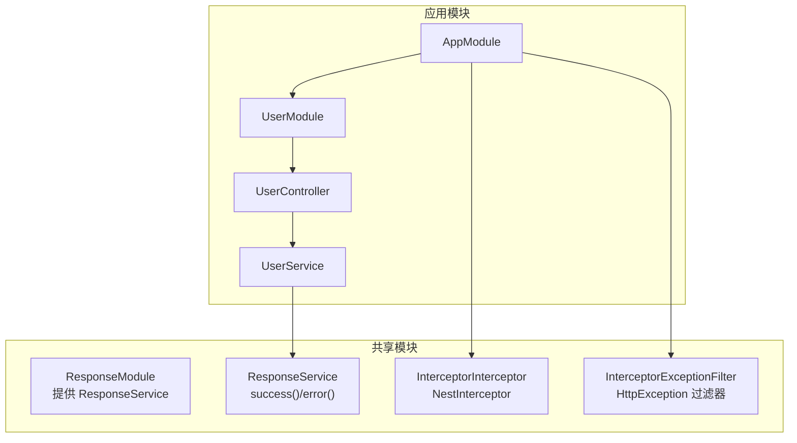
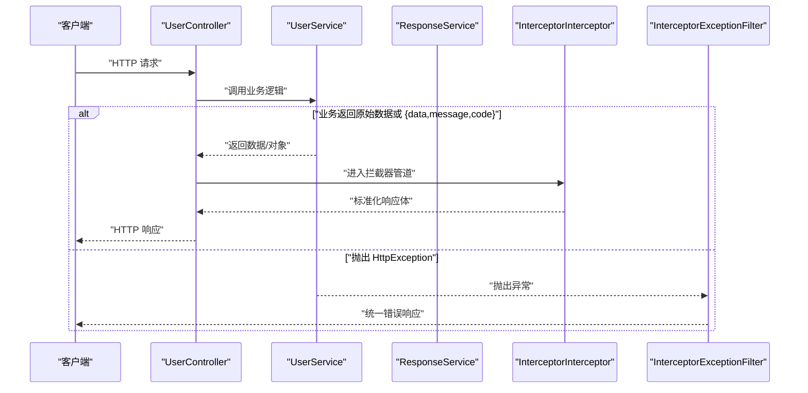
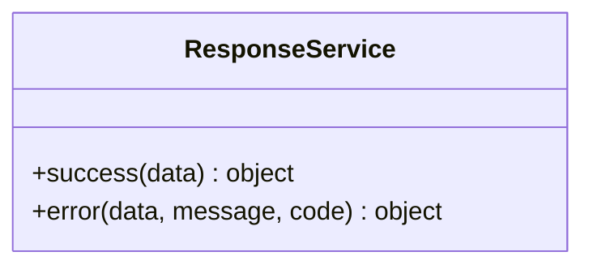
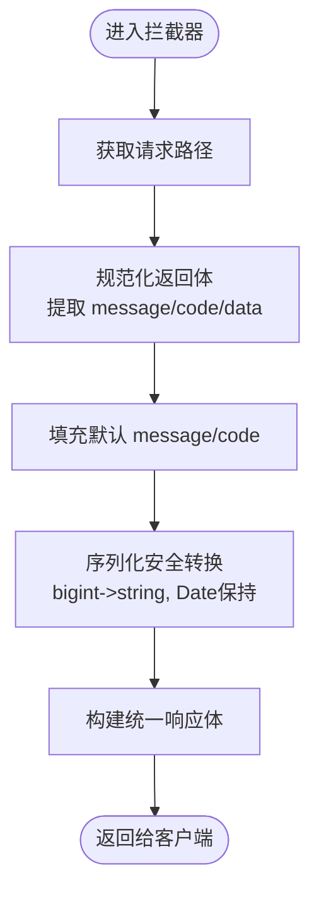
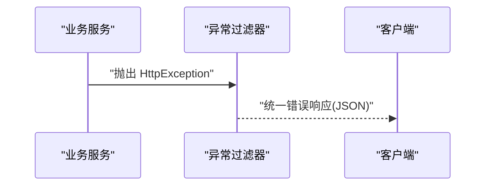
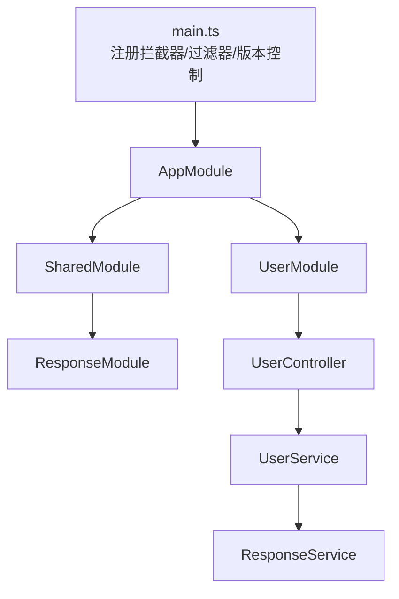
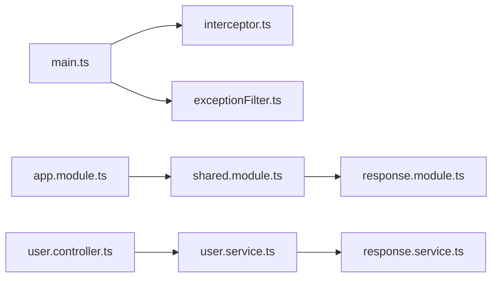

# 响应处理模块

<cite>
**本文引用的文件**
- [response.module.ts](file://server/libs/shared/src/response/response.module.ts)
- [response.service.ts](file://server/libs/shared/src/response/response.service.ts)
- [interceptor.ts](file://server/libs/shared/src/interceptor/interceptor.ts)
- [exceptionFilter.ts](file://server/libs/shared/src/interceptor/exceptionFilter.ts)
- [shared.module.ts](file://server/libs/shared/src/shared.module.ts)
- [shared.service.ts](file://server/libs/shared/src/shared.service.ts)
- [main.ts](file://server/apps/server/src/main.ts)
- [app.module.ts](file://server/apps/server/src/app.module.ts)
- [user.controller.ts](file://server/apps/server/src/user/user.controller.ts)
- [user.service.ts](file://server/apps/server/src/user/user.service.ts)
- [ai.controller.ts](file://server/apps/ai/src/ai.controller.ts)
- [ai.service.ts](file://server/apps/ai/src/ai.service.ts)
</cite>

## 目录
1. [简介](#简介)
2. [项目结构](#项目结构)
3. [核心组件](#核心组件)
4. [架构总览](#架构总览)
5. [详细组件分析](#详细组件分析)
6. [依赖关系分析](#依赖关系分析)
7. [性能考量](#性能考量)
8. [故障排查指南](#故障排查指南)
9. [结论](#结论)
10. [附录](#附录)

## 简介
本文件面向英语学习平台后端的响应处理模块，系统化阐述 ResponseModule 的模块设计与统一响应格式规范，详解 ResponseService 的服务实现（成功响应封装、错误响应包装与状态码管理），并说明拦截器与异常过滤器如何在全局范围内对所有 API 响应进行标准化输出。文档同时覆盖响应数据结构、元数据字段、国际化支持建议、API 响应一致性设计、错误分类处理与调试信息管理，并给出最佳实践、自定义响应格式扩展以及性能监控策略。

## 项目结构
响应处理能力由共享模块统一提供，核心包括：
- 响应服务：负责业务层返回的成功/错误封装
- 全局拦截器：统一包装业务返回体，追加时间戳、路径、消息、状态码与成功标记
- 全局异常过滤器：捕获 HttpException 并输出统一错误响应
- 共享模块导出：向各业务模块注入响应能力

图表来源
- [shared.module.ts:1-13](file://server/libs/shared/src/shared.module.ts#L1-L13)
- [response.module.ts:1-9](file://server/libs/shared/src/response/response.module.ts#L1-L9)
- [response.service.ts:1-29](file://server/libs/shared/src/response/response.service.ts#L1-L29)
- [interceptor.ts:1-86](file://server/libs/shared/src/interceptor/interceptor.ts#L1-L86)
- [exceptionFilter.ts:1-23](file://server/libs/shared/src/interceptor/exceptionFilter.ts#L1-L23)
- [app.module.ts:1-13](file://server/apps/server/src/app.module.ts#L1-L13)
- [user.controller.ts:1-35](file://server/apps/server/src/user/user.controller.ts#L1-L35)
- [user.service.ts:1-34](file://server/apps/server/src/user/user.service.ts#L1-L34)

章节来源
- [shared.module.ts:1-13](file://server/libs/shared/src/shared.module.ts#L1-L13)
- [response.module.ts:1-9](file://server/libs/shared/src/response/response.module.ts#L1-L9)
- [response.service.ts:1-29](file://server/libs/shared/src/response/response.service.ts#L1-L29)
- [interceptor.ts:1-86](file://server/libs/shared/src/interceptor/interceptor.ts#L1-L86)
- [exceptionFilter.ts:1-23](file://server/libs/shared/src/interceptor/exceptionFilter.ts#L1-L23)
- [app.module.ts:1-13](file://server/apps/server/src/app.module.ts#L1-L13)
- [user.controller.ts:1-35](file://server/apps/server/src/user/user.controller.ts#L1-L35)
- [user.service.ts:1-34](file://server/apps/server/src/user/user.service.ts#L1-L34)

## 核心组件
- ResponseModule：声明并导出 ResponseService，供业务模块按需注入使用
- ResponseService：提供 success(data) 与 error(data, message, code) 两个方法，用于在业务层快速生成统一的成功或错误响应对象
- InterceptorInterceptor：Nest 拦截器，对上游返回进行标准化包装，追加时间戳、请求路径、消息、状态码、成功标记与数据字段；并对 bigint 转换为字符串，确保 JSON 序列化安全
- InterceptorExceptionFilter：捕获 HttpException，统一输出包含时间戳、路径、消息、HTTP 状态码与失败标记的错误响应
- 共享模块：全局导入 Prisma 与 Response 模块，向应用导出共享能力

章节来源
- [response.module.ts:1-9](file://server/libs/shared/src/response/response.module.ts#L1-L9)
- [response.service.ts:1-29](file://server/libs/shared/src/response/response.service.ts#L1-L29)
- [interceptor.ts:1-86](file://server/libs/shared/src/interceptor/interceptor.ts#L1-L86)
- [exceptionFilter.ts:1-23](file://server/libs/shared/src/interceptor/exceptionFilter.ts#L1-L23)
- [shared.module.ts:1-13](file://server/libs/shared/src/shared.module.ts#L1-L13)

## 架构总览
下图展示了从控制器到服务再到拦截器与异常过滤器的整体调用链路，以及响应标准化的流程。

图表来源
- [user.controller.ts:1-35](file://server/apps/server/src/user/user.controller.ts#L1-L35)
- [user.service.ts:1-34](file://server/apps/server/src/user/user.service.ts#L1-L34)
- [response.service.ts:1-29](file://server/libs/shared/src/response/response.service.ts#L1-L29)
- [interceptor.ts:1-86](file://server/libs/shared/src/interceptor/interceptor.ts#L1-L86)
- [exceptionFilter.ts:1-23](file://server/libs/shared/src/interceptor/exceptionFilter.ts#L1-L23)

## 详细组件分析

### ResponseService 组件分析
- 设计要点
  - 成功响应：success(data) 返回包含 data、code 与 message 的对象
  - 错误响应：error(data, message, code) 支持自定义 code 与 message，默认使用内部错误码
- 数据结构
  - 字段：data（任意类型）、code（数字）、message（字符串）
  - 作用：为业务层提供一致的返回结构，便于上层拦截器统一包装
- 使用场景
  - 在业务方法中直接返回 ResponseService 的结果，拦截器会将其标准化为最终响应

图表来源
- [response.service.ts:1-29](file://server/libs/shared/src/response/response.service.ts#L1-L29)

章节来源
- [response.service.ts:1-29](file://server/libs/shared/src/response/response.service.ts#L1-L29)
- [user.service.ts:17-20](file://server/apps/server/src/user/user.service.ts#L17-L20)

### InterceptorInterceptor 组件分析
- 设计要点
  - 类型定义：ResponsePayload 与 ResponseBody，分别用于输入规范化与输出标准化
  - 规范化：normalizeResponsePayload 将任意返回值转换为 {message?, code?, data?}
  - 序列化安全：transformBigInt 将 bigint 转为字符串，保持 Date 类型不变
  - 输出字段：timestamp、path、message、code、success、data
- 处理流程
  - 获取请求路径
  - 规范化上游返回
  - 填充默认 message 与 code
  - 对 data 执行序列化安全转换
  - 输出统一响应体

图表来源
- [interceptor.ts:28-84](file://server/libs/shared/src/interceptor/interceptor.ts#L28-L84)

章节来源
- [interceptor.ts:1-86](file://server/libs/shared/src/interceptor/interceptor.ts#L1-L86)

### InterceptorExceptionFilter 组件分析
- 设计要点
  - 捕获 HttpException
  - 输出包含时间戳、请求路径、消息、HTTP 状态码与失败标记的错误响应
- 适用范围
  - 主要用于显式抛出的业务异常与校验异常，保证错误响应格式一致

图表来源
- [exceptionFilter.ts:8-22](file://server/libs/shared/src/interceptor/exceptionFilter.ts#L8-L22)

章节来源
- [exceptionFilter.ts:1-23](file://server/libs/shared/src/interceptor/exceptionFilter.ts#L1-L23)

### 全局注册与应用集成
- 入口文件
  - 在应用启动时注册全局拦截器与全局异常过滤器
  - 设置全局路由前缀与 URI 版本控制
- 模块装配
  - AppModule 导入 UserModule 与 SharedModule
  - SharedModule 导出 ResponseModule，使业务模块可直接使用 ResponseService

图表来源
- [main.ts:8-19](file://server/apps/server/src/main.ts#L8-L19)
- [app.module.ts:1-13](file://server/apps/server/src/app.module.ts#L1-L13)
- [shared.module.ts:1-13](file://server/libs/shared/src/shared.module.ts#L1-L13)
- [response.module.ts:1-9](file://server/libs/shared/src/response/response.module.ts#L1-L9)

章节来源
- [main.ts:1-20](file://server/apps/server/src/main.ts#L1-L20)
- [app.module.ts:1-13](file://server/apps/server/src/app.module.ts#L1-L13)
- [shared.module.ts:1-13](file://server/libs/shared/src/shared.module.ts#L1-L13)

## 依赖关系分析
- 模块耦合
  - ResponseModule 仅依赖 ResponseService，内聚性强
  - InterceptorInterceptor 依赖 Express Request 类型与 RxJS map 操作符
  - ExceptionFilter 依赖 @nestjs/common 的 HttpException
- 导入关系
  - main.ts 导入拦截器与异常过滤器并在应用启动时注册
  - app.module.ts 导入 UserModule 与 SharedModule
  - shared.module.ts 导入 PrismaModule 与 ResponseModule 并导出

图表来源
- [main.ts:4-5](file://server/apps/server/src/main.ts#L4-L5)
- [app.module.ts:5](file://server/apps/server/src/app.module.ts#L5)
- [shared.module.ts:4-10](file://server/libs/shared/src/shared.module.ts#L4-L10)
- [response.module.ts:1-2](file://server/libs/shared/src/response/response.module.ts#L1-L2)
- [user.controller.ts:1-35](file://server/apps/server/src/user/user.controller.ts#L1-L35)
- [user.service.ts:4](file://server/apps/server/src/user/user.service.ts#L4)
- [response.service.ts:1-2](file://server/libs/shared/src/response/response.service.ts#L1-L2)

章节来源
- [main.ts:1-20](file://server/apps/server/src/main.ts#L1-L20)
- [app.module.ts:1-13](file://server/apps/server/src/app.module.ts#L1-L13)
- [shared.module.ts:1-13](file://server/libs/shared/src/shared.module.ts#L1-L13)
- [response.module.ts:1-9](file://server/libs/shared/src/response/response.module.ts#L1-L9)
- [user.controller.ts:1-35](file://server/apps/server/src/user/user.controller.ts#L1-L35)
- [user.service.ts:1-34](file://server/apps/server/src/user/user.service.ts#L1-L34)
- [response.service.ts:1-29](file://server/libs/shared/src/response/response.service.ts#L1-L29)

## 性能考量
- 序列化开销
  - transformBigInt 遍历对象树进行转换，对于大型嵌套对象可能带来额外 CPU 开销
  - 建议：在业务层尽量避免返回超大对象；必要时分页或裁剪字段
- 拦截器映射
  - map 操作符为轻量级同步转换，通常影响较小
  - 建议：避免在拦截器中执行阻塞操作
- 异常路径
  - 异常过滤器仅在抛出 HttpException 时触发，正常路径无额外成本
- 版本控制
  - URI 版本控制不会显著增加响应处理成本，但需注意路由匹配与缓存策略

## 故障排查指南
- 统一响应未生效
  - 检查是否在 main.ts 中正确注册了全局拦截器与全局异常过滤器
  - 确认业务返回值是否符合规范化要求（对象形式）
- 错误响应不符合预期
  - 确认异常是否为 HttpException；非 HttpException 将不会被异常过滤器捕获
  - 检查业务层是否直接返回了原始字符串或数组，建议通过 ResponseService 或拦截器包装
- 时间戳与路径缺失
  - 确认拦截器已注册且未被局部覆盖
- 国际化与消息
  - message 字段可由业务层传入；若未传入，拦截器提供默认中文提示
  - 如需国际化，请在业务层根据上下文设置 message，或在拦截器中扩展多语言支持

章节来源
- [main.ts:10-11](file://server/apps/server/src/main.ts#L10-L11)
- [interceptor.ts:70-84](file://server/libs/shared/src/interceptor/interceptor.ts#L70-L84)
- [exceptionFilter.ts:10-21](file://server/libs/shared/src/interceptor/exceptionFilter.ts#L10-L21)

## 结论
该响应处理模块通过 ResponseService 提供简洁的业务层封装，结合全局拦截器与异常过滤器实现了统一的响应格式与错误处理策略。模块设计清晰、职责单一，具备良好的可维护性与扩展性。建议在后续迭代中引入国际化支持、更细粒度的状态码体系与性能监控埋点，以进一步提升用户体验与可观测性。

## 附录

### 响应数据结构与元数据字段
- 统一响应体字段
  - timestamp：响应生成时间（ISO 8601）
  - path：请求路径
  - message：响应消息（业务层可自定义）
  - code：状态码（业务层可自定义）
  - success：布尔值，表示请求是否成功
  - data：实际业务数据（经过序列化安全转换）
- 规范化输入
  - 支持直接返回 {data, message?, code?} 形式的对象
  - 若返回原始值，拦截器会将其作为 data 字段处理

章节来源
- [interceptor.ts:10-23](file://server/libs/shared/src/interceptor/interceptor.ts#L10-L23)
- [interceptor.ts:28-38](file://server/libs/shared/src/interceptor/interceptor.ts#L28-L38)
- [interceptor.ts:74-81](file://server/libs/shared/src/interceptor/interceptor.ts#L74-L81)

### 国际化支持建议
- 在业务层根据请求上下文（如 Accept-Language）选择 message 内容
- 可在拦截器中扩展语言检测与消息映射，或在 ResponseService 中加入本地化参数
- 建议配合 i18n 库与翻译键值，实现动态消息生成

### 自定义响应格式与扩展
- 自定义字段
  - 可在业务层返回对象中携带自定义字段，拦截器会将其合并进最终响应体
- 状态码管理
  - 建议在 ResponseService 中新增常用业务状态码常量，或在业务模块中集中定义
- 错误分类
  - 区分业务异常与系统异常，前者使用 HttpException 并设置合理 code，后者可由异常过滤器统一处理

章节来源
- [response.service.ts:2-11](file://server/libs/shared/src/response/response.service.ts#L2-L11)
- [exceptionFilter.ts:14-20](file://server/libs/shared/src/interceptor/exceptionFilter.ts#L14-L20)

### 性能监控策略
- 埋点建议
  - 记录请求耗时、成功率、错误码分布与 top 路径
  - 对大数据量响应进行采样上报
- 优化手段
  - 控制响应体大小，避免一次性返回过多数据
  - 对热点接口启用缓存与版本化响应