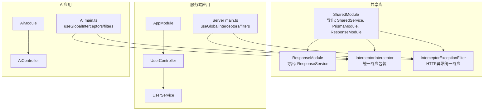
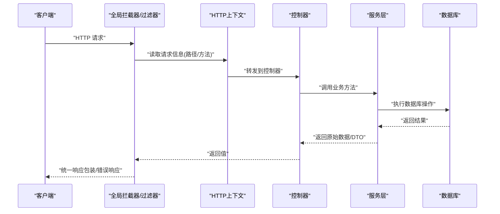
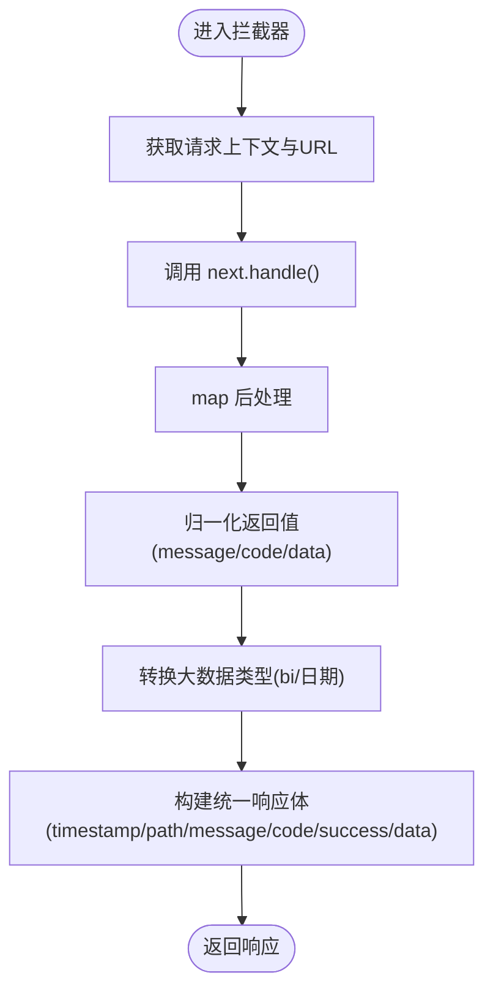
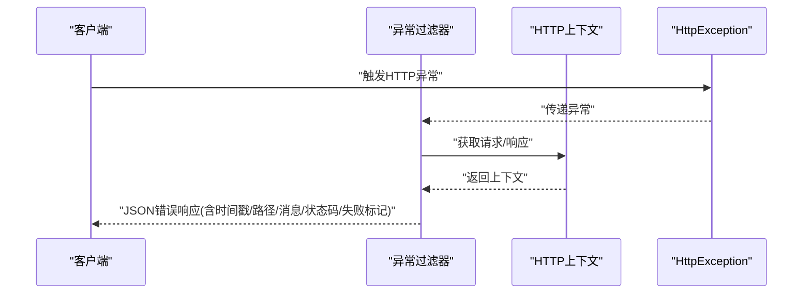
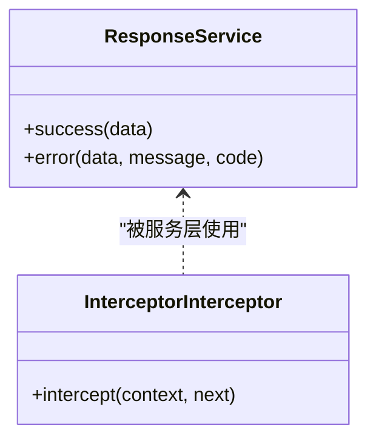
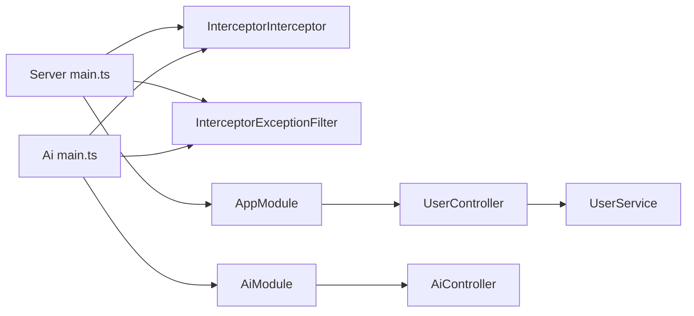
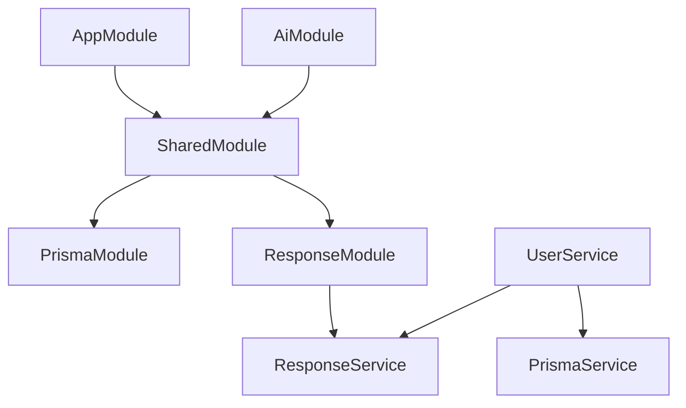

# 拦截器系统

<cite>
**本文引用的文件**
- [server\libs\shared\src\interceptor\interceptor.ts](file://server/libs/shared/src/interceptor/interceptor.ts)
- [server\libs\shared\src\interceptor\exceptionFilter.ts](file://server/libs/shared/src/interceptor/exceptionFilter.ts)
- [server\libs\shared\src\response\response.service.ts](file://server/libs/shared/src/response/response.service.ts)
- [server\libs\shared\src\response\response.module.ts](file://server/libs/shared/src/response/response.module.ts)
- [server\libs\shared\src\shared.module.ts](file://server/libs/shared/src/shared.module.ts)
- [server\apps\server\src\main.ts](file://server/apps/server/src/main.ts)
- [server\apps\ai\src\main.ts](file://server/apps/ai/src/main.ts)
- [server\apps\server\src\app.module.ts](file://server/apps/server/src/app.module.ts)
- [server\apps\server\src\user\user.controller.ts](file://server/apps/server/src/user/user.controller.ts)
- [server\apps\server\src\user\user.service.ts](file://server/apps/server/src/user/user.service.ts)
- [server\apps\ai\src\ai.controller.ts](file://server/apps/ai/src/ai.controller.ts)
- [server\apps\ai\src\ai.module.ts](file://server/apps/ai/src/ai.module.ts)
- [server\libs\shared\src\prisma\prisma.service.ts](file://server/libs/shared/src/prisma/prisma.service.ts)
</cite>

## 目录
1. [简介](#简介)
2. [项目结构](#项目结构)
3. [核心组件](#核心组件)
4. [架构总览](#架构总览)
5. [详细组件分析](#详细组件分析)
6. [依赖关系分析](#依赖关系分析)
7. [性能考虑](#性能考虑)
8. [故障排查指南](#故障排查指南)
9. [结论](#结论)
10. [附录](#附录)

## 简介
本文件面向英语学习平台的后端拦截器系统，系统性阐述拦截器的设计模式、请求/响应拦截流程与全局中间件机制；详解自定义拦截器的实现方式、请求预处理与响应后处理逻辑；解释异常过滤器的异常处理策略、错误捕获机制与统一错误响应；并覆盖请求日志记录、性能监控与安全验证的实现要点。最后提供拦截器的开发指南、调试技巧与性能优化建议。

## 项目结构
拦截器系统位于共享库模块中，通过全局注册的方式在多个应用（服务端应用与AI应用）中生效。整体结构如下：

图表来源
- [server\libs\shared\src\shared.module.ts:1-13](file://server/libs/shared/src/shared.module.ts#L1-L13)
- [server\libs\shared\src\response\response.module.ts:1-9](file://server/libs/shared/src/response/response.module.ts#L1-L9)
- [server\libs\shared\src\interceptor\interceptor.ts:59-85](file://server/libs/shared/src/interceptor/interceptor.ts#L59-L85)
- [server\libs\shared\src\interceptor\exceptionFilter.ts:8-22](file://server/libs/shared/src/interceptor/exceptionFilter.ts#L8-L22)
- [server\apps\server\src\main.ts:8-16](file://server/apps/server/src/main.ts#L8-L16)
- [server\apps\ai\src\main.ts:7-11](file://server/apps/ai/src/main.ts#L7-L11)
- [server\apps\server\src\user\user.controller.ts:1-35](file://server/apps/server/src/user/user.controller.ts#L1-L35)
- [server\apps\ai\src\ai.controller.ts:1-13](file://server/apps/ai/src/ai.controller.ts#L1-L13)

章节来源
- [server\apps\server\src\main.ts:8-16](file://server/apps/server/src/main.ts#L8-L16)
- [server\apps\ai\src\main.ts:7-11](file://server/apps/ai/src/main.ts#L7-L11)
- [server\libs\shared\src\shared.module.ts:1-13](file://server/libs/shared/src/shared.module.ts#L1-L13)

## 核心组件
- 统一响应拦截器 InterceptorInterceptor
  - 责任：对控制器返回值进行标准化包装，统一响应结构，包含时间戳、路径、消息、状态码、成功标记与数据字段；并对大整型数据进行序列化兼容处理。
  - 关键点：基于 RxJS 的 map 操作符在 next.handle() 后进行响应后处理；支持从任意返回值中提取 message/code/data 并归一化。
- 异常过滤器 InterceptorExceptionFilter
  - 责任：捕获 HTTP 异常，输出统一格式的错误响应，包含时间戳、路径、消息、状态码与失败标记。
- 响应服务 ResponseService
  - 责任：提供业务层统一的成功/错误返回体构造方法，便于服务层规范返回。
- 全局注册点
  - 在服务端与AI应用的引导文件中，分别注册全局拦截器与异常过滤器，并设置全局前缀与版本控制策略。

章节来源
- [server\libs\shared\src\interceptor\interceptor.ts:59-85](file://server/libs/shared/src/interceptor/interceptor.ts#L59-L85)
- [server\libs\shared\src\interceptor\exceptionFilter.ts:8-22](file://server/libs/shared/src/interceptor/exceptionFilter.ts#L8-L22)
- [server\libs\shared\src\response\response.service.ts:12-28](file://server/libs/shared/src/response/response.service.ts#L12-L28)
- [server\apps\server\src\main.ts:8-16](file://server/apps/server/src/main.ts#L8-L16)
- [server\apps\ai\src\main.ts:7-11](file://server/apps/ai/src/main.ts#L7-L11)

## 架构总览
拦截器与异常过滤器作为全局中间件，在请求进入控制器之前与抛出异常时进行处理，形成“请求预处理—业务执行—响应后处理/异常捕获”的闭环。

图表来源
- [server\apps\server\src\main.ts:8-16](file://server/apps/server/src/main.ts#L8-L16)
- [server\apps\ai\src\main.ts:7-11](file://server/apps/ai/src/main.ts#L7-L11)
- [server\libs\shared\src\interceptor\interceptor.ts:64-84](file://server/libs/shared/src/interceptor/interceptor.ts#L64-L84)
- [server\libs\shared\src\interceptor\exceptionFilter.ts:10-21](file://server/libs/shared/src/interceptor/exceptionFilter.ts#L10-L21)

## 详细组件分析

### 统一响应拦截器 InterceptorInterceptor
- 设计模式
  - 使用 NestJS 拦截器模式，基于 RxJS 的管道（pipe）在 next.handle() 后进行响应后处理，符合非阻塞、可组合的设计理念。
- 数据结构与处理逻辑
  - 归一化输入：从任意返回值中提取 message/code/data 字段，确保后续统一结构稳定。
  - 类型安全：通过辅助函数判断对象类型，避免对非对象类型进行错误解析。
  - 大整型兼容：将 bigint 转换为字符串，数组与对象递归处理，保持日期类型不变。
  - 统一响应：生成包含时间戳、路径、消息、状态码、成功标记与数据的结构化响应体。
- 请求/响应拦截流程
  - 请求进入：从 ExecutionContext 获取 HTTP 上下文与原生请求对象。
  - 响应后处理：next.handle() 返回的 Observable 在 map 中被包装为统一结构。
- 自定义扩展建议
  - 可在拦截器中加入请求日志记录（如访问时间、用户标识、耗时统计），并在 map 中追加字段。
  - 可根据路由或用户角色调整 message/code 的默认值或映射规则。

图表来源
- [server\libs\shared\src\interceptor\interceptor.ts:64-84](file://server/libs/shared/src/interceptor/interceptor.ts#L64-L84)
- [server\libs\shared\src\interceptor\interceptor.ts:28-57](file://server/libs/shared/src/interceptor/interceptor.ts#L28-L57)

章节来源
- [server\libs\shared\src\interceptor\interceptor.ts:10-85](file://server/libs/shared/src/interceptor/interceptor.ts#L10-L85)

### 异常过滤器 InterceptorExceptionFilter
- 设计模式
  - 使用 NestJS 异常过滤器模式，@Catch 指定捕获范围（此处为 HTTP 异常）。
- 错误捕获与统一响应
  - 从 ArgumentsHost 获取 HTTP 上下文，读取请求路径与响应句柄。
  - 以异常状态码作为响应状态，输出统一的错误响应体（时间戳、路径、消息、状态码、失败标记）。
- 适用场景
  - 用于处理业务抛出的 HttpException 或框架产生的 HTTP 错误，保证错误输出的一致性与可观测性。

图表来源
- [server\libs\shared\src\interceptor\exceptionFilter.ts:8-22](file://server/libs/shared/src/interceptor/exceptionFilter.ts#L8-L22)

章节来源
- [server\libs\shared\src\interceptor\exceptionFilter.ts:1-23](file://server/libs/shared/src/interceptor/exceptionFilter.ts#L1-L23)

### 响应服务 ResponseService
- 设计目的
  - 提供业务层统一的成功/错误返回体构造方法，减少重复代码，提升一致性。
- 使用方式
  - 控制器或服务层直接返回 ResponseService 的 success/error 包装结果，再由拦截器统一包装为最终响应。
- 与拦截器的关系
  - ResponseService 仅负责构造 message/code/data，拦截器负责补充 timestamp/path/success 等统一字段。

图表来源
- [server\libs\shared\src\response\response.service.ts:12-28](file://server/libs/shared/src/response/response.service.ts#L12-L28)
- [server\libs\shared\src\interceptor\interceptor.ts:59-85](file://server/libs/shared/src/interceptor/interceptor.ts#L59-L85)

章节来源
- [server\libs\shared\src\response\response.service.ts:12-28](file://server/libs/shared/src/response/response.service.ts#L12-L28)

### 全局中间件机制与应用集成
- 服务端应用
  - 在引导文件中注册全局拦截器与异常过滤器，并设置全局前缀与 URI 版本控制。
  - 通过模块导入共享库，使拦截器与响应服务在各控制器中生效。
- AI 应用
  - 同样注册全局拦截器与异常过滤器，保持一致的响应与错误风格。
- 控制器与服务层示例
  - 用户控制器与AI控制器分别在各自应用中生效，服务层可直接使用 ResponseService 进行返回包装。

图表来源
- [server\apps\server\src\main.ts:8-16](file://server/apps/server/src/main.ts#L8-L16)
- [server\apps\ai\src\main.ts:7-11](file://server/apps/ai/src/main.ts#L7-L11)
- [server\apps\server\src\app.module.ts:1-13](file://server/apps/server/src/app.module.ts#L1-L13)
- [server\apps\ai\src\ai.module.ts:1-12](file://server/apps/ai/src/ai.module.ts#L1-L12)

章节来源
- [server\apps\server\src\main.ts:8-16](file://server/apps/server/src/main.ts#L8-L16)
- [server\apps\ai\src\main.ts:7-11](file://server/apps/ai/src/main.ts#L7-L11)
- [server\apps\server\src\user\user.controller.ts:1-35](file://server/apps/server/src/user/user.controller.ts#L1-L35)
- [server\apps\ai\src\ai.controller.ts:1-13](file://server/apps/ai/src/ai.controller.ts#L1-L13)

## 依赖关系分析
- 模块导出与导入
  - SharedModule 导出 SharedService、PrismaModule、ResponseModule，供其他模块使用。
  - ResponseModule 导出 ResponseService，供服务层注入使用。
- 应用模块依赖
  - 服务端与AI应用均导入 SharedModule，从而获得拦截器与响应服务。
- 服务层依赖
  - 服务层通过 ResponseService 统一返回体，PrismaService 访问数据库。

图表来源
- [server\libs\shared\src\shared.module.ts:1-13](file://server/libs/shared/src/shared.module.ts#L1-L13)
- [server\libs\shared\src\response\response.module.ts:1-9](file://server/libs/shared/src/response/response.module.ts#L1-L9)
- [server\apps\server\src\user\user.service.ts:1-34](file://server/apps/server/src/user/user.service.ts#L1-L34)

章节来源
- [server\libs\shared\src\shared.module.ts:1-13](file://server/libs/shared/src/shared.module.ts#L1-L13)
- [server\libs\shared\src\response\response.module.ts:1-9](file://server/libs/shared/src/response/response.module.ts#L1-L9)
- [server\apps\server\src\user\user.service.ts:1-34](file://server/apps/server/src/user/user.service.ts#L1-L34)

## 性能考虑
- 拦截器开销
  - 拦截器在 next.handle() 后进行响应后处理，属于轻量级操作；对大数据量返回时，统一响应包装与大整型转换可能带来额外成本。
- 优化建议
  - 对于高频接口，可在拦截器中引入缓存策略（如命中率低的字段复用）与条件化处理（仅在需要时进行深度转换）。
  - 避免在拦截器中执行阻塞操作（如同步IO、复杂计算），必要时异步化或延迟到后台任务。
  - 结合请求日志与性能监控工具，识别慢请求并针对性优化。
- 版本控制与前缀
  - 应用已启用 URI 版本控制与全局前缀，有助于演进式发布与灰度策略，间接降低变更风险与回滚成本。

## 故障排查指南
- 常见问题
  - 响应未被统一包装：确认是否正确注册了全局拦截器与异常过滤器。
  - 错误未按统一格式返回：检查是否抛出了 HttpException，或是否被其他过滤器覆盖。
  - 数据类型异常：若出现大整型丢失精度，确认拦截器的大整型转换逻辑是否生效。
- 排查步骤
  - 在拦截器中增加请求日志（路径、方法、入参摘要、耗时），定位异常请求。
  - 对服务层返回值进行断点检查，确保 ResponseService 的 success/error 使用正确。
  - 在异常过滤器中增加更详细的上下文信息（如用户ID、请求ID），便于追踪。
- 相关实现参考
  - 全局注册位置与版本控制策略。
  - 异常过滤器的捕获范围与响应格式。

章节来源
- [server\apps\server\src\main.ts:8-16](file://server/apps/server/src/main.ts#L8-L16)
- [server\apps\ai\src\main.ts:7-11](file://server/apps/ai/src/main.ts#L7-L11)
- [server\libs\shared\src\interceptor\exceptionFilter.ts:8-22](file://server/libs/shared/src/interceptor/exceptionFilter.ts#L8-L22)

## 结论
拦截器系统通过统一响应包装与异常过滤，实现了跨应用的一致性输出与可观测性。结合 ResponseService 的规范化返回与全局注册机制，开发者可以专注于业务逻辑，同时确保请求/响应流程的标准化与安全性。建议在生产环境中配合请求日志、性能监控与安全校验，持续优化拦截器的性能与稳定性。

## 附录
- 开发指南
  - 自定义拦截器：继承 NestInterceptor，重写 intercept 方法，在 next.handle() 前后插入预处理与后处理逻辑。
  - 自定义异常过滤器：继承 ExceptionFilter，重写 catch 方法，针对特定异常类型输出统一错误响应。
  - 扩展统一响应：在拦截器中增加字段（如请求ID、用户标识、耗时），并与日志/监控系统打通。
- 调试技巧
  - 在拦截器与异常过滤器中打印关键上下文（路径、状态码、消息、耗时）。
  - 使用单元测试覆盖不同返回类型与异常分支，确保拦截器与过滤器行为稳定。
- 安全验证建议
  - 在拦截器中加入请求签名/鉴权校验（如 JWT 校验、IP 白名单），在 next.handle() 前执行。
  - 对敏感字段进行脱敏处理（如日志中隐藏密码、手机号等）。
- 性能优化建议
  - 减少拦截器中的深拷贝与序列化操作，优先使用流式处理。
  - 对热点接口采用缓存与限流策略，拦截器中记录指标并上报监控系统。