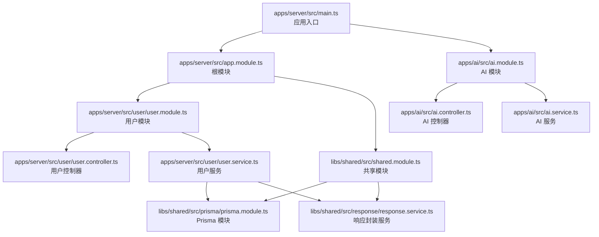
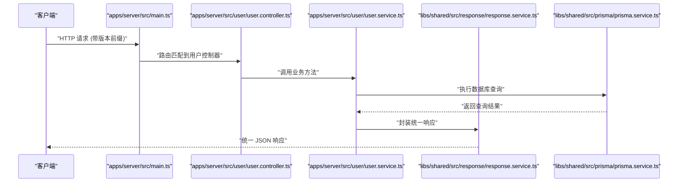
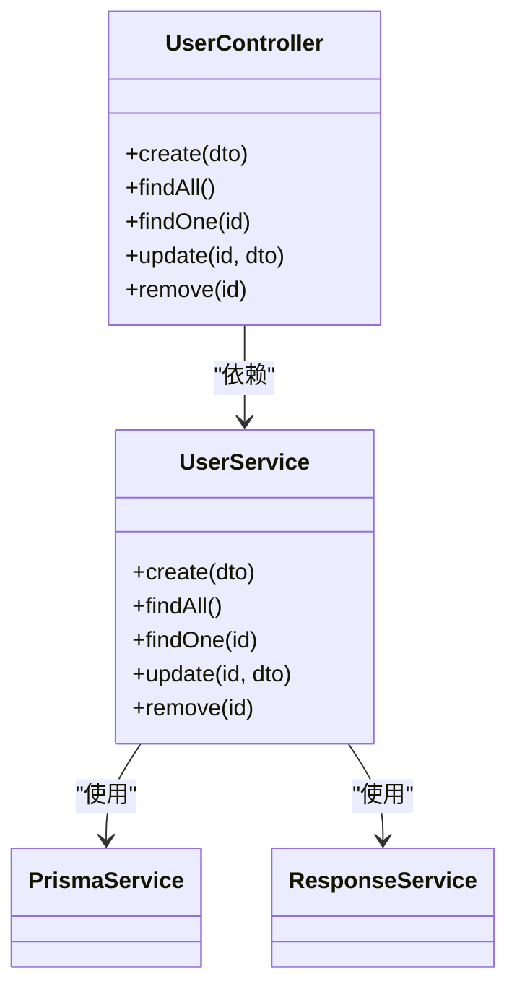
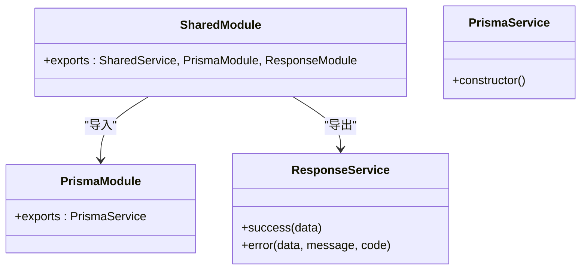
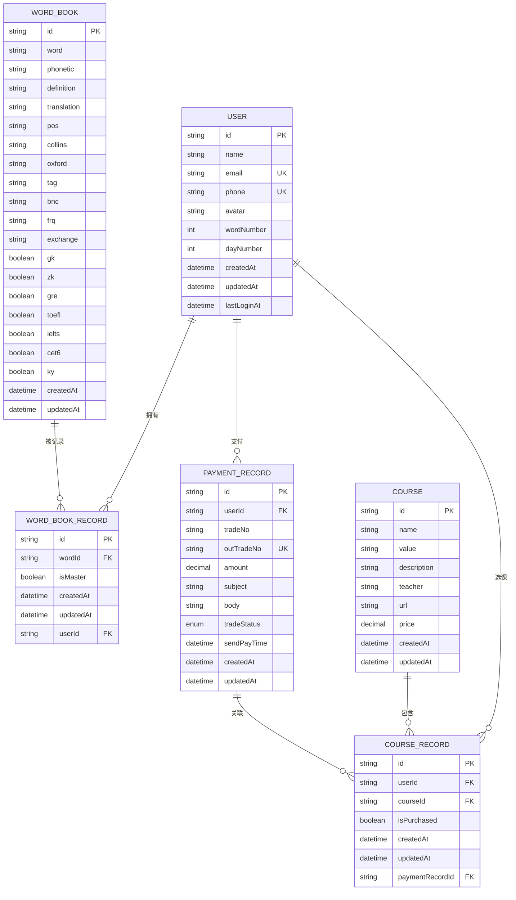
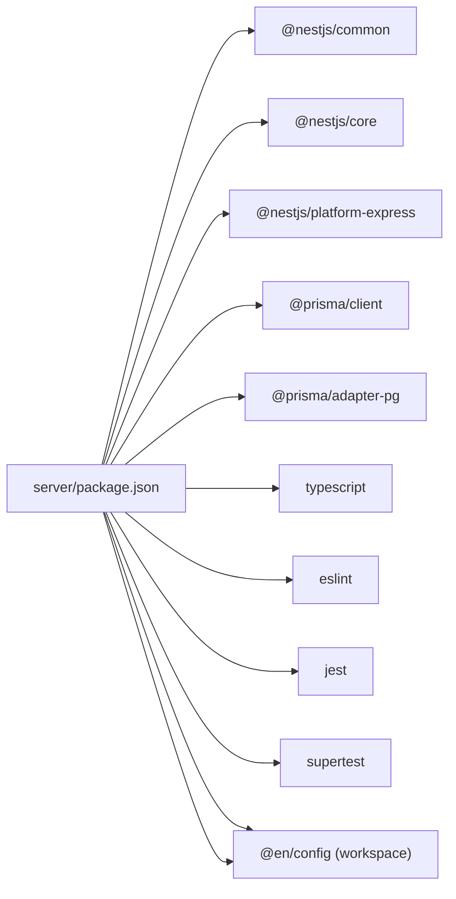

# 后端开发

<cite>
**本文引用的文件**
- [apps/server/src/app.module.ts](file://apps/server/src/app.module.ts)
- [apps/server/src/main.ts](file://apps/server/src/main.ts)
- [apps/server/src/user/user.module.ts](file://apps/server/src/user/user.module.ts)
- [apps/server/src/user/user.controller.ts](file://apps/server/src/user/user.controller.ts)
- [apps/server/src/user/user.service.ts](file://apps/server/src/user/user.service.ts)
- [apps/server/src/user/entities/user.entity.ts](file://apps/server/src/user/entities/user.entity.ts)
- [apps/server/src/user/dto/create-user.dto.ts](file://apps/server/src/user/dto/create-user.dto.ts)
- [apps/ai/src/ai.module.ts](file://apps/ai/src/ai.module.ts)
- [apps/ai/src/ai.controller.ts](file://apps/ai/src/ai.controller.ts)
- [apps/ai/src/ai.service.ts](file://apps/ai/src/ai.service.ts)
- [libs/shared/src/shared.module.ts](file://libs/shared/src/shared.module.ts)
- [libs/shared/src/prisma/prisma.module.ts](file://libs/shared/src/prisma/prisma.module.ts)
- [libs/shared/src/prisma/prisma.service.ts](file://libs/shared/src/prisma/prisma.service.ts)
- [libs/shared/src/response/response.service.ts](file://libs/shared/src/response/response.service.ts)
- [prisma/schema.prisma](file://prisma/schema.prisma)
- [server/package.json](file://server/package.json)
</cite>

## 目录
1. [简介](#简介)
2. [项目结构](#项目结构)
3. [核心组件](#核心组件)
4. [架构总览](#架构总览)
5. [详细组件分析](#详细组件分析)
6. [依赖分析](#依赖分析)
7. [性能考虑](#性能考虑)
8. [故障排查指南](#故障排查指南)
9. [结论](#结论)
10. [附录](#附录)

## 简介
本技术文档面向英语学习平台后端开发，系统性阐述基于 NestJS 的应用架构、模块化设计与依赖注入机制；详解用户管理、AI 问答、聊天记录等核心业务模块的实现思路；覆盖控制器层、服务层、数据传输对象（DTO）、实体模型等分层设计模式；说明 Prisma ORM 的使用方式、数据库建模与迁移策略；给出 API 设计规范、错误处理机制、安全策略与性能优化建议，并总结后端开发最佳实践与常见问题解决方案。

## 项目结构
后端采用多包工作区组织，核心应用位于 server/apps 下，共享能力封装在 libs/shared 中，数据库模型与迁移由 prisma 统一管理。入口文件负责初始化 Nest 应用、注册全局拦截器与异常过滤器、设置全局路由前缀与 URI 版本控制，随后启动服务。

图表来源
- [apps/server/src/main.ts:1-20](file://apps/server/src/main.ts#L1-L20)
- [apps/server/src/app.module.ts:1-13](file://apps/server/src/app.module.ts#L1-L13)
- [apps/server/src/user/user.module.ts:1-10](file://apps/server/src/user/user.module.ts#L1-L10)
- [apps/server/src/user/user.controller.ts:1-35](file://apps/server/src/user/user.controller.ts#L1-L35)
- [apps/server/src/user/user.service.ts:1-34](file://apps/server/src/user/user.service.ts#L1-L34)
- [libs/shared/src/shared.module.ts:1-13](file://libs/shared/src/shared.module.ts#L1-L13)
- [libs/shared/src/prisma/prisma.module.ts:1-9](file://libs/shared/src/prisma/prisma.module.ts#L1-L9)
- [libs/shared/src/response/response.service.ts:1-29](file://libs/shared/src/response/response.service.ts#L1-L29)
- [apps/ai/src/ai.module.ts:1-12](file://apps/ai/src/ai.module.ts#L1-L12)
- [apps/ai/src/ai.controller.ts:1-13](file://apps/ai/src/ai.controller.ts#L1-L13)
- [apps/ai/src/ai.service.ts:1-9](file://apps/ai/src/ai.service.ts#L1-L9)

章节来源
- [apps/server/src/main.ts:1-20](file://apps/server/src/main.ts#L1-L20)
- [apps/server/src/app.module.ts:1-13](file://apps/server/src/app.module.ts#L1-L13)
- [server/package.json:1-52](file://server/package.json#L1-L52)

## 核心组件
- 应用入口与全局配置：设置全局前缀、URI 版本控制、注册全局拦截器与异常过滤器，统一输出格式与错误处理。
- 共享模块：集中导出 Prisma 与响应封装能力，供各业务模块复用。
- 用户模块：提供用户增删改查接口，服务层通过 Prisma 进行数据访问，统一返回响应结构。
- AI 模块：演示性示例，展示如何扩展新的业务域。
- 数据库与 ORM：基于 Prisma 的 PostgreSQL 客户端，生成客户端并按需适配连接。

章节来源
- [apps/server/src/main.ts:1-20](file://apps/server/src/main.ts#L1-L20)
- [libs/shared/src/shared.module.ts:1-13](file://libs/shared/src/shared.module.ts#L1-L13)
- [apps/server/src/user/user.module.ts:1-10](file://apps/server/src/user/user.module.ts#L1-L10)
- [apps/server/src/user/user.service.ts:1-34](file://apps/server/src/user/user.service.ts#L1-L34)
- [apps/ai/src/ai.module.ts:1-12](file://apps/ai/src/ai.module.ts#L1-L12)

## 架构总览
下图展示了从请求进入至响应返回的关键路径，包括版本控制、拦截器、服务调用与数据库交互。

图表来源
- [apps/server/src/main.ts:1-20](file://apps/server/src/main.ts#L1-L20)
- [apps/server/src/user/user.controller.ts:1-35](file://apps/server/src/user/user.controller.ts#L1-L35)
- [apps/server/src/user/user.service.ts:1-34](file://apps/server/src/user/user.service.ts#L1-L34)
- [libs/shared/src/response/response.service.ts:1-29](file://libs/shared/src/response/response.service.ts#L1-L29)
- [libs/shared/src/prisma/prisma.service.ts:1-18](file://libs/shared/src/prisma/prisma.service.ts#L1-L18)

## 详细组件分析

### 应用入口与全局配置
- 初始化 Nest 应用，注册全局拦截器与异常过滤器，确保所有响应格式一致、异常被捕获并标准化。
- 设置全局路由前缀与 URI 版本控制，便于后续演进与向后兼容。
- 读取环境变量中的端口配置，启动服务。

章节来源
- [apps/server/src/main.ts:1-20](file://apps/server/src/main.ts#L1-L20)

### 根模块与模块装配
- 根模块引入用户模块与共享模块，作为应用的装配中心。
- 通过依赖注入将控制器与服务绑定，形成清晰的职责边界。

章节来源
- [apps/server/src/app.module.ts:1-13](file://apps/server/src/app.module.ts#L1-L13)

### 用户模块（用户管理）
- 控制器层：定义用户资源的 CRUD 接口，参数校验与 DTO 绑定。
- 服务层：封装业务逻辑，使用 Prisma 进行数据持久化，统一通过响应服务返回标准结构。
- 实体与 DTO：当前实体与 DTO 类为空占位，便于后续按需扩展字段与约束。

图表来源
- [apps/server/src/user/user.controller.ts:1-35](file://apps/server/src/user/user.controller.ts#L1-L35)
- [apps/server/src/user/user.service.ts:1-34](file://apps/server/src/user/user.service.ts#L1-L34)
- [libs/shared/src/prisma/prisma.service.ts:1-18](file://libs/shared/src/prisma/prisma.service.ts#L1-L18)
- [libs/shared/src/response/response.service.ts:1-29](file://libs/shared/src/response/response.service.ts#L1-L29)

章节来源
- [apps/server/src/user/user.module.ts:1-10](file://apps/server/src/user/user.module.ts#L1-L10)
- [apps/server/src/user/user.controller.ts:1-35](file://apps/server/src/user/user.controller.ts#L1-L35)
- [apps/server/src/user/user.service.ts:1-34](file://apps/server/src/user/user.service.ts#L1-L34)
- [apps/server/src/user/entities/user.entity.ts:1-2](file://apps/server/src/user/entities/user.entity.ts#L1-L2)
- [apps/server/src/user/dto/create-user.dto.ts:1-2](file://apps/server/src/user/dto/create-user.dto.ts#L1-L2)

### AI 模块（AI 问答）
- 当前为演示性模块，展示如何新增业务域并接入控制器与服务。
- 可在此基础上扩展聊天记录、对话上下文管理与外部 AI 接口集成。

章节来源
- [apps/ai/src/ai.module.ts:1-12](file://apps/ai/src/ai.module.ts#L1-L12)
- [apps/ai/src/ai.controller.ts:1-13](file://apps/ai/src/ai.controller.ts#L1-L13)
- [apps/ai/src/ai.service.ts:1-9](file://apps/ai/src/ai.service.ts#L1-L9)

### 共享模块与基础设施
- 共享模块导出 Prisma 与响应封装模块，作为全局可用能力。
- Prisma 模块提供 PrismaService，继承 PrismaClient 并以适配器方式连接 PostgreSQL。
- 响应服务提供统一的成功/错误响应结构，简化控制器与服务层的返回逻辑。

图表来源
- [libs/shared/src/shared.module.ts:1-13](file://libs/shared/src/shared.module.ts#L1-L13)
- [libs/shared/src/prisma/prisma.module.ts:1-9](file://libs/shared/src/prisma/prisma.module.ts#L1-L9)
- [libs/shared/src/prisma/prisma.service.ts:1-18](file://libs/shared/src/prisma/prisma.service.ts#L1-L18)
- [libs/shared/src/response/response.service.ts:1-29](file://libs/shared/src/response/response.service.ts#L1-L29)

章节来源
- [libs/shared/src/shared.module.ts:1-13](file://libs/shared/src/shared.module.ts#L1-L13)
- [libs/shared/src/prisma/prisma.module.ts:1-9](file://libs/shared/src/prisma/prisma.module.ts#L1-L9)
- [libs/shared/src/prisma/prisma.service.ts:1-18](file://libs/shared/src/prisma/prisma.service.ts#L1-L18)
- [libs/shared/src/response/response.service.ts:1-29](file://libs/shared/src/response/response.service.ts#L1-L29)

### 数据库设计与迁移
- 使用 Prisma Schema 描述数据模型，包含用户、单词本记录、单词、支付记录、课程记录与课程等。
- 通过索引提升查询效率，如对单词与标签建立复合索引。
- 生成 Prisma 客户端并指定输出目录，便于在应用中直接使用。

图表来源
- [prisma/schema.prisma:1-133](file://prisma/schema.prisma#L1-L133)

章节来源
- [prisma/schema.prisma:1-133](file://prisma/schema.prisma#L1-L133)

### API 设计规范
- 路由前缀：统一使用 api 前缀，便于版本化与隔离。
- 版本控制：采用 URI 版本控制，默认 v1，未来可扩展 v2。
- 响应格式：统一由响应服务封装，包含 code、message 与 data 字段，便于前端解析与错误提示。
- 参数校验：建议在 DTO 层添加验证装饰器，结合拦截器进行参数清洗与转换。

章节来源
- [apps/server/src/main.ts:1-20](file://apps/server/src/main.ts#L1-L20)
- [libs/shared/src/response/response.service.ts:1-29](file://libs/shared/src/response/response.service.ts#L1-L29)

### 错误处理机制
- 全局异常过滤器捕获未处理异常，统一返回错误响应。
- 响应服务提供 error 方法，支持自定义 code 与 message。
- 建议在服务层对业务异常进行分类处理，避免将内部错误细节暴露给客户端。

章节来源
- [apps/server/src/main.ts:1-20](file://apps/server/src/main.ts#L1-L20)
- [libs/shared/src/response/response.service.ts:1-29](file://libs/shared/src/response/response.service.ts#L1-L29)

### 安全策略
- 输入校验：在 DTO 中定义字段约束与校验规则，结合拦截器进行预处理。
- 身份认证与授权：建议引入鉴权中间件或守卫，结合会话/令牌管理。
- 数据脱敏：对敏感字段（如密码）进行存储加密与传输加密。
- CORS 与速率限制：根据部署环境配置跨域策略与请求频率限制。

章节来源
- [apps/server/src/user/user.controller.ts:1-35](file://apps/server/src/user/user.controller.ts#L1-L35)
- [apps/server/src/user/user.service.ts:1-34](file://apps/server/src/user/user.service.ts#L1-L34)

### 性能优化方案
- 查询优化：为高频查询字段建立索引，减少全表扫描；合理使用分页与投影。
- 缓存策略：对热点数据引入缓存层，降低数据库压力。
- 连接池与适配器：使用 Prisma 的适配器与连接池配置，提升并发能力。
- 日志与监控：开启慢查询日志与关键指标埋点，持续观察性能瓶颈。

章节来源
- [prisma/schema.prisma:1-133](file://prisma/schema.prisma#L1-L133)
- [libs/shared/src/prisma/prisma.service.ts:1-18](file://libs/shared/src/prisma/prisma.service.ts#L1-L18)

## 依赖分析
- NestJS 核心依赖：@nestjs/common、@nestjs/core、@nestjs/platform-express 提供框架运行时与 HTTP 服务器。
- Prisma 生态：@prisma/client、@prisma/adapter-pg 用于生成客户端与适配 PostgreSQL。
- 开发工具链：TypeScript、ESLint、Jest、Supertest 等保障代码质量与测试覆盖率。
- 工作区依赖：@en/common、@en/config 通过 workspace:* 引入，便于共享配置与通用工具。

图表来源
- [server/package.json:1-52](file://server/package.json#L1-L52)

章节来源
- [server/package.json:1-52](file://server/package.json#L1-L52)

## 性能考虑
- 数据访问层：优先使用事务与批量写入，减少往返次数；对复杂查询进行 EXPLAIN 分析。
- 缓存与降级：热点接口引入缓存，异常情况下提供降级策略与兜底数据。
- 并发与限流：结合网关或中间件实现请求限流，避免雪崩效应。
- 监控与告警：埋点关键链路耗时、错误率与资源占用，及时发现性能退化。

## 故障排查指南
- 启动失败：检查 DATABASE_URL 环境变量是否正确，确认 Prisma 适配器初始化无误。
- 响应异常：确认全局拦截器与异常过滤器是否生效，核对响应服务的返回结构。
- 数据库连接：验证 PostgreSQL 可达性与权限，检查 Prisma 客户端生成路径与版本。
- 版本不匹配：当升级 Nest 或 Prisma 时，注意迁移脚本与客户端生成命令的同步。

章节来源
- [apps/server/src/main.ts:1-20](file://apps/server/src/main.ts#L1-L20)
- [libs/shared/src/prisma/prisma.service.ts:1-18](file://libs/shared/src/prisma/prisma.service.ts#L1-L18)
- [libs/shared/src/response/response.service.ts:1-29](file://libs/shared/src/response/response.service.ts#L1-L29)

## 结论
该后端代码库以 NestJS 为核心，采用模块化与依赖注入实现清晰的分层架构；通过共享模块统一提供 Prisma 与响应封装能力；数据库模型围绕用户与学习记录展开，具备良好的扩展性。建议后续完善 DTO 校验、鉴权与缓存策略，并持续优化查询与监控体系，以支撑业务增长与高并发场景。

## 附录
- 开发与构建：使用 npm scripts 进行构建、调试、测试与覆盖率统计。
- 迁移与发布：结合 Prisma 迁移与 Nest 构建产物，按需部署至生产环境。

章节来源
- [server/package.json:1-52](file://server/package.json#L1-L52)