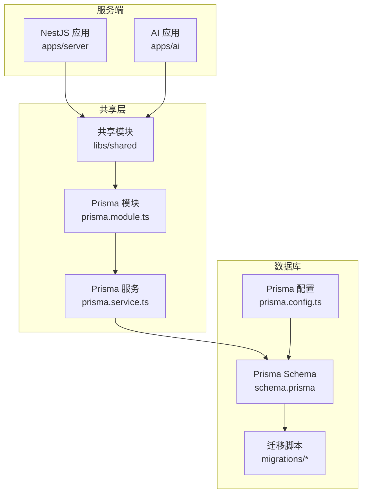
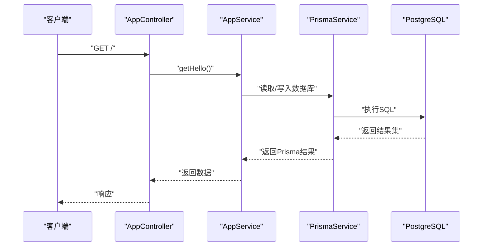
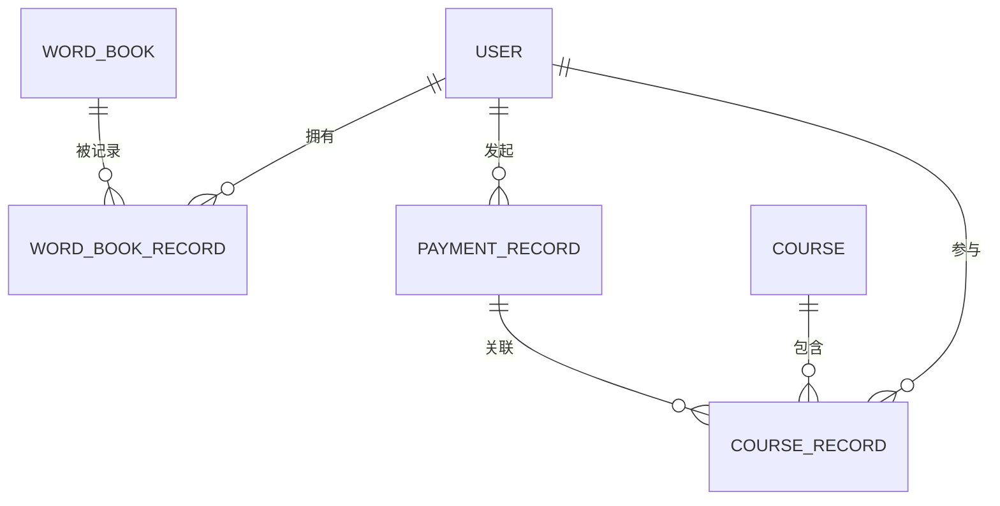
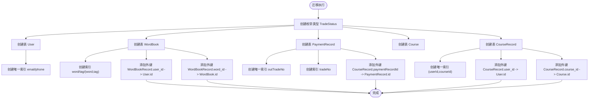
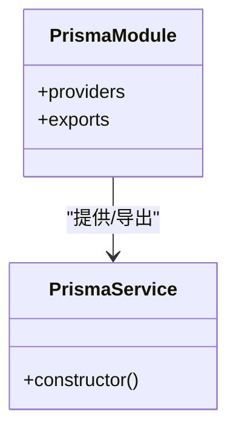
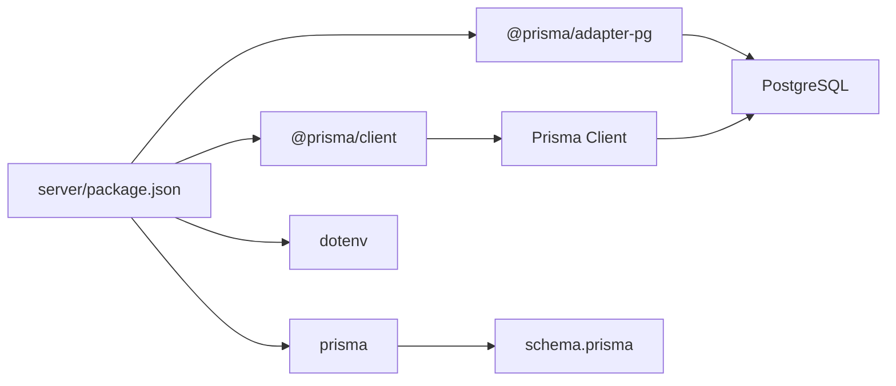

# 数据库设计与Prisma

<cite>
**本文引用的文件**
- [schema.prisma](file://server/prisma/schema.prisma)
- [prisma.service.ts](file://server/libs/shared/src/prisma/prisma.service.ts)
- [prisma.module.ts](file://server/libs/shared/src/prisma/prisma.module.ts)
- [migration.sql](file://server/prisma/migrations/20260513053954_init/migration.sql)
- [prisma.config.ts](file://server/prisma.config.ts)
- [user.service.ts](file://server/apps/server/src/user/user.service.ts)
- [app.service.ts](file://server/apps/server/src/app.service.ts)
- [app.controller.ts](file://server/apps/server/src/app.controller.ts)
- [package.json](file://server/package.json)
- [create-user.dto.ts](file://server/apps/server/src/user/dto/create-user.dto.ts)
- [update-user.dto.ts](file://server/apps/server/src/user/dto/update-user.dto.ts)
</cite>

## 目录
1. [简介](#简介)
2. [项目结构](#项目结构)
3. [核心组件](#核心组件)
4. [架构总览](#架构总览)
5. [详细组件分析](#详细组件分析)
6. [依赖分析](#依赖分析)
7. [性能考虑](#性能考虑)
8. [故障排查指南](#故障排查指南)
9. [结论](#结论)
10. [附录](#附录)

## 简介
本文件面向英语学习平台的数据库设计与Prisma ORM实践，系统阐述Prisma Schema的设计原则、数据模型与关系映射、迁移与版本管理、Prisma Service在NestJS中的集成方式、查询优化与事务处理建议、实体关系图、索引与约束设计、数据访问模式与缓存策略，并总结数据库设计最佳实践与维护指南。本文所有技术结论均基于仓库中现有的Schema、迁移脚本、Prisma配置与服务封装。

## 项目结构
该工程采用Monorepo结构，后端以NestJS应用为核心，共享层提供Prisma服务与通用模块；数据库层通过Prisma Schema与PostgreSQL迁移脚本进行管理。

图表来源
- [prisma.service.ts:1-18](file://server/libs/shared/src/prisma/prisma.service.ts#L1-L18)
- [prisma.module.ts:1-9](file://server/libs/shared/src/prisma/prisma.module.ts#L1-L9)
- [schema.prisma:1-133](file://server/prisma/schema.prisma#L1-L133)
- [migration.sql:1-151](file://server/prisma/migrations/20260513053954_init/migration.sql#L1-L151)
- [prisma.config.ts:1-15](file://server/prisma.config.ts#L1-L15)

章节来源
- [prisma.service.ts:1-18](file://server/libs/shared/src/prisma/prisma.service.ts#L1-L18)
- [prisma.module.ts:1-9](file://server/libs/shared/src/prisma/prisma.module.ts#L1-L9)
- [schema.prisma:1-133](file://server/prisma/schema.prisma#L1-L133)
- [migration.sql:1-151](file://server/prisma/migrations/20260513053954_init/migration.sql#L1-L151)
- [prisma.config.ts:1-15](file://server/prisma.config.ts#L1-L15)

## 核心组件
- Prisma Schema：定义数据模型、字段类型、索引、唯一约束与关系映射，生成客户端代码供应用层使用。
- 迁移脚本：将Schema转换为PostgreSQL建表、索引与外键等DDL，确保数据库结构与Schema一致。
- Prisma Service：在NestJS中封装PrismaClient，注入连接适配器（PostgreSQL），作为全局单例提供给业务模块。
- NestJS 模块：通过PrismaModule导出PrismaService，便于控制器与服务注入。
- Prisma 配置：指定Schema路径、迁移目录与数据源URL，统一开发与CI环境的配置入口。

章节来源
- [schema.prisma:1-133](file://server/prisma/schema.prisma#L1-L133)
- [migration.sql:1-151](file://server/prisma/migrations/20260513053954_init/migration.sql#L1-L151)
- [prisma.service.ts:1-18](file://server/libs/shared/src/prisma/prisma.service.ts#L1-L18)
- [prisma.module.ts:1-9](file://server/libs/shared/src/prisma/prisma.module.ts#L1-L9)
- [prisma.config.ts:1-15](file://server/prisma.config.ts#L1-L15)

## 架构总览
下图展示从应用到数据库的调用链路与数据流：

图表来源
- [app.controller.ts:1-13](file://server/apps/server/src/app.controller.ts#L1-L13)
- [app.service.ts:1-11](file://server/apps/server/src/app.service.ts#L1-L11)
- [prisma.service.ts:1-18](file://server/libs/shared/src/prisma/prisma.service.ts#L1-L18)

## 详细组件分析

### 数据模型与关系设计
- 用户(User)：主键自增字符串ID，邮箱与手机号唯一，包含基础信息与学习统计字段，关联单词记录、支付记录与课程记录。
- 单词库(WordBook)：存储单词及其多维度属性（音标、释义、翻译、词性、词典标签、考试标签等），建立按单词与标签的复合索引。
- 单词记录(WordBookRecord)：用户与单词的多对一关系，通过外键关联，设置唯一组合(userId, wordId)，防止重复记录。
- 支付记录(PaymentRecord)：与用户一对多，包含订单号唯一索引与第三方流水号索引，枚举状态默认值保障一致性。
- 课程(Course)：课程元数据，与课程记录一对多。
- 课程记录(CourseRecord)：用户与课程的多对一，可选关联支付记录，唯一组合保证用户不可重复购买同一课程。

图表来源
- [schema.prisma:25-132](file://server/prisma/schema.prisma#L25-L132)

章节来源
- [schema.prisma:17-132](file://server/prisma/schema.prisma#L17-L132)

### 索引与约束设计
- 唯一约束
  - 用户：邮箱唯一、手机号唯一
  - 单词记录：(userId, wordId)唯一
  - 支付记录：outTradeNo唯一
  - 课程记录：(userId, courseId)唯一
- 复合索引
  - 单词库：(word)、(tag)、(word, tag)
  - 支付记录：(tradeNo)
- 外键约束
  - 单词记录.user -> User.id（级联删除）
  - 单词记录.word -> WordBook.id（级联删除）
  - 支付记录.user -> User.id（级联删除）
  - 课程记录.paymentRecord -> PaymentRecord.id（级联删除）
  - 课程记录.user -> User.id（级联删除）
  - 课程记录.course -> Course.id（级联删除）

图表来源
- [migration.sql:1-151](file://server/prisma/migrations/20260513053954_init/migration.sql#L1-L151)

章节来源
- [migration.sql:1-151](file://server/prisma/migrations/20260513053954_init/migration.sql#L1-L151)

### Prisma Service与NestJS集成
- PrismaService继承PrismaClient，构造时注入PostgreSQL适配器与连接字符串，作为可注入服务在应用中使用。
- PrismaModule导出PrismaService，便于在其他模块中注入使用。
- 在服务层通过依赖注入获取PrismaService，即可进行数据库操作。

图表来源
- [prisma.service.ts:1-18](file://server/libs/shared/src/prisma/prisma.service.ts#L1-L18)
- [prisma.module.ts:1-9](file://server/libs/shared/src/prisma/prisma.module.ts#L1-L9)

章节来源
- [prisma.service.ts:1-18](file://server/libs/shared/src/prisma/prisma.service.ts#L1-L18)
- [prisma.module.ts:1-9](file://server/libs/shared/src/prisma/prisma.module.ts#L1-L9)

### 查询与事务处理
- 查询示例：用户服务中演示了如何通过PrismaService执行查询并包装响应。
- 事务建议：对于需要强一致性的批量操作（如购买课程与创建支付记录），可在PrismaClient上开启事务，确保原子性与一致性。
- 优化建议：
  - 使用select精确投影，减少网络与序列化开销。
  - 对高频查询字段建立合适索引（已有按word、tag、outTradeNo等索引）。
  - 使用游标分页或基于索引的limit/offset，避免全表扫描。
  - 对复杂联表查询，优先在数据库侧聚合，减少应用侧二次处理。

章节来源
- [user.service.ts:17-20](file://server/apps/server/src/user/user.service.ts#L17-L20)

### 数据访问模式与缓存策略
- 数据访问模式
  - 控制器负责路由与参数校验，服务层封装业务逻辑与数据访问。
  - 通过PrismaService在服务层执行查询与更新，保持关注点分离。
- 缓存策略
  - 对热点查询（如单词详情、用户基本信息）采用应用层缓存（如Redis），结合TTL与失效策略。
  - 对于强一致要求的数据（如支付状态、课程购买状态），应禁用或谨慎使用缓存，必要时采用最终一致的异步刷新机制。

章节来源
- [app.controller.ts:1-13](file://server/apps/server/src/app.controller.ts#L1-L13)
- [app.service.ts:1-11](file://server/apps/server/src/app.service.ts#L1-L11)
- [user.service.ts:1-34](file://server/apps/server/src/user/user.service.ts#L1-L34)

### 迁移策略与版本管理
- 迁移生成：通过Prisma CLI生成迁移脚本，确保Schema变更可追踪。
- 迁移执行：在开发与生产环境分别执行迁移，确保数据库结构与Schema一致。
- 版本管理：迁移目录按时间戳命名，配合prisma.config.ts统一管理迁移路径与数据源URL。
- 回滚策略：建议在生产环境谨慎回滚，优先通过新增迁移修复问题。

章节来源
- [prisma.config.ts:1-15](file://server/prisma.config.ts#L1-L15)
- [migration.sql:1-151](file://server/prisma/migrations/20260513053954_init/migration.sql#L1-L151)

## 依赖分析
- Prisma生态：@prisma/client、prisma、@prisma/adapter-pg用于生成客户端与连接PostgreSQL。
- NestJS：通过@nestjs/common与模块系统集成PrismaService。
- 环境变量：通过dotenv加载DATABASE_URL，驱动连接字符串。

图表来源
- [package.json:22-35](file://server/package.json#L22-L35)

章节来源
- [package.json:1-52](file://server/package.json#L1-L52)

## 性能考虑
- 索引与查询
  - 已有针对高频过滤字段的索引，建议持续监控慢查询日志，补充缺失索引。
  - 对于多条件过滤，优先使用复合索引覆盖常见查询模式。
- 写入优化
  - 使用批量插入/更新减少往返次数。
  - 对幂等写入场景，利用唯一索引避免重复写入。
- 事务与并发
  - 对高并发写入场景，合理划分事务边界，避免长事务锁竞争。
- 缓存与CDN
  - 对静态资源与不常变动的数据启用缓存与CDN，降低数据库压力。
- 监控与告警
  - 建议接入数据库性能监控（如EXPLAIN/ANALYZE、慢查询日志），定期评估索引与查询计划。

## 故障排查指南
- 连接失败
  - 检查DATABASE_URL是否正确，确认PostgreSQL服务可达。
  - 确认dotenv已正确加载环境变量。
- 迁移异常
  - 使用prisma migrate status检查迁移状态。
  - 若出现冲突，先执行prisma migrate resolve（仅在明确影响的情况下）。
- 查询性能差
  - 分析查询计划，确认索引是否被使用。
  - 调整查询条件与投影，避免SELECT *。
- 事务问题
  - 确保事务内错误被捕获并回滚，避免部分提交。
  - 对长时间运行的事务进行拆分，减少锁持有时间。

章节来源
- [prisma.service.ts:1-18](file://server/libs/shared/src/prisma/prisma.service.ts#L1-L18)
- [prisma.config.ts:1-15](file://server/prisma.config.ts#L1-L15)

## 结论
本项目以Prisma为核心实现了清晰的领域模型与关系映射，配合PostgreSQL迁移脚本与NestJS模块化架构，提供了可扩展、可维护的数据层方案。建议在现有基础上进一步完善事务处理、缓存策略与监控体系，持续优化索引与查询性能，确保平台在高并发场景下的稳定性与可扩展性。

## 附录
- DTO示例：用户创建与更新DTO为空类，实际业务中应根据Schema字段补充验证规则与转换逻辑。
- 开发流程建议：每次Schema变更后生成并执行迁移，确保本地与生产环境一致。

章节来源
- [create-user.dto.ts:1-2](file://server/apps/server/src/user/dto/create-user.dto.ts#L1-L2)
- [update-user.dto.ts:1-5](file://server/apps/server/src/user/dto/update-user.dto.ts#L1-L5)