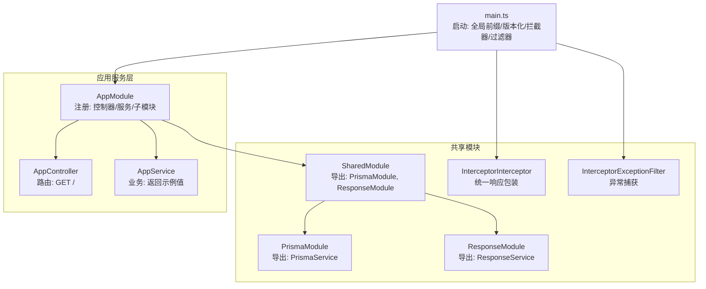
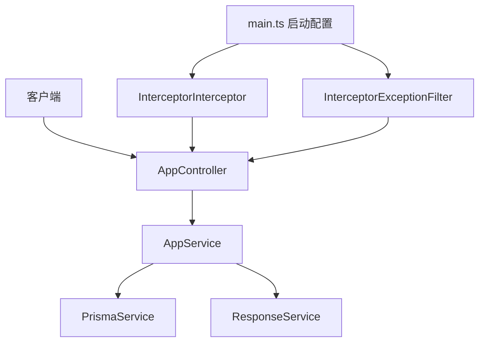
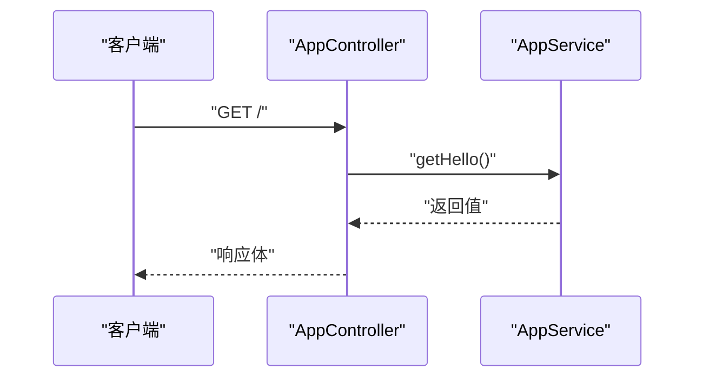
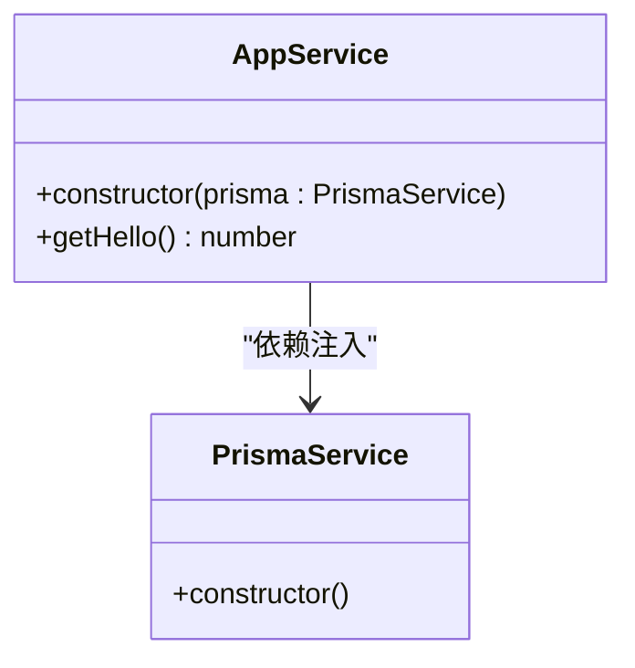
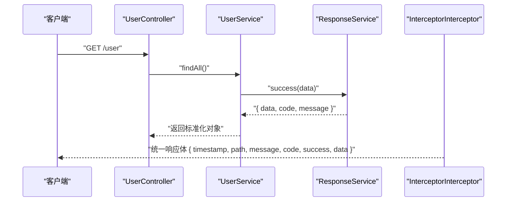
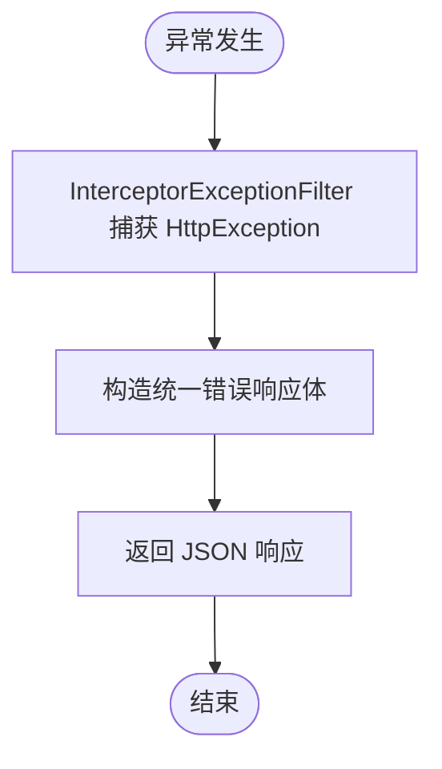
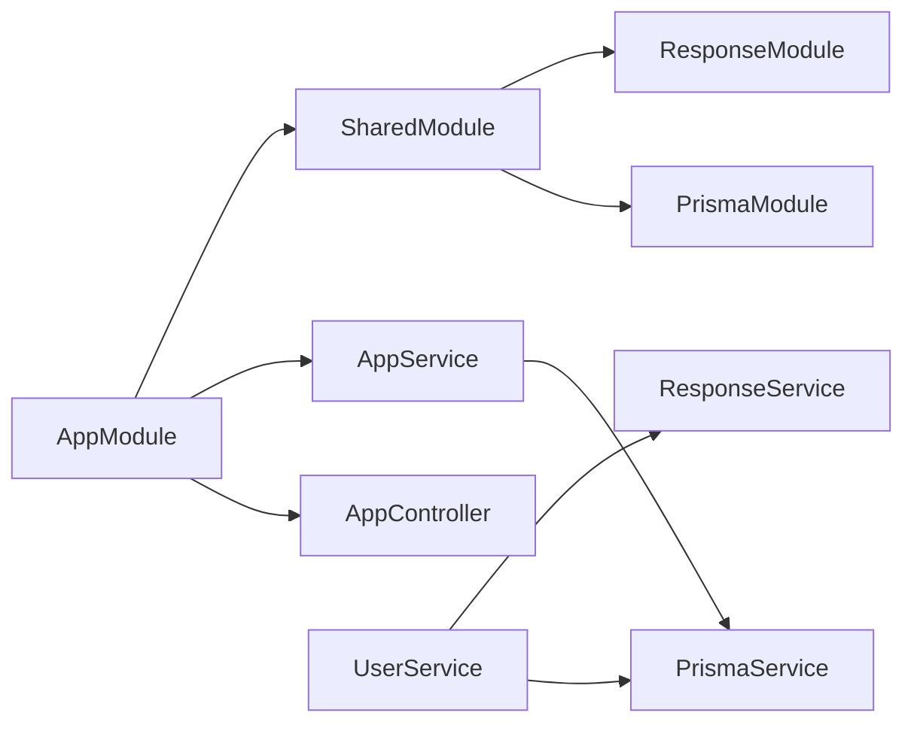

# 应用服务层

<cite>
**本文引用的文件**
- [server/apps/server/src/app.controller.ts](file://server/apps/server/src/app.controller.ts)
- [server/apps/server/src/app.service.ts](file://server/apps/server/src/app.service.ts)
- [server/apps/server/src/app.module.ts](file://server/apps/server/src/app.module.ts)
- [server/apps/server/src/main.ts](file://server/apps/server/src/main.ts)
- [server/apps/server/src/user/user.controller.ts](file://server/apps/server/src/user/user.controller.ts)
- [server/apps/server/src/user/user.service.ts](file://server/apps/server/src/user/user.service.ts)
- [server/libs/shared/src/shared.module.ts](file://server/libs/shared/src/shared.module.ts)
- [server/libs/shared/src/interceptor/interceptor.ts](file://server/libs/shared/src/interceptor/interceptor.ts)
- [server/libs/shared/src/interceptor/exceptionFilter.ts](file://server/libs/shared/src/interceptor/exceptionFilter.ts)
- [server/libs/shared/src/response/response.service.ts](file://server/libs/shared/src/response/response.service.ts)
- [server/libs/shared/src/response/response.module.ts](file://server/libs/shared/src/response/response.module.ts)
- [server/libs/shared/src/prisma/prisma.service.ts](file://server/libs/shared/src/prisma/prisma.service.ts)
- [server/libs/shared/src/prisma/prisma.module.ts](file://server/libs/shared/src/prisma/prisma.module.ts)
</cite>

## 目录
1. [简介](#简介)
2. [项目结构](#项目结构)
3. [核心组件](#核心组件)
4. [架构总览](#架构总览)
5. [详细组件分析](#详细组件分析)
6. [依赖关系分析](#依赖关系分析)
7. [性能考量](#性能考量)
8. [故障排查指南](#故障排查指南)
9. [结论](#结论)
10. [附录](#附录)

## 简介
本文件聚焦于应用服务层（AppService）与控制器（AppController）的设计与实现，系统性阐述：
- 控制器的HTTP路由映射与请求处理流程
- 服务层的业务逻辑组织与数据访问模式
- 依赖注入机制与模块装配
- 错误处理策略与统一响应格式
- RESTful API的基本实现、响应结构与状态码规范
- 服务层在整体架构中的职责边界与扩展建议
- 测试最佳实践与可维护性指南

## 项目结构
后端采用 NestJS 多包工作区结构，应用服务层位于 server/apps/server 中，共享能力封装在 server/libs/shared 下，包含数据库访问、统一响应与拦截器等通用模块。

图表来源
- [server/apps/server/src/app.controller.ts:1-13](file://server/apps/server/src/app.controller.ts#L1-L13)
- [server/apps/server/src/app.service.ts:1-11](file://server/apps/server/src/app.service.ts#L1-L11)
- [server/apps/server/src/app.module.ts:1-13](file://server/apps/server/src/app.module.ts#L1-L13)
- [server/apps/server/src/main.ts:1-20](file://server/apps/server/src/main.ts#L1-L20)
- [server/libs/shared/src/shared.module.ts:1-13](file://server/libs/shared/src/shared.module.ts#L1-L13)
- [server/libs/shared/src/interceptor/interceptor.ts:1-86](file://server/libs/shared/src/interceptor/interceptor.ts#L1-L86)
- [server/libs/shared/src/interceptor/exceptionFilter.ts:1-23](file://server/libs/shared/src/interceptor/exceptionFilter.ts#L1-L23)

章节来源
- [server/apps/server/src/app.module.ts:1-13](file://server/apps/server/src/app.module.ts#L1-L13)
- [server/apps/server/src/main.ts:1-20](file://server/apps/server/src/main.ts#L1-L20)

## 核心组件
- AppController：定义根路径 GET / 的入口，委托 AppService 执行业务逻辑并返回结果。
- AppService：通过依赖注入获得 PrismaService，当前示例返回固定数值；可扩展为真实业务逻辑。
- AppModule：声明式注册 AppController 与 AppService，并引入 UserModule 与 SharedModule。
- main.ts：应用启动配置，设置全局前缀 api、URI 版本化、注册全局拦截器与异常过滤器。

章节来源
- [server/apps/server/src/app.controller.ts:1-13](file://server/apps/server/src/app.controller.ts#L1-L13)
- [server/apps/server/src/app.service.ts:1-11](file://server/apps/server/src/app.service.ts#L1-L11)
- [server/apps/server/src/app.module.ts:1-13](file://server/apps/server/src/app.module.ts#L1-L13)
- [server/apps/server/src/main.ts:1-20](file://server/apps/server/src/main.ts#L1-L20)

## 架构总览
应用服务层遵循“控制器负责路由与参数解析，服务层负责业务与数据访问”的分层设计。共享模块提供数据库连接与统一响应/拦截器能力，确保跨模块一致性。

图表来源
- [server/apps/server/src/app.controller.ts:1-13](file://server/apps/server/src/app.controller.ts#L1-L13)
- [server/apps/server/src/app.service.ts:1-11](file://server/apps/server/src/app.service.ts#L1-L11)
- [server/libs/shared/src/prisma/prisma.service.ts:1-18](file://server/libs/shared/src/prisma/prisma.service.ts#L1-L18)
- [server/libs/shared/src/response/response.service.ts:1-29](file://server/libs/shared/src/response/response.service.ts#L1-L29)
- [server/libs/shared/src/interceptor/interceptor.ts:1-86](file://server/libs/shared/src/interceptor/interceptor.ts#L1-L86)
- [server/libs/shared/src/interceptor/exceptionFilter.ts:1-23](file://server/libs/shared/src/interceptor/exceptionFilter.ts#L1-L23)
- [server/apps/server/src/main.ts:1-20](file://server/apps/server/src/main.ts#L1-L20)

## 详细组件分析

### AppController 设计与路由映射
- 路由定义：控制器未指定路径前缀，默认根路径；GET 请求映射到 getHello 方法。
- 依赖注入：构造函数注入 AppService 实例。
- 调用链路：客户端 -> AppController -> AppService -> 返回值。

图表来源
- [server/apps/server/src/app.controller.ts:1-13](file://server/apps/server/src/app.controller.ts#L1-L13)
- [server/apps/server/src/app.service.ts:1-11](file://server/apps/server/src/app.service.ts#L1-L11)

章节来源
- [server/apps/server/src/app.controller.ts:1-13](file://server/apps/server/src/app.controller.ts#L1-L13)

### AppService 业务逻辑与依赖注入
- 注解与注入：通过 Injectable 声明可注入，构造函数注入 PrismaService。
- 当前实现：返回固定数值，便于演示依赖注入与控制器协作。
- 扩展方向：结合 PrismaService 进行数据读写，或通过 ResponseService 统一响应结构。

图表来源
- [server/apps/server/src/app.service.ts:1-11](file://server/apps/server/src/app.service.ts#L1-L11)
- [server/libs/shared/src/prisma/prisma.service.ts:1-18](file://server/libs/shared/src/prisma/prisma.service.ts#L1-L18)

章节来源
- [server/apps/server/src/app.service.ts:1-11](file://server/apps/server/src/app.service.ts#L1-L11)

### 拦截器与统一响应格式
- InterceptorInterceptor：全局拦截器，将控制器返回值标准化为统一响应体，自动填充时间戳、路径、消息、状态码与数据字段，并对 BigInt 类型进行字符串转换。
- ResponseService：提供 success/error 辅助方法，用于快速构建标准响应结构。
- 使用场景：用户模块的查询接口通过 ResponseService 包装返回数据，拦截器再统一外层结构。

图表来源
- [server/apps/server/src/user/user.controller.ts:1-35](file://server/apps/server/src/user/controller.ts#L1-L35)
- [server/apps/server/src/user/user.service.ts:1-34](file://server/apps/server/src/user/user.service.ts#L1-L34)
- [server/libs/shared/src/response/response.service.ts:1-29](file://server/libs/shared/src/response/response.service.ts#L1-L29)
- [server/libs/shared/src/interceptor/interceptor.ts:1-86](file://server/libs/shared/src/interceptor/interceptor.ts#L1-L86)

章节来源
- [server/libs/shared/src/interceptor/interceptor.ts:1-86](file://server/libs/shared/src/interceptor/interceptor.ts#L1-L86)
- [server/libs/shared/src/response/response.service.ts:1-29](file://server/libs/shared/src/response/response.service.ts#L1-L29)

### 异常过滤与错误处理策略
- InterceptorExceptionFilter：捕获 HttpException，统一输出包含时间戳、路径、消息与状态码的 JSON 结构，success 字段为 false。
- 配置位置：main.ts 中注册为全局过滤器，确保所有异常被规范化处理。

图表来源
- [server/libs/shared/src/interceptor/exceptionFilter.ts:1-23](file://server/libs/shared/src/interceptor/exceptionFilter.ts#L1-L23)
- [server/apps/server/src/main.ts:1-20](file://server/apps/server/src/main.ts#L1-L20)

章节来源
- [server/libs/shared/src/interceptor/exceptionFilter.ts:1-23](file://server/libs/shared/src/interceptor/exceptionFilter.ts#L1-L23)
- [server/apps/server/src/main.ts:1-20](file://server/apps/server/src/main.ts#L1-L20)

### RESTful API 基本实现与状态码规范
- 路由前缀与版本化：全局前缀为 api，启用 URI 版本控制，默认 v1。
- 用户模块示例：提供完整的 CRUD 路由（POST /user、GET /user、GET /user/:id、PATCH /user/:id、DELETE /user/:id），控制器直接委派给 UserService。
- 响应格式：统一由拦截器包裹，success 为布尔值，code 为数字，message 为字符串，data 为实际数据；错误时由异常过滤器统一输出。

章节来源
- [server/apps/server/src/main.ts:1-20](file://server/apps/server/src/main.ts#L1-L20)
- [server/apps/server/src/user/user.controller.ts:1-35](file://server/apps/server/src/user/user.controller.ts#L1-L35)

### 服务层职责边界与扩展建议
- 职责边界：AppService 负责业务逻辑与数据访问；控制器仅负责路由与参数传递；拦截器与过滤器负责横切关注点。
- 扩展建议：
  - 在 AppService 中使用 PrismaService 完成数据持久化。
  - 使用 ResponseService 统一返回结构，避免分散的响应拼装。
  - 对复杂业务拆分为多个 Service 并通过依赖注入组合。
  - 在控制器中仅做参数校验与 DTO 映射，保持薄控制器。

章节来源
- [server/apps/server/src/app.service.ts:1-11](file://server/apps/server/src/app.service.ts#L1-L11)
- [server/libs/shared/src/response/response.service.ts:1-29](file://server/libs/shared/src/response/response.service.ts#L1-L29)
- [server/libs/shared/src/prisma/prisma.service.ts:1-18](file://server/libs/shared/src/prisma/prisma.service.ts#L1-L18)

## 依赖关系分析
- 模块装配：AppModule 导入 UserModule 与 SharedModule；SharedModule 导出 PrismaModule 与 ResponseModule，供其他模块复用。
- 依赖注入：AppService 注入 PrismaService；UserService 注入 PrismaService 与 ResponseService。
- 全局配置：main.ts 注册拦截器与异常过滤器，设置全局前缀与版本化。

图表来源
- [server/apps/server/src/app.module.ts:1-13](file://server/apps/server/src/app.module.ts#L1-L13)
- [server/libs/shared/src/shared.module.ts:1-13](file://server/libs/shared/src/shared.module.ts#L1-L13)
- [server/libs/shared/src/prisma/prisma.module.ts:1-9](file://server/libs/shared/src/prisma/prisma.module.ts#L1-L9)
- [server/libs/shared/src/response/response.module.ts:1-9](file://server/libs/shared/src/response/response.module.ts#L1-L9)

章节来源
- [server/apps/server/src/app.module.ts:1-13](file://server/apps/server/src/app.module.ts#L1-L13)
- [server/libs/shared/src/shared.module.ts:1-13](file://server/libs/shared/src/shared.module.ts#L1-L13)

## 性能考量
- 数据库连接：PrismaService 通过适配器初始化，注意连接池与超时配置。
- 响应序列化：拦截器对 BigInt 进行字符串转换，避免 JSON 序列化问题；对数组与对象递归处理，注意大数据量时的内存占用。
- 全局中间件：拦截器与过滤器为同步/流式处理，避免在热路径执行阻塞操作。

## 故障排查指南
- 统一错误响应：确认异常为 HttpException，以便异常过滤器正确捕获并输出统一结构。
- 响应一致性：若控制器直接返回原始对象，拦截器会尝试标准化；如需自定义 message 或 code，请通过 ResponseService 或返回包含字段的对象。
- 版本与前缀：确认全局前缀与版本化配置是否符合预期，避免路由不匹配。

章节来源
- [server/libs/shared/src/interceptor/exceptionFilter.ts:1-23](file://server/libs/shared/src/interceptor/exceptionFilter.ts#L1-L23)
- [server/apps/server/src/main.ts:1-20](file://server/apps/server/src/main.ts#L1-L20)

## 结论
应用服务层以清晰的分层与依赖注入为核心，配合共享模块提供的数据库访问与统一响应/拦截能力，实现了可扩展、可维护的服务架构。通过控制器薄化、服务层厚化与全局拦截器/过滤器的横切处理，满足了 RESTful API 的基本需求与一致的用户体验。

## 附录
- 测试最佳实践：
  - 单元测试：针对 AppService 的业务逻辑，使用 TestModule 替换 PrismaService 为 Mock，验证返回结构与异常分支。
  - 集成测试：通过 TestServer 启动应用，验证拦截器与异常过滤器对控制器返回的统一处理。
  - DTO 与校验：在控制器层使用管道与校验装饰器，减少服务层重复校验逻辑。
- 可扩展清单：
  - 新增领域服务：在 AppModule 中注册新 Service，并在控制器中注入使用。
  - 自定义拦截器：按需扩展拦截器以支持鉴权、日志、缓存等横切功能。
  - 错误码体系：基于 ResponseService 的 error 方法，建立统一错误码与消息映射表。