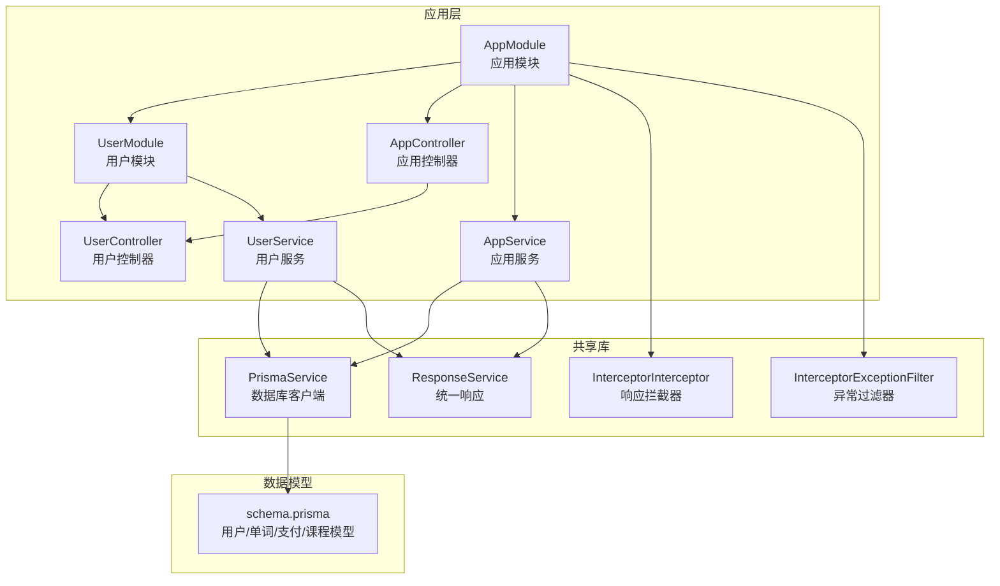
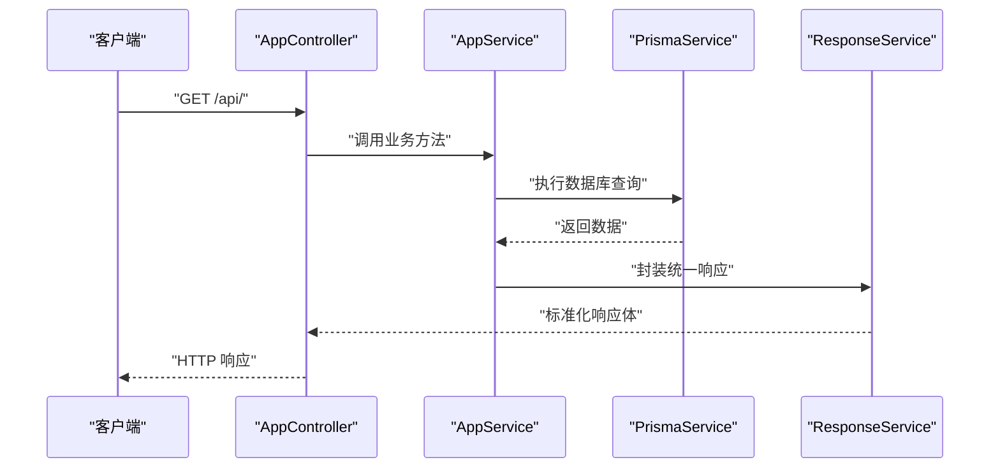
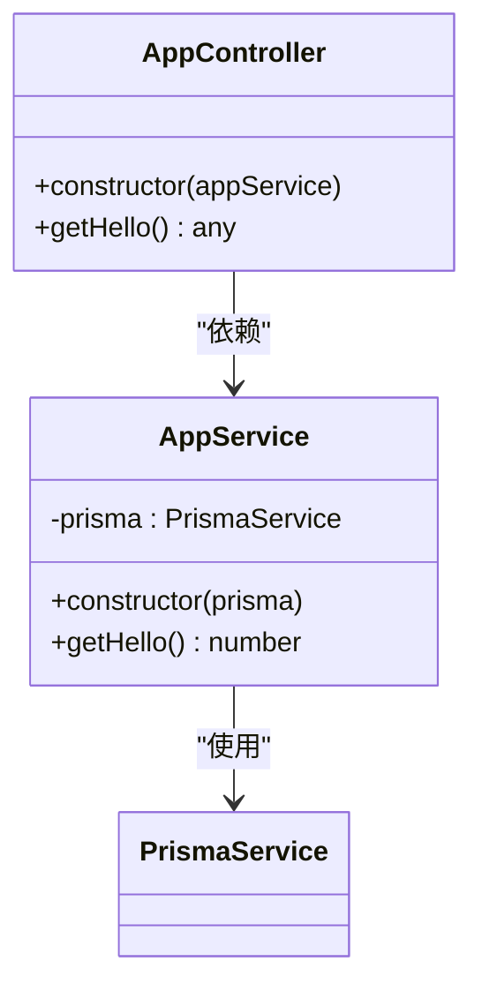
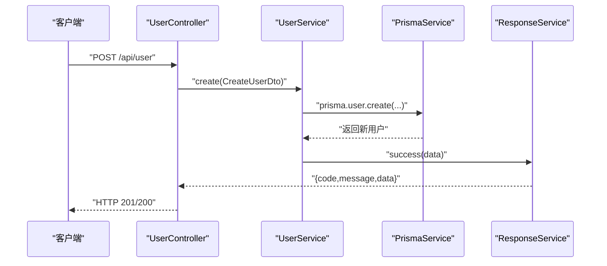
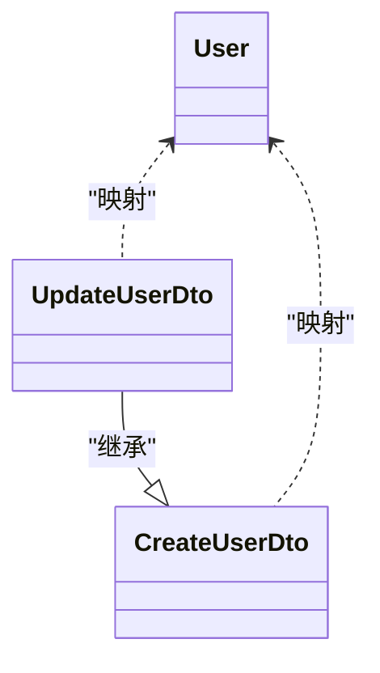
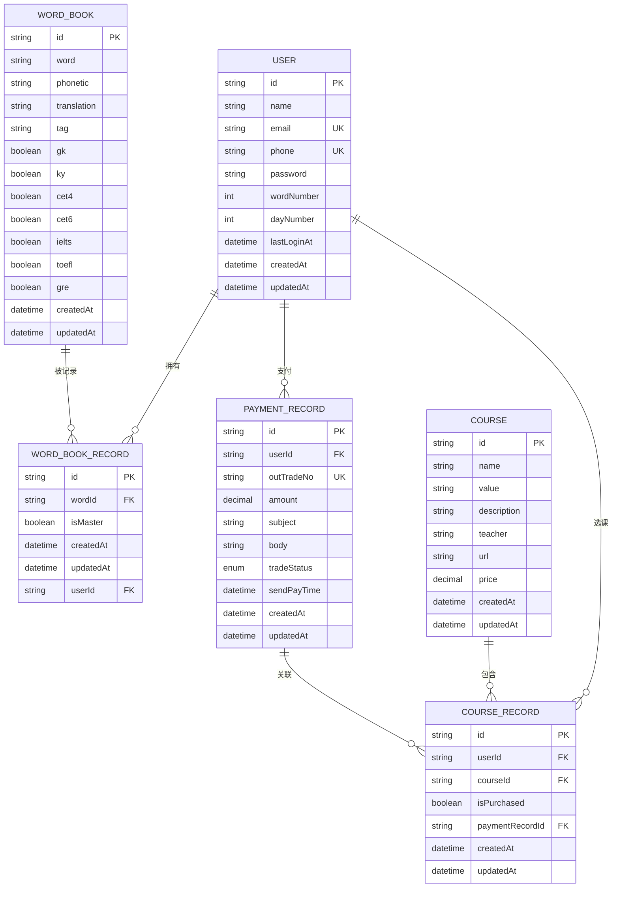
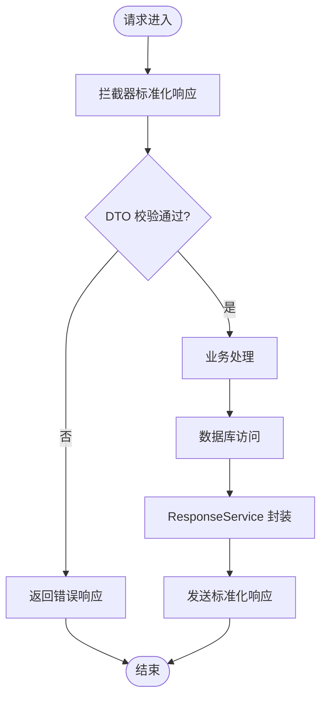
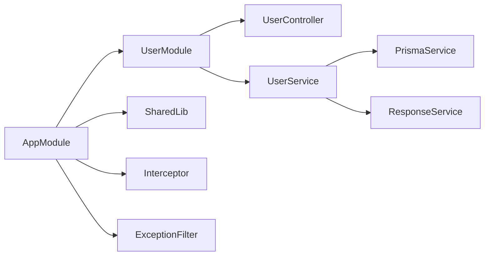

# 核心业务服务

<cite>
**本文引用的文件**
- [server\apps\server\src\main.ts](file://server/apps/server/src/main.ts)
- [server\apps\server\src\app.module.ts](file://server/apps/server/src/app.module.ts)
- [server\apps\server\src\app.controller.ts](file://server/apps/server/src/app.controller.ts)
- [server\apps\server\src\app.service.ts](file://server/apps/server/src/app.service.ts)
- [server\apps\server\src\user\user.controller.ts](file://server/apps/server/src/user/user.controller.ts)
- [server\apps\server\src\user\user.service.ts](file://server/apps/server/src/user/user.service.ts)
- [server\apps\server\src\user\user.module.ts](file://server/apps/server/src/user/user.module.ts)
- [server\apps\server\src\user\dto\create-user.dto.ts](file://server/apps/server/src/user/dto/create-user.dto.ts)
- [server\apps\server\src\user\dto\update-user.dto.ts](file://server/apps/server/src/user/dto/update-user.dto.ts)
- [server\apps\server\src\user\entities\user.entity.ts](file://server/apps/server/src/user/entities/user.entity.ts)
- [server\libs\shared\src\prisma\prisma.service.ts](file://server/libs/shared/src/prisma/prisma.service.ts)
- [server\libs\shared\src\response\response.service.ts](file://server/libs/shared/src/response/response.service.ts)
- [server\libs\shared\src\interceptor\interceptor.ts](file://server/libs/shared/src/interceptor/interceptor.ts)
- [server\libs\shared\src\interceptor\exceptionFilter.ts](file://server/libs/shared/src/interceptor/exceptionFilter.ts)
- [server\prisma\schema.prisma](file://server/prisma/schema.prisma)
</cite>

## 目录
1. [简介](#简介)
2. [项目结构](#项目结构)
3. [核心组件](#核心组件)
4. [架构总览](#架构总览)
5. [详细组件分析](#详细组件分析)
6. [依赖关系分析](#依赖关系分析)
7. [性能考虑](#性能考虑)
8. [故障排查指南](#故障排查指南)
9. [结论](#结论)
10. [附录](#附录)

## 简介
本文件面向英语学习平台的核心业务服务，聚焦用户管理系统（注册、登录、信息管理等）的实现与扩展。文档从系统架构、设计模式、数据传输对象（DTO）、实体模型、业务规则、RESTful API 设计、参数校验与响应格式、权限控制、会话管理与安全策略等方面进行系统化阐述，并给出业务服务开发的最佳实践与扩展建议。

## 项目结构
后端采用 NestJS 应用与共享库（Shared Lib）分层组织：
- 应用层：server/apps/server 提供业务应用入口、控制器、服务与模块
- 共享库：server/libs/shared 提供数据库访问（Prisma）、统一响应封装、拦截器与异常过滤器
- 数据模型：server/prisma/schema.prisma 定义用户、单词书、支付与课程等核心模型

图表来源
- [server\apps\server\src\app.module.ts:1-13](file://server/apps/server/src/app.module.ts#L1-L13)
- [server\apps\server\src\user\user.module.ts:1-10](file://server/apps/server/src/user/user.module.ts#L1-L10)
- [server\libs\shared\src\prisma\prisma.service.ts:1-18](file://server/libs/shared/src/prisma/prisma.service.ts#L1-L18)
- [server\libs\shared\src\response\response.service.ts:1-29](file://server/libs/shared/src/response/response.service.ts#L1-L29)
- [server\libs\shared\src\interceptor\interceptor.ts:1-86](file://server/libs/shared/src/interceptor/interceptor.ts#L1-L86)
- [server\libs\shared\src\interceptor\exceptionFilter.ts:1-23](file://server/libs/shared/src/interceptor/exceptionFilter.ts#L1-L23)
- [server\prisma\schema.prisma:1-133](file://server/prisma/schema.prisma#L1-L133)

章节来源
- [server\apps\server\src\main.ts:1-20](file://server/apps/server/src/main.ts#L1-L20)
- [server\apps\server\src\app.module.ts:1-13](file://server/apps/server/src/app.module.ts#L1-L13)
- [server\apps\server\src\user\user.module.ts:1-10](file://server/apps/server/src/user/user.module.ts#L1-L10)

## 核心组件
- 应用入口与全局配置
  - 全局前缀、版本控制、全局拦截器与异常过滤器在应用启动时统一装配
- 应用控制器与服务
  - 提供基础接口示例与数据库访问能力
- 用户模块
  - 控制器负责 RESTful 接口编排，服务负责业务处理与数据访问
- 共享库
  - 统一响应封装、数据库适配、请求响应标准化与异常处理

章节来源
- [server\apps\server\src\main.ts:8-18](file://server/apps/server/src/main.ts#L8-L18)
- [server\apps\server\src\app.controller.ts:1-13](file://server/apps/server/src/app.controller.ts#L1-L13)
- [server\apps\server\src\app.service.ts:1-11](file://server/apps/server/src/app.service.ts#L1-L11)
- [server\apps\server\src\user\user.controller.ts:1-35](file://server/apps/server/src/user/user.controller.ts#L1-L35)
- [server\apps\server\src\user\user.service.ts:1-34](file://server/apps/server/src/user/user.service.ts#L1-L34)
- [server\libs\shared\src\response\response.service.ts:1-29](file://server/libs/shared/src/response/response.service.ts#L1-L29)
- [server\libs\shared\src\prisma\prisma.service.ts:1-18](file://server/libs/shared/src/prisma/prisma.service.ts#L1-L18)
- [server\libs\shared\src\interceptor\interceptor.ts:1-86](file://server/libs/shared/src/interceptor/interceptor.ts#L1-L86)
- [server\libs\shared\src\interceptor\exceptionFilter.ts:1-23](file://server/libs/shared/src/interceptor/exceptionFilter.ts#L1-L23)

## 架构总览
系统采用“控制器-服务-数据访问”的分层架构，配合共享库实现统一响应、拦截与异常处理。用户模块通过 Prisma 访问 PostgreSQL 数据库，遵循 URI 版本控制与全局前缀规范。

图表来源
- [server\apps\server\src\app.controller.ts:8-11](file://server/apps/server/src/app.controller.ts#L8-L11)
- [server\apps\server\src\app.service.ts:7-9](file://server/apps/server/src/app.service.ts#L7-L9)
- [server\libs\shared\src\prisma\prisma.service.ts:7-15](file://server/libs/shared/src/prisma/prisma.service.ts#L7-L15)
- [server\libs\shared\src\response\response.service.ts:14-20](file://server/libs/shared/src/response/response.service.ts#L14-L20)

## 详细组件分析

### AppController 与 AppService：设计模式与业务逻辑
- 设计模式
  - 控制器-服务分离：控制器仅负责请求编排与参数传递；服务承担业务逻辑与数据访问
  - 依赖注入：通过构造函数注入服务，提升可测试性与解耦
- 业务逻辑
  - 当前提供基础示例接口，实际业务（如用户注册/登录）需在 UserService 中实现
- 扩展建议
  - 在 AppService 中引入认证上下文或会话管理（见后续章节），以支持登录态与权限控制

图表来源
- [server\apps\server\src\app.controller.ts:4-11](file://server/apps/server/src/app.controller.ts#L4-L11)
- [server\apps\server\src\app.service.ts:4-9](file://server/apps/server/src/app.service.ts#L4-L9)

章节来源
- [server\apps\server\src\app.controller.ts:1-13](file://server/apps/server/src/app.controller.ts#L1-L13)
- [server\apps\server\src\app.service.ts:1-11](file://server/apps/server/src/app.service.ts#L1-L11)

### 用户模块：控制器、服务与数据流
- 控制器职责
  - 定义 RESTful 接口：POST/GET/PATCH/DELETE 用户资源
  - 参数解析：Body、Param 注解用于 DTO 绑定
- 服务职责
  - 当前提供占位实现；建议在实际实现中：
    - 使用 PrismaService 进行数据库读写
    - 通过 ResponseService 统一封装响应
    - 引入 DTO 校验与业务规则
- 数据流
  - 控制器 -> 服务 -> 数据库 -> 统一响应

图表来源
- [server\apps\server\src\user\user.controller.ts:10-13](file://server/apps/server/src/user/user.controller.ts#L10-L13)
- [server\apps\server\src\user\user.service.ts:13-19](file://server/apps/server/src/user/user.service.ts#L13-L19)
- [server\libs\shared\src\response\response.service.ts:14-20](file://server/libs/shared/src/response/response.service.ts#L14-L20)
- [server\libs\shared\src\prisma\prisma.service.ts:7-15](file://server/libs/shared/src/prisma/prisma.service.ts#L7-L15)

章节来源
- [server\apps\server\src\user\user.controller.ts:1-35](file://server/apps/server/src/user/user.controller.ts#L1-L35)
- [server\apps\server\src\user\user.service.ts:1-34](file://server/apps/server/src/user/user.service.ts#L1-L34)

### DTO 设计与实体模型
- DTO
  - CreateUserDto：承载用户创建所需字段
  - UpdateUserDto：基于 PartialType 的部分更新 DTO
- 实体模型
  - User 实体：当前为空类，建议在实体中声明字段与约束
- 建议
  - 在 DTO 中加入字段校验装饰器（如邮箱格式、长度限制等）
  - 在实体中补充字段与关系映射，确保与 Prisma Schema 一致

图表来源
- [server\apps\server\src\user\dto\create-user.dto.ts:1-2](file://server/apps/server/src/user/dto/create-user.dto.ts#L1-L2)
- [server\apps\server\src\user\dto\update-user.dto.ts:1-5](file://server/apps/server/src/user/dto/update-user.dto.ts#L1-L5)
- [server\apps\server\src\user\entities\user.entity.ts:1-2](file://server/apps/server/src/user/entities/user.entity.ts#L1-L2)

章节来源
- [server\apps\server\src\user\dto\create-user.dto.ts:1-2](file://server/apps/server/src/user/dto/create-user.dto.ts#L1-L2)
- [server\apps\server\src\user\dto\update-user.dto.ts:1-5](file://server/apps/server/src/user/dto/update-user.dto.ts#L1-L5)
- [server\apps\server\src\user\entities\user.entity.ts:1-2](file://server/apps/server/src/user/entities/user.entity.ts#L1-L2)

### 数据模型与关系（Prisma Schema）
- 用户表（User）
  - 关键字段：用户名、邮箱（唯一）、手机号（唯一）、密码、头像、单词数量、打卡天数、最后登录时间、创建/更新时间
  - 关系：与单词书记录、支付记录、课程记录存在一对多关系
- 单词书记录（WordBookRecord）
  - 关键字段：单词 ID、是否掌握、用户 ID、创建/更新时间
  - 唯一键：(userId, wordId)
- 单词表（WordBook）
  - 关键字段：单词、音标、定义、翻译、词性、各类词典标签（柯林斯、牛津、雅思、托福等）、频率与标签索引
- 支付记录（PaymentRecord）
  - 关键字段：订单号（唯一）、金额、主题、内容、交易状态、支付时间、用户 ID
- 课程记录（CourseRecord）
  - 关键字段：用户 ID、课程 ID、是否购买、支付记录 ID、创建/更新时间
  - 唯一键：(userId, courseId)
- 课程表（Course）
  - 关键字段：名称、价值、描述、教师、URL、价格

图表来源
- [server\prisma\schema.prisma:25-41](file://server/prisma/schema.prisma#L25-L41)
- [server\prisma\schema.prisma:44-55](file://server/prisma/schema.prisma#L44-L55)
- [server\prisma\schema.prisma:58-86](file://server/prisma/schema.prisma#L58-L86)
- [server\prisma\schema.prisma:89-104](file://server/prisma/schema.prisma#L89-L104)
- [server\prisma\schema.prisma:106-119](file://server/prisma/schema.prisma#L106-L119)
- [server\prisma\schema.prisma:121-132](file://server/prisma/schema.prisma#L121-L132)

章节来源
- [server\prisma\schema.prisma:1-133](file://server/prisma/schema.prisma#L1-L133)

### RESTful API 设计原则、参数验证与响应格式
- 设计原则
  - 资源命名：使用名词复数形式（如 /api/user）
  - 动作映射：POST/GET/PATCH/DELETE 对应创建/列表/更新/删除
  - 版本控制：启用 URI 版本控制，默认 v1
  - 全局前缀：设置 /api 前缀
- 参数验证
  - 建议在 DTO 上添加校验装饰器（如邮箱格式、长度、必填等）
  - 控制器中使用管道（ValidationPipe）自动校验与转换
- 响应格式
  - 统一响应体包含：时间戳、路径、消息、状态码、成功标志与数据
  - 大整型（BigInt）自动转字符串，日期保持原样
  - 异常统一包装为失败响应

图表来源
- [server\libs\shared\src\interceptor\interceptor.ts:64-84](file://server/libs/shared/src/interceptor/interceptor.ts#L64-L84)
- [server\libs\shared\src\response\response.service.ts:14-27](file://server/libs/shared/src/response/response.service.ts#L14-L27)
- [server\apps\server\src\main.ts:10-16](file://server/apps/server/src/main.ts#L10-L16)

章节来源
- [server\apps\server\src\main.ts:8-18](file://server/apps/server/src/main.ts#L8-L18)
- [server\libs\shared\src\interceptor\interceptor.ts:1-86](file://server/libs/shared/src/interceptor/interceptor.ts#L1-L86)
- [server\libs\shared\src\response\response.service.ts:1-29](file://server/libs/shared/src/response/response.service.ts#L1-L29)

### 权限控制、会话管理与安全策略
- 权限控制
  - 建议引入守卫（Guard）与角色/权限注解，对用户资源访问进行鉴权
- 会话管理
  - 建议引入 Cookie/Session 或 JWT，结合守卫实现登录态校验
- 安全策略
  - 输入参数严格校验与白名单
  - 敏感字段（如密码）不回传
  - HTTPS 与安全响应头配置
  - 异常过滤器统一输出，避免泄露内部错误细节

章节来源
- [server\libs\shared\src\interceptor\exceptionFilter.ts:8-22](file://server/libs/shared/src/interceptor/exceptionFilter.ts#L8-L22)

## 依赖关系分析
- 模块依赖
  - AppModule 导入 UserModule 与 SharedModule
  - UserModule 仅导出控制器与服务
- 服务依赖
  - AppService 依赖 PrismaService
  - UserService 依赖 PrismaService 与 ResponseService
- 全局拦截与异常
  - 应用启动时注册全局拦截器与异常过滤器

图表来源
- [server\apps\server\src\app.module.ts:7-11](file://server/apps/server/src/app.module.ts#L7-L11)
- [server\apps\server\src\user\user.module.ts:5-9](file://server/apps/server/src/user/user.module.ts#L5-L9)
- [server\libs\shared\src\prisma\prisma.service.ts:1-18](file://server/libs/shared/src/prisma/prisma.service.ts#L1-L18)
- [server\libs\shared\src\response\response.service.ts:1-29](file://server/libs/shared/src/response/response.service.ts#L1-L29)
- [server\apps\server\src\main.ts:10-11](file://server/apps/server/src/main.ts#L10-L11)

章节来源
- [server\apps\server\src\app.module.ts:1-13](file://server/apps/server/src/app.module.ts#L1-L13)
- [server\apps\server\src\user\user.module.ts:1-10](file://server/apps/server/src/user/user.module.ts#L1-L10)
- [server\apps\server\src\main.ts:8-18](file://server/apps/server/src/main.ts#L8-L18)

## 性能考虑
- 数据库访问
  - 使用事务批量写入，减少往返次数
  - 合理使用索引（如用户邮箱/手机号唯一索引、单词与标签组合索引）
- 响应序列化
  - 大整型转字符串避免精度丢失
  - 避免在响应中携带冗余字段
- 缓存策略
  - 对热点查询结果进行缓存（如用户基本信息）
- 并发与锁
  - 对关键写操作加锁或使用乐观锁，避免并发冲突

## 故障排查指南
- 常见问题
  - 数据库连接失败：检查环境变量 DATABASE_URL 与网络连通性
  - 响应格式异常：确认拦截器与 ResponseService 是否正确包裹
  - DTO 校验失败：检查装饰器与 ValidationPipe 是否启用
- 排查步骤
  - 查看异常过滤器输出的统一错误结构
  - 检查 Prisma 日志与慢查询
  - 核对路由前缀与版本控制配置

章节来源
- [server\libs\shared\src\interceptor\exceptionFilter.ts:10-21](file://server/libs/shared/src/interceptor/exceptionFilter.ts#L10-L21)
- [server\libs\shared\src\interceptor\interceptor.ts:64-84](file://server/libs/shared/src/interceptor/interceptor.ts#L64-L84)
- [server\libs\shared\src\prisma\prisma.service.ts:8-15](file://server/libs/shared/src/prisma/prisma.service.ts#L8-L15)

## 结论
本系统以模块化与共享库为核心，实现了统一的响应、拦截与异常处理机制。用户模块具备清晰的控制器-服务边界，建议在 UserService 中完善用户注册、登录与信息管理的业务逻辑，并结合 DTO 校验、权限守卫与会话管理，构建安全可靠的用户管理体系。

## 附录
- 开发最佳实践
  - DTO 字段明确、校验完备
  - 服务层专注业务，避免直接操作数据库
  - 统一响应与异常处理，便于前端消费
  - 逐步引入 JWT/Session、守卫与中间件
- 扩展指南
  - 新增用户功能：在 UserController/Service 中按 CRUD 规范扩展
  - 引入鉴权：新增 Guard/策略与拦截器
  - 数据迁移：通过 Prisma Migration 管理 Schema 变更