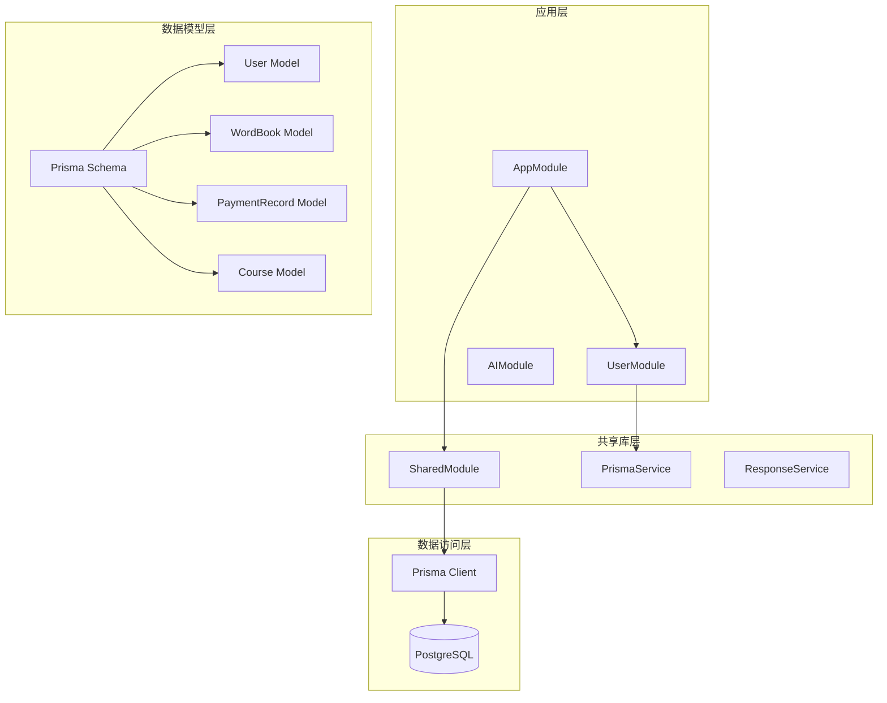
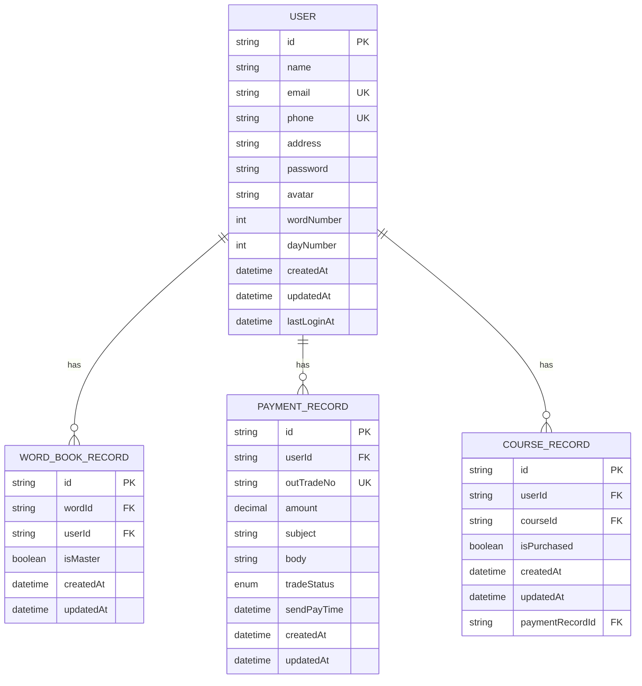
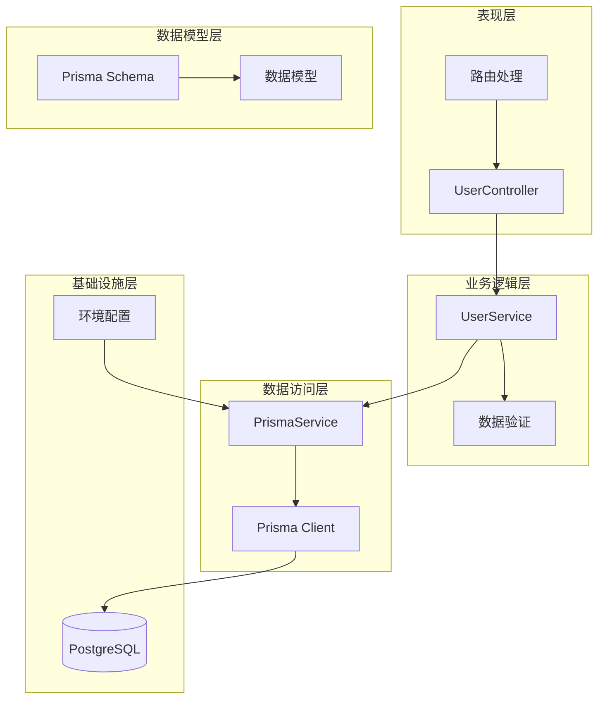
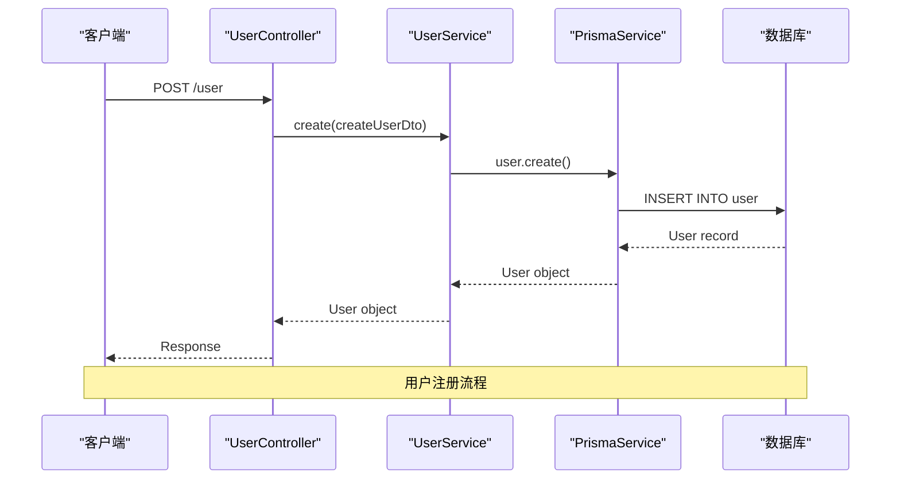
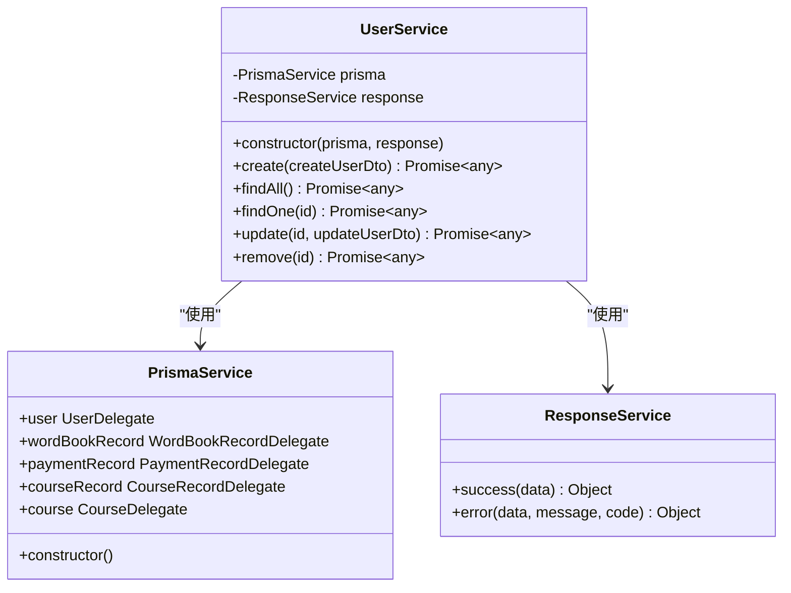
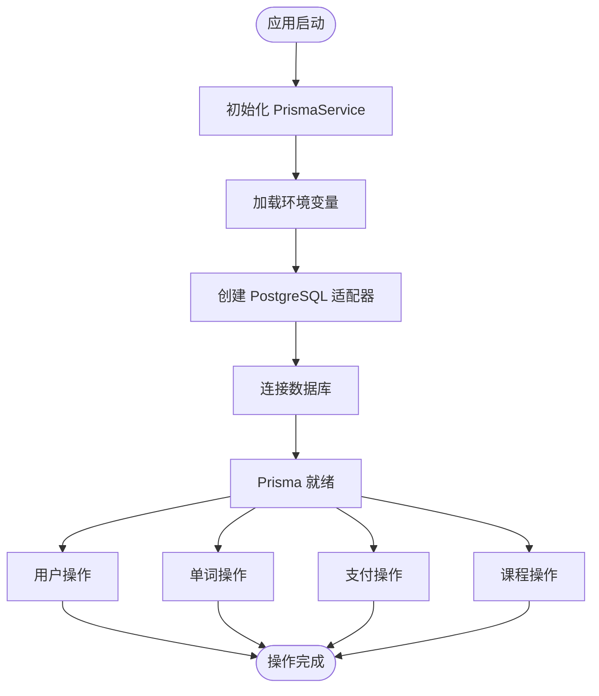
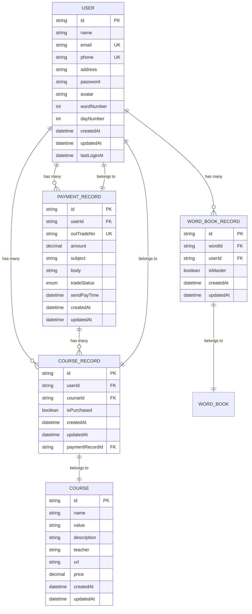

# 用户实体模型

<cite>
**本文档引用的文件**
- [user.entity.ts](file://server/apps/server/src/user/entities/user.entity.ts)
- [schema.prisma](file://server/prisma/schema.prisma)
- [create-user.dto.ts](file://server/apps/server/src/user/dto/create-user.dto.ts)
- [update-user.dto.ts](file://server/apps/server/src/user/dto/update-user.dto.ts)
- [user.service.ts](file://server/apps/server/src/user/user.service.ts)
- [user.controller.ts](file://server/apps/server/src/user/user.controller.ts)
- [user.module.ts](file://server/apps/server/src/user/user.module.ts)
- [prisma.service.ts](file://server/libs/shared/src/prisma/prisma.service.ts)
- [response.service.ts](file://server/libs/shared/src/response/response.service.ts)
- [response.module.ts](file://server/libs/shared/src/response/response.module.ts)
- [app.module.ts](file://server/apps/server/src/app.module.ts)
</cite>

## 目录
1. [简介](#简介)
2. [项目结构](#项目结构)
3. [核心组件](#核心组件)
4. [架构概览](#架构概览)
5. [详细组件分析](#详细组件分析)
6. [依赖关系分析](#依赖关系分析)
7. [性能考虑](#性能考虑)
8. [故障排除指南](#故障排除指南)
9. [结论](#结论)

## 简介

本文件为用户实体模型的全面数据模型文档。该系统基于 NestJS 框架和 Prisma ORM 构建，采用现代化的企业级架构设计。用户实体作为整个英语学习应用的核心数据模型，负责管理用户的基本信息、学习进度和相关业务数据。

系统采用分层架构模式，包含数据访问层（Prisma）、业务逻辑层（Service）和表现层（Controller），通过 DTO（数据传输对象）实现数据验证和转换，确保数据的一致性和安全性。

## 项目结构

该项目采用 Monorepo 结构，主要分为以下层次：



**图表来源**
- [app.module.ts:1-13](file://server/apps/server/src/app.module.ts#L1-L13)
- [user.module.ts:1-10](file://server/apps/server/src/user/user.module.ts#L1-L10)
- [prisma.service.ts:1-18](file://server/libs/shared/src/prisma/prisma.service.ts#L1-L18)

**章节来源**
- [app.module.ts:1-13](file://server/apps/server/src/app.module.ts#L1-L13)
- [user.module.ts:1-10](file://server/apps/server/src/user/user.module.ts#L1-L10)

## 核心组件

### 用户实体模型

用户实体是整个系统的中心数据模型，负责存储用户的基本信息和学习相关数据。以下是详细的字段定义和约束条件：

#### 基础字段定义

| 字段名 | 数据类型 | 约束条件 | 描述 | 默认值 |
|--------|----------|----------|------|--------|
| id | String | 主键, 唯一 | 用户唯一标识符 | cuid() |
| name | String | 必填 | 用户姓名 | - |
| email | String | 可选, 唯一 | 用户邮箱地址 | null |
| phone | String | 必填, 唯一 | 用户手机号码 | - |
| address | String | 可选 | 用户地址信息 | null |
| password | String | 必填 | 用户密码（加密存储） | - |
| avatar | String | 可选 | 用户头像URL | null |
| wordNumber | Int | 必填 | 已学习单词数量 | 0 |
| dayNumber | Int | 必填 | 学习打卡天数 | 0 |
| createdAt | DateTime | 必填, 自动设置 | 创建时间 | now() |
| updatedAt | DateTime | 必填, 自动更新 | 更新时间 | now() |
| lastLoginAt | DateTime | 可选 | 最后登录时间 | null |

#### 关系映射

用户实体与多个相关模型建立关联关系：



**图表来源**
- [schema.prisma:25-41](file://server/prisma/schema.prisma#L25-L41)
- [schema.prisma:44-55](file://server/prisma/schema.prisma#L44-L55)
- [schema.prisma:89-104](file://server/prisma/schema.prisma#L89-L104)
- [schema.prisma:106-119](file://server/prisma/schema.prisma#L106-L119)

**章节来源**
- [schema.prisma:25-41](file://server/prisma/schema.prisma#L25-L41)
- [schema.prisma:44-55](file://server/prisma/schema.prisma#L44-L55)
- [schema.prisma:89-104](file://server/prisma/schema.prisma#L89-L104)
- [schema.prisma:106-119](file://server/prisma/schema.prisma#L106-L119)

### 数据传输对象（DTO）

#### CreateUserDto
用于用户注册时的数据验证和传输，当前实现为空对象，需要根据业务需求添加具体的字段验证规则。

#### UpdateUserDto
继承自 CreateUserDto，使用 PartialType 实现部分字段更新功能，支持选择性字段更新。

**章节来源**
- [create-user.dto.ts:1-2](file://server/apps/server/src/user/dto/create-user.dto.ts#L1-L2)
- [update-user.dto.ts:1-5](file://server/apps/server/src/user/dto/update-user.dto.ts#L1-L5)

## 架构概览

系统采用分层架构设计，确保关注点分离和代码的可维护性：



**图表来源**
- [user.controller.ts:1-35](file://server/apps/server/src/user/user.controller.ts#L1-L35)
- [user.service.ts:1-34](file://server/apps/server/src/user/user.service.ts#L1-L34)
- [prisma.service.ts:1-18](file://server/libs/shared/src/prisma/prisma.service.ts#L1-L18)

**章节来源**
- [user.controller.ts:1-35](file://server/apps/server/src/user/user.controller.ts#L1-L35)
- [user.service.ts:1-34](file://server/apps/server/src/user/user.service.ts#L1-L34)
- [prisma.service.ts:1-18](file://server/libs/shared/src/prisma/prisma.service.ts#L1-L18)

## 详细组件分析

### 用户控制器（UserController）

用户控制器负责处理所有与用户相关的 HTTP 请求，实现了标准的 CRUD 操作：



**图表来源**
- [user.controller.ts:10-13](file://server/apps/server/src/user/user.controller.ts#L10-L13)
- [user.service.ts:13-15](file://server/apps/server/src/user/user.service.ts#L13-L15)

#### 控制器方法分析

| 方法 | HTTP 方法 | 路径 | 功能 | 参数 |
|------|-----------|------|------|------|
| create | POST | /user | 创建新用户 | CreateUserDto |
| findAll | GET | /user | 获取所有用户 | - |
| findOne | GET | /user/:id | 获取单个用户 | id: string |
| update | PATCH | /user/:id | 更新用户信息 | id: string, UpdateUserDto |
| remove | DELETE | /user/:id | 删除用户 | id: string |

**章节来源**
- [user.controller.ts:1-35](file://server/apps/server/src/user/user.controller.ts#L1-L35)

### 用户服务（UserService）

用户服务层封装了业务逻辑，负责协调数据访问和业务规则执行：



**图表来源**
- [user.service.ts:8-33](file://server/apps/server/src/user/user.service.ts#L8-L33)
- [prisma.service.ts:7-16](file://server/libs/shared/src/prisma/prisma.service.ts#L7-L16)
- [response.service.ts:13-28](file://server/libs/shared/src/response/response.service.ts#L13-L28)

#### 服务方法实现

当前服务层的方法实现相对简单，主要返回占位符字符串，实际的数据库操作需要进一步完善：

**章节来源**
- [user.service.ts:1-34](file://server/apps/server/src/user/user.service.ts#L1-L34)

### Prisma 数据库服务

Prisma 服务负责数据库连接管理和数据访问：



**图表来源**
- [prisma.service.ts:8-15](file://server/libs/shared/src/prisma/prisma.service.ts#L8-L15)

**章节来源**
- [prisma.service.ts:1-18](file://server/libs/shared/src/prisma/prisma.service.ts#L1-L18)

### 数据模型关系图

用户实体与其他模型之间的复杂关系：



**图表来源**
- [schema.prisma:25-41](file://server/prisma/schema.prisma#L25-L41)
- [schema.prisma:44-55](file://server/prisma/schema.prisma#L44-L55)
- [schema.prisma:89-104](file://server/prisma/schema.prisma#L89-L104)
- [schema.prisma:106-119](file://server/prisma/schema.prisma#L106-L119)
- [schema.prisma:121-132](file://server/prisma/schema.prisma#L121-L132)

**章节来源**
- [schema.prisma:25-41](file://server/prisma/schema.prisma#L25-L41)
- [schema.prisma:44-55](file://server/prisma/schema.prisma#L44-L55)
- [schema.prisma:89-104](file://server/prisma/schema.prisma#L89-L104)
- [schema.prisma:106-119](file://server/prisma/schema.prisma#L106-L119)
- [schema.prisma:121-132](file://server/prisma/schema.prisma#L121-L132)

## 依赖关系分析

系统采用模块化设计，各组件之间的依赖关系清晰明确：

```mermaid
graph LR
subgraph "应用模块"
USER_MODULE[UserModule]
APP_MODULE[AppModule]
end
subgraph "共享模块"
SHARED_MODULE[SharedModule]
RESPONSE_MODULE[ResponseModule]
end
subgraph "外部依赖"
NESTJS[@nestjs/common]
PRISMA[@prisma/client]
PG_ADAPTER[@prisma/adapter-pg]
MAPPED_TYPES[@nestjs/mapped-types]
end
USER_MODULE --> NESTJS
USER_MODULE --> PRISMA
USER_MODULE --> MAPPED_TYPES
SHARED_MODULE --> NESTJS
SHARED_MODULE --> PRISMA
SHARED_MODULE --> PG_ADAPTER
RESPONSE_MODULE --> NESTJS
APP_MODULE --> USER_MODULE
APP_MODULE --> SHARED_MODULE
```

**图表来源**
- [user.module.ts:1-10](file://server/apps/server/src/user/user.module.ts#L1-L10)
- [app.module.ts:4-8](file://server/apps/server/src/app.module.ts#L4-L8)
- [response.module.ts:1-9](file://server/libs/shared/src/response/response.module.ts#L1-L9)

**章节来源**
- [user.module.ts:1-10](file://server/apps/server/src/user/user.module.ts#L1-L10)
- [app.module.ts:1-13](file://server/apps/server/src/app.module.ts#L1-L13)
- [response.module.ts:1-9](file://server/libs/shared/src/response/response.module.ts#L1-L9)

### 数据库索引策略

系统在关键字段上建立了适当的索引以优化查询性能：

| 表名 | 索引类型 | 字段 | 用途 |
|------|----------|------|------|
| User | 唯一索引 | email | 唯一性约束 |
| User | 唯一索引 | phone | 唯一性约束 |
| WordBook | 复合索引 | (word, tag) | 组合查询优化 |
| WordBook | 单列索引 | word | 单字段查询优化 |
| WordBook | 单列索引 | tag | 单字段查询优化 |
| PaymentRecord | 单列索引 | tradeNo | 支付查询优化 |
| PaymentRecord | 唯一索引 | outTradeNo | 订单号唯一性 |
| WordBookRecord | 复合唯一索引 | (userId, wordId) | 防止重复记录 |
| CourseRecord | 复合唯一索引 | (userId, courseId) | 防止重复记录 |

**章节来源**
- [schema.prisma:28](file://server/prisma/schema.prisma#L28)
- [schema.prisma:29](file://server/prisma/schema.prisma#L29)
- [schema.prisma:83](file://server/prisma/schema.prisma#L83)
- [schema.prisma:84](file://server/prisma/schema.prisma#L84)
- [schema.prisma:85](file://server/prisma/schema.prisma#L85)
- [schema.prisma:103](file://server/prisma/schema.prisma#L103)
- [schema.prisma:118](file://server/prisma/schema.prisma#L118)

## 性能考虑

### 查询优化策略

1. **索引优化**：在高频查询字段上建立适当索引，如 email、phone、outTradeNo 等
2. **关联查询**：使用 Prisma 的 include 和 select 选项避免 N+1 查询问题
3. **分页查询**：对于大量数据的查询，实现分页机制减少内存占用
4. **缓存策略**：对于不经常变化的用户基本信息，可以考虑应用层缓存

### 数据库连接管理

- 使用连接池管理数据库连接
- 合理设置连接超时和最大连接数
- 在高并发场景下考虑读写分离

## 故障排除指南

### 常见问题及解决方案

#### 数据库连接问题
**症状**：应用启动时报数据库连接错误
**解决方案**：
1. 检查 DATABASE_URL 环境变量配置
2. 验证数据库服务器是否正常运行
3. 确认网络连接和防火墙设置

#### 数据验证错误
**症状**：用户注册或更新时出现数据验证失败
**解决方案**：
1. 检查 CreateUserDto 和 UpdateUserDto 的字段定义
2. 确认前端传入的数据格式符合要求
3. 添加适当的错误处理和用户反馈

#### 关系约束冲突
**症状**：插入或更新数据时报外键约束错误
**解决方案**：
1. 检查关联实体是否存在
2. 确认复合唯一索引的组合值是否冲突
3. 验证数据完整性约束

**章节来源**
- [prisma.service.ts:9-11](file://server/libs/shared/src/prisma/prisma.service.ts#L9-L11)
- [response.service.ts:21-27](file://server/libs/shared/src/response/response.service.ts#L21-L27)

## 结论

用户实体模型设计合理，遵循了现代企业级应用的最佳实践。系统采用分层架构、模块化设计和 ORM 技术，为后续的功能扩展和维护提供了良好的基础。

### 主要优势

1. **清晰的架构设计**：分层架构确保了代码的可维护性和可测试性
2. **完善的数据库设计**：合理的表结构和索引策略保证了查询性能
3. **模块化组织**：清晰的模块划分便于团队协作和功能扩展
4. **类型安全**：TypeScript 提供了编译时类型检查，减少运行时错误

### 改进建议

1. **完善 DTO 验证**：为 CreateUserDto 和 UpdateUserDto 添加具体的字段验证规则
2. **实现完整的业务逻辑**：完善 UserService 中的方法实现，添加实际的数据库操作
3. **添加错误处理**：增强错误处理机制，提供更好的用户体验
4. **性能监控**：添加数据库查询性能监控和日志记录
5. **安全加固**：实现密码加密存储和用户认证授权机制

该用户实体模型为整个英语学习应用奠定了坚实的数据基础，通过持续的优化和完善，可以支持更大规模的应用需求。