# 用户控制器

<cite>
**本文档引用的文件**
- [user.controller.ts](file://server/apps/server/src/user/user.controller.ts)
- [create-user.dto.ts](file://server/apps/server/src/user/dto/create-user.dto.ts)
- [update-user.dto.ts](file://server/apps/server/src/user/dto/update-user.dto.ts)
- [user.entity.ts](file://server/apps/server/src/user/entities/user.entity.ts)
- [user.service.ts](file://server/apps/server/src/user/user.service.ts)
- [user.module.ts](file://server/apps/server/src/user/user.module.ts)
- [response.service.ts](file://server/libs/shared/src/response/response.service.ts)
- [prisma.service.ts](file://server/libs/shared/src/prisma/prisma.service.ts)
- [main.ts](file://server/apps/server/src/main.ts)
- [app.module.ts](file://server/apps/server/src/app.module.ts)
</cite>

## 目录
1. [简介](#简介)
2. [项目结构](#项目结构)
3. [核心组件](#核心组件)
4. [架构概览](#架构概览)
5. [详细组件分析](#详细组件分析)
6. [依赖关系分析](#依赖关系分析)
7. [性能考虑](#性能考虑)
8. [故障排除指南](#故障排除指南)
9. [结论](#结论)

## 简介

本文档详细介绍了用户控制器（UserController）的技术实现，这是一个基于NestJS框架构建的RESTful API控制器。该控制器提供了完整的用户管理功能，包括用户创建、查询、更新和删除操作。文档将深入分析控制器的实现细节、DTO对象的使用方式、与UserService的交互模式以及依赖注入的实现机制。

## 项目结构

用户控制器位于服务器应用程序的用户模块中，采用标准的NestJS项目结构组织：

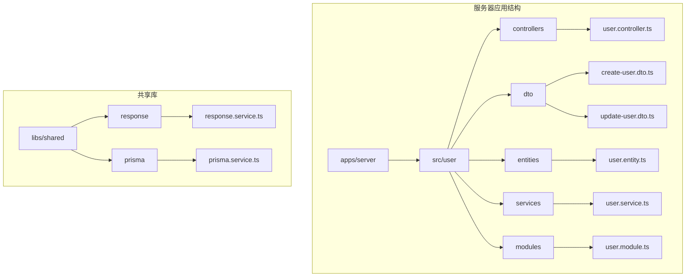

**图表来源**
- [user.controller.ts:1-35](file://server/apps/server/src/user/user.controller.ts#L1-L35)
- [user.module.ts:1-10](file://server/apps/server/src/user/user.module.ts#L1-L10)

**章节来源**
- [user.controller.ts:1-35](file://server/apps/server/src/user/user.controller.ts#L1-L35)
- [user.module.ts:1-10](file://server/apps/server/src/user/user.module.ts#L1-L10)

## 核心组件

用户控制器包含以下核心组件：

### 控制器类结构

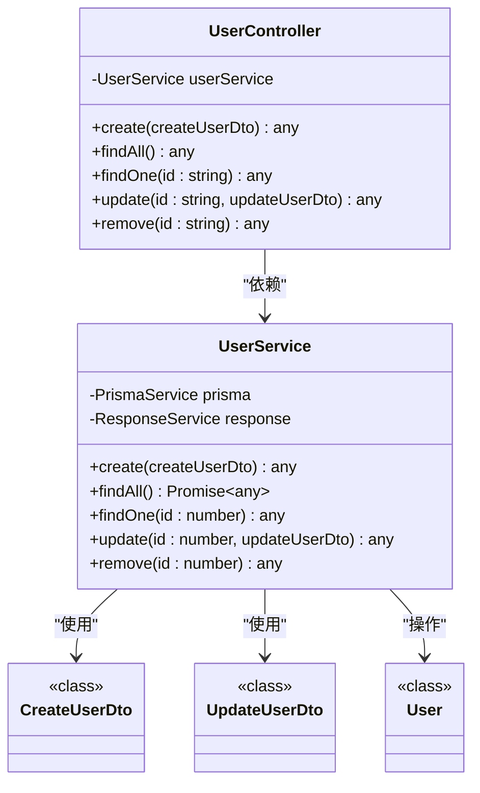

**图表来源**
- [user.controller.ts:6-34](file://server/apps/server/src/user/user.controller.ts#L6-L34)
- [user.service.ts:7-33](file://server/apps/server/src/user/user.service.ts#L7-L33)
- [create-user.dto.ts:1-2](file://server/apps/server/src/user/dto/create-user.dto.ts#L1-L2)
- [update-user.dto.ts:1-5](file://server/apps/server/src/user/dto/update-user.dto.ts#L1-L5)
- [user.entity.ts:1-2](file://server/apps/server/src/user/entities/user.entity.ts#L1-L2)

### DTO对象设计

用户控制器使用了两个主要的数据传输对象：

1. **CreateUserDto**: 用于用户创建操作的数据传输对象
2. **UpdateUserDto**: 基于PartialType的更新数据传输对象，继承自CreateUserDto

**章节来源**
- [create-user.dto.ts:1-2](file://server/apps/server/src/user/dto/create-user.dto.ts#L1-L2)
- [update-user.dto.ts:1-5](file://server/apps/server/src/user/dto/update-user.dto.ts#L1-L5)

## 架构概览

用户控制器采用分层架构设计，实现了清晰的关注点分离：

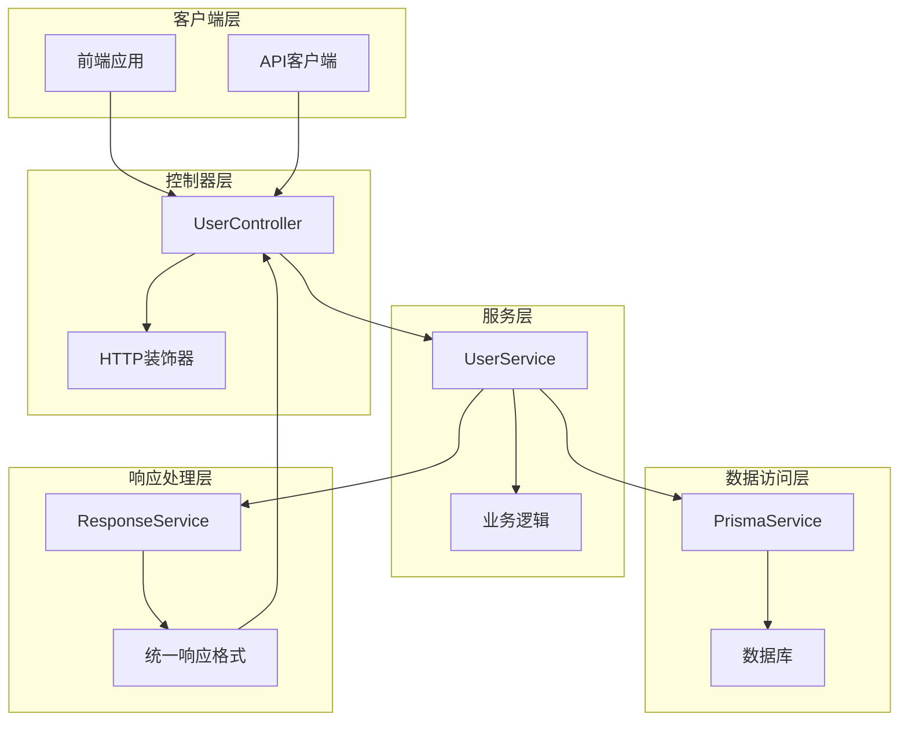

**图表来源**
- [user.controller.ts:1-35](file://server/apps/server/src/user/user.controller.ts#L1-L35)
- [user.service.ts:1-34](file://server/apps/server/src/user/user.service.ts#L1-L34)
- [response.service.ts:1-29](file://server/libs/shared/src/response/response.service.ts#L1-L29)
- [prisma.service.ts:1-18](file://server/libs/shared/src/prisma/prisma.service.ts#L1-L18)

## 详细组件分析

### RESTful API端点设计

用户控制器实现了标准的RESTful API端点映射：

| HTTP方法 | 路径 | 描述 | 参数 |
|---------|------|------|------|
| POST | `/api/user` | 创建新用户 | CreateUserDto |
| GET | `/api/user` | 获取所有用户 | 无 |
| GET | `/api/user/:id` | 获取单个用户 | id: string |
| PATCH | `/api/user/:id` | 更新用户信息 | id: string, UpdateUserDto |
| DELETE | `/api/user/:id` | 删除用户 | id: string |

**章节来源**
- [user.controller.ts:10-33](file://server/apps/server/src/user/user.controller.ts#L10-L33)

### 方法实现详解

#### 创建用户方法 (create)

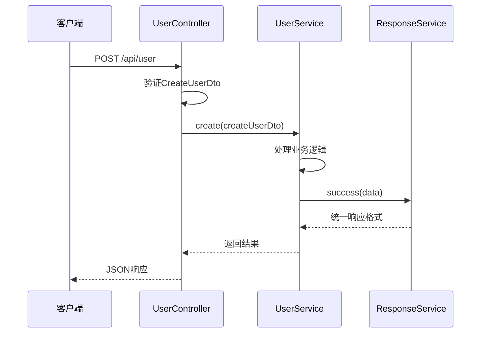

**图表来源**
- [user.controller.ts:10-13](file://server/apps/server/src/user/user.controller.ts#L10-L13)
- [user.service.ts:13-15](file://server/apps/server/src/user/user.service.ts#L13-L15)
- [response.service.ts:14-20](file://server/libs/shared/src/response/response.service.ts#L14-L20)

#### 查询所有用户方法 (findAll)

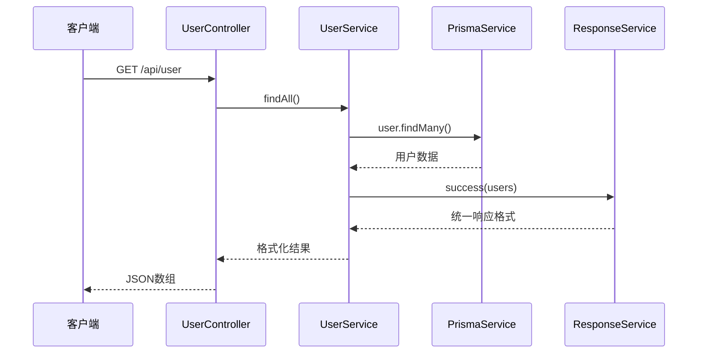

**图表来源**
- [user.controller.ts:15-18](file://server/apps/server/src/user/user.controller.ts#L15-L18)
- [user.service.ts:17-20](file://server/apps/server/src/user/user.service.ts#L17-L20)
- [prisma.service.ts:1-18](file://server/libs/shared/src/prisma/prisma.service.ts#L1-L18)
- [response.service.ts:14-20](file://server/libs/shared/src/response/response.service.ts#L14-L20)

#### 查询单个用户方法 (findOne)

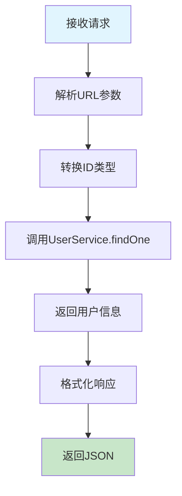

**图表来源**
- [user.controller.ts:20-23](file://server/apps/server/src/user/user.controller.ts#L20-L23)
- [user.service.ts:22-24](file://server/apps/server/src/user/user.service.ts#L22-L24)

#### 更新用户方法 (update)

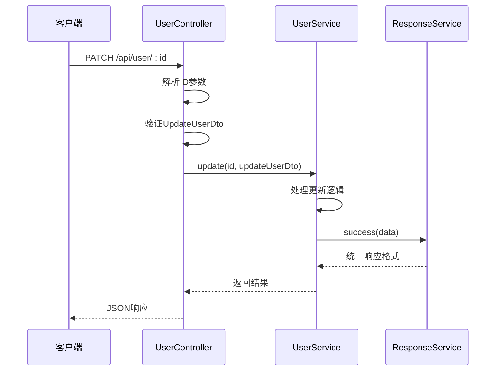

**图表来源**
- [user.controller.ts:25-28](file://server/apps/server/src/user/user.controller.ts#L25-L28)
- [user.service.ts:26-28](file://server/apps/server/src/user/user.service.ts#L26-L28)
- [response.service.ts:14-20](file://server/libs/shared/src/response/response.service.ts#L14-L20)

#### 删除用户方法 (remove)

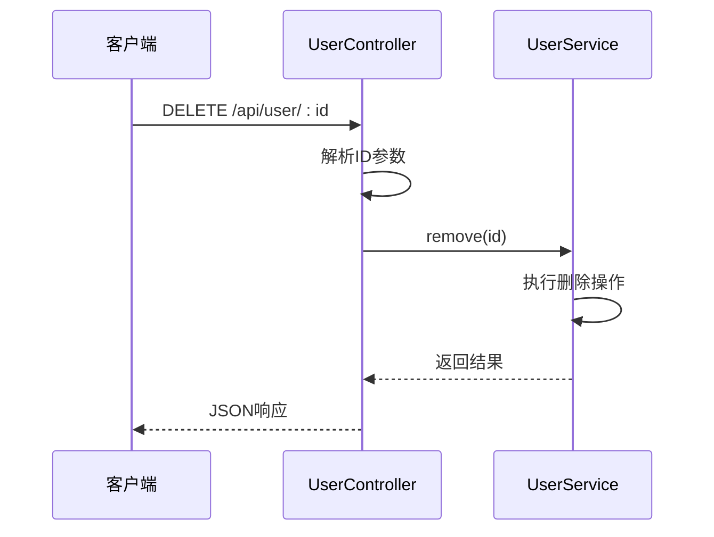

**图表来源**
- [user.controller.ts:30-33](file://server/apps/server/src/user/user.controller.ts#L30-L33)
- [user.service.ts:30-32](file://server/apps/server/src/user/user.service.ts#L30-L32)

### DTO对象详细说明

#### CreateUserDto

CreateUserDto是用户创建操作的数据传输对象，当前为空实现，为后续添加验证规则预留空间。

#### UpdateUserDto

UpdateUserDto通过继承CreateUserDto并使用NestJS的PartialType工具实现，允许部分字段更新：

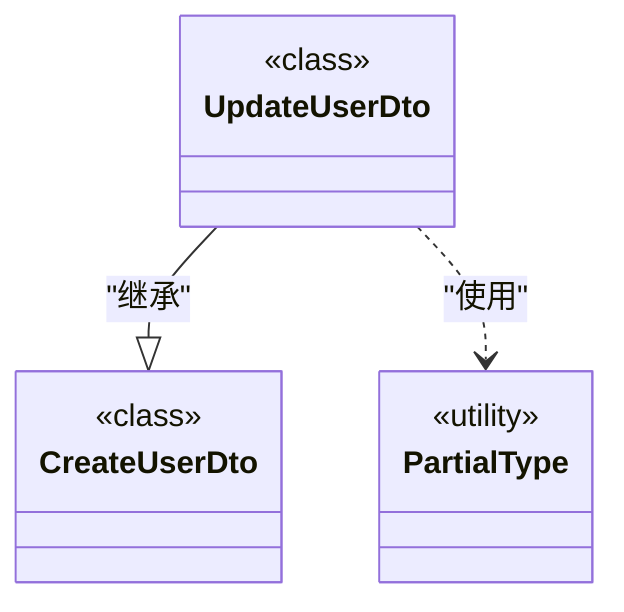

**图表来源**
- [update-user.dto.ts:1-5](file://server/apps/server/src/user/dto/update-user.dto.ts#L1-L5)

**章节来源**
- [create-user.dto.ts:1-2](file://server/apps/server/src/user/dto/create-user.dto.ts#L1-L2)
- [update-user.dto.ts:1-5](file://server/apps/server/src/user/dto/update-user.dto.ts#L1-L5)

### 参数处理和验证机制

用户控制器采用NestJS内置的参数装饰器进行参数处理：

1. **@Body()**: 用于提取请求体中的JSON数据
2. **@Param('id')**: 用于提取URL路径参数中的ID值
3. **类型转换**: 将字符串ID转换为数字类型

**章节来源**
- [user.controller.ts:11-12](file://server/apps/server/src/user/user.controller.ts#L11-L12)
- [user.controller.ts:21-22](file://server/apps/server/src/user/user.controller.ts#L21-L22)
- [user.controller.ts:26-27](file://server/apps/server/src/user/user.controller.ts#L26-L27)

### 响应格式标准化

用户控制器通过ResponseService实现统一的响应格式：

```mermaid
classDiagram
class ResponseService {
+success(data) Object
+error(data, message, code) Object
}
class Business {
+SUCCESS Object
+ERROR Object
}
ResponseService --> Business : "使用常量"
note for ResponseService : "统一响应格式\n{data, code, message}"
```

**图表来源**
- [response.service.ts:12-28](file://server/libs/shared/src/response/response.service.ts#L12-L28)

**章节来源**
- [response.service.ts:1-29](file://server/libs/shared/src/response/response.service.ts#L1-L29)

## 依赖关系分析

用户控制器的依赖关系体现了良好的依赖注入设计：

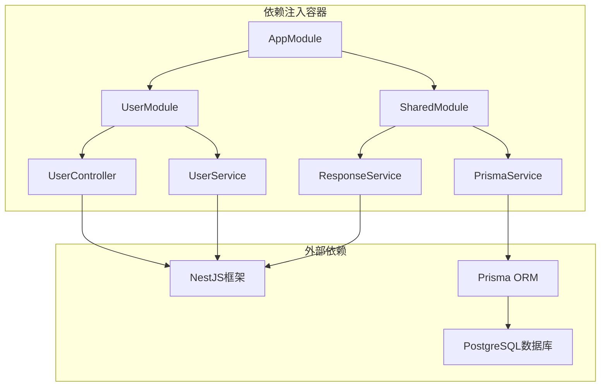

**图表来源**
- [app.module.ts:1-13](file://server/apps/server/src/app.module.ts#L1-L13)
- [user.module.ts:1-10](file://server/apps/server/src/user/user.module.ts#L1-L10)
- [main.ts:1-20](file://server/apps/server/src/main.ts#L1-L20)

### 依赖注入实现

用户控制器通过构造函数注入UserService依赖：

```typescript
constructor(private readonly userService: UserService) {}
```

UserService进一步注入PrismaService和ResponseService：

```typescript
constructor(
  private readonly prisma: PrismaService,
  private readonly response: ResponseService,
)
```

**章节来源**
- [user.controller.ts:8](file://server/apps/server/src/user/user.controller.ts#L8)
- [user.service.ts:9-12](file://server/apps/server/src/user/user.service.ts#L9-L12)

### 模块配置

用户模块配置了控制器和提供者：

```typescript
@Module({
  controllers: [UserController],
  providers: [UserService],
})
```

**章节来源**
- [user.module.ts:5-9](file://server/apps/server/src/user/user.module.ts#L5-L9)

## 性能考虑

### 数据库连接优化

PrismaService使用连接池管理数据库连接，支持高并发场景：

- 使用PrismaPg适配器优化PostgreSQL连接
- 自动连接管理和复用
- 支持异步查询操作

### 响应处理优化

ResponseService提供统一的响应格式，减少重复代码：
- 标准化的成功响应格式
- 可定制的错误响应格式
- 便于前端统一处理

### 缓存策略建议

虽然当前实现未包含缓存，但可以考虑以下优化：
- 对频繁查询的用户列表添加Redis缓存
- 实现ETag支持缓存验证
- 使用查询结果缓存减少数据库压力

## 故障排除指南

### 常见问题及解决方案

#### 1. 数据库连接失败

**症状**: 应用启动时出现数据库连接错误

**原因**: DATABASE_URL环境变量配置错误或数据库服务不可用

**解决方案**:
- 检查DATABASE_URL环境变量设置
- 验证数据库服务状态
- 确认网络连接正常

#### 2. DTO验证失败

**症状**: 请求被拒绝，返回400错误

**原因**: 请求体不符合DTO定义的验证规则

**解决方案**:
- 检查请求体格式是否正确
- 验证必填字段是否完整
- 确认数据类型匹配

#### 3. 路由参数类型错误

**症状**: ID参数转换失败，返回500错误

**原因**: URL中的ID不是有效的数字格式

**解决方案**:
- 确保URL中的ID为纯数字
- 在控制器中添加参数验证逻辑

### 错误处理机制

用户控制器通过全局异常过滤器处理错误：

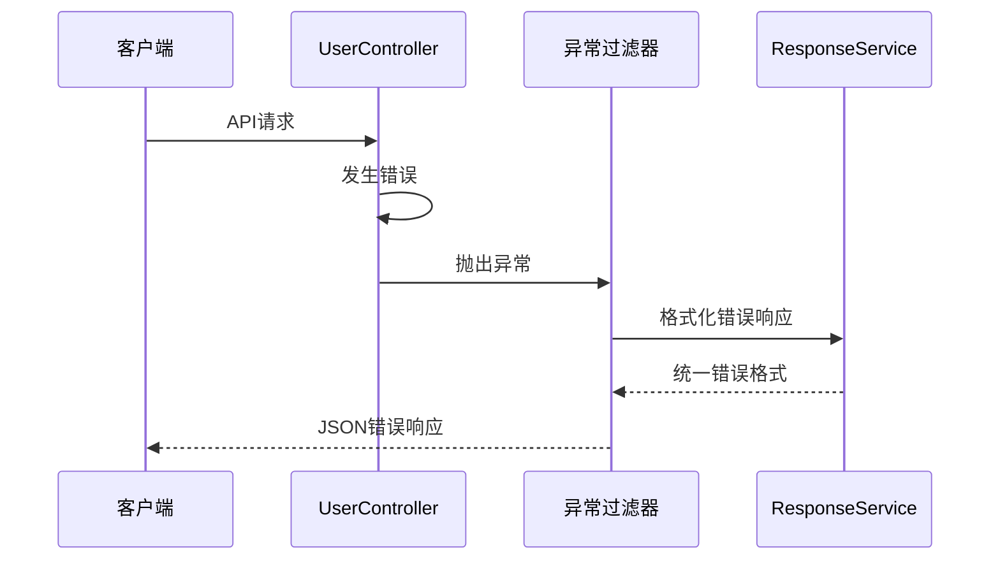

**图表来源**
- [main.ts:4-6](file://server/apps/server/src/main.ts#L4-L6)

**章节来源**
- [main.ts:1-20](file://server/apps/server/src/main.ts#L1-L20)

## 结论

用户控制器实现了完整的RESTful API功能，具有以下特点：

1. **清晰的架构设计**: 采用分层架构，职责分离明确
2. **标准化的响应格式**: 通过ResponseService实现统一响应
3. **依赖注入模式**: 使用NestJS依赖注入容器管理依赖关系
4. **可扩展性**: DTO模式便于添加验证规则和业务逻辑
5. **错误处理**: 全局异常过滤器提供一致的错误处理机制

该控制器为用户管理功能提供了坚实的基础，可以根据具体需求进一步扩展验证规则、业务逻辑和性能优化措施。