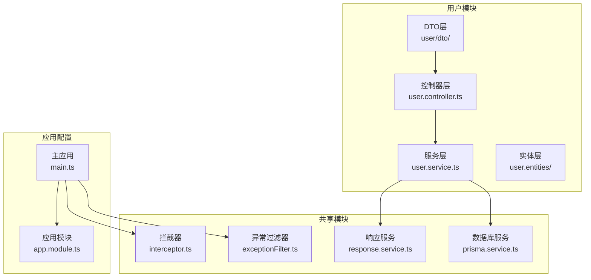
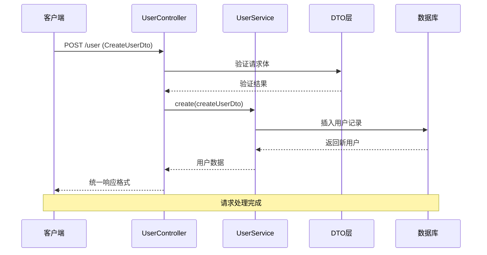
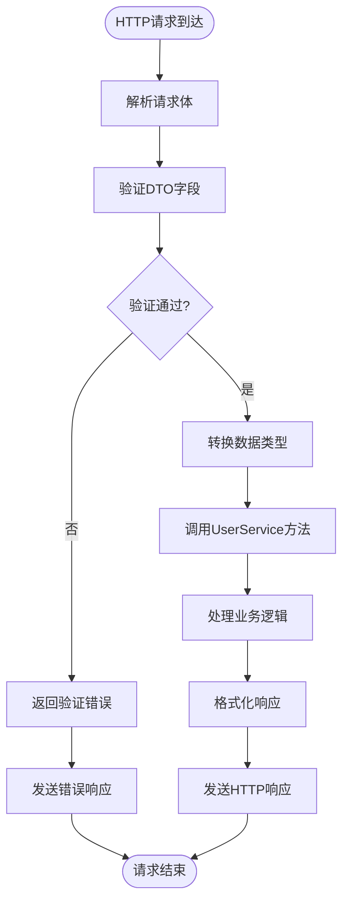
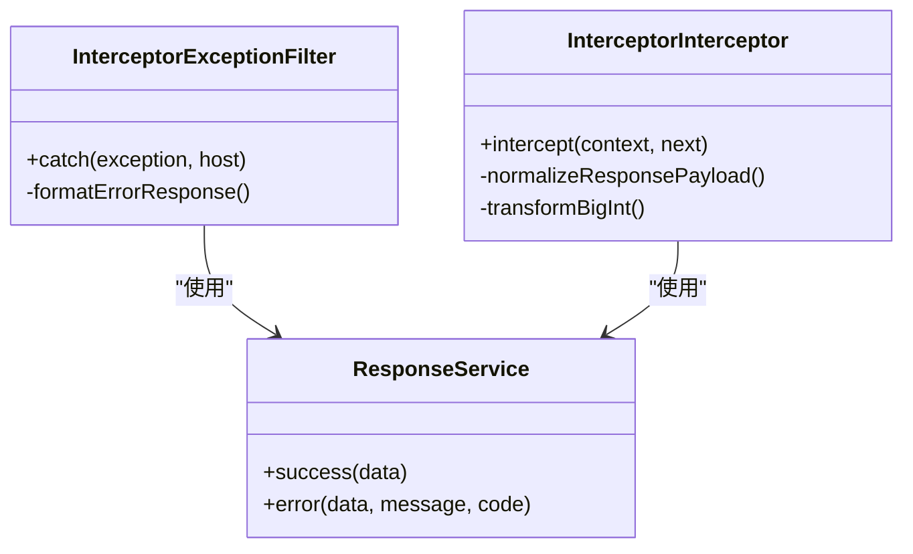

# 用户数据传输对象

<cite>
**本文档引用的文件**
- [create-user.dto.ts](file://server/apps/server/src/user/dto/create-user.dto.ts)
- [update-user.dto.ts](file://server/apps/server/src/user/dto/update-user.dto.ts)
- [user.entity.ts](file://server/apps/server/src/user/entities/user.entity.ts)
- [user.controller.ts](file://server/apps/server/src/user/user.controller.ts)
- [user.service.ts](file://server/apps/server/src/user/user.service.ts)
- [main.ts](file://server/apps/server/src/main.ts)
- [app.module.ts](file://server/apps/server/src/app.module.ts)
- [interceptor.ts](file://server/libs/shared/src/interceptor/interceptor.ts)
- [exceptionFilter.ts](file://server/libs/shared/src/interceptor/exceptionFilter.ts)
- [response.service.ts](file://server/libs/shared/src/response/response.service.ts)
- [prisma.service.ts](file://server/libs/shared/src/prisma/prisma.service.ts)
- [schema.prisma](file://server/prisma/schema.prisma)
</cite>

## 目录
1. [简介](#简介)
2. [项目结构](#项目结构)
3. [核心组件](#核心组件)
4. [架构概览](#架构概览)
5. [详细组件分析](#详细组件分析)
6. [依赖关系分析](#依赖关系分析)
7. [性能考虑](#性能考虑)
8. [故障排除指南](#故障排除指南)
9. [结论](#结论)

## 简介

本文档详细介绍了用户数据传输对象（DTO）的设计与实现，重点分析了CreateUserDto和UpdateUserDto的设计原则、字段定义、数据验证规则以及在请求处理流程中的作用。该系统采用NestJS框架构建，实现了类型安全的数据传输和统一的响应格式化。

## 项目结构

用户DTO相关的核心文件组织如下：



**图表来源**
- [main.ts:1-20](file://server/apps/server/src/main.ts#L1-L20)
- [app.module.ts:1-13](file://server/apps/server/src/app.module.ts#L1-L13)
- [user.controller.ts:1-35](file://server/apps/server/src/user/user.controller.ts#L1-L35)

**章节来源**
- [main.ts:1-20](file://server/apps/server/src/main.ts#L1-L20)
- [app.module.ts:1-13](file://server/apps/server/src/app.module.ts#L1-L13)

## 核心组件

### DTO设计原则

当前的DTO实现采用了简洁的设计模式：

1. **CreateUserDto**: 作为基础DTO，定义用户创建时需要的数据结构
2. **UpdateUserDto**: 使用NestJS的PartialType装饰器继承CreateUserDto，实现部分更新功能
3. **类型安全**: 通过TypeScript接口确保编译时类型检查
4. **扩展性**: 基于继承模式支持灵活的功能扩展

### 字段定义分析

根据Prisma Schema定义，User实体包含以下字段：

| 字段名 | 类型 | 约束 | 描述 |
|--------|------|------|------|
| id | String | 主键, cuid()默认值 | 用户唯一标识符 |
| name | String | 必填 | 用户姓名 |
| email | String | 唯一索引 | 用户邮箱地址 |
| phone | String | 唯一索引 | 用户手机号码 |
| address | String | 可选 | 用户地址信息 |
| password | String | 必填 | 用户密码 |
| avatar | String | 可选 | 用户头像URL |
| wordNumber | Int | 默认值0 | 单词学习数量 |
| dayNumber | Int | 默认值0 | 学习打卡天数 |
| createdAt | DateTime | 默认now() | 创建时间戳 |
| updatedAt | DateTime | 自动更新 | 更新时间戳 |
| lastLoginAt | DateTime | 可选 | 最后登录时间 |

**章节来源**
- [schema.prisma:25-41](file://server/prisma/schema.prisma#L25-L41)

## 架构概览

用户DTO在整个请求处理流程中的作用：



**图表来源**
- [user.controller.ts:10-13](file://server/apps/server/src/user/user.controller.ts#L10-L13)
- [user.service.ts:13-15](file://server/apps/server/src/user/user.service.ts#L13-L15)

## 详细组件分析

### CreateUserDto 分析

当前的CreateUserDto实现非常简洁，仅包含类声明：

```typescript
export class CreateUserDto {}
```

这种设计的优势：
- **灵活性**: 为后续添加验证装饰器留出空间
- **扩展性**: 可以轻松添加新的字段和验证规则
- **简洁性**: 避免了不必要的复杂性

### UpdateUserDto 分析

UpdateUserDto采用继承模式实现部分更新：

```typescript
import { PartialType } from '@nestjs/mapped-types';
import { CreateUserDto } from './create-user.dto';

export class UpdateUserDto extends PartialType(CreateUserDto) {}
```

这种设计模式的优势：
- **代码复用**: 重用CreateUserDto的所有字段定义
- **一致性**: 确保更新和创建使用相同的字段规范
- **灵活性**: 支持部分字段更新而不需要完整的DTO定义

### 数据验证规则实现

当前实现中，数据验证规则尚未完全实现。基于Prisma Schema约束，建议的验证规则包括：

#### 必填字段验证
- `name`: 必须存在且非空
- `password`: 必须存在且符合密码强度要求
- `phone`: 必须存在且符合手机号格式

#### 格式验证
- `email`: 必须符合邮箱格式
- `phone`: 必须符合手机号格式（支持国际格式）
- `password`: 必须满足最小长度和复杂度要求

#### 业务规则检查
- `email`: 必须唯一，不能重复注册
- `phone`: 必须唯一，不能重复绑定
- `wordNumber/dayNumber`: 必须为非负整数

### 请求处理流程



**图表来源**
- [user.controller.ts:10-28](file://server/apps/server/src/user/user.controller.ts#L10-L28)
- [interceptor.ts:64-84](file://server/libs/shared/src/interceptor/interceptor.ts#L64-L84)

**章节来源**
- [user.controller.ts:1-35](file://server/apps/server/src/user/user.controller.ts#L1-L35)
- [user.service.ts:1-34](file://server/apps/server/src/user/user.service.ts#L1-L34)

### 实际使用示例

#### 创建用户的示例请求

```typescript
// 请求示例
{
  "name": "张三",
  "email": "zhangsan@example.com",
  "phone": "13800001111",
  "password": "SecurePass123!",
  "address": "北京市朝阳区"
}

// 对应的DTO结构
interface CreateUserDto {
  name: string;
  email: string;
  phone: string;
  password: string;
  address?: string;
}
```

#### 更新用户的示例请求

```typescript
// 部分更新示例
{
  "address": "上海市浦东新区",
  "avatar": "https://example.com/avatar.jpg"
}

// 对应的DTO结构
interface UpdateUserDto {
  address?: string;
  avatar?: string;
  // 其他字段可选
}
```

### 错误处理机制

系统提供了完善的错误处理机制：



**图表来源**
- [exceptionFilter.ts:8-22](file://server/libs/shared/src/interceptor/exceptionFilter.ts#L8-L22)
- [interceptor.ts:59-86](file://server/libs/shared/src/interceptor/interceptor.ts#L59-L86)
- [response.service.ts:12-29](file://server/libs/shared/src/response/response.service.ts#L12-L29)

**章节来源**
- [exceptionFilter.ts:1-23](file://server/libs/shared/src/interceptor/exceptionFilter.ts#L1-L23)
- [interceptor.ts:1-86](file://server/libs/shared/src/interceptor/interceptor.ts#L1-L86)
- [response.service.ts:1-29](file://server/libs/shared/src/response/response.service.ts#L1-L29)

## 依赖关系分析

```mermaid
graph LR
subgraph "外部依赖"
NestJS[NestJS框架]
MappedTypes[@nestjs/mapped-types]
Prisma[Prisma ORM]
end
subgraph "内部模块"
UserModule[User模块]
SharedModule[Shared模块]
end
subgraph "核心文件"
CreateUserDto[CreateUserDto]
UpdateUserDto[UpdateUserDto]
UserController[UserController]
UserService[UserService]
end
NestJS --> UserModule
NestJS --> SharedModule
MappedTypes --> UpdateUserDto
Prisma --> UserService
UserModule --> CreateUserDto
UserModule --> UpdateUserDto
UserModule --> UserController
UserModule --> UserService
SharedModule --> UserService
```

**图表来源**
- [update-user.dto.ts:1-5](file://server/apps/server/src/user/dto/update-user.dto.ts#L1-L5)
- [user.controller.ts:1-35](file://server/apps/server/src/user/user.controller.ts#L1-L35)
- [user.service.ts:1-34](file://server/apps/server/src/user/user.service.ts#L1-L34)

**章节来源**
- [update-user.dto.ts:1-5](file://server/apps/server/src/user/dto/update-user.dto.ts#L1-L5)
- [user.controller.ts:1-35](file://server/apps/server/src/user/user.controller.ts#L1-L35)
- [user.service.ts:1-34](file://server/apps/server/src/user/user.service.ts#L1-L34)

## 性能考虑

### 数据传输优化

1. **类型安全**: 通过TypeScript确保编译时类型检查，减少运行时错误
2. **响应格式化**: 统一的响应格式减少了客户端处理复杂度
3. **数据转换**: 拦截器自动处理BigInt到字符串的转换，避免序列化问题

### 内存管理

1. **DTO复用**: UpdateUserDto继承CreateUserDto，减少内存占用
2. **流式处理**: 使用RxJS Observable进行异步数据处理
3. **资源清理**: 正确的生命周期管理确保资源及时释放

## 故障排除指南

### 常见问题及解决方案

#### DTO验证失败
- **症状**: HTTP 400错误，返回验证错误信息
- **原因**: 请求体不符合DTO定义的字段要求
- **解决**: 检查请求体格式，确保所有必需字段都已提供

#### 数据库连接问题
- **症状**: HTTP 500错误，数据库操作失败
- **原因**: 数据库连接配置错误或连接池耗尽
- **解决**: 检查DATABASE_URL环境变量，确认数据库服务可用

#### 响应格式异常
- **症状**: 响应格式不符合预期
- **原因**: 拦截器配置错误或自定义响应格式
- **解决**: 检查InterceptorInterceptor配置，确认响应格式化逻辑

**章节来源**
- [exceptionFilter.ts:10-21](file://server/libs/shared/src/interceptor/exceptionFilter.ts#L10-L21)
- [interceptor.ts:64-84](file://server/libs/shared/src/interceptor/interceptor.ts#L64-L84)

## 结论

用户DTO系统展现了良好的设计原则和扩展性。当前实现虽然简洁，但为未来的功能扩展奠定了坚实基础。建议的改进方向包括：

1. **完善验证规则**: 添加具体的字段验证装饰器
2. **增强错误处理**: 提供更详细的错误信息和处理策略
3. **性能优化**: 实现缓存机制和批量操作支持
4. **文档完善**: 添加详细的API文档和使用示例

该系统的设计体现了现代Web开发的最佳实践，通过清晰的分层架构和类型安全保证，为用户提供可靠的服务。