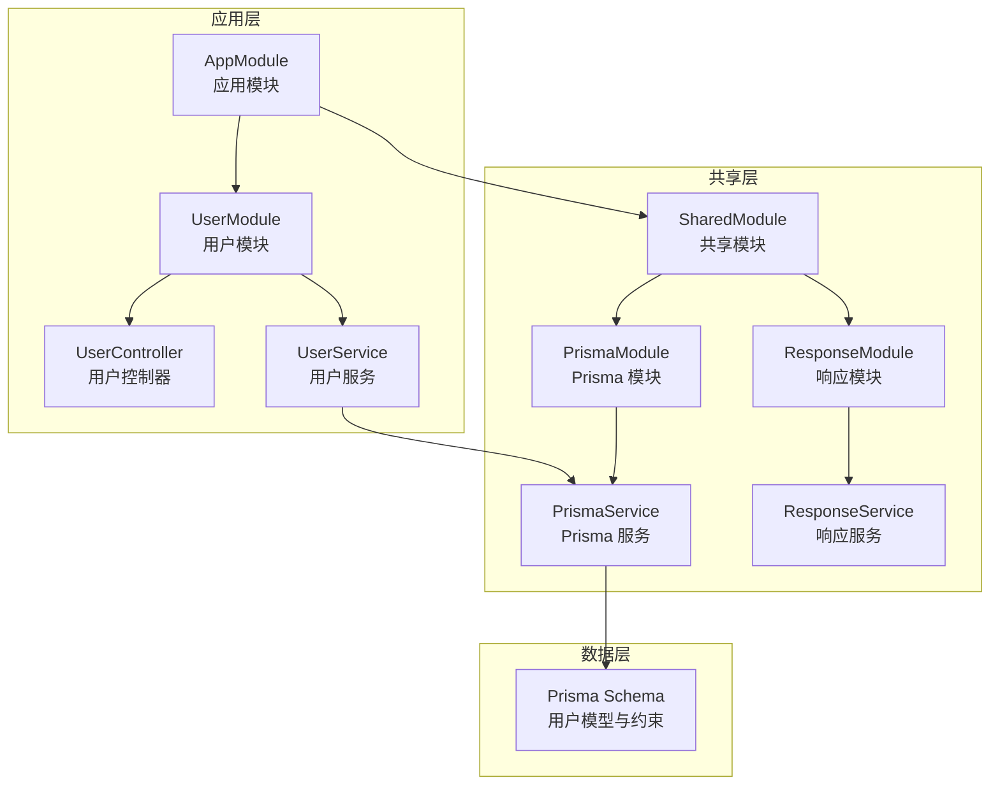
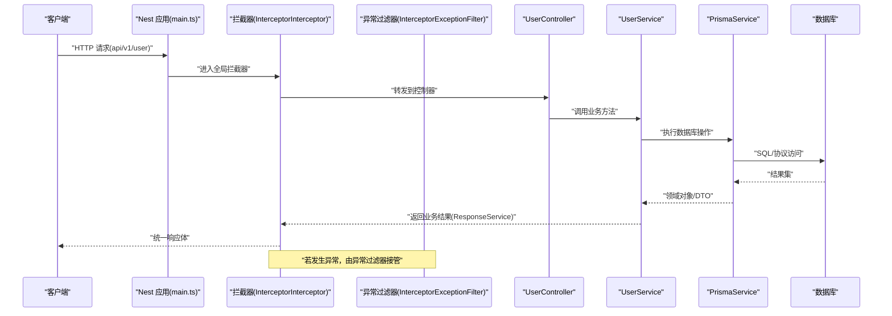
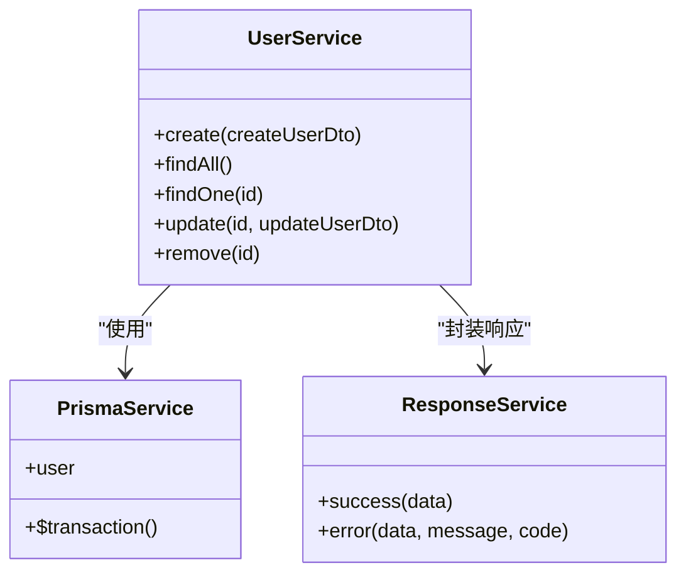
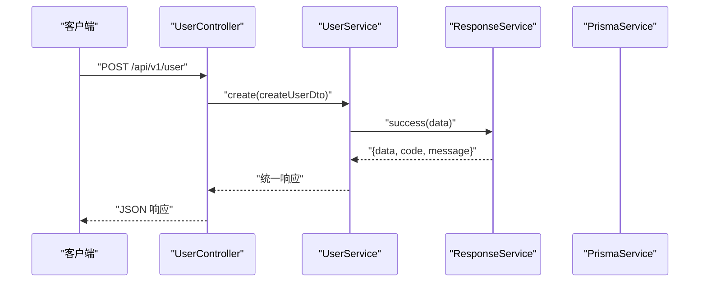
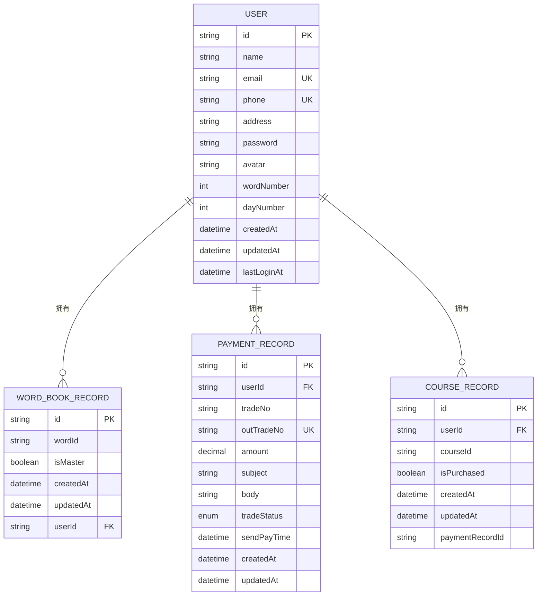
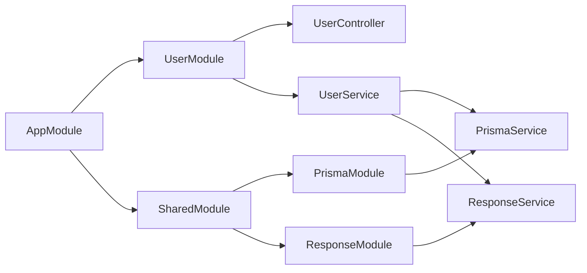

# 用户服务层

<cite>
**本文引用的文件**
- [server\apps\server\src\user\user.service.ts](file://server/apps/server/src/user/user.service.ts)
- [server\apps\server\src\user\user.controller.ts](file://server/apps/server/src/user/user.controller.ts)
- [server\apps\server\src\user\user.module.ts](file://server/apps/server/src/user/user.module.ts)
- [server\apps\server\src\user\dto\create-user.dto.ts](file://server/apps/server/src/user/dto/create-user.dto.ts)
- [server\apps\server\src\user\dto\update-user.dto.ts](file://server/apps/server/src/user/dto/update-user.dto.ts)
- [server\apps\server\src\user\entities\user.entity.ts](file://server/apps/server/src/user/entities/user.entity.ts)
- [server\libs\shared\src\prisma\prisma.service.ts](file://server/libs/shared/src/prisma/prisma.service.ts)
- [server\libs\shared\src\prisma\prisma.module.ts](file://server/libs/shared/src/prisma/prisma.module.ts)
- [server\libs\shared\src\response\response.service.ts](file://server/libs/shared/src/response/response.service.ts)
- [server\libs\shared\src\response\response.module.ts](file://server/libs/shared/src/response/response.module.ts)
- [server\libs\shared\src\shared.module.ts](file://server/libs/shared/src/shared.module.ts)
- [server\apps\server\src\app.module.ts](file://server/apps/server/src/app.module.ts)
- [server\apps\server\src\main.ts](file://server/apps/server/src/main.ts)
- [server\prisma\schema.prisma](file://server/prisma/schema.prisma)
- [server\libs\shared\src\interceptor\interceptor.ts](file://server/libs/shared/src/interceptor/interceptor.ts)
- [server\libs\shared\src\interceptor\exceptionFilter.ts](file://server/libs/shared/src/interceptor/exceptionFilter.ts)
</cite>

## 目录
1. [简介](#简介)
2. [项目结构](#项目结构)
3. [核心组件](#核心组件)
4. [架构总览](#架构总览)
5. [详细组件分析](#详细组件分析)
6. [依赖关系分析](#依赖关系分析)
7. [性能考虑](#性能考虑)
8. [故障排查指南](#故障排查指南)
9. [结论](#结论)
10. [附录](#附录)

## 简介
本文件面向“用户服务层”的技术文档，聚焦于 UserService 的核心业务逻辑实现与扩展建议，涵盖用户创建、查询、更新与删除的流程设计；阐述服务层与 PrismaService 的数据交互方式（含数据库操作封装与事务处理建议）；解析用户业务规则（唯一性校验、密码处理、数据完整性检查）；提供服务方法的调用示例与异常处理策略；总结服务层的设计原则与最佳实践。  
当前仓库中 UserService 的方法体仍处于占位阶段，本文在不直接修改代码的前提下，基于现有 DTO、实体、Prisma 模式与共享模块，给出可落地的实现蓝图与调用路径。

## 项目结构
用户服务层位于 server 应用内，采用标准 NestJS 分层：控制器负责 HTTP 入口，服务层承载业务逻辑，共享模块提供 Prisma 与统一响应封装，Prisma 模式定义用户模型与约束。

图示来源
- [server\apps\server\src\app.module.ts:1-13](file://server/apps/server/src/app.module.ts#L1-L13)
- [server\apps\server\src\user\user.module.ts:1-10](file://server/apps/server/src/user/user.module.ts#L1-L10)
- [server\apps\server\src\user\user.controller.ts:1-35](file://server/apps/server/src/user/user.controller.ts#L1-L35)
- [server\apps\server\src\user\user.service.ts:1-34](file://server/apps/server/src/user/user.service.ts#L1-L34)
- [server\libs\shared\src\shared.module.ts:1-13](file://server/libs/shared/src/shared.module.ts#L1-L13)
- [server\libs\shared\src\prisma\prisma.module.ts:1-9](file://server/libs/shared/src/prisma/prisma.module.ts#L1-L9)
- [server\libs\shared\src\response\response.module.ts:1-9](file://server/libs/shared/src/response/response.module.ts#L1-L9)
- [server\libs\shared\src\prisma\prisma.service.ts:1-18](file://server/libs/shared/src/prisma/prisma.service.ts#L1-L18)
- [server\libs\shared\src\response\response.service.ts:1-29](file://server/libs/shared/src/response/response.service.ts#L1-L29)
- [server\prisma\schema.prisma:24-41](file://server/prisma/schema.prisma#L24-L41)

章节来源
- [server\apps\server\src\app.module.ts:1-13](file://server/apps/server/src/app.module.ts#L1-L13)
- [server\apps\server\src\user\user.module.ts:1-10](file://server/apps/server/src/user/user.module.ts#L1-L10)
- [server\libs\shared\src\shared.module.ts:1-13](file://server/libs/shared/src/shared.module.ts#L1-L13)

## 核心组件
- 用户控制器：暴露 REST 接口，接收请求参数并委派给 UserService。
- 用户服务：承载业务逻辑，当前方法体为占位，后续需实现具体 CRUD 与业务规则。
- DTO：输入参数结构化定义，CreateUserDto/UpdateUserDto。
- 实体：User 实体占位，后续可映射 Prisma 生成的客户端类型或领域模型。
- Prisma 模块与服务：提供数据库连接与客户端实例。
- 响应模块与服务：统一返回结构，便于前端消费。
- 主应用：注册模块、启用拦截器与异常过滤器、设置全局前缀与版本控制。

章节来源
- [server\apps\server\src\user\user.controller.ts:1-35](file://server/apps/server/src/user/user.controller.ts#L1-L35)
- [server\apps\server\src\user\user.service.ts:1-34](file://server/apps/server/src/user/user.service.ts#L1-L34)
- [server\apps\server\src\user\dto\create-user.dto.ts:1-2](file://server/apps/server/src/user/dto/create-user.dto.ts#L1-L2)
- [server\apps\server\src\user\dto\update-user.dto.ts:1-5](file://server/apps/server/src/user/dto/update-user.dto.ts#L1-L5)
- [server\apps\server\src\user\entities\user.entity.ts:1-2](file://server/apps/server/src/user/entities/user.entity.ts#L1-L2)
- [server\libs\shared\src\prisma\prisma.module.ts:1-9](file://server/libs/shared/src/prisma/prisma.module.ts#L1-L9)
- [server\libs\shared\src\response\response.module.ts:1-9](file://server/libs/shared/src/response/response.module.ts#L1-L9)
- [server\apps\server\src\main.ts:1-20](file://server/apps/server/src/main.ts#L1-L20)

## 架构总览
下图展示从 HTTP 请求到数据库访问与统一响应的完整链路，以及异常处理路径。

图示来源
- [server\apps\server\src\main.ts:8-18](file://server/apps/server/src/main.ts#L8-L18)
- [server\libs\shared\src\interceptor\interceptor.ts:64-84](file://server/libs/shared/src/interceptor/interceptor.ts#L64-L84)
- [server\libs\shared\src\interceptor\exceptionFilter.ts:8-22](file://server/libs/shared/src/interceptor/exceptionFilter.ts#L8-L22)
- [server\apps\server\src\user\user.controller.ts:10-33](file://server/apps/server/src/user/user.controller.ts#L10-L33)
- [server\apps\server\src\user\user.service.ts:13-32](file://server/apps/server/src/user/user.service.ts#L13-L32)
- [server\libs\shared\src\response\response.service.ts:14-27](file://server/libs/shared/src/response/response.service.ts#L14-L27)
- [server\libs\shared\src\prisma\prisma.service.ts:7-15](file://server/libs/shared/src/prisma/prisma.service.ts#L7-L15)

## 详细组件分析

### 用户服务类分析
UserService 当前仅包含占位方法，后续需实现以下职责：
- 用户创建：校验输入、处理密码（加密）、唯一性检查（邮箱/手机号）、持久化与返回统一结构。
- 用户查询：支持分页、筛选、排序；统一返回结构。
- 用户更新：部分字段更新、唯一性冲突处理、返回统一结构。
- 用户删除：软删/硬删策略、关联清理建议、返回统一结构。
- 事务处理：跨表写入（如创建用户同时初始化统计字段）时使用 Prisma 事务。

图示来源
- [server\apps\server\src\user\user.service.ts:8-12](file://server/apps/server/src/user/user.service.ts#L8-L12)
- [server\libs\shared\src\prisma\prisma.service.ts:7-15](file://server/libs/shared/src/prisma/prisma.service.ts#L7-L15)
- [server\libs\shared\src\response\response.service.ts:13-28](file://server/libs/shared/src/response/response.service.ts#L13-L28)

章节来源
- [server\apps\server\src\user\user.service.ts:1-34](file://server/apps/server/src/user/user.service.ts#L1-L34)

### 控制器到服务的调用序列
以“创建用户”为例，展示端到端调用链路。

图示来源
- [server\apps\server\src\user\user.controller.ts:10-13](file://server/apps/server/src/user/user.controller.ts#L10-L13)
- [server\apps\server\src\user\user.service.ts:13-15](file://server/apps/server/src/user/user.service.ts#L13-L15)
- [server\libs\shared\src\response\response.service.ts:14-20](file://server/libs/shared/src/response/response.service.ts#L14-L20)

章节来源
- [server\apps\server\src\user\user.controller.ts:1-35](file://server/apps/server/src/user/user.controller.ts#L1-L35)
- [server\apps\server\src\user\user.service.ts:1-34](file://server/apps/server/src/user/user.service.ts#L1-L34)

### 数据模型与业务规则
基于 Prisma Schema 的用户模型，梳理关键业务规则与约束：
- 唯一性：邮箱与手机号必须唯一。
- 必填项：用户名、密码等。
- 时间戳：自动维护创建与更新时间。
- 关系：用户与单词记录、支付记录、课程记录存在一对多/唯一关系。

图示来源
- [server\prisma\schema.prisma:25-41](file://server/prisma/schema.prisma#L25-L41)
- [server\prisma\schema.prisma:44-55](file://server/prisma/schema.prisma#L44-L55)
- [server\prisma\schema.prisma:89-104](file://server/prisma/schema.prisma#L89-L104)
- [server\prisma\schema.prisma:106-119](file://server/prisma/schema.prisma#L106-L119)

章节来源
- [server\prisma\schema.prisma:24-41](file://server/prisma/schema.prisma#L24-L41)

### 业务规则实现要点
- 唯一性验证：在创建/更新时，先查询邮箱与手机号是否已存在，避免违反数据库唯一约束导致的通用异常。
- 密码处理：创建时对明文密码进行安全哈希，更新时区分“改密”与“非改密”场景；禁止明文存储。
- 数据完整性检查：校验必填字段、长度范围、格式（邮箱/手机号），并在 DTO 层或服务层进行前置校验。
- 事务处理：当需要跨表写入（如创建用户并初始化统计数据）时，使用 Prisma 事务保证一致性。
- 返回结构：统一通过 ResponseService 输出，包含 code、message、data 字段，便于前端统一处理。

章节来源
- [server\libs\shared\src\response\response.service.ts:14-27](file://server/libs/shared/src/response/response.service.ts#L14-L27)
- [server\libs\shared\src\prisma\prisma.service.ts:7-15](file://server/libs/shared/src/prisma/prisma.service.ts#L7-L15)
- [server\prisma\schema.prisma:27-29](file://server/prisma/schema.prisma#L27-L29)

### 方法调用示例与异常处理策略
- 创建用户
  - 路径：POST /api/v1/user
  - 参数：CreateUserDto
  - 流程：控制器 -> 服务 -> Prisma -> 统一响应
  - 异常：若违反唯一性或输入校验，抛出 HTTP 异常，由异常过滤器统一输出
- 查询用户
  - 路径：GET /api/v1/user
  - 流程：控制器 -> 服务 -> Prisma -> 统一响应
- 更新用户
  - 路径：PATCH /api/v1/user/:id
  - 参数：UpdateUserDto（部分字段）
  - 流程：控制器 -> 服务 -> Prisma -> 统一响应
- 删除用户
  - 路径：DELETE /api/v1/user/:id
  - 流程：控制器 -> 服务 -> Prisma -> 统一响应

章节来源
- [server\apps\server\src\user\user.controller.ts:10-33](file://server/apps/server/src/user/user.controller.ts#L10-L33)
- [server\apps\server\src\user\user.service.ts:17-32](file://server/apps/server/src/user/user.service.ts#L17-L32)
- [server\libs\shared\src\interceptor\exceptionFilter.ts:10-21](file://server/libs/shared/src/interceptor/exceptionFilter.ts#L10-L21)

## 依赖关系分析
- 模块依赖：AppModule 引入 UserModule 与 SharedModule；UserModule 提供控制器与服务；SharedModule 提供 Prisma 与 Response 两个子模块。
- 服务依赖：UserService 依赖 PrismaService 与 ResponseService。
- 控制器依赖：UserController 依赖 UserService。
- 全局中间件：main.ts 注册拦截器与异常过滤器，统一处理响应与错误。

图示来源
- [server\apps\server\src\app.module.ts:4-10](file://server/apps/server/src/app.module.ts#L4-L10)
- [server\apps\server\src\user\user.module.ts:5-8](file://server/apps/server/src/user/user.module.ts#L5-L8)
- [server\libs\shared\src\shared.module.ts:6-12](file://server/libs/shared/src/shared.module.ts#L6-L12)

章节来源
- [server\apps\server\src\app.module.ts:1-13](file://server/apps/server/src/app.module.ts#L1-L13)
- [server\apps\server\src\user\user.module.ts:1-10](file://server/apps/server/src/user/user.module.ts#L1-L10)
- [server\libs\shared\src\shared.module.ts:1-13](file://server/libs/shared/src/shared.module.ts#L1-L13)

## 性能考虑
- 查询优化：为高频查询字段建立索引（如邮箱、手机号、用户名），合理使用分页与投影。
- 写入优化：批量插入/更新时使用 Prisma 的批量 API；避免 N+1 查询，必要时使用 include 或 select。
- 缓存策略：热点读取（如用户基本信息）可引入缓存层，注意缓存与数据库的一致性。
- 连接池：确保数据库连接池配置合理，避免高并发下的连接争用。
- 响应体积：统一响应体包含必要字段即可，避免传输冗余数据。

## 故障排查指南
- 统一响应与异常
  - 成功响应：由拦截器将服务返回的数据标准化为统一结构。
  - 异常处理：捕获 HTTP 异常，输出带时间戳、路径、消息与状态码的统一错误结构。
- 常见问题定位
  - 数据库连接失败：检查 DATABASE_URL 环境变量与网络连通性。
  - 唯一性冲突：根据 Prisma 抛出的约束错误信息，定位重复字段（邮箱/手机号）。
  - 输入校验失败：确认 DTO 字段校验装饰器与前端传参一致。
- 日志与可观测性
  - 在服务层记录关键操作日志（创建、更新、删除），便于审计与回溯。

章节来源
- [server\libs\shared\src\interceptor\interceptor.ts:64-84](file://server/libs/shared/src/interceptor/interceptor.ts#L64-L84)
- [server\libs\shared\src\interceptor\exceptionFilter.ts:8-22](file://server/libs/shared/src/interceptor/exceptionFilter.ts#L8-L22)
- [server\apps\server\src\main.ts:8-18](file://server/apps/server/src/main.ts#L8-L18)

## 结论
当前用户服务层具备清晰的分层结构与可扩展的模块化设计。UserService 的核心逻辑尚未实现，建议按“输入校验 -> 唯一性检查 -> 业务规则处理 -> 数据持久化 -> 统一响应 -> 异常处理”的路径逐步完善。结合 Prisma 的强类型与事务能力，以及共享模块提供的统一响应与拦截器/异常过滤器，可快速构建稳定、可维护的用户管理能力。

## 附录
- 版本控制与全局前缀：应用启用 URI 版本控制，默认 v1；设置全局前缀 api。
- 拦截器行为：自动标准化响应体，注入时间戳、路径、成功标记与数据；对 BigInt 进行字符串化处理。
- 异常过滤器：捕获 HTTP 异常，输出统一错误结构。

章节来源
- [server\apps\server\src\main.ts:12-17](file://server/apps/server/src/main.ts#L12-L17)
- [server\libs\shared\src\interceptor\interceptor.ts:64-84](file://server/libs/shared/src/interceptor/interceptor.ts#L64-L84)
- [server\libs\shared\src\interceptor\exceptionFilter.ts:8-22](file://server/libs/shared/src/interceptor/exceptionFilter.ts#L8-L22)