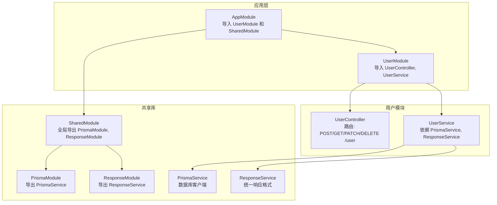
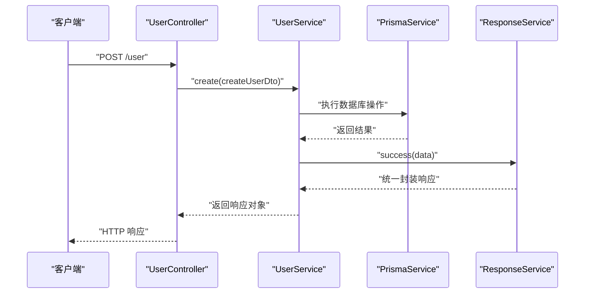
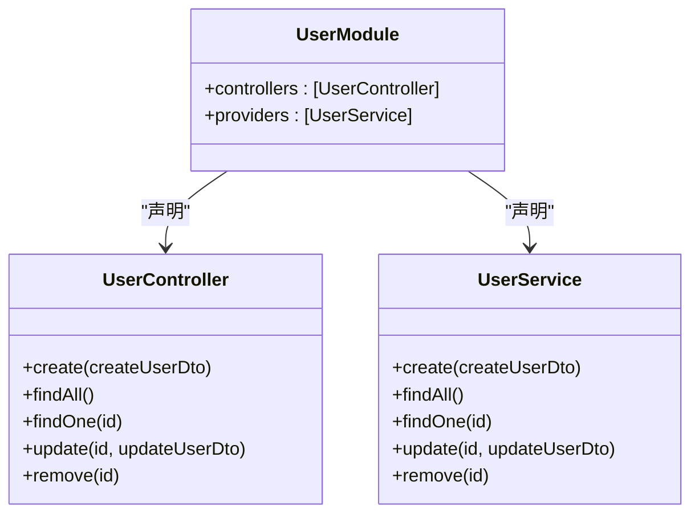
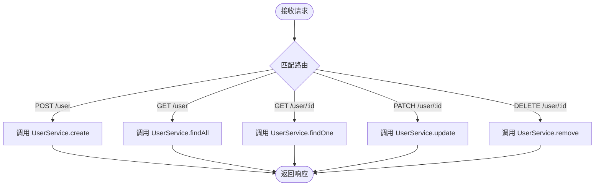
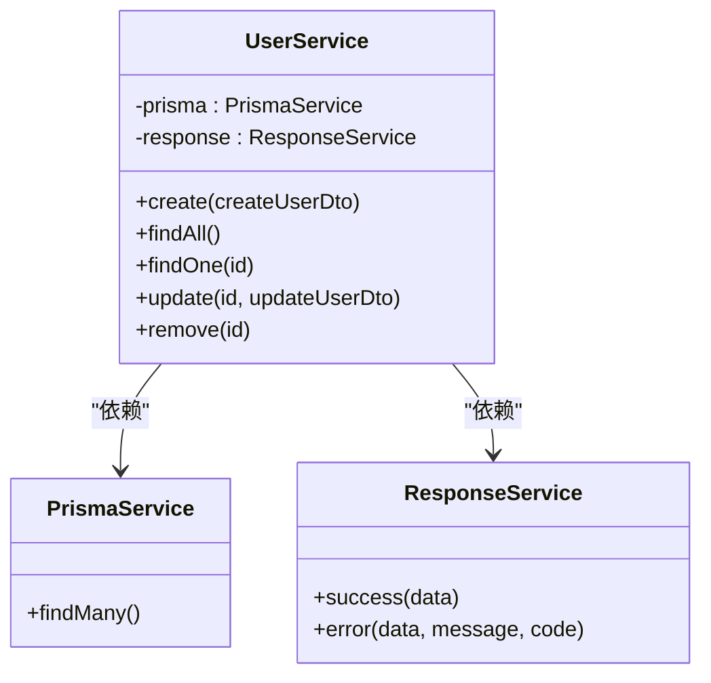
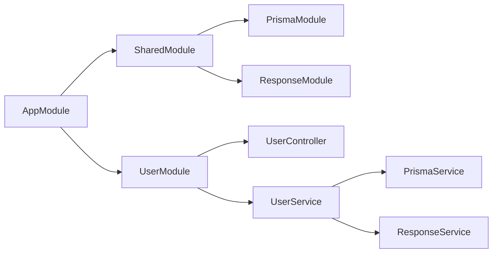
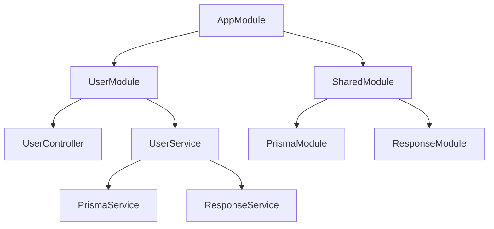

# 用户模块

<cite>
**本文档引用的文件**
- [server/apps/server/src/user/user.module.ts](file://server/apps/server/src/user/user.module.ts)
- [server/apps/server/src/user/user.controller.ts](file://server/apps/server/src/user/user.controller.ts)
- [server/apps/server/src/user/user.service.ts](file://server/apps/server/src/user/user.service.ts)
- [server/apps/server/src/user/entities/user.entity.ts](file://server/apps/server/src/user/entities/user.entity.ts)
- [server/apps/server/src/user/dto/create-user.dto.ts](file://server/apps/server/src/user/dto/create-user.dto.ts)
- [server/apps/server/src/user/dto/update-user.dto.ts](file://server/apps/server/src/user/dto/update-user.dto.ts)
- [server/apps/server/src/app.module.ts](file://server/apps/server/src/app.module.ts)
- [server/libs/shared/src/shared.module.ts](file://server/libs/shared/src/shared.module.ts)
- [server/libs/shared/src/prisma/prisma.module.ts](file://server/libs/shared/src/prisma/prisma.module.ts)
- [server/libs/shared/src/prisma/prisma.service.ts](file://server/libs/shared/src/prisma/prisma.service.ts)
- [server/libs/shared/src/response/response.module.ts](file://server/libs/shared/src/response/response.module.ts)
- [server/libs/shared/src/response/response.service.ts](file://server/libs/shared/src/response/response.service.ts)
</cite>

## 目录
1. [简介](#简介)
2. [项目结构](#项目结构)
3. [核心组件](#核心组件)
4. [架构总览](#架构总览)
5. [详细组件分析](#详细组件分析)
6. [依赖关系分析](#依赖关系分析)
7. [性能考虑](#性能考虑)
8. [故障排除指南](#故障排除指南)
9. [结论](#结论)

## 简介
本文件为用户模块（UserModule）的架构文档，系统性阐述该模块的模块化设计原理、依赖注入配置、模块间依赖关系、控制器与服务的注册与管理机制、导入导出策略以及与其它模块的集成方式。同时提供最佳实践与扩展指南，并总结模块化架构对代码组织与维护性的优势。

## 项目结构
用户模块位于后端应用的 server/apps/server/src/user 目录下，采用按功能分层的目录组织方式：
- user.module.ts：模块定义，声明控制器与提供者
- user.controller.ts：HTTP 控制器，处理用户相关路由请求
- user.service.ts：业务服务，封装数据访问与业务逻辑
- dto/：数据传输对象，用于请求体与响应的数据结构定义
- entities/：实体类定义（当前为空占位）

此外，用户模块通过共享库模块（@libs/shared）复用通用能力：
- shared.module.ts：全局共享模块，统一导出 Prisma 与 Response 能力
- prisma/prisma.module.ts 与 prisma.service.ts：数据库访问层
- response/response.module.ts 与 response.service.ts：统一响应格式化

图表来源
- [server/apps/server/src/app.module.ts:7-11](file://server/apps/server/src/app.module.ts#L7-L11)
- [server/apps/server/src/user/user.module.ts:5-8](file://server/apps/server/src/user/user.module.ts#L5-L8)
- [server/libs/shared/src/shared.module.ts:6-12](file://server/libs/shared/src/shared.module.ts#L6-L12)

章节来源
- [server/apps/server/src/app.module.ts:1-13](file://server/apps/server/src/app.module.ts#L1-L13)
- [server/apps/server/src/user/user.module.ts:1-10](file://server/apps/server/src/user/user.module.ts#L1-L10)
- [server/libs/shared/src/shared.module.ts:1-13](file://server/libs/shared/src/shared.module.ts#L1-L13)

## 核心组件
- 模块定义：UserModule 仅声明控制器与服务，遵循“单一职责”原则，便于测试与维护。
- 控制器：UserController 提供 /user 的完整 CRUD 路由，委托给 UserService 执行业务逻辑。
- 服务：UserService 注入 PrismaService 与 ResponseService，负责数据访问与统一响应包装。
- DTO：CreateUserDto 与 UpdateUserDto 定义请求参数结构；UpdateUserDto 基于 PartialType 继承 CreateUserDto。
- 实体：User 实体类目前为空，可在未来扩展为完整的领域模型。

章节来源
- [server/apps/server/src/user/user.module.ts:5-8](file://server/apps/server/src/user/user.module.ts#L5-L8)
- [server/apps/server/src/user/user.controller.ts:6-34](file://server/apps/server/src/user/user.controller.ts#L6-L34)
- [server/apps/server/src/user/user.service.ts:7-33](file://server/apps/server/src/user/user.service.ts#L7-L33)
- [server/apps/server/src/user/dto/create-user.dto.ts:1-2](file://server/apps/server/src/user/dto/create-user.dto.ts#L1-L2)
- [server/apps/server/src/user/dto/update-user.dto.ts:1-5](file://server/apps/server/src/user/dto/update-user.dto.ts#L1-L5)
- [server/apps/server/src/user/entities/user.entity.ts:1-2](file://server/apps/server/src/user/entities/user.entity.ts#L1-L2)

## 架构总览
用户模块采用 NestJS 的模块化架构，结合共享库模块实现跨模块复用。整体流程如下：
- 应用入口 AppModule 导入 UserModule 与 SharedModule
- UserModule 声明 UserController 与 UserService
- UserService 通过依赖注入获取 PrismaService 与 ResponseService
- 共享模块 SharedModule 将 PrismaModule 与 ResponseModule 导出，供其他模块使用

图表来源
- [server/apps/server/src/user/user.controller.ts:10-13](file://server/apps/server/src/user/user.controller.ts#L10-L13)
- [server/apps/server/src/user/user.service.ts:13-20](file://server/apps/server/src/user/user.service.ts#L13-L20)
- [server/libs/shared/src/response/response.service.ts:14-20](file://server/libs/shared/src/response/response.service.ts#L14-L20)

## 详细组件分析

### UserModule 模块
- 角色定位：用户功能域的边界模块，集中管理控制器与服务。
- 注册机制：通过 @Module 装饰器声明 controllers 与 providers 数组，Nest 容器自动完成依赖注入。
- 导入导出：当前未显式导入其他模块，但通过 AppModule 导入 SharedModule，间接获得共享能力。

图表来源
- [server/apps/server/src/user/user.module.ts:5-8](file://server/apps/server/src/user/user.module.ts#L5-L8)
- [server/apps/server/src/user/user.controller.ts:7-34](file://server/apps/server/src/user/user.controller.ts#L7-L34)
- [server/apps/server/src/user/user.service.ts:8-33](file://server/apps/server/src/user/user.service.ts#L8-L33)

章节来源
- [server/apps/server/src/user/user.module.ts:1-10](file://server/apps/server/src/user/user.module.ts#L1-L10)

### UserController 控制器
- 路由前缀：@Controller('user')，所有路由以 /user 开头
- 方法映射：
  - POST /user：创建用户
  - GET /user：查询全部用户
  - GET /user/:id：按 ID 查询单个用户
  - PATCH /user/:id：更新用户
  - DELETE /user/:id：删除用户
- 依赖注入：构造函数注入 UserService，实现控制层与业务层解耦

图表来源
- [server/apps/server/src/user/user.controller.ts:6-34](file://server/apps/server/src/user/user.controller.ts#L6-L34)

章节来源
- [server/apps/server/src/user/user.controller.ts:1-35](file://server/apps/server/src/user/user.controller.ts#L1-L35)

### UserService 服务
- 依赖注入：同时注入 PrismaService 与 ResponseService
- 数据访问：通过 PrismaService 访问数据库（示例中使用 findMany）
- 响应封装：通过 ResponseService 对业务结果进行统一格式化
- 可扩展性：当前方法返回字符串占位符，实际应替换为数据库操作与业务逻辑

图表来源
- [server/apps/server/src/user/user.service.ts:9-12](file://server/apps/server/src/user/user.service.ts#L9-L12)
- [server/libs/shared/src/prisma/prisma.service.ts:7-17](file://server/libs/shared/src/prisma/prisma.service.ts#L7-L17)
- [server/libs/shared/src/response/response.service.ts:14-28](file://server/libs/shared/src/response/response.service.ts#L14-L28)

章节来源
- [server/apps/server/src/user/user.service.ts:1-34](file://server/apps/server/src/user/user.service.ts#L1-L34)

### DTO 与实体
- CreateUserDto：定义创建用户的请求体结构
- UpdateUserDto：基于 PartialType 继承 CreateUserDto，表示部分字段更新
- User 实体：当前为空，建议后续补充字段与验证规则

章节来源
- [server/apps/server/src/user/dto/create-user.dto.ts:1-2](file://server/apps/server/src/user/dto/create-user.dto.ts#L1-L2)
- [server/apps/server/src/user/dto/update-user.dto.ts:1-5](file://server/apps/server/src/user/dto/update-user.dto.ts#L1-L5)
- [server/apps/server/src/user/entities/user.entity.ts:1-2](file://server/apps/server/src/user/entities/user.entity.ts#L1-L2)

### 共享模块与集成
- SharedModule：全局模块，导出 PrismaModule 与 ResponseModule，供 AppModule 导入后在全局可用
- PrismaModule：导出 PrismaService，作为数据库访问的唯一入口
- ResponseModule：导出 ResponseService，统一业务响应格式

图表来源
- [server/apps/server/src/app.module.ts:7-11](file://server/apps/server/src/app.module.ts#L7-L11)
- [server/libs/shared/src/shared.module.ts:6-12](file://server/libs/shared/src/shared.module.ts#L6-L12)
- [server/libs/shared/src/prisma/prisma.module.ts:4-7](file://server/libs/shared/src/prisma/prisma.module.ts#L4-L7)
- [server/libs/shared/src/response/response.module.ts:4-7](file://server/libs/shared/src/response/response.module.ts#L4-L7)

章节来源
- [server/libs/shared/src/shared.module.ts:1-13](file://server/libs/shared/src/shared.module.ts#L1-L13)
- [server/libs/shared/src/prisma/prisma.module.ts:1-9](file://server/libs/shared/src/prisma/prisma.module.ts#L1-L9)
- [server/libs/shared/src/response/response.module.ts:1-9](file://server/libs/shared/src/response/response.module.ts#L1-L9)

## 依赖关系分析
- 模块耦合度：UserModule 与 SharedModule 之间为弱耦合，通过导出导入实现能力复用
- 控制器与服务：UserController 仅依赖 UserService 接口，降低耦合，提升可测试性
- 服务与基础设施：UserService 依赖 PrismaService 与 ResponseService，形成清晰的分层
- 循环依赖：当前结构无循环依赖风险，符合 NestJS 最佳实践

图表来源
- [server/apps/server/src/app.module.ts:7-11](file://server/apps/server/src/app.module.ts#L7-L11)
- [server/apps/server/src/user/user.module.ts:5-8](file://server/apps/server/src/user/user.module.ts#L5-L8)
- [server/libs/shared/src/shared.module.ts:6-12](file://server/libs/shared/src/shared.module.ts#L6-L12)

章节来源
- [server/apps/server/src/app.module.ts:1-13](file://server/apps/server/src/app.module.ts#L1-L13)
- [server/apps/server/src/user/user.module.ts:1-10](file://server/apps/server/src/user/user.module.ts#L1-L10)
- [server/libs/shared/src/shared.module.ts:1-13](file://server/libs/shared/src/shared.module.ts#L1-L13)

## 性能考虑
- 数据访问优化：建议在 UserService 中对数据库查询添加分页、索引与缓存策略
- 响应格式化：统一使用 ResponseService，减少重复封装逻辑
- 依赖注入：避免在服务中直接实例化外部依赖，保持容器管理的一致性
- 并发与事务：数据库操作建议使用事务包裹关键流程，确保一致性

## 故障排除指南
- 数据库连接失败：检查环境变量 DATABASE_URL 是否正确，确认 PrismaService 初始化成功
- 响应格式异常：确认 ResponseService 的 success/error 方法被正确调用
- 控制器路由不生效：核对 @Controller('user') 与路由装饰器是否匹配
- 模块导入错误：确保 AppModule 正确导入 UserModule 与 SharedModule

章节来源
- [server/libs/shared/src/prisma/prisma.service.ts:8-15](file://server/libs/shared/src/prisma/prisma.service.ts#L8-L15)
- [server/libs/shared/src/response/response.service.ts:14-28](file://server/libs/shared/src/response/response.service.ts#L14-L28)
- [server/apps/server/src/user/user.controller.ts:6](file://server/apps/server/src/user/user.controller.ts#L6)
- [server/apps/server/src/app.module.ts:7-11](file://server/apps/server/src/app.module.ts#L7-L11)

## 结论
用户模块通过清晰的模块化设计与依赖注入机制，实现了控制层、服务层与基础设施层的职责分离。配合共享模块的导入导出策略，有效提升了代码复用性与可维护性。建议在后续迭代中完善实体定义、业务逻辑与数据访问层，并持续遵循模块化最佳实践以增强系统的扩展性与稳定性。