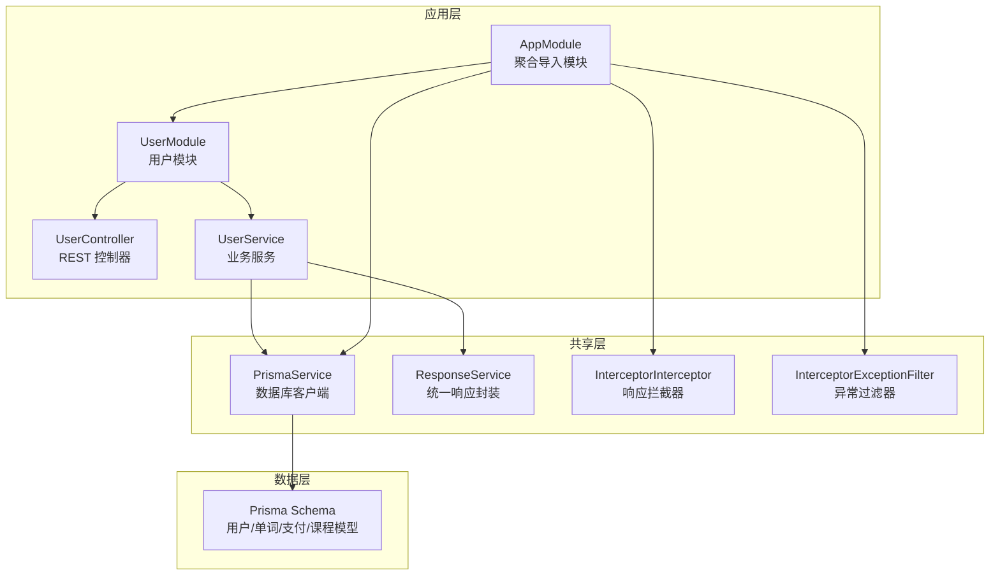
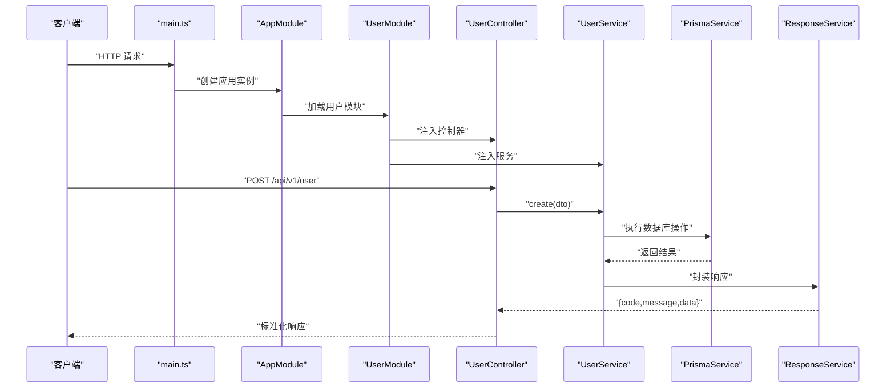
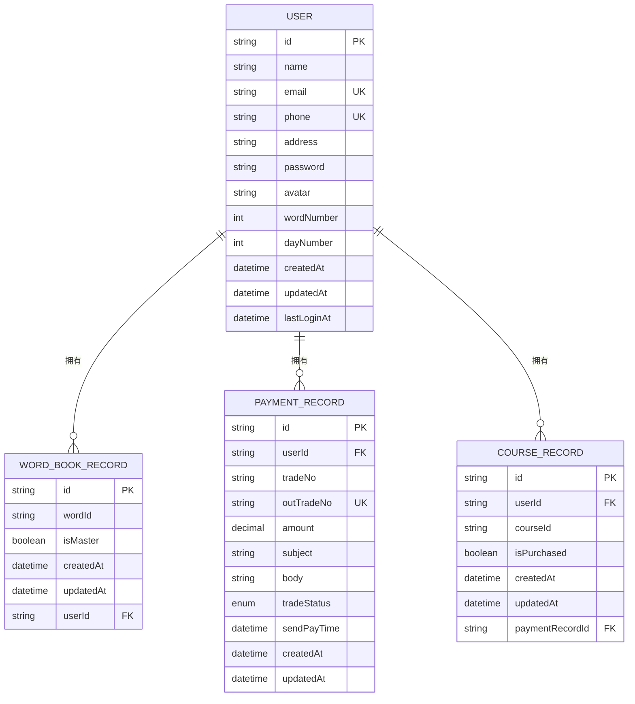
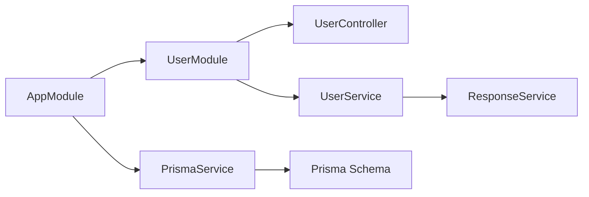

# 用户管理系统

<cite>
**本文引用的文件**
- [server\apps\server\src\user\user.module.ts](file://server/apps/server/src/user/user.module.ts)
- [server\apps\server\src\user\user.service.ts](file://server/apps/server/src/user/user.service.ts)
- [server\apps\server\src\user\user.controller.ts](file://server/apps/server/src/user/user.controller.ts)
- [server\apps\server\src\user\dto\create-user.dto.ts](file://server/apps/server/src/user/dto/create-user.dto.ts)
- [server\apps\server\src\user\dto\update-user.dto.ts](file://server/apps/server/src/user/dto/update-user.dto.ts)
- [server\apps\server\src\user\entities\user.entity.ts](file://server/apps/server/src/user/entities/user.entity.ts)
- [server\apps\server\src\app.module.ts](file://server/apps/server/src/app.module.ts)
- [server\apps\server\src\main.ts](file://server/apps/server/src/main.ts)
- [server\libs\shared\src\prisma\prisma.service.ts](file://server/libs/shared/src/prisma/prisma.service.ts)
- [server\libs\shared\src\response\response.service.ts](file://server/libs/shared/src/response/response.service.ts)
- [server\libs\shared\src\interceptor\interceptor.ts](file://server/libs/shared/src/interceptor/interceptor.ts)
- [server\libs\shared\src\interceptor\exceptionFilter.ts](file://server/libs/shared/src/interceptor/exceptionFilter.ts)
- [server\prisma\schema.prisma](file://server/prisma/schema.prisma)
- [packages\config\index.ts](file://packages/config/index.ts)
</cite>

## 目录
1. [简介](#简介)
2. [项目结构](#项目结构)
3. [核心组件](#核心组件)
4. [架构总览](#架构总览)
5. [详细组件分析](#详细组件分析)
6. [依赖分析](#依赖分析)
7. [性能考虑](#性能考虑)
8. [故障排查指南](#故障排查指南)
9. [结论](#结论)
10. [附录](#附录)

## 简介
本技术文档围绕用户管理系统展开，覆盖用户注册、登录、信息管理等核心功能的实现思路与扩展建议。系统采用 NestJS 微内核架构，结合 Prisma ORM 进行数据持久化，统一通过拦截器与异常过滤器规范接口响应格式。本文重点解析以下方面：
- UserModule 的模块化设计与职责边界
- UserRepository（由 PrismaService 间接承担）的数据访问模式
- UserService 的业务逻辑与扩展点
- DTO 对象的设计原则与输入输出格式
- 用户实体模型的字段定义、关系映射与约束条件
- 权限控制、会话管理与安全策略的实现建议
- 功能扩展指南与最佳实践

## 项目结构
后端采用多包工作区布局，核心应用位于 server/apps/server，共享库位于 server/libs/shared，配置位于 packages/config。用户模块位于 server/apps/server/src/user，包含控制器、服务、DTO、实体与模块文件；数据库模型定义于 server/prisma/schema.prisma。

图表来源
- [server\apps\server\src\app.module.ts:1-13](file://server/apps/server/src/app.module.ts#L1-L13)
- [server\apps\server\src\user\user.module.ts:1-10](file://server/apps/server/src/user/user.module.ts#L1-L10)
- [server\apps\server\src\user\user.controller.ts:1-35](file://server/apps/server/src/user/user.controller.ts#L1-L35)
- [server\apps\server\src\user\user.service.ts:1-34](file://server/apps/server/src/user/user.service.ts#L1-L34)
- [server\libs\shared\src\prisma\prisma.service.ts:1-18](file://server/libs/shared/src/prisma/prisma.service.ts#L1-L18)
- [server\libs\shared\src\response\response.service.ts:1-29](file://server/libs/shared/src/response/response.service.ts#L1-L29)
- [server\libs\shared\src\interceptor\interceptor.ts:1-86](file://server/libs/shared/src/interceptor/interceptor.ts#L1-L86)
- [server\libs\shared\src\interceptor\exceptionFilter.ts:1-23](file://server/libs/shared/src/interceptor/exceptionFilter.ts#L1-L23)
- [server\prisma\schema.prisma:1-133](file://server/prisma/schema.prisma#L1-L133)

章节来源
- [server\apps\server\src\app.module.ts:1-13](file://server/apps/server/src/app.module.ts#L1-L13)
- [server\apps\server\src\user\user.module.ts:1-10](file://server/apps/server/src/user/user.module.ts#L1-L10)
- [server\apps\server\src\main.ts:1-20](file://server/apps/server/src/main.ts#L1-L20)

## 核心组件
- UserModule：声明控制器与服务，作为用户域的装配中心，负责依赖注入与生命周期管理。
- UserController：暴露 REST 接口，接收请求参数并委派给 UserService。
- UserService：承载业务逻辑，协调 PrismaService 进行数据访问，并通过 ResponseService 统一返回格式。
- DTO：CreateUserDto 与 UpdateUserDto 定义输入结构，支持部分更新的继承模式。
- 实体：User 实体在当前阶段为空壳，实际字段与关系由 Prisma Schema 定义。
- 共享服务：PrismaService 提供数据库连接与查询能力；ResponseService 规范响应结构；拦截器与异常过滤器统一处理响应与错误。

章节来源
- [server\apps\server\src\user\user.module.ts:1-10](file://server/apps/server/src/user/user.module.ts#L1-L10)
- [server\apps\server\src\user\user.controller.ts:1-35](file://server/apps/server/src/user/user.controller.ts#L1-L35)
- [server\apps\server\src\user\user.service.ts:1-34](file://server/apps/server/src/user/user.service.ts#L1-L34)
- [server\apps\server\src\user\dto\create-user.dto.ts:1-2](file://server/apps/server/src/user/dto/create-user.dto.ts#L1-L2)
- [server\apps\server\src\user\dto\update-user.dto.ts:1-5](file://server/apps/server/src/user/dto/update-user.dto.ts#L1-L5)
- [server\apps\server\src\user\entities\user.entity.ts:1-2](file://server/apps/server/src/user/entities/user.entity.ts#L1-L2)
- [server\libs\shared\src\prisma\prisma.service.ts:1-18](file://server/libs/shared/src/prisma/prisma.service.ts#L1-L18)
- [server\libs\shared\src\response\response.service.ts:1-29](file://server/libs/shared/src/response/response.service.ts#L1-L29)
- [server\libs\shared\src\interceptor\interceptor.ts:1-86](file://server/libs/shared/src/interceptor/interceptor.ts#L1-L86)
- [server\libs\shared\src\interceptor\exceptionFilter.ts:1-23](file://server/libs/shared/src/interceptor/exceptionFilter.ts#L1-L23)

## 架构总览
系统启动流程如下：main.ts 初始化 Nest 应用，设置全局前缀、版本控制、拦截器与异常过滤器；AppModule 导入 UserModule 与 SharedModule；UserModule 注入 UserController 与 UserService；UserService 通过 PrismaService 访问数据库；ResponseService 统一封装响应；拦截器将任意返回值标准化为统一结构。

图表来源
- [server\apps\server\src\main.ts:1-20](file://server/apps/server/src/main.ts#L1-L20)
- [server\apps\server\src\app.module.ts:1-13](file://server/apps/server/src/app.module.ts#L1-L13)
- [server\apps\server\src\user\user.module.ts:1-10](file://server/apps/server/src/user/user.module.ts#L1-L10)
- [server\apps\server\src\user\user.controller.ts:1-35](file://server/apps/server/src/user/user.controller.ts#L1-L35)
- [server\apps\server\src\user\user.service.ts:1-34](file://server/apps/server/src/user/user.service.ts#L1-L34)
- [server\libs\shared\src\prisma\prisma.service.ts:1-18](file://server/libs/shared/src/prisma/prisma.service.ts#L1-L18)
- [server\libs\shared\src\response\response.service.ts:1-29](file://server/libs/shared/src/response/response.service.ts#L1-L29)

## 详细组件分析

### UserModule 模块化设计
- 职责：声明式装配控制器与服务，避免在根模块中堆积依赖，提升可维护性与可测试性。
- 依赖注入：通过 providers 与 controllers 字段集中管理，便于替换与扩展。
- 扩展建议：新增用户相关功能时，优先在 UserModule 内部组合新控制器与服务，保持领域内聚。

章节来源
- [server\apps\server\src\user\user.module.ts:1-10](file://server/apps/server/src/user/user.module.ts#L1-L10)

### UserController 接口设计
- 路由前缀：/user，版本化为 /api/v1/user。
- 方法映射：
  - POST /user：创建用户
  - GET /user：查询所有用户
  - GET /user/:id：按 ID 查询
  - PATCH /user/:id：按 ID 更新
  - DELETE /user/:id：按 ID 删除
- 参数绑定：DTO 类型校验由框架自动完成；路径参数与查询参数需在服务层进行显式转换与校验。

章节来源
- [server\apps\server\src\user\user.controller.ts:1-35](file://server/apps/server/src/user/user.controller.ts#L1-L35)
- [server\apps\server\src\main.ts:12-16](file://server/apps/server/src/main.ts#L12-L16)

### UserService 业务逻辑
- 当前实现：方法占位，仅返回占位字符串；实际业务逻辑尚未实现。
- 数据访问：通过 PrismaService 访问数据库；findAll 已演示如何返回统一响应格式。
- 建议实现要点：
  - 输入校验：在服务层对 DTO 进行必要校验（如邮箱唯一性、手机号唯一性、密码强度等）。
  - 业务规则：注册时生成默认字段（如单词数量、打卡天数），登录时更新最后登录时间。
  - 安全措施：密码加密存储、敏感字段脱敏返回。
  - 错误处理：捕获数据库异常并映射为统一错误响应。
  - 性能优化：合理使用索引与分页，避免 N+1 查询。

章节来源
- [server\apps\server\src\user\user.service.ts:1-34](file://server/apps/server/src/user/user.service.ts#L1-L34)
- [server\libs\shared\src\response\response.service.ts:1-29](file://server/libs/shared/src/response/response.service.ts#L1-L29)
- [server\libs\shared\src\prisma\prisma.service.ts:1-18](file://server/libs/shared/src/prisma/prisma.service.ts#L1-L18)

### DTO 设计原则与输入输出格式
- CreateUserDto：定义注册所需字段集合，当前为空，后续应补充必填字段与校验规则。
- UpdateUserDto：基于 PartialType(CreateUserDto)，支持部分字段更新。
- 输入校验建议：
  - 使用装饰器进行基础校验（长度、格式、唯一性等）。
  - 在服务层进行跨字段校验（如确认密码与新密码一致性）。
- 输出格式：统一由 ResponseService 返回 { code, message, data } 结构，拦截器再包装为 { timestamp, path, code, message, success, data }。

章节来源
- [server\apps\server\src\user\dto\create-user.dto.ts:1-2](file://server/apps/server/src/user/dto/create-user.dto.ts#L1-L2)
- [server\apps\server\src\user\dto\update-user.dto.ts:1-5](file://server/apps/server/src/user/dto/update-user.dto.ts#L1-L5)
- [server\libs\shared\src\response\response.service.ts:1-29](file://server/libs/shared/src/response/response.service.ts#L1-L29)
- [server\libs\shared\src\interceptor\interceptor.ts:1-86](file://server/libs/shared/src/interceptor/interceptor.ts#L1-L86)

### 用户实体模型与关系映射
- 用户表（User）字段概览（摘自 Prisma Schema）：
  - id：主键，字符串类型，自动生成
  - name：用户名
  - email：邮箱，唯一约束
  - phone：手机号，唯一约束
  - address：地址
  - password：密码
  - avatar：头像
  - wordNumber：单词数量，默认 0
  - dayNumber：打卡天数，默认 0
  - createdAt/updatedAt：创建与更新时间
  - lastLoginAt：最后登录时间
  - 关系：与 WordBookRecord、PaymentRecord、CourseRecord 建立一对多关系
- 关系映射：
  - User 与 WordBookRecord：一对多（外键 userId）
  - User 与 PaymentRecord：一对多（外键 userId）
  - User 与 CourseRecord：一对多（外键 userId）

图表来源
- [server\prisma\schema.prisma:25-41](file://server/prisma/schema.prisma#L25-L41)
- [server\prisma\schema.prisma:44-55](file://server/prisma/schema.prisma#L44-L55)
- [server\prisma\schema.prisma:89-104](file://server/prisma/schema.prisma#L89-L104)
- [server\prisma\schema.prisma:106-119](file://server/prisma/schema.prisma#L106-L119)

章节来源
- [server\prisma\schema.prisma:25-41](file://server/prisma/schema.prisma#L25-L41)
- [server\prisma\schema.prisma:44-55](file://server/prisma/schema.prisma#L44-L55)
- [server\prisma\schema.prisma:89-104](file://server/prisma/schema.prisma#L89-L104)
- [server\prisma\schema.prisma:106-119](file://server/prisma/schema.prisma#L106-L119)

### 权限控制、会话管理与安全策略
- 当前实现：未见鉴权与会话管理相关代码，建议在拦截器或网关层引入 JWT 或 Session 策略。
- 建议方案：
  - 登录接口：校验凭据后签发令牌（含过期时间），并缓存会话信息。
  - 中间件：拦截受保护路由，校验令牌有效性与权限范围。
  - 密码安全：注册/修改密码时进行哈希存储，禁止明文落库。
  - 数据脱敏：返回响应时移除敏感字段（如密码、手机号等）。
  - 速率限制：对登录与注册接口增加频率限制，防范暴力破解。
  - 日志审计：记录关键操作日志，便于追踪与审计。

章节来源
- [server\libs\shared\src\interceptor\interceptor.ts:1-86](file://server/libs/shared/src/interceptor/interceptor.ts#L1-L86)
- [server\libs\shared\src\interceptor\exceptionFilter.ts:1-23](file://server/libs/shared/src/interceptor/exceptionFilter.ts#L1-L23)

### 扩展指南与最佳实践
- 新增用户功能步骤：
  1) 在 DTO 中定义字段与校验规则
  2) 在 Controller 中添加路由与参数绑定
  3) 在 Service 中实现业务逻辑与数据访问
  4) 在 Module 中注册控制器与服务
- 性能优化：
  - 为高频查询字段建立索引（如 email、phone）
  - 使用分页查询与懒加载关联数据
  - 缓存热点数据（如用户基本信息）
- 可靠性：
  - 使用事务保证跨表写入的一致性
  - 异常捕获与统一错误码映射
  - 单元测试与集成测试覆盖关键路径

## 依赖分析
- 模块耦合：AppModule 聚合导入 UserModule 与 SharedModule；UserModule 仅依赖 UserService 与 UserController，降低耦合度。
- 外部依赖：PrismaService 依赖 PostgreSQL；拦截器与异常过滤器依赖 Express 上下文。
- 循环依赖：当前文件未发现循环依赖迹象。

图表来源
- [server\apps\server\src\app.module.ts:1-13](file://server/apps/server/src/app.module.ts#L1-L13)
- [server\apps\server\src\user\user.module.ts:1-10](file://server/apps/server/src/user/user.module.ts#L1-L10)
- [server\apps\server\src\user\user.controller.ts:1-35](file://server/apps/server/src/user/user.controller.ts#L1-L35)
- [server\apps\server\src\user\user.service.ts:1-34](file://server/apps/server/src/user/user.service.ts#L1-L34)
- [server\libs\shared\src\prisma\prisma.service.ts:1-18](file://server/libs/shared/src/prisma/prisma.service.ts#L1-L18)
- [server\prisma\schema.prisma:1-133](file://server/prisma/schema.prisma#L1-L133)

章节来源
- [server\apps\server\src\app.module.ts:1-13](file://server/apps/server/src/app.module.ts#L1-L13)
- [server\apps\server\src\user\user.module.ts:1-10](file://server/apps/server/src/user/user.module.ts#L1-L10)

## 性能考虑
- 数据库层面：
  - 为 email、phone 建立唯一索引，确保查询与去重效率
  - 对高频查询字段（如 lastLoginAt、createdAt）建立索引
  - 使用分页查询避免一次性返回大量数据
- 应用层面：
  - 使用拦截器统一序列化，避免重复处理
  - 对 BigInt 类型进行字符串化，防止前端精度丢失
  - 合理使用缓存与只读副本，减轻主库压力

## 故障排查指南
- 常见问题与定位：
  - 数据库连接失败：检查 DATABASE_URL 环境变量与网络连通性
  - DTO 校验失败：查看拦截器是否正确捕获并返回错误信息
  - 统一响应异常：确认 ResponseService 与拦截器是否正确初始化
- 排查步骤：
  - 查看启动日志与版本前缀设置
  - 使用最小化 DTO 示例验证接口可用性
  - 检查 Prisma 客户端生成目录与权限

章节来源
- [server\apps\server\src\main.ts:8-18](file://server/apps/server/src/main.ts#L8-L18)
- [server\libs\shared\src\interceptor\exceptionFilter.ts:1-23](file://server/libs/shared/src/interceptor/exceptionFilter.ts#L1-L23)
- [server\libs\shared\src\interceptor\interceptor.ts:64-84](file://server/libs/shared/src/interceptor/interceptor.ts#L64-L84)
- [server\libs\shared\src\response\response.service.ts:1-29](file://server/libs/shared/src/response/response.service.ts#L1-L29)
- [server\libs\shared\src\prisma\prisma.service.ts:1-18](file://server/libs/shared/src/prisma/prisma.service.ts#L1-L18)

## 结论
当前用户管理模块已完成基础骨架搭建，具备良好的扩展性与可维护性。建议尽快补齐 UserService 的业务逻辑、完善 DTO 校验与安全策略，并在 Prisma Schema 基础上逐步实现用户注册、登录与信息管理的核心功能。通过统一的拦截器与响应封装，系统能够提供一致且易用的接口体验。

## 附录
- 端口配置：服务端口由 packages/config/index.ts 提供，可在部署时调整。
- 版本控制：启用 URI 版本控制（/api/v1），便于未来演进与向后兼容。

章节来源
- [packages\config\index.ts:1-8](file://packages/config/index.ts#L1-L8)
- [server\apps\server\src\main.ts:12-16](file://server/apps/server/src/main.ts#L12-L16)