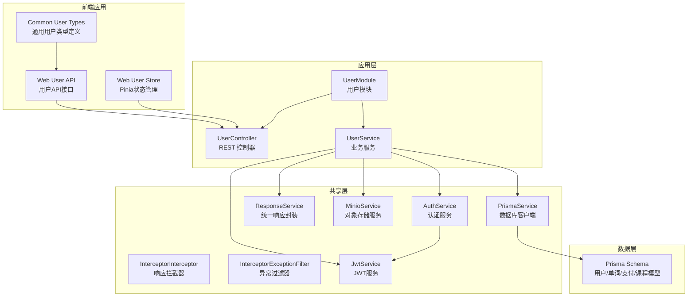
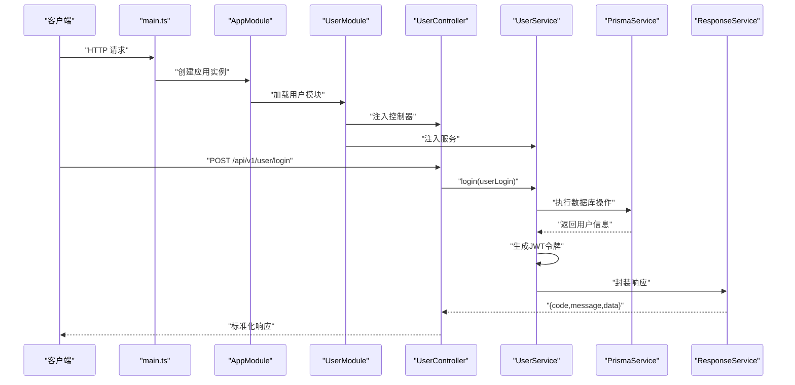
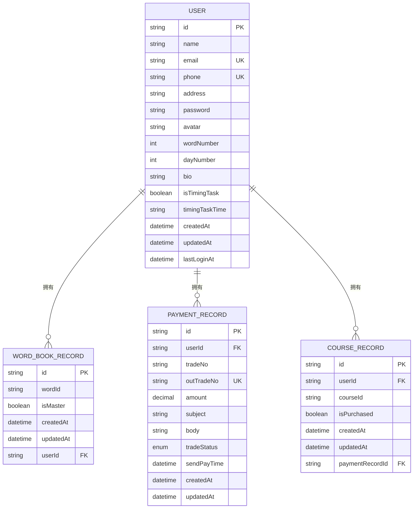
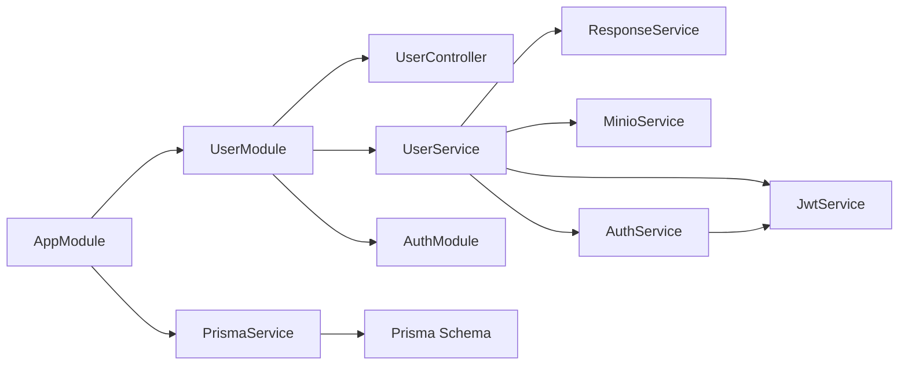

# 用户管理系统

<cite>
**本文档引用的文件**
- [packages/common/user/index.ts](file://packages/common/user/index.ts)
- [apps/web/src/apis/user/index.ts](file://apps/web/src/apis/user/index.ts)
- [apps/web/src/stores/user.ts](file://apps/web/src/stores/user.ts)
- [server/apps/server/src/user/user.module.ts](file://server/apps/server/src/user/user.module.ts)
- [server/apps/server/src/user/user.controller.ts](file://server/apps/server/src/user/user.controller.ts)
- [server/apps/server/src/user/user.service.ts](file://server/apps/server/src/user/user.service.ts)
- [server/apps/server/src/user/user.select.ts](file://server/apps/server/src/user/user.select.ts)
- [server/apps/server/src/user/dto/create-user.dto.ts](file://server/apps/server/src/user/dto/create-user.dto.ts)
- [server/apps/server/src/user/dto/update-user.dto.ts](file://server/apps/server/src/user/dto/update-user.dto.ts)
- [server/apps/server/src/app.module.ts](file://server/apps/server/src/app.module.ts)
- [server/apps/server/src/main.ts](file://server/apps/server/src/main.ts)
- [server/libs/shared/src/prisma/prisma.service.ts](file://server/libs/shared/src/prisma/prisma.service.ts)
- [server/libs/shared/src/response/response.service.ts](file://server/libs/shared/src/response/response.service.ts)
- [server/libs/shared/src/interceptor/interceptor.ts](file://server/libs/shared/src/interceptor/interceptor.ts)
- [server/libs/shared/src/interceptor/exceptionFilter.ts](file://server/libs/shared/src/interceptor/exceptionFilter.ts)
- [server/prisma/schema.prisma](file://server/prisma/schema.prisma)
- [packages/config/index.ts](file://packages/config/index.ts)
</cite>

## 目录
1. [简介](#简介)
2. [项目结构](#项目结构)
3. [核心组件](#核心组件)
4. [架构总览](#架构总览)
5. [详细组件分析](#详细组件分析)
6. [依赖分析](#依赖分析)
7. [性能考虑](#性能考虑)
8. [故障排查指南](#故障排查指南)
9. [结论](#结论)
10. [附录](#附录)

## 简介
本技术文档围绕用户管理系统展开，现已实现完整的用户注册、登录、信息管理、认证令牌处理、头像上传及定时任务管理等核心功能。系统采用 NestJS 微内核架构，结合 Prisma ORM 进行数据持久化，统一通过拦截器与异常过滤器规范接口响应格式。本文重点解析以下方面：
- UserModule 的模块化设计与职责边界
- UserRepository（由 PrismaService 间接承担）的数据访问模式
- UserService 的业务逻辑与扩展点
- DTO 对象的设计原则与输入输出格式
- 用户实体模型的字段定义、关系映射与约束条件
- 权限控制、会话管理与安全策略的实现细节
- 认证令牌处理、头像上传与定时任务管理的高级功能
- 功能扩展指南与最佳实践

## 项目结构
后端采用多包工作区布局，核心应用位于 server/apps/server，共享库位于 server/libs/shared，配置位于 packages/config。用户模块位于 server/apps/server/src/user，包含控制器、服务、DTO、实体与模块文件；前端位于 apps/web，包含用户API和Pinia状态管理；数据库模型定义于 server/prisma/schema.prisma。

**图表来源**
- [packages/common/user/index.ts:1-58](file://packages/common/user/index.ts#L1-L58)
- [apps/web/src/apis/user/index.ts:1-27](file://apps/web/src/apis/user/index.ts#L1-L27)
- [apps/web/src/stores/user.ts:1-69](file://apps/web/src/stores/user.ts#L1-L69)
- [server/apps/server/src/user/user.module.ts:1-11](file://server/apps/server/src/user/user.module.ts#L1-L11)
- [server/apps/server/src/user/user.controller.ts:1-58](file://server/apps/server/src/user/user.controller.ts#L1-L58)
- [server/apps/server/src/user/user.service.ts:1-176](file://server/apps/server/src/user/user.service.ts#L1-L176)
- [server/libs/shared/src/prisma/prisma.service.ts:1-18](file://server/libs/shared/src/prisma/prisma.service.ts#L1-L18)
- [server/libs/shared/src/response/response.service.ts:1-29](file://server/libs/shared/src/response/response.service.ts#L1-L29)
- [server/libs/shared/src/interceptor/interceptor.ts:1-86](file://server/libs/shared/src/interceptor/interceptor.ts#L1-L86)
- [server/libs/shared/src/interceptor/exceptionFilter.ts:1-23](file://server/libs/shared/src/interceptor/exceptionFilter.ts#L1-L23)
- [server/prisma/schema.prisma:1-133](file://server/prisma/schema.prisma#L1-L133)

**章节来源**
- [packages/common/user/index.ts:1-58](file://packages/common/user/index.ts#L1-L58)
- [apps/web/src/apis/user/index.ts:1-27](file://apps/web/src/apis/user/index.ts#L1-L27)
- [apps/web/src/stores/user.ts:1-69](file://apps/web/src/stores/user.ts#L1-L69)
- [server/apps/server/src/app.module.ts:1-13](file://server/apps/server/src/app.module.ts#L1-L13)
- [server/apps/server/src/user/user.module.ts:1-11](file://server/apps/server/src/user/user.module.ts#L1-L11)
- [server/apps/server/src/main.ts:1-20](file://server/apps/server/src/main.ts#L1-L20)

## 核心组件
- **UserModule**：声明控制器与服务，作为用户域的装配中心，负责依赖注入与生命周期管理。
- **UserController**：暴露 REST 接口，接收请求参数并委派给 UserService，支持登录、注册、令牌刷新、头像上传和用户信息更新。
- **UserService**：承载业务逻辑，协调 PrismaService 进行数据访问，通过 ResponseService 统一返回格式，实现认证令牌生成、头像上传和定时任务管理。
- **DTO**：CreateUserDto 与 UpdateUserDto 定义输入结构，支持部分更新的继承模式。
- **实体**：User 实体在当前阶段为空壳，实际字段与关系由 Prisma Schema 定义。
- **通用类型定义**：packages/common/user/index.ts 提供完整的 TypeScript 类型定义，包括用户接口、认证令牌、头像结果等。
- **前端集成**：apps/web/src/apis/user/index.ts 提供前端调用接口，apps/web/src/stores/user.ts 提供 Pinia 状态管理。
- **共享服务**：PrismaService 提供数据库连接与查询能力；ResponseService 规范响应结构；拦截器与异常过滤器统一处理响应与错误。

**章节来源**
- [server/apps/server/src/user/user.module.ts:1-11](file://server/apps/server/src/user/user.module.ts#L1-L11)
- [server/apps/server/src/user/user.controller.ts:1-58](file://server/apps/server/src/user/user.controller.ts#L1-L58)
- [server/apps/server/src/user/user.service.ts:1-176](file://server/apps/server/src/user/user.service.ts#L1-L176)
- [packages/common/user/index.ts:1-58](file://packages/common/user/index.ts#L1-L58)
- [apps/web/src/apis/user/index.ts:1-27](file://apps/web/src/apis/user/index.ts#L1-L27)
- [apps/web/src/stores/user.ts:1-69](file://apps/web/src/stores/user.ts#L1-L69)
- [server/libs/shared/src/prisma/prisma.service.ts:1-18](file://server/libs/shared/src/prisma/prisma.service.ts#L1-L18)
- [server/libs/shared/src/response/response.service.ts:1-29](file://server/libs/shared/src/response/response.service.ts#L1-L29)
- [server/libs/shared/src/interceptor/interceptor.ts:1-86](file://server/libs/shared/src/interceptor/interceptor.ts#L1-L86)
- [server/libs/shared/src/interceptor/exceptionFilter.ts:1-23](file://server/libs/shared/src/interceptor/exceptionFilter.ts#L1-L23)

## 架构总览
系统启动流程如下：main.ts 初始化 Nest 应用，设置全局前缀、版本控制、拦截器与异常过滤器；AppModule 导入 UserModule 与 SharedModule；UserModule 注入 UserController 与 UserService；UserService 通过 PrismaService 访问数据库；ResponseService 统一封装响应；拦截器将任意返回值标准化为统一结构。

**图表来源**
- [server/apps/server/src/main.ts:1-20](file://server/apps/server/src/main.ts#L1-L20)
- [server/apps/server/src/app.module.ts:1-13](file://server/apps/server/src/app.module.ts#L1-L13)
- [server/apps/server/src/user/user.module.ts:1-11](file://server/apps/server/src/user/user.module.ts#L1-L11)
- [server/apps/server/src/user/user.controller.ts:1-58](file://server/apps/server/src/user/user.controller.ts#L1-L58)
- [server/apps/server/src/user/user.service.ts:1-176](file://server/apps/server/src/user/user.service.ts#L1-L176)
- [server/libs/shared/src/prisma/prisma.service.ts:1-18](file://server/libs/shared/src/prisma/prisma.service.ts#L1-L18)
- [server/libs/shared/src/response/response.service.ts:1-29](file://server/libs/shared/src/response/response.service.ts#L1-L29)

## 详细组件分析

### UserModule 模块化设计
- **职责**：声明式装配控制器与服务，避免在根模块中堆积依赖，提升可维护性与可测试性。
- **依赖注入**：通过 providers 与 controllers 字段集中管理，便于替换与扩展。
- **认证模块集成**：UserModule 导入 AuthModule，提供完整的认证服务支持。
- **扩展建议**：新增用户相关功能时，优先在 UserModule 内部组合新控制器与服务，保持领域内聚。

**章节来源**
- [server/apps/server/src/user/user.module.ts:1-11](file://server/apps/server/src/user/user.module.ts#L1-L11)

### UserController 接口设计
- **路由前缀**：/user，版本化为 /api/v1/user。
- **认证相关接口**：
  - POST /user/login：用户登录，返回包含令牌的用户信息
  - POST /user/register：用户注册，返回包含令牌的新用户信息
  - POST /user/refresh-token：刷新访问令牌
- **文件上传接口**：
  - POST /user/upload-avatar：上传头像文件，支持文件大小限制
- **用户信息管理接口**：
  - POST /user/update-user：更新用户信息，需要认证中间件保护
- **参数绑定**：使用 @en/common/user 类型定义进行强类型校验；路径参数与查询参数需在服务层进行显式转换与校验。

**章节来源**
- [server/apps/server/src/user/user.controller.ts:1-58](file://server/apps/server/src/user/user.controller.ts#L1-L58)
- [packages/common/user/index.ts:1-58](file://packages/common/user/index.ts#L1-L58)
- [server/apps/server/src/main.ts:12-16](file://server/apps/server/src/main.ts#L12-L16)

### UserService 业务逻辑
- **登录功能**：验证手机号和密码，更新最后登录时间，生成JWT访问令牌和刷新令牌。
- **注册功能**：检查手机号和邮箱唯一性，创建新用户，默认设置最后登录时间。
- **令牌刷新**：验证刷新令牌的有效性，重新生成新的访问令牌。
- **头像上传**：使用 MinIO 对象存储服务，支持文件大小限制和多种格式。
- **用户信息更新**：支持姓名、邮箱、头像、地址、签名、定时任务开关和时间等字段的更新。
- **数据访问**：通过 PrismaService 访问数据库；使用 userSelect 和 updateUserSelect 优化查询性能。
- **安全措施**：密码明文存储（生产环境建议使用哈希存储）、令牌验证、文件上传安全检查。
- **错误处理**：捕获数据库异常并映射为统一错误响应。

**章节来源**
- [server/apps/server/src/user/user.service.ts:1-176](file://server/apps/server/src/user/user.service.ts#L1-L176)
- [server/libs/shared/src/response/response.service.ts:1-29](file://server/libs/shared/src/response/response.service.ts#L1-L29)
- [server/libs/shared/src/prisma/prisma.service.ts:1-18](file://server/libs/shared/src/prisma/prisma.service.ts#L1-L18)

### DTO 设计原则与输入输出格式
- **CreateUserDto**：当前为空类，实际验证在服务层进行。
- **UpdateUserDto**：基于 PartialType(CreateUserDto)，支持部分字段更新。
- **通用类型定义**：packages/common/user/index.ts 提供完整的类型定义，包括：
  - User 接口：完整的用户字段定义
  - UserRegister：注册所需的字段集合
  - UserLogin：登录所需的字段集合
  - UserUpdate：更新用户信息的字段集合
  - Token：访问令牌和刷新令牌
  - WebResultUser：前端使用的用户结果类型，包含令牌信息
- **输入校验建议**：
  - 使用装饰器进行基础校验（长度、格式、唯一性等）。
  - 在服务层进行跨字段校验（如确认密码与新密码一致性）。
- **输出格式**：统一由 ResponseService 返回 { code, message, data } 结构，拦截器再包装为 { timestamp, path, code, message, success, data }。

**章节来源**
- [server/apps/server/src/user/dto/create-user.dto.ts:1-2](file://server/apps/server/src/user/dto/create-user.dto.ts#L1-L2)
- [server/apps/server/src/user/dto/update-user.dto.ts:1-5](file://server/apps/server/src/user/dto/update-user.dto.ts#L1-L5)
- [packages/common/user/index.ts:1-58](file://packages/common/user/index.ts#L1-L58)
- [server/libs/shared/src/response/response.service.ts:1-29](file://server/libs/shared/src/response/response.service.ts#L1-L29)
- [server/libs/shared/src/interceptor/interceptor.ts:1-86](file://server/libs/shared/src/interceptor/interceptor.ts#L1-L86)

### 用户实体模型与关系映射
- **用户表（User）字段概览**：
  - id：主键，字符串类型，自动生成
  - name：用户名
  - email：邮箱，唯一约束
  - phone：手机号，唯一约束
  - address：地址
  - password：密码
  - avatar：头像
  - wordNumber：单词数量，默认 0
  - dayNumber：打卡天数，默认 0
  - bio：个人签名（新增字段）
  - isTimingTask：是否开启定时任务（新增字段）
  - timingTaskTime：定时任务时间（新增字段）
  - createdAt/updatedAt：创建与更新时间
  - lastLoginAt：最后登录时间
  - 关系：与 WordBookRecord、PaymentRecord、CourseRecord 建立一对多关系
- **关系映射**：
  - User 与 WordBookRecord：一对多（外键 userId）
  - User 与 PaymentRecord：一对多（外键 userId）
  - User 与 CourseRecord：一对多（外键 userId）

**图表来源**
- [server/prisma/schema.prisma:25-41](file://server/prisma/schema.prisma#L25-L41)
- [server/prisma/schema.prisma:44-55](file://server/prisma/schema.prisma#L44-L55)
- [server/prisma/schema.prisma:89-104](file://server/prisma/schema.prisma#L89-L104)
- [server/prisma/schema.prisma:106-119](file://server/prisma/schema.prisma#L106-L119)

**章节来源**
- [server/prisma/schema.prisma:25-41](file://server/prisma/schema.prisma#L25-L41)
- [server/prisma/schema.prisma:44-55](file://server/prisma/schema.prisma#L44-L55)
- [server/prisma/schema.prisma:89-104](file://server/prisma/schema.prisma#L89-L104)
- [server/prisma/schema.prisma:106-119](file://server/prisma/schema.prisma#L106-L119)

### 权限控制、会话管理与安全策略
- **认证中间件**：UserController 中的 updateUser 接口使用 AuthGuard 进行认证保护。
- **令牌管理**：
  - 登录接口：生成访问令牌和刷新令牌
  - 令牌刷新：通过 refreshToken 接口刷新访问令牌
  - 令牌载荷：包含用户ID、姓名和邮箱信息
- **安全措施**：
  - 密码存储：当前为明文存储，建议在生产环境使用哈希算法
  - 文件上传：限制文件大小（5MB）和内容类型
  - 令牌验证：使用 JWT 服务验证令牌有效性
  - 数据脱敏：返回响应时移除敏感字段（如密码）
  - 速率限制：可扩展添加到认证相关接口
- **前端状态管理**：apps/web/src/stores/user.ts 提供完整的用户状态管理，包括令牌存储和更新。

**章节来源**
- [server/apps/server/src/user/user.controller.ts:51-56](file://server/apps/server/src/user/user.controller.ts#L51-L56)
- [server/apps/server/src/user/user.service.ts:29-58](file://server/apps/server/src/user/user.service.ts#L29-L58)
- [packages/common/user/index.ts:41-58](file://packages/common/user/index.ts#L41-L58)
- [apps/web/src/stores/user.ts:1-69](file://apps/web/src/stores/user.ts#L1-L69)

### 高级用户功能实现

#### 定时任务管理
- **字段定义**：isTimingTask（布尔值）和 timingTaskTime（字符串）用于控制定时任务的开启状态和执行时间。
- **功能实现**：UserService 的 updateUser 方法支持更新定时任务相关字段。
- **前端集成**：apps/web/src/stores/user.ts 提供定时任务状态的更新和获取。

#### 个人资料定制
- **字段扩展**：bio（个人签名）字段允许用户添加个性化的个人描述。
- **更新接口**：支持通过 updateUser 接口更新个人签名等资料信息。
- **查询优化**：user.select.ts 中包含 bio 字段的查询配置。

#### 认证令牌处理
- **令牌类型**：Token 接口定义 accessToken 和 refreshToken。
- **令牌载荷**：TokenPayload 和 RefreshTokenPayload 定义令牌中包含的用户信息。
- **生成策略**：AuthService.generateToken 方法生成JWT令牌。
- **刷新机制**：refreshToken 接口提供令牌刷新功能，防止访问令牌过期。

#### 头像上传与管理
- **文件处理**：使用 Multer 中间件处理文件上传，限制文件大小为5MB。
- **对象存储**：集成 MinIO 服务进行文件存储，支持HTTPS配置。
- **URL生成**：根据配置动态生成预览URL和数据库URL。
- **前端展示**：apps/web/src/apis/user/index.ts 提供头像上传API。

**章节来源**
- [server/apps/server/src/user/user.service.ts:129-157](file://server/apps/server/src/user/user.service.ts#L129-L157)
- [server/apps/server/src/user/user.service.ts:159-174](file://server/apps/server/src/user/user.service.ts#L159-L174)
- [packages/common/user/index.ts:1-58](file://packages/common/user/index.ts#L1-L58)
- [apps/web/src/stores/user.ts:25-47](file://apps/web/src/stores/user.ts#L25-L47)
- [apps/web/src/apis/user/index.ts:18-26](file://apps/web/src/apis/user/index.ts#L18-L26)

### 扩展指南与最佳实践
- **新增用户功能步骤**：
  1) 在 packages/common/user/index.ts 中定义新的类型和接口
  2) 在 DTO 中定义字段与校验规则
  3) 在 Controller 中添加路由与参数绑定
  4) 在 Service 中实现业务逻辑与数据访问
  5) 在 Module 中注册控制器与服务
- **性能优化**：
  - 为高频查询字段建立索引（如 email、phone）
  - 使用分页查询与懒加载关联数据
  - 缓存热点数据（如用户基本信息）
  - 优化查询选择字段，减少不必要的数据传输
- **安全性改进**：
  - 将密码存储改为哈希算法（bcrypt）
  - 添加更严格的文件上传验证
  - 实现令牌黑名单机制
  - 添加API限流和防暴力破解
- **可靠性**：
  - 使用事务保证跨表写入的一致性
  - 异常捕获与统一错误码映射
  - 单元测试与集成测试覆盖关键路径
  - 添加监控和日志记录

## 依赖分析
- **模块耦合**：AppModule 聚合导入 UserModule 与 SharedModule；UserModule 仅依赖 UserService 与 UserController，降低耦合度。
- **外部依赖**：
  - PrismaService 依赖 PostgreSQL
  - MinioService 依赖对象存储服务
  - JwtService 依赖 JSON Web Token
  - AuthService 提供认证服务
- **循环依赖**：当前文件未发现循环依赖迹象。

**图表来源**
- [server/apps/server/src/app.module.ts:1-13](file://server/apps/server/src/app.module.ts#L1-L13)
- [server/apps/server/src/user/user.module.ts:1-11](file://server/apps/server/src/user/user.module.ts#L1-L11)
- [server/apps/server/src/user/user.controller.ts:1-58](file://server/apps/server/src/user/user.controller.ts#L1-L58)
- [server/apps/server/src/user/user.service.ts:1-176](file://server/apps/server/src/user/user.service.ts#L1-L176)
- [server/libs/shared/src/prisma/prisma.service.ts:1-18](file://server/libs/shared/src/prisma/prisma.service.ts#L1-L18)
- [server/prisma/schema.prisma:1-133](file://server/prisma/schema.prisma#L1-L133)

**章节来源**
- [server/apps/server/src/app.module.ts:1-13](file://server/apps/server/src/app.module.ts#L1-L13)
- [server/apps/server/src/user/user.module.ts:1-11](file://server/apps/server/src/user/user.module.ts#L1-L11)

## 性能考虑
- **数据库层面**：
  - 为 email、phone 建立唯一索引，确保查询与去重效率
  - 对高频查询字段（如 lastLoginAt、createdAt）建立索引
  - 使用分页查询避免一次性返回大量数据
  - 优化查询选择字段，减少不必要的数据传输
- **应用层面**：
  - 使用拦截器统一序列化，避免重复处理
  - 对 BigInt 类型进行字符串化，防止前端精度丢失
  - 合理使用缓存与只读副本，减轻主库压力
  - 优化文件上传流程，避免大文件阻塞
- **前端层面**：
  - 使用 Pinia 状态管理减少不必要的组件重渲染
  - 实现本地缓存策略，提升用户体验

## 故障排查指南
- **常见问题与定位**：
  - 数据库连接失败：检查 DATABASE_URL 环境变量与网络连通性
  - DTO 校验失败：查看拦截器是否正确捕获并返回错误信息
  - 统一响应异常：确认 ResponseService 与拦截器是否正确初始化
  - 令牌验证失败：检查 JWT 密钥配置和令牌格式
  - 文件上传失败：检查 MinIO 配置和文件大小限制
- **排查步骤**：
  - 查看启动日志与版本前缀设置
  - 使用最小化 DTO 示例验证接口可用性
  - 检查 Prisma 客户端生成目录与权限
  - 验证 MinIO 服务连接和存储桶配置
  - 检查 JWT 配置和密钥设置

**章节来源**
- [server/apps/server/src/main.ts:8-18](file://server/apps/server/src/main.ts#L8-L18)
- [server/libs/shared/src/interceptor/exceptionFilter.ts:1-23](file://server/libs/shared/src/interceptor/exceptionFilter.ts#L1-L23)
- [server/libs/shared/src/interceptor/interceptor.ts:64-84](file://server/libs/shared/src/interceptor/interceptor.ts#L64-L84)
- [server/libs/shared/src/response/response.service.ts:1-29](file://server/libs/shared/src/response/response.service.ts#L1-L29)
- [server/libs/shared/src/prisma/prisma.service.ts:1-18](file://server/libs/shared/src/prisma/prisma.service.ts#L1-L18)

## 结论
用户管理模块已实现完整的用户生命周期管理，包括注册、登录、信息管理、认证令牌处理、头像上传和定时任务管理等高级功能。系统采用模块化设计，具有良好的扩展性和可维护性。建议在生产环境中实施密码哈希存储、令牌黑名单、文件上传安全验证等安全措施，并持续优化性能和用户体验。

## 附录
- **端口配置**：服务端口由 packages/config/index.ts 提供，可在部署时调整。
- **版本控制**：启用 URI 版本控制（/api/v1），便于未来演进与向后兼容。
- **类型定义**：packages/common/user/index.ts 提供完整的 TypeScript 类型定义，确保前后端类型一致性。
- **前端集成**：apps/web/src/apis/user/index.ts 和 apps/web/src/stores/user.ts 提供完整的前端集成方案。

**章节来源**
- [packages/config/index.ts:1-8](file://packages/config/index.ts#L1-L8)
- [server/apps/server/src/main.ts:12-16](file://server/apps/server/src/main.ts#L12-L16)
- [packages/common/user/index.ts:1-58](file://packages/common/user/index.ts#L1-L58)
- [apps/web/src/apis/user/index.ts:1-27](file://apps/web/src/apis/user/index.ts#L1-L27)
- [apps/web/src/stores/user.ts:1-69](file://apps/web/src/stores/user.ts#L1-L69)