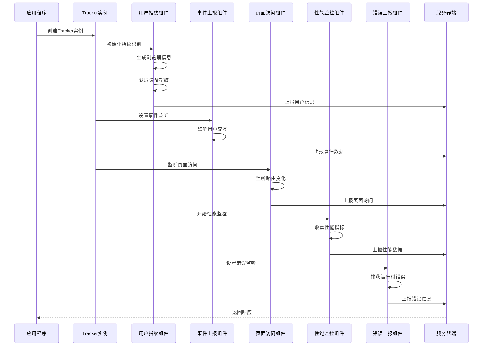
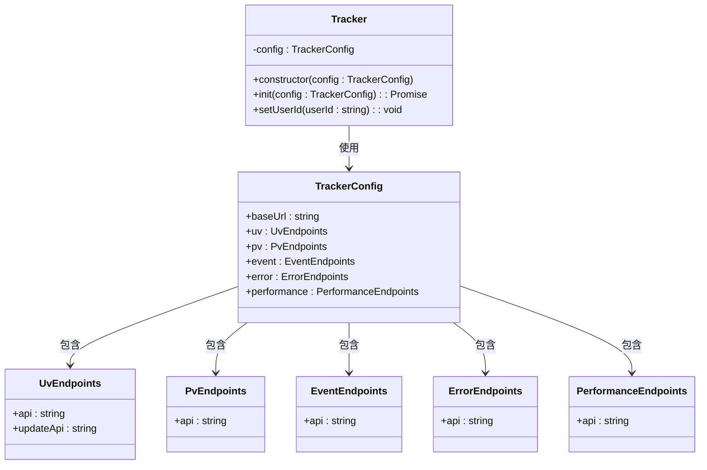
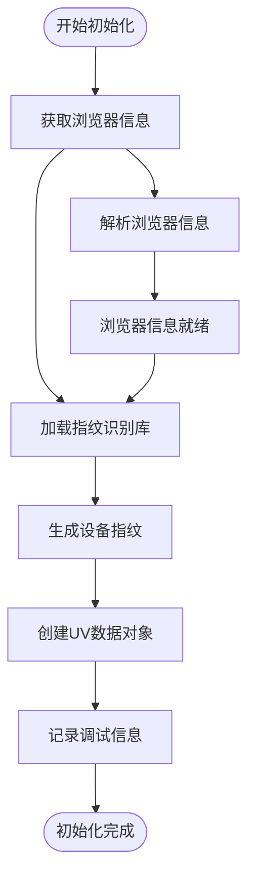
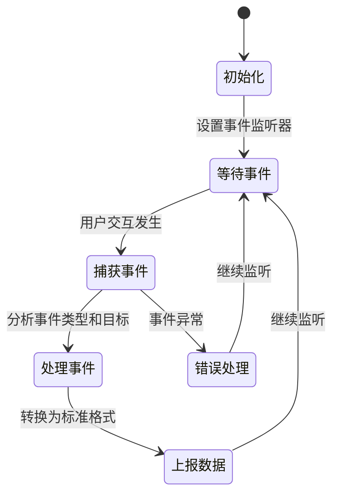
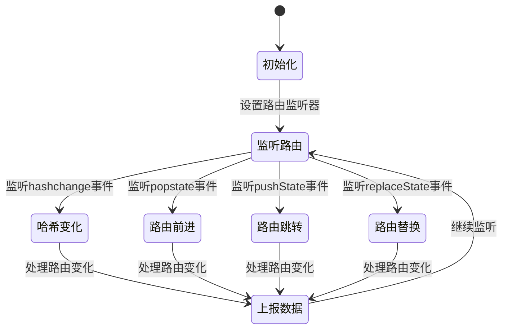
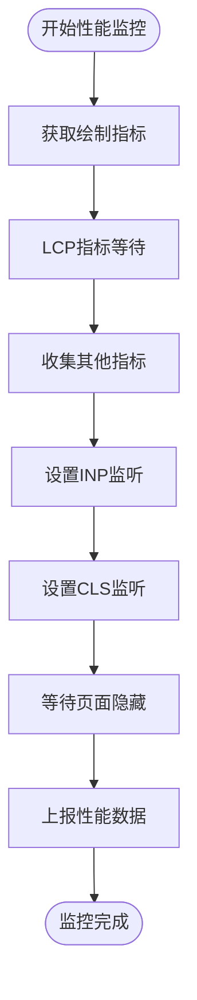
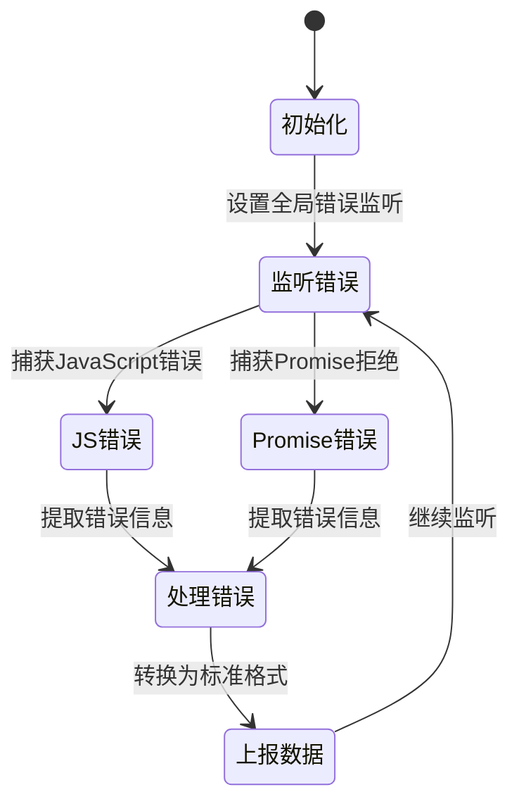
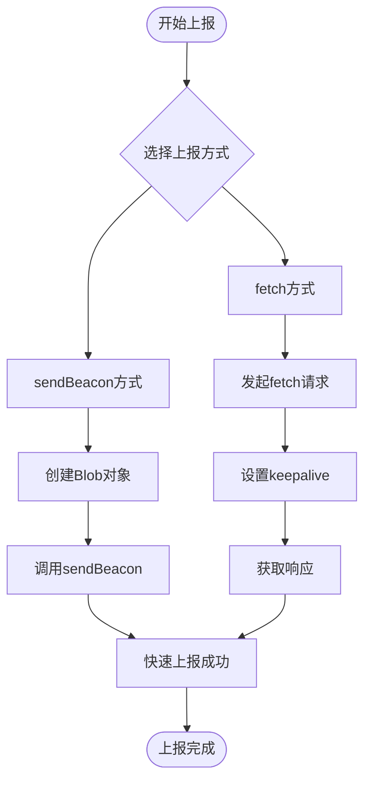
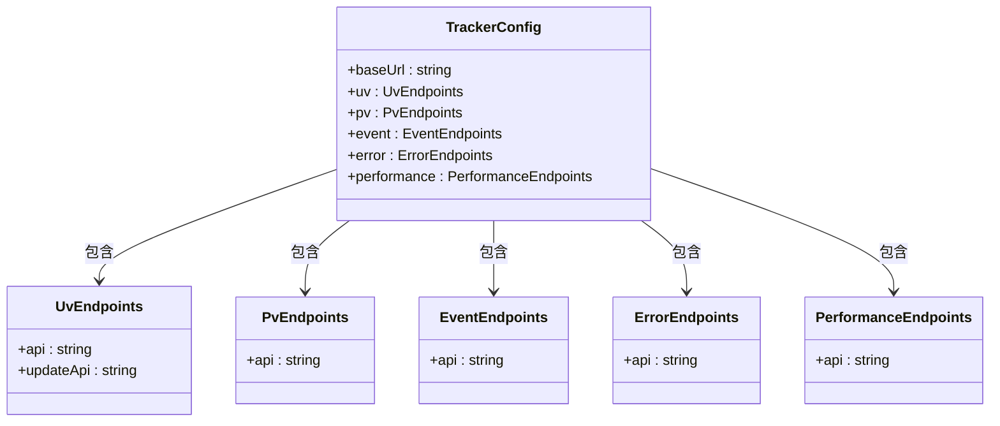

# 学习进度跟踪模块

<cite>
**本文档引用的文件**
- [apps/tracker/index.ts](file://apps/tracker/index.ts)
- [apps/tracker/src/event/index.ts](file://apps/tracker/src/event/index.ts)
- [apps/tracker/src/uv/index.ts](file://apps/tracker/src/uv/index.ts)
- [apps/tracker/src/pv/index.ts](file://apps/tracker/src/pv/index.ts)
- [apps/tracker/src/performance/index.ts](file://apps/tracker/src/performance/index.ts)
- [apps/tracker/src/error/index.ts](file://apps/tracker/src/error/index.ts)
- [apps/tracker/src/report/index.ts](file://apps/tracker/src/report/index.ts)
- [apps/tracker/package.json](file://apps/tracker/package.json)
- [apps/tracker/tsconfig.json](file://apps/tracker/tsconfig.json)
- [packages/common/tracker/index.ts](file://packages/common/tracker/index.ts)
- [README.md](file://README.md)
- [package.json](file://package.json)
</cite>

## 更新摘要
**所做更改**
- 更新了Tracker类实现的详细分析，反映实际的异步初始化流程
- 完善了用户指纹收集机制的技术说明，包括浏览器信息解析和设备指纹生成
- 增强了用户交互事件监控的实现细节，包括事件类型支持和坐标信息收集
- 扩展了页面访问统计的路由监听机制，涵盖哈希路由和历史路由支持
- 完善了性能指标跟踪的实现，包括LCP指标等待和INP/CLS监听机制
- 更新了错误上报组件的实现分析，包括全局错误捕获和Promise拒绝处理
- 增强了数据上报工具的分析，包括sendBeacon和fetch两种上报方式

## 目录
1. [简介](#简介)
2. [项目结构](#项目结构)
3. [核心组件](#核心组件)
4. [架构概览](#架构概览)
5. [详细组件分析](#详细组件分析)
6. [配置系统说明](#配置系统说明)
7. [依赖关系分析](#依赖关系分析)
8. [性能考虑](#性能考虑)
9. [故障排除指南](#故障排除指南)
10. [结论](#结论)

## 简介

学习进度跟踪模块是英语学习网站中的一个关键功能组件，负责收集和报告用户的学习行为数据。该模块基于现代前端技术栈构建，采用模块化设计，能够追踪用户的浏览行为、事件交互、性能指标和错误信息。

该项目是一个AI英文学习网站，提供每日练习来重新记忆英语单词。学习进度跟踪模块作为整个系统的重要组成部分，为后续的数据分析和个性化推荐提供了基础支持。

**章节来源**
- [apps/tracker/index.ts:1-44](file://apps/tracker/index.ts#L1-L44)

## 项目结构

学习进度跟踪模块位于 `apps/tracker` 目录下，采用了清晰的分层架构设计，包含七个核心功能模块：

```mermaid
graph TB
subgraph "学习进度跟踪模块"
A[index.ts<br/>主入口文件]
B[src/uv/index.ts]<br/>用户指纹识别]
C[src/event/index.ts]<br/>事件上报]
D[src/pv/index.ts]<br/>页面访问统计]
E[src/performance/index.ts]<br/>性能监控]
F[src/error/index.ts]<br/>错误上报]
G[src/report/index.ts]<br/>数据上报工具]
H[package.json<br/>依赖配置]
I[tsconfig.json<br/>TypeScript配置]
end
subgraph "外部依赖"
J[@en/common/tracker<br/>类型定义]
K[@fingerprintjs/fingerprintjs<br/>指纹识别]
L[ua-parser-js<br/>浏览器信息解析]
M[web-vitals<br/>性能指标采集]
N[事件监听器<br/>DOM事件处理]
O[navigator.sendBeacon<br/>HTTP上报]
P[fetch API<br/>HTTP请求]
end
A --> B
A --> C
A --> D
A --> E
A --> F
B --> J
B --> K
B --> L
C --> J
C --> N
D --> J
D --> N
E --> J
E --> M
F --> J
F --> N
G --> O
G --> P
```

**图表来源**
- [apps/tracker/index.ts:1-44](file://apps/tracker/index.ts#L1-L44)
- [apps/tracker/src/uv/index.ts:1-26](file://apps/tracker/src/uv/index.ts#L1-L26)
- [apps/tracker/src/event/index.ts:1-33](file://apps/tracker/src/event/index.ts#L1-L33)
- [apps/tracker/src/pv/index.ts:1-38](file://apps/tracker/src/pv/index.ts#L1-L38)
- [apps/tracker/src/performance/index.ts:1-71](file://apps/tracker/src/performance/index.ts#L1-L71)
- [apps/tracker/src/error/index.ts:1-29](file://apps/tracker/src/error/index.ts#L1-L29)
- [apps/tracker/src/report/index.ts:1-17](file://apps/tracker/src/report/index.ts#L1-L17)

**章节来源**
- [apps/tracker/index.ts:1-44](file://apps/tracker/index.ts#L1-L44)
- [apps/tracker/package.json:1-24](file://apps/tracker/package.json#L1-L24)
- [apps/tracker/tsconfig.json:1-16](file://apps/tracker/tsconfig.json#L1-L16)

## 核心组件

学习进度跟踪模块由七个核心组件构成，每个组件负责特定的跟踪功能：

### Tracker 类
Tracker 是整个模块的核心类，负责协调各个跟踪功能。它接收配置参数并初始化相应的跟踪服务。

### 用户指纹识别组件
该组件负责生成和管理用户唯一标识符，通过结合浏览器指纹和设备信息来创建稳定的用户标识。

### 事件上报组件
专门处理用户交互事件的捕获和上报，包括点击事件、页面访问等行为数据。

### 页面访问统计组件
负责追踪用户的页面浏览行为，支持哈希路由和历史路由的监听。

### 性能监控组件
实时监控页面性能指标，包括首屏渲染时间、最大内容绘制时间等关键指标。

### 错误上报组件
捕获并上报JavaScript运行时错误和未处理的Promise拒绝错误。

### 数据上报工具
提供两种数据上报方式：基于navigator.sendBeacon的快速上报和基于fetch的可靠上报。

**章节来源**
- [apps/tracker/index.ts:8-23](file://apps/tracker/index.ts#L8-L23)
- [apps/tracker/src/uv/index.ts:14-25](file://apps/tracker/src/uv/index.ts#L14-L25)
- [apps/tracker/src/event/index.ts:3-32](file://apps/tracker/src/event/index.ts#L3-L32)
- [apps/tracker/src/pv/index.ts:14-37](file://apps/tracker/src/pv/index.ts#L14-L37)
- [apps/tracker/src/performance/index.ts:4-69](file://apps/tracker/src/performance/index.ts#L4-L69)
- [apps/tracker/src/error/index.ts:3-28](file://apps/tracker/src/error/index.ts#L3-L28)
- [apps/tracker/src/report/index.ts:1-17](file://apps/tracker/src/report/index.ts#L1-L17)

## 架构概览

学习进度跟踪模块采用事件驱动的架构模式，通过异步处理机制确保不影响用户体验：



**图表来源**
- [apps/tracker/index.ts:14-20](file://apps/tracker/index.ts#L14-L20)
- [apps/tracker/src/uv/index.ts:14-25](file://apps/tracker/src/uv/index.ts#L14-L25)
- [apps/tracker/src/event/index.ts:7-31](file://apps/tracker/src/event/index.ts#L7-L31)
- [apps/tracker/src/pv/index.ts:16-36](file://apps/tracker/src/pv/index.ts#L16-L36)
- [apps/tracker/src/performance/index.ts:45-69](file://apps/tracker/src/performance/index.ts#L45-L69)
- [apps/tracker/src/error/index.ts:5-27](file://apps/tracker/src/error/index.ts#L5-L27)

## 详细组件分析

### Tracker 类实现

Tracker 类是整个模块的控制中心，负责协调各个跟踪功能的初始化和执行。



**图表来源**
- [apps/tracker/index.ts:8-43](file://apps/tracker/index.ts#L8-L43)

#### 初始化流程分析

Tracker 类的初始化过程包含以下关键步骤：

1. **配置验证**：检查传入的配置参数是否完整
2. **指纹识别**：调用用户指纹识别组件生成唯一标识
3. **事件绑定**：设置各种用户交互事件的监听器
4. **页面监听**：配置页面访问和路由变化监听
5. **性能监控**：启动性能指标收集
6. **错误捕获**：设置全局错误监听器

**章节来源**
- [apps/tracker/index.ts:14-20](file://apps/tracker/index.ts#L14-L20)

### 用户指纹识别组件

用户指纹识别组件是实现用户身份追踪的关键模块，通过多种技术手段确保用户标识的稳定性和准确性。



**图表来源**
- [apps/tracker/src/uv/index.ts:14-25](file://apps/tracker/src/uv/index.ts#L14-L25)

#### 浏览器信息解析

组件使用 UA 解析器来获取详细的浏览器和操作系统信息：

- **浏览器名称**：识别用户使用的具体浏览器
- **操作系统**：获取操作系统的类型和版本
- **设备类型**：区分桌面、平板或移动设备

#### 设备指纹生成

通过 FingerprintJS 库生成唯一的设备标识符，该标识符基于多个硬件和软件特征的组合。

**章节来源**
- [apps/tracker/src/uv/index.ts:5-12](file://apps/tracker/src/uv/index.ts#L5-L12)
- [apps/tracker/src/uv/index.ts:16-23](file://apps/tracker/src/uv/index.ts#L16-L23)

### 事件上报组件

事件上报组件负责捕获用户的各种交互行为，并将其转换为标准化的数据格式进行上报。



**图表来源**
- [apps/tracker/src/event/index.ts:3-32](file://apps/tracker/src/event/index.ts#L3-L32)

#### 事件类型支持

目前支持的事件类型包括：
- **鼠标点击事件**：记录用户的点击位置和目标元素
- **按钮点击事件**：专门处理BUTTON元素的点击
- **SPAN元素点击**：处理嵌套在BUTTON中的SPAN元素
- **坐标信息**：记录点击位置的精确坐标和元素尺寸

**章节来源**
- [apps/tracker/src/event/index.ts:7-31](file://apps/tracker/src/event/index.ts#L7-L31)

### 页面访问统计组件

页面访问统计组件负责追踪用户的页面浏览行为，支持多种路由模式的监听。



**图表来源**
- [apps/tracker/src/pv/index.ts:14-37](file://apps/tracker/src/pv/index.ts#L14-L37)

#### 路由支持特性

组件支持以下路由模式：
- **哈希路由**：支持`#`前缀的路由变化
- **历史路由**：监听浏览器前进后退按钮
- **程序化路由**：拦截`pushState`和`replaceState`调用
- **完整URL信息**：记录协议、主机名、路径等完整信息

**章节来源**
- [apps/tracker/src/pv/index.ts:3-12](file://apps/tracker/src/pv/index.ts#L3-L12)
- [apps/tracker/src/pv/index.ts:16-36](file://apps/tracker/src/pv/index.ts#L16-L36)

### 性能监控组件

性能监控组件实时收集页面性能指标，为用户体验优化提供数据支持。



**图表来源**
- [apps/tracker/src/performance/index.ts:4-69](file://apps/tracker/src/performance/index.ts#L4-L69)

#### 性能指标收集

组件收集以下关键性能指标：
- **FP（首次绘制）**：页面第一次绘制的时间
- **FCP（首次内容绘制）**：页面首次有内容绘制的时间
- **LCP（最大内容绘制）**：页面最大元素绘制完成的时间
- **INP（交互性能）**：用户交互响应时间
- **CLS（累积布局偏移）**：页面布局稳定性指标

**章节来源**
- [apps/tracker/src/performance/index.ts:10-35](file://apps/tracker/src/performance/index.ts#L10-L35)
- [apps/tracker/src/performance/index.ts:37-43](file://apps/tracker/src/performance/index.ts#L37-L43)
- [apps/tracker/src/performance/index.ts:45-69](file://apps/tracker/src/performance/index.ts#L45-L69)

### 错误上报组件

错误上报组件负责捕获并上报JavaScript运行时错误和未处理的Promise拒绝错误。



**图表来源**
- [apps/tracker/src/error/index.ts:3-28](file://apps/tracker/src/error/index.ts#L3-L28)

#### 错误类型支持

组件支持以下错误类型的捕获：
- **JavaScript错误**：捕获`window.error`事件
- **Promise拒绝**：捕获`unhandledrejection`事件
- **错误信息提取**：提取消息、堆栈跟踪、URL等信息
- **错误分类**：区分JavaScript错误和Promise错误

**章节来源**
- [apps/tracker/src/error/index.ts:5-15](file://apps/tracker/src/error/index.ts#L5-L15)
- [apps/tracker/src/error/index.ts:17-27](file://apps/tracker/src/error/index.ts#L17-L27)

### 数据上报工具

数据上报工具提供了两种不同的数据传输方式，确保在不同场景下的可靠性。



**图表来源**
- [apps/tracker/src/report/index.ts:1-17](file://apps/tracker/src/report/index.ts#L1-L17)

#### 上报方式对比

- **sendBeacon方式**：使用navigator.sendBeacon API，适合快速、可靠的后台数据传输
- **fetch方式**：使用标准fetch API，支持完整的HTTP请求配置和响应处理

**章节来源**
- [apps/tracker/src/report/index.ts:1-17](file://apps/tracker/src/report/index.ts#L1-L17)

## 配置系统说明

学习进度跟踪模块采用集中式配置管理，通过TrackerConfig接口定义完整的配置结构。

### 配置结构详解



**图表来源**
- [apps/tracker/index.ts:25-43](file://apps/tracker/index.ts#L25-L43)

### 默认配置示例

模块提供了完整的默认配置示例：

- **基础URL**：`"http://localhost:3000"`
- **用户指纹端点**：
  - `"/api/uv"` - 初始用户信息上报
  - `"/api/uv/update"` - 用户信息更新
- **页面访问端点**：`"/api/pv"`
- **事件上报端点**：`"/api/event"`
- **错误上报端点**：`"/api/error"`
- **性能监控端点**：`"/api/performance"`

**章节来源**
- [apps/tracker/index.ts:25-43](file://apps/tracker/index.ts#L25-L43)

## 依赖关系分析

学习进度跟踪模块的依赖关系相对简洁，主要依赖于几个核心库：

```mermaid
graph LR
subgraph "模块依赖图"
A[@en/tracker] --> B[@en/common]
A --> C[@fingerprintjs/fingerprintjs]
A --> D[ua-parser-js]
A --> E[web-vitals]
B --> F[tracker类型定义]
C --> G[设备指纹识别]
D --> H[浏览器信息解析]
E --> I[性能指标采集]
J[事件监听器] --> K[DOM事件处理]
L[sendBeacon API] --> M[HTTP上报]
N[fetch API] --> O[HTTP请求]
end
```

**图表来源**
- [apps/tracker/package.json:18-23](file://apps/tracker/package.json#L18-L23)

### 核心依赖说明

| 依赖包 | 版本 | 用途 |
|--------|------|------|
| @en/common | workspace:* | 提供类型定义和共享配置 |
| @fingerprintjs/fingerprintjs | ^5.2.0 | 设备指纹识别 |
| ua-parser-js | ^2.0.10 | 浏览器和操作系统信息解析 |
| web-vitals | ^5.3.0 | 页面性能指标采集 |

**章节来源**
- [apps/tracker/package.json:18-23](file://apps/tracker/package.json#L18-L23)

## 性能考虑

学习进度跟踪模块在设计时充分考虑了性能影响，采用了多种优化策略：

### 异步处理
所有网络请求都采用异步方式处理，避免阻塞主线程，确保用户体验流畅。

### 延迟初始化
组件采用延迟初始化策略，只有在需要时才加载和启动相应的功能模块。

### 内存管理
定期清理事件监听器和临时变量，防止内存泄漏问题。

### 性能监控
内置性能指标收集，帮助识别和解决性能瓶颈。

## 故障排除指南

### 常见问题及解决方案

**问题1：指纹识别失败**
- 检查网络连接是否正常
- 确认浏览器支持必要的API
- 查看控制台是否有相关错误信息
- 验证FingerprintJS库是否正确加载

**问题2：事件监听无效**
- 验证事件监听器是否正确绑定
- 检查目标元素是否存在
- 确认事件冒泡机制是否正常工作
- 验证事件类型是否正确匹配

**问题3：页面访问统计不准确**
- 检查路由监听器是否正确设置
- 验证不同路由模式的支持情况
- 确认URL解析逻辑是否正确
- 查看路由变化事件是否正常触发

**问题4：性能指标收集异常**
- 检查web-vitals库是否正确安装
- 验证性能API的可用性
- 确认页面可见性变化事件监听
- 查看性能指标计算逻辑

**问题5：错误上报失败**
- 检查全局错误监听器设置
- 验证错误信息提取逻辑
- 确认错误类型判断准确性
- 查看错误数据格式是否正确

**问题6：配置项无效**
- 验证配置参数的完整性
- 检查端点URL的正确性
- 确认基础URL的可达性
- 查看配置加载顺序是否正确

**章节来源**
- [apps/tracker/src/uv/index.ts:16-17](file://apps/tracker/src/uv/index.ts#L16-L17)
- [apps/tracker/src/event/index.ts:7-31](file://apps/tracker/src/event/index.ts#L7-L31)
- [apps/tracker/src/pv/index.ts:16-36](file://apps/tracker/src/pv/index.ts#L16-L36)
- [apps/tracker/src/performance/index.ts:45-69](file://apps/tracker/src/performance/index.ts#L45-L69)
- [apps/tracker/src/error/index.ts:5-27](file://apps/tracker/src/error/index.ts#L5-L27)

## 结论

学习进度跟踪模块为英语学习网站提供了完整的用户行为追踪能力。通过模块化的架构设计和现代化的技术选型，该模块能够在不影响用户体验的前提下，有效地收集和分析用户的学习行为数据。

模块的主要优势包括：
- **模块化设计**：七个核心功能模块清晰分离，便于维护和扩展
- **异步处理**：确保用户体验不受影响
- **类型安全**：完整的TypeScript类型定义
- **全面覆盖**：涵盖用户识别、事件追踪、页面统计、性能监控、错误上报、数据上报等全方位需求
- **可扩展性**：易于添加新的跟踪功能和事件类型

未来可以考虑的功能增强包括：增加更多类型的事件支持、实现数据缓存机制、提供更丰富的数据分析接口、增强错误诊断能力等。