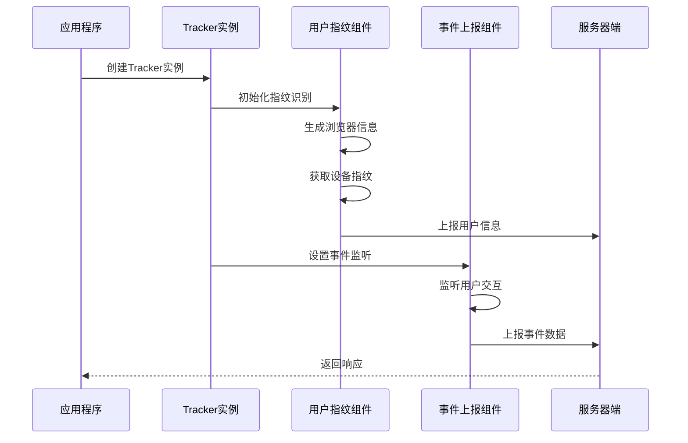
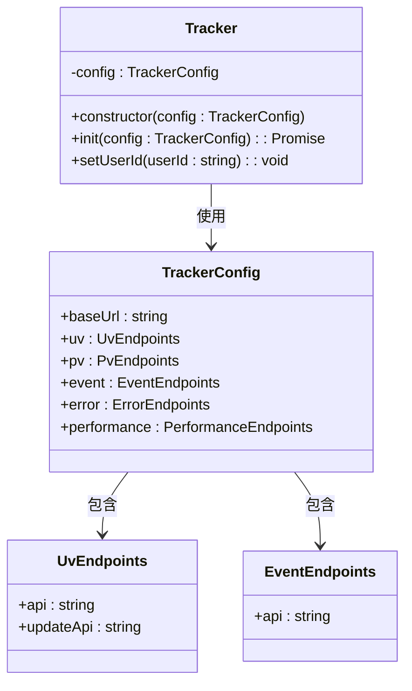
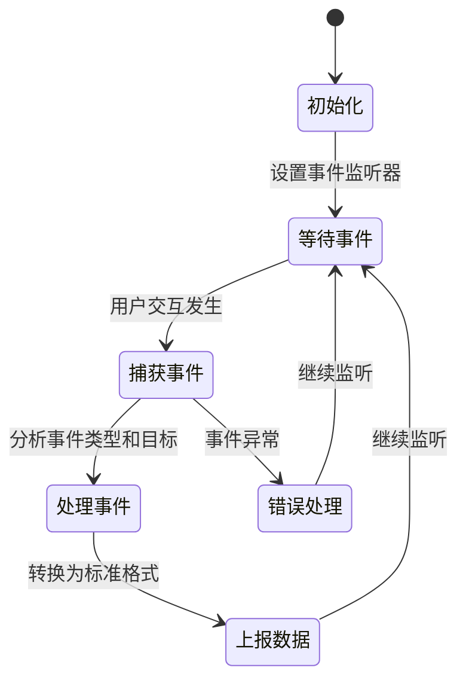

# 学习进度跟踪模块

<cite>
**本文档引用的文件**
- [apps/trakcer/index.ts](file://apps/trakcer/index.ts)
- [apps/trakcer/src/event/index.ts](file://apps/trakcer/src/event/index.ts)
- [apps/trakcer/src/uv/index.ts](file://apps/trakcer/src/uv/index.ts)
- [apps/trakcer/package.json](file://apps/trakcer/package.json)
- [apps/trakcer/tsconfig.json](file://apps/trakcer/tsconfig.json)
- [README.md](file://README.md)
- [package.json](file://package.json)
</cite>

## 目录
1. [简介](#简介)
2. [项目结构](#项目结构)
3. [核心组件](#核心组件)
4. [架构概览](#架构概览)
5. [详细组件分析](#详细组件分析)
6. [依赖关系分析](#依赖关系分析)
7. [性能考虑](#性能考虑)
8. [故障排除指南](#故障排除指南)
9. [结论](#结论)

## 简介

学习进度跟踪模块是英语学习网站中的一个关键功能组件，负责收集和报告用户的学习行为数据。该模块基于现代前端技术栈构建，采用模块化设计，能够追踪用户的浏览行为、事件交互和性能指标。

该项目是一个AI英文学习网站，提供每日练习来重新记忆英语单词。学习进度跟踪模块作为整个系统的重要组成部分，为后续的数据分析和个性化推荐提供了基础支持。

## 项目结构

学习进度跟踪模块位于 `apps/trakcer` 目录下，采用了清晰的分层架构设计：

```mermaid
graph TB
subgraph "学习进度跟踪模块"
A[index.ts<br/>主入口文件]
B[src/uv/index.ts]<br/>用户指纹识别]
C[src/event/index.ts]<br/>事件上报]
D[package.json<br/>依赖配置]
E[tsconfig.json<br/>TypeScript配置]
end
subgraph "外部依赖"
F[@en/common/tracker<br/>类型定义]
G[@fingerprintjs/fingerprintjs<br/>指纹识别]
H[ua-parser-js<br/>浏览器信息解析]
end
A --> B
A --> C
B --> F
B --> G
B --> H
C --> F
```

**图表来源**
- [apps/trakcer/index.ts:1-38](file://apps/trakcer/index.ts#L1-L38)
- [apps/trakcer/src/uv/index.ts:1-26](file://apps/trakcer/src/uv/index.ts#L1-L26)
- [apps/trakcer/src/event/index.ts:1-8](file://apps/trakcer/src/event/index.ts#L1-L8)

**章节来源**
- [apps/trakcer/index.ts:1-38](file://apps/trakcer/index.ts#L1-L38)
- [apps/trakcer/package.json:1-23](file://apps/trakcer/package.json#L1-L23)
- [apps/trakcer/tsconfig.json:1-16](file://apps/trakcer/tsconfig.json#L1-L16)

## 核心组件

学习进度跟踪模块由三个核心组件构成：

### Tracker 类
Tracker 是整个模块的核心类，负责协调各个跟踪功能。它接收配置参数并初始化相应的跟踪服务。

### 用户指纹识别组件
该组件负责生成和管理用户唯一标识符，通过结合浏览器指纹和设备信息来创建稳定的用户标识。

### 事件上报组件
专门处理用户交互事件的捕获和上报，包括点击事件、页面访问等行为数据。

**章节来源**
- [apps/trakcer/index.ts:5-17](file://apps/trakcer/index.ts#L5-L17)
- [apps/trakcer/src/uv/index.ts:14-25](file://apps/trakcer/src/uv/index.ts#L14-L25)
- [apps/trakcer/src/event/index.ts:3-7](file://apps/trakcer/src/event/index.ts#L3-L7)

## 架构概览

学习进度跟踪模块采用事件驱动的架构模式，通过异步处理机制确保不影响用户体验：



**图表来源**
- [apps/trakcer/index.ts:11-14](file://apps/trakcer/index.ts#L11-L14)
- [apps/trakcer/src/uv/index.ts:14-25](file://apps/trakcer/src/uv/index.ts#L14-L25)
- [apps/trakcer/src/event/index.ts:4-6](file://apps/trakcer/src/event/index.ts#L4-L6)

## 详细组件分析

### Tracker 类实现

Tracker 类是整个模块的控制中心，负责协调各个跟踪功能的初始化和执行。



**图表来源**
- [apps/trakcer/index.ts:5-17](file://apps/trakcer/index.ts#L5-L17)

#### 初始化流程分析

Tracker 类的初始化过程包含以下关键步骤：

1. **配置验证**：检查传入的配置参数是否完整
2. **指纹识别**：调用用户指纹识别组件生成唯一标识
3. **事件绑定**：设置各种用户交互事件的监听器

**章节来源**
- [apps/trakcer/index.ts:11-14](file://apps/trakcer/index.ts#L11-L14)

### 用户指纹识别组件

用户指纹识别组件是实现用户身份追踪的关键模块，通过多种技术手段确保用户标识的稳定性和准确性。


**图表来源**
- [apps/trakcer/src/uv/index.ts:14-25](file://apps/trakcer/src/uv/index.ts#L14-L25)

#### 浏览器信息解析

组件使用 UA 解析器来获取详细的浏览器和操作系统信息：

- **浏览器名称**：识别用户使用的具体浏览器
- **操作系统**：获取操作系统的类型和版本
- **设备类型**：区分桌面、平板或移动设备

#### 设备指纹生成

通过 FingerprintJS 库生成唯一的设备标识符，该标识符基于多个硬件和软件特征的组合。

**章节来源**
- [apps/trakcer/src/uv/index.ts:5-12](file://apps/trakcer/src/uv/index.ts#L5-L12)
- [apps/trakcer/src/uv/index.ts:16-23](file://apps/trakcer/src/uv/index.ts#L16-L23)

### 事件上报组件

事件上报组件负责捕获用户的各种交互行为，并将其转换为标准化的数据格式进行上报。



**图表来源**
- [apps/trakcer/src/event/index.ts:3-7](file://apps/trakcer/src/event/index.ts#L3-L7)

#### 事件类型支持

目前支持的事件类型包括：
- **鼠标点击事件**：记录用户的点击位置和目标元素
- **页面访问事件**：追踪用户的页面浏览行为
- **交互事件**：捕获表单输入、按钮点击等用户操作

**章节来源**
- [apps/trakcer/src/event/index.ts:4-6](file://apps/trakcer/src/event/index.ts#L4-L6)

## 依赖关系分析

学习进度跟踪模块的依赖关系相对简洁，主要依赖于几个核心库：

```mermaid
graph LR
subgraph "模块依赖图"
A[@en/trakcer] --> B[@en/common]
A --> C[@fingerprintjs/fingerprintjs]
A --> D[ua-parser-js]
B --> E[tracker类型定义]
C --> F[设备指纹识别]
D --> G[浏览器信息解析]
end
```

**图表来源**
- [apps/trakcer/package.json:18-22](file://apps/trakcer/package.json#L18-L22)

### 核心依赖说明

| 依赖包 | 版本 | 用途 |
|--------|------|------|
| @en/common | workspace:* | 提供类型定义和共享配置 |
| @fingerprintjs/fingerprintjs | ^5.2.0 | 设备指纹识别 |
| ua-parser-js | ^2.0.10 | 浏览器和操作系统信息解析 |

**章节来源**
- [apps/trakcer/package.json:18-22](file://apps/trakcer/package.json#L18-L22)

## 性能考虑

学习进度跟踪模块在设计时充分考虑了性能影响，采用了多种优化策略：

### 异步处理
所有网络请求都采用异步方式处理，避免阻塞主线程，确保用户体验流畅。

### 延迟初始化
组件采用延迟初始化策略，只有在需要时才加载和启动相应的功能模块。

### 内存管理
定期清理事件监听器和临时变量，防止内存泄漏问题。

## 故障排除指南

### 常见问题及解决方案

**问题1：指纹识别失败**
- 检查网络连接是否正常
- 确认浏览器支持必要的API
- 查看控制台是否有相关错误信息

**问题2：事件监听无效**
- 验证事件监听器是否正确绑定
- 检查目标元素是否存在
- 确认事件冒泡机制是否正常工作

**问题3：数据上报失败**
- 检查服务器端点是否可达
- 验证请求格式是否符合预期
- 查看响应状态码和错误信息

**章节来源**
- [apps/trakcer/src/uv/index.ts:16-17](file://apps/trakcer/src/uv/index.ts#L16-L17)
- [apps/trakcer/src/event/index.ts:4-6](file://apps/trakcer/src/event/index.ts#L4-L6)

## 结论

学习进度跟踪模块为英语学习网站提供了完整的用户行为追踪能力。通过模块化的架构设计和现代化的技术选型，该模块能够在不影响用户体验的前提下，有效地收集和分析用户的学习行为数据。

模块的主要优势包括：
- **模块化设计**：清晰的功能分离便于维护和扩展
- **异步处理**：确保用户体验不受影响
- **类型安全**：完整的TypeScript类型定义
- **可扩展性**：易于添加新的跟踪功能和事件类型

未来可以考虑的功能增强包括：增加更多类型的事件支持、实现数据缓存机制、提供更丰富的数据分析接口等。