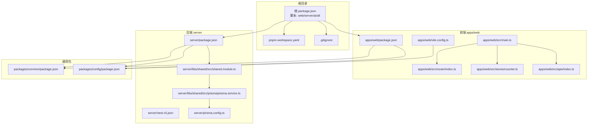
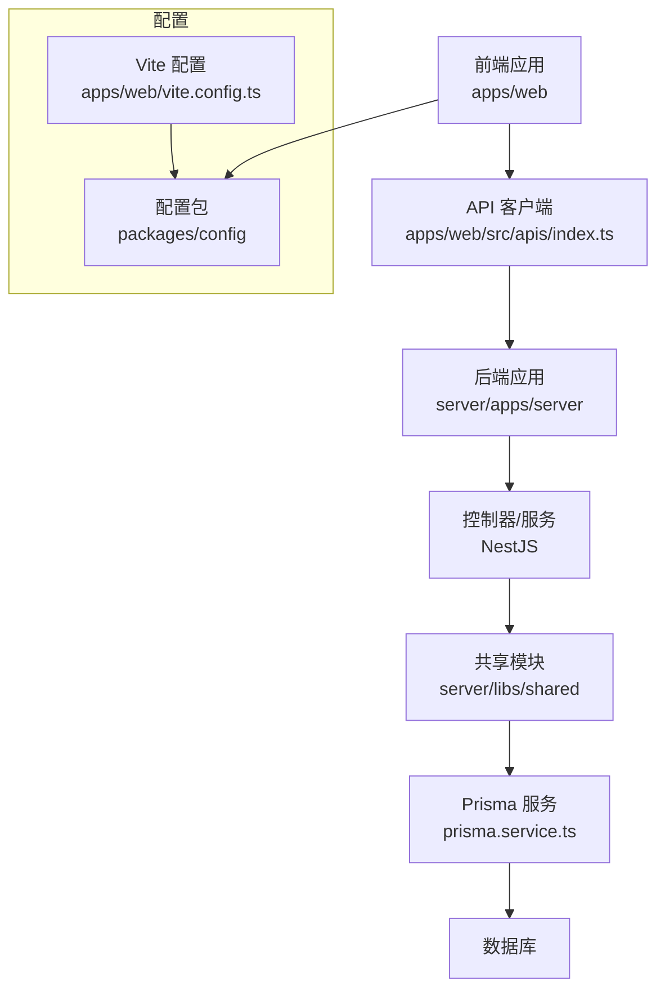
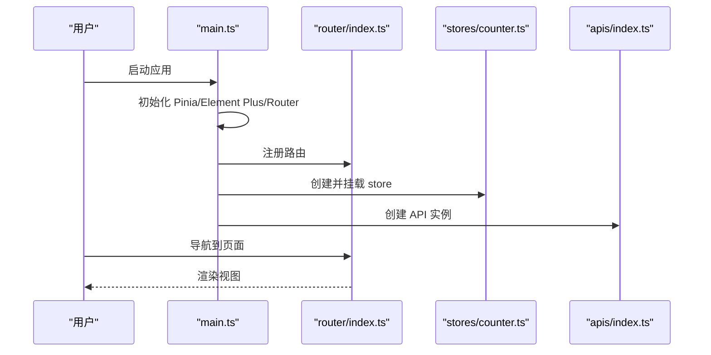
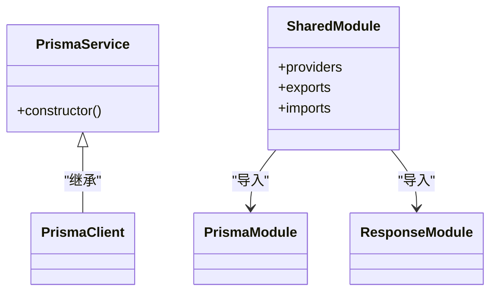
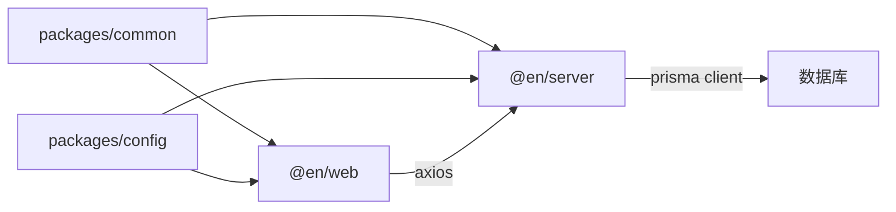

# 开发指南

<cite>
**本文引用的文件**
- [根目录 package.json](file://package.json)
- [pnpm 工作区配置](file://pnpm-workspace.yaml)
- [.gitignore 文件](file://.gitignore)
- [前端应用 package.json](file://apps/web/package.json)
- [Vite 配置](file://apps/web/vite.config.ts)
- [前端入口 main.ts](file://apps/web/src/main.ts)
- [前端路由配置](file://apps/web/src/router/index.ts)
- [前端状态管理示例](file://apps/web/src/stores/counter.ts)
- [前端 API 客户端](file://apps/web/src/apis/index.ts)
- [后端应用 package.json](file://server/package.json)
- [Nest CLI 配置](file://server/nest-cli.json)
- [共享模块](file://server/libs/shared/src/shared.module.ts)
- [Prisma 服务](file://server/libs/shared/src/prisma/prisma.service.ts)
- [Prisma 配置](file://server/prisma.config.ts)
- [通用包 package.json](file://packages/common/package.json)
- [配置包 package.json](file://packages/config/package.json)
- [项目总 README](file://README.md)
</cite>

## 目录
1. [简介](#简介)
2. [项目结构](#项目结构)
3. [核心组件](#核心组件)
4. [架构总览](#架构总览)
5. [详细组件分析](#详细组件分析)
6. [依赖分析](#依赖分析)
7. [性能考虑](#性能考虑)
8. [故障排除指南](#故障排除指南)
9. [结论](#结论)
10. [附录](#附录)

## 简介
本开发指南面向英语学习平台的开发者，覆盖从环境搭建到日常开发、测试与发布的全流程。内容包括：
- 开发工具链与运行方式（Vite、NestJS、Prisma）
- 编码规范与最佳实践（代码风格、命名约定、模块化）
- Git 工作流与分支管理策略
- 提交规范与代码审查标准
- 调试技巧与性能分析方法
- 单元测试与集成测试的编写与执行
- 常见问题排查与解决方案
- 新功能开发流程与发布流程
- 团队协作与项目维护建议

## 项目结构
本项目采用 monorepo 结构，使用 pnpm workspace 管理多包：
- apps/web：基于 Vue 3 + Vite 的前端应用
- server：基于 NestJS 的后端应用，包含共享库 libs/shared
- packages/common、packages/config：通用与配置包，被多个子包引用
- 根目录脚本通过 pnpm filter 启动各子项目

**图表来源**
- [根目录 package.json:1-15](file://package.json#L1-L15)
- [pnpm 工作区配置:1-10](file://pnpm-workspace.yaml#L1-L10)
- [.gitignore 文件:1-63](file://.gitignore#L1-L63)
- [前端应用 package.json:1-45](file://apps/web/package.json#L1-L45)
- [Vite 配置:1-25](file://apps/web/vite.config.ts#L1-L25)
- [前端入口 main.ts:1-21](file://apps/web/src/main.ts#L1-L21)
- [前端路由配置:1-13](file://apps/web/src/router/index.ts#L1-L13)
- [前端状态管理示例:1-13](file://apps/web/src/stores/counter.ts#L1-L13)
- [前端 API 客户端:1-6](file://apps/web/src/apis/index.ts#L1-L6)
- [后端应用 package.json:1-52](file://server/package.json#L1-L52)
- [Nest CLI 配置:1-43](file://server/nest-cli.json#L1-L43)
- [共享模块:1-13](file://server/libs/shared/src/shared.module.ts#L1-L13)
- [Prisma 服务:1-18](file://server/libs/shared/src/prisma/prisma.service.ts#L1-L18)
- [Prisma 配置:1-15](file://server/prisma.config.ts#L1-L15)

**章节来源**
- [根目录 package.json:1-15](file://package.json#L1-L15)
- [pnpm 工作区配置:1-10](file://pnpm-workspace.yaml#L1-L10)
- [.gitignore 文件:1-63](file://.gitignore#L1-L63)
- [前端应用 package.json:1-45](file://apps/web/package.json#L1-L45)
- [后端应用 package.json:1-52](file://server/package.json#L1-L52)

## 核心组件
- 前端应用（apps/web）
  - 使用 Vite 构建，Vue 3 + Pinia + Vue Router
  - 通过别名 @ 指向 src，便于模块导入
  - 集成 Element Plus、TailwindCSS、Pinia 持久化插件
- 后端应用（server）
  - NestJS 应用，支持多项目（server、ai），共享库 shared
  - 通过 Prisma 连接数据库，使用 PostgreSQL 适配器
- 通用包（packages/common、packages/config）
  - 作为 workspace:* 依赖被前端与后端共享
  - 配置包提供统一的端口等配置项
- 数据层
  - Prisma 配置集中于 prisma.config.ts，读取 DATABASE_URL 环境变量

**章节来源**
- [前端入口 main.ts:1-21](file://apps/web/src/main.ts#L1-L21)
- [前端路由配置:1-13](file://apps/web/src/router/index.ts#L1-L13)
- [前端状态管理示例:1-13](file://apps/web/src/stores/counter.ts#L1-L13)
- [前端 API 客户端:1-6](file://apps/web/src/apis/index.ts#L1-L6)
- [后端应用 package.json:1-52](file://server/package.json#L1-L52)
- [共享模块:1-13](file://server/libs/shared/src/shared.module.ts#L1-L13)
- [Prisma 服务:1-18](file://server/libs/shared/src/prisma/prisma.service.ts#L1-L18)
- [Prisma 配置:1-15](file://server/prisma.config.ts#L1-L15)

## 架构总览
下图展示前后端交互与数据流概览。前端通过 axios 客户端访问后端接口；后端使用 NestJS 控制器/服务处理请求，并通过 Prisma 访问数据库。

**图表来源**
- [前端 API 客户端:1-6](file://apps/web/src/apis/index.ts#L1-L6)
- [后端应用 package.json:1-52](file://server/package.json#L1-L52)
- [共享模块:1-13](file://server/libs/shared/src/shared.module.ts#L1-L13)
- [Prisma 服务:1-18](file://server/libs/shared/src/prisma/prisma.service.ts#L1-L18)
- [Vite 配置:1-25](file://apps/web/vite.config.ts#L1-L25)

## 详细组件分析

### 前端应用（Vue 3 + Vite）
- 入口初始化
  - 创建应用实例、注册 Pinia、Element Plus、路由
  - Pinia 使用持久化插件，提升用户体验
- 路由与视图
  - 路由聚合 home 与 word-book 子路由
- 状态管理
  - 示例 store 展示了基本的响应式状态与计算属性
- 构建与开发
  - Vite 提供热更新与开发服务器，默认端口来自配置包
  - 支持 Vue Devtools 插件辅助调试

**图表来源**
- [前端入口 main.ts:1-21](file://apps/web/src/main.ts#L1-L21)
- [前端路由配置:1-13](file://apps/web/src/router/index.ts#L1-L13)
- [前端状态管理示例:1-13](file://apps/web/src/stores/counter.ts#L1-L13)
- [前端 API 客户端:1-6](file://apps/web/src/apis/index.ts#L1-L6)

**章节来源**
- [前端入口 main.ts:1-21](file://apps/web/src/main.ts#L1-L21)
- [前端路由配置:1-13](file://apps/web/src/router/index.ts#L1-L13)
- [前端状态管理示例:1-13](file://apps/web/src/stores/counter.ts#L1-L13)
- [Vite 配置:1-25](file://apps/web/vite.config.ts#L1-L25)

### 后端应用（NestJS + Prisma）
- 项目结构
  - 多项目配置（server、ai）与共享库 shared
  - 共享模块导出 Prisma 与响应封装模块
- 数据访问
  - PrismaService 基于 PostgreSQL 适配器连接数据库
  - 数据源 URL 来自环境变量 DATABASE_URL
- 配置与运行
  - 通过 nest-cli.json 指定 sourceRoot、tsconfig 路径
  - 提供开发、调试、生产启动脚本与测试命令

**图表来源**
- [共享模块:1-13](file://server/libs/shared/src/shared.module.ts#L1-L13)
- [Prisma 服务:1-18](file://server/libs/shared/src/prisma/prisma.service.ts#L1-L18)
- [Nest CLI 配置:1-43](file://server/nest-cli.json#L1-L43)

**章节来源**
- [Nest CLI 配置:1-43](file://server/nest-cli.json#L1-L43)
- [共享模块:1-13](file://server/libs/shared/src/shared.module.ts#L1-L13)
- [Prisma 服务:1-18](file://server/libs/shared/src/prisma/prisma.service.ts#L1-L18)
- [Prisma 配置:1-15](file://server/prisma.config.ts#L1-L15)

### 通用包与配置包
- common 与 config 作为 workspace:* 依赖，被前端与后端共享
- 配置包在 Vite 中被引用，用于统一端口等配置
- 建议在 common 中沉淀跨域、DTO、拦截器等可复用逻辑

**章节来源**
- [前端应用 package.json:1-45](file://apps/web/package.json#L1-L45)
- [后端应用 package.json:1-52](file://server/package.json#L1-L52)
- [Vite 配置:1-25](file://apps/web/vite.config.ts#L1-L25)

## 依赖分析
- 包管理与工作区
  - pnpm workspace 管理 apps/web、server、packages 下的包
  - 根目录脚本通过 pnpm --filter 启动前端、后端或 AI 子应用
- 前端依赖
  - Vue 3、Pinia、Element Plus、TailwindCSS、Axios、Vue Router
  - 通过 workspace:* 引用 common 与 config
- 后端依赖
  - NestJS 核心、Prisma、PostgreSQL 适配器、Jest 测试框架
  - 通过 workspace:* 引用 common 与 config

**图表来源**
- [pnpm 工作区配置:1-10](file://pnpm-workspace.yaml#L1-L10)
- [前端应用 package.json:1-45](file://apps/web/package.json#L1-L45)
- [后端应用 package.json:1-52](file://server/package.json#L1-L52)

**章节来源**
- [pnpm 工作区配置:1-10](file://pnpm-workspace.yaml#L1-L10)
- [根目录 package.json:1-15](file://package.json#L1-L15)

## 性能考虑
- 前端性能
  - 使用 Vite 的按需加载与 Tree Shaking，避免引入未使用的依赖
  - TailwindCSS 按需生成样式，减少打包体积
  - Pinia 持久化仅保存必要状态，避免存储大对象
- 后端性能
  - Prisma 查询尽量使用 select/where 精准过滤，避免 N+1 查询
  - 控制并发与连接池大小，结合数据库索引优化
- 构建与缓存
  - 利用 Vite 的 HMR 与 NestJS 的增量编译
  - 在 CI 中缓存 pnpm store 与 node_modules

## 故障排除指南
- 端口冲突
  - 前端开发端口来自配置包；如冲突，请调整配置包中的端口值
  - 参考路径：[Vite 配置:10-18](file://apps/web/vite.config.ts#L10-L18)
- 数据库连接失败
  - 确认 DATABASE_URL 环境变量正确；Prisma 适配器会据此连接
  - 参考路径：[Prisma 服务:8-15](file://server/libs/shared/src/prisma/prisma.service.ts#L8-L15)、[Prisma 配置:11-13](file://server/prisma.config.ts#L11-L13)
- Axios 请求超时或跨域
  - 检查 baseURL 与超时设置；确保后端允许前端域名访问
  - 参考路径：[前端 API 客户端:3-6](file://apps/web/src/apis/index.ts#L3-L6)
- NestJS 无法识别项目
  - 确认 nest-cli.json 的 projects 配置与实际目录一致
  - 参考路径：[Nest CLI 配置:14-42](file://server/nest-cli.json#L14-L42)
- 依赖安装异常
  - 使用 pnpm 并清理缓存；确认 pnpm-workspace.yaml 正确声明包路径
  - 参考路径：[pnpm 工作区配置:1-10](file://pnpm-workspace.yaml#L1-L10)

**章节来源**
- [Vite 配置:10-18](file://apps/web/vite.config.ts#L10-L18)
- [Prisma 服务:8-15](file://server/libs/shared/src/prisma/prisma.service.ts#L8-L15)
- [Prisma 配置:11-13](file://server/prisma.config.ts#L11-L13)
- [前端 API 客户端:3-6](file://apps/web/src/apis/index.ts#L3-L6)
- [Nest CLI 配置:14-42](file://server/nest-cli.json#L14-L42)
- [pnpm 工作区配置:1-10](file://pnpm-workspace.yaml#L1-L10)

## 结论
本指南提供了从环境准备到日常开发、测试与发布的完整路径。建议团队在实践中持续完善以下方面：
- 统一的代码风格与提交规范
- 自动化测试覆盖率与 E2E 覆盖
- CI/CD 流水线与发布策略
- 文档与知识库建设

## 附录

### 开发环境配置与初始化

#### Git 工作区初始化
- 初始化 Git 仓库
  - 在项目根目录执行 `git init` 初始化本地仓库
  - 配置远程仓库：`git remote add origin <your-repository-url>`
- 设置 Git 配置
  - 用户信息：`git config user.name` 和 `git config user.email`
  - 推荐设置：`git config core.autocrlf false`（Windows）
- .gitignore 配置
  - 项目已配置完整的 .gitignore 规则，包含：
    - 编译输出：/dist、/build、/node_modules
    - 日志文件：logs、*.log、pnpm-debug.log*
    - IDE 配置：.vscode/*（保留 settings.json、tasks.json、launch.json）
    - 环境变量：.env、.env.*
    - 运行时数据：pids、*.pid、*.seed
    - Prisma 生成文件：generated/prisma

**章节来源**
- [.gitignore 文件:1-63](file://.gitignore#L1-L63)

#### 包管理器配置与 pnpm 工作区
- pnpm 工作区配置
  - 工作区根目录：apps/web、server、packages/*
  - 构建控制：允许 @nestjs/core、@prisma/engines、prisma 构建
  - 包管理器要求：pnpm ^11.0.9（在 common/config 包中定义）
- Node.js 版本要求
  - apps/web：^20.19.0 || >=22.12.0
  - packages/common：devEngines 指定 pnpm 版本
  - packages/config：devEngines 指定 pnpm 版本

**章节来源**
- [pnpm 工作区配置:1-10](file://pnpm-workspace.yaml#L1-L10)
- [packages/common/package.json:12-18](file://packages/common/package.json#L12-L18)
- [packages/config/package.json:16-22](file://packages/config/package.json#L16-L22)

#### 开发工具链与运行方式
- 前端
  - 开发：在 apps/web 目录执行 dev 脚本
  - 构建：执行 build 脚本，包含类型检查与构建
  - 预览：执行 preview 脚本
- 后端
  - 开发：在 server 目录执行 start:dev 或 start:debug
  - 生产：执行 start:prod
  - 测试：执行 test、test:watch、test:cov、test:e2e
- 根目录一键启动
  - web：启动前端
  - server：启动后端
  - ai：启动 AI 子应用
  - all：并行启动前端、后端与 AI

**章节来源**
- [前端应用 package.json:6-12](file://apps/web/package.json#L6-L12)
- [后端应用 package.json:8-21](file://server/package.json#L8-L21)
- [根目录 package.json:2-7](file://package.json#L2-L7)

### 编码规范与最佳实践
- 命名约定
  - 文件与目录使用 kebab-case 或 PascalCase；组件与页面使用 PascalCase
  - 类型与接口使用 PascalCase；常量使用 UPPER_SNAKE_CASE
- 模块化
  - 将通用逻辑放入 common；配置放入 config
  - 前端按功能域拆分目录，后端按领域模型拆分模块
- 依赖管理
  - 优先使用 workspace:* 引用内部包，减少重复依赖
- 配置
  - 所有端口与外部地址集中于配置包，避免硬编码

### Git 工作流程与分支管理策略
- 分支策略
  - main/master：稳定版本，保护分支
  - develop：开发主线，合并 feature 分支
  - feature/*：功能开发分支，完成后合并至 develop
  - hotfix/*：紧急修复分支，从 main 切出，同时回并 main
- 提交规范
  - 类型：feat、fix、docs、style、refactor、test、chore
  - 格式：type(scope): subject
  - 示例：feat(web): 添加登录页路由
- 合并与审查
  - Pull Request 必须通过 CI 与代码审查
  - 合并前确保无冲突、测试通过、文档更新

### 提交规范与代码审查标准
- 提交信息
  - 清晰描述变更目的与影响范围
  - 如涉及破坏性变更，明确迁移步骤
- 代码审查
  - 关注可读性、性能、安全性与可测试性
  - 重要模块必须有单元测试覆盖
  - 评审通过后方可合并

### 调试技巧与性能分析方法
- 前端
  - 使用 Vue Devtools 观察组件树与状态变化
  - 利用浏览器 Network 面板分析请求耗时
- 后端
  - 使用 NestJS debug 模式进行断点调试
  - 使用 Prisma 日志输出 SQL 语句，定位慢查询
- 性能分析
  - 前端：Vite 构建分析与 Webpack Bundle Analyzer
  - 后端：Jest 覆盖率报告与数据库查询分析

### 单元测试与集成测试
- 前端
  - 使用 Vitest（推荐）或 Jest；组件测试建议使用 @vue/test-utils
  - 覆盖核心逻辑与边界条件
- 后端
  - 使用 Jest + @nestjs/testing
  - 单元测试隔离外部依赖，集成测试使用 TestModule
  - E2E 测试使用 supertest 与数据库快照

**章节来源**
- [后端应用 package.json:15-20](file://server/package.json#L15-L20)

### 新功能开发流程
- 需求评审 → 设计方案 → 分支开发 → 编写测试 → 代码审查 → 合并 → 部署验证
- 前后端联调：先定义 DTO 与接口契约，再分别实现
- 数据库变更：使用 Prisma Migration，保持向后兼容

### 发布流程
- 版本号管理：遵循语义化版本
- 构建产物：前端构建产物部署至静态托管，后端构建产物部署至服务器
- 回滚策略：保留上一版本镜像，出现问题快速回滚
- 发布后验证：检查关键功能与性能指标

### 团队协作与项目维护
- 知识共享：定期组织技术分享与回顾
- 文档同步：需求文档、设计文档、API 文档与操作手册
- 代码质量：持续改进测试覆盖率与静态检查规则
- 依赖治理：定期升级依赖，关注安全公告