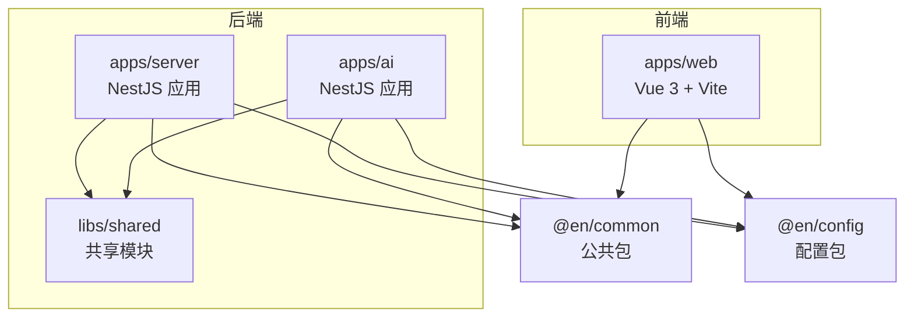
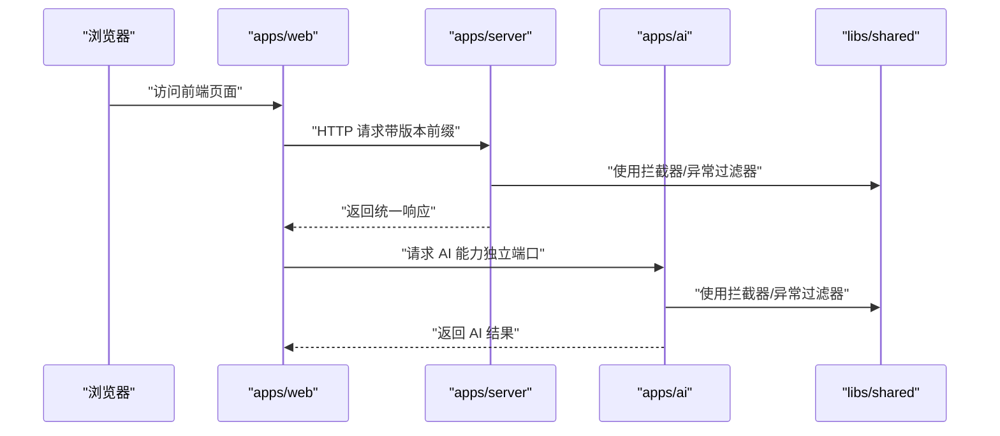
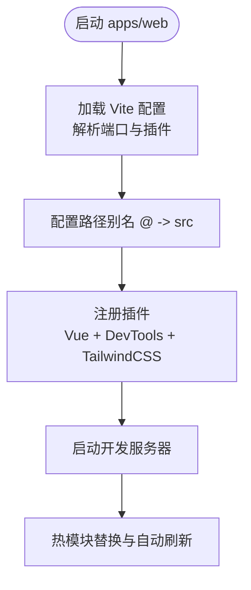
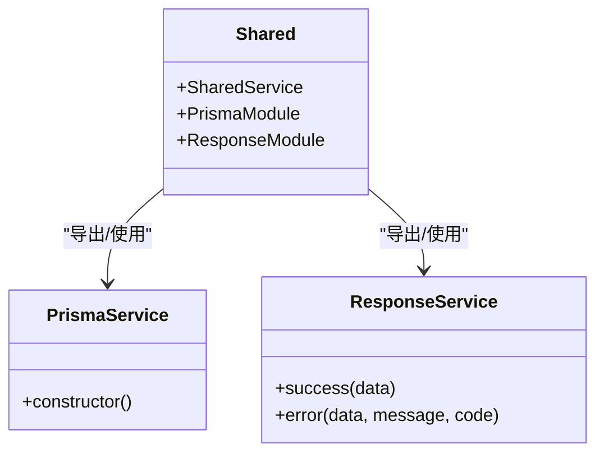
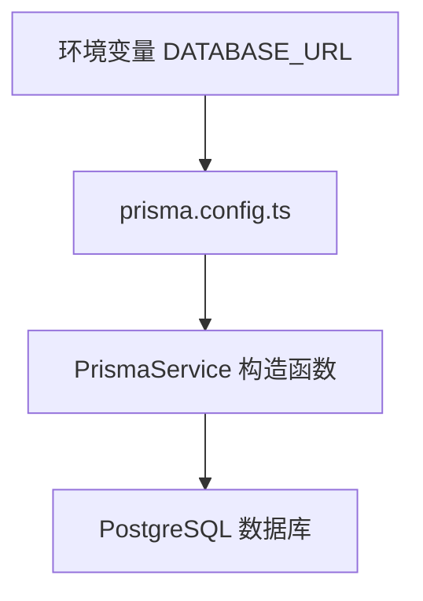
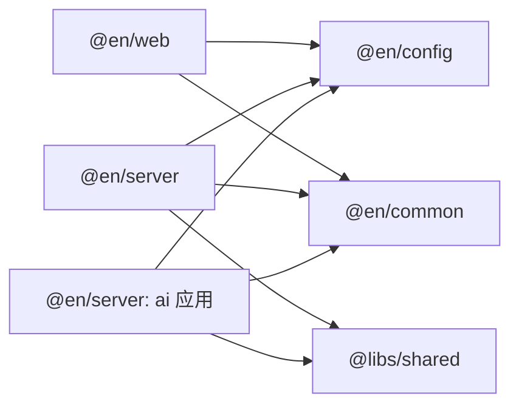

# 开发流程

<cite>
**本文引用的文件**
- [package.json](file://package.json)
- [pnpm-workspace.yaml](file://pnpm-workspace.yaml)
- [apps/web/package.json](file://apps/web/package.json)
- [apps/web/vite.config.ts](file://apps/web/vite.config.ts)
- [apps/web/src/main.ts](file://apps/web/src/main.ts)
- [server/package.json](file://server/package.json)
- [server/nest-cli.json](file://server/nest-cli.json)
- [server/apps/server/src/main.ts](file://server/apps/server/src/main.ts)
- [server/apps/ai/src/main.ts](file://server/apps/ai/src/main.ts)
- [server/prisma.config.ts](file://server/prisma.config.ts)
- [server/libs/shared/src/shared.module.ts](file://server/libs/shared/src/shared.module.ts)
- [server/libs/shared/src/prisma/prisma.service.ts](file://server/libs/shared/src/prisma/prisma.service.ts)
- [server/libs/shared/src/response/response.service.ts](file://server/libs/shared/src/response/response.service.ts)
- [packages/common/package.json](file://packages/common/package.json)
- [packages/config/package.json](file://packages/config/package.json)
</cite>

## 目录
1. [简介](#简介)
2. [项目结构](#项目结构)
3. [核心组件](#核心组件)
4. [架构总览](#架构总览)
5. [详细组件分析](#详细组件分析)
6. [依赖分析](#依赖分析)
7. [性能考虑](#性能考虑)
8. [故障排查指南](#故障排查指南)
9. [结论](#结论)
10. [附录](#附录)

## 简介
本文件面向英语学习平台的开发团队，系统化阐述基于 Monorepo 的开发工作流程与最佳实践，覆盖多包并行开发、依赖管理、构建与运行、热重载与并发启动、环境变量与端口管理、服务间通信等主题。通过 pnpm workspace 组织前端 Web 应用、后端 NestJS 服务（含 AI 子应用）、共享库与公共包，配合统一的脚本与配置，实现高效协作与一致体验。

## 项目结构
项目采用 pnpm workspace 的 Monorepo 架构，主要由以下部分组成：
- apps/web：基于 Vue 3 + Vite 的前端应用，负责用户界面与交互。
- server：基于 NestJS 的后端应用，包含两个子应用：
  - apps/server：通用业务服务（REST API 根模块）
  - apps/ai：AI 能力服务（独立监听端口）
- libs/shared：共享库，提供拦截器、异常过滤器、Prisma 数据访问、响应封装等能力。
- packages/common、packages/config：公共包，供各应用复用。
- 顶层 package.json：统一脚本入口，支持 web、server、ai 单体或 all 并发启动。

图表来源
- [pnpm-workspace.yaml:1-10](file://pnpm-workspace.yaml#L1-L10)
- [apps/web/package.json:1-45](file://apps/web/package.json#L1-L45)
- [server/package.json:1-52](file://server/package.json#L1-L52)
- [server/nest-cli.json:14-42](file://server/nest-cli.json#L14-L42)

章节来源
- [pnpm-workspace.yaml:1-10](file://pnpm-workspace.yaml#L1-L10)
- [apps/web/package.json:1-45](file://apps/web/package.json#L1-L45)
- [server/package.json:1-52](file://server/package.json#L1-L52)
- [server/nest-cli.json:14-42](file://server/nest-cli.json#L14-L42)

## 核心组件
- 前端 Web 应用
  - 使用 Vite 提供热重载与快速构建；通过别名简化路径导入；集成 TailwindCSS 与 Vue DevTools。
  - 启动端口来自配置包；开发时自动重启与热更新。
- 后端服务
  - apps/server：通用业务服务，启用 URI 版本控制、全局前缀、全局拦截器与异常过滤器；监听配置端口。
  - apps/ai：AI 专用服务，独立监听端口，复用共享库能力。
  - libs/shared：提供 Prisma 数据访问、统一响应封装、全局拦截与异常处理。
- 公共与配置包
  - @en/common：公共逻辑与约定。
  - @en/config：集中式配置（如端口），被前端与后端共同消费。

章节来源
- [apps/web/vite.config.ts:10-24](file://apps/web/vite.config.ts#L10-L24)
- [apps/web/src/main.ts:1-21](file://apps/web/src/main.ts#L1-L21)
- [server/apps/server/src/main.ts:8-19](file://server/apps/server/src/main.ts#L8-L19)
- [server/apps/ai/src/main.ts:7-13](file://server/apps/ai/src/main.ts#L7-L13)
- [server/libs/shared/src/shared.module.ts:1-13](file://server/libs/shared/src/shared.module.ts#L1-L13)
- [packages/common/package.json:1-21](file://packages/common/package.json#L1-L21)
- [packages/config/package.json:1-24](file://packages/config/package.json#L1-L24)

## 架构总览
下图展示从浏览器到后端服务的整体调用链路，以及共享库在后端中的作用。

图表来源
- [apps/web/src/main.ts:1-21](file://apps/web/src/main.ts#L1-L21)
- [server/apps/server/src/main.ts:8-19](file://server/apps/server/src/main.ts#L8-L19)
- [server/apps/ai/src/main.ts:7-13](file://server/apps/ai/src/main.ts#L7-L13)
- [server/libs/shared/src/shared.module.ts:1-13](file://server/libs/shared/src/shared.module.ts#L1-L13)

## 详细组件分析

### 前端 Web 应用（apps/web）
- 技术栈与特性
  - Vue 3 + Vite：快速冷启动与热重载；开发服务器端口由配置包提供。
  - Pinia 状态管理与持久化插件；Element Plus 国际化与样式。
  - 别名 @ 指向 src，提升导入可读性。
- 关键配置
  - Vite 配置中指定开发服务器端口与插件（TailwindCSS、Vue DevTools）。
  - 依赖中包含 @en/common 与 @en/config，体现跨包复用。
- 启动与热重载
  - 通过 Vite 内置的开发服务器实现热重载与自动重启；修改源码后即时生效。

图表来源
- [apps/web/vite.config.ts:10-24](file://apps/web/vite.config.ts#L10-L24)
- [apps/web/src/main.ts:1-21](file://apps/web/src/main.ts#L1-L21)

章节来源
- [apps/web/package.json:1-45](file://apps/web/package.json#L1-L45)
- [apps/web/vite.config.ts:10-24](file://apps/web/vite.config.ts#L10-L24)
- [apps/web/src/main.ts:1-21](file://apps/web/src/main.ts#L1-L21)

### 后端服务（apps/server 与 apps/ai）
- 应用结构
  - apps/server：通用业务服务，启用 URI 版本控制、全局前缀、全局拦截器与异常过滤器。
  - apps/ai：AI 专用服务，独立监听端口，同样复用共享能力。
- 共享库（libs/shared）
  - 全局模块导出 Prisma 与响应模块，统一拦截与异常处理。
  - PrismaService 基于环境变量连接数据库。
  - ResponseService 提供统一的成功/错误响应格式。
- 启动与端口
  - 两应用均从配置包读取端口；开发模式下通过 Nest CLI 监听并自动重启。

图表来源
- [server/libs/shared/src/shared.module.ts:1-13](file://server/libs/shared/src/shared.module.ts#L1-L13)
- [server/libs/shared/src/prisma/prisma.service.ts:1-18](file://server/libs/shared/src/prisma/prisma.service.ts#L1-L18)
- [server/libs/shared/src/response/response.service.ts:1-29](file://server/libs/shared/src/response/response.service.ts#L1-L29)

章节来源
- [server/apps/server/src/main.ts:8-19](file://server/apps/server/src/main.ts#L8-L19)
- [server/apps/ai/src/main.ts:7-13](file://server/apps/ai/src/main.ts#L7-L13)
- [server/libs/shared/src/shared.module.ts:1-13](file://server/libs/shared/src/shared.module.ts#L1-L13)
- [server/libs/shared/src/prisma/prisma.service.ts:1-18](file://server/libs/shared/src/prisma/prisma.service.ts#L1-L18)
- [server/libs/shared/src/response/response.service.ts:1-29](file://server/libs/shared/src/response/response.service.ts#L1-L29)

### 配置与数据库（@en/config 与 Prisma）
- 配置包（@en/config）
  - 提供统一的端口等配置常量，被前端与后端应用消费。
- 数据库（Prisma）
  - 通过环境变量 DATABASE_URL 连接数据库；迁移目录与 schema 在 prisma 目录中管理。
  - PrismaService 封装适配器与客户端初始化。

图表来源
- [server/prisma.config.ts:6-14](file://server/prisma.config.ts#L6-L14)
- [server/libs/shared/src/prisma/prisma.service.ts:6-17](file://server/libs/shared/src/prisma/prisma.service.ts#L6-L17)

章节来源
- [packages/config/package.json:1-24](file://packages/config/package.json#L1-L24)
- [server/prisma.config.ts:1-15](file://server/prisma.config.ts#L1-L15)
- [server/libs/shared/src/prisma/prisma.service.ts:1-18](file://server/libs/shared/src/prisma/prisma.service.ts#L1-L18)

## 依赖分析
- 包间依赖关系
  - apps/web 依赖 @en/common 与 @en/config。
  - server 应用（apps/server、apps/ai）依赖 @en/common、@en/config 与 libs/shared。
  - libs/shared 依赖 Prisma 与响应模块，向上提供统一能力。
- pnpm workspace 工作原理
  - 通过 pnpm-workspace.yaml 声明工作区范围，使多包共享依赖树与链接本地包。
  - workspace:* 语义确保本地包以符号链接方式安装，避免重复构建与版本漂移。
- 允许构建与锁定
  - workspace.yaml 中允许对特定包进行构建控制，保证 Prisma 与 NestJS 引擎等外部依赖按需编译。

图表来源
- [pnpm-workspace.yaml:1-10](file://pnpm-workspace.yaml#L1-L10)
- [apps/web/package.json:15-16](file://apps/web/package.json#L15-L16)
- [server/package.json:23-24](file://server/package.json#L23-L24)

章节来源
- [pnpm-workspace.yaml:1-10](file://pnpm-workspace.yaml#L1-L10)
- [apps/web/package.json:15-16](file://apps/web/package.json#L15-L16)
- [server/package.json:23-24](file://server/package.json#L23-L24)

## 性能考虑
- 并发启动与资源占用
  - 使用 concurrently 并发启动 web、server、ai，建议在本地资源充足时开启；若内存紧张，可分步启动。
- 热重载与增量编译
  - Vite 与 Nest CLI 的 watch 模式仅重编译受影响模块，减少等待时间。
- 依赖去重与链接
  - workspace:* 与 pnpm 的符号链接机制降低磁盘占用与安装时间。
- 数据库连接
  - PrismaService 复用连接适配器，避免频繁重建连接；生产环境建议使用连接池参数优化。

## 故障排查指南
- 端口冲突
  - 前端与后端分别从配置包读取端口，若冲突请在配置包中调整对应端口值。
- 环境变量未生效
  - 确认 Prisma 与 NestJS 应用均正确加载 .env 文件；检查 DATABASE_URL 是否指向有效数据库。
- 热重载不生效
  - 检查 Vite 插件与配置是否正确；确认未禁用 HMR；尝试清理缓存后重启。
- 共享库未生效
  - 确保 @en/config 与 @en/common 的版本满足 workspace:*；必要时执行 pnpm install 重新链接。
- 并发启动失败
  - 若某应用启动报错，先单独启动该应用定位问题；再逐步恢复 all 并发启动。

章节来源
- [apps/web/vite.config.ts:10-13](file://apps/web/vite.config.ts#L10-L13)
- [server/apps/server/src/main.ts:12-17](file://server/apps/server/src/main.ts#L12-L17)
- [server/apps/ai/src/main.ts:10-11](file://server/apps/ai/src/main.ts#L10-L11)
- [server/prisma.config.ts:3-14](file://server/prisma.config.ts#L3-L14)

## 结论
本项目通过 pnpm workspace 实现多包协同开发，结合 Vite 与 Nest CLI 的热重载与自动重启能力，形成高效的本地开发体验。统一的配置包与共享库提升了代码复用与一致性。建议团队遵循本文档的脚本与端口规范，配合并发启动策略，保障开发效率与协作质量。

## 附录

### 开发命令与使用说明
- 单体启动
  - 启动前端 Web：在根目录执行相应脚本，内部通过 filter 定位 @en/web。
  - 启动后端通用服务：通过 filter 定位 @en/server 并启用开发模式。
  - 启动 AI 服务：通过 filter 定位 @en/server 并选择 ai 子应用。
- 并发启动 all
  - 使用 concurrently 同时启动 web、server、ai，适合全栈联调场景。
- 构建与预览
  - 前端：提供 build 与 preview 脚本，支持类型检查与打包。
  - 后端：提供 build 与 start:prod 脚本，用于生产部署。

章节来源
- [package.json:2-6](file://package.json#L2-L6)
- [apps/web/package.json:6-11](file://apps/web/package.json#L6-L11)
- [server/package.json:8-20](file://server/package.json#L8-L20)

### 端口与环境变量配置
- 端口来源
  - 前端开发端口：来自 @en/config 的配置常量。
  - 后端通用服务端口：来自 @en/config 的配置常量。
  - AI 服务端口：来自 @en/config 的配置常量。
- 数据库连接
  - 通过 DATABASE_URL 环境变量连接 PostgreSQL；Prisma 配置文件加载 .env 并指定 schema 与 migrations 路径。

章节来源
- [apps/web/vite.config.ts:11-13](file://apps/web/vite.config.ts#L11-L13)
- [server/apps/server/src/main.ts:12-17](file://server/apps/server/src/main.ts#L12-L17)
- [server/apps/ai/src/main.ts:10-11](file://server/apps/ai/src/main.ts#L10-L11)
- [server/prisma.config.ts:3-14](file://server/prisma.config.ts#L3-L14)

### 服务间通信与版本控制
- 版本控制
  - 后端启用 URI 版本控制与默认版本 v1，便于演进与兼容。
- 全局拦截与异常处理
  - 全局拦截器与异常过滤器统一处理请求与错误，保证响应格式一致。
- 共享能力
  - 通过 libs/shared 导出 Prisma 与响应模块，减少重复实现。

章节来源
- [server/apps/server/src/main.ts:12-16](file://server/apps/server/src/main.ts#L12-L16)
- [server/libs/shared/src/shared.module.ts:6-12](file://server/libs/shared/src/shared.module.ts#L6-L12)
- [server/libs/shared/src/response/response.service.ts:13-28](file://server/libs/shared/src/response/response.service.ts#L13-L28)