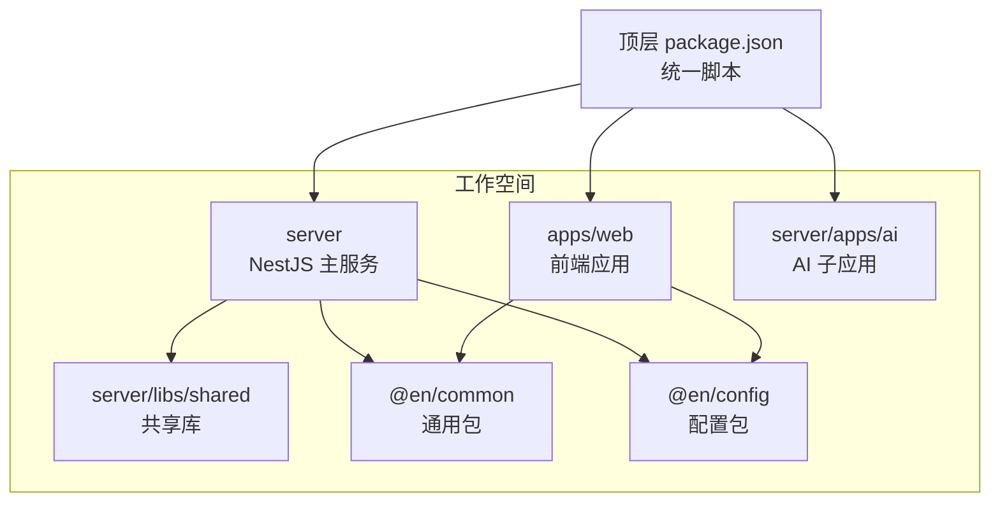
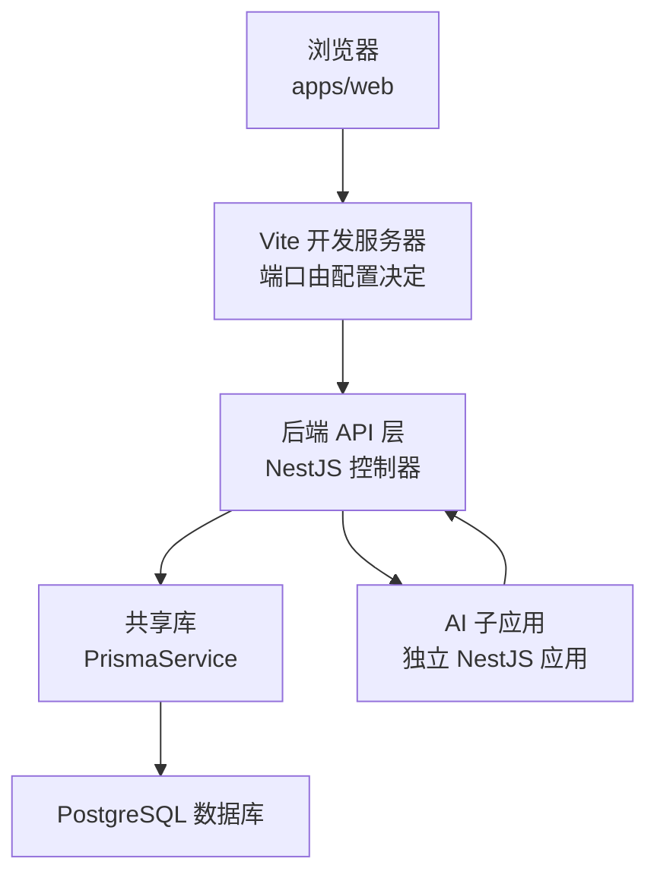
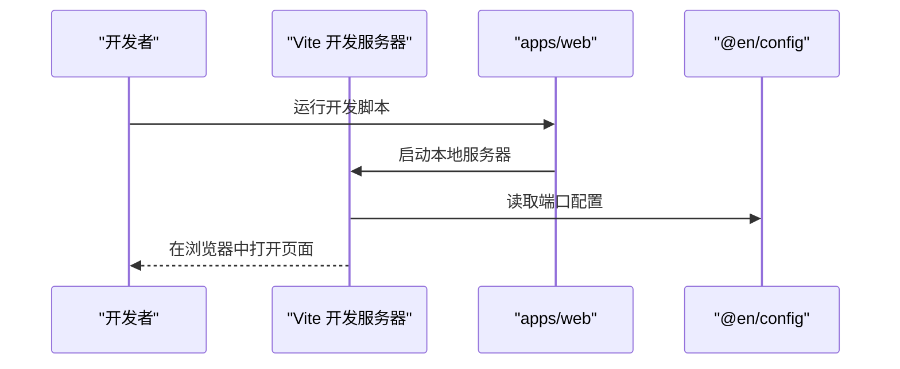
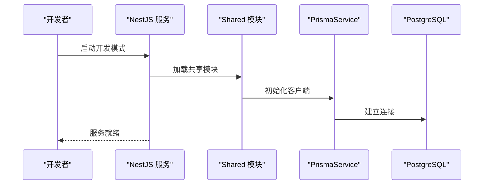
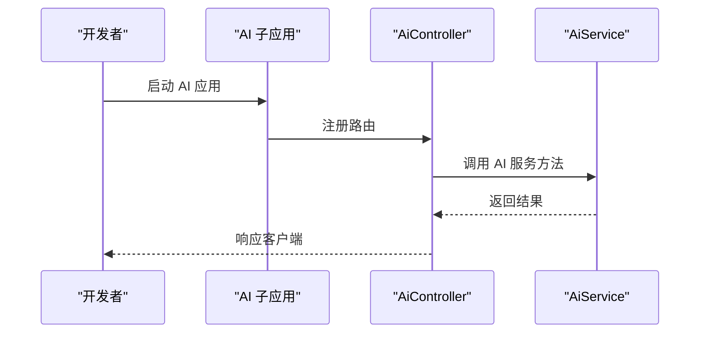
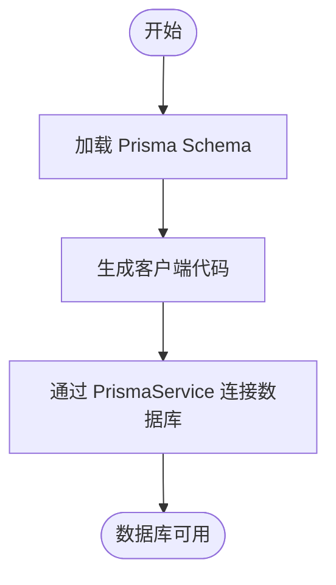
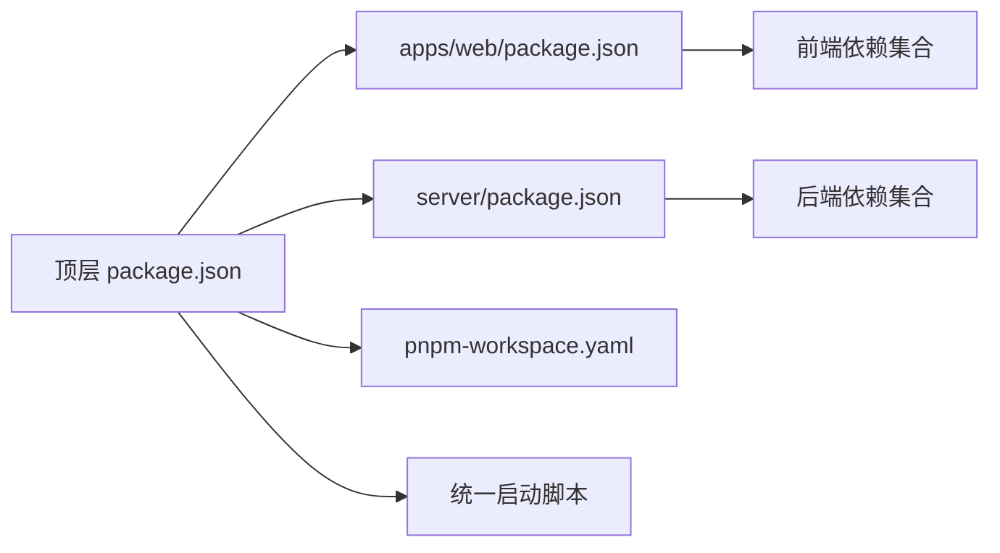

# 快速开始

<cite>
**本文引用的文件**
- [README.md](file://README.md)
- [package.json](file://package.json)
- [pnpm-workspace.yaml](file://pnpm-workspace.yaml)
- [apps/web/package.json](file://apps/web/package.json)
- [apps/web/vite.config.ts](file://apps/web/vite.config.ts)
- [apps/web/src/main.ts](file://apps/web/src/main.ts)
- [server/package.json](file://server/package.json)
- [server/nest-cli.json](file://server/nest-cli.json)
- [server/prisma/schema.prisma](file://server/prisma/schema.prisma)
- [server/libs/shared/src/prisma/prisma.service.ts](file://server/libs/shared/src/prisma/prisma.service.ts)
- [server/apps/server/src/app.module.ts](file://server/apps/server/src/app.module.ts)
- [server/apps/ai/src/ai.module.ts](file://server/apps/ai/src/ai.module.ts)
</cite>

## 目录
1. [简介](#简介)
2. [项目结构](#项目结构)
3. [核心组件](#核心组件)
4. [架构总览](#架构总览)
5. [详细组件分析](#详细组件分析)
6. [依赖分析](#依赖分析)
7. [性能考虑](#性能考虑)
8. [故障排除指南](#故障排除指南)
9. [结论](#结论)
10. [附录](#附录)

## 简介
本指南面向新加入的开发者，帮助你从零开始完成英语学习平台项目的环境准备、依赖安装与启动。项目采用 Monorepo 架构，使用 pnpm 工作空间管理多个包（前端 Web 应用、后端 NestJS 服务、共享库与 Prisma 数据模型），并通过脚本统一启动前端、后端与 AI 子服务。

## 项目结构
项目采用 Monorepo 结构，主要目录与职责如下：
- apps/web：基于 Vue 3 的前端应用，使用 Vite 开发服务器与 TailwindCSS 样式框架。
- server：基于 NestJS 的后端服务，包含主服务与 AI 子应用，使用 Prisma 连接 PostgreSQL。
- packages：共享包（当前包含 common 与 config）。
- pnpm-workspace.yaml：声明工作空间范围与允许构建的包。
- 顶层 package.json：提供统一的开发与启动脚本，便于同时启动多端。

**图表来源**
- [pnpm-workspace.yaml:1-10](file://pnpm-workspace.yaml#L1-L10)
- [package.json:1-15](file://package.json#L1-L15)
- [apps/web/package.json:1-45](file://apps/web/package.json#L1-L45)
- [server/package.json:1-52](file://server/package.json#L1-L52)

**章节来源**
- [pnpm-workspace.yaml:1-10](file://pnpm-workspace.yaml#L1-L10)
- [package.json:1-15](file://package.json#L1-L15)

## 核心组件
- 前端应用（apps/web）
  - 使用 Vite 作为开发服务器与打包工具，支持 Vue 3、TypeScript、TailwindCSS。
  - Node.js 版本要求在工程内通过 engines 字段声明。
- 后端服务（server）
  - NestJS 应用，包含用户模块与共享库；Prisma 用于数据访问。
  - 通过 nest-cli.json 定义多项目结构（server、ai、shared）。
- AI 子服务（server/apps/ai）
  - 独立的 NestJS 应用，提供 AI 相关接口与聊天能力。
- 共享库（server/libs/shared）
  - 包含 Prisma 客户端生成物与共享服务（如 PrismaService）。

**章节来源**
- [apps/web/package.json:1-45](file://apps/web/package.json#L1-L45)
- [apps/web/vite.config.ts:1-25](file://apps/web/vite.config.ts#L1-L25)
- [server/package.json:1-52](file://server/package.json#L1-L52)
- [server/nest-cli.json:1-43](file://server/nest-cli.json#L1-L43)
- [server/libs/shared/src/prisma/prisma.service.ts:1-18](file://server/libs/shared/src/prisma/prisma.service.ts#L1-L18)

## 架构总览
下图展示了从浏览器到后端与 AI 服务的整体交互路径，以及数据库层的数据流。

**图表来源**
- [apps/web/vite.config.ts:10-24](file://apps/web/vite.config.ts#L10-L24)
- [server/apps/server/src/app.module.ts:1-13](file://server/apps/server/src/app.module.ts#L1-L13)
- [server/apps/ai/src/ai.module.ts:1-12](file://server/apps/ai/src/ai.module.ts#L1-L12)
- [server/libs/shared/src/prisma/prisma.service.ts:1-18](file://server/libs/shared/src/prisma/prisma.service.ts#L1-L18)

## 详细组件分析

### 前端应用（apps/web）
- 启动方式
  - 开发模式：使用 Vite 启动本地开发服务器。
  - 构建与预览：支持类型检查、构建与预览命令。
- 关键点
  - 别名与插件：通过别名简化导入路径，启用 Vue DevTools 与 TailwindCSS。
  - Node.js 版本：通过 engines 字段声明兼容版本范围。
- 与配置包的关系
  - 通过配置包导出的端口等常量，统一前端开发服务器端口。

**图表来源**
- [apps/web/vite.config.ts:10-24](file://apps/web/vite.config.ts#L10-L24)
- [apps/web/src/main.ts:1-21](file://apps/web/src/main.ts#L1-L21)

**章节来源**
- [apps/web/package.json:6-12](file://apps/web/package.json#L6-L12)
- [apps/web/vite.config.ts:1-25](file://apps/web/vite.config.ts#L1-L25)
- [apps/web/src/main.ts:1-21](file://apps/web/src/main.ts#L1-L21)

### 后端服务（server）
- 启动方式
  - 开发模式：通过 Nest CLI 启动监听模式，自动重启。
  - 生产模式：构建后运行 dist 目录中的入口文件。
- 项目结构
  - 主服务与 AI 子应用分别位于不同根目录，通过 nest-cli.json 统一管理。
- 数据库连接
  - 通过 PrismaService 以适配器方式连接 PostgreSQL，连接字符串来自环境变量。

**图表来源**
- [server/nest-cli.json:14-42](file://server/nest-cli.json#L14-L42)
- [server/apps/server/src/app.module.ts:1-13](file://server/apps/server/src/app.module.ts#L1-L13)
- [server/libs/shared/src/prisma/prisma.service.ts:1-18](file://server/libs/shared/src/prisma/prisma.service.ts#L1-L18)

**章节来源**
- [server/package.json:8-21](file://server/package.json#L8-L21)
- [server/nest-cli.json:1-43](file://server/nest-cli.json#L1-L43)
- [server/libs/shared/src/prisma/prisma.service.ts:1-18](file://server/libs/shared/src/prisma/prisma.service.ts#L1-L18)

### AI 子服务（server/apps/ai）
- 启动方式
  - 作为独立应用启动，与主服务同属 server 工作空间。
- 功能定位
  - 提供 AI 相关控制器与服务，处理聊天等业务逻辑。

**图表来源**
- [server/apps/ai/src/ai.module.ts:1-12](file://server/apps/ai/src/ai.module.ts#L1-L12)

**章节来源**
- [server/apps/ai/src/ai.module.ts:1-12](file://server/apps/ai/src/ai.module.ts#L1-L12)

### 数据库与迁移（Prisma）
- 数据库类型
  - 使用 PostgreSQL 作为数据源。
- 模型与索引
  - schema.prisma 定义了用户、单词、支付与课程等模型及关系。
- 生成与连接
  - Prisma 客户端生成输出至共享库目录，PrismaService 通过适配器连接数据库。

**图表来源**
- [server/prisma/schema.prisma:1-133](file://server/prisma/schema.prisma#L1-L133)
- [server/libs/shared/src/prisma/prisma.service.ts:1-18](file://server/libs/shared/src/prisma/prisma.service.ts#L1-L18)

**章节来源**
- [server/prisma/schema.prisma:1-133](file://server/prisma/schema.prisma#L1-L133)
- [server/libs/shared/src/prisma/prisma.service.ts:1-18](file://server/libs/shared/src/prisma/prisma.service.ts#L1-L18)

## 依赖分析
- 工作空间与包管理
  - pnpm-workspace.yaml 声明了 apps/*、packages/* 与 server 为工作空间成员，顶层 package.json 提供统一脚本。
- 前端依赖
  - Vue 3、TypeScript、Vite、Element Plus、TailwindCSS、Pinia 等。
- 后端依赖
  - NestJS 核心、Prisma 客户端与适配器、dotenv、RxJS 等。
- 脚本与并发
  - 顶层脚本提供 web、server、ai 与 all（并发启动）命令，便于一键启动全栈。

**图表来源**
- [package.json:1-15](file://package.json#L1-L15)
- [pnpm-workspace.yaml:1-10](file://pnpm-workspace.yaml#L1-L10)
- [apps/web/package.json:13-29](file://apps/web/package.json#L13-L29)
- [server/package.json:22-35](file://server/package.json#L22-L35)

**章节来源**
- [package.json:1-15](file://package.json#L1-L15)
- [pnpm-workspace.yaml:1-10](file://pnpm-workspace.yaml#L1-L10)
- [apps/web/package.json:13-29](file://apps/web/package.json#L13-L29)
- [server/package.json:22-35](file://server/package.json#L22-L35)

## 性能考虑
- 前端
  - 使用 Vite 的按需编译与热更新提升开发体验；生产构建时建议开启压缩与分包策略。
- 后端
  - NestJS 的模块化与依赖注入有助于控制内存占用；Prisma 查询优化与索引设计对性能影响显著。
- 数据库
  - 合理建立索引（如单词表的 word 与 tag 字段）可显著提升查询效率。

## 故障排除指南
- Node.js 版本不匹配
  - 现象：安装或运行时报错。
  - 处理：根据前端工程的 engines 字段要求安装符合范围的 Node.js 版本。
  - 参考：[apps/web/package.json:41-43](file://apps/web/package.json#L41-L43)
- pnpm 未安装或工作空间未识别
  - 现象：无法解析 workspace:* 依赖或找不到过滤器。
  - 处理：确保已安装 pnpm 并在仓库根目录执行安装；确认 pnpm-workspace.yaml 正确声明工作空间。
  - 参考：[pnpm-workspace.yaml:1-10](file://pnpm-workspace.yaml#L1-L10)
- 数据库连接失败
  - 现象：启动后端报数据库连接错误。
  - 处理：检查环境变量 DATABASE_URL 是否正确；确认 PostgreSQL 服务可用且网络可达。
  - 参考：[server/libs/shared/src/prisma/prisma.service.ts:1-18](file://server/libs/shared/src/prisma/prisma.service.ts#L1-L18)
- 前端端口冲突
  - 现象：Vite 启动失败提示端口被占用。
  - 处理：修改配置中的端口号或释放占用端口。
  - 参考：[apps/web/vite.config.ts:11-13](file://apps/web/vite.config.ts#L11-L13)
- 并发启动失败
  - 现象：all 脚本启动部分子服务失败。
  - 处理：逐个启动 web、server、ai，排查具体子系统日志。
  - 参考：[package.json:6-6](file://package.json#L6-L6)

**章节来源**
- [apps/web/package.json:41-43](file://apps/web/package.json#L41-L43)
- [pnpm-workspace.yaml:1-10](file://pnpm-workspace.yaml#L1-L10)
- [server/libs/shared/src/prisma/prisma.service.ts:1-18](file://server/libs/shared/src/prisma/prisma.service.ts#L1-L18)
- [apps/web/vite.config.ts:11-13](file://apps/web/vite.config.ts#L11-L13)
- [package.json:6-6](file://package.json#L6-L6)

## 结论
按照本指南完成环境准备与依赖安装后，你可以通过统一脚本快速启动前端、后端与 AI 服务。若遇到问题，请依据“故障排除指南”逐项排查。建议在开发过程中保持前后端与数据库的端口配置一致，并关注 Prisma 的索引与查询优化。

## 附录

### 环境准备与安装步骤
- 安装 Node.js
  - 根据前端工程的 engines 字段要求安装 Node.js。
  - 参考：[apps/web/package.json:41-43](file://apps/web/package.json#L41-L43)
- 安装 pnpm
  - 使用包管理器安装 pnpm。
- 初始化工作空间
  - 在仓库根目录执行安装，使 pnpm 识别工作空间。
  - 参考：[pnpm-workspace.yaml:1-10](file://pnpm-workspace.yaml#L1-L10)
- 安装项目依赖
  - 在根目录执行安装命令，安装所有包的依赖。
  - 参考：[package.json:1-15](file://package.json#L1-L15)

**章节来源**
- [apps/web/package.json:41-43](file://apps/web/package.json#L41-L43)
- [pnpm-workspace.yaml:1-10](file://pnpm-workspace.yaml#L1-L10)
- [package.json:1-15](file://package.json#L1-L15)

### 数据库初始化
- 准备 PostgreSQL
  - 确保本地或远端 PostgreSQL 服务可用，并准备好连接字符串。
- 设置环境变量
  - 将数据库连接字符串写入环境变量（PrismaService 会读取该变量）。
  - 参考：[server/libs/shared/src/prisma/prisma.service.ts:1-18](file://server/libs/shared/src/prisma/prisma.service.ts#L1-L18)
- 生成 Prisma 客户端
  - 根据 Prisma Schema 生成客户端代码。
  - 参考：[server/prisma/schema.prisma:7-11](file://server/prisma/schema.prisma#L7-L11)

**章节来源**
- [server/libs/shared/src/prisma/prisma.service.ts:1-18](file://server/libs/shared/src/prisma/prisma.service.ts#L1-L18)
- [server/prisma/schema.prisma:7-11](file://server/prisma/schema.prisma#L7-L11)

### 启动项目
- 启动前端应用
  - 在根目录执行前端开发脚本，启动 Vite 开发服务器。
  - 参考：[apps/web/package.json:7-7](file://apps/web/package.json#L7-L7)
- 启动后端服务
  - 在根目录执行后端开发脚本，启动 NestJS 服务。
  - 参考：[server/package.json:12-12](file://server/package.json#L12-L12)
- 启动 AI 服务
  - 在根目录执行 AI 子应用开发脚本，启动独立的 NestJS 应用。
  - 参考：[package.json:5-5](file://package.json#L5-L5)
- 一键启动全部
  - 使用统一脚本并发启动前端、后端与 AI。
  - 参考：[package.json:6-6](file://package.json#L6-L6)

**章节来源**
- [apps/web/package.json:7-7](file://apps/web/package.json#L7-L7)
- [server/package.json:12-12](file://server/package.json#L12-L12)
- [package.json:5-5](file://package.json#L5-L5)
- [package.json:6-6](file://package.json#L6-L6)

### 验证项目是否正确运行
- 前端页面
  - 浏览器访问前端开发服务器地址（端口由配置决定）。
  - 参考：[apps/web/vite.config.ts:11-13](file://apps/web/vite.config.ts#L11-L13)
- 后端接口
  - 访问后端健康检查或示例接口，确认服务正常。
  - 参考：[server/apps/server/src/app.module.ts:1-13](file://server/apps/server/src/app.module.ts#L1-L13)
- AI 接口
  - 访问 AI 子应用相关接口，确认 AI 服务能力。
  - 参考：[server/apps/ai/src/ai.module.ts:1-12](file://server/apps/ai/src/ai.module.ts#L1-L12)
- 数据库连通性
  - 通过 PrismaService 成功连接数据库，无连接错误。
  - 参考：[server/libs/shared/src/prisma/prisma.service.ts:1-18](file://server/libs/shared/src/prisma/prisma.service.ts#L1-L18)

**章节来源**
- [apps/web/vite.config.ts:11-13](file://apps/web/vite.config.ts#L11-L13)
- [server/apps/server/src/app.module.ts:1-13](file://server/apps/server/src/app.module.ts#L1-L13)
- [server/apps/ai/src/ai.module.ts:1-12](file://server/apps/ai/src/ai.module.ts#L1-L12)
- [server/libs/shared/src/prisma/prisma.service.ts:1-18](file://server/libs/shared/src/prisma/prisma.service.ts#L1-L18)