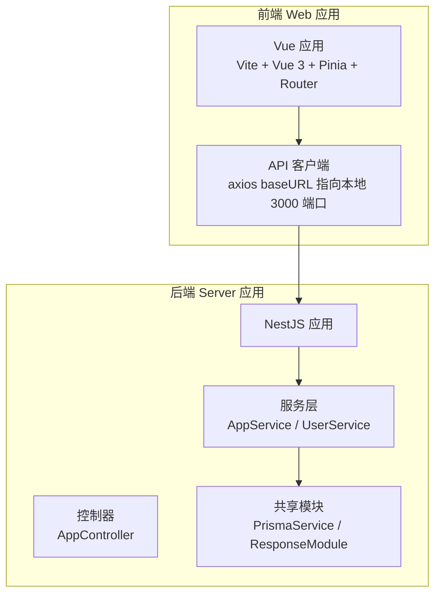
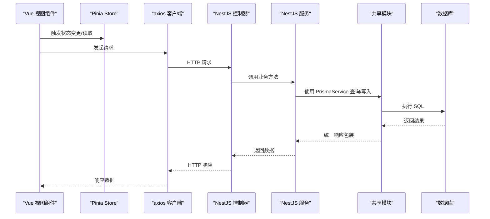
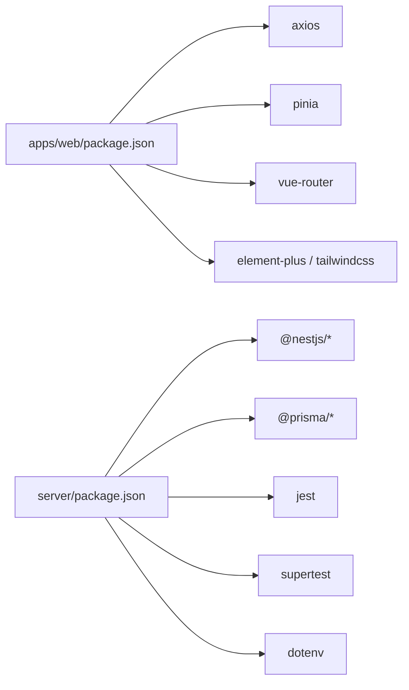

# 测试指南

<cite>
**本文引用的文件**
- [package.json](file://package.json)
- [pnpm-workspace.yaml](file://pnpm-workspace.yaml)
- [apps/web/package.json](file://apps/web/package.json)
- [apps/web/vite.config.ts](file://apps/web/vite.config.ts)
- [apps/web/src/apis/index.ts](file://apps/web/src/apis/index.ts)
- [apps/web/src/stores/counter.ts](file://apps/web/src/stores/counter.ts)
- [apps/web/src/views/Home/index.vue](file://apps/web/src/views/Home/index.vue)
- [apps/web/src/views/WordBook/index.vue](file://apps/web/src/views/WordBook/index.vue)
- [apps/web/src/layout/Header/index.vue](file://apps/web/src/layout/Header/index.vue)
- [apps/web/src/layout/Content/index.vue](file://apps/web/src/layout/Content/index.vue)
- [apps/web/src/layout/index.vue](file://apps/web/src/layout/index.vue)
- [apps/web/src/router/index.ts](file://apps/web/src/router/index.ts)
- [apps/web/src/router/home/index.ts](file://apps/web/src/router/home/index.ts)
- [apps/web/src/router/word-book/index.ts](file://apps/web/src/router/word-book/index.ts)
- [apps/web/src/main.ts](file://apps/web/src/main.ts)
- [server/package.json](file://server/package.json)
- [server/tsconfig.build.json](file://server/tsconfig.build.json)
- [server/libs/shared/src/index.ts](file://server/libs/shared/src/index.ts)
- [server/libs/shared/src/prisma/prisma.service.ts](file://server/libs/shared/src/prisma/prisma.service.ts)
- [server/libs/shared/src/response/response.module.ts](file://server/libs/shared/src/response/response.module.ts)
- [server/apps/server/src/app.controller.ts](file://server/apps/server/src/app.controller.ts)
- [server/apps/server/src/app.service.ts](file://server/apps/server/src/app.service.ts)
- [server/apps/server/src/user/user.service.ts](file://server/apps/server/src/user/user.service.ts)
- [server/apps/ai/src/ai.service.ts](file://server/apps/ai/src/ai.service.ts)
</cite>

## 目录
1. 引言
2. 项目结构
3. 核心组件
4. 架构总览
5. 详细组件分析
6. 依赖分析
7. 性能考虑
8. 故障排查指南
9. 结论
10. 附录

## 引言
本指南面向英语学习平台的测试策略与实施，覆盖单元测试、集成测试与端到端测试的编写方法，提供 Vue 组件测试、NestJS 服务测试与 API 测试的最佳实践。内容包括测试框架选择、工具配置、覆盖率要求、Mock 策略、测试数据管理、异步测试处理、TDD 流程、CI 中的测试执行与报告生成，并给出新功能开发的“测试先行”指导与测试用例模板。

## 项目结构
- 前端应用位于 apps/web，使用 Vite + Vue 3 + Pinia + Vue Router。
- 后端服务位于 server，使用 NestJS，采用 Monorepo 工作区（pnpm-workspace）组织。
- 共享模块位于 server/libs/shared，提供 Prisma 数据访问与统一响应封装。
- 应用入口与路由分别在前端与后端，通过 axios 客户端访问后端 API。

图表来源
- [apps/web/vite.config.ts:1-25](file://apps/web/vite.config.ts#L1-L25)
- [apps/web/src/apis/index.ts:1-6](file://apps/web/src/apis/index.ts#L1-L6)
- [server/apps/server/src/app.controller.ts:1-13](file://server/apps/server/src/app.controller.ts#L1-L13)
- [server/apps/server/src/app.service.ts:1-10](file://server/apps/server/src/app.service.ts#L1-L10)
- [server/libs/shared/src/prisma/prisma.service.ts:1-18](file://server/libs/shared/src/prisma/prisma.service.ts#L1-L18)
- [server/libs/shared/src/response/response.module.ts:1-8](file://server/libs/shared/src/response/response.module.ts#L1-L8)

章节来源
- [pnpm-workspace.yaml:1-10](file://pnpm-workspace.yaml#L1-L10)
- [apps/web/package.json:1-45](file://apps/web/package.json#L1-L45)
- [server/package.json:1-52](file://server/package.json#L1-L52)

## 核心组件
- 前端 API 客户端：基于 axios 创建，baseURL 指向本地 3000 端口，具备超时控制。
- 前端状态与路由：Pinia 计数器 Store、Vue Router 路由定义与页面视图。
- 后端控制器与服务：AppController 提供基础接口；AppService 展示依赖注入与数据库交互；UserService 展示业务逻辑与 Prisma 集成；AiService 展示简单服务示例。
- 共享模块：PrismaService 封装数据库连接；ResponseModule 提供统一响应封装。

章节来源
- [apps/web/src/apis/index.ts:1-6](file://apps/web/src/apis/index.ts#L1-L6)
- [apps/web/src/stores/counter.ts:1-13](file://apps/web/src/stores/counter.ts#L1-L13)
- [apps/web/src/router/index.ts](file://apps/web/src/router/index.ts)
- [apps/web/src/router/home/index.ts](file://apps/web/src/router/home/index.ts)
- [apps/web/src/router/word-book/index.ts](file://apps/web/src/router/word-book/index.ts)
- [apps/web/src/views/Home/index.vue](file://apps/web/src/views/Home/index.vue)
- [apps/web/src/views/WordBook/index.vue](file://apps/web/src/views/WordBook/index.vue)
- [apps/web/src/layout/Header/index.vue](file://apps/web/src/layout/Header/index.vue)
- [apps/web/src/layout/Content/index.vue](file://apps/web/src/layout/Content/index.vue)
- [apps/web/src/layout/index.vue](file://apps/web/src/layout/index.vue)
- [server/apps/server/src/app.controller.ts:1-13](file://server/apps/server/src/app.controller.ts#L1-L13)
- [server/apps/server/src/app.service.ts:1-10](file://server/apps/server/src/app.service.ts#L1-L10)
- [server/apps/server/src/user/user.service.ts:1-33](file://server/apps/server/src/user/user.service.ts#L1-L33)
- [server/apps/ai/src/ai.service.ts:1-9](file://server/apps/ai/src/ai.service.ts#L1-L9)
- [server/libs/shared/src/prisma/prisma.service.ts:1-18](file://server/libs/shared/src/prisma/prisma.service.ts#L1-L18)
- [server/libs/shared/src/response/response.module.ts:1-8](file://server/libs/shared/src/response/response.module.ts#L1-L8)

## 架构总览
下图展示从前端组件到后端服务与数据库的整体调用链路，以及测试关注点分布：

图表来源
- [apps/web/src/apis/index.ts:1-6](file://apps/web/src/apis/index.ts#L1-L6)
- [server/apps/server/src/app.controller.ts:1-13](file://server/apps/server/src/app.controller.ts#L1-L13)
- [server/apps/server/src/app.service.ts:1-10](file://server/apps/server/src/app.service.ts#L1-L10)
- [server/apps/server/src/user/user.service.ts:1-33](file://server/apps/server/src/user/user.service.ts#L1-L33)
- [server/libs/shared/src/prisma/prisma.service.ts:1-18](file://server/libs/shared/src/prisma/prisma.service.ts#L1-L18)

## 详细组件分析

### Vue 组件测试策略
- 单元测试目标：验证组件渲染、事件触发、props 传递、计算属性与 Pinia 状态联动。
- 推荐做法：
  - 使用测试运行器（如 Vitest 或 Jest）与 DOM 测试适配器（如 @vue/test-utils）。
  - 对于异步渲染与事件，使用 flushPromises 或等待工具。
  - Mock 外部依赖（如 axios、全局插件），确保测试隔离。
- 关键测试场景：
  - Header/Content/Layout 组合渲染与布局正确性。
  - Home/WordBook 页面路由导航与参数传递。
  - Counter Store 的计数、双倍值与增量行为。
- 参考文件路径：
  - [apps/web/src/layout/Header/index.vue](file://apps/web/src/layout/Header/index.vue)
  - [apps/web/src/layout/Content/index.vue](file://apps/web/src/layout/Content/index.vue)
  - [apps/web/src/layout/index.vue](file://apps/web/src/layout/index.vue)
  - [apps/web/src/views/Home/index.vue](file://apps/web/src/views/Home/index.vue)
  - [apps/web/src/views/WordBook/index.vue](file://apps/web/src/views/WordBook/index.vue)
  - [apps/web/src/stores/counter.ts](file://apps/web/src/stores/counter.ts)
  - [apps/web/src/router/index.ts](file://apps/web/src/router/index.ts)
  - [apps/web/src/router/home/index.ts](file://apps/web/src/router/home/index.ts)
  - [apps/web/src/router/word-book/index.ts](file://apps/web/src/router/word-book/index.ts)

章节来源
- [apps/web/src/stores/counter.ts:1-13](file://apps/web/src/stores/counter.ts#L1-L13)
- [apps/web/src/layout/Header/index.vue](file://apps/web/src/layout/Header/index.vue)
- [apps/web/src/layout/Content/index.vue](file://apps/web/src/layout/Content/index.vue)
- [apps/web/src/layout/index.vue](file://apps/web/src/layout/index.vue)
- [apps/web/src/views/Home/index.vue](file://apps/web/src/views/Home/index.vue)
- [apps/web/src/views/WordBook/index.vue](file://apps/web/src/views/WordBook/index.vue)
- [apps/web/src/router/index.ts](file://apps/web/src/router/index.ts)
- [apps/web/src/router/home/index.ts](file://apps/web/src/router/home/index.ts)
- [apps/web/src/router/word-book/index.ts](file://apps/web/src/router/word-book/index.ts)

### NestJS 服务测试策略
- 单元测试目标：验证服务方法的输入输出、异常分支、与 Prisma 的交互。
- 推荐做法：
  - 使用 @nestjs/testing 构建测试模块，按需替换 PrismaService 为 Mock。
  - 使用 ResponseModule 提供统一响应包装，便于断言。
  - 对异步方法（如数据库查询）进行等待与断言。
- 关键测试场景：
  - AppService 的基础返回值校验。
  - UserService 的 findAll 方法返回统一响应格式。
  - AiService 的简单方法返回值校验。
- 参考文件路径：
  - [server/apps/server/src/app.service.ts](file://server/apps/server/src/app.service.ts)
  - [server/apps/server/src/user/user.service.ts](file://server/apps/server/src/user/user.service.ts)
  - [server/apps/ai/src/ai.service.ts](file://server/apps/ai/src/ai.service.ts)
  - [server/libs/shared/src/response/response.module.ts](file://server/libs/shared/src/response/response.module.ts)
  - [server/libs/shared/src/prisma/prisma.service.ts](file://server/libs/shared/src/prisma/prisma.service.ts)

章节来源
- [server/apps/server/src/app.service.ts:1-10](file://server/apps/server/src/app.service.ts#L1-L10)
- [server/apps/server/src/user/user.service.ts:1-33](file://server/apps/server/src/user/user.service.ts#L1-L33)
- [server/apps/ai/src/ai.service.ts:1-9](file://server/apps/ai/src/ai.service.ts#L1-L9)
- [server/libs/shared/src/response/response.module.ts:1-8](file://server/libs/shared/src/response/response.module.ts#L1-L8)
- [server/libs/shared/src/prisma/prisma.service.ts:1-18](file://server/libs/shared/src/prisma/prisma.service.ts#L1-L18)

### API 测试策略
- 单元测试目标：验证控制器方法的路由、参数、返回码与响应体。
- 推荐做法：
  - 使用 Supertest 发送 HTTP 请求，结合 @nestjs/testing 构建测试应用。
  - Mock 数据库与外部服务，确保可重复性与稳定性。
  - 断言状态码、响应头与 JSON 结构。
- 关键测试场景：
  - AppController 的 GET 根路径返回值。
  - 用户相关路由（如列表、详情、更新、删除）的完整流程。
- 参考文件路径：
  - [server/apps/server/src/app.controller.ts](file://server/apps/server/src/app.controller.ts)
  - [server/apps/server/src/user/user.service.ts](file://server/apps/server/src/user/user.service.ts)

章节来源
- [server/apps/server/src/app.controller.ts:1-13](file://server/apps/server/src/app.controller.ts#L1-L13)
- [server/apps/server/src/user/user.service.ts:1-33](file://server/apps/server/src/user/user.service.ts#L1-L33)

### Mock 策略与测试数据管理
- Mock 策略：
  - 前端：对 axios 进行拦截，模拟不同响应与错误；对全局插件（如 Element Plus、Tailwind）进行浅 Mock。
  - 后端：使用 @nestjs/testing 的 Test.createTestingModule 替换 PrismaService 为 Spy/Mock 对象；对 ResponseService 进行 Mock 以断言统一响应。
- 测试数据管理：
  - 使用工厂函数或固定 fixtures 生成测试数据，确保幂等性。
  - 对数据库操作使用事务回滚或内存数据库（如 SQLite）以提升速度与隔离性。
- 异步测试处理：
  - 使用 async/await 与等待工具（如 waitFor、flushPromises）确保异步任务完成后再断言。
  - 对定时器、轮询与 SSE（如 @microsoft/fetch-event-source）进行时钟模拟与清理。

章节来源
- [apps/web/src/apis/index.ts:1-6](file://apps/web/src/apis/index.ts#L1-L6)
- [server/libs/shared/src/prisma/prisma.service.ts:1-18](file://server/libs/shared/src/prisma/prisma.service.ts#L1-L18)
- [server/libs/shared/src/response/response.module.ts:1-8](file://server/libs/shared/src/response/response.module.ts#L1-L8)

### 测试覆盖率要求
- 建议指标：
  - 行覆盖率：≥80%
  - 分支覆盖率：≥70%
  - 函数覆盖率：≥85%
  - 语句覆盖率：≥80%
- 覆盖率收集：
  - 前端：使用 Vitest/Jest 的覆盖率选项生成 lcov/html 报告。
  - 后端：使用 Jest 的覆盖率脚本（见 server/package.json）生成报告。
- 覆盖率配置参考：
  - 前端：在 Vite 配置中启用覆盖率（如 vitest.config 或 jest 配置）。
  - 后端：使用 Jest 的 coverage 相关选项与忽略规则（如排除生成代码与测试文件）。

章节来源
- [apps/web/vite.config.ts:1-25](file://apps/web/vite.config.ts#L1-L25)
- [server/package.json:16-20](file://server/package.json#L16-L20)
- [server/tsconfig.build.json:1-4](file://server/tsconfig.build.json#L1-L4)

### TDD 流程与测试先行开发
- TDD 步骤：
  1) 编写失败的测试用例（描述新功能的行为）。
  2) 编写最小实现使测试通过。
  3) 重构代码与测试，保持高内聚低耦合。
  4) 重复上述循环直至功能完善。
- 新功能测试模板（示例步骤，非代码）：
  - 前端：定义组件 props 与事件，编写渲染与交互测试；随后实现组件逻辑。
  - 后端：定义 DTO 与控制器路由，编写控制器与服务的单元测试；随后实现业务逻辑与数据库交互。
- 模板参考文件路径：
  - [apps/web/src/views/Home/index.vue](file://apps/web/src/views/Home/index.vue)
  - [apps/web/src/views/WordBook/index.vue](file://apps/web/src/views/WordBook/index.vue)
  - [apps/web/src/stores/counter.ts](file://apps/web/src/stores/counter.ts)
  - [server/apps/server/src/app.controller.ts](file://server/apps/server/src/app.controller.ts)
  - [server/apps/server/src/user/user.service.ts](file://server/apps/server/src/user/user.service.ts)

章节来源
- [apps/web/src/views/Home/index.vue](file://apps/web/src/views/Home/index.vue)
- [apps/web/src/views/WordBook/index.vue](file://apps/web/src/views/WordBook/index.vue)
- [apps/web/src/stores/counter.ts](file://apps/web/src/stores/counter.ts)
- [server/apps/server/src/app.controller.ts](file://server/apps/server/src/app.controller.ts)
- [server/apps/server/src/user/user.service.ts](file://server/apps/server/src/user/user.service.ts)

### 持续集成中的测试执行与报告生成
- CI 脚本建议：
  - 并行启动前端与后端服务（如 package.json 中的 all 脚本），或在 CI 中分别构建与运行。
  - 在后端执行 jest --coverage 生成覆盖率报告；在前端执行 vitest --coverage 生成报告。
- 报告与归档：
  - 收集 lcov/html 报告并在 CI 中上传归档或发布到报告平台。
- 参考脚本路径：
  - [package.json:2-6](file://package.json#L2-L6)
  - [server/package.json:16-20](file://server/package.json#L16-L20)

章节来源
- [package.json:2-6](file://package.json#L2-L6)
- [server/package.json:16-20](file://server/package.json#L16-L20)

## 依赖分析
- 前端依赖：axios 用于 API 调用；Pinia 用于状态管理；Vue Router 用于路由；TailwindCSS 与 Element Plus 用于 UI。
- 后端依赖：NestJS 核心模块；Prisma 客户端与适配器；Jest 与 Supertest 用于测试；dotenv 用于环境变量。
- 共享模块：PrismaService 作为数据库客户端；ResponseModule 提供统一响应封装。

图表来源
- [apps/web/package.json:13-29](file://apps/web/package.json#L13-L29)
- [server/package.json:22-35](file://server/package.json#L22-L35)

章节来源
- [apps/web/package.json:1-45](file://apps/web/package.json#L1-L45)
- [server/package.json:1-52](file://server/package.json#L1-L52)

## 性能考虑
- 测试性能优化：
  - 使用 Mock 替代真实网络与数据库，减少 IO。
  - 并行运行独立测试，避免不必要的串行等待。
  - 使用快照测试与最小化断言，降低测试复杂度。
- 前端测试性能：
  - 避免在测试中加载重型资源；对样式与动画进行快照或禁用。
- 后端测试性能：
  - 使用内存数据库或 Dockerized 数据库实例；在 CI 中缓存依赖以加速安装。

## 故障排查指南
- 常见问题与对策：
  - 端口冲突：确认前端 Vite 与后端 NestJS 端口不冲突；必要时修改配置。
  - 环境变量缺失：确保 DATABASE_URL 等环境变量在测试环境中可用。
  - Mock 不生效：检查测试模块的 provide 与 override 是否正确。
  - 异步断言失败：使用等待工具确保异步任务完成。
- 参考文件路径：
  - [apps/web/vite.config.ts:11-13](file://apps/web/vite.config.ts#L11-L13)
  - [server/libs/shared/src/prisma/prisma.service.ts:8-15](file://server/libs/shared/src/prisma/prisma.service.ts#L8-L15)

章节来源
- [apps/web/vite.config.ts:11-13](file://apps/web/vite.config.ts#L11-L13)
- [server/libs/shared/src/prisma/prisma.service.ts:8-15](file://server/libs/shared/src/prisma/prisma.service.ts#L8-L15)

## 结论
本测试指南围绕前端 Vue 组件、NestJS 服务与 API 提供了系统化的测试策略与实施要点。通过合理的 Mock 策略、测试数据管理与异步处理，结合覆盖率与 TDD 流程，可在 CI 中稳定地执行测试并产出高质量报告。建议从最小可行测试开始，逐步扩展到集成与端到端测试，确保功能演进的可靠性与可维护性。

## 附录
- 测试先行模板（步骤说明）
  - 前端组件：先定义渲染与交互断言，再实现组件逻辑。
  - 后端服务：先定义 DTO 与控制器路由，再实现服务与数据库交互。
- 覆盖率与 CI 集成建议
  - 前端：在 Vite 配置中启用覆盖率；后端：使用 Jest 覆盖率脚本；CI 中上传报告。