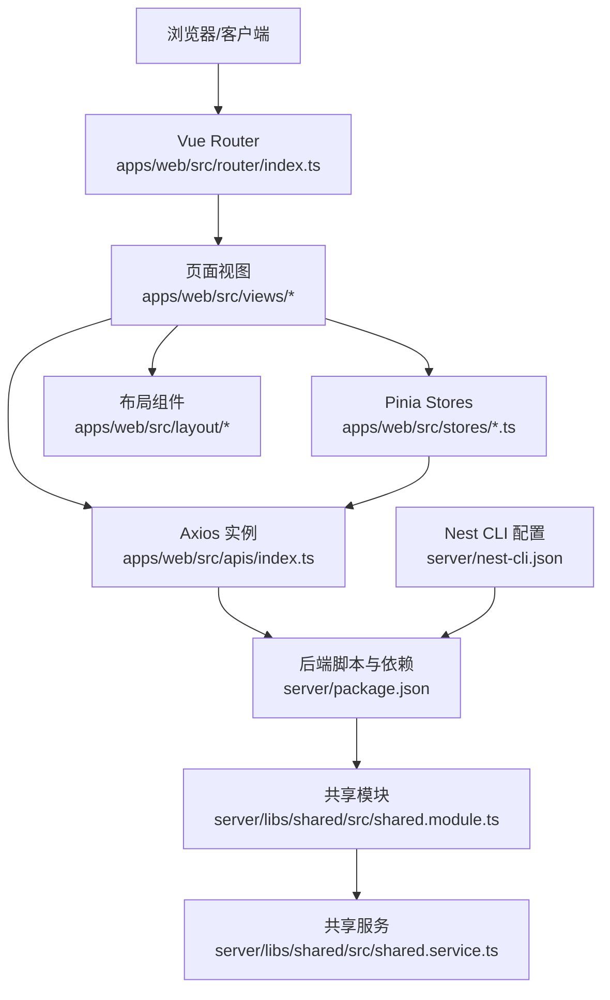
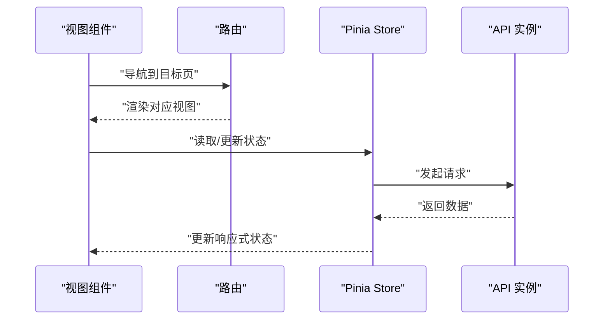
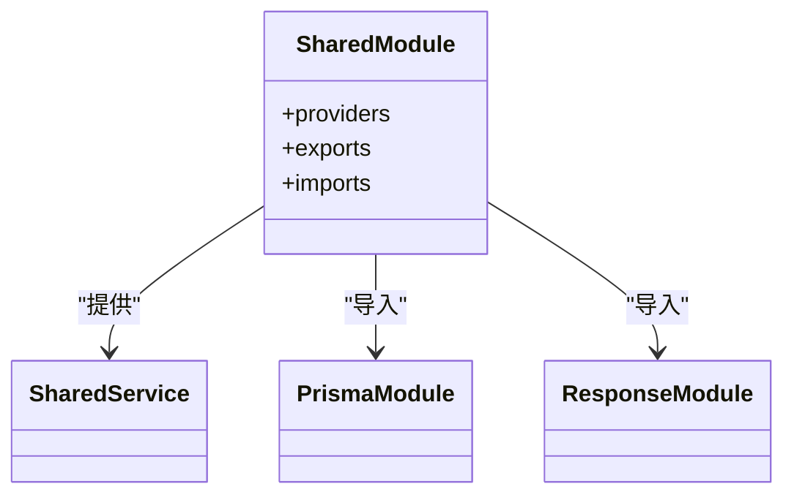
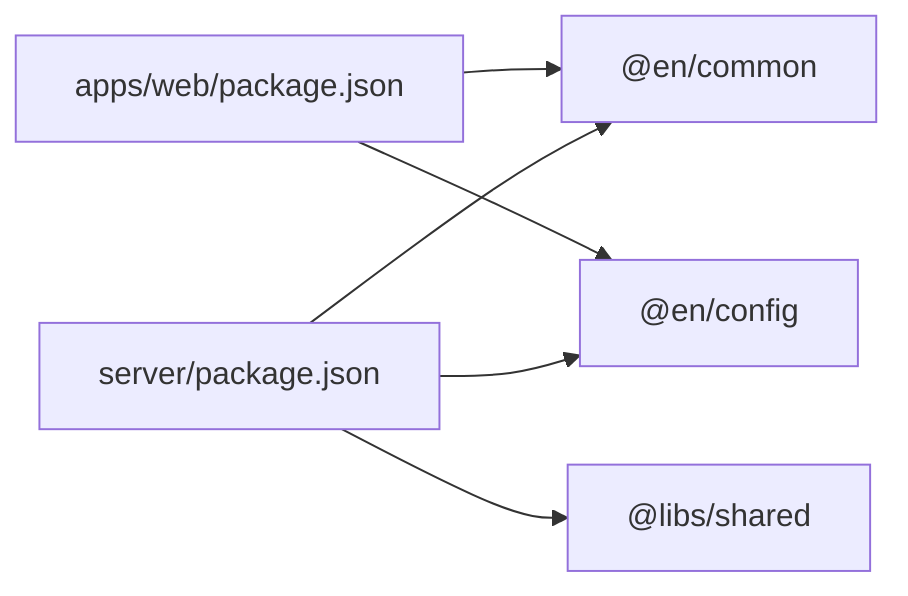

# 编码规范

<cite>
**本文引用的文件**   
- [apps/web/package.json](file://apps/web/package.json)
- [apps/web/tsconfig.json](file://apps/web/tsconfig.json)
- [apps/web/vite.config.ts](file://apps/web/vite.config.ts)
- [apps/web/src/stores/counter.ts](file://apps/web/src/stores/counter.ts)
- [apps/web/src/router/index.ts](file://apps/web/src/router/index.ts)
- [apps/web/src/apis/index.ts](file://apps/web/src/apis/index.ts)
- [apps/web/src/views/Home/index.vue](file://apps/web/src/views/Home/index.vue)
- [apps/web/src/layout/Content/index.vue](file://apps/web/src/layout/Content/index.vue)
- [apps/web/src/layout/Header/index.vue](file://apps/web/src/layout/Header/index.vue)
- [apps/web/src/layout/Profile/index.vue](file://apps/web/src/layout/Profile/index.vue)
- [apps/web/src/views/WordBook/index.vue](file://apps/web/src/views/WordBook/index.vue)
- [server/package.json](file://server/package.json)
- [server/tsconfig.json](file://server/tsconfig.json)
- [server/nest-cli.json](file://server/nest-cli.json)
- [server/libs/shared/src/shared.module.ts](file://server/libs/shared/src/shared.module.ts)
- [server/libs/shared/src/shared.service.ts](file://server/libs/shared/src/shared.service.ts)
- [packages/common/package.json](file://packages/common/package.json)
- [packages/config/package.json](file://packages/config/package.json)
</cite>

## 目录
1. [引言](#引言)
2. [项目结构](#项目结构)
3. [核心组件](#核心组件)
4. [架构总览](#架构总览)
5. [详细组件分析](#详细组件分析)
6. [依赖分析](#依赖分析)
7. [性能考虑](#性能考虑)
8. [故障排查指南](#故障排查指南)
9. [结论](#结论)
10. [附录](#附录)

## 引言
本指南面向英语学习平台的前端（Vue.js + TypeScript）与后端（NestJS）团队，提供统一的编码规范、最佳实践与工具链配置说明，覆盖命名约定、文件组织、注释标准、ESLint/Prettier/Git Hooks 配置、组件设计原则、状态管理规范、API 设计标准、代码审查清单、性能优化与安全实践，帮助团队提升代码质量与开发效率。

## 项目结构
该仓库采用 monorepo 结构，包含 Web 前端应用、Server 后端应用、共享库与配置包：
- apps/web：基于 Vite + Vue 3 + TypeScript 的前端应用
- server：基于 NestJS 的后端应用，包含多个子应用与共享库
- packages/common、packages/config：通用包与配置包，供多项目复用
- libs/shared：后端共享模块，提供全局模块、Prisma 与响应封装等能力

```mermaid
graph TB
subgraph "前端应用 apps/web"
WEB_PKG["apps/web/package.json"]
WEB_TS["apps/web/tsconfig.json"]
WEB_VITE["apps/web/vite.config.ts"]
WEB_ROUTER["apps/web/src/router/index.ts"]
WEB_APIS["apps/web/src/apis/index.ts"]
WEB_STORES["apps/web/src/stores/counter.ts"]
WEB_VIEWS["apps/web/src/views/*"]
WEB_LAYOUT["apps/web/src/layout/*"]
end
subgraph "后端应用 server"
SRV_PKG["server/package.json"]
SRV_TS["server/tsconfig.json"]
NEST_CLI["server/nest-cli.json"]
SHARED_MOD["server/libs/shared/src/shared.module.ts"]
SHARED_SRV["server/libs/shared/src/shared.service.ts"]
end
subgraph "共享包 packages"
COMMON_PKG["packages/common/package.json"]
CONFIG_PKG["packages/config/package.json"]
end
WEB_PKG --> COMMON_PKG
WEB_PKG --> CONFIG_PKG
SRV_PKG --> COMMON_PKG
SRV_PKG --> CONFIG_PKG
WEB_VITE --> CONFIG_PKG
SRV_TS --> SHARED_MOD
```

**图示来源**
- [apps/web/package.json:1-45](file://apps/web/package.json#L1-L45)
- [apps/web/tsconfig.json:1-12](file://apps/web/tsconfig.json#L1-L12)
- [apps/web/vite.config.ts:1-25](file://apps/web/vite.config.ts#L1-L25)
- [apps/web/src/router/index.ts:1-13](file://apps/web/src/router/index.ts#L1-L13)
- [apps/web/src/apis/index.ts:1-6](file://apps/web/src/apis/index.ts#L1-L6)
- [apps/web/src/stores/counter.ts:1-13](file://apps/web/src/stores/counter.ts#L1-L13)
- [apps/web/src/views/Home/index.vue:1-7](file://apps/web/src/views/Home/index.vue#L1-L7)
- [apps/web/src/layout/Content/index.vue](file://apps/web/src/layout/Content/index.vue)
- [apps/web/src/layout/Header/index.vue](file://apps/web/src/layout/Header/index.vue)
- [apps/web/src/layout/Profile/index.vue](file://apps/web/src/layout/Profile/index.vue)
- [apps/web/src/views/WordBook/index.vue](file://apps/web/src/views/WordBook/index.vue)
- [server/package.json:1-52](file://server/package.json#L1-L52)
- [server/tsconfig.json:1-35](file://server/tsconfig.json#L1-L35)
- [server/nest-cli.json:1-43](file://server/nest-cli.json#L1-L43)
- [server/libs/shared/src/shared.module.ts:1-13](file://server/libs/shared/src/shared.module.ts#L1-L13)
- [server/libs/shared/src/shared.service.ts:1-5](file://server/libs/shared/src/shared.service.ts#L1-L5)
- [packages/common/package.json:1-21](file://packages/common/package.json#L1-L21)
- [packages/config/package.json:1-24](file://packages/config/package.json#L1-L24)

**章节来源**
- [apps/web/package.json:1-45](file://apps/web/package.json#L1-L45)
- [apps/web/tsconfig.json:1-12](file://apps/web/tsconfig.json#L1-L12)
- [apps/web/vite.config.ts:1-25](file://apps/web/vite.config.ts#L1-L25)
- [server/package.json:1-52](file://server/package.json#L1-L52)
- [server/tsconfig.json:1-35](file://server/tsconfig.json#L1-L35)
- [server/nest-cli.json:1-43](file://server/nest-cli.json#L1-L43)
- [packages/common/package.json:1-21](file://packages/common/package.json#L1-L21)
- [packages/config/package.json:1-24](file://packages/config/package.json#L1-L24)

## 核心组件
- 前端路由与视图：使用 Vue Router 组合式路由定义，视图组件以目录+index.vue 形式组织，便于按功能模块拆分与维护。
- 状态管理：使用 Pinia，采用组合式 Store 定义，导出命名规范为 useXxxStore。
- API 客户端：基于 axios 创建统一实例，集中配置 baseURL 与超时时间。
- 后端共享模块：通过 @Global 装饰器提供全局可用的模块与服务，减少重复导入与耦合。
- 工具链：前端使用 Vite + Vue DevTools + TailwindCSS；后端使用 Nest CLI + ESLint + Prettier + Jest。

**章节来源**
- [apps/web/src/router/index.ts:1-13](file://apps/web/src/router/index.ts#L1-L13)
- [apps/web/src/views/Home/index.vue:1-7](file://apps/web/src/views/Home/index.vue#L1-L7)
- [apps/web/src/stores/counter.ts:1-13](file://apps/web/src/stores/counter.ts#L1-L13)
- [apps/web/src/apis/index.ts:1-6](file://apps/web/src/apis/index.ts#L1-L6)
- [server/libs/shared/src/shared.module.ts:1-13](file://server/libs/shared/src/shared.module.ts#L1-L13)
- [server/libs/shared/src/shared.service.ts:1-5](file://server/libs/shared/src/shared.service.ts#L1-L5)

## 架构总览
前端与后端通过统一的配置包进行端口与环境变量管理，共享包提供跨项目复用能力。后端通过共享模块集中处理数据库与响应封装，降低业务模块重复代码。

**图示来源**
- [apps/web/src/router/index.ts:1-13](file://apps/web/src/router/index.ts#L1-L13)
- [apps/web/src/stores/counter.ts:1-13](file://apps/web/src/stores/counter.ts#L1-L13)
- [apps/web/src/apis/index.ts:1-6](file://apps/web/src/apis/index.ts#L1-L6)
- [apps/web/src/views/Home/index.vue:1-7](file://apps/web/src/views/Home/index.vue#L1-L7)
- [apps/web/src/layout/Content/index.vue](file://apps/web/src/layout/Content/index.vue)
- [apps/web/src/layout/Header/index.vue](file://apps/web/src/layout/Header/index.vue)
- [apps/web/src/layout/Profile/index.vue](file://apps/web/src/layout/Profile/index.vue)
- [apps/web/src/views/WordBook/index.vue](file://apps/web/src/views/WordBook/index.vue)
- [server/nest-cli.json:1-43](file://server/nest-cli.json#L1-L43)
- [server/libs/shared/src/shared.module.ts:1-13](file://server/libs/shared/src/shared.module.ts#L1-L13)
- [server/libs/shared/src/shared.service.ts:1-5](file://server/libs/shared/src/shared.service.ts#L1-L5)
- [server/package.json:1-52](file://server/package.json#L1-L52)

## 详细组件分析

### 命名约定与文件组织
- 文件与目录
  - 视图组件：views/模块名/index.vue，保持单一职责与可发现性。
  - 布局组件：layout/模块名/index.vue，用于页面骨架与导航。
  - 路由：router/模块名/index.ts，采用数组展开合并路由。
  - 状态：stores/xxx.ts，使用组合式 Store 并导出 useXxxStore。
  - API：apis/index.ts，集中创建 axios 实例。
- 类型与接口
  - DTO：dto/xxx.dto.ts，前后端一致的数据传输对象。
  - 实体：entities/xxx.entity.ts，ORM 映射实体。
- 模块与应用
  - 应用：apps/应用名，如 ai、server。
  - 共享库：libs/shared，提供全局模块与服务。

**章节来源**
- [apps/web/src/router/index.ts:1-13](file://apps/web/src/router/index.ts#L1-L13)
- [apps/web/src/stores/counter.ts:1-13](file://apps/web/src/stores/counter.ts#L1-L13)
- [apps/web/src/apis/index.ts:1-6](file://apps/web/src/apis/index.ts#L1-L6)
- [apps/web/src/views/Home/index.vue:1-7](file://apps/web/src/views/Home/index.vue#L1-L7)
- [apps/web/src/layout/Content/index.vue](file://apps/web/src/layout/Content/index.vue)
- [apps/web/src/layout/Header/index.vue](file://apps/web/src/layout/Header/index.vue)
- [apps/web/src/layout/Profile/index.vue](file://apps/web/src/layout/Profile/index.vue)
- [apps/web/src/views/WordBook/index.vue](file://apps/web/src/views/WordBook/index.vue)
- [server/nest-cli.json:14-32](file://server/nest-cli.json#L14-L32)
- [server/libs/shared/src/shared.module.ts:1-13](file://server/libs/shared/src/shared.module.ts#L1-L13)

### TypeScript 编码规范
- 严格模式
  - 启用严格空值检查与类型推断，避免隐式 any。
  - 使用组合式 API 与类型安全的 defineStore。
- 导入路径别名
  - 前端使用 @ 别名指向 src。
  - 后端使用路径映射 @libs/shared 指向共享库。
- 接口与类型
  - DTO 与实体分离，明确输入输出边界。
  - 在组件与服务中优先使用接口约束参数与返回值。

**章节来源**
- [apps/web/tsconfig.json:1-12](file://apps/web/tsconfig.json#L1-L12)
- [apps/web/vite.config.ts:19-23](file://apps/web/vite.config.ts#L19-L23)
- [server/tsconfig.json:25-32](file://server/tsconfig.json#L25-L32)
- [apps/web/src/stores/counter.ts:1-13](file://apps/web/src/stores/counter.ts#L1-L13)

### Vue.js 组件开发规范
- 单文件组件
  - 结构清晰：template/script setup/style 分区明确。
  - 使用组合式 API，逻辑集中在 script setup 中。
- 路由与视图
  - 路由按模块拆分，使用数组展开合并。
  - 视图组件保持轻量，复杂逻辑移至 Store 或 Composables。
- 状态与 API
  - Store 使用组合式定义，导出 useXxxStore。
  - API 客户端集中配置，避免硬编码。

**图示来源**
- [apps/web/src/router/index.ts:1-13](file://apps/web/src/router/index.ts#L1-L13)
- [apps/web/src/stores/counter.ts:1-13](file://apps/web/src/stores/counter.ts#L1-L13)
- [apps/web/src/apis/index.ts:1-6](file://apps/web/src/apis/index.ts#L1-L6)
- [apps/web/src/views/Home/index.vue:1-7](file://apps/web/src/views/Home/index.vue#L1-L7)

**章节来源**
- [apps/web/src/router/index.ts:1-13](file://apps/web/src/router/index.ts#L1-L13)
- [apps/web/src/stores/counter.ts:1-13](file://apps/web/src/stores/counter.ts#L1-L13)
- [apps/web/src/apis/index.ts:1-6](file://apps/web/src/apis/index.ts#L1-L6)
- [apps/web/src/views/Home/index.vue:1-7](file://apps/web/src/views/Home/index.vue#L1-L7)

### NestJS 服务开发规范
- 模块与装饰器
  - 使用 @Global 装饰共享模块，集中提供服务与导入。
  - 服务类使用 @Injectable 装饰，注入依赖最小化。
- 路径映射与编译
  - 使用 Nest CLI 配置多应用与共享库路径映射。
  - tsconfig 配置路径别名与严格编译选项。
- 脚本与工具
  - 使用 lint、format、test 等脚本统一开发流程。
  - ESLint 与 Prettier 集成，保证风格一致性。

**图示来源**
- [server/libs/shared/src/shared.module.ts:1-13](file://server/libs/shared/src/shared.module.ts#L1-L13)
- [server/libs/shared/src/shared.service.ts:1-5](file://server/libs/shared/src/shared.service.ts#L1-L5)

**章节来源**
- [server/libs/shared/src/shared.module.ts:1-13](file://server/libs/shared/src/shared.module.ts#L1-L13)
- [server/libs/shared/src/shared.service.ts:1-5](file://server/libs/shared/src/shared.service.ts#L1-L5)
- [server/nest-cli.json:1-43](file://server/nest-cli.json#L1-L43)
- [server/tsconfig.json:25-32](file://server/tsconfig.json#L25-L32)
- [server/package.json:8-21](file://server/package.json#L8-L21)

### API 设计标准
- 前端 API 客户端
  - 集中创建 axios 实例，设置 baseURL 与超时时间，便于统一拦截与错误处理。
- 后端 API
  - 控制器负责路由与参数校验，服务层封装业务逻辑。
  - DTO 与实体分离，确保输入输出清晰。
- 响应与异常
  - 共享模块提供响应封装与异常过滤，统一返回格式与错误处理。

**章节来源**
- [apps/web/src/apis/index.ts:1-6](file://apps/web/src/apis/index.ts#L1-L6)
- [server/libs/shared/src/shared.module.ts:1-13](file://server/libs/shared/src/shared.module.ts#L1-L13)

### 组件设计原则
- 单一职责：每个组件只负责一个功能区域或页面片段。
- 可复用性：布局与通用 UI 抽象为独立组件，支持跨页面复用。
- 可测试性：将副作用与异步逻辑抽离至 Store 或服务，便于单元测试。
- 可维护性：遵循目录与命名约定，保持层级扁平与命名一致。

**章节来源**
- [apps/web/src/layout/Content/index.vue](file://apps/web/src/layout/Content/index.vue)
- [apps/web/src/layout/Header/index.vue](file://apps/web/src/layout/Header/index.vue)
- [apps/web/src/layout/Profile/index.vue](file://apps/web/src/layout/Profile/index.vue)
- [apps/web/src/views/WordBook/index.vue](file://apps/web/src/views/WordBook/index.vue)

### 状态管理规范
- 使用 Pinia 组合式 Store，导出 useXxxStore。
- 将异步数据与副作用放入 Store，组件仅负责展示与触发动作。
- 对于持久化需求，结合插件实现状态持久化。

**章节来源**
- [apps/web/src/stores/counter.ts:1-13](file://apps/web/src/stores/counter.ts#L1-L13)

### Git 钩子与 CI/CD 建议
- 提交前钩子：集成 ESLint 与 Prettier，确保提交代码风格一致。
- 测试钩子：在 push 时自动运行单元测试与 E2E 测试。
- 自动化构建：CI 中执行类型检查、构建与覆盖率统计。

[本节为通用实践建议，不直接分析具体文件，故无“章节来源”]

## 依赖分析
- 前端依赖
  - Vue 3、Pinia、Vue Router、Element Plus、TailwindCSS、axios、marked、three 等。
  - 通过 @en/common 与 @en/config 进行跨项目复用。
- 后端依赖
  - NestJS 核心、Prisma、dotenv、Jest、ESLint、Prettier 等。
  - 通过 @libs/shared 提供全局模块与服务。

**图示来源**
- [apps/web/package.json:13-29](file://apps/web/package.json#L13-L29)
- [server/package.json:22-35](file://server/package.json#L22-L35)
- [packages/common/package.json:1-21](file://packages/common/package.json#L1-L21)
- [packages/config/package.json:1-24](file://packages/config/package.json#L1-L24)

**章节来源**
- [apps/web/package.json:13-29](file://apps/web/package.json#L13-L29)
- [server/package.json:22-35](file://server/package.json#L22-L35)
- [packages/common/package.json:1-21](file://packages/common/package.json#L1-L21)
- [packages/config/package.json:1-24](file://packages/config/package.json#L1-L24)

## 性能考虑
- 前端
  - 按需加载与懒加载路由视图，减少首屏体积。
  - 合理拆分 Store，避免全局状态过大导致重渲染。
  - 使用 TailwindCSS 原子类，避免重复样式与过度嵌套。
- 后端
  - 使用 Prisma 查询优化，避免 N+1 查询。
  - 控制响应体大小，必要时分页与字段裁剪。
  - 合理缓存热点数据，降低数据库压力。

[本节为通用性能建议，不直接分析具体文件，故无“章节来源”]

## 故障排查指南
- 前端
  - 路由无法跳转：检查路由定义与 history 配置是否正确。
  - 状态未更新：确认 Store 动作是否触发响应式更新。
  - 请求失败：核对 API 实例 baseURL 与超时设置。
- 后端
  - 模块导入失败：检查 Nest CLI 路径映射与 tsconfig 配置。
  - 数据库连接问题：确认 Prisma 配置与环境变量。
  - 代码格式与风格：使用 lint 与 format 脚本修复。

**章节来源**
- [apps/web/src/router/index.ts:1-13](file://apps/web/src/router/index.ts#L1-L13)
- [apps/web/src/stores/counter.ts:1-13](file://apps/web/src/stores/counter.ts#L1-L13)
- [apps/web/src/apis/index.ts:1-6](file://apps/web/src/apis/index.ts#L1-L6)
- [server/nest-cli.json:1-43](file://server/nest-cli.json#L1-L43)
- [server/package.json:8-21](file://server/package.json#L8-L21)

## 结论
通过统一的命名约定、文件组织、TypeScript 与 Vue/NestJS 开发规范，以及 ESLint/Prettier/Git 钩子的工具链整合，团队可以显著提升协作效率与代码质量。建议在项目初期即建立并严格执行这些规范，并在迭代过程中持续优化与回顾。

## 附录

### ESLint 与 Prettier 配置说明
- 后端已内置 lint 脚本，建议在本地与 CI 中统一执行，确保风格一致。
- 前端可引入 ESLint 与 Prettier 插件，结合 Vite 与 Vue 插件使用。

**章节来源**
- [server/package.json:15-15](file://server/package.json#L15-L15)

### Git 钩子配置建议
- pre-commit：执行 eslint --fix 与 prettier --write
- pre-push：执行 test 与 build，确保推送质量

[本节为通用实践建议，不直接分析具体文件，故无“章节来源”]

### 代码审查检查清单
- 命名与结构：是否符合命名约定与文件组织
- 类型安全：是否存在 any，是否使用接口约束
- 错误处理：API 与异常是否统一处理
- 性能：是否存在不必要的重渲染或查询
- 安全：是否暴露敏感信息，是否进行输入校验
- 文档：注释是否清晰，README 是否同步更新

[本节为通用实践建议，不直接分析具体文件，故无“章节来源”]