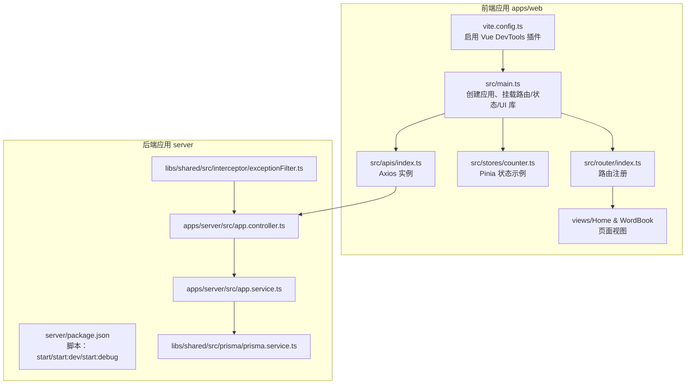
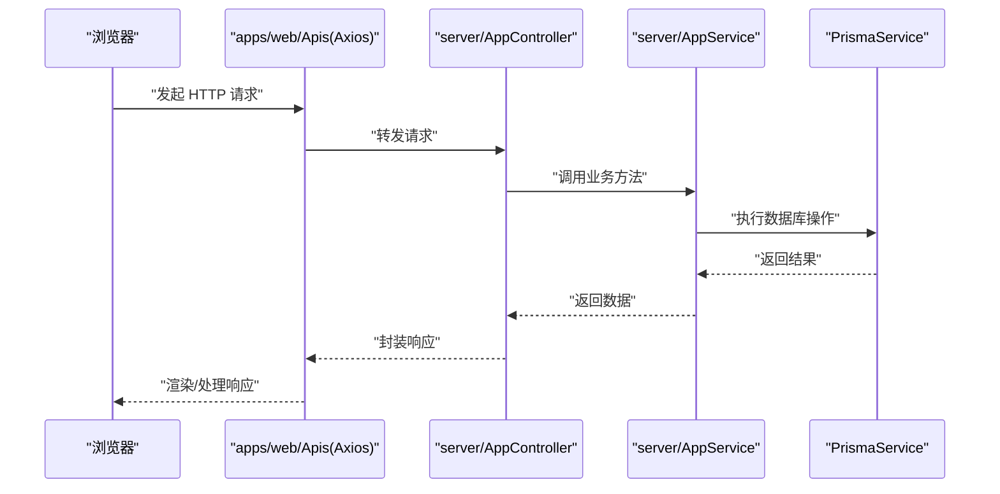
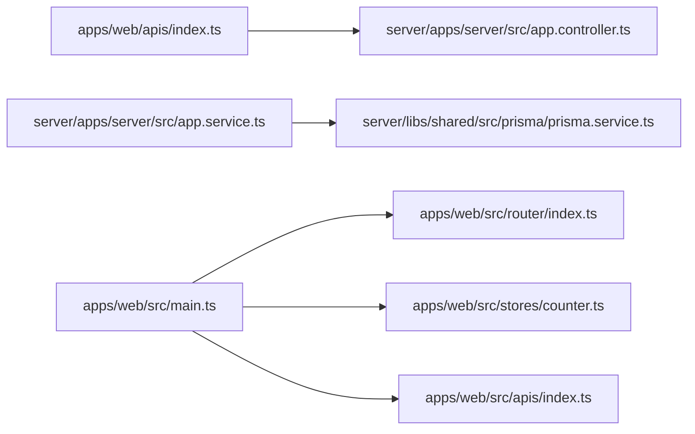
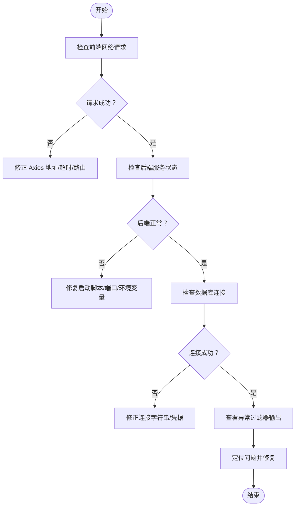

# 调试工具

<cite>
**本文引用的文件**
- [apps/web/package.json](file://apps/web/package.json)
- [apps/web/vite.config.ts](file://apps/web/vite.config.ts)
- [apps/web/src/main.ts](file://apps/web/src/main.ts)
- [apps/web/src/App.vue](file://apps/web/src/App.vue)
- [apps/web/src/router/index.ts](file://apps/web/src/router/index.ts)
- [apps/web/src/stores/counter.ts](file://apps/web/src/stores/counter.ts)
- [apps/web/src/apis/index.ts](file://apps/web/src/apis/index.ts)
- [apps/web/src/views/Home/index.vue](file://apps/web/src/views/Home/index.vue)
- [apps/web/src/views/WordBook/index.vue](file://apps/web/src/views/WordBook/index.vue)
- [server/package.json](file://server/package.json)
- [server/apps/server/src/app.controller.ts](file://server/apps/server/src/app.controller.ts)
- [server/apps/server/src/app.service.ts](file://server/apps/server/src/app.service.ts)
- [server/libs/shared/src/prisma/prisma.service.ts](file://server/libs/shared/src/prisma/prisma.service.ts)
- [server/libs/shared/src/interceptor/exceptionFilter.ts](file://server/libs/shared/src/interceptor/exceptionFilter.ts)
- [server/nest-cli.json](file://server/nest-cli.json)
</cite>

## 目录
1. [简介](#简介)
2. [项目结构](#项目结构)
3. [核心组件](#核心组件)
4. [架构总览](#架构总览)
5. [详细组件分析](#详细组件分析)
6. [依赖分析](#依赖分析)
7. [性能考虑](#性能考虑)
8. [故障排查指南](#故障排查指南)
9. [结论](#结论)
10. [附录](#附录)

## 简介
本指南面向英语学习平台的前端与后端开发者，系统性介绍调试工具与技巧，覆盖浏览器开发者工具、Vue DevTools、Node.js 调试器、Postman API 调试、数据库查询调试、网络请求追踪、日志与错误追踪、性能分析、远程/移动端/跨平台调试以及常见问题的系统性调试思路。文档中的技术要点均基于仓库现有配置与代码实现进行提炼，帮助你快速定位问题并提升开发效率。

## 项目结构
该工程采用多包工作区（pnpm workspace）组织方式，包含：
- 前端应用：apps/web（Vite + Vue 3 + Pinia + Vue Router）
- 后端应用：server（NestJS + Prisma）
- 共享库：server/libs/shared（Prisma 客户端与拦截器等）

图表来源
- [apps/web/vite.config.ts:1-25](file://apps/web/vite.config.ts#L1-L25)
- [apps/web/src/main.ts:1-21](file://apps/web/src/main.ts#L1-L21)
- [apps/web/src/router/index.ts:1-13](file://apps/web/src/router/index.ts#L1-L13)
- [apps/web/src/views/Home/index.vue:1-7](file://apps/web/src/views/Home/index.vue#L1-L7)
- [apps/web/src/views/WordBook/index.vue:1-7](file://apps/web/src/views/WordBook/index.vue#L1-L7)
- [apps/web/src/stores/counter.ts:1-13](file://apps/web/src/stores/counter.ts#L1-L13)
- [apps/web/src/apis/index.ts:1-6](file://apps/web/src/apis/index.ts#L1-L6)
- [server/package.json:1-52](file://server/package.json#L1-L52)
- [server/apps/server/src/app.controller.ts:1-13](file://server/apps/server/src/app.controller.ts#L1-L13)
- [server/apps/server/src/app.service.ts:1-11](file://server/apps/server/src/app.service.ts#L1-L11)
- [server/libs/shared/src/prisma/prisma.service.ts:1-18](file://server/libs/shared/src/prisma/prisma.service.ts#L1-L18)
- [server/libs/shared/src/interceptor/exceptionFilter.ts:1-23](file://server/libs/shared/src/interceptor/exceptionFilter.ts#L1-L23)

章节来源
- [apps/web/package.json:1-45](file://apps/web/package.json#L1-L45)
- [apps/web/vite.config.ts:1-25](file://apps/web/vite.config.ts#L1-L25)
- [apps/web/src/main.ts:1-21](file://apps/web/src/main.ts#L1-L21)
- [apps/web/src/router/index.ts:1-13](file://apps/web/src/router/index.ts#L1-L13)
- [apps/web/src/views/Home/index.vue:1-7](file://apps/web/src/views/Home/index.vue#L1-L7)
- [apps/web/src/views/WordBook/index.vue:1-7](file://apps/web/src/views/WordBook/index.vue#L1-L7)
- [apps/web/src/stores/counter.ts:1-13](file://apps/web/src/stores/counter.ts#L1-L13)
- [apps/web/src/apis/index.ts:1-6](file://apps/web/src/apis/index.ts#L1-L6)
- [server/package.json:1-52](file://server/package.json#L1-L52)
- [server/apps/server/src/app.controller.ts:1-13](file://server/apps/server/src/app.controller.ts#L1-L13)
- [server/apps/server/src/app.service.ts:1-11](file://server/apps/server/src/app.service.ts#L1-L11)
- [server/libs/shared/src/prisma/prisma.service.ts:1-18](file://server/libs/shared/src/prisma/prisma.service.ts#L1-L18)
- [server/libs/shared/src/interceptor/exceptionFilter.ts:1-23](file://server/libs/shared/src/interceptor/exceptionFilter.ts#L1-L23)
- [server/nest-cli.json:1-43](file://server/nest-cli.json#L1-L43)

## 核心组件
- 前端应用入口与插件
  - 应用创建与挂载：在应用入口中创建 Vue 应用实例，安装路由、状态管理与 UI 组件库，并完成挂载。
  - 插件配置：Vite 配置启用了 Vue DevTools 插件与 TailwindCSS 插件；开发服务器监听端口由共享配置提供。
- 路由与视图
  - 使用 Vue Router 注册页面路由，主应用仅承载路由视图。
- 状态管理
  - 使用 Pinia 创建简单计数状态示例，便于验证状态更新与调试。
- API 客户端
  - 基于 Axios 创建带基础地址与超时的客户端，用于与后端交互。
- 后端服务
  - NestJS 控制器与服务层提供接口与业务逻辑；异常过滤器统一返回错误响应格式。
- 数据库访问
  - 通过 Prisma 客户端连接数据库，使用环境变量配置连接字符串。

章节来源
- [apps/web/src/main.ts:1-21](file://apps/web/src/main.ts#L1-L21)
- [apps/web/vite.config.ts:1-25](file://apps/web/vite.config.ts#L1-L25)
- [apps/web/src/router/index.ts:1-13](file://apps/web/src/router/index.ts#L1-L13)
- [apps/web/src/views/Home/index.vue:1-7](file://apps/web/src/views/Home/index.vue#L1-L7)
- [apps/web/src/views/WordBook/index.vue:1-7](file://apps/web/src/views/WordBook/index.vue#L1-L7)
- [apps/web/src/stores/counter.ts:1-13](file://apps/web/src/stores/counter.ts#L1-L13)
- [apps/web/src/apis/index.ts:1-6](file://apps/web/src/apis/index.ts#L1-L6)
- [server/apps/server/src/app.controller.ts:1-13](file://server/apps/server/src/app.controller.ts#L1-L13)
- [server/apps/server/src/app.service.ts:1-11](file://server/apps/server/src/app.service.ts#L1-L11)
- [server/libs/shared/src/prisma/prisma.service.ts:1-18](file://server/libs/shared/src/prisma/prisma.service.ts#L1-L18)
- [server/libs/shared/src/interceptor/exceptionFilter.ts:1-23](file://server/libs/shared/src/interceptor/exceptionFilter.ts#L1-L23)

## 架构总览
下图展示从前端到后端再到数据库的典型请求链路，以及调试关注点：

图表来源
- [apps/web/src/apis/index.ts:1-6](file://apps/web/src/apis/index.ts#L1-L6)
- [server/apps/server/src/app.controller.ts:1-13](file://server/apps/server/src/app.controller.ts#L1-L13)
- [server/apps/server/src/app.service.ts:1-11](file://server/apps/server/src/app.service.ts#L1-L11)
- [server/libs/shared/src/prisma/prisma.service.ts:1-18](file://server/libs/shared/src/prisma/prisma.service.ts#L1-L18)

## 详细组件分析

### 浏览器开发者工具与 Vue DevTools
- 开发服务器与插件
  - Vite 配置启用了 Vue DevTools 插件，可在浏览器中查看组件树、状态与事件流。
  - 开发服务器端口由共享配置提供，确保前后端端口一致以避免跨域问题。
- 前端应用挂载与状态
  - 在应用入口中安装路由、状态管理与 UI 组件库，便于在 DevTools 中观察状态变化与组件生命周期。
- 调试建议
  - 打开“Elements”检查 DOM 结构；在“Sources”中设置断点；在“Network”中观察请求与响应；在“Vue DevTools”中查看组件层级与 Pinia 状态。
  - 对视图组件与路由切换进行性能观测，结合“Performance”面板识别卡顿点。

章节来源
- [apps/web/vite.config.ts:1-25](file://apps/web/vite.config.ts#L1-L25)
- [apps/web/src/main.ts:1-21](file://apps/web/src/main.ts#L1-L21)
- [apps/web/src/router/index.ts:1-13](file://apps/web/src/router/index.ts#L1-L13)
- [apps/web/src/stores/counter.ts:1-13](file://apps/web/src/stores/counter.ts#L1-L13)
- [apps/web/src/views/Home/index.vue:1-7](file://apps/web/src/views/Home/index.vue#L1-L7)
- [apps/web/src/views/WordBook/index.vue:1-7](file://apps/web/src/views/WordBook/index.vue#L1-L7)

### Node.js 调试器（后端 NestJS）
- 启动与调试脚本
  - 提供开发模式与调试模式启动脚本，支持断点调试与自动重启。
- 异常过滤器
  - 统一捕获 HTTP 异常，输出时间戳、路径、消息与状态码，便于快速定位错误来源。
- 调试建议
  - 使用调试脚本启动后端，配合 VS Code 的 Node 调试器设置断点；在控制器与服务层之间设置断点，观察入参、上下文与返回值；利用异常过滤器输出的结构化错误信息进行问题定位。

章节来源
- [server/package.json:1-52](file://server/package.json#L1-L52)
- [server/apps/server/src/app.controller.ts:1-13](file://server/apps/server/src/app.controller.ts#L1-L13)
- [server/apps/server/src/app.service.ts:1-11](file://server/apps/server/src/app.service.ts#L1-L11)
- [server/libs/shared/src/interceptor/exceptionFilter.ts:1-23](file://server/libs/shared/src/interceptor/exceptionFilter.ts#L1-L23)

### Postman API 调试
- 前后端联调
  - 前端 Axios 客户端指向本地后端地址；在 Postman 中直接调用相同接口，对比响应体与状态码。
- 调试建议
  - 在 Postman 中开启“Pretty/Preview”查看格式化响应；添加环境变量管理基础 URL；使用 Tests 或 Pre-request Script 输出日志；对异常场景构造边界输入并观察异常过滤器输出。

章节来源
- [apps/web/src/apis/index.ts:1-6](file://apps/web/src/apis/index.ts#L1-L6)
- [server/apps/server/src/app.controller.ts:1-13](file://server/apps/server/src/app.controller.ts#L1-L13)
- [server/libs/shared/src/interceptor/exceptionFilter.ts:1-23](file://server/libs/shared/src/interceptor/exceptionFilter.ts#L1-L23)

### 数据库查询调试（Prisma）
- 连接与配置
  - Prisma 客户端通过适配器连接数据库，连接字符串来自环境变量；服务类继承 PrismaClient 并在构造函数中初始化。
- 调试建议
  - 在服务层方法中设置断点，观察传入参数与返回结果；在数据库客户端中启用查询日志（如需要），或通过异常过滤器输出的错误上下文定位问题；使用迁移脚本与 schema.prisma 变更进行版本化管理。

章节来源
- [server/libs/shared/src/prisma/prisma.service.ts:1-18](file://server/libs/shared/src/prisma/prisma.service.ts#L1-L18)
- [server/apps/server/src/app.service.ts:1-11](file://server/apps/server/src/app.service.ts#L1-L11)

### 网络请求追踪
- 前端 Axios 客户端
  - 指定基础地址与超时，便于在浏览器 Network 面板中识别请求来源与耗时。
- 后端异常过滤
  - 统一返回结构化的错误对象，包含时间戳、路径、消息与状态码，便于前端与 Postman 侧统一处理。
- 调试建议
  - 在 Network 面板中筛选 XHR/Fetch 请求，查看请求头、响应头与响应体；结合异常过滤器输出的字段快速判断是业务异常还是系统异常。

章节来源
- [apps/web/src/apis/index.ts:1-6](file://apps/web/src/apis/index.ts#L1-L6)
- [server/libs/shared/src/interceptor/exceptionFilter.ts:1-23](file://server/libs/shared/src/interceptor/exceptionFilter.ts#L1-L23)

### 日志记录最佳实践
- 后端统一异常输出
  - 异常过滤器输出时间戳、路径、消息与状态码，形成可读且一致的错误日志结构。
- 建议
  - 在控制器与服务层增加结构化日志（如上下文 ID、用户标识、请求路径等）；对关键业务流程记录关键节点日志；避免在生产环境输出敏感信息。

章节来源
- [server/libs/shared/src/interceptor/exceptionFilter.ts:1-23](file://server/libs/shared/src/interceptor/exceptionFilter.ts#L1-L23)

### 性能分析方法
- 前端性能
  - 使用浏览器 Performance 面板录制交互过程，观察主线程占用、重排重绘与长任务；结合 Vue DevTools 观察组件渲染频率与状态变更。
- 后端性能
  - 使用 Node.js 调试器的 CPU 快照与堆快照定位热点；在服务层方法中设置断点，观察耗时步骤；结合数据库查询日志评估慢查询。
- 建议
  - 对高频接口进行基准测试；对组件渲染与状态更新进行节流/防抖优化；对数据库查询建立索引与缓存策略。

[本节为通用指导，不直接分析具体文件，故无章节来源]

### 远程调试、移动端调试与跨平台调试
- 远程调试
  - 后端使用调试脚本启动后，可通过 Node.js 调试器连接远程进程；前端开发服务器默认仅监听本地地址，需调整以允许外部访问。
- 移动端调试
  - 使用浏览器的设备模式或真机调试工具；注意移动端网络差异与触摸事件；对移动端字体与布局进行专项测试。
- 跨平台调试
  - 统一使用 VS Code 的多平台调试配置；前后端分别使用各自调试器；确保环境变量与端口在不同操作系统下一致。

[本节为通用指导，不直接分析具体文件，故无章节来源]

## 依赖分析
- 前端依赖
  - Vue 3、Vue Router、Pinia、Element Plus、Axios、TailwindCSS、Vite 与 Vue DevTools 插件。
- 后端依赖
  - NestJS、Prisma、Jest、dotenv、ts-node 等。
- 关键关系
  - 前端 Axios 客户端与后端控制器/服务层耦合；后端服务层依赖 Prisma 客户端；异常过滤器贯穿控制器与服务层。

图表来源
- [apps/web/src/apis/index.ts:1-6](file://apps/web/src/apis/index.ts#L1-L6)
- [server/apps/server/src/app.controller.ts:1-13](file://server/apps/server/src/app.controller.ts#L1-L13)
- [server/apps/server/src/app.service.ts:1-11](file://server/apps/server/src/app.service.ts#L1-L11)
- [server/libs/shared/src/prisma/prisma.service.ts:1-18](file://server/libs/shared/src/prisma/prisma.service.ts#L1-L18)
- [apps/web/src/main.ts:1-21](file://apps/web/src/main.ts#L1-L21)
- [apps/web/src/router/index.ts:1-13](file://apps/web/src/router/index.ts#L1-L13)
- [apps/web/src/stores/counter.ts:1-13](file://apps/web/src/stores/counter.ts#L1-L13)

章节来源
- [apps/web/package.json:1-45](file://apps/web/package.json#L1-L45)
- [server/package.json:1-52](file://server/package.json#L1-L52)
- [apps/web/src/apis/index.ts:1-6](file://apps/web/src/apis/index.ts#L1-L6)
- [server/apps/server/src/app.controller.ts:1-13](file://server/apps/server/src/app.controller.ts#L1-L13)
- [server/apps/server/src/app.service.ts:1-11](file://server/apps/server/src/app.service.ts#L1-L11)
- [server/libs/shared/src/prisma/prisma.service.ts:1-18](file://server/libs/shared/src/prisma/prisma.service.ts#L1-L18)
- [apps/web/src/main.ts:1-21](file://apps/web/src/main.ts#L1-L21)
- [apps/web/src/router/index.ts:1-13](file://apps/web/src/router/index.ts#L1-L13)
- [apps/web/src/stores/counter.ts:1-13](file://apps/web/src/stores/counter.ts#L1-L13)

## 性能考虑
- 前端
  - 减少不必要的响应式依赖与计算属性重算；对高频交互使用防抖/节流；合理拆分组件与懒加载路由。
- 后端
  - 对数据库查询建立索引；避免 N+1 查询；对热点接口进行缓存；使用异步处理与并发控制。
- 工具
  - 使用浏览器 Performance 面板与 Node.js 调试器的性能分析功能；对关键路径进行基准测试。

[本节为通用指导，不直接分析具体文件，故无章节来源]

## 故障排查指南
- 常见问题与思路
  - 接口 500/404：先确认后端是否启动成功、端口是否正确；再检查异常过滤器输出；最后核对前端 Axios 基础地址与路由配置。
  - 数据库连接失败：检查环境变量与连接字符串；确认 Prisma 客户端初始化是否成功。
  - 状态未更新：在 Vue DevTools 中观察 Pinia 状态变更；在浏览器 Sources 中对状态更新函数设置断点。
  - 跨域问题：确认开发服务器端口与 Axios 基础地址一致；必要时在后端添加 CORS 配置。
- 调试流程图

图表来源
- [apps/web/src/apis/index.ts:1-6](file://apps/web/src/apis/index.ts#L1-L6)
- [server/apps/server/src/app.controller.ts:1-13](file://server/apps/server/src/app.controller.ts#L1-L13)
- [server/libs/shared/src/interceptor/exceptionFilter.ts:1-23](file://server/libs/shared/src/interceptor/exceptionFilter.ts#L1-L23)
- [server/libs/shared/src/prisma/prisma.service.ts:1-18](file://server/libs/shared/src/prisma/prisma.service.ts#L1-L18)

章节来源
- [apps/web/src/apis/index.ts:1-6](file://apps/web/src/apis/index.ts#L1-L6)
- [server/apps/server/src/app.controller.ts:1-13](file://server/apps/server/src/app.controller.ts#L1-L13)
- [server/libs/shared/src/interceptor/exceptionFilter.ts:1-23](file://server/libs/shared/src/interceptor/exceptionFilter.ts#L1-L23)
- [server/libs/shared/src/prisma/prisma.service.ts:1-18](file://server/libs/shared/src/prisma/prisma.service.ts#L1-L18)

## 结论
通过结合浏览器开发者工具、Vue DevTools、Node.js 调试器与 Postman 等工具，配合统一的异常过滤与结构化日志，可以高效定位并解决英语学习平台的前端与后端问题。建议在日常开发中养成“先抓前端网络，再查后端服务，最后看数据库”的调试顺序，并持续优化性能与稳定性。

## 附录
- 快速参考
  - 前端开发服务器端口：由共享配置提供；确保与 Axios 基础地址一致。
  - 后端调试脚本：使用调试脚本启动后端，VS Code 可直接附加调试。
  - 异常过滤器：统一输出时间戳、路径、消息与状态码，便于前后端协同定位问题。
  - 数据库连接：通过环境变量配置连接字符串，Prisma 客户端在服务类中初始化。

章节来源
- [apps/web/vite.config.ts:1-25](file://apps/web/vite.config.ts#L1-L25)
- [apps/web/src/apis/index.ts:1-6](file://apps/web/src/apis/index.ts#L1-L6)
- [server/package.json:1-52](file://server/package.json#L1-L52)
- [server/libs/shared/src/interceptor/exceptionFilter.ts:1-23](file://server/libs/shared/src/interceptor/exceptionFilter.ts#L1-L23)
- [server/libs/shared/src/prisma/prisma.service.ts:1-18](file://server/libs/shared/src/prisma/prisma.service.ts#L1-L18)