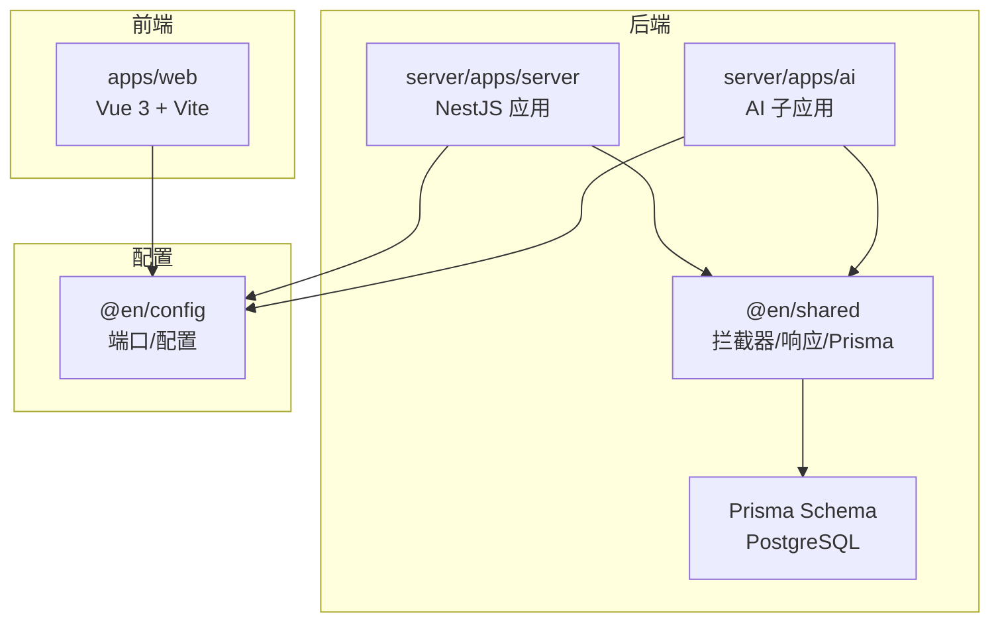
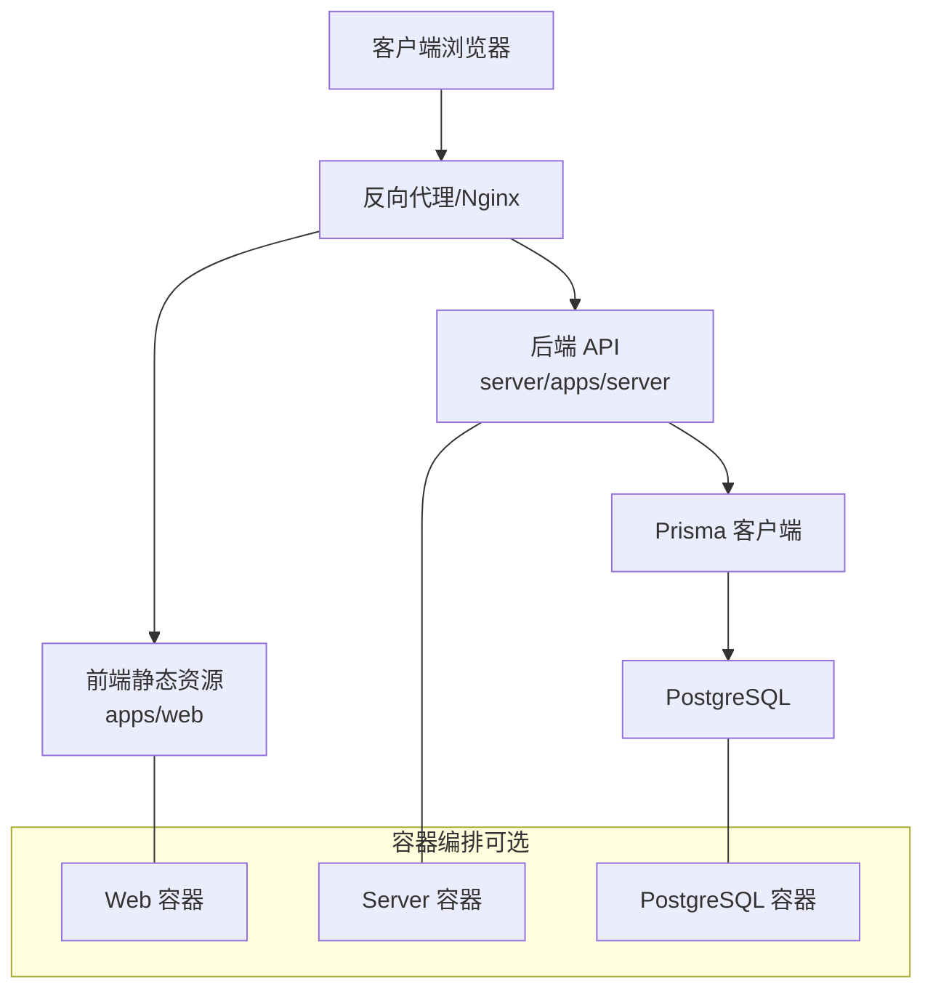
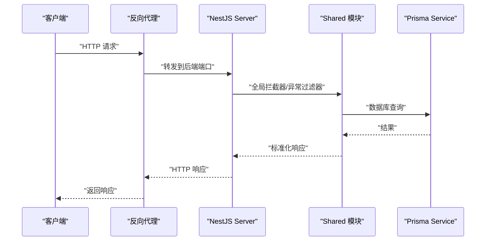
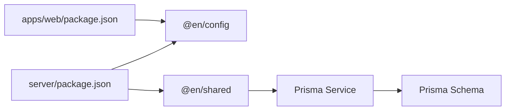

# 部署指南

<cite>
**本文引用的文件**
- [README.md](file://README.md)
- [package.json](file://package.json)
- [pnpm-workspace.yaml](file://pnpm-workspace.yaml)
- [server/package.json](file://server/package.json)
- [apps/web/package.json](file://apps/web/package.json)
- [server/nest-cli.json](file://server/nest-cli.json)
- [server/prisma/schema.prisma](file://server/prisma/schema.prisma)
- [apps/web/vite.config.ts](file://apps/web/vite.config.ts)
- [server/apps/server/src/main.ts](file://server/apps/server/src/main.ts)
- [packages/config/index.ts](file://packages/config/index.ts)
- [server/libs/shared/src/interceptor/interceptor.ts](file://server/libs/shared/src/interceptor/interceptor.ts)
- [server/libs/shared/src/interceptor/exceptionFilter.ts](file://server/libs/shared/src/interceptor/exceptionFilter.ts)
- [server/libs/shared/src/prisma/prisma.service.ts](file://server/libs/shared/src/prisma/prisma.service.ts)
- [server/libs/shared/src/response/response.service.ts](file://server/libs/shared/src/response/response.service.ts)
</cite>

## 目录
1. [简介](#简介)
2. [项目结构](#项目结构)
3. [核心组件](#核心组件)
4. [架构总览](#架构总览)
5. [详细组件分析](#详细组件分析)
6. [依赖关系分析](#依赖关系分析)
7. [性能考虑](#性能考虑)
8. [故障排查指南](#故障排查指南)
9. [结论](#结论)
10. [附录](#附录)

## 简介
本指南面向英语学习平台的生产环境部署与运维，覆盖以下主题：
- 生产环境部署流程：Docker 容器化部署、云平台部署、传统服务器部署
- 环境变量配置、数据库连接设置、负载均衡配置
- CI/CD 流水线配置、自动化部署脚本与回滚策略
- 监控告警、日志收集与性能监控
- 域名配置、SSL 证书申请与安全加固最佳实践
- 面向不同规模的部署架构建议与运维管理指导

## 项目结构
该仓库采用 monorepo 结构，包含前端 Web 应用、后端 NestJS 服务、共享库与配置包。关键模块如下：
- apps/web：基于 Vue 3 的前端应用，使用 Vite 构建与开发
- server：基于 NestJS 的后端服务，包含两个应用（server、ai），以及共享库与 Prisma 数据模型
- packages：公共配置与通用包（如 @en/config）
- 根目录脚本：通过 pnpm workspace 提供统一的开发与运行命令

图表来源
- [pnpm-workspace.yaml:1-10](file://pnpm-workspace.yaml#L1-L10)
- [apps/web/package.json:1-45](file://apps/web/package.json#L1-L45)
- [server/package.json:1-52](file://server/package.json#L1-L52)
- [server/nest-cli.json:14-42](file://server/nest-cli.json#L14-L42)
- [server/prisma/schema.prisma:1-133](file://server/prisma/schema.prisma#L1-L133)
- [packages/config/index.ts:1-7](file://packages/config/index.ts#L1-L7)

章节来源
- [pnpm-workspace.yaml:1-10](file://pnpm-workspace.yaml#L1-L10)
- [apps/web/package.json:1-45](file://apps/web/package.json#L1-L45)
- [server/package.json:1-52](file://server/package.json#L1-L52)
- [server/nest-cli.json:14-42](file://server/nest-cli.json#L14-L42)

## 核心组件
- 前端 Web 应用
  - 使用 Vite 进行开发与构建，端口由 @en/config 提供
  - 通过 @en/config 注入运行时配置，支持开发与生产环境差异化
- 后端服务
  - NestJS 主应用与 AI 子应用，均通过 @en/config 获取端口
  - 全局启用版本控制（URI 版本）、全局拦截器与异常过滤器
  - 使用 Prisma 连接 PostgreSQL 数据库
- 共享库
  - 拦截器与异常过滤器用于统一响应与错误处理
  - Prisma 服务封装数据库访问
  - 响应服务提供标准化返回结构

章节来源
- [apps/web/vite.config.ts:10-24](file://apps/web/vite.config.ts#L10-L24)
- [server/apps/server/src/main.ts:8-18](file://server/apps/server/src/main.ts#L8-L18)
- [packages/config/index.ts:1-7](file://packages/config/index.ts#L1-L7)
- [server/libs/shared/src/interceptor/interceptor.ts](file://server/libs/shared/src/interceptor/interceptor.ts)
- [server/libs/shared/src/interceptor/exceptionFilter.ts](file://server/libs/shared/src/interceptor/exceptionFilter.ts)
- [server/libs/shared/src/prisma/prisma.service.ts](file://server/libs/shared/src/prisma/prisma.service.ts)
- [server/libs/shared/src/response/response.service.ts](file://server/libs/shared/src/response/response.service.ts)

## 架构总览
下图展示生产环境的典型部署拓扑：反向代理（Nginx）作为入口，前端静态资源由 Nginx 提供，后端通过上游代理转发到多个后端实例；数据库使用 PostgreSQL，Prisma 作为 ORM。

图表来源
- [apps/web/vite.config.ts:10-24](file://apps/web/vite.config.ts#L10-L24)
- [server/apps/server/src/main.ts:8-18](file://server/apps/server/src/main.ts#L8-L18)
- [server/prisma/schema.prisma:13-15](file://server/prisma/schema.prisma#L13-L15)

## 详细组件分析

### 前端部署（apps/web）
- 开发与构建
  - 开发：Vite 监听端口，端口来自 @en/config
  - 构建：生成静态资源，供 Nginx 或 CDN 提供
- 部署建议
  - 将构建产物部署至 Nginx 的静态目录或对象存储（CDN）
  - 配置缓存头与 gzip/br 压缩
  - 通过反向代理统一入口，开启 HTTPS

章节来源
- [apps/web/vite.config.ts:10-24](file://apps/web/vite.config.ts#L10-L24)
- [apps/web/package.json:6-12](file://apps/web/package.json#L6-L12)

### 后端部署（server/apps/server 与 apps/ai）
- 启动与监听
  - 通过 @en/config 获取端口，启用 URI 版本控制，设置全局前缀
  - 全局注册拦截器与异常过滤器，统一响应与错误处理
- 数据库连接
  - Prisma 使用 PostgreSQL，数据源在 schema.prisma 中声明
  - 通过 Prisma Service 进行查询与迁移
- 部署建议
  - 多实例部署，结合负载均衡
  - 使用进程管理器（PM2/Docker）进行健康检查与自动重启
  - 为 AI 子应用单独暴露端口，便于独立扩缩容

图表来源
- [server/apps/server/src/main.ts:8-18](file://server/apps/server/src/main.ts#L8-L18)
- [server/libs/shared/src/interceptor/interceptor.ts](file://server/libs/shared/src/interceptor/interceptor.ts)
- [server/libs/shared/src/interceptor/exceptionFilter.ts](file://server/libs/shared/src/interceptor/exceptionFilter.ts)
- [server/libs/shared/src/prisma/prisma.service.ts](file://server/libs/shared/src/prisma/prisma.service.ts)

章节来源
- [server/apps/server/src/main.ts:8-18](file://server/apps/server/src/main.ts#L8-L18)
- [server/prisma/schema.prisma:13-15](file://server/prisma/schema.prisma#L13-L15)

### 配置与环境变量
- 端口配置
  - @en/config 提供 server、ai、web 端口，默认值可在生产中通过环境变量覆盖
- 数据库连接
  - 在 schema.prisma 中声明 PostgreSQL 数据源，实际连接字符串需通过环境变量注入（如 DATABASE_URL）
- 其他运行时参数
  - 可通过环境变量控制日志级别、调试模式、跨域等

章节来源
- [packages/config/index.ts:1-7](file://packages/config/index.ts#L1-L7)
- [server/prisma/schema.prisma:13-15](file://server/prisma/schema.prisma#L13-L15)
- [server/package.json:22-35](file://server/package.json#L22-L35)

### 负载均衡与高可用
- 前端静态资源：由 Nginx 或 CDN 提供，支持多副本与就近分发
- 后端 API：多实例部署，反向代理实现轮询或加权轮询
- AI 子应用：可独立扩展，避免与主服务争抢资源
- 健康检查：通过进程管理器或容器编排实现存活/就绪探针

章节来源
- [apps/web/vite.config.ts:10-24](file://apps/web/vite.config.ts#L10-L24)
- [server/apps/server/src/main.ts:8-18](file://server/apps/server/src/main.ts#L8-L18)

### CI/CD 流水线与自动化部署
- 构建阶段
  - 前端：执行构建脚本生成静态资源
  - 后端：编译 NestJS 应用，生成 dist
- 测试阶段
  - 运行单元测试与 E2E 测试（参考 server 与根 package.json 中的测试脚本）
- 部署阶段
  - Docker 化：分别构建前端与后端镜像，推送至镜像仓库
  - 编排部署：使用 Kubernetes 或 Docker Compose 进行编排
  - 回滚策略：蓝绿/金丝雀发布，保留上一版本镜像以便快速回滚
- 自动化脚本
  - 提供一键部署脚本，包含构建、打包、推送、编排与健康检查

章节来源
- [package.json:2-7](file://package.json#L2-L7)
- [apps/web/package.json:6-12](file://apps/web/package.json#L6-L12)
- [server/package.json:8-21](file://server/package.json#L8-L21)

### 监控、日志与性能
- 监控指标
  - 应用层：请求量、响应时间、错误率、并发数
  - 基础设施：CPU、内存、磁盘、网络、数据库连接池
- 日志
  - 前端：静态资源访问日志由 Nginx 输出
  - 后端：NestJS 结合日志库输出结构化日志，建议集中采集
- 性能优化
  - 前端：开启压缩、缓存、CDN 分发
  - 后端：连接池配置、慢查询日志、异步任务队列（如需）

章节来源
- [apps/web/vite.config.ts:10-24](file://apps/web/vite.config.ts#L10-L24)
- [server/apps/server/src/main.ts:8-18](file://server/apps/server/src/main.ts#L8-L18)

### 域名、SSL 与安全加固
- 域名与 DNS
  - 将域名解析到反向代理入口（Nginx/CLB）
- SSL 证书
  - 使用 ACME 自动签发（Let’s Encrypt），或托管证书
- 安全加固
  - 强制 HTTPS、HSTS、CSP、X-Frame-Options
  - 限制请求大小、超时、速率限制
  - 数据库凭据加密存储，最小权限原则

章节来源
- [apps/web/vite.config.ts:10-24](file://apps/web/vite.config.ts#L10-L24)
- [server/prisma/schema.prisma:13-15](file://server/prisma/schema.prisma#L13-L15)

### 不同规模的部署建议
- 小规模（单机/小型 VPS）
  - 前后端共存于同一主机，Nginx 提供静态资源与反向代理
  - 使用 Docker Compose 编排，本地持久卷存储数据库
- 中规模（多实例/云服务器）
  - 多实例后端，配合负载均衡
  - 数据库存储于云数据库服务，开启只读副本
- 大规模（容器化/微服务）
  - 使用 Kubernetes 部署，HPA/PDB 等弹性策略
  - 前后端分离，CDN 加速，边缘节点就近分发

章节来源
- [pnpm-workspace.yaml:1-10](file://pnpm-workspace.yaml#L1-L10)
- [server/nest-cli.json:14-42](file://server/nest-cli.json#L14-L42)

## 依赖关系分析
- 组件耦合
  - apps/web 依赖 @en/config；server 依赖 @en/shared 与 @en/config
  - shared 模块依赖 Prisma，负责数据库访问
- 外部依赖
  - PostgreSQL 数据库、Nginx 反向代理、CDN/对象存储
- 潜在风险
  - 端口冲突、数据库连接泄漏、日志分散导致排查困难

图表来源
- [apps/web/package.json:13-29](file://apps/web/package.json#L13-L29)
- [server/package.json:22-35](file://server/package.json#L22-L35)
- [server/libs/shared/src/prisma/prisma.service.ts](file://server/libs/shared/src/prisma/prisma.service.ts)
- [server/prisma/schema.prisma:7-11](file://server/prisma/schema.prisma#L7-L11)

章节来源
- [apps/web/package.json:13-29](file://apps/web/package.json#L13-L29)
- [server/package.json:22-35](file://server/package.json#L22-L35)

## 性能考虑
- 前端
  - 构建时启用 Tree Shaking、按需加载、代码分割
  - 静态资源开启长期缓存与版本化
- 后端
  - 合理设置连接池大小，避免数据库过载
  - 对热点接口进行缓存（Redis/本地缓存）
  - 异步处理耗时任务，减少请求阻塞

## 故障排查指南
- 启动失败
  - 检查端口占用与防火墙规则
  - 确认 @en/config 的端口是否被覆盖
- 数据库问题
  - 校验 DATABASE_URL 是否正确
  - 查看 Prisma 迁移状态与连接日志
- 接口异常
  - 查看全局异常过滤器输出的日志
  - 检查请求路径与版本前缀是否匹配

章节来源
- [packages/config/index.ts:1-7](file://packages/config/index.ts#L1-L7)
- [server/apps/server/src/main.ts:8-18](file://server/apps/server/src/main.ts#L8-L18)
- [server/libs/shared/src/interceptor/exceptionFilter.ts](file://server/libs/shared/src/interceptor/exceptionFilter.ts)

## 结论
本指南提供了从开发到生产的完整部署与运维路径。通过容器化、云平台与传统服务器三种方案，结合 CI/CD、监控与安全加固，可满足不同规模的业务需求。建议在生产环境中优先采用容器化与编排平台，以获得更高的弹性与可维护性。

## 附录
- 快速命令参考
  - 开发：根目录执行统一脚本启动前端、后端与 AI 子应用
  - 构建：前端与后端分别执行构建脚本
  - 测试：参考 server 与根 package.json 中的测试脚本
- 关键文件清单
  - 前端：apps/web/vite.config.ts、apps/web/package.json
  - 后端：server/apps/server/src/main.ts、server/package.json
  - 配置：packages/config/index.ts
  - 数据库：server/prisma/schema.prisma

章节来源
- [package.json:2-7](file://package.json#L2-L7)
- [apps/web/package.json:6-12](file://apps/web/package.json#L6-L12)
- [server/package.json:8-21](file://server/package.json#L8-L21)