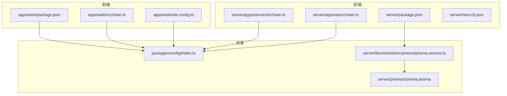
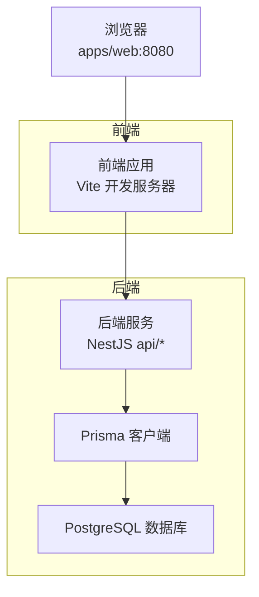
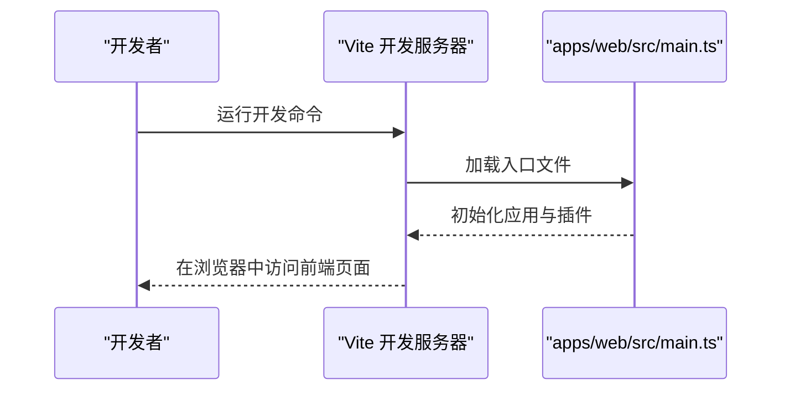
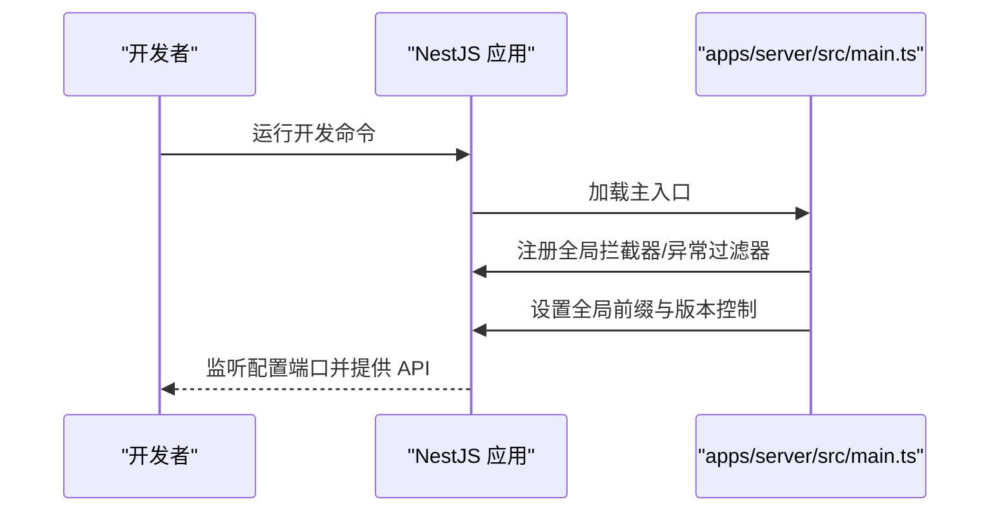
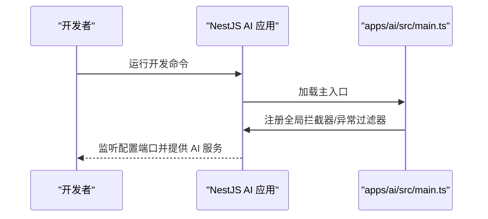
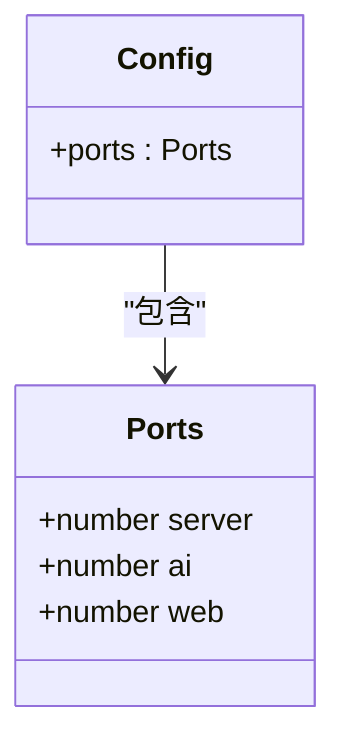
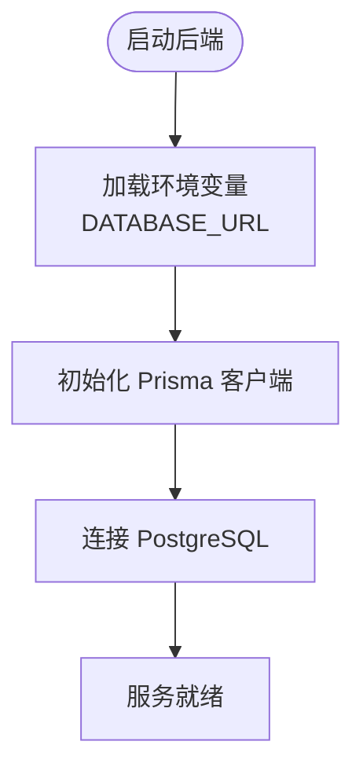
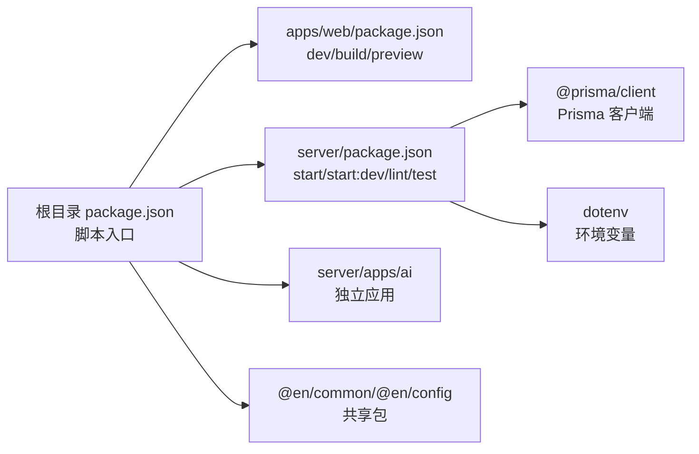

# 快速开始

<cite>
**本文引用的文件**
- [README.md](file://README.md)
- [package.json](file://package.json)
- [pnpm-workspace.yaml](file://pnpm-workspace.yaml)
- [apps/web/package.json](file://apps/web/package.json)
- [apps/web/vite.config.ts](file://apps/web/vite.config.ts)
- [apps/web/env.d.ts](file://apps/web/env.d.ts)
- [apps/web/src/main.ts](file://apps/web/src/main.ts)
- [server/package.json](file://server/package.json)
- [server/nest-cli.json](file://server/nest-cli.json)
- [server/prisma/schema.prisma](file://server/prisma/schema.prisma)
- [server/libs/shared/src/prisma/prisma.service.ts](file://server/libs/shared/src/prisma/prisma.service.ts)
- [server/apps/server/src/main.ts](file://server/apps/server/src/main.ts)
- [server/apps/ai/src/main.ts](file://server/apps/ai/src/main.ts)
- [packages/config/index.ts](file://packages/config/index.ts)
</cite>

## 目录
1. [简介](#简介)
2. [项目结构](#项目结构)
3. [核心组件](#核心组件)
4. [架构总览](#架构总览)
5. [详细组件分析](#详细组件分析)
6. [依赖关系分析](#依赖关系分析)
7. [性能注意事项](#性能注意事项)
8. [故障排除指南](#故障排除指南)
9. [结论](#结论)
10. [附录](#附录)

## 简介
本指南面向新加入的开发者，帮助你在最短时间内完成英语学习平台项目的本地开发环境搭建与首次运行。你将学到：
- 环境要求与前置条件（Node.js、pnpm、PostgreSQL）
- 克隆仓库、安装依赖、配置环境变量
- 启动前端、后端与AI子服务的完整流程
- 常见初始化问题的排查方法
- 如何验证安装成功与进行首次功能测试

## 项目结构
该项目采用 monorepo 结构，包含：
- 前端应用：apps/web（Vue 3 + Vite）
- 后端应用：server（NestJS，含 server 与 ai 两个子应用）
- 共享包：packages/{common, config}
- 共享库：server/libs/shared（包含 Prisma 客户端与拦截器等）

**图表来源**
- [apps/web/package.json:1-45](file://apps/web/package.json#L1-L45)
- [apps/web/src/main.ts:1-21](file://apps/web/src/main.ts#L1-L21)
- [apps/web/vite.config.ts:1-25](file://apps/web/vite.config.ts#L1-L25)
- [server/package.json:1-52](file://server/package.json#L1-L52)
- [server/apps/server/src/main.ts:1-20](file://server/apps/server/src/main.ts#L1-L20)
- [server/apps/ai/src/main.ts:1-14](file://server/apps/ai/src/main.ts#L1-L14)
- [server/nest-cli.json:1-43](file://server/nest-cli.json#L1-L43)
- [packages/config/index.ts:1-8](file://packages/config/index.ts#L1-L8)
- [server/libs/shared/src/prisma/prisma.service.ts:1-18](file://server/libs/shared/src/prisma/prisma.service.ts#L1-L18)
- [server/prisma/schema.prisma:1-133](file://server/prisma/schema.prisma#L1-L133)

**章节来源**
- [pnpm-workspace.yaml:1-10](file://pnpm-workspace.yaml#L1-L10)
- [apps/web/package.json:1-45](file://apps/web/package.json#L1-L45)
- [server/package.json:1-52](file://server/package.json#L1-L52)

## 核心组件
- 前端 Web 应用：基于 Vue 3 + Vite，使用 Pinia 状态管理、Element Plus 组件库、TailwindCSS 样式框架。
- 后端 Server 应用：基于 NestJS，启用 URI 版本控制、全局拦截器与异常过滤器。
- AI 子应用：独立的 NestJS 应用，提供 AI 相关能力。
- 配置中心：统一管理各应用端口与通用配置。
- 数据层：Prisma + PostgreSQL，通过适配器连接数据库。

**章节来源**
- [apps/web/src/main.ts:1-21](file://apps/web/src/main.ts#L1-L21)
- [server/apps/server/src/main.ts:1-20](file://server/apps/server/src/main.ts#L1-L20)
- [server/apps/ai/src/main.ts:1-14](file://server/apps/ai/src/main.ts#L1-L14)
- [packages/config/index.ts:1-8](file://packages/config/index.ts#L1-L8)
- [server/libs/shared/src/prisma/prisma.service.ts:1-18](file://server/libs/shared/src/prisma/prisma.service.ts#L1-L18)

## 架构总览
下图展示了从浏览器到数据库的数据流路径，以及各应用之间的交互关系。

**图表来源**
- [apps/web/vite.config.ts:1-25](file://apps/web/vite.config.ts#L1-L25)
- [apps/web/src/main.ts:1-21](file://apps/web/src/main.ts#L1-L21)
- [server/apps/server/src/main.ts:1-20](file://server/apps/server/src/main.ts#L1-L20)
- [server/libs/shared/src/prisma/prisma.service.ts:1-18](file://server/libs/shared/src/prisma/prisma.service.ts#L1-L18)
- [server/prisma/schema.prisma:1-133](file://server/prisma/schema.prisma#L1-L133)

## 详细组件分析

### 前端应用（apps/web）
- 启动命令：开发模式由 Vite 提供，构建与预览命令也已配置。
- 端口：通过配置中心统一管理，开发服务器默认监听配置中的 web 端口。
- 依赖：Vue 3、Pinia、Element Plus、TailwindCSS、Axios、Vue Router 等。
- 环境声明：Vite 类型声明已引入。

**图表来源**
- [apps/web/package.json:6-12](file://apps/web/package.json#L6-L12)
- [apps/web/vite.config.ts:10-24](file://apps/web/vite.config.ts#L10-L24)
- [apps/web/src/main.ts:1-21](file://apps/web/src/main.ts#L1-L21)

**章节来源**
- [apps/web/package.json:1-45](file://apps/web/package.json#L1-L45)
- [apps/web/vite.config.ts:1-25](file://apps/web/vite.config.ts#L1-L25)
- [apps/web/env.d.ts:1-2](file://apps/web/env.d.ts#L1-L2)

### 后端应用（server/apps/server）
- 启动命令：开发模式支持热重载；全局前缀为 api；启用 URI 版本控制（默认 v1）。
- 端口：通过配置中心统一管理，监听配置中的 server 端口。
- 插件：全局拦截器与异常过滤器已注册。

**图表来源**
- [server/apps/server/src/main.ts:8-18](file://server/apps/server/src/main.ts#L8-L18)
- [server/package.json:8-21](file://server/package.json#L8-L21)

**章节来源**
- [server/apps/server/src/main.ts:1-20](file://server/apps/server/src/main.ts#L1-L20)
- [server/package.json:1-52](file://server/package.json#L1-L52)

### AI 子应用（server/apps/ai）
- 启动命令：独立开发模式，监听配置中的 ai 端口。
- 插件：同样注册了全局拦截器与异常过滤器。

**图表来源**
- [server/apps/ai/src/main.ts:7-12](file://server/apps/ai/src/main.ts#L7-L12)
- [server/package.json:8-21](file://server/package.json#L8-L21)

**章节来源**
- [server/apps/ai/src/main.ts:1-14](file://server/apps/ai/src/main.ts#L1-L14)
- [server/package.json:1-52](file://server/package.json#L1-L52)

### 配置中心（packages/config）
- 统一管理各应用端口：web、server、ai。
- 前端开发服务器与后端/AI 应用均读取该配置以确定监听端口。

**图表来源**
- [packages/config/index.ts:1-8](file://packages/config/index.ts#L1-L8)

**章节来源**
- [packages/config/index.ts:1-8](file://packages/config/index.ts#L1-L8)

### 数据层（Prisma + PostgreSQL）
- Prisma 客户端生成位置与模块格式在 schema 中定义。
- PrismaService 使用环境变量 DATABASE_URL 连接 PostgreSQL。
- 数据模型涵盖用户、单词本、支付与课程相关实体。

**图表来源**
- [server/libs/shared/src/prisma/prisma.service.ts:8-15](file://server/libs/shared/src/prisma/prisma.service.ts#L8-L15)
- [server/prisma/schema.prisma:7-11](file://server/prisma/schema.prisma#L7-L11)

**章节来源**
- [server/prisma/schema.prisma:1-133](file://server/prisma/schema.prisma#L1-L133)
- [server/libs/shared/src/prisma/prisma.service.ts:1-18](file://server/libs/shared/src/prisma/prisma.service.ts#L1-L18)

## 依赖关系分析
- 工作区配置：通过 pnpm-workspace.yaml 声明工作区包范围与允许构建项。
- 前端依赖：@en/common、@en/config、Vue 生态、TailwindCSS、Axios、Pinia 等。
- 后端依赖：@nestjs/*、@prisma/*、dotenv、prisma 等。
- 脚本入口：根目录 package.json 提供统一脚本，分别指向各应用的开发命令。

**图表来源**
- [package.json:2-7](file://package.json#L2-L7)
- [pnpm-workspace.yaml:1-10](file://pnpm-workspace.yaml#L1-L10)
- [apps/web/package.json:13-29](file://apps/web/package.json#L13-L29)
- [server/package.json:22-35](file://server/package.json#L22-L35)

**章节来源**
- [package.json:1-15](file://package.json#L1-L15)
- [pnpm-workspace.yaml:1-10](file://pnpm-workspace.yaml#L1-L10)
- [apps/web/package.json:1-45](file://apps/web/package.json#L1-L45)
- [server/package.json:1-52](file://server/package.json#L1-L52)

## 性能注意事项
- 使用 pnpm 的工作区特性减少重复安装与提升安装速度。
- 前端开发服务器仅在本地使用，生产构建建议使用 Vite 的生产优化。
- 后端开启热重载仅用于开发阶段，生产部署请使用构建后的产物。
- Prisma 查询可通过索引与查询优化策略提升性能（参考 schema 中的索引定义）。

## 故障排除指南
- Node.js 版本不匹配
  - 症状：安装或运行时报错，提示 Node 版本过低。
  - 解决：根据前端工程的 engines 字段要求安装满足条件的 Node.js 版本。
  - 参考：[apps/web/package.json:41-43](file://apps/web/package.json#L41-L43)
- pnpm 未安装或未正确配置工作区
  - 症状：执行根目录脚本报错找不到包或无法识别工作区。
  - 解决：安装 pnpm 并确保工作区配置生效。
  - 参考：[pnpm-workspace.yaml:1-10](file://pnpm-workspace.yaml#L1-L10)
- 数据库连接失败
  - 症状：后端启动时报数据库连接错误。
  - 解决：检查 DATABASE_URL 环境变量是否正确配置；确认 PostgreSQL 服务已启动且可访问。
  - 参考：[server/libs/shared/src/prisma/prisma.service.ts:9-11](file://server/libs/shared/src/prisma/prisma.service.ts#L9-L11)
- 端口冲突
  - 症状：前端或后端无法绑定到指定端口。
  - 解决：修改 packages/config 中的端口配置，或释放被占用端口。
  - 参考：[packages/config/index.ts:2-6](file://packages/config/index.ts#L2-L6)
- 依赖安装缓慢或失败
  - 症状：pnpm install 阻塞或报错。
  - 解决：清理缓存、更换镜像源、检查网络；必要时删除 lock 文件后重装。
- 环境变量未生效
  - 症状：开发服务器或后端无法读取配置。
  - 解决：确认 .env 文件存在且路径正确，或在系统环境变量中设置对应键值。
  - 参考：[server/libs/shared/src/prisma/prisma.service.ts](file://server/libs/shared/src/prisma/prisma.service.ts#L4)

**章节来源**
- [apps/web/package.json:41-43](file://apps/web/package.json#L41-L43)
- [pnpm-workspace.yaml:1-10](file://pnpm-workspace.yaml#L1-L10)
- [server/libs/shared/src/prisma/prisma.service.ts:1-18](file://server/libs/shared/src/prisma/prisma.service.ts#L1-L18)
- [packages/config/index.ts:1-8](file://packages/config/index.ts#L1-L8)

## 结论
按照本指南完成环境准备、依赖安装与配置后，你将能够同时启动前端、后端与 AI 子服务，并通过浏览器访问前端页面。若遇到问题，请优先核对 Node.js 版本、pnpm 工作区配置、数据库连接与端口占用情况。

## 附录

### 环境要求与前置条件
- Node.js：满足前端工程的 engines 要求（详见前端工程 engines 字段）。
- pnpm：作为包管理器与工作区工具。
- PostgreSQL：用于数据持久化，需提前安装并启动服务。
- Git：用于克隆仓库。

**章节来源**
- [apps/web/package.json:41-43](file://apps/web/package.json#L41-L43)

### 安装与初始化步骤
- 克隆仓库
  - 使用 Git 将项目克隆到本地。
- 安装依赖
  - 在项目根目录执行 pnpm 安装，自动处理工作区依赖。
- 配置数据库
  - 在环境变量中设置 DATABASE_URL，指向你的 PostgreSQL 实例。
  - 若需要，先初始化 Prisma 并生成客户端（参考后端 Prisma 相关脚本）。
- 启动开发服务器
  - 前端：在根目录执行前端开发脚本，启动 Vite 开发服务器。
  - 后端：在根目录执行后端开发脚本，启动 NestJS 应用。
  - AI：在根目录执行 AI 子应用开发脚本，启动独立服务。
  - 一键启动：根目录提供并发启动脚本，可同时启动三个服务。

**章节来源**
- [package.json:2-7](file://package.json#L2-L7)
- [server/package.json:8-21](file://server/package.json#L8-L21)
- [apps/web/package.json:6-12](file://apps/web/package.json#L6-L12)

### 验证安装成功
- 浏览器访问：打开前端开发服务器地址（默认端口来自配置中心），确认页面正常渲染。
- API 可用性：访问后端 API 前缀与版本控制路径，确认返回正常响应。
- 数据库连通：后端启动日志中无数据库连接错误，Prisma 客户端可正常使用。

**章节来源**
- [packages/config/index.ts:1-8](file://packages/config/index.ts#L1-L8)
- [apps/web/vite.config.ts:10-18](file://apps/web/vite.config.ts#L10-L18)
- [server/apps/server/src/main.ts:12-17](file://server/apps/server/src/main.ts#L12-L17)
- [server/libs/shared/src/prisma/prisma.service.ts:8-15](file://server/libs/shared/src/prisma/prisma.service.ts#L8-L15)